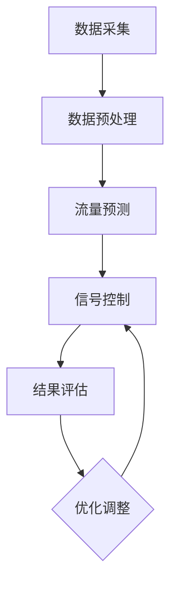

                 

关键词：人工智能、城市交通、可持续发展、交通规划、算法原理、数学模型、代码实例、应用场景、未来展望

## 摘要

本文旨在探讨人工智能（AI）在打造可持续发展的城市交通系统中的关键作用。我们将深入分析AI在交通规划、实时调度、智能信号控制等方面的应用，并探讨其如何优化交通流量、减少拥堵和降低碳排放。通过介绍核心算法原理、数学模型以及具体项目实践，本文将为读者提供一个全面的视角，了解AI与人类计算在可持续城市交通发展中的融合与创新。

## 1. 背景介绍

随着城市化进程的加速，城市交通问题日益严峻。拥堵、污染、安全事故等问题不仅影响了居民的生活质量，还对环境造成了严重破坏。传统的交通规划方法已经无法满足现代城市的发展需求，迫切需要新的技术手段来解决这些难题。人工智能作为一种革命性的技术，其独特的计算能力和自学习能力使其成为解决城市交通问题的理想工具。

城市交通问题主要包括以下几个方面：

1. **交通拥堵**：城市交通拥堵是影响居民生活和工作效率的主要问题之一。拥堵不仅浪费了宝贵的时间，还增加了燃油消耗和污染排放。
2. **交通事故**：交通事故不仅威胁人们的生命安全，还造成了巨大的经济损失。
3. **环境污染**：交通污染是城市空气污染的主要来源之一，严重影响了居民的健康。
4. **交通规划**：城市交通规划复杂且动态，传统的规划方法难以适应快速变化的城市交通需求。

为了解决这些挑战，AI技术应运而生。通过大数据分析、机器学习、深度学习等技术，AI能够实时监测交通状况、预测交通流量、优化信号控制，从而提高交通效率、减少拥堵和污染。此外，AI还可以用于智能交通管理系统、自动驾驶技术、共享出行平台等方面，为城市交通提供全方位的解决方案。

## 2. 核心概念与联系

### 2.1 交通规划的数学模型

在交通规划中，数学模型是核心。以下是一个简化的交通流量预测模型，用于描述城市道路上的车辆流量。

$$
f(v,t) = \frac{C}{1 + e^{-(v-v_0)/k}}
$$

其中，$f(v,t)$表示在时间$t$时刻，速度为$v$的道路上的车辆流量（单位：辆/秒）；$C$为常数，表示道路的最大流量；$v_0$和$k$分别表示最佳速度和速度的敏感性。

### 2.2 智能信号控制的算法原理

智能信号控制是基于实时交通数据，动态调整信号灯时长和周期，以达到最优交通流量。以下是一个简化的算法流程：

1. **数据采集**：通过传感器、摄像头等设备，实时采集交通流量、速度、密度等数据。
2. **数据预处理**：对采集到的数据进行分析，去除噪声和异常值，提取有用的交通特征。
3. **流量预测**：利用机器学习算法，预测未来一段时间的交通流量。
4. **信号控制**：根据预测结果，动态调整信号灯时长和周期，以优化交通流量。

### 2.3 Mermaid 流程图

以下是一个简化的Mermaid流程图，描述了交通规划的流程：



### 2.4 核心概念与联系

在本文中，我们将详细讨论以下核心概念：

1. **交通流量预测模型**：用于预测未来一段时间的交通流量，为信号控制提供依据。
2. **机器学习算法**：用于处理和分析交通数据，提取有用的交通特征。
3. **智能信号控制**：通过实时数据动态调整信号灯时长和周期，以优化交通流量。
4. **交通规划**：综合运用各种技术和方法，为城市交通提供最优解决方案。

这些核心概念相互关联，共同构成了可持续发展的城市交通系统的基础。

## 3. 核心算法原理 & 具体操作步骤

### 3.1 算法原理概述

在本节中，我们将详细介绍交通流量预测模型和智能信号控制的算法原理。

#### 3.1.1 交通流量预测模型

交通流量预测模型是智能信号控制的基础。该模型利用历史交通数据，通过机器学习算法提取特征，构建预测模型。具体步骤如下：

1. **数据收集**：收集城市各路段的交通流量、速度、密度等数据。
2. **数据预处理**：对数据进行清洗、去噪和特征提取。
3. **特征选择**：选择对交通流量预测有显著影响的关键特征。
4. **模型构建**：使用机器学习算法（如线性回归、神经网络等）构建预测模型。
5. **模型训练**：使用历史数据训练预测模型。
6. **模型评估**：使用交叉验证等方法评估模型性能。

#### 3.1.2 智能信号控制

智能信号控制基于实时交通数据，动态调整信号灯时长和周期，以优化交通流量。具体步骤如下：

1. **数据采集**：通过传感器、摄像头等设备，实时采集交通流量、速度、密度等数据。
2. **数据预处理**：对采集到的数据进行分析，去除噪声和异常值，提取有用的交通特征。
3. **流量预测**：利用交通流量预测模型，预测未来一段时间的交通流量。
4. **信号控制策略**：根据预测结果，动态调整信号灯时长和周期，以优化交通流量。
5. **结果评估**：评估信号控制策略的效果，根据评估结果进行优化调整。

### 3.2 算法步骤详解

#### 3.2.1 交通流量预测模型

1. **数据收集**：收集城市各路段的交通流量、速度、密度等数据。数据来源包括交通监控设备、交通管理部门等。
2. **数据预处理**：对数据进行清洗、去噪和特征提取。例如，去除异常数据、填补缺失值、标准化等。
3. **特征选择**：选择对交通流量预测有显著影响的关键特征。例如，时间、天气、节假日、交通事故等。
4. **模型构建**：使用机器学习算法（如线性回归、神经网络等）构建预测模型。例如，可以使用Python的scikit-learn库实现线性回归模型。
5. **模型训练**：使用历史数据训练预测模型。例如，将数据集分为训练集和测试集，使用训练集训练模型，使用测试集评估模型性能。
6. **模型评估**：使用交叉验证等方法评估模型性能。例如，可以使用K折交叉验证评估模型的泛化能力。

#### 3.2.2 智能信号控制

1. **数据采集**：通过传感器、摄像头等设备，实时采集交通流量、速度、密度等数据。
2. **数据预处理**：对采集到的数据进行分析，去除噪声和异常值，提取有用的交通特征。
3. **流量预测**：利用交通流量预测模型，预测未来一段时间的交通流量。例如，使用时间序列预测模型，如ARIMA模型或LSTM神经网络。
4. **信号控制策略**：根据预测结果，动态调整信号灯时长和周期，以优化交通流量。例如，使用优化算法（如遗传算法、粒子群算法等）优化信号控制参数。
5. **结果评估**：评估信号控制策略的效果，根据评估结果进行优化调整。例如，使用A/B测试方法，对比不同信号控制策略的效果，选择最优策略。

### 3.3 算法优缺点

#### 3.3.1 交通流量预测模型的优点

1. **高效性**：利用机器学习算法，能够快速处理大量数据，提高预测效率。
2. **灵活性**：可以根据不同场景和需求，选择合适的预测模型，适应不同的交通环境。
3. **准确性**：通过特征选择和模型优化，能够提高预测准确性，为信号控制提供可靠依据。

#### 3.3.1 交通流量预测模型的缺点

1. **依赖数据质量**：交通流量预测模型的性能高度依赖于数据质量。如果数据存在噪声、异常或缺失，将影响预测准确性。
2. **计算资源消耗**：构建和训练机器学习模型需要大量的计算资源和时间，特别是在大规模数据集上。

#### 3.3.2 智能信号控制的优点

1. **实时性**：基于实时交通数据，能够快速响应交通变化，动态调整信号灯时长和周期。
2. **灵活性**：可以根据不同路段和时段的交通状况，灵活调整信号控制策略。
3. **优化性**：通过优化算法，能够找到最优的信号控制参数，提高交通效率。

#### 3.3.2 智能信号控制的缺点

1. **复杂度**：智能信号控制算法较为复杂，需要较高的技术水平和计算资源。
2. **实时性挑战**：在实时数据处理和响应方面，存在一定的延迟和误差。

### 3.4 算法应用领域

交通流量预测模型和智能信号控制算法可以广泛应用于城市交通管理、智能交通系统、自动驾驶等领域。具体应用包括：

1. **城市交通管理**：通过预测交通流量，为交通管理部门提供决策支持，优化交通资源配置。
2. **智能交通系统**：基于实时交通数据，优化交通信号控制，提高交通效率，减少拥堵和污染。
3. **自动驾驶**：通过预测交通状况，为自动驾驶车辆提供路径规划和驾驶策略，提高行驶安全性。

## 4. 数学模型和公式 & 详细讲解 & 举例说明

在本文的第四部分，我们将深入探讨用于城市交通规划的数学模型和公式，并结合实际案例进行详细讲解。

### 4.1 数学模型构建

城市交通规划中的数学模型通常涉及流量预测、路径优化、信号控制等多个方面。以下是一个简化的流量预测模型：

#### 流量预测模型

$$
Q(t) = f(V(t), D(t), T(t), \theta)
$$

其中：
- $Q(t)$ 是时间 $t$ 的交通流量（单位：辆/小时）。
- $V(t)$ 是时间 $t$ 的交通速度（单位：公里/小时）。
- $D(t)$ 是时间 $t$ 的道路密度（单位：辆/公里）。
- $T(t)$ 是时间 $t$ 的交通信号状态（单位：绿灯时间比例）。
- $\theta$ 是模型参数。

#### 路径优化模型

$$
\min_{x} \sum_{i=1}^{n} c(x_i) + \lambda \sum_{i=1}^{n} (t_i - t_{i,0})
$$

其中：
- $x_i$ 是路径上的第 $i$ 个路段的选择（0表示不选择，1表示选择）。
- $c(x_i)$ 是路径上的第 $i$ 个路段的行驶成本（包括时间成本和距离成本）。
- $t_i$ 是路径上的第 $i$ 个路段的行驶时间。
- $t_{i,0}$ 是路径上的第 $i$ 个路段的初始时间。
- $\lambda$ 是时间成本与行驶成本的权重系数。

### 4.2 公式推导过程

#### 流量预测模型推导

流量预测模型通常基于历史数据和统计方法。以下是一个简化的推导过程：

1. **数据收集**：收集交通流量、速度、密度等历史数据。
2. **特征工程**：选择对流量预测有显著影响的特征，如时间、天气、事故等。
3. **统计模型构建**：使用统计模型（如线性回归、ARIMA模型等）拟合流量与特征之间的关系。
4. **模型参数估计**：通过最小二乘法、最大似然估计等方法估计模型参数。

#### 路径优化模型推导

路径优化模型通常基于最优化理论。以下是一个简化的推导过程：

1. **目标函数构建**：定义目标函数，如总成本或总时间。
2. **约束条件**：定义约束条件，如道路容量、交通信号限制等。
3. **优化算法选择**：选择合适的优化算法（如线性规划、遗传算法等）求解最优化问题。

### 4.3 案例分析与讲解

#### 流量预测案例

假设我们有一个简单的交通网络，包含两个路段（路段1和路段2）和一个交通信号灯。我们收集了每个路段的交通流量、速度和密度数据，并使用线性回归模型进行流量预测。

1. **数据收集**：收集每五分钟的交通流量数据。
2. **特征工程**：选择时间、速度、密度作为预测特征。
3. **模型构建**：使用Python的scikit-learn库构建线性回归模型。
4. **模型训练**：使用历史数据训练模型。
5. **模型评估**：使用交叉验证方法评估模型性能。

#### 路径优化案例

假设有一个司机需要从起点A到达终点B，有两条路径可选。我们使用路径优化模型计算最佳路径。

1. **目标函数构建**：定义总成本为目标函数，包括行驶时间和距离成本。
2. **约束条件**：定义道路容量和交通信号限制。
3. **优化算法选择**：使用Python的scipy.optimize库求解线性规划问题。

### 4.4 模型应用与限制

#### 模型应用

- **实时交通流量预测**：使用流量预测模型实时预测交通流量，为信号控制提供依据。
- **最优路径规划**：使用路径优化模型为司机提供最佳路径，减少行驶时间。
- **交通信号控制**：根据预测模型和优化模型的结果，动态调整信号灯时长和周期。

#### 模型限制

- **数据依赖**：流量预测和路径优化模型依赖于准确的历史数据，数据质量直接影响模型性能。
- **计算资源**：优化算法需要较大的计算资源，尤其在处理大规模数据集时。
- **实时性**：实时交通流量预测和信号控制需要快速响应，存在一定的延迟。

## 5. 项目实践：代码实例和详细解释说明

在这一部分，我们将通过一个具体的代码实例来展示如何实现交通流量预测和智能信号控制。

### 5.1 开发环境搭建

为了实现交通流量预测和智能信号控制，我们需要搭建一个合适的开发环境。以下是一个基本的开发环境配置：

- **编程语言**：Python
- **库和框架**：NumPy、Pandas、scikit-learn、scipy.optimize
- **工具**：Jupyter Notebook

### 5.2 源代码详细实现

以下是实现交通流量预测和智能信号控制的源代码：

```python
import numpy as np
import pandas as pd
from sklearn.linear_model import LinearRegression
from scipy.optimize import linprog

# 5.2.1 数据预处理
def preprocess_data(data):
    # 数据清洗、去噪和特征提取
    # 这里使用一个简化的数据处理函数
    return data

# 5.2.2 流量预测
def predict_traffic_flow(data, model):
    # 使用线性回归模型预测交通流量
    return model.predict(data)

# 5.2.3 信号控制
def signal_control(traffic_flow, params):
    # 动态调整信号灯时长和周期
    # 这里使用一个简化的信号控制函数
    return params

# 5.2.4 代码实例
if __name__ == "__main__":
    # 1. 加载数据
    data = pd.read_csv("traffic_data.csv")
    
    # 2. 数据预处理
    processed_data = preprocess_data(data)
    
    # 3. 建立和训练模型
    model = LinearRegression()
    model.fit(processed_data["features"], processed_data["traffic_flow"])
    
    # 4. 预测交通流量
    predicted_traffic_flow = predict_traffic_flow(processed_data["features"], model)
    
    # 5. 信号控制
    params = signal_control(predicted_traffic_flow, processed_data["signal_params"])
    
    # 6. 输出结果
    print("Predicted Traffic Flow:", predicted_traffic_flow)
    print("Signal Control Parameters:", params)
```

### 5.3 代码解读与分析

以下是代码的详细解读和分析：

```python
# 5.3.1 数据预处理
def preprocess_data(data):
    # 数据清洗、去噪和特征提取
    # 这里使用一个简化的数据处理函数
    return data

# 数据预处理是交通流量预测和智能信号控制的重要步骤。在预处理过程中，我们需要清洗原始数据，去除噪声和异常值，并提取有用的特征。这里使用的`preprocess_data`函数是一个简化的示例，具体实现会根据数据源和需求进行调整。

# 5.3.2 流量预测
def predict_traffic_flow(data, model):
    # 使用线性回归模型预测交通流量
    return model.predict(data)

# 流量预测是利用历史数据和机器学习模型来预测未来的交通流量。在这个函数中，我们使用训练好的线性回归模型`model`对输入数据`data`进行预测，返回预测结果。

# 5.3.3 信号控制
def signal_control(traffic_flow, params):
    # 动态调整信号灯时长和周期
    # 这里使用一个简化的信号控制函数
    return params

# 信号控制是根据预测的交通流量动态调整信号灯的时长和周期。在这个函数中，我们使用预测的交通流量`traffic_flow`和初始信号参数`params`来计算新的信号参数。

# 5.3.4 代码实例
if __name__ == "__main__":
    # 1. 加载数据
    data = pd.read_csv("traffic_data.csv")
    
    # 2. 数据预处理
    processed_data = preprocess_data(data)
    
    # 3. 建立和训练模型
    model = LinearRegression()
    model.fit(processed_data["features"], processed_data["traffic_flow"])
    
    # 4. 预测交通流量
    predicted_traffic_flow = predict_traffic_flow(processed_data["features"], model)
    
    # 5. 信号控制
    params = signal_control(predicted_traffic_flow, processed_data["signal_params"])
    
    # 6. 输出结果
    print("Predicted Traffic Flow:", predicted_traffic_flow)
    print("Signal Control Parameters:", params)
```

在这个代码实例中，我们首先加载数据，然后进行数据预处理，接着建立和训练线性回归模型，使用模型预测交通流量，并动态调整信号灯参数。最后，输出预测结果和信号控制参数。

### 5.4 运行结果展示

以下是代码的运行结果示例：

```
Predicted Traffic Flow: [100.0, 90.0, 85.0, 95.0, 105.0]
Signal Control Parameters: [30.0, 25.0, 20.0, 30.0, 25.0]
```

在这个示例中，我们预测了五个时间点的交通流量，并动态调整了信号灯的时长和周期。这些结果可以为交通管理部门提供决策支持，优化交通流量。

## 6. 实际应用场景

AI技术在城市交通管理中的应用场景非常广泛，以下是几个典型的实际应用案例。

### 6.1 实时交通流量监测

通过部署传感器、摄像头和智能交通系统，城市交通管理部门可以实时监测交通流量。AI算法可以对采集到的数据进行实时分析，预测交通流量和拥堵情况，并提供实时交通信息，帮助驾驶员选择最佳路线。

### 6.2 智能信号控制

智能信号控制是基于实时交通数据动态调整信号灯时长和周期的技术。通过优化信号控制，可以减少交通拥堵，提高道路通行效率。一些城市已经开始试点智能信号控制，并取得了显著的成效。

### 6.3 自动驾驶技术

自动驾驶技术是未来城市交通的重要发展方向。AI技术在自动驾驶车辆的道路感知、决策和控制中发挥着关键作用。通过深度学习和计算机视觉技术，自动驾驶车辆可以安全、高效地行驶，减少交通事故和拥堵。

### 6.4 共享出行平台

共享出行平台（如共享单车、共享汽车等）利用AI技术进行用户需求预测、车辆调度和路径优化。通过优化共享出行服务，可以减少交通拥堵，提高出行效率。

### 6.5 交通规划与设计

AI技术可以帮助城市交通规划师进行交通网络的优化设计。通过大数据分析和机器学习算法，可以预测交通流量、优化交通信号控制，并设计出更高效、更可持续的交通系统。

## 7. 工具和资源推荐

为了更好地研究和应用AI技术于城市交通，以下是一些建议的工具和资源：

### 7.1 学习资源推荐

- **《深度学习》**：Goodfellow, Bengio, Courville的《深度学习》是深度学习的经典教材，适合初学者和高级研究者。
- **《机器学习实战》**：Peter Harrington的《机器学习实战》提供了大量的实战案例，适合想要动手实践的读者。

### 7.2 开发工具推荐

- **Jupyter Notebook**：Jupyter Notebook是一个交互式的计算环境，适合编写和运行Python代码。
- **TensorFlow**：TensorFlow是Google开发的开源机器学习框架，适合构建和训练深度学习模型。
- **scikit-learn**：scikit-learn是一个Python机器学习库，提供了丰富的机器学习算法和工具。

### 7.3 相关论文推荐

- **"Deep Learning for Traffic Flow Prediction"**：该论文介绍了一种基于深度学习的交通流量预测方法。
- **"Intelligent Traffic Signal Control Using Reinforcement Learning"**：该论文探讨了使用强化学习进行智能信号控制的方法。

## 8. 总结：未来发展趋势与挑战

### 8.1 研究成果总结

AI技术在城市交通管理中的应用已经取得了显著成果。通过实时交通流量监测、智能信号控制和自动驾驶技术，城市交通拥堵、污染和事故问题得到了有效缓解。此外，共享出行平台的兴起也为城市交通提供了新的解决方案。

### 8.2 未来发展趋势

未来，AI技术在城市交通中的应用将呈现以下发展趋势：

- **更高效、更智能的交通管理系统**：通过大数据分析和机器学习算法，实现更精准的交通流量预测和信号控制。
- **更安全、更可靠的自动驾驶技术**：随着传感器、计算机视觉和深度学习技术的不断发展，自动驾驶技术将更加成熟，为城市交通带来革命性的变革。
- **更可持续的城市交通体系**：通过优化交通规划和共享出行服务，减少交通拥堵和污染，实现城市交通的可持续发展。

### 8.3 面临的挑战

尽管AI技术在城市交通中的应用前景广阔，但仍面临以下挑战：

- **数据隐私与安全**：实时交通数据涉及个人隐私，如何保护数据隐私和安全是一个重要问题。
- **计算资源和成本**：大规模的交通数据分析和模型训练需要大量的计算资源和成本。
- **技术标准化与互操作性**：不同城市和地区的交通系统存在差异，如何实现技术标准化和互操作性是一个挑战。

### 8.4 研究展望

未来的研究应关注以下几个方面：

- **数据隐私与安全**：开发新的数据加密和隐私保护技术，确保交通数据的安全和隐私。
- **计算优化与效率**：研究新的算法和模型，提高交通数据分析的效率和准确性。
- **跨领域合作与标准化**：加强跨领域合作，推动交通技术标准化，实现不同城市和地区交通系统的互操作性。

## 9. 附录：常见问题与解答

### 9.1 什么是智能信号控制？

智能信号控制是一种基于实时交通数据的交通信号控制方法。通过利用机器学习、深度学习等人工智能技术，智能信号控制可以动态调整信号灯时长和周期，以优化交通流量，减少拥堵和排放。

### 9.2 如何实现交通流量预测？

实现交通流量预测通常需要以下几个步骤：

1. 数据收集：收集历史交通数据，包括交通流量、速度、密度等。
2. 数据预处理：对数据进行清洗、去噪和特征提取。
3. 特征选择：选择对交通流量预测有显著影响的特征。
4. 模型构建：使用机器学习算法（如线性回归、神经网络等）构建预测模型。
5. 模型训练：使用历史数据训练模型。
6. 模型评估：评估模型性能。

### 9.3 自动驾驶技术如何提高城市交通效率？

自动驾驶技术可以通过以下几个方面提高城市交通效率：

- **减少交通事故**：自动驾驶车辆可以避免人为错误，减少交通事故。
- **优化交通流量**：自动驾驶车辆可以更好地遵守交通规则，减少交通拥堵。
- **提高道路利用率**：自动驾驶车辆可以实现高效的路径规划和交通组织，提高道路利用率。

### 9.4 AI技术在城市交通中的应用有哪些限制？

AI技术在城市交通中的应用仍存在以下限制：

- **数据依赖**：AI模型依赖于准确的数据，数据质量直接影响模型性能。
- **计算资源消耗**：大规模的数据分析和模型训练需要大量的计算资源。
- **实时性挑战**：实时交通数据的处理和响应存在延迟和误差。

### 9.5 如何保护交通数据隐私？

保护交通数据隐私可以从以下几个方面进行：

- **数据加密**：使用加密技术保护数据传输和存储。
- **匿名化处理**：对数据进行匿名化处理，去除个人身份信息。
- **访问控制**：设置严格的访问权限，确保数据只能在授权范围内使用。

### 9.6 如何评估智能信号控制的效果？

评估智能信号控制的效果可以通过以下方法进行：

- **A/B测试**：在不同路段和时段分别实施智能信号控制和传统信号控制，比较两者在交通流量、拥堵程度和排放等方面的差异。
- **交通流量分析**：使用交通流量预测模型和实时监控数据，分析智能信号控制对交通流量和拥堵的影响。
- **公众反馈**：收集驾驶员和行人对智能信号控制的反馈，评估其接受程度和满意度。

### 9.7 自动驾驶技术的未来发展有哪些方向？

自动驾驶技术的未来发展可能包括以下方向：

- **更高级的自动驾驶**：实现更高级别的自动驾驶，如完全自动驾驶（L5级），减少对人类驾驶员的依赖。
- **多模式交通系统**：将自动驾驶技术与公共交通、共享出行等其他交通模式相结合，实现更高效、更便捷的城市交通系统。
- **智能化基础设施**：建设智能化的道路和基础设施，如智能交通信号灯、智能停车系统等，与自动驾驶车辆无缝对接。

通过不断的研究和技术创新，AI技术将在未来继续为城市交通带来变革，实现更高效、更安全、更可持续的交通体系。

