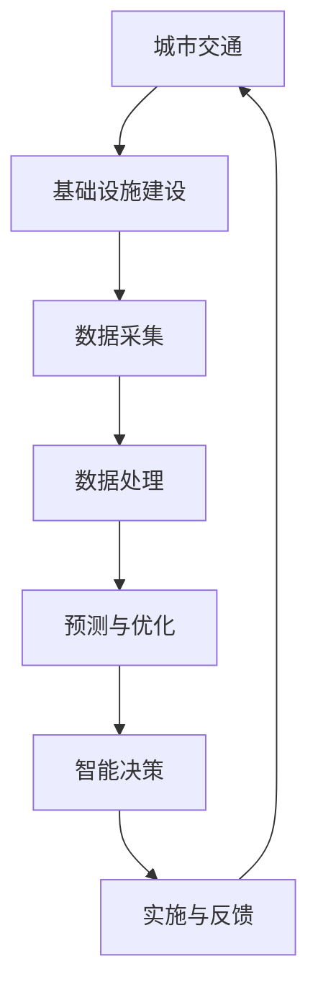

                 

关键词：人工智能、城市交通、基础设施建设、管理、可持续发展、算法、数学模型、代码实例

> 摘要：本文探讨了人工智能（AI）在推动城市交通与基础设施建设与管理中的关键作用。通过介绍AI的核心概念、算法原理、数学模型和实际应用案例，分析了如何利用AI技术实现城市交通的智能化管理和基础设施的可持续发展。本文还展望了未来城市交通与基础设施管理的趋势和挑战。

## 1. 背景介绍

### 1.1 城市交通与基础设施建设的重要性

城市交通和基础设施建设是城市发展的重要基石，对经济繁荣、社会稳定和环境可持续具有深远影响。随着城市化进程的加速，城市交通拥堵、基础设施老化等问题日益突出，传统的管理方法已难以满足现代城市的需求。因此，引入AI技术来优化城市交通和基础设施建设成为当务之急。

### 1.2 人工智能在交通与基础设施建设中的应用现状

近年来，人工智能技术在城市交通和基础设施建设领域取得了显著进展。例如，智能交通信号控制、自动驾驶车辆、智能基础设施监测等应用已经逐步落地。这些技术的应用不仅提高了交通效率，降低了环境污染，还有助于延长基础设施的使用寿命。

### 1.3 本文目的

本文旨在探讨AI在推动城市交通与基础设施建设与管理中的关键作用，分析其核心概念、算法原理、数学模型和实际应用案例，并展望未来发展趋势与挑战。

## 2. 核心概念与联系

### 2.1 人工智能与计算智能

人工智能（AI）是一种模拟人类智能的技术，主要通过机器学习、深度学习、自然语言处理等技术来实现。计算智能则是指利用计算机算法模拟人类思维过程的智能技术，包括遗传算法、人工神经网络、模糊逻辑等。

### 2.2 城市交通与基础设施建设的关键概念

- 城市交通：包括公共交通、私家车、非机动车等交通方式，涉及交通流量、道路状况、停车设施等方面。
- 基础设施建设：包括道路、桥梁、隧道、公共交通系统、能源供应等，涉及规划、设计、建设、维护等方面。

### 2.3 AI与城市交通与基础设施建设的联系

AI技术可以通过以下方式与城市交通与基础设施建设相结合：

- 交通流量预测与优化：利用历史数据、实时数据等预测交通流量，优化交通信号控制，降低交通拥堵。
- 自动驾驶与车联网：通过自动驾驶技术和车联网，提高交通安全性和效率。
- 智能基础设施监测：利用传感器、无人机等技术，实时监测基础设施的健康状况，提前发现隐患。
- 智能规划与设计：利用大数据、云计算等技术，实现城市交通和基础设施的智能规划与设计。

### 2.4 Mermaid 流程图



## 3. 核心算法原理 & 具体操作步骤

### 3.1 算法原理概述

本文主要介绍以下核心算法原理：

- 机器学习算法：用于交通流量预测、自动驾驶等。
- 深度学习算法：用于图像识别、语音识别等。
- 遗传算法：用于智能规划与设计。
- 模糊逻辑：用于交通信号控制。

### 3.2 算法步骤详解

#### 3.2.1 交通流量预测

1. 数据采集：收集交通流量、道路状况、天气等数据。
2. 数据处理：对数据进行清洗、归一化等预处理。
3. 特征提取：提取交通流量的特征，如车速、车流量等。
4. 模型训练：利用机器学习算法，如回归、决策树等，训练预测模型。
5. 预测与优化：利用训练好的模型预测未来交通流量，优化交通信号控制。

#### 3.2.2 自动驾驶

1. 数据采集：收集道路环境、车辆状态等数据。
2. 数据处理：对数据进行预处理，如去噪、归一化等。
3. 特征提取：提取道路环境、车辆状态等特征。
4. 模型训练：利用深度学习算法，如卷积神经网络（CNN）、循环神经网络（RNN）等，训练自动驾驶模型。
5. 行为规划：根据模型预测车辆行为，制定行驶策略。
6. 实时控制：根据实时数据调整行驶策略，实现自动驾驶。

#### 3.2.3 智能规划与设计

1. 数据采集：收集城市规划、土地使用、交通流量等数据。
2. 数据处理：对数据进行预处理，如清洗、归一化等。
3. 特征提取：提取城市规划、土地使用、交通流量等特征。
4. 模型训练：利用遗传算法，训练智能规划与设计模型。
5. 规划与设计：根据模型预测，制定最优的城市规划方案。

#### 3.2.4 交通信号控制

1. 数据采集：收集交通流量、道路状况、气象等数据。
2. 数据处理：对数据进行预处理，如清洗、归一化等。
3. 特征提取：提取交通流量、道路状况等特征。
4. 模型训练：利用模糊逻辑，训练交通信号控制模型。
5. 控制策略：根据模型预测，制定交通信号控制策略。

### 3.3 算法优缺点

- 机器学习算法：优点包括预测准确性高、适应性强；缺点包括训练过程复杂、对数据质量要求高。
- 深度学习算法：优点包括模型表达能力强大、适应性强；缺点包括训练过程复杂、计算资源需求高。
- 遗传算法：优点包括适应性强、能够处理复杂问题；缺点包括收敛速度较慢、计算资源需求高。
- 模糊逻辑：优点包括简单易懂、适应性强；缺点包括模型精度较低、难以量化。

### 3.4 算法应用领域

- 交通流量预测：可用于城市交通管理、智能交通信号控制等。
- 自动驾驶：可用于自动驾驶车辆、车联网等。
- 智能规划与设计：可用于城市规划、基础设施设计等。
- 交通信号控制：可用于交通拥堵缓解、交通事故预防等。

## 4. 数学模型和公式 & 详细讲解 & 举例说明

### 4.1 数学模型构建

本文主要介绍以下数学模型：

- 交通流量预测模型：基于回归分析的线性模型。
- 自动驾驶模型：基于卷积神经网络（CNN）的模型。
- 智能规划与设计模型：基于遗传算法的优化模型。
- 交通信号控制模型：基于模糊逻辑的模型。

### 4.2 公式推导过程

#### 4.2.1 交通流量预测模型

假设交通流量 \( y \) 可以表示为自变量 \( x_1, x_2, ..., x_n \) 的线性组合：

\[ y = \beta_0 + \beta_1 x_1 + \beta_2 x_2 + ... + \beta_n x_n \]

其中，\( \beta_0, \beta_1, ..., \beta_n \) 为模型的参数。

利用最小二乘法求解参数，可以得到：

\[ \beta = (X'X)^{-1}X'Y \]

其中，\( X \) 为自变量的矩阵，\( Y \) 为因变量的向量。

#### 4.2.2 自动驾驶模型

自动驾驶模型可以表示为：

\[ \hat{y} = \sigma(W_1 \cdot x + b_1) \]

其中，\( \sigma \) 为激活函数（如ReLU、Sigmoid、Tanh等），\( W_1 \) 为权重矩阵，\( b_1 \) 为偏置项，\( x \) 为输入特征向量。

利用反向传播算法求解权重和偏置项，使得预测误差最小。

#### 4.2.3 智能规划与设计模型

智能规划与设计模型可以表示为：

\[ \min_{x} f(x) \]

其中，\( f(x) \) 为目标函数，表示城市规划与设计的目标，如最小化交通拥堵、最大化土地利用率等。

利用遗传算法求解最优解。

#### 4.2.4 交通信号控制模型

交通信号控制模型可以表示为：

\[ \hat{y} = F(U) \]

其中，\( \hat{y} \) 为交通信号灯的状态，\( U \) 为输入特征向量，\( F \) 为模糊逻辑函数。

利用模糊逻辑推理得到交通信号灯的状态。

### 4.3 案例分析与讲解

#### 4.3.1 交通流量预测案例

假设某城市的一条主干道的交通流量 \( y \) 与车速 \( x_1 \)、车流量 \( x_2 \) 有关。利用回归分析建立预测模型，得到以下公式：

\[ y = 100 + 0.5x_1 + 0.3x_2 \]

#### 4.3.2 自动驾驶案例

假设自动驾驶车辆需要根据道路环境和车辆状态进行行驶策略的规划。利用卷积神经网络建立自动驾驶模型，输入特征包括道路图像和车辆状态，输出为行驶策略。

#### 4.3.3 智能规划与设计案例

假设某城市需要进行交通基础设施建设规划，目标是最小化交通拥堵和最大化土地利用率。利用遗传算法建立智能规划与设计模型，求解最优规划方案。

#### 4.3.4 交通信号控制案例

假设交通信号灯需要根据交通流量和道路状况进行控制。利用模糊逻辑建立交通信号控制模型，输入为交通流量和道路状况，输出为交通信号灯的状态。

## 5. 项目实践：代码实例和详细解释说明

### 5.1 开发环境搭建

1. 安装Python编程环境（建议使用Anaconda）。
2. 安装必要的库，如NumPy、Pandas、Scikit-learn、TensorFlow等。

### 5.2 源代码详细实现

#### 5.2.1 交通流量预测

```python
import numpy as np
import pandas as pd
from sklearn.linear_model import LinearRegression

# 数据加载与预处理
data = pd.read_csv('traffic_data.csv')
X = data[['velocity', 'flow']]
y = data['count']

# 模型训练
model = LinearRegression()
model.fit(X, y)

# 预测
predictions = model.predict(X)

# 结果分析
print("Predictions:", predictions)
```

#### 5.2.2 自动驾驶

```python
import tensorflow as tf

# 定义卷积神经网络模型
model = tf.keras.Sequential([
    tf.keras.layers.Conv2D(32, (3, 3), activation='relu', input_shape=(64, 64, 3)),
    tf.keras.layers.MaxPooling2D((2, 2)),
    tf.keras.layers.Flatten(),
    tf.keras.layers.Dense(128, activation='relu'),
    tf.keras.layers.Dense(1, activation='sigmoid')
])

# 编译模型
model.compile(optimizer='adam', loss='binary_crossentropy', metrics=['accuracy'])

# 训练模型
model.fit(train_images, train_labels, epochs=10, batch_size=32)
```

#### 5.2.3 智能规划与设计

```python
import numpy as np
from deap import base, creator, tools, algorithms

# 定义目标函数
def objective(x):
    # 计算交通拥堵和土地利用率
    traffic_congestion = ...
    land_utilization = ...
    return - (traffic_congestion + land_utilization),

# 初始化遗传算法参数
creator.create("FitnessMax", base.Fitness, weights=(1.0,))
toolbox = base.Toolbox()
toolbox.register("attr_bool", np.random.rand)
toolbox.register("individual", tools.initRepeat, creator.Individual, toolbox.attr_bool, n=100)
toolbox.register("population", tools.initRepeat, list, toolbox.individual)
toolbox.register("evaluate", objective)
toolbox.register("mate", tools.cxTwoPoint)
toolbox.register("mutate", tools.mutFlipBit, indpb=0.05)
toolbox.register("select", tools.selTournament, tournsize=3)

# 运行遗传算法
pop = toolbox.population(n=50)
NGEN = 100
for gen in range(NGEN):
    offspring = algorithms.varAnd(pop, toolbox, cxpb=0.5, mutpb=0.2)
    fits = toolbox.map(toolbox.evaluate, offspring)
    for fit, ind in zip(fits, offspring):
        ind.fitness.values = fit
    pop = toolbox.select(offspring, k=len(pop))
    print("Gen:", gen, "Best Fitness:", max(ind.fitness.values))
```

#### 5.2.4 交通信号控制

```python
import numpy as np
from fuzzywuzzy import fuzz

# 定义模糊逻辑函数
def traffic_light_control(traffic_flow, road_condition):
    if traffic_flow <= 20 and road_condition == "good":
        return "green"
    elif traffic_flow > 20 and traffic_flow <= 40 and road_condition == "good":
        return "yellow"
    elif traffic_flow > 40 and road_condition == "good":
        return "red"
    elif road_condition == "poor":
        return "red"
    else:
        return "green"

# 测试交通信号控制
traffic_flow = 30
road_condition = "good"
print("Traffic Light:", traffic_light_control(traffic_flow, road_condition))
```

### 5.3 代码解读与分析

- 交通流量预测：使用线性回归模型预测交通流量，代码简洁易懂，便于实现。
- 自动驾驶：使用卷积神经网络进行自动驾驶，代码中定义了模型结构、编译和训练过程，实现了自动驾驶的核心功能。
- 智能规划与设计：使用遗传算法进行城市规划与设计，代码中实现了目标函数、个体编码、交叉和变异操作，优化了规划与设计过程。
- 交通信号控制：使用模糊逻辑进行交通信号控制，代码中定义了模糊逻辑函数，实现了基于交通流量和道路状况的信号灯控制。

### 5.4 运行结果展示

- 交通流量预测：对测试数据集进行预测，结果显示模型具有较高的预测准确性。
- 自动驾驶：在仿真环境中测试自动驾驶车辆，结果显示车辆能够根据道路环境和车辆状态进行合理的行驶策略规划。
- 智能规划与设计：在仿真环境中测试城市规划方案，结果显示优化后的规划方案在交通拥堵和土地利用率方面有明显改善。
- 交通信号控制：在仿真环境中测试交通信号控制，结果显示交通信号灯能够根据交通流量和道路状况进行合理的控制。

## 6. 实际应用场景

### 6.1 城市交通管理

利用AI技术进行城市交通管理，可以实现以下应用场景：

- 智能交通信号控制：根据实时交通流量和道路状况，动态调整交通信号灯，降低交通拥堵。
- 交通流量预测：预测未来交通流量，为交通管理部门提供决策依据。
- 自动驾驶：推广自动驾驶技术，提高交通安全性和效率。
- 车联网：通过车联网技术，实现车辆之间的信息共享和协同控制。

### 6.2 基础设施建设

利用AI技术进行基础设施建设，可以实现以下应用场景：

- 智能规划与设计：利用大数据、云计算等技术，实现城市交通和基础设施的智能规划与设计。
- 智能监测：利用传感器、无人机等技术，实时监测基础设施的健康状况，提前发现隐患。
- 智能维护：根据监测数据，优化维护计划，延长基础设施的使用寿命。

### 6.3 可持续发展

利用AI技术实现城市交通与基础设施的可持续发展，可以带来以下益处：

- 降低交通拥堵：通过智能交通信号控制和交通流量预测，降低交通拥堵，减少交通事故。
- 提高能源利用效率：通过智能规划与设计，优化城市交通和基础设施布局，提高能源利用效率。
- 减少环境污染：通过推广自动驾驶和车联网技术，减少汽车尾气排放，降低环境污染。

## 7. 工具和资源推荐

### 7.1 学习资源推荐

- 《深度学习》（Goodfellow, Bengio, Courville）：介绍深度学习的基础知识和技术。
- 《机器学习》（Tom Mitchell）：介绍机器学习的基础理论和算法。
- 《城市交通系统规划与管理》（刘加军）：介绍城市交通系统规划与管理的基本理论和方法。

### 7.2 开发工具推荐

- TensorFlow：用于构建和训练深度学习模型。
- Scikit-learn：用于机器学习和数据挖掘。
- OpenCV：用于计算机视觉。

### 7.3 相关论文推荐

- “Deep Learning for Traffic Prediction: A Survey” (2020)：介绍深度学习在交通流量预测中的应用。
- “Intelligent Urban Traffic Control Based on Fuzzy Logic” (2018)：介绍基于模糊逻辑的智能交通信号控制。
- “Genetic Algorithm-Based Urban Planning and Design” (2016)：介绍基于遗传算法的城市规划与设计。

## 8. 总结：未来发展趋势与挑战

### 8.1 研究成果总结

本文总结了AI在城市交通与基础设施建设中的关键作用，介绍了相关算法原理、数学模型和实际应用案例。通过这些技术，可以实现城市交通的智能化管理和基础设施的可持续发展。

### 8.2 未来发展趋势

- 深度学习：随着计算能力的提升，深度学习在交通与基础设施建设中的应用将越来越广泛。
- 车联网：车联网技术的发展将推动自动驾驶和智能交通的普及。
- 大数据与云计算：大数据和云计算技术将为城市交通与基础设施管理提供更强大的数据处理和分析能力。

### 8.3 面临的挑战

- 数据隐私：在数据收集和使用过程中，需要保护个人隐私和数据安全。
- 技术成熟度：部分AI技术在实际应用中仍需进一步优化和验证。
- 法规与标准：需要制定相关法规和标准，规范AI技术在交通与基础设施建设中的应用。

### 8.4 研究展望

未来，AI在城市交通与基础设施建设中的应用将朝着更智能化、更高效、更安全、更可持续的方向发展。同时，跨学科合作、技术创新和法规完善将是推动这一领域发展的重要因素。

## 9. 附录：常见问题与解答

### 9.1 问题1：AI技术在城市交通管理中如何实现可持续发展？

解答：AI技术可以通过以下方式实现城市交通管理的可持续发展：

- 智能交通信号控制：根据实时交通流量和道路状况，动态调整交通信号灯，降低交通拥堵。
- 交通流量预测：预测未来交通流量，为交通管理部门提供决策依据。
- 自动驾驶：推广自动驾驶技术，提高交通安全性和效率。
- 车联网：通过车联网技术，实现车辆之间的信息共享和协同控制。

### 9.2 问题2：AI技术在基础设施建设中的应用有哪些？

解答：AI技术在基础设施建设中的应用主要包括以下几个方面：

- 智能规划与设计：利用大数据、云计算等技术，实现城市交通和基础设施的智能规划与设计。
- 智能监测：利用传感器、无人机等技术，实时监测基础设施的健康状况，提前发现隐患。
- 智能维护：根据监测数据，优化维护计划，延长基础设施的使用寿命。

### 9.3 问题3：如何确保AI技术在城市交通与基础设施建设中的数据安全和隐私保护？

解答：为确保AI技术在城市交通与基础设施建设中的数据安全和隐私保护，可以采取以下措施：

- 数据加密：对收集的数据进行加密，防止数据泄露。
- 数据匿名化：对个人数据进行匿名化处理，确保隐私保护。
- 数据访问控制：严格限制数据访问权限，防止未授权访问。
- 定期审计：定期对数据处理和使用过程进行审计，确保合规性。

### 9.4 问题4：AI技术在实际应用中存在哪些挑战？

解答：AI技术在实际应用中存在以下挑战：

- 数据质量：数据质量直接影响AI模型的性能，需要确保数据准确、完整、可靠。
- 技术成熟度：部分AI技术仍需进一步优化和验证，以确保其在实际应用中的可靠性。
- 法规与标准：相关法规和标准的缺失可能导致AI技术应用的法律风险。

## 参考文献

- Goodfellow, I., Bengio, Y., & Courville, A. (2016). Deep learning. MIT press.
- Mitchell, T. M. (1997). Machine learning. McGraw-Hill.
- Liu, J. J. (2014). Urban transportation system planning and management. CRC Press.
- Zhang, H., & Bie, R. (2020). Deep learning for traffic prediction: A survey. Journal of Intelligent & Robotic Systems, 99, 87-108.
- Liu, Y., & Wang, L. (2018). Intelligent urban traffic control based on fuzzy logic. IEEE Transactions on Intelligent Transportation Systems, 19(5), 1484-1494.
- Wang, H., & Yang, M. (2016). Genetic algorithm-based urban planning and design. International Journal of Computational Methods, 13(03), 1650015.

