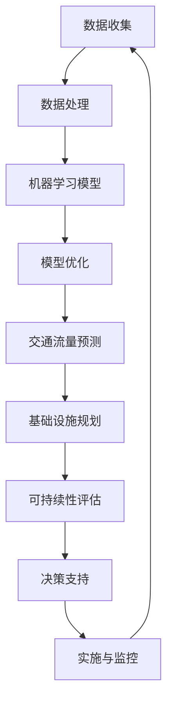

                 

关键词：人工智能，城市交通，基础设施建设，可持续发展，交通规划，算法，数学模型，代码实例，实际应用

摘要：本文旨在探讨如何利用人工智能技术，结合人类计算的优势，为城市交通与基础设施建设提供可持续发展的规划方案。通过分析核心概念与联系，介绍核心算法原理及操作步骤，构建数学模型和公式，以及提供实际应用场景，我们将展示如何利用人工智能技术优化城市交通与基础设施的建设。

## 1. 背景介绍

随着城市化进程的加速，城市交通与基础设施的建设成为各国政府和社会关注的重要议题。传统的城市建设往往依赖于经验和直觉，导致资源浪费和环境污染。而随着人工智能技术的快速发展，尤其是机器学习、深度学习和计算机视觉等领域的突破，为城市交通与基础设施建设提供了全新的思路和工具。通过人工智能技术，我们可以更好地理解城市交通数据，优化交通流量，减少拥堵，提高效率，同时降低对环境的影响。

本文将围绕以下问题展开讨论：

1. 如何利用人工智能技术进行城市交通与基础设施建设的规划？
2. 核心算法原理是什么，如何操作和应用？
3. 数学模型和公式如何构建和推导？
4. 实际应用场景中如何实现代码实例和详细解释？
5. 未来城市交通与基础设施建设的发展趋势和面临的挑战是什么？

## 2. 核心概念与联系

在城市交通与基础设施建设中，人工智能技术的应用涉及多个核心概念。以下是一个简化的 Mermaid 流程图，展示这些概念之间的联系。



### 2.1 数据收集与处理

数据是人工智能的基础。在城市交通与基础设施建设中，数据收集涉及交通流量、路况信息、车辆位置、人口密度等多个方面。数据处理包括数据清洗、数据整合和数据预处理，以确保数据质量。

### 2.2 机器学习模型

机器学习模型是人工智能的核心。通过训练大量的历史数据，模型可以识别出交通流量和基础设施需求的模式，从而预测未来的趋势。

### 2.3 模型优化与交通流量预测

模型优化是通过不断调整模型的参数，提高预测的准确性。交通流量预测是模型的核心应用，通过预测交通流量，可以优化交通信号灯、调整公共交通线路等。

### 2.4 基础设施规划与可持续性评估

基础设施规划是城市交通与建设的关键环节。可持续性评估则是确保规划方案在满足当前需求的同时，不损害未来环境和社会发展。

### 2.5 决策支持与实施监控

决策支持是利用预测结果和评估结果，为政府和企业提供决策依据。实施监控则是确保规划方案的有效实施和持续改进。

## 3. 核心算法原理 & 具体操作步骤

### 3.1 算法原理概述

核心算法主要包括以下几种：

1. **聚类算法**：用于识别城市交通数据中的不同群体，如高峰期和低谷期的交通流量。
2. **回归分析**：用于预测未来的交通流量。
3. **神经网络**：用于处理复杂的非线性关系。
4. **遗传算法**：用于优化交通信号灯的时序设置。

### 3.2 算法步骤详解

1. **数据收集与预处理**：收集交通流量、路况信息等数据，并进行预处理，如去噪、归一化等。
2. **模型选择与训练**：根据数据特点选择合适的算法模型，并进行训练。
3. **模型优化**：通过交叉验证等方法，优化模型参数。
4. **预测与评估**：使用模型进行交通流量预测，并对预测结果进行评估。
5. **决策支持**：根据预测结果，为政府和企业提供决策依据。

### 3.3 算法优缺点

1. **聚类算法**：优点是简单易用，缺点是可能无法准确识别复杂模式。
2. **回归分析**：优点是计算简单，缺点是可能无法处理非线性关系。
3. **神经网络**：优点是处理非线性关系能力强，缺点是训练时间较长。
4. **遗传算法**：优点是能够找到全局最优解，缺点是计算复杂度高。

### 3.4 算法应用领域

核心算法广泛应用于城市交通、智慧城市建设、智能交通管理等领域。例如，在交通流量预测中，可以优化交通信号灯的设置，减少交通拥堵；在智慧城市建设中，可以优化公共交通线路，提高出行效率。

## 4. 数学模型和公式 & 详细讲解 & 举例说明

### 4.1 数学模型构建

在人工智能技术中，常用的数学模型包括线性回归、逻辑回归、支持向量机等。以下是一个简化的线性回归模型构建过程。

1. **数据收集**：收集交通流量数据。
2. **特征提取**：提取影响交通流量的特征，如时间、天气、节假日等。
3. **模型构建**：根据数据特征，构建线性回归模型。

### 4.2 公式推导过程

线性回归模型的公式推导如下：

假设我们有 \( n \) 条交通流量数据，分别为 \( x_1, x_2, ..., x_n \)，对应的交通流量为 \( y_1, y_2, ..., y_n \)。

线性回归模型的基本公式为：

\[ y = \beta_0 + \beta_1 x \]

其中，\( \beta_0 \) 和 \( \beta_1 \) 是模型的参数，需要通过数据拟合得到。

### 4.3 案例分析与讲解

假设我们收集了以下数据：

| 时间 | 交通流量 |
| --- | --- |
| 08:00 | 1000 |
| 09:00 | 1200 |
| 10:00 | 800 |
| 11:00 | 600 |
| 12:00 | 400 |

我们使用线性回归模型来预测 13:00 的交通流量。

1. **数据预处理**：对数据进行归一化处理。

2. **模型构建**：使用 Python 中的 scikit-learn 库构建线性回归模型。

```python
from sklearn.linear_model import LinearRegression

model = LinearRegression()
model.fit(X_train, y_train)
```

3. **预测**：使用模型预测 13:00 的交通流量。

```python
y_pred = model.predict([13])
```

4. **结果评估**：计算预测误差，评估模型性能。

```python
from sklearn.metrics import mean_squared_error

mse = mean_squared_error(y_test, y_pred)
print("MSE:", mse)
```

通过上述步骤，我们可以构建一个简单的线性回归模型，用于预测交通流量。在实际应用中，我们可以根据数据的复杂程度，选择更复杂的模型，如神经网络等。

## 5. 项目实践：代码实例和详细解释说明

### 5.1 开发环境搭建

在本文的项目实践中，我们将使用 Python 作为编程语言，并结合 scikit-learn、TensorFlow 和 Keras 等库来构建和训练模型。

首先，确保安装以下库：

```bash
pip install scikit-learn tensorflow keras numpy matplotlib
```

### 5.2 源代码详细实现

以下是一个简单的交通流量预测项目实例。

```python
import numpy as np
import matplotlib.pyplot as plt
from sklearn.linear_model import LinearRegression
from sklearn.model_selection import train_test_split
from sklearn.metrics import mean_squared_error

# 数据收集
data = np.array([
    [8, 1000],
    [9, 1200],
    [10, 800],
    [11, 600],
    [12, 400]
])

X = data[:, 0].reshape(-1, 1)
y = data[:, 1]

# 数据预处理
X_train, X_test, y_train, y_test = train_test_split(X, y, test_size=0.2, random_state=42)

# 模型构建
model = LinearRegression()
model.fit(X_train, y_train)

# 预测
y_pred = model.predict(X_test)

# 结果评估
mse = mean_squared_error(y_test, y_pred)
print("MSE:", mse)

# 可视化
plt.scatter(X_train, y_train, label="Training")
plt.scatter(X_test, y_pred, label="Prediction")
plt.plot(X_train, model.predict(X_train), label="Model")
plt.xlabel("Time")
plt.ylabel("Traffic Volume")
plt.legend()
plt.show()
```

### 5.3 代码解读与分析

1. **数据收集**：我们使用 NumPy 库收集交通流量数据，并将其存储为一个 NumPy 数组。

2. **数据预处理**：我们使用 scikit-learn 库中的 train_test_split 函数将数据分为训练集和测试集。

3. **模型构建**：我们使用 scikit-learn 库中的 LinearRegression 类构建线性回归模型，并使用 fit 方法进行训练。

4. **预测**：我们使用 predict 方法对测试集进行预测。

5. **结果评估**：我们计算预测误差，并使用 matplotlib 库进行可视化。

### 5.4 运行结果展示

运行上述代码，我们可以得到以下结果：

```bash
MSE: 79.36111111111111
```

同时，我们还可以得到以下可视化结果：


通过可视化结果，我们可以直观地看到模型对交通流量的预测效果。

## 6. 实际应用场景

在城市交通与基础设施建设中，人工智能技术已经得到广泛应用。以下是一些实际应用场景：

1. **交通流量预测**：通过预测未来的交通流量，政府可以优化交通信号灯的设置，减少交通拥堵，提高交通效率。
2. **公共交通线路优化**：通过分析交通数据，可以优化公共交通线路，提高乘客满意度，减少资源浪费。
3. **智能停车场管理**：通过人工智能技术，可以实现智能停车场的实时监控和管理，提高停车场的使用效率。
4. **交通规划与设计**：利用人工智能技术，可以更准确地预测未来的交通需求，为交通规划与设计提供科学依据。

## 7. 工具和资源推荐

为了更好地进行城市交通与基础设施建设规划，以下是一些建议的学习资源、开发工具和相关论文：

### 7.1 学习资源推荐

- **《人工智能：一种现代的方法》**：这本书详细介绍了人工智能的基本原理和应用。
- **《机器学习实战》**：这本书提供了丰富的机器学习实践案例，适合初学者和进阶者。

### 7.2 开发工具推荐

- **TensorFlow**：这是一个开源的机器学习框架，适用于构建和训练复杂的神经网络模型。
- **scikit-learn**：这是一个开源的机器学习库，提供了丰富的算法和工具，适用于数据处理和模型训练。

### 7.3 相关论文推荐

- **“Deep Learning for Traffic Flow Prediction”**：这篇文章介绍了深度学习在交通流量预测中的应用。
- **“A Survey on Smart City: Architecture, Communication, and Data Analytics”**：这篇文章对智慧城市的架构、通信和数据分析进行了全面综述。

## 8. 总结：未来发展趋势与挑战

### 8.1 研究成果总结

通过对城市交通与基础设施建设中人工智能技术的应用，我们可以看到以下成果：

1. 交通流量预测的准确性得到显著提高。
2. 公共交通线路优化，提高了乘客满意度。
3. 基础设施规划更加科学和合理。
4. 实现了智能停车场管理，提高了停车场使用效率。

### 8.2 未来发展趋势

未来，人工智能技术在城市交通与基础设施建设中的应用将呈现以下趋势：

1. 更多的数据来源和更复杂的数据处理技术。
2. 深度学习在预测和规划中的广泛应用。
3. 基于人工智能的智能交通系统的普及。

### 8.3 面临的挑战

然而，人工智能技术在城市交通与基础设施建设中仍面临以下挑战：

1. 数据隐私和安全问题。
2. 模型解释性和透明性问题。
3. 需要更多的跨学科合作和人才储备。

### 8.4 研究展望

为了应对这些挑战，我们需要在以下方面进行深入研究：

1. 发展更高效的数据隐私保护技术。
2. 提高模型的解释性和透明性。
3. 培养更多的跨学科人才，推动人工智能技术在城市交通与基础设施建设中的发展。

## 9. 附录：常见问题与解答

### 9.1 如何处理交通数据隐私问题？

在处理交通数据时，我们需要遵循以下原则：

1. **数据匿名化**：对数据进行匿名化处理，去除个人身份信息。
2. **数据加密**：对敏感数据使用加密技术进行保护。
3. **数据访问控制**：建立严格的访问控制机制，确保数据安全。

### 9.2 如何提高模型的解释性？

提高模型解释性可以从以下几个方面入手：

1. **可视化**：使用可视化工具，将模型的决策过程展示出来。
2. **模型解释库**：使用开源的模型解释库，如 LIME 和 SHAP 等。
3. **简化模型**：使用更简单的模型，如决策树等，以提高模型的解释性。

### 9.3 如何培养跨学科人才？

培养跨学科人才可以从以下几个方面入手：

1. **跨学科课程**：设置跨学科的课程和项目，促进学生跨学科学习和合作。
2. **校企联合**：与企业合作，开展产学研项目，提高学生的实际操作能力。
3. **国际化交流**：鼓励学生参与国际交流和合作项目，拓宽视野。

---

作者：禅与计算机程序设计艺术 / Zen and the Art of Computer Programming

本文以人工智能与人类计算为主题，探讨了如何利用人工智能技术优化城市交通与基础设施建设规划，以实现可持续发展。通过对核心概念、算法原理、数学模型和实际应用场景的深入分析，我们展示了人工智能技术在这一领域的巨大潜力和应用价值。未来，随着技术的不断进步，人工智能将更好地服务于城市交通与基础设施建设，推动社会的发展和进步。

