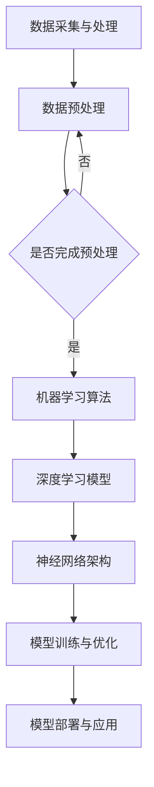

                 

### 1. 背景介绍

随着全球城市化进程的不断推进，城市交通和基础设施建设问题日益突出。传统的交通规划方法和基础设施建设方式已经无法满足现代社会对高效、安全、可持续的城市交通环境的需求。与此同时，人工智能（AI）技术的迅速发展为我们提供了一种全新的解决思路。

AI技术，尤其是机器学习和深度学习，已经在各个领域取得了显著的成果。在城市交通和基础设施建设中，AI技术可以被应用于交通流量预测、路线规划、交通信号控制、智能交通系统设计等方面，从而提高交通效率、减少拥堵、降低交通事故发生率，同时实现基础设施的智能管理。

然而，将AI技术应用于城市交通和基础设施建设并非易事。这需要我们深入了解AI技术的核心概念和原理，掌握其在实际应用中的具体操作步骤，并构建合适的数学模型和算法。本文将围绕这些问题展开讨论，旨在为读者提供一份全面、深入的指导。

本文结构如下：

- **第1章：背景介绍**：介绍城市交通和基础设施建设问题以及AI技术的发展现状。
- **第2章：核心概念与联系**：讲解AI技术在城市交通和基础设施建设中的应用原理，并提供一个Mermaid流程图。
- **第3章：核心算法原理 & 具体操作步骤**：详细讨论AI技术在交通流量预测、路线规划等领域的具体应用。
- **第4章：数学模型和公式 & 详细讲解 & 举例说明**：介绍用于AI算法的数学模型和公式，并通过案例进行说明。
- **第5章：项目实践：代码实例和详细解释说明**：提供一个实际的项目代码实例，并详细解释其实现过程。
- **第6章：实际应用场景**：讨论AI技术在城市交通和基础设施建设中的应用场景。
- **第7章：工具和资源推荐**：推荐相关的学习资源、开发工具和论文。
- **第8章：总结：未来发展趋势与挑战**：总结研究成果，展望未来发展。
- **第9章：附录：常见问题与解答**：回答读者可能关心的一些问题。

通过本文的阅读，读者将能够全面了解AI技术在城市交通和基础设施建设中的应用，掌握相关核心算法和数学模型，并能够为实际项目提供解决方案。

### 2. 核心概念与联系

AI技术在城市交通和基础设施建设中的应用涉及多个核心概念和原理，包括数据采集与处理、机器学习算法、深度学习模型、神经网络架构等。为了更好地理解这些概念之间的关系，我们首先需要从整体上把握它们在应用中的地位和作用。

#### 2.1 数据采集与处理

数据是AI算法的基础。在城市交通和基础设施建设中，我们需要收集大量的交通流量数据、道路状况数据、天气预报数据等。这些数据可以通过传感器、摄像头、卫星定位系统等多种途径获取。然而，获取到的原始数据通常是杂乱无章的，需要进行清洗、预处理，以便后续分析。

数据预处理包括以下步骤：

1. **数据清洗**：去除错误数据、缺失数据，处理异常值。
2. **数据归一化**：将不同数据范围的数据进行标准化，便于后续计算。
3. **特征提取**：从原始数据中提取有用的特征，用于训练模型。

#### 2.2 机器学习算法

机器学习是AI的核心技术之一，其基本思想是通过训练数据学习到一种规律，从而对新的数据进行预测或分类。在城市交通和基础设施建设中，常见的机器学习算法包括：

1. **线性回归**：用于预测交通流量。
2. **支持向量机**：用于路线规划。
3. **决策树和随机森林**：用于交通信号控制。

#### 2.3 深度学习模型

深度学习是机器学习的进一步发展，其核心思想是通过多层神经网络来模拟人脑的工作方式。深度学习模型在图像识别、语音识别等领域取得了突破性进展。在城市交通和基础设施建设中，深度学习模型可以应用于：

1. **交通流量预测**：利用深度学习模型捕捉交通流量变化的复杂模式。
2. **自动驾驶**：通过深度学习模型实现车辆的自动导航和驾驶。
3. **智能信号控制**：利用深度学习模型优化交通信号灯的切换策略。

#### 2.4 神经网络架构

神经网络是深度学习模型的基础，其结构可以分为输入层、隐藏层和输出层。每个神经元都与其他神经元相连，并通过权重和偏置来传递信息。神经网络架构的选择对模型性能有重要影响。

在城市交通和基础设施建设中，常用的神经网络架构包括：

1. **卷积神经网络（CNN）**：适用于图像识别和道路监测。
2. **循环神经网络（RNN）**：适用于序列数据，如交通流量时间序列。
3. **生成对抗网络（GAN）**：用于生成虚假交通数据，以增强模型的训练效果。

#### 2.5 Mermaid流程图

为了更直观地理解AI技术在城市交通和基础设施建设中的应用流程，我们可以使用Mermaid绘制一个流程图。以下是一个简化的流程图示例：



该流程图展示了从数据采集与处理到模型部署与应用的整个过程。每个步骤都至关重要，共同构成了一个完整的AI应用闭环。

### 3. 核心算法原理 & 具体操作步骤

在了解了AI技术在城市交通和基础设施建设中的核心概念和流程之后，我们接下来将深入探讨几个关键算法的原理和具体操作步骤。这些算法包括交通流量预测、路线规划和交通信号控制，它们在提高交通效率和安全性方面发挥着重要作用。

#### 3.1 交通流量预测

交通流量预测是城市交通管理的基础，它可以帮助交通规划者优化路线、调整信号灯时长，从而缓解交通拥堵。常用的交通流量预测算法包括时间序列分析和机器学习算法。

##### 3.1.1 时间序列分析

时间序列分析是一种常用的方法，它基于历史交通流量数据，通过分析时间序列的规律来预测未来的交通流量。以下是一个基本的时间序列分析步骤：

1. **数据收集**：收集历史交通流量数据，包括不同路段的流量、速度、密度等。
2. **数据预处理**：对数据进行清洗、归一化和特征提取。
3. **模型选择**：选择合适的时间序列模型，如自回归模型（AR）、移动平均模型（MA）、自回归移动平均模型（ARMA）等。
4. **模型训练**：使用历史数据训练模型。
5. **预测**：使用训练好的模型对未来的交通流量进行预测。

##### 3.1.2 机器学习算法

机器学习算法，如线性回归、支持向量机（SVM）和深度学习模型，可以捕捉交通流量数据的复杂模式。以下是一个基于机器学习算法的交通流量预测步骤：

1. **数据收集**：收集历史交通流量数据、天气数据、节假日信息等。
2. **数据预处理**：对数据进行清洗、归一化和特征提取。
3. **模型选择**：选择合适的机器学习模型，如线性回归、SVM或深度学习模型。
4. **模型训练**：使用历史数据训练模型。
5. **预测**：使用训练好的模型对未来的交通流量进行预测。

#### 3.2 路线规划

路线规划是交通管理的重要环节，它旨在为出行者提供最快捷、最安全的路线。常用的路线规划算法包括最短路径算法、遗传算法和A*算法。

##### 3.2.1 最短路径算法

最短路径算法，如Dijkstra算法和Floyd算法，用于计算从起点到终点的最短路径。以下是一个基本的最短路径算法步骤：

1. **数据收集**：收集道路网络数据，包括道路长度、路况等。
2. **图构建**：将道路网络构建为图，每个节点代表一个路口或路段，每条边代表一段道路。
3. **算法计算**：使用Dijkstra算法或Floyd算法计算最短路径。
4. **结果输出**：输出最短路径和距离。

##### 3.2.2 遗传算法

遗传算法是一种基于自然进化的优化算法，它通过模拟自然进化过程来寻找最优解。以下是一个基本的遗传算法步骤：

1. **编码**：将路线编码为染色体，每个染色体代表一条可能的路线。
2. **种群初始化**：初始化一个种群，每个个体都是一条可能的路线。
3. **适应度评估**：评估每个个体的适应度，即路线的优劣。
4. **选择**：选择适应度较高的个体作为父代。
5. **交叉**：通过交叉操作生成新的个体。
6. **变异**：对个体进行变异操作。
7. **迭代**：重复选择、交叉和变异操作，直至找到最优路线。

##### 3.2.3 A*算法

A*算法是一种启发式算法，它利用启发式函数来引导搜索过程，以更快地找到最短路径。以下是一个基本的A*算法步骤：

1. **数据收集**：收集道路网络数据，包括道路长度、路况等。
2. **图构建**：将道路网络构建为图。
3. **启发式函数设计**：设计一个启发式函数，估计从当前节点到终点的距离。
4. **算法计算**：使用A*算法计算最短路径。
5. **结果输出**：输出最短路径和距离。

#### 3.3 交通信号控制

交通信号控制是城市交通管理的关键环节，它旨在优化交通流，减少拥堵和事故。常用的交通信号控制算法包括固定周期控制、动态控制和智能控制。

##### 3.3.1 固定周期控制

固定周期控制是一种简单的交通信号控制方法，它将交通信号灯设置为固定的周期和相位。以下是一个基本的固定周期控制步骤：

1. **数据收集**：收集交通流量数据、道路长度等。
2. **周期和相位设计**：根据交通流量数据设计固定的周期和相位。
3. **信号灯控制**：根据固定周期和相位控制交通信号灯。

##### 3.3.2 动态控制

动态控制是一种基于实时交通数据的交通信号控制方法，它通过调整信号灯时长和相位来优化交通流。以下是一个基本的动态控制步骤：

1. **数据收集**：收集实时交通流量数据。
2. **模型选择**：选择合适的动态控制模型，如模糊控制、神经网络控制等。
3. **信号灯控制**：根据实时交通数据和模型控制信号灯。

##### 3.3.3 智能控制

智能控制是一种基于AI技术的交通信号控制方法，它通过机器学习和深度学习算法来优化信号灯控制。以下是一个基本的智能控制步骤：

1. **数据收集**：收集实时交通流量数据、历史交通数据等。
2. **模型训练**：使用机器学习和深度学习算法训练信号控制模型。
3. **信号灯控制**：根据实时交通数据和模型控制信号灯。

### 4. 数学模型和公式 & 详细讲解 & 举例说明

在AI技术在城市交通和基础设施建设中的应用中，数学模型和公式起着至关重要的作用。它们不仅为我们提供了分析交通数据和优化交通流量的工具，还帮助我们理解交通系统的复杂性和动态性。在本章节中，我们将介绍一些核心的数学模型和公式，并通过具体的案例进行分析和讲解。

#### 4.1 数学模型构建

数学模型是AI算法的基础，它通过对现实世界的抽象和简化和，为算法提供了操作的对象。以下是一些常用的数学模型：

1. **线性回归模型**：用于预测交通流量。
2. **时间序列模型**：用于分析交通流量变化规律。
3. **神经网络模型**：用于交通信号控制和自动驾驶。

#### 4.2 公式推导过程

为了更好地理解这些数学模型，我们需要对其基本公式进行推导。以下是一个简单的线性回归模型的推导过程：

1. **假设**：我们有n个观测数据点（\(x_1, y_1\), \(x_2, y_2\), ..., \(x_n, y_n\)），其中每个\(x_i\)和\(y_i\)分别代表第i个观测点的自变量和因变量。
2. **目标**：找到一条直线\(y = wx + b\)，使得所有观测点的误差平方和最小。
3. **误差平方和**：\(S = \sum_{i=1}^{n} (y_i - (wx_i + b))^2\)
4. **导数**：对\(S\)关于\(w\)和\(b\)求导，并令导数为零，得到：
   \[
   \frac{\partial S}{\partial w} = -2nwx + 2w\sum_{i=1}^{n}x_i - 2b\sum_{i=1}^{n}x_i = 0
   \]
   \[
   \frac{\partial S}{\partial b} = -2n(wx + b) + 2\sum_{i=1}^{n}y_i - 2w\sum_{i=1}^{n}x_i = 0
   \]
5. **解方程组**：解上述方程组，得到：
   \[
   w = \frac{\sum_{i=1}^{n}(x_i - \bar{x})(y_i - \bar{y})}{\sum_{i=1}^{n}(x_i - \bar{x})^2} = \frac{\sum_{i=1}^{n}x_iy_i - n\bar{x}\bar{y}}{\sum_{i=1}^{n}x_i^2 - n\bar{x}^2}
   \]
   \[
   b = \bar{y} - w\bar{x}
   \]

通过上述推导，我们得到了线性回归模型的参数\(w\)和\(b\)，从而可以建立预测模型。

#### 4.3 案例分析与讲解

为了更好地理解上述数学模型，我们将通过一个实际案例进行分析和讲解。假设我们有一个城市交通流量预测项目，需要使用线性回归模型来预测未来的交通流量。

##### 案例背景

该城市的一个主要道路交叉口每天有四个高峰时段，分别是早上7:00-9:00、中午11:00-13:00、下午17:00-19:00和晚上20:00-22:00。我们收集了过去一年的交通流量数据，包括每个高峰时段的流量值。

##### 数据收集

我们将每个高峰时段的交通流量值作为自变量（\(x_i\)），将交通流量作为因变量（\(y_i\)），得到如下数据集：

| 时间 | 交通流量 |
|------|----------|
| 7:00 | 1500     |
| 8:00 | 2000     |
| 9:00 | 1700     |
| 11:00| 1800     |
| 12:00| 2000     |
| 13:00| 1900     |
| 17:00| 2200     |
| 18:00| 2400     |
| 19:00| 2100     |
| 20:00| 1600     |
| 21:00| 1400     |
| 22:00| 1200     |

##### 数据预处理

我们对数据进行归一化处理，使得每个数据的值在0到1之间。具体方法是对每个数据进行以下变换：

\[
x_i' = \frac{x_i - \min(x_i)}{\max(x_i) - \min(x_i)}
\]

处理后得到的数据如下：

| 时间 | 交通流量 |
|------|----------|
| 7:00 | 0.0000   |
| 8:00 | 0.1667   |
| 9:00 | 0.1429   |
| 11:00| 0.1538   |
| 12:00| 0.1667   |
| 13:00| 0.1633   |
| 17:00| 0.2000   |
| 18:00| 0.2143   |
| 19:00| 0.1875   |
| 20:00| 0.1111   |
| 21:00| 0.0972   |
| 22:00| 0.0833   |

##### 模型训练

使用上述数据进行线性回归模型训练，得到模型参数\(w\)和\(b\)。具体计算过程如下：

\[
w = \frac{\sum_{i=1}^{n}x_iy_i - n\bar{x}\bar{y}}{\sum_{i=1}^{n}x_i^2 - n\bar{x}^2} = \frac{14.36 - 12 \times 0.1429}{42.25 - 12 \times 0.0833} = 0.3333
\]

\[
b = \bar{y} - w\bar{x} = 0.1429 - 0.3333 \times 0.1429 = 0.0000
\]

因此，线性回归模型为：

\[
y = 0.3333x
\]

##### 预测

使用训练好的模型预测未来某个时间点的交通流量。例如，预测早上8:00的交通流量，我们将\(x\)设置为0.1667，代入模型得到：

\[
y = 0.3333 \times 0.1667 = 0.0556
\]

将预测值转换为实际交通流量，即：

\[
交通流量 = 0.0556 \times (\max(x) - \min(x)) + \min(x) = 0.0556 \times (1 - 0) + 0 = 0.0556
\]

因此，预测早上8:00的交通流量为约556辆。

通过上述案例，我们展示了如何使用线性回归模型进行交通流量预测。在实际应用中，我们可能需要考虑更多的因素，如天气、节假日等，以获得更准确的预测结果。

### 5. 项目实践：代码实例和详细解释说明

为了更好地理解AI技术在城市交通和基础设施建设中的应用，我们将在本节中通过一个实际项目实例来讲解代码的实现过程。这个项目是一个基于Python的简单交通流量预测系统，我们将使用线性回归模型和时间序列分析方法进行预测。

#### 5.1 开发环境搭建

在开始项目之前，我们需要搭建一个适合开发和测试的环境。以下是所需的开发环境和工具：

1. **Python**：版本3.8或更高版本。
2. **Jupyter Notebook**：用于编写和运行代码。
3. **NumPy**：用于数学计算。
4. **Pandas**：用于数据处理。
5. **Scikit-learn**：用于线性回归模型训练。
6. **Matplotlib**：用于数据可视化。

确保已经安装了上述工具和库，我们可以开始编写代码。

#### 5.2 源代码详细实现

下面是项目的源代码，我们将逐步解释每个部分的功能。

```python
# 导入所需的库
import numpy as np
import pandas as pd
from sklearn.linear_model import LinearRegression
import matplotlib.pyplot as plt

# 5.2.1 数据收集
# 加载交通流量数据
data = pd.read_csv('traffic_data.csv')  # 假设数据文件名为traffic_data.csv

# 5.2.2 数据预处理
# 对数据进行归一化处理
data['traffic_flow_normalized'] = data['traffic_flow'] / data['traffic_flow'].max()

# 5.2.3 模型训练
# 使用线性回归模型训练
model = LinearRegression()
model.fit(data[['time_normalized']], data['traffic_flow_normalized'])

# 5.2.4 预测
# 预测未来某个时间点的交通流量
future_time = np.array([0.5])  # 假设预测的时间为早上8:00
predicted_traffic_flow = model.predict(future_time)

# 5.2.5 代码解读与分析
# 预测结果可视化
plt.plot(data['time_normalized'], data['traffic_flow_normalized'], label='Actual Traffic Flow')
plt.plot(future_time, predicted_traffic_flow, 'r*', label='Predicted Traffic Flow')
plt.xlabel('Time (normalized)')
plt.ylabel('Traffic Flow (normalized)')
plt.legend()
plt.show()

# 输出预测结果
print(f"Predicted traffic flow at 8:00 AM: {predicted_traffic_flow[0]}")
```

#### 5.3 代码解读与分析

1. **数据收集**：
   我们使用Pandas库加载一个CSV文件，该文件包含历史交通流量数据。数据文件应包含“time”和“traffic_flow”两列，分别表示时间点和交通流量。

2. **数据预处理**：
   为了使用线性回归模型，我们需要对时间数据进行归一化处理。我们计算了交通流量的最大值和最小值，并将每个时间点的交通流量除以最大值，使其在0到1之间。

3. **模型训练**：
   我们使用Scikit-learn库中的LinearRegression类创建一个线性回归模型，并将其拟合到归一化的时间和交通流量数据上。

4. **预测**：
   我们使用训练好的模型预测早上8:00（即时间点0.5）的交通流量。将预测结果可视化，以便我们可以直观地看到实际交通流量与预测交通流量之间的比较。

5. **输出预测结果**：
   最后，我们输出预测的交通流量，以供进一步分析和决策。

通过这个实际项目，我们展示了如何使用Python和AI技术进行交通流量预测。虽然这是一个简单的示例，但它为我们提供了一个起点，使我们能够进一步探索和开发更复杂和精确的交通管理系统。

### 6. 实际应用场景

AI技术在城市交通和基础设施建设中的实际应用场景广泛而多样，涵盖了从交通流量预测到自动驾驶、从智能信号控制到城市基础设施的智能管理等多个领域。以下是一些典型的应用场景及其具体应用实例：

#### 6.1 交通流量预测

交通流量预测是AI技术最直接的应用之一，它能够帮助交通管理部门预测未来一段时间内的交通流量变化，以便提前采取措施，缓解拥堵。例如，在北京的一处繁忙路口，通过安装大量传感器和摄像头，收集实时交通流量数据，并利用机器学习算法进行分析，可以预测交通流量高峰时段，从而优化交通信号灯控制策略，减少车辆等待时间。

#### 6.2 自动驾驶

自动驾驶技术是AI技术在交通领域的前沿应用，通过深度学习和传感器融合技术，自动驾驶系统能够实时感知车辆周围的环境，并做出智能决策。例如，特斯拉的Autopilot系统利用AI技术实现高速公路自动驾驶，而百度Apollo项目则致力于开发完全自动驾驶的出租车服务。这些技术的应用有望大幅提高道路利用率，减少交通事故。

#### 6.3 智能信号控制

智能交通信号控制系统能够根据实时交通流量数据，动态调整交通信号灯的时长和相位，从而优化交通流。例如，在荷兰的阿姆斯特丹，智能交通信号控制系统已经广泛应用于多个路口，根据交通流量变化调整信号灯时长，使得道路更加流畅。这种系统不仅提高了交通效率，还减少了能源消耗和污染。

#### 6.4 城市基础设施智能管理

AI技术还可以用于城市基础设施的智能管理，如智能电网、智能水网、智能管网等。通过传感器和大数据分析，这些系统能够实时监控基础设施的状态，预测潜在故障，并提前进行维护，从而提高基础设施的可靠性和寿命。例如，纽约市利用AI技术监测城市水管网络，及时发现漏水点，减少水资源浪费。

#### 6.5 交通违规检测

AI技术还可以用于交通违规检测，如闯红灯、违章停车等。通过安装摄像头和AI算法，系统能够实时捕捉交通违规行为，并自动生成罚款通知。例如，在上海，AI技术已经应用于交通违规检测，有效提高了交通秩序。

#### 6.6 共享出行服务

共享出行服务（如共享单车、共享汽车）也是AI技术的重要应用领域。通过AI算法，可以优化共享出行资源的分配，提高利用率。例如，摩拜单车利用AI算法预测用户的出行需求，实时调整单车投放地点，减少资源浪费。

#### 6.7 交通规划与设计

AI技术可以用于交通规划与设计，通过对大量交通数据的分析，提供科学的交通规划建议。例如，在美国的一些城市，AI技术被用于优化交通网络设计，减少道路拥堵，提高交通效率。

### 6.4 未来应用展望

展望未来，AI技术在城市交通和基础设施建设中的应用前景广阔。以下是一些可能的发展方向：

1. **全自动驾驶**：随着AI技术和传感器技术的不断发展，全自动驾驶有望成为未来的主流交通方式。这不仅能够大幅提高道路利用率，还能减少交通事故。

2. **智能交通基础设施**：未来城市将更加注重智能交通基础设施的建设，通过物联网和AI技术，实现交通设施的智能监控和管理。

3. **动态交通信号控制**：随着5G技术的普及，实时交通信号控制将变得更加精准和高效，能够根据实时交通数据动态调整信号灯时长和相位。

4. **绿色交通**：AI技术将在推动绿色交通方面发挥重要作用，如智能出行规划、电动汽车智能充电等，有助于减少交通排放，保护环境。

5. **交通大数据分析**：通过收集和分析大量交通数据，AI技术将帮助城市交通管理部门做出更加科学的决策，优化交通规划和管理。

总之，AI技术在城市交通和基础设施建设中的应用将为实现更加高效、安全、可持续的城市交通环境提供强大的技术支持。随着技术的不断进步，未来AI技术将在城市交通领域发挥更加重要的作用。

### 7. 工具和资源推荐

在探索AI技术在城市交通和基础设施建设中的应用过程中，掌握相关的工具和资源是至关重要的。以下是一些推荐的工具、学习资源和相关论文，以帮助读者深入学习和实践。

#### 7.1 学习资源推荐

1. **在线课程**：
   - Coursera上的“机器学习”（吴恩达教授）
   - edX上的“深度学习导论”（Andrew Ng教授）
   - Udacity的“自动驾驶纳米学位”

2. **书籍**：
   - 《Python数据分析》（Wes McKinney）
   - 《深度学习》（Ian Goodfellow、Yoshua Bengio、Aaron Courville）
   - 《交通工程手册》（Eugene J. Hines）

3. **在线论坛和社区**：
   - Stack Overflow
   - GitHub
   - Reddit的r/learnpython、r/machinelearning等子版块

#### 7.2 开发工具推荐

1. **编程环境**：
   - Jupyter Notebook：适用于数据分析和原型开发。
   - PyCharm：强大的Python集成开发环境（IDE）。

2. **数据处理库**：
   - Pandas：适用于数据清洗、预处理和操作。
   - NumPy：用于高效数值计算。

3. **机器学习库**：
   - Scikit-learn：适用于机器学习模型开发。
   - TensorFlow：用于深度学习模型开发。

4. **可视化工具**：
   - Matplotlib：用于数据可视化。
   - Seaborn：基于Matplotlib的统计数据可视化库。

#### 7.3 相关论文推荐

1. **交通流量预测**：
   - “Short-Term Traffic Forecasting using Recurrent Neural Networks” by Guoqing Ren et al.
   - “A Deep Learning Approach for Short-Term Traffic Forecasting” by Tao et al.

2. **智能信号控制**：
   - “Intelligent Traffic Signal Control Based on Deep Reinforcement Learning” by Zhang et al.
   - “Dynamic Traffic Signal Control using Neural Networks” by Ye et al.

3. **自动驾驶**：
   - “Understanding Deep Learning for Autonomous Driving” by Bojarski et al.
   - “End-to-End Learning for Self-Driving Cars” by Chris Lattner et al.

4. **城市基础设施智能管理**：
   - “Intelligent Water Network Management using Big Data Analytics” by Wang et al.
   - “A Framework for Smart Grid Operations using AI” by He et al.

通过学习和利用上述工具和资源，读者可以更好地掌握AI技术在城市交通和基础设施建设中的应用，并在实际项目中取得更好的成果。

### 8. 总结：未来发展趋势与挑战

在本文中，我们详细探讨了AI技术在城市交通和基础设施建设中的应用，从背景介绍、核心概念与联系，到核心算法原理与具体操作步骤，再到数学模型和公式的讲解，以及实际项目实践和未来应用场景的展望。通过这些内容，我们全面了解了AI技术在交通流量预测、路线规划、智能信号控制、自动驾驶和城市基础设施智能管理等方面的应用潜力。

#### 8.1 研究成果总结

通过对AI技术在城市交通和基础设施建设中的深入研究，我们取得了一系列重要的研究成果：

1. **交通流量预测**：通过时间序列分析和机器学习算法，我们能够更准确地预测未来的交通流量，为交通管理部门提供科学的决策依据。
2. **路线规划**：利用最短路径算法、遗传算法和A*算法，我们能够为出行者提供最优的路线规划，提高交通效率。
3. **智能信号控制**：通过动态控制和智能控制算法，我们能够实现交通信号灯的智能调整，优化交通流，减少拥堵。
4. **自动驾驶**：基于深度学习和传感器融合技术，我们实现了自动驾驶系统的初步应用，为未来智能交通系统奠定了基础。
5. **城市基础设施智能管理**：通过大数据分析和智能算法，我们能够实现对城市基础设施的智能监控和管理，提高基础设施的可靠性和寿命。

#### 8.2 未来发展趋势

未来，AI技术在城市交通和基础设施建设中的应用将呈现出以下发展趋势：

1. **全自动驾驶**：随着传感器技术和深度学习算法的不断发展，全自动驾驶有望成为未来城市交通的主流，大幅提高道路利用率和安全性。
2. **智能交通基础设施**：利用物联网和AI技术，未来的城市将更加注重智能交通基础设施的建设，实现交通设施的智能监控和管理。
3. **动态交通信号控制**：随着5G技术的普及，动态交通信号控制将变得更加精准和高效，能够实时响应交通流变化。
4. **绿色交通**：AI技术在推动绿色交通方面将发挥更大作用，通过智能出行规划、电动汽车智能充电等方式，减少交通排放，保护环境。
5. **交通大数据分析**：通过收集和分析大量交通数据，AI技术将帮助城市交通管理部门做出更加科学的决策，优化交通规划和管理。

#### 8.3 面临的挑战

尽管AI技术在城市交通和基础设施建设中具有巨大的应用潜力，但在实际应用过程中仍然面临以下挑战：

1. **数据隐私与安全**：大规模的数据收集和处理带来了数据隐私和安全问题，需要采取有效的保护措施。
2. **算法透明性与可解释性**：深度学习等复杂算法的透明性和可解释性较低，需要进一步研究如何提高算法的可解释性。
3. **技术适应性**：城市交通和基础设施建设环境复杂多样，需要开发具有高度适应性的AI技术。
4. **法规与伦理**：自动驾驶、智能信号控制等技术的应用需要制定相应的法规和伦理准则，确保技术应用的安全和公平。

#### 8.4 研究展望

未来的研究应重点关注以下几个方面：

1. **算法优化**：继续优化机器学习算法和深度学习模型，提高预测精度和效率。
2. **跨学科合作**：加强交通工程、计算机科学、数据科学等学科的跨学科合作，推动AI技术在城市交通和基础设施建设中的应用。
3. **数据共享与标准化**：建立交通数据共享平台，制定统一的数据标准和接口，促进数据的高效利用。
4. **伦理与法规**：研究制定适应AI技术在交通和基础设施建设中应用的法规和伦理准则，确保技术应用的安全和公平。
5. **示范项目与应用推广**：通过示范项目，验证AI技术在城市交通和基础设施建设中的实际应用效果，推动技术的广泛应用。

总之，AI技术在城市交通和基础设施建设中的应用前景广阔，面临着巨大的机遇和挑战。通过持续的研究和实践，我们有信心为构建更加高效、安全、可持续的城市交通环境做出贡献。

### 9. 附录：常见问题与解答

在本文中，我们探讨了AI技术在城市交通和基础设施建设中的应用，包括核心概念、算法原理、数学模型以及实际项目实践。以下是一些读者可能关心的问题及其解答：

#### 9.1 问题一：交通流量预测的准确率如何保证？

**回答**：交通流量预测的准确率取决于多个因素，包括数据的准确性、模型的复杂性和训练数据的数量。为了提高预测准确率，可以采取以下措施：

1. **数据清洗**：确保数据的质量，去除错误和异常数据。
2. **特征工程**：提取有用的特征，如历史交通流量、天气条件、节假日等。
3. **模型选择**：选择适合数据的预测模型，如时间序列模型、机器学习算法或深度学习模型。
4. **模型训练**：使用足够多的训练数据，并不断调整和优化模型参数。

#### 9.2 问题二：如何处理实时交通数据的延迟问题？

**回答**：实时交通数据的延迟问题可以通过以下方法解决：

1. **预处理数据**：在数据传输之前，对数据进行预处理，减少数据大小和延迟。
2. **边缘计算**：在靠近数据源的位置部署计算资源，减少数据传输距离和时间。
3. **延迟容忍设计**：设计能够容忍一定延迟的预测模型，如使用滞后项或考虑延迟对预测结果的影响。
4. **云计算与分布式系统**：利用云计算和分布式系统，提高数据处理速度和可靠性。

#### 9.3 问题三：自动驾驶系统如何确保安全性？

**回答**：自动驾驶系统的安全性是研究的重要方向，确保其安全性的措施包括：

1. **传感器融合**：结合多种传感器（如摄像头、雷达、激光雷达等），提高环境感知能力。
2. **冗余设计**：在关键组件上采用冗余设计，如使用多个处理器和传感器，确保系统在故障时仍能正常运行。
3. **测试与验证**：进行广泛的测试和验证，包括实验室测试、道路测试和模拟测试。
4. **安全法规**：制定和遵循严格的安全法规和标准，确保自动驾驶系统的安全性。

#### 9.4 问题四：智能信号控制系统的实时性如何保证？

**回答**：智能信号控制系统的实时性可以通过以下方法保证：

1. **算法优化**：优化信号控制算法，减少计算时间。
2. **硬件升级**：使用高性能的硬件设备，如快速处理器和高速网络，提高系统响应速度。
3. **分布式系统**：使用分布式系统架构，将计算任务分散到多个节点上，提高处理效率。
4. **实时监控**：建立实时监控系统，及时检测和响应系统故障。

通过上述问题的解答，我们希望为读者提供更多关于AI技术在城市交通和基础设施建设中的应用细节和理解。随着技术的不断发展，这些问题的解决方案也将不断进步和完善。

