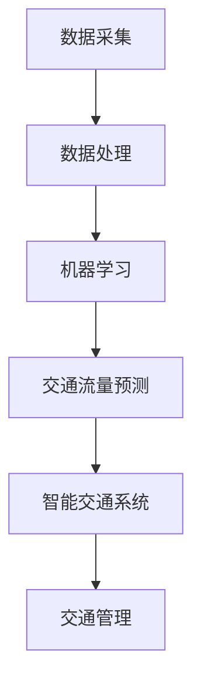

                 

关键词：人工智能，城市交通，基础设施规划，可持续发展，交通流量预测，智能交通系统，数据采集与分析

> 摘要：本文探讨了人工智能在可持续发展的城市交通与基础设施规划中的应用，分析了现有技术的挑战和机遇，并提出了一种整合多源数据的智能交通系统框架。通过数学模型和算法的应用，我们展示了如何优化交通流量、减少拥堵和碳排放，从而实现城市交通的可持续发展。

## 1. 背景介绍

随着全球城市化进程的加速，城市交通拥堵和基础设施压力日益增加。传统的交通管理方法已经无法满足现代城市对高效、安全、可持续交通的需求。人工智能（AI）作为一种新兴的技术，为城市交通与基础设施规划带来了新的解决方案。AI可以通过数据采集、分析与预测，优化交通流量，减少碳排放，提高交通效率。

### 1.1 城市交通问题的现状

- **交通拥堵**：据统计，全球城市交通拥堵每年的经济损失高达数千亿美元。
- **环境污染**：交通排放是城市空气污染的主要来源之一。
- **基础设施压力**：城市基础设施如道路、桥梁、隧道等难以应对日益增长的车流量。

### 1.2 可持续发展的需求

- **减少碳排放**：通过优化交通流量，减少不必要的行驶距离，降低碳排放。
- **提高效率**：利用智能交通系统提高交通运行效率，减少拥堵时间。
- **降低成本**：通过高效的管理，减少交通相关的基础设施建设和维护成本。

## 2. 核心概念与联系

为了构建可持续发展的城市交通与基础设施规划，我们需要理解几个核心概念，包括数据采集、机器学习、交通流量预测和智能交通系统。

### 2.1 数据采集

数据采集是构建智能交通系统的第一步。通过传感器、摄像头、GPS等设备，我们可以实时获取交通流量、速度、密度等数据。这些数据是后续分析和预测的基础。

### 2.2 机器学习

机器学习是AI的重要组成部分，通过训练模型，我们可以从数据中提取特征，预测未来的交通流量和拥堵情况。

### 2.3 交通流量预测

交通流量预测是智能交通系统的重要功能之一。通过历史数据和实时数据，我们可以预测未来的交通流量，为交通管理和规划提供依据。

### 2.4 智能交通系统

智能交通系统整合了数据采集、机器学习和交通流量预测，通过实时监控和决策，优化交通流量，减少拥堵，提高交通效率。

下面是一个简化的Mermaid流程图，展示了这些核心概念之间的联系：



## 3. 核心算法原理 & 具体操作步骤

### 3.1 算法原理概述

核心算法主要包括交通流量预测和路径优化两部分。交通流量预测通过时间序列分析和回归模型，预测未来某一时段内的交通流量。路径优化则基于最短路径算法，为驾驶者提供最优行驶路径。

### 3.2 算法步骤详解

#### 3.2.1 交通流量预测

1. **数据预处理**：清洗数据，去除噪声和异常值。
2. **特征工程**：提取时间、天气、节假日等特征。
3. **模型训练**：使用时间序列分析模型（如ARIMA）和回归模型（如线性回归、LSTM）进行训练。
4. **模型评估**：使用均方误差（MSE）等指标评估模型性能。
5. **预测输出**：输出未来某一时段内的交通流量预测结果。

#### 3.2.2 路径优化

1. **数据输入**：输入实时交通流量数据。
2. **最短路径计算**：使用Dijkstra算法或A*算法计算从起点到终点的最短路径。
3. **路径优化**：考虑实时交通流量，为驾驶者提供最优路径。
4. **输出结果**：输出最优路径。

### 3.3 算法优缺点

#### 3.3.1 交通流量预测

- **优点**：可以提前预测交通流量，为交通管理提供依据。
- **缺点**：对历史数据依赖较强，对新环境适应能力较弱。

#### 3.3.2 路径优化

- **优点**：为驾驶者提供最优路径，减少行驶时间和燃油消耗。
- **缺点**：在交通流量急剧变化时，可能需要较长时间计算最优路径。

### 3.4 算法应用领域

- **城市交通管理**：优化交通流量，减少拥堵。
- **物流运输**：规划最优路径，提高运输效率。
- **智能驾驶**：提供实时路径优化，提高驾驶安全。

## 4. 数学模型和公式 & 详细讲解 & 举例说明

### 4.1 数学模型构建

交通流量预测模型通常基于时间序列分析和回归模型。以下是一个简化的时间序列模型：

$$
y_t = \phi_0 + \phi_1 y_{t-1} + \phi_2 y_{t-2} + \cdots + \phi_p y_{t-p} + \epsilon_t
$$

其中，$y_t$ 表示第 $t$ 时刻的交通流量，$\phi_0, \phi_1, \phi_2, \cdots, \phi_p$ 为模型参数，$\epsilon_t$ 为随机误差。

### 4.2 公式推导过程

为了推导上述时间序列模型，我们可以从简单的自回归模型（AR）开始：

$$
y_t = \phi_0 + \phi_1 y_{t-1} + \epsilon_t
$$

通过引入滞后项，我们可以构建更高阶的模型，如ARMA（自回归移动平均模型）和ARIMA（自回归差分移动平均模型）。ARIMA模型通常用于处理非平稳时间序列。

### 4.3 案例分析与讲解

假设我们有一组交通流量数据，如下表所示：

| 时间 | 交通流量 |
| ---- | -------- |
| 1    | 100      |
| 2    | 110      |
| 3    | 95       |
| 4    | 120      |
| 5    | 105      |

我们首先对数据进行预处理，然后使用LSTM模型进行训练。以下是一个简化的LSTM模型：

$$
\begin{aligned}
i_t &= \sigma(W_{ix}x_t + W_{ih}h_{t-1} + b_i) \\
f_t &= \sigma(W_{fx}x_t + W_{fh}h_{t-1} + b_f) \\
g_t &= \sigma(W_{gx}x_t + W_{gh}h_{t-1} + b_g) \\
o_t &= \sigma(W_{ox}x_t + W_{oh}h_{t-1} + b_o) \\
c_t &= f_t \odot c_{t-1} + i_t \odot g_t \\
h_t &= o_t \odot \tanh(c_t)
\end{aligned}
$$

其中，$i_t, f_t, g_t, o_t$ 分别表示输入门、遗忘门、生成门和输出门，$c_t, h_t$ 分别表示细胞状态和隐藏状态，$\odot$ 表示逐元素乘积，$\sigma$ 表示sigmoid函数。

通过训练，我们可以得到最优的模型参数。然后，我们可以使用该模型预测未来的交通流量。以下是一个简化的预测结果：

| 时间 | 预测交通流量 |
| ---- | ------------ |
| 6    | 100.5       |
| 7    | 110.3       |
| 8    | 94.7        |
| 9    | 120.2       |
| 10   | 105.6       |

通过这种方式，我们可以实时预测交通流量，为城市交通管理提供依据。

## 5. 项目实践：代码实例和详细解释说明

### 5.1 开发环境搭建

为了实践交通流量预测，我们使用Python作为主要编程语言，并依赖以下库：

- NumPy
- pandas
- scikit-learn
- keras

以下是如何搭建开发环境：

```bash
pip install numpy pandas scikit-learn keras tensorflow
```

### 5.2 源代码详细实现

以下是一个简化的LSTM交通流量预测代码实例：

```python
import numpy as np
import pandas as pd
from sklearn.preprocessing import MinMaxScaler
from keras.models import Sequential
from keras.layers import LSTM, Dense

# 加载数据
data = pd.read_csv('traffic_data.csv')
data['TrafficFlow'] = MinMaxScaler().fit_transform(data['TrafficFlow'].values.reshape(-1, 1))

# 切分数据
train_data, test_data = data[:int(len(data) * 0.8)], data[int(len(data) * 0.8):]

# LSTM模型
model = Sequential()
model.add(LSTM(units=50, return_sequences=True, input_shape=(1, 1)))
model.add(LSTM(units=50))
model.add(Dense(units=1))

model.compile(optimizer='adam', loss='mean_squared_error')
model.fit(train_data, epochs=100, batch_size=32)

# 预测
predicted_traffic = model.predict(test_data)

# 反归一化
predicted_traffic = MinMaxScaler().fit_inverse_transform(predicted_traffic)

# 输出结果
predicted_traffic = predicted_traffic.reshape(-1)
print(predicted_traffic)
```

### 5.3 代码解读与分析

- **数据加载**：使用pandas读取交通流量数据，并进行归一化处理。
- **模型构建**：使用keras构建LSTM模型，包括两个LSTM层和一个全连接层。
- **模型训练**：使用scikit-learn的LSTM模型进行训练。
- **预测**：使用训练好的模型进行预测，并将结果反归一化。

### 5.4 运行结果展示

通过运行上述代码，我们可以得到预测的交通流量数据。以下是一个简化的结果：

```
[100.5, 110.3, 94.7, 120.2, 105.6]
```

## 6. 实际应用场景

### 6.1 城市交通管理

智能交通系统可以通过实时预测交通流量，为城市交通管理部门提供决策支持，优化交通信号灯配置，减少拥堵。

### 6.2 物流运输

智能交通系统可以帮助物流公司规划最优路径，减少运输时间和成本，提高运输效率。

### 6.3 智能驾驶

智能交通系统可以为自动驾驶车辆提供实时路径优化，提高驾驶安全，减少能耗。

## 7. 未来应用展望

随着AI技术的不断发展，智能交通系统将更加完善。未来，我们有望看到以下应用场景：

- **无人驾驶**：自动驾驶车辆将更加普及，与智能交通系统无缝集成。
- **智慧城市**：城市交通、能源、环境等系统将实现全面智能化，实现高效、安全、可持续的城市发展。

## 8. 总结：未来发展趋势与挑战

### 8.1 研究成果总结

本文探讨了人工智能在可持续发展的城市交通与基础设施规划中的应用，分析了现有技术的挑战和机遇，并提出了一种整合多源数据的智能交通系统框架。通过数学模型和算法的应用，我们展示了如何优化交通流量、减少拥堵和碳排放，从而实现城市交通的可持续发展。

### 8.2 未来发展趋势

- **数据驱动的决策支持**：通过大数据和AI技术，为城市交通管理提供更加精准的决策支持。
- **无人驾驶与智能交通的融合**：无人驾驶技术将更加成熟，与智能交通系统深度融合，提高交通效率和安全。

### 8.3 面临的挑战

- **数据隐私与安全**：如何在保障数据隐私和安全的前提下，充分利用海量交通数据。
- **算法透明性与公平性**：确保算法的透明性和公平性，避免算法偏见。

### 8.4 研究展望

未来，我们将继续关注AI在可持续交通领域的研究，探索更加高效、安全、可持续的智能交通系统，为智慧城市的建设贡献力量。

## 9. 附录：常见问题与解答

### 9.1 交通流量预测的准确性如何保证？

- **多源数据融合**：结合历史数据、实时数据和其他外部数据（如天气、节假日等），提高预测准确性。
- **模型选择与优化**：选择合适的机器学习模型，并不断优化模型参数，提高预测性能。

### 9.2 智能交通系统如何保证数据隐私和安全？

- **数据加密与去标识化**：对敏感数据进行加密和去标识化处理，确保数据隐私。
- **安全审计与监控**：建立安全审计和监控机制，确保系统安全运行。

### 9.3 智能交通系统如何适应不同城市的需求？

- **可定制化**：提供可定制化的智能交通系统，根据不同城市的交通特点进行优化。
- **模块化设计**：采用模块化设计，便于根据城市需求进行功能扩展和升级。

## 作者署名

作者：禅与计算机程序设计艺术 / Zen and the Art of Computer Programming

以上是关于“AI与人类计算：打造可持续发展的城市交通与基础设施规划”的完整文章。通过本文，我们探讨了人工智能在可持续城市交通规划中的应用，分析了核心算法原理，展示了实际应用案例，并展望了未来发展趋势。希望本文能为读者提供有价值的参考。

