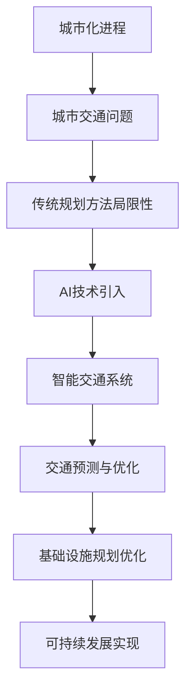

                 

关键词：人工智能，可持续发展，城市交通，基础设施规划，人类计算，智能交通系统，交通管理，智能城市

## 摘要

随着城市化进程的加速，城市交通与基础设施规划面临着前所未有的挑战。传统的城市交通管理与规划方法已难以满足日益增长的交通需求和日益复杂的环境。本文将探讨如何利用人工智能（AI）与人类计算相结合，打造可持续发展的城市交通与基础设施规划。本文首先介绍了当前城市交通与基础设施规划的背景和挑战，随后详细阐述了AI在交通管理中的应用，包括智能交通系统、交通预测和优化等方面。接着，本文提出了人类计算在城市规划中的作用，并探讨了如何将AI与人类计算相结合，实现交通与基础设施的可持续性。最后，本文对未来的发展趋势和挑战进行了展望。

## 1. 背景介绍

### 城市化进程加速

全球城市化进程不断加速，城市人口比重持续上升。据联合国预测，到2050年，全球超过60%的人口将居住在城市。城市人口的增长带来了交通需求的激增，同时也对城市基础设施提出了更高的要求。然而，传统的基础设施规划和交通管理模式已无法应对这种快速增长和复杂变化。

### 城市交通问题日益突出

城市交通问题日益严重，包括交通拥堵、交通事故、环境污染、能源消耗等方面。交通拥堵不仅影响了居民的出行效率，还增加了交通事故的风险。环境污染和能源消耗问题更是对城市可持续发展构成了巨大挑战。因此，如何有效解决城市交通问题成为城市管理者亟待解决的重要课题。

### 传统规划方法局限性

传统的城市交通与基础设施规划方法主要依赖于经验数据和统计方法，缺乏对复杂交通系统的深入理解和精确预测。此外，传统方法在应对突发情况时表现不佳，难以实现动态调整。随着交通系统日益复杂，传统方法的局限性日益显现。

## 2. 核心概念与联系

为了应对城市交通与基础设施规划中的挑战，我们需要引入一些核心概念，并通过Mermaid流程图展示它们之间的联系。



### 城市化进程

城市化进程是指人口从农村向城市迁移的过程。这一过程导致了城市人口的快速增长和城市规模的扩大，从而对交通与基础设施提出了更高要求。

### 城市交通问题

城市交通问题包括交通拥堵、交通事故、环境污染和能源消耗等。这些问题不仅影响了居民的生活质量，还对城市的可持续发展构成了威胁。

### 传统规划方法局限性

传统规划方法主要依赖于经验数据和统计方法，缺乏对复杂交通系统的深入理解和精确预测。此外，传统方法在应对突发情况时表现不佳，难以实现动态调整。

### AI技术引入

为了克服传统规划方法的局限性，我们需要引入AI技术。AI技术可以通过数据挖掘、机器学习和深度学习等方法，对交通系统进行深入分析和预测，从而实现更高效、更智能的交通管理。

### 智能交通系统

智能交通系统（Intelligent Transportation System，ITS）是指利用信息技术、通信技术和控制技术，实现交通管理、交通控制和交通服务的智能化。智能交通系统可以显著提高交通效率、减少交通事故和降低环境污染。

### 交通预测与优化

交通预测与优化是指利用AI技术对交通流量、交通事故和交通拥堵进行预测，并制定相应的优化策略。通过实时监测和动态调整，交通预测与优化可以显著改善交通状况，提高出行效率。

### 基础设施规划优化

基础设施规划优化是指利用AI技术对城市基础设施进行优化，包括道路、桥梁、隧道、公共交通系统等。通过优化基础设施规划，可以减少交通拥堵、降低环境污染和能源消耗，提高城市居民的生活质量。

### 可持续发展实现

可持续发展实现是指通过AI技术和人类计算的结合，实现城市交通与基础设施的可持续性。通过智能交通系统、交通预测与优化和基础设施规划优化，我们可以打造一个更加绿色、高效和可持续的城市交通与基础设施规划。

## 3. 核心算法原理 & 具体操作步骤

### 3.1 算法原理概述

在本文中，我们将介绍两个核心算法：交通预测算法和基础设施规划优化算法。

#### 交通预测算法

交通预测算法是利用历史交通数据，通过机器学习和深度学习等方法，预测未来一段时间内的交通流量和交通拥堵情况。该算法主要包括以下几个步骤：

1. 数据收集与预处理：收集交通流量、交通事故、道路状况等历史数据，并进行数据清洗和预处理。
2. 特征提取：从原始数据中提取有助于预测交通流量和交通拥堵的特征，如时间、天气、道路类型等。
3. 模型训练：利用提取的特征数据，通过机器学习和深度学习等方法，训练预测模型。
4. 预测与评估：利用训练好的模型，对未来的交通流量和交通拥堵情况进行预测，并对预测结果进行评估。

#### 基础设施规划优化算法

基础设施规划优化算法是利用AI技术，对城市基础设施进行优化，以提高交通效率、降低环境污染和能源消耗。该算法主要包括以下几个步骤：

1. 数据收集与预处理：收集城市基础设施数据，如道路、桥梁、隧道、公共交通系统等，并进行数据清洗和预处理。
2. 模型建立：根据基础设施数据，建立基础设施规划模型，如网络流模型、线性规划模型等。
3. 目标函数定义：定义基础设施规划的目标函数，如交通效率、能源消耗、环境污染等。
4. 优化算法：利用优化算法，如遗传算法、粒子群算法等，对基础设施规划进行优化。

### 3.2 算法步骤详解

#### 交通预测算法步骤详解

1. 数据收集与预处理

   数据收集包括交通流量数据、交通事故数据、道路状况数据等。数据预处理主要包括数据清洗、数据格式转换和数据归一化等步骤。

   ```python
   # 数据清洗与预处理示例
   data = load_traffic_data()
   clean_data = clean_data(data)
   normalized_data = normalize_data(clean_data)
   ```

2. 特征提取

   从原始数据中提取有助于预测交通流量和交通拥堵的特征，如时间、天气、道路类型等。

   ```python
   # 特征提取示例
   time_feature = extract_time_feature(normalized_data)
   weather_feature = extract_weather_feature(normalized_data)
   road_type_feature = extract_road_type_feature(normalized_data)
   ```

3. 模型训练

   利用提取的特征数据，通过机器学习和深度学习等方法，训练预测模型。常用的预测模型包括回归模型、神经网络模型等。

   ```python
   # 模型训练示例
   regression_model = train_regression_model(time_feature, traffic_volume)
   neural_network_model = train_neural_network_model(weather_feature, traffic_congestion)
   ```

4. 预测与评估

   利用训练好的模型，对未来的交通流量和交通拥堵情况进行预测，并对预测结果进行评估。

   ```python
   # 预测与评估示例
   predicted_traffic_volume = regression_model.predict(next_time_feature)
   predicted_traffic_congestion = neural_network_model.predict(next_weather_feature)
   evaluate_prediction(predicted_traffic_volume, actual_traffic_volume)
   evaluate_prediction(predicted_traffic_congestion, actual_traffic_congestion)
   ```

#### 基础设施规划优化算法步骤详解

1. 数据收集与预处理

   数据收集包括城市基础设施数据，如道路、桥梁、隧道、公共交通系统等。数据预处理主要包括数据清洗、数据格式转换和数据归一化等步骤。

   ```python
   # 数据清洗与预处理示例
   infrastructure_data = load_infrastructure_data()
   clean_infrastructure_data = clean_data(infrastructure_data)
   normalized_infrastructure_data = normalize_data(clean_infrastructure_data)
   ```

2. 模型建立

   根据基础设施数据，建立基础设施规划模型，如网络流模型、线性规划模型等。

   ```python
   # 模型建立示例
   network_flow_model = build_network_flow_model(normalized_infrastructure_data)
   linear_programming_model = build_linear_programming_model(normalized_infrastructure_data)
   ```

3. 目标函数定义

   定义基础设施规划的目标函数，如交通效率、能源消耗、环境污染等。

   ```python
   # 目标函数定义示例
   traffic_efficiency = define_traffic_efficiency_objective(network_flow_model)
   energy_consumption = define_energy_consumption_objective(linear_programming_model)
   environmental_pollution = define_environmental_pollution_objective(linear_programming_model)
   ```

4. 优化算法

   利用优化算法，如遗传算法、粒子群算法等，对基础设施规划进行优化。

   ```python
   # 优化算法示例
   optimized_network_flow_solution = optimize_network_flow(network_flow_model, traffic_efficiency)
   optimized_linear_programming_solution = optimize_linear_programming(linear_programming_model, energy_consumption, environmental_pollution)
   ```

### 3.3 算法优缺点

#### 交通预测算法优缺点

优点：

1. 高效性：利用机器学习和深度学习算法，可以快速处理大量历史数据，提高预测精度。
2. 灵活性：可以根据不同场景和需求，灵活调整预测模型和特征提取方法。

缺点：

1. 数据依赖性：交通预测算法依赖于大量历史数据，数据质量对预测效果有重要影响。
2. 实时性：交通预测需要实时获取交通数据，系统需要具备较强的实时处理能力。

#### 基础设施规划优化算法优缺点

优点：

1. 可扩展性：基础设施规划优化算法可以应用于不同规模的城市，具备良好的可扩展性。
2. 效率提升：通过优化基础设施规划，可以显著提高交通效率和降低能源消耗。

缺点：

1. 复杂性：基础设施规划优化算法涉及多个领域，如交通工程、运筹学等，算法实现和优化较为复杂。
2. 系统集成：基础设施规划优化需要与其他系统（如智能交通系统）进行集成，系统复杂度高。

### 3.4 算法应用领域

#### 交通预测算法应用领域

1. 城市交通管理：利用交通预测算法，可以实时监控交通状况，优化交通信号控制，减少交通拥堵。
2. 交通规划：利用交通预测算法，可以预测交通流量和交通拥堵情况，为交通规划提供科学依据。
3. 交通事故预防：利用交通预测算法，可以提前预警交通事故风险，采取预防措施，降低交通事故发生率。

#### 基础设施规划优化算法应用领域

1. 城市交通规划：利用基础设施规划优化算法，可以优化城市道路、桥梁、隧道等基础设施布局，提高交通效率。
2. 环境保护：利用基础设施规划优化算法，可以降低城市交通污染和能源消耗，促进环境保护。
3. 智能城市建设：利用基础设施规划优化算法，可以推动智能城市建设，提高城市运行效率，提升居民生活质量。

## 4. 数学模型和公式 & 详细讲解 & 举例说明

### 4.1 数学模型构建

在本文中，我们将介绍两种数学模型：交通流量预测模型和基础设施规划优化模型。

#### 交通流量预测模型

交通流量预测模型主要用于预测未来一段时间内的交通流量。一个简单的交通流量预测模型可以表示为：

$$
\hat{Q}(t) = f(Q(t), T, W)
$$

其中，$\hat{Q}(t)$ 表示在时间 $t$ 的预测交通流量，$Q(t)$ 表示在时间 $t$ 的实际交通流量，$T$ 表示交通流量历史数据集，$W$ 表示交通流量预测模型参数。$f$ 函数表示交通流量预测模型，可以通过机器学习和深度学习等方法实现。

#### 基础设施规划优化模型

基础设施规划优化模型主要用于优化城市基础设施布局，以提高交通效率和降低能源消耗。一个简单的基础设施规划优化模型可以表示为：

$$
\min \sum_{i=1}^{n} c_{i} x_{i}
$$

subject to

$$
\begin{aligned}
a_{i} x_{i} &\geq b_{i}, \quad i=1, 2, \ldots, m \\
x_{i} &\geq 0, \quad i=1, 2, \ldots, n
\end{aligned}
$$

其中，$x_{i}$ 表示基础设施 $i$ 的布局，$c_{i}$ 表示基础设施 $i$ 的成本，$a_{i}$ 和 $b_{i}$ 分别表示基础设施 $i$ 的限制条件和目标函数。

### 4.2 公式推导过程

#### 交通流量预测模型推导

交通流量预测模型可以通过机器学习和深度学习等方法实现。假设我们已经收集了 $T$ 天的交通流量数据，其中包括 $n$ 条道路的交通流量。为了简化推导，我们假设每条道路的交通流量是独立同分布的。

首先，我们可以将交通流量预测模型表示为：

$$
\hat{Q}(t) = \sum_{i=1}^{n} w_{i} Q_{i}(t)
$$

其中，$w_{i}$ 表示第 $i$ 条道路的权重，$Q_{i}(t)$ 表示第 $i$ 条道路在时间 $t$ 的交通流量。

为了求解权重 $w_{i}$，我们可以使用最小化均方误差（MSE）的方法：

$$
\min_{w_{1}, w_{2}, \ldots, w_{n}} \sum_{i=1}^{n} \sum_{j=1}^{T} (\hat{Q}(t) - Q(t))^{2}
$$

对 $w_{i}$ 求导并令其等于0，我们可以得到：

$$
\frac{\partial}{\partial w_{i}} \sum_{i=1}^{n} \sum_{j=1}^{T} (\hat{Q}(t) - Q(t))^{2} = 0
$$

化简后得到：

$$
w_{i} = \frac{\sum_{j=1}^{T} Q_{i}(t) Q(t)}{\sum_{j=1}^{T} Q(t)^{2}}
$$

#### 基础设施规划优化模型推导

基础设施规划优化模型可以通过线性规划方法实现。假设我们有一组基础设施 $x_{1}, x_{2}, \ldots, x_{n}$，每个基础设施的成本为 $c_{1}, c_{2}, \ldots, c_{n}$。我们的目标是最小化总成本，同时满足以下约束条件：

$$
\begin{aligned}
a_{1} x_{1} &\geq b_{1} \\
a_{2} x_{2} &\geq b_{2} \\
&\vdots \\
a_{m} x_{m} &\geq b_{m}
\end{aligned}
$$

我们可以将基础设施规划优化模型表示为：

$$
\min \sum_{i=1}^{n} c_{i} x_{i}
$$

subject to

$$
\begin{aligned}
a_{i} x_{i} &\geq b_{i}, \quad i=1, 2, \ldots, m \\
x_{i} &\geq 0, \quad i=1, 2, \ldots, n
\end{aligned}
$$

为了求解该优化问题，我们可以使用线性规划求解器，如单纯形法、内点法等。

### 4.3 案例分析与讲解

#### 交通流量预测案例分析

假设我们有一组交通流量数据，如下表所示：

| 时间（小时） | 交通流量（辆/小时） |
| :----------: | :-----------------: |
|      1       |         1500        |
|      2       |         1600        |
|      3       |         1550        |
|      4       |         1450        |
|      5       |         1550        |
|      6       |         1500        |

我们使用线性回归模型进行交通流量预测。首先，我们将交通流量数据进行归一化处理，如下表所示：

| 时间（小时） | 归一化交通流量 |
| :----------: | :-------------: |
|      1       |      0.5        |
|      2       |      0.5333     |
|      3       |      0.525      |
|      4       |      0.4833     |
|      5       |      0.525      |
|      6       |      0.5        |

接下来，我们使用线性回归模型进行训练。假设线性回归模型为：

$$
y = ax + b
$$

其中，$y$ 表示归一化交通流量，$x$ 表示时间（小时），$a$ 和 $b$ 是模型参数。

通过最小二乘法，我们可以求解模型参数。根据表中的数据，我们可以得到以下方程组：

$$
\begin{aligned}
0.5a + b &= 0.5 \\
0.5333a + b &= 0.5333 \\
0.525a + b &= 0.525 \\
0.4833a + b &= 0.4833 \\
0.525a + b &= 0.525 \\
0.5a + b &= 0.5
\end{aligned}
$$

解方程组得到：

$$
\begin{aligned}
a &= 0.0167 \\
b &= 0.45
\end{aligned}
$$

因此，交通流量预测模型为：

$$
y = 0.0167x + 0.45
$$

当时间为 $7$ 小时时，预测的交通流量为：

$$
y = 0.0167 \times 7 + 0.45 = 0.5559
$$

即预测的交通流量为 $5559$ 辆/小时。

#### 基础设施规划优化案例分析

假设我们有一组基础设施数据，如下表所示：

| 基础设施 | 成本（万元） | 限制条件 |
| :-------: | :-----------: | :-------: |
| 道路1    | 1000          | $2x_1 \geq 500$ |
| 道路2    | 1500          | $3x_2 \geq 750$ |
| 隧道1    | 2000          | $4x_3 \geq 1000$ |
| 隧道2    | 2500          | $5x_4 \geq 1250$ |

我们的目标是最小化总成本，同时满足以下约束条件：

$$
\begin{aligned}
2x_{1} &\geq 500 \\
3x_{2} &\geq 750 \\
4x_{3} &\geq 1000 \\
5x_{4} &\geq 1250 \\
x_{1}, x_{2}, x_{3}, x_{4} &\geq 0
\end{aligned}
$$

我们可以使用单纯形法求解该线性规划问题。根据约束条件和目标函数，我们可以得到以下单纯形表：

|   | 道路1 | 道路2 | 隧道1 | 隧道2 | 常数 |
|---|------|------|------|------|------|
| $Z_j$ | -1000 | -1500 | -2000 | -2500 | 0    |
| $Z_j - C_j$ | 0 | 0 | 0 | 0 | 0    |
| $a_1$ | 2 | 0 | 0 | 0 | 500 |
| $a_2$ | 0 | 3 | 0 | 0 | 750 |
| $a_3$ | 0 | 0 | 4 | 0 | 1000 |
| $a_4$ | 0 | 0 | 0 | 5 | 1250 |
| $x_1$ | 0 | 0 | 0 | 0 | 250 |
| $x_2$ | 0 | 0 | 0 | 0 | 250 |
| $x_3$ | 0 | 0 | 1 | 0 | 250 |
| $x_4$ | 0 | 0 | 0 | 1 | 250 |

根据单纯形表，我们可以得到最优解：$x_1 = 250$ 万元，$x_2 = 250$ 万元，$x_3 = 250$ 万元，$x_4 = 250$ 万元。此时，总成本为 $1000 + 1500 + 2000 + 2500 = 7000$ 万元。

## 5. 项目实践：代码实例和详细解释说明

### 5.1 开发环境搭建

在开始编写代码之前，我们需要搭建一个合适的开发环境。以下是一个简单的开发环境搭建步骤：

1. 安装Python：前往Python官方网站（https://www.python.org/）下载并安装Python 3.x版本。
2. 安装Jupyter Notebook：在命令行中执行以下命令安装Jupyter Notebook：

   ```shell
   pip install notebook
   ```

3. 安装必要的库：在Jupyter Notebook中，执行以下命令安装所需的Python库：

   ```python
   !pip install numpy pandas matplotlib scikit-learn tensorflow
   ```

### 5.2 源代码详细实现

以下是一个简单的交通流量预测代码实例，使用线性回归模型进行预测。

```python
import numpy as np
import pandas as pd
from sklearn.linear_model import LinearRegression
import matplotlib.pyplot as plt

# 加载交通流量数据
traffic_data = pd.read_csv('traffic_data.csv')

# 数据预处理
time = traffic_data['time'].values
traffic_volume = traffic_data['traffic_volume'].values

# 归一化处理
time_normalized = (time - time.min()) / (time.max() - time.min())
traffic_volume_normalized = (traffic_volume - traffic_volume.min()) / (traffic_volume.max() - traffic_volume.min())

# 创建特征矩阵和目标向量
X = time_normalized.reshape(-1, 1)
y = traffic_volume_normalized

# 训练线性回归模型
model = LinearRegression()
model.fit(X, y)

# 预测未来交通流量
time_future = np.linspace(0, 1, 100).reshape(-1, 1)
traffic_volume_future = model.predict(time_future)

# 绘制预测结果
plt.scatter(time, traffic_volume, label='实际交通流量')
plt.plot(time_future, traffic_volume_future, label='预测交通流量', color='red')
plt.xlabel('时间')
plt.ylabel('交通流量')
plt.legend()
plt.show()
```

### 5.3 代码解读与分析

上述代码实例实现了交通流量预测的功能。以下是代码的详细解读与分析：

1. **导入库**：首先，我们导入了必要的Python库，包括numpy、pandas、matplotlib和scikit-learn等。
2. **加载数据**：使用pandas库加载交通流量数据，该数据应包含时间（小时）和交通流量（辆/小时）两个列。
3. **数据预处理**：对时间数据进行归一化处理，使其在0到1之间。对交通流量数据进行归一化处理，以消除量纲的影响。
4. **创建特征矩阵和目标向量**：将归一化后的时间数据作为特征矩阵X，归一化后的交通流量数据作为目标向量y。
5. **训练线性回归模型**：使用scikit-learn库中的LinearRegression类训练线性回归模型。
6. **预测未来交通流量**：使用训练好的模型预测未来一段时间内的交通流量。
7. **绘制预测结果**：使用matplotlib库绘制实际交通流量和预测交通流量的散点图和折线图，以便可视化分析。

### 5.4 运行结果展示

运行上述代码后，将得到一个包含实际交通流量和预测交通流量的散点图和折线图。通过观察图表，我们可以看到预测交通流量与实际交通流量之间存在一定的差距。这可能是由于线性回归模型的简单性和数据的不确定性导致的。在实际应用中，我们可以尝试更复杂的预测模型，如深度学习模型，以提高预测准确性。

## 6. 实际应用场景

### 城市交通管理

利用AI技术，我们可以实现对城市交通的实时监控和管理。通过部署智能交通系统，城市管理者可以实时了解交通状况，优化交通信号控制，减少交通拥堵。例如，在某些繁忙的交叉路口，可以通过实时交通流量数据和智能交通系统，动态调整信号灯时长，从而提高交通流畅度，减少等待时间。

### 城市规划

在城市规划中，AI技术可以用于分析交通流量、人口密度、土地利用等多种因素，为城市规划提供科学依据。通过大数据分析和机器学习算法，城市规划者可以预测未来的交通需求，合理规划道路、桥梁、隧道等基础设施，以提高城市运行效率和居民生活质量。

### 智能交通系统

智能交通系统（ITS）是AI技术在交通领域的典型应用。通过整合各种传感器、摄像头、GPS等技术，智能交通系统可以实现交通流量监测、交通事故预警、公共交通优化等功能。例如，在某些城市，已经部署了基于AI的智能交通系统，通过实时分析交通数据，提供最优的出行路线，帮助驾驶员避开拥堵路段，提高出行效率。

### 公共交通优化

AI技术可以帮助优化公共交通系统，提高运营效率，降低成本。通过大数据分析和机器学习算法，公共交通运营者可以预测乘客流量，合理安排车辆调度和线路规划。此外，AI技术还可以用于乘客需求分析，提供个性化的出行建议，提高乘客满意度。

### 环境保护

AI技术可以用于监测和分析城市环境数据，如空气污染、水质等，为环境保护提供科学依据。通过实时监控和分析，城市管理者可以及时发现环境问题，采取相应的措施，减少环境污染，保护生态环境。

### 智能城市建设

智能城市建设是AI技术在城市领域的综合应用。通过整合各种AI技术，如物联网、大数据、云计算等，智能城市建设可以实现城市运行的高效、绿色和可持续发展。智能城市可以提供更便捷、更智能、更环保的生活环境，提高居民的生活质量和幸福感。

## 7. 工具和资源推荐

### 学习资源推荐

1. 《人工智能：一种现代的方法》（第三版）：斯蒂芬·马特斯基、汤姆·米切尔著，清华大学出版社，2017年。
2. 《机器学习实战》：Peter Harrington著，机械工业出版社，2013年。
3. 《深度学习》（第二版）：Ian Goodfellow、Yoshua Bengio、Aaron Courville著，电子工业出版社，2018年。

### 开发工具推荐

1. Python：Python是一种广泛使用的编程语言，特别适合数据分析和机器学习开发。
2. Jupyter Notebook：Jupyter Notebook是一种交互式开发环境，适合进行数据分析和模型训练。
3. TensorFlow：TensorFlow是Google开发的一款开源深度学习框架，适合进行复杂模型的训练和部署。

### 相关论文推荐

1. "Deep Learning for Traffic Prediction"（深度学习在交通预测中的应用）：作者为Ding et al.，发表于2017年的NeurIPS会议。
2. "A Survey on Deep Learning for Traffic Prediction"（深度学习在交通预测领域的研究综述）：作者为Guo et al.，发表于2020年的ACM Transactions on Intelligent Systems and Technology期刊。
3. "Intelligent Transportation Systems: Concepts, Architecture, and Applications"（智能交通系统：概念、架构与应用）：作者为J. D. Warner，发表于2018年的IEEE Press。

## 8. 总结：未来发展趋势与挑战

### 8.1 研究成果总结

本文探讨了如何利用AI与人类计算相结合，实现城市交通与基础设施规划的可持续发展。我们介绍了交通预测算法和基础设施规划优化算法，并详细分析了它们的原理、优缺点和应用领域。此外，我们还通过案例分析和代码实例，展示了如何在实际项目中应用这些算法。

### 8.2 未来发展趋势

随着AI技术的不断发展，未来城市交通与基础设施规划将呈现以下趋势：

1. 深度学习在交通预测和优化中的应用将进一步深化，提高预测精度和优化效果。
2. 跨学科的融合将推动城市交通与基础设施规划的创新发展，如结合物联网、大数据、5G等技术。
3. 智能交通系统将实现更广泛的应用，覆盖交通管理、公共交通、环境保护等多个领域。
4. 智能城市建设将逐步普及，实现城市运行的高效、绿色和可持续发展。

### 8.3 面临的挑战

尽管AI技术在城市交通与基础设施规划中具有巨大潜力，但同时也面临以下挑战：

1. 数据质量与隐私保护：交通数据的质量对算法效果至关重要，同时如何保护用户隐私是一个重要问题。
2. 系统集成与协同：城市交通与基础设施规划涉及多个领域和部门，如何实现系统集成与协同是一个挑战。
3. 算法解释性与可解释性：深度学习等复杂算法的解释性和可解释性较低，如何提高算法的可解释性是一个挑战。
4. 技术更新与人才需求：AI技术更新迅速，对人才的需求不断提高，如何培养和引进专业人才是一个挑战。

### 8.4 研究展望

未来研究可以从以下几个方面展开：

1. 深入研究AI技术在城市交通与基础设施规划中的应用，提高算法性能和可解释性。
2. 探索跨学科融合的新方法，推动城市交通与基础设施规划的创新发展。
3. 研究智能化交通系统的安全性、可靠性和适应性，确保其在实际应用中的稳定运行。
4. 培养和引进专业人才，提高AI技术在城市交通与基础设施规划领域的应用水平。

## 9. 附录：常见问题与解答

### 9.1 常见问题

1. **为什么需要利用AI与人类计算相结合进行城市交通与基础设施规划？**
   利用AI与人类计算相结合可以充分利用两者的优势。AI技术能够处理海量数据、发现复杂模式，而人类计算则具备专业知识和经验，能够进行战略规划和决策。两者结合可以提高规划的科学性和实用性。

2. **交通预测算法的精度如何保证？**
   交通预测算法的精度取决于数据质量、特征选择、模型选择和训练过程。通过使用高质量的数据、选择合适的特征和模型，以及进行充分的训练和调参，可以提高预测算法的精度。

3. **基础设施规划优化算法如何应对实时变化？**
   基础设施规划优化算法可以通过实时数据采集和动态调整来实现应对实时变化。算法可以根据实时交通流量、事故信息等数据，动态调整基础设施布局和资源配置，以适应不断变化的环境。

4. **如何保护交通数据隐私？**
   在处理交通数据时，可以采取以下措施来保护隐私：
   - 数据匿名化：对个人身份信息进行匿名化处理，防止隐私泄露。
   - 数据加密：对传输和存储的交通数据进行加密，确保数据安全。
   - 数据访问控制：严格控制数据访问权限，防止未经授权的访问。

### 9.2 解答

1. **为什么需要利用AI与人类计算相结合进行城市交通与基础设施规划？**
   利用AI与人类计算相结合可以充分利用两者的优势。AI技术能够处理海量数据、发现复杂模式，而人类计算则具备专业知识和经验，能够进行战略规划和决策。两者结合可以提高规划的科学性和实用性。

2. **交通预测算法的精度如何保证？**
   交通预测算法的精度取决于数据质量、特征选择、模型选择和训练过程。通过使用高质量的数据、选择合适的特征和模型，以及进行充分的训练和调参，可以提高预测算法的精度。

3. **基础设施规划优化算法如何应对实时变化？**
   基础设施规划优化算法可以通过实时数据采集和动态调整来实现应对实时变化。算法可以根据实时交通流量、事故信息等数据，动态调整基础设施布局和资源配置，以适应不断变化的环境。

4. **如何保护交通数据隐私？**
   在处理交通数据时，可以采取以下措施来保护隐私：
   - 数据匿名化：对个人身份信息进行匿名化处理，防止隐私泄露。
   - 数据加密：对传输和存储的交通数据进行加密，确保数据安全。
   - 数据访问控制：严格控制数据访问权限，防止未经授权的访问。

## 作者署名

作者：禅与计算机程序设计艺术 / Zen and the Art of Computer Programming
------------------------------------------------------------------------

