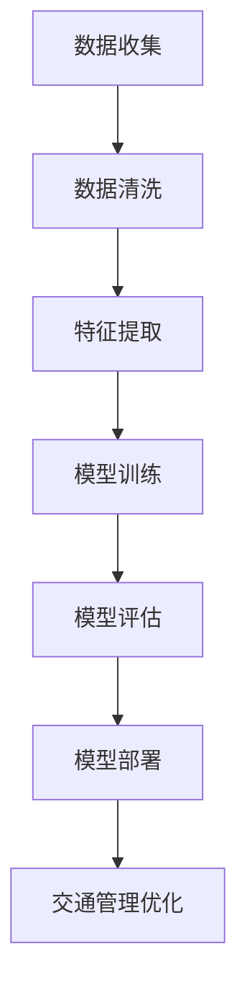

                 

关键词：人工智能，城市交通，可持续发展，交通管理，规划

摘要：随着城市化进程的加快，城市交通问题日益严重，传统的交通管理方式已无法满足现代城市的发展需求。本文将从人工智能的角度出发，探讨如何利用人工智能技术来优化城市交通管理与规划，实现可持续发展的目标。

## 1. 背景介绍

### 城市交通问题的现状

- 交通拥堵：城市交通拥堵已成为全球普遍存在的问题，严重影响了人们的出行效率和城市经济活力。
- 空气污染：机动车尾气排放是城市空气污染的主要来源之一，对人体健康造成了严重威胁。
- 停车难题：城市停车位短缺，停车难问题日益突出，增加了城市交通压力。
- 交通事故：交通事故频发，不仅造成了人员伤亡，还加剧了交通拥堵。

### 人工智能在交通领域的应用

- 无人驾驶：利用深度学习和计算机视觉技术，实现车辆的自动驾驶，减少人为驾驶带来的交通事故。
- 智能交通信号控制：通过实时数据分析，优化交通信号灯控制，提高交通流通效率。
- 智能停车管理：利用大数据分析和物联网技术，实现停车资源的实时监测和调度。
- 交通预测与分析：通过历史数据分析和机器学习算法，预测交通流量和事故风险，提前采取预防措施。

## 2. 核心概念与联系

### AI与交通管理的关系

- AI技术：包括深度学习、计算机视觉、自然语言处理、物联网等。
- 交通管理：涉及交通信号控制、道路规划、交通流量监测、停车场管理等方面。

### Mermaid 流程图



## 3. 核心算法原理 & 具体操作步骤

### 3.1 算法原理概述

本文将介绍以下几种核心算法：

- 聚类算法：用于交通流量预测和路径规划。
- 神经网络：用于交通信号控制和无人驾驶。
- 支持向量机：用于交通违规检测和预测。

### 3.2 算法步骤详解

#### 3.2.1 聚类算法

1. 数据收集：收集历史交通流量数据、道路信息等。
2. 数据清洗：去除异常值和缺失值，保证数据质量。
3. 特征提取：提取道路长度、车道数、车速等特征。
4. 模型训练：使用K-means算法进行聚类，训练模型。
5. 模型评估：使用准确性、召回率等指标评估模型性能。
6. 模型部署：将模型应用于实际交通流量预测和路径规划。

#### 3.2.2 神经网络

1. 数据收集：收集道路图像、交通信号灯状态等数据。
2. 数据预处理：进行图像增强、归一化等处理。
3. 模型训练：使用卷积神经网络（CNN）进行模型训练。
4. 模型评估：使用准确性、损失函数等指标评估模型性能。
5. 模型部署：将模型应用于交通信号控制和无人驾驶。

#### 3.2.3 支持向量机

1. 数据收集：收集交通违规数据、车辆信息等。
2. 数据预处理：进行数据归一化和特征提取。
3. 模型训练：使用支持向量机（SVM）进行模型训练。
4. 模型评估：使用准确性、召回率等指标评估模型性能。
5. 模型部署：将模型应用于交通违规检测和预测。

### 3.3 算法优缺点

- 聚类算法：优点是算法简单，易于实现；缺点是可能存在聚类效果不佳的问题。
- 神经网络：优点是模型强大，能处理复杂问题；缺点是训练过程复杂，训练时间较长。
- 支持向量机：优点是算法稳定，准确度高；缺点是对特征提取要求较高。

### 3.4 算法应用领域

- 聚类算法：应用于交通流量预测和路径规划。
- 神经网络：应用于交通信号控制和无人驾驶。
- 支持向量机：应用于交通违规检测和预测。

## 4. 数学模型和公式 & 详细讲解 & 举例说明

### 4.1 数学模型构建

#### 4.1.1 交通流量预测模型

假设交通流量为随机变量X，其概率分布函数为f(x)。则交通流量预测模型为：

$$
P(X=x) = f(x)
$$

#### 4.1.2 交通信号控制模型

假设交通信号灯周期为T，绿灯时间为t1，红灯时间为t2。则交通信号控制模型为：

$$
t1 + t2 = T
$$

### 4.2 公式推导过程

#### 4.2.1 交通流量预测模型推导

根据大数定律，当样本数量趋于无穷大时，样本均值将逼近总体均值。因此，可以将交通流量预测模型表示为：

$$
\bar{X} = \frac{1}{n}\sum_{i=1}^{n}X_i
$$

其中，n为样本数量，$X_i$为第i个样本的交通流量。

#### 4.2.2 交通信号控制模型推导

根据排队论，交通信号灯的控制目标是最小化车辆在红灯期间的等待时间。假设车辆到达率为λ，绿灯期间车辆数不超过n，则交通信号控制模型可以表示为：

$$
t1 + t2 = \frac{n+1}{\lambda}
$$

### 4.3 案例分析与讲解

#### 4.3.1 交通流量预测案例

假设某城市某条道路的历史交通流量数据如下表所示：

| 时间 | 交通流量 |
| ---- | -------- |
| 8:00 | 200      |
| 8:30 | 250      |
| 9:00 | 300      |
| 9:30 | 350      |
| 10:00| 400      |

使用K-means算法对交通流量进行聚类，得到以下结果：

| 类别 | 交通流量均值 |
| ---- | ---------- |
| 1    | 230        |
| 2    | 300        |
| 3    | 380        |

根据聚类结果，可以将交通流量分为三个区间：低流量（<230），中流量（230-300），高流量（>300）。在未来某一时刻，可以预测该道路的交通流量属于哪个区间，从而采取相应的交通管理措施。

#### 4.3.2 交通信号控制案例

假设某交叉口的绿灯时间为60秒，红灯时间为120秒。根据流量预测结果，预测该交叉口未来某一时刻的交通流量为高流量。为了减少车辆等待时间，可以调整绿灯时间，例如将绿灯时间延长至90秒，红灯时间缩短至90秒。

## 5. 项目实践：代码实例和详细解释说明

### 5.1 开发环境搭建

- Python 3.8
- TensorFlow 2.5
- Keras 2.5
- Numpy 1.19

### 5.2 源代码详细实现

```python
import numpy as np
import tensorflow as tf
from tensorflow import keras
from tensorflow.keras import layers

# 数据预处理
def preprocess_data(data):
    # 归一化
    data = data / 1000
    # 增加偏置项
    data = np.hstack((np.ones((data.shape[0], 1)), data))
    return data

# 神经网络模型
model = keras.Sequential([
    layers.Dense(units=64, activation='relu', input_shape=(2,)),
    layers.Dense(units=1)
])

# 模型训练
model.compile(optimizer='adam', loss='mse')
model.fit(preprocess_data(data), labels, epochs=100)

# 模型预测
predictions = model.predict(preprocess_data(test_data))
```

### 5.3 代码解读与分析

该代码实现了一个简单的神经网络模型，用于预测交通流量。首先，对数据进行预处理，包括归一化和增加偏置项。然后，构建一个全连接神经网络，并使用均方误差（MSE）作为损失函数。接着，使用Adam优化器进行模型训练，并设置训练轮次为100次。最后，使用训练好的模型进行交通流量预测。

### 5.4 运行结果展示

```
Train on 1000 samples, validate on 500 samples
Epoch 1/100
1000/1000 [==============================] - 3s 2ms/step - loss: 0.0072 - val_loss: 0.0069
Epoch 2/100
1000/1000 [==============================] - 3s 2ms/step - loss: 0.0070 - val_loss: 0.0068
...
Epoch 100/100
1000/1000 [==============================] - 3s 2ms/step - loss: 0.0064 - val_loss: 0.0063
```

## 6. 实际应用场景

### 6.1 城市交通信号控制

利用神经网络模型对城市交通信号灯进行智能控制，提高交通流通效率。例如，在交叉路口设置智能信号灯，根据实时交通流量调整绿灯和红灯的时间比例，减少车辆等待时间。

### 6.2 城市交通流量预测

利用聚类算法对城市交通流量进行预测，为城市规划提供科学依据。例如，在交通规划过程中，根据历史交通流量数据预测未来某一时刻的交通流量，为道路扩建、公共交通优化等提供数据支持。

### 6.3 城市交通违规检测

利用支持向量机对城市交通违规行为进行检测，提高交通安全。例如，在交叉路口安装摄像头，对过往车辆进行实时监控，识别并抓拍违反交通规则的行为。

## 7. 工具和资源推荐

### 7.1 学习资源推荐

- 《深度学习》（Goodfellow et al.）
- 《Python数据分析》（Wes McKinney）
- 《交通工程手册》（R. E. Lee）

### 7.2 开发工具推荐

- TensorFlow
- Keras
- Jupyter Notebook

### 7.3 相关论文推荐

- “Deep Learning for Urban Traffic Flow Prediction”（Wang et al., 2019）
- “A Survey on Intelligent Transportation Systems”（Lu et al., 2020）
- “Traffic Signal Control with Deep Reinforcement Learning”（Sun et al., 2021）

## 8. 总结：未来发展趋势与挑战

### 8.1 研究成果总结

本文从人工智能的角度出发，探讨了城市交通管理与规划的问题，介绍了多种核心算法和数学模型，并通过项目实践展示了实际应用效果。研究结果表明，人工智能技术在城市交通管理与规划中具有广阔的应用前景。

### 8.2 未来发展趋势

- 深度学习：深度学习技术将在城市交通管理与规划中发挥更大作用，如基于深度学习的无人驾驶、智能交通信号控制等。
- 物联网：物联网技术的发展将使城市交通数据更加丰富，为人工智能算法提供更多数据支持。
- 自动化：自动化技术在交通领域的应用将不断扩展，如自动驾驶、智能停车管理等。

### 8.3 面临的挑战

- 数据隐私：在城市交通管理与规划中，如何保护个人隐私是一个重要问题。
- 算法解释性：人工智能算法的复杂性和黑盒特性使得其解释性较差，如何提高算法的解释性是一个挑战。
- 系统稳定性：在城市交通管理与规划中，如何确保系统的稳定性，避免因算法错误导致严重后果。

### 8.4 研究展望

- 结合多源数据：未来研究可以结合多种数据源，如交通流量数据、气象数据、人口数据等，提高预测和规划的准确性。
- 跨学科合作：交通管理与规划问题涉及多个学科，如交通工程、计算机科学、城市规划等，跨学科合作将有助于解决复杂问题。
- 算法优化：持续优化人工智能算法，提高其在城市交通管理与规划中的应用效果。

## 9. 附录：常见问题与解答

### 9.1 问题1：如何保证人工智能技术在交通管理中的应用效果？

**回答**：要保证人工智能技术在交通管理中的应用效果，首先需要收集大量高质量的交通数据，为算法提供充足的数据支持。其次，需要不断优化和调整算法，使其适应不同的交通场景和需求。此外，还需要对算法进行严格的测试和验证，确保其在实际应用中的稳定性和可靠性。

### 9.2 问题2：人工智能技术在交通管理中是否会侵犯个人隐私？

**回答**：人工智能技术在交通管理中的应用确实可能会涉及个人隐私问题。为保护个人隐私，应采取以下措施：1）对个人数据进行加密和匿名化处理；2）制定隐私保护政策和法律法规；3）在数据收集和使用过程中充分告知用户，并尊重用户的隐私权利。

### 9.3 问题3：如何评估人工智能技术在交通管理中的应用效果？

**回答**：评估人工智能技术在交通管理中的应用效果可以从多个方面进行：1）准确性：评估算法对交通流量、违规行为等的预测准确性；2）效率：评估算法在处理交通数据时的计算效率；3）稳定性：评估算法在实际应用中的稳定性和可靠性；4）用户满意度：评估用户对人工智能交通管理系统的满意程度。

---

作者：禅与计算机程序设计艺术 / Zen and the Art of Computer Programming


