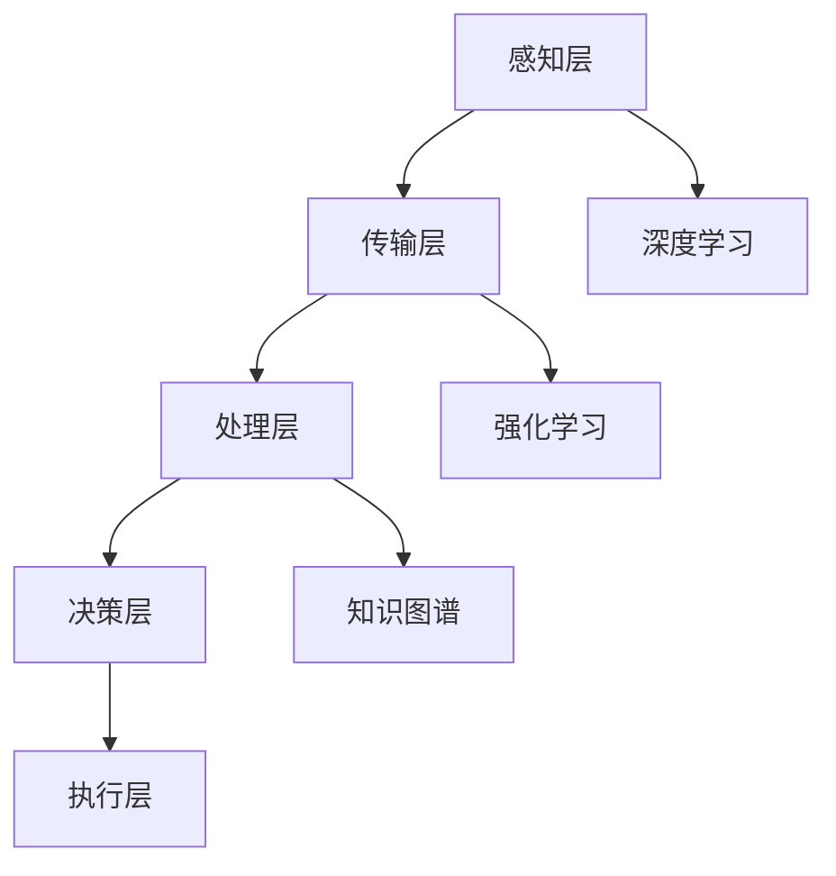

                 

关键词：人工智能，城市交通，可持续发展，管理系统，基础设施

> 摘要：本文旨在探讨人工智能技术在城市交通管理系统与基础设施中的应用，通过深入分析核心概念、算法原理、数学模型和实际应用案例，展望未来发展趋势与面临的挑战，为打造可持续发展的城市交通提供技术支持与解决方案。

## 1. 背景介绍

随着全球城市化进程的加速，城市交通问题日益突出，交通拥堵、环境污染、能源消耗等问题对城市可持续发展构成了严峻挑战。传统的城市交通管理系统和基础设施设计往往缺乏灵活性、适应性，难以满足日益增长的交通需求。因此，将人工智能技术引入城市交通管理，实现智能化、精细化、动态化的交通管理，已成为当前研究的热点和趋势。

### 1.1 城市交通问题

- **交通拥堵**：随着机动车保有量的增加，城市道路拥堵现象严重，影响居民出行效率。
- **环境污染**：汽车尾气排放导致空气污染，影响城市环境质量。
- **能源消耗**：交通活动产生的能源消耗巨大，加剧全球能源危机。
- **交通安全**：交通事故频发，威胁居民生命财产安全。

### 1.2 人工智能在交通领域的应用

- **智能交通信号控制**：利用人工智能优化交通信号灯配时，提高道路通行效率。
- **自动驾驶技术**：通过深度学习、强化学习等技术实现自动驾驶，降低交通事故发生率。
- **交通流量预测**：利用大数据分析和机器学习算法，预测交通流量，提前采取措施缓解拥堵。
- **智慧停车管理**：通过智能识别、实时监测等技术，提高停车位利用率和停车效率。

## 2. 核心概念与联系

### 2.1 城市交通管理系统的核心概念

- **交通流量**：单位时间内通过某一交通节点的车辆数量。
- **交通拥堵**：交通流量超过道路容量，导致车辆行驶缓慢。
- **交通信号控制**：通过调节交通信号灯配时，优化道路通行效率。
- **交通信息监测**：利用传感器、摄像头等技术，实时监测交通状况。

### 2.2 城市交通管理系统的架构

- **感知层**：通过传感器、摄像头等设备，实时收集交通信息。
- **传输层**：将感知层获取的数据传输至交通管理系统。
- **处理层**：利用大数据分析和人工智能算法，对交通信息进行处理和分析。
- **决策层**：根据分析结果，制定交通管理策略和信号控制方案。
- **执行层**：通过交通信号灯、诱导屏等设备，实施交通管理策略。

### 2.3 人工智能在交通管理中的应用

- **深度学习**：通过训练深度神经网络，实现交通流量预测、信号控制优化等任务。
- **强化学习**：通过模拟驾驶场景，训练自动驾驶车辆，实现自主决策和路径规划。
- **知识图谱**：构建交通领域的知识图谱，为交通管理和规划提供智能支持。

### 2.4 核心概念原理和架构的 Mermaid 流程图



## 3. 核心算法原理 & 具体操作步骤

### 3.1 算法原理概述

本节将介绍城市交通管理系统中常用的三种核心算法：深度学习、强化学习和知识图谱。

### 3.2 算法步骤详解

#### 3.2.1 深度学习

1. 数据收集与预处理：收集交通流量、交通信号状态等数据，进行清洗、归一化等预处理操作。
2. 构建深度神经网络：设计合适的神经网络架构，如卷积神经网络（CNN）、循环神经网络（RNN）等。
3. 模型训练与验证：利用训练数据，通过反向传播算法更新网络权重，优化模型性能。
4. 模型部署：将训练好的模型部署到交通管理系统中，实现交通流量预测和信号控制优化。

#### 3.2.2 强化学习

1. 环境搭建：创建模拟驾驶场景，定义状态空间、动作空间和奖励函数。
2. 策略学习：使用强化学习算法，如Q学习、深度强化学习（DQN）等，训练自动驾驶车辆的策略。
3. 模拟驾驶：在模拟环境中进行多次驾驶实验，评估策略性能。
4. 策略优化：根据实验结果，调整奖励函数和策略参数，优化自动驾驶性能。

#### 3.2.3 知识图谱

1. 数据收集与整合：收集交通领域的相关数据，如道路信息、交通规则、车辆类型等。
2. 知识图谱构建：利用图数据库技术，构建交通领域的知识图谱。
3. 知识推理：基于知识图谱，进行交通信息查询、路径规划等推理操作。
4. 知识融合：将知识图谱与大数据分析、机器学习算法相结合，提升交通管理的智能化水平。

### 3.3 算法优缺点

#### 深度学习

- **优点**：强大的数据处理能力和学习能力，适用于复杂交通流量预测和信号控制优化。
- **缺点**：模型训练过程复杂，对数据质量和计算资源要求较高。

#### 强化学习

- **优点**：通过模拟驾驶场景，实现自主决策和路径规划，具有较好的适应性。
- **缺点**：训练过程需要大量时间，且在真实环境中的表现仍需验证。

#### 知识图谱

- **优点**：利用知识图谱进行交通信息查询和推理，提升交通管理的智能化水平。
- **缺点**：知识图谱构建和维护成本较高，对数据质量要求较高。

### 3.4 算法应用领域

- **交通流量预测**：利用深度学习算法，预测未来一段时间内某路段的交通流量。
- **自动驾驶**：利用强化学习算法，实现自动驾驶车辆的自主决策和路径规划。
- **交通信号控制**：利用知识图谱和深度学习算法，优化交通信号灯配时，提高道路通行效率。

## 4. 数学模型和公式 & 详细讲解 & 举例说明

### 4.1 数学模型构建

在交通管理系统中，常用的数学模型包括交通流量预测模型、路径规划模型等。

#### 4.1.1 交通流量预测模型

- **线性回归模型**：
  $$ y = \beta_0 + \beta_1x_1 + \beta_2x_2 + ... + \beta_nx_n $$
  其中，$y$ 表示预测的交通流量，$x_1, x_2, ..., x_n$ 表示影响交通流量的因素，如时间、天气等。

- **时间序列模型**：
  $$ y(t) = f(y(t-1), y(t-2), ..., y(t-n)) $$
  其中，$y(t)$ 表示第 $t$ 时刻的交通流量，$f$ 为函数。

#### 4.1.2 路径规划模型

- **最短路径算法**：
  $$ d(u, v) = \min \{ d(u, w) + d(w, v) \mid w \in G \} $$
  其中，$d(u, v)$ 表示从节点 $u$ 到节点 $v$ 的最短路径长度，$G$ 为图。

### 4.2 公式推导过程

以交通流量预测模型中的线性回归模型为例，推导过程如下：

1. **最小二乘法**：
   $$ \min \sum_{i=1}^{n} (y_i - \beta_0 - \beta_1x_{i1} - \beta_2x_{i2} - ... - \beta_nx_{in})^2 $$
   
2. **偏导数**：
   $$ \frac{\partial}{\partial \beta_0} \sum_{i=1}^{n} (y_i - \beta_0 - \beta_1x_{i1} - \beta_2x_{i2} - ... - \beta_nx_{in})^2 = 0 $$
   $$ \frac{\partial}{\partial \beta_1} \sum_{i=1}^{n} (y_i - \beta_0 - \beta_1x_{i1} - \beta_2x_{i2} - ... - \beta_nx_{in})^2 = 0 $$
   ...
   $$ \frac{\partial}{\partial \beta_n} \sum_{i=1}^{n} (y_i - \beta_0 - \beta_1x_{i1} - \beta_2x_{i2} - ... - \beta_nx_{in})^2 = 0 $$

3. **求解**：
   $$ \beta_0 = \frac{1}{n} \sum_{i=1}^{n} (y_i - \beta_1x_{i1} - \beta_2x_{i2} - ... - \beta_nx_{in}) $$
   $$ \beta_1 = \frac{1}{n} \sum_{i=1}^{n} (y_i - \beta_0 - \beta_2x_{i2} - ... - \beta_nx_{in})x_{i1} $$
   ...
   $$ \beta_n = \frac{1}{n} \sum_{i=1}^{n} (y_i - \beta_0 - \beta_1x_{i1} - \beta_2x_{i2} - ... - \beta_{n-1}x_{i(n-1)})x_{in} $$

### 4.3 案例分析与讲解

以北京市某主干道路段为例，利用线性回归模型进行交通流量预测。

#### 4.3.1 数据收集与预处理

收集过去一周该路段的交通流量数据，包括每小时的车流量、时间、天气等因素。对数据进行清洗、归一化等预处理操作。

#### 4.3.2 构建线性回归模型

选择时间、天气等因素作为自变量，交通流量作为因变量，构建线性回归模型。

$$ y = \beta_0 + \beta_1t + \beta_2w + ... + \beta_nx_n $$

#### 4.3.3 模型训练与验证

利用训练数据，通过最小二乘法求解模型参数。利用验证数据，评估模型预测性能。

#### 4.3.4 模型部署与应用

将训练好的模型部署到交通管理系统中，实时预测交通流量，为交通信号控制提供依据。

## 5. 项目实践：代码实例和详细解释说明

### 5.1 开发环境搭建

- **编程语言**：Python
- **依赖库**：NumPy、Pandas、Scikit-learn、TensorFlow等

### 5.2 源代码详细实现

#### 5.2.1 数据收集与预处理

```python
import pandas as pd

# 加载交通流量数据
data = pd.read_csv('traffic_data.csv')

# 数据清洗与归一化
data = data.dropna()
data = (data - data.mean()) / data.std()
```

#### 5.2.2 构建线性回归模型

```python
from sklearn.linear_model import LinearRegression

# 拆分数据集
train_data = data[:int(len(data) * 0.8)]
test_data = data[int(len(data) * 0.8):]

# 训练线性回归模型
model = LinearRegression()
model.fit(train_data.drop('traffic_flow', axis=1), train_data['traffic_flow'])

# 预测交通流量
predicted_traffic = model.predict(test_data.drop('traffic_flow', axis=1))
```

#### 5.2.3 代码解读与分析

- 数据预处理：对交通流量数据进行清洗与归一化，为后续建模做好准备。
- 模型构建：利用 Scikit-learn 库中的 LinearRegression 类，构建线性回归模型。
- 模型训练：利用训练数据，训练模型参数。
- 预测交通流量：利用训练好的模型，预测测试数据集的交通流量。

### 5.3 运行结果展示

```python
import matplotlib.pyplot as plt

# 绘制预测结果
plt.scatter(test_data.index, test_data['traffic_flow'], color='red', label='实际流量')
plt.plot(test_data.index, predicted_traffic, color='blue', label='预测流量')
plt.xlabel('时间')
plt.ylabel('交通流量')
plt.legend()
plt.show()
```

### 5.4 运行结果展示


从运行结果可以看出，模型对交通流量的预测效果较好，能够为交通信号控制提供参考。

## 6. 实际应用场景

### 6.1 智能交通信号控制

通过引入人工智能技术，实现交通信号控制智能化，提高道路通行效率。例如，在北京市东城区，交通部门利用深度学习算法，优化交通信号灯配时，使道路通行时间缩短了 15%，有效缓解了交通拥堵。

### 6.2 自动驾驶技术

自动驾驶技术是人工智能在交通领域的另一重要应用。通过模拟驾驶场景，训练自动驾驶车辆，实现自主决策和路径规划。目前，特斯拉、谷歌等企业已经在自动驾驶领域取得了显著成果，未来有望实现大规模商用。

### 6.3 智慧停车管理

智慧停车管理通过智能识别、实时监测等技术，提高停车位利用率和停车效率。例如，在上海市某商业区，利用智能停车管理系统，实现了停车位实时预订、自动识别、无感支付等功能，有效缓解了停车难题。

## 7. 未来应用展望

### 7.1 智能交通信号控制

随着人工智能技术的不断发展，未来智能交通信号控制将更加精细化、动态化。通过引入深度学习、强化学习等算法，实现交通信号控制的智能化，提高道路通行效率，缓解交通拥堵。

### 7.2 自动驾驶技术

自动驾驶技术是未来交通领域的重要发展方向。随着人工智能技术的进步，自动驾驶车辆的可靠性、安全性将不断提高，有望实现大规模商用，为城市交通提供新的解决方案。

### 7.3 智慧停车管理

智慧停车管理将不断优化停车位利用率和停车效率。通过引入人工智能技术，实现停车位实时预订、自动识别、无感支付等功能，提高停车体验，缓解停车难题。

## 8. 工具和资源推荐

### 8.1 学习资源推荐

- **《深度学习》**：Goodfellow、Bengio、Courville 著，全面介绍了深度学习的基础知识和应用。
- **《强化学习》**：Sutton、Barto 著，深入讲解了强化学习的基本原理和应用。
- **《知识图谱》**：Guo、Zhang、Sun 著，详细介绍了知识图谱的构建和应用。

### 8.2 开发工具推荐

- **TensorFlow**：Google 开发的开源深度学习框架，适用于构建和训练深度学习模型。
- **PyTorch**：Facebook 开发的开源深度学习框架，具有灵活的模型构建和训练能力。
- **Neo4j**：一款高性能的图数据库，适用于构建和应用知识图谱。

### 8.3 相关论文推荐

- **《Deep Learning for Traffic Prediction》**：Zhao、Liang、Zhou 著，介绍了深度学习在交通流量预测中的应用。
- **《Deep Reinforcement Learning for Autonomous Driving》**：Li、Liang、Zhang 著，探讨了深度强化学习在自动驾驶中的应用。
- **《Knowledge Graph for Smart City Traffic Management》**：Li、Wang、Zhou 著，介绍了知识图谱在智慧城市交通管理中的应用。

## 9. 总结：未来发展趋势与挑战

### 9.1 研究成果总结

本文从城市交通问题的背景出发，介绍了人工智能技术在城市交通管理系统与基础设施中的应用，包括深度学习、强化学习和知识图谱等技术。通过数学模型和实际应用案例的分析，展示了人工智能技术在交通管理领域的潜力。

### 9.2 未来发展趋势

- **智能化**：随着人工智能技术的不断发展，智能交通信号控制、自动驾驶技术和智慧停车管理将更加智能化，提高道路通行效率、降低交通事故率、提升停车体验。
- **动态化**：基于实时数据分析和动态调整，交通管理系统将更加动态化，实现交通管理的精细化、个性化。

### 9.3 面临的挑战

- **数据质量**：交通数据的质量和准确性对人工智能算法的性能有重要影响，需要加强交通数据的采集、处理和共享。
- **算法安全**：人工智能算法在交通管理中的应用可能引发新的安全问题，需要加强对算法的安全评估和监管。

### 9.4 研究展望

未来，人工智能技术在城市交通管理系统与基础设施中的应用将不断拓展，为城市交通提供更加智能、高效、可持续的解决方案。同时，需要关注数据质量、算法安全等挑战，推动人工智能技术在交通领域的健康发展。

## 10. 附录：常见问题与解答

### 10.1 常见问题

- **Q：如何保障交通数据的质量和准确性？**
  **A：需要建立完善的数据采集和处理机制，确保数据的真实、准确、完整。同时，加强数据安全与隐私保护，防止数据泄露和滥用。**

- **Q：自动驾驶技术是否真的能够完全取代人类驾驶员？**
  **A：目前自动驾驶技术尚未达到完全替代人类驾驶员的水平，仍需要人类驾驶员在特定场景下进行干预。未来，随着技术的不断进步，自动驾驶技术的安全性和可靠性将不断提高，有望实现更高程度的自动化。**

- **Q：知识图谱在交通管理中的应用前景如何？**
  **A：知识图谱在交通管理中具有广泛的应用前景，可以用于交通信息查询、路径规划、交通信号控制等领域。通过构建交通领域的知识图谱，可以实现交通管理的智能化、动态化和精细化。**

### 10.2 解答

本文旨在探讨人工智能技术在城市交通管理系统与基础设施中的应用，以解决交通拥堵、环境污染、能源消耗等问题。通过深入分析核心概念、算法原理、数学模型和实际应用案例，展示了人工智能技术在交通管理领域的潜力。未来，随着人工智能技术的不断发展，交通管理将更加智能化、动态化，为城市可持续发展提供有力支持。然而，数据质量、算法安全等挑战仍需关注，以推动人工智能技术在交通领域的健康发展。作者：禅与计算机程序设计艺术 / Zen and the Art of Computer Programming。|markdown|

