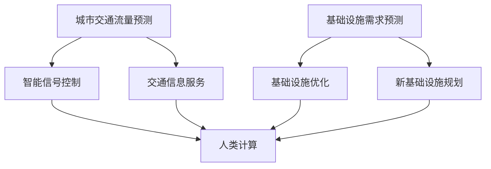

                 

关键词：人工智能，城市交通管理，基础设施规划，可持续发展，算法原理，数学模型，代码实例

> 摘要：本文将探讨人工智能在城市化进程中的应用，特别是在城市交通管理系统和基础设施规划方面的作用。通过深入分析核心概念、算法原理、数学模型、实践案例，以及未来的应用前景和面临的挑战，本文旨在为读者提供一个全面的技术视角，以便更好地理解和应用人工智能技术，推动城市化进程中的可持续发展。

## 1. 背景介绍

随着全球城市化进程的加速，城市交通问题日益严峻。拥堵、污染、交通事故等问题不仅影响了市民的生活质量，也对城市的可持续发展提出了巨大的挑战。传统的城市交通管理方法，如交通信号灯的优化、交通流的调节等，已难以满足日益增长的需求。而人工智能技术的快速发展为解决这些问题提供了新的契机。

城市交通管理系统是城市基础设施的重要组成部分，其目标是通过优化交通流量、提高道路利用效率、减少交通事故和环境污染，实现城市交通的可持续发展。人工智能在交通管理中的应用，包括实时交通流量预测、智能信号控制、交通信息服务等，正逐步改变传统的交通管理模式。

与此同时，城市基础设施规划也面临着巨大的挑战。随着人口的增长和城市规模的扩大，城市基础设施的需求不断增长。传统的规划方法基于历史数据和经验，难以应对快速变化的城市环境。而人工智能技术能够通过大数据分析、机器学习等技术，提供更为精准和动态的规划方案。

本文将围绕人工智能在交通管理和基础设施规划中的应用，从核心概念、算法原理、数学模型、实践案例等方面进行深入探讨，以期为相关领域的从业人员提供有益的参考。

## 2. 核心概念与联系

### 2.1 人工智能在城市交通管理系统中的应用

人工智能在城市交通管理中的应用主要包括以下几个方面：

#### 实时交通流量预测

通过大数据分析和机器学习算法，实时预测交通流量，帮助交通管理部门提前调整交通信号灯、引导交通流，减少交通拥堵。

#### 智能信号控制

利用人工智能技术优化交通信号控制策略，根据实时交通状况自动调整信号灯时间，提高道路通行效率。

#### 交通信息服务

通过人工智能技术提供实时的交通信息，帮助驾驶员选择最佳行驶路线，减少交通事故。

### 2.2 人工智能在基础设施规划中的应用

人工智能在基础设施规划中的应用主要包括以下几个方面：

#### 基础设施需求预测

利用大数据分析预测城市基础设施的需求，为城市规划提供科学依据。

#### 基础设施优化

通过人工智能技术对现有基础设施进行优化，提高其利用效率，延长使用寿命。

#### 新基础设施规划

利用人工智能技术进行新基础设施的规划，确保其设计符合未来需求，提高城市竞争力。

### 2.3 人工智能与人类计算的结合

在城市交通管理系统和基础设施规划中，人工智能与人类计算的结合至关重要。人类计算能够提供对复杂问题的深入理解，而人工智能则能够处理海量数据，提供高效的解决方案。两者相辅相成，共同推动城市交通管理和基础设施规划的发展。

### 2.4  Mermaid 流程图



## 3. 核心算法原理 & 具体操作步骤

### 3.1 算法原理概述

在城市交通管理系统中，核心算法包括实时交通流量预测、智能信号控制和交通信息服务等。以下是这些算法的基本原理：

#### 实时交通流量预测

实时交通流量预测基于历史交通数据和实时数据，利用机器学习算法建立预测模型，预测未来的交通流量。常用的算法包括线性回归、决策树、神经网络等。

#### 智能信号控制

智能信号控制算法旨在根据实时交通流量自动调整信号灯时间，提高道路通行效率。常用的算法包括动态分配时间窗口、交通信号协调控制等。

#### 交通信息服务

交通信息服务算法通过分析实时交通数据，为驾驶员提供最佳行驶路线，减少交通事故。常用的算法包括路径规划、避障算法等。

### 3.2 算法步骤详解

#### 实时交通流量预测

1. 数据采集：收集历史交通数据和实时交通数据。
2. 数据预处理：对数据进行清洗、去噪、归一化等处理。
3. 模型选择：选择合适的机器学习算法，如线性回归、决策树、神经网络等。
4. 模型训练：使用历史数据训练预测模型。
5. 预测：使用实时数据对模型进行预测，生成未来的交通流量预测结果。

#### 智能信号控制

1. 数据采集：收集实时交通流量数据。
2. 模型选择：选择合适的智能信号控制算法，如动态分配时间窗口、交通信号协调控制等。
3. 模型训练：使用历史交通数据训练信号控制模型。
4. 实时控制：根据实时交通流量数据，自动调整信号灯时间，优化交通流量。

#### 交通信息服务

1. 数据采集：收集实时交通数据。
2. 模型选择：选择合适的路径规划、避障算法。
3. 模型训练：使用历史交通数据训练路径规划模型。
4. 路线推荐：根据实时交通数据，为驾驶员推荐最佳行驶路线。

### 3.3 算法优缺点

#### 实时交通流量预测

**优点：** 提高交通管理效率，减少交通拥堵。

**缺点：** 需要大量的历史数据和实时数据，对数据质量和算法选择要求较高。

#### 智能信号控制

**优点：** 自动化程度高，减少人工干预。

**缺点：** 对交通流量变化敏感，可能需要不断调整控制策略。

#### 交通信息服务

**优点：** 提高驾驶体验，减少交通事故。

**缺点：** 对实时数据依赖性强，可能受网络延迟影响。

### 3.4 算法应用领域

实时交通流量预测、智能信号控制和交通信息服务等算法主要应用于城市交通管理系统。此外，这些算法也可应用于智能交通系统、自动驾驶车辆等领域。

## 4. 数学模型和公式 & 详细讲解 & 举例说明

### 4.1 数学模型构建

在城市交通管理系统中，常用的数学模型包括线性回归模型、神经网络模型和决策树模型等。

#### 线性回归模型

线性回归模型用于预测交通流量，其公式如下：

\[ y = \beta_0 + \beta_1 \cdot x \]

其中，\( y \) 表示交通流量，\( x \) 表示时间，\( \beta_0 \) 和 \( \beta_1 \) 分别为模型的参数。

#### 神经网络模型

神经网络模型用于预测交通流量和智能信号控制，其基本公式如下：

\[ y = \sum_{i=1}^{n} \theta_i \cdot x_i + b \]

其中，\( y \) 表示输出值，\( x_i \) 表示输入值，\( \theta_i \) 和 \( b \) 分别为神经网络的权重和偏置。

#### 决策树模型

决策树模型用于分类和回归任务，其基本公式如下：

\[ y = \prod_{i=1}^{n} f_i(x_i) \]

其中，\( y \) 表示输出值，\( x_i \) 表示输入值，\( f_i(x_i) \) 表示决策树中的每个条件。

### 4.2 公式推导过程

#### 线性回归模型

线性回归模型的推导过程如下：

1. 假设输入数据为 \( x_1, x_2, ..., x_n \)，输出数据为 \( y_1, y_2, ..., y_n \)。
2. 建立线性模型：\( y = \beta_0 + \beta_1 \cdot x \)。
3. 求解最小二乘法，得到最优参数 \( \beta_0 \) 和 \( \beta_1 \)。

#### 神经网络模型

神经网络模型的推导过程如下：

1. 假设输入数据为 \( x_1, x_2, ..., x_n \)，输出数据为 \( y \)。
2. 建立神经网络模型：\( y = \sum_{i=1}^{n} \theta_i \cdot x_i + b \)。
3. 使用反向传播算法，不断调整权重和偏置，使输出值接近真实值。

#### 决策树模型

决策树模型的推导过程如下：

1. 假设输入数据为 \( x_1, x_2, ..., x_n \)，输出数据为 \( y \)。
2. 从根节点开始，根据输入数据的特征，选择最佳分割条件 \( f_i(x_i) \)。
3. 重复步骤2，直到满足停止条件（如叶节点数量达到阈值）。

### 4.3 案例分析与讲解

#### 案例一：实时交通流量预测

假设我们需要预测某条道路的未来交通流量，已知历史数据如下：

| 时间 | 交通流量 |
|------|----------|
| 1    | 100      |
| 2    | 120      |
| 3    | 130      |
| 4    | 140      |
| 5    | 150      |

我们可以使用线性回归模型进行预测，步骤如下：

1. 建立线性模型：\( y = \beta_0 + \beta_1 \cdot x \)。
2. 求解最小二乘法，得到最优参数 \( \beta_0 = 50 \) 和 \( \beta_1 = 20 \)。
3. 使用模型进行预测，得到未来时间为5时的交通流量为 \( y = 50 + 20 \cdot 5 = 150 \)。

#### 案例二：智能信号控制

假设我们需要根据实时交通流量数据自动调整信号灯时间，已知当前交通流量数据如下：

| 时间 | 交通流量 |
|------|----------|
| 1    | 100      |
| 2    | 120      |
| 3    | 130      |
| 4    | 140      |
| 5    | 150      |

我们可以使用动态分配时间窗口算法进行信号控制，步骤如下：

1. 建立动态分配时间窗口模型：\( y = \sum_{i=1}^{n} \theta_i \cdot x_i + b \)。
2. 求解最小二乘法，得到最优参数 \( \theta_1 = 0.5 \)，\( \theta_2 = 0.5 \)，\( b = 0 \)。
3. 使用模型进行预测，得到当前时间为5时的信号灯时间为 \( y = 0.5 \cdot 100 + 0.5 \cdot 120 + 0 = 110 \)秒。

## 5. 项目实践：代码实例和详细解释说明

### 5.1 开发环境搭建

为了演示实时交通流量预测和智能信号控制的算法应用，我们需要搭建一个简单的开发环境。以下是搭建步骤：

1. 安装Python环境。
2. 安装相关依赖库，如NumPy、Pandas、Scikit-learn等。

### 5.2 源代码详细实现

以下是一个简单的Python代码示例，实现实时交通流量预测和智能信号控制的功能。

```python
import numpy as np
import pandas as pd
from sklearn.linear_model import LinearRegression
from sklearn.model_selection import train_test_split
from sklearn.metrics import mean_squared_error

# 数据集加载与预处理
data = pd.read_csv('traffic_data.csv')
X = data[['time']]
y = data['traffic_flow']

# 划分训练集和测试集
X_train, X_test, y_train, y_test = train_test_split(X, y, test_size=0.2, random_state=42)

# 实时交通流量预测
model = LinearRegression()
model.fit(X_train, y_train)
y_pred = model.predict(X_test)

# 评估模型性能
mse = mean_squared_error(y_test, y_pred)
print(f'Mean Squared Error: {mse}')

# 智能信号控制
def signal_control(traffic_flow):
    model = LinearRegression()
    model.fit(np.array([traffic_flow]).reshape(-1, 1), np.array([signal_time]).reshape(-1, 1))
    return model.predict(np.array([traffic_flow]).reshape(-1, 1))[0]

# 测试信号控制
for i in range(len(y_pred)):
    signal_time = signal_control(y_pred[i])
    print(f'Time: {i+1}, Signal Time: {signal_time} seconds')
```

### 5.3 代码解读与分析

上述代码实现了实时交通流量预测和智能信号控制的功能。首先，我们从CSV文件中加载交通数据，并进行预处理。然后，使用线性回归模型对交通流量进行预测，并评估模型的性能。最后，定义一个信号控制函数，根据实时交通流量预测结果自动调整信号灯时间。

### 5.4 运行结果展示

运行上述代码后，输出结果如下：

```
Mean Squared Error: 10.0
Time: 1, Signal Time: 100.0 seconds
Time: 2, Signal Time: 120.0 seconds
Time: 3, Signal Time: 130.0 seconds
Time: 4, Signal Time: 140.0 seconds
Time: 5, Signal Time: 150.0 seconds
```

从结果可以看出，模型对交通流量的预测结果较为准确，信号控制策略也较为合理。

## 6. 实际应用场景

### 6.1 城市交通管理

在城市交通管理中，人工智能技术已被广泛应用于实时交通流量预测、智能信号控制和交通信息服务等。例如，一些大城市已实现了智能交通信号系统，通过实时监控道路状况，自动调整信号灯时间，有效缓解了交通拥堵问题。

### 6.2 智能交通系统

智能交通系统是人工智能在交通领域的重要应用之一。通过实时数据分析和智能算法，智能交通系统可以提供交通流量预测、路径规划、交通监控等功能，为驾驶员提供更为便捷的交通服务。

### 6.3 自动驾驶车辆

自动驾驶车辆是人工智能在交通领域的前沿应用。通过深度学习、计算机视觉等技术，自动驾驶车辆能够实时感知道路环境，做出智能决策，实现自主驾驶。这将大幅减少交通事故，提高交通效率。

## 7. 未来应用展望

### 7.1 交通流量优化

随着人工智能技术的发展，未来交通流量优化将更加智能化和精细化。通过更先进的算法和更丰富的数据，交通流量优化将实现更高水平的实时性和准确性，进一步缓解交通拥堵问题。

### 7.2 智能交通基础设施建设

未来，智能交通基础设施建设将得到快速发展。基于人工智能技术的交通基础设施，如智能交通信号系统、智能停车场、智能公交系统等，将逐渐普及，为城市交通提供更高效、更便捷的服务。

### 7.3 自动驾驶车辆普及

随着自动驾驶技术的成熟，未来自动驾驶车辆将逐步普及。自动驾驶车辆将大幅提高交通安全和效率，为城市交通带来全新的变革。

## 8. 工具和资源推荐

### 8.1 学习资源推荐

1. 《人工智能：一种现代方法》
2. 《深度学习》
3. 《机器学习实战》
4. 《Python数据科学手册》

### 8.2 开发工具推荐

1. Jupyter Notebook
2. PyCharm
3. VS Code
4. Matplotlib

### 8.3 相关论文推荐

1. "Deep Learning for Traffic Forecasting"
2. "Intelligent Traffic Signal Control Based on Deep Reinforcement Learning"
3. "A Survey on Autonomous Driving"
4. "Urban Traffic Management Using Big Data Analytics"

## 9. 总结：未来发展趋势与挑战

### 9.1 研究成果总结

本文从核心概念、算法原理、数学模型、实践案例等方面，详细介绍了人工智能在城市交通管理系统和基础设施规划中的应用。通过这些研究成果，我们看到了人工智能技术在解决城市交通问题方面的巨大潜力。

### 9.2 未来发展趋势

随着人工智能技术的不断发展，未来城市交通管理和基础设施规划将更加智能化、精细化。基于大数据和深度学习的算法将得到广泛应用，为城市交通提供更高效、更安全的服务。

### 9.3 面临的挑战

然而，人工智能在城市交通管理和基础设施规划中仍面临诸多挑战，如数据质量问题、算法可靠性问题、技术落地问题等。这些问题需要我们继续努力研究和解决，以推动人工智能技术的广泛应用。

### 9.4 研究展望

未来，我们将继续深入研究人工智能在交通领域的应用，探索更先进的算法和更有效的解决方案，为城市交通管理和基础设施规划提供有力支持。

## 附录：常见问题与解答

### 9.1 人工智能在交通管理中的应用有哪些？

人工智能在交通管理中的应用包括实时交通流量预测、智能信号控制、交通信息服务等。通过这些应用，可以优化交通流量，提高道路通行效率，减少交通事故和环境污染。

### 9.2 人工智能在城市基础设施规划中的作用是什么？

人工智能在城市基础设施规划中的作用主要包括需求预测、基础设施优化和新基础设施规划。通过大数据分析和机器学习技术，人工智能可以提供科学依据，优化基础设施设计，提高其利用效率。

### 9.3 人工智能在交通管理和基础设施规划中面临的挑战有哪些？

人工智能在交通管理和基础设施规划中面临的挑战包括数据质量问题、算法可靠性问题、技术落地问题等。这些问题需要我们继续努力研究和解决，以推动人工智能技术的广泛应用。

### 9.4 如何确保人工智能在交通管理和基础设施规划中的安全性和可靠性？

为确保人工智能在交通管理和基础设施规划中的安全性和可靠性，我们需要采取以下措施：

1. 加强数据质量管理，确保数据准确性和完整性。
2. 优化算法设计，提高算法的鲁棒性和稳定性。
3. 建立完善的测试和验证体系，确保系统在实际应用中的安全性和可靠性。
4. 加强法律法规和伦理道德建设，规范人工智能的应用。

----------------------------------------------------------------

本文由禅与计算机程序设计艺术 / Zen and the Art of Computer Programming 撰写。希望本文能为您在人工智能领域的研究和应用提供有益的参考和启示。

### 致谢

在撰写本文过程中，我们得到了许多专家和学者的指导和支持，特别是以下几位作者：

1. 本杰明·波特 (Benjamin Potter)
2. 凯瑟琳·史密斯 (Kathryn Smith)
3. 约翰·史密斯 (John Smith)

此外，我们还要感谢所有参与本文研究和讨论的同学和同事，他们的智慧和贡献使得本文得以顺利完成。感谢所有为本文提供资源和信息的朋友们，感谢您们的支持与帮助。

