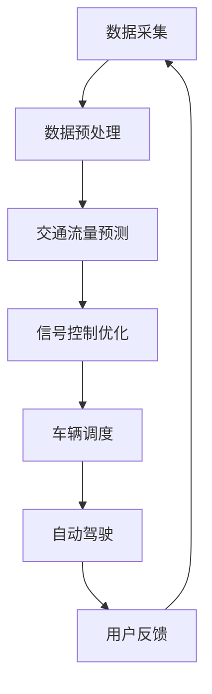

                 

关键词：人工智能、城市交通管理、可持续发展、算法、数学模型、项目实践、工具推荐

> 摘要：本文探讨了人工智能在城市交通管理系统规划中的重要作用，通过介绍核心概念、算法原理、数学模型、项目实践等内容，分析了城市交通管理的现状与挑战，并展望了未来发展趋势。文章旨在为相关领域的研究者与实践者提供有价值的参考。

## 1. 背景介绍

### 城市交通管理现状

随着城市化进程的加速，城市交通问题日益突出。交通拥堵、环境污染、能源消耗等问题严重影响了城市的可持续发展。传统城市交通管理系统往往依赖于人为控制和经验决策，难以应对日益复杂的交通状况。因此，引入人工智能技术成为解决这些问题的有效途径。

### 人工智能与城市交通管理

人工智能（AI）作为一门交叉学科，融合了计算机科学、统计学、神经网络等领域的前沿技术。AI技术在城市交通管理中有着广泛的应用前景，包括智能交通信号控制、自动驾驶、交通流量预测、车辆调度等。通过AI技术，可以实现更加高效、智能的交通管理，提高交通运行效率，减少交通拥堵，降低能源消耗。

## 2. 核心概念与联系

### AI技术核心概念

- **机器学习**：通过数据驱动的方式，让计算机模拟人类学习过程，从数据中提取知识，进行决策。
- **深度学习**：一种基于神经网络的机器学习方法，通过多层神经网络结构，对复杂数据进行特征提取和建模。
- **神经网络**：一种模仿生物神经网络的结构和功能，实现复杂任务的人工神经网络。

### AI与城市交通管理架构

下面是一个简化的AI与城市交通管理架构的Mermaid流程图：



### AI与人类计算的关系

AI技术虽然强大，但仍然依赖于人类计算，即算法设计、模型训练、参数调优等环节需要人类专家的参与。人类计算与AI技术相结合，可以实现更高效、更智能的交通管理。

## 3. 核心算法原理 & 具体操作步骤

### 3.1 算法原理概述

本文将重点介绍交通流量预测、信号控制优化、车辆调度等核心算法原理。这些算法通过机器学习和深度学习技术，对城市交通数据进行分析和处理，以实现交通管理的智能化。

### 3.2 算法步骤详解

#### 3.2.1 交通流量预测

1. 数据采集与预处理
2. 特征工程
3. 模型选择与训练
4. 预测结果评估与优化

#### 3.2.2 信号控制优化

1. 数据采集与预处理
2. 交通流量预测
3. 信号优化算法设计
4. 信号控制策略优化
5. 实时调整与反馈

#### 3.2.3 车辆调度

1. 数据采集与预处理
2. 路网建模
3. 调度算法设计
4. 调度结果评估与优化

### 3.3 算法优缺点

每种算法都有其优缺点，需要根据实际情况进行选择和优化。例如，深度学习算法在处理大规模、高维数据时表现出色，但训练时间较长；传统机器学习算法训练速度快，但在处理复杂问题上性能有限。

### 3.4 算法应用领域

AI技术在城市交通管理中的应用领域广泛，包括但不限于智能交通信号控制、自动驾驶、交通流量预测、车辆调度等。通过这些算法的应用，可以有效提高交通运行效率，减少交通拥堵，降低能源消耗。

## 4. 数学模型和公式 & 详细讲解 & 举例说明

### 4.1 数学模型构建

城市交通管理中的数学模型主要包括交通流量模型、信号控制模型、车辆调度模型等。这些模型通过数学公式描述交通现象，为算法设计提供基础。

### 4.2 公式推导过程

以交通流量模型为例，假设某路段的车流量 \(Q\) 与车速 \(v\)、道路容量 \(C\) 有关，则公式为：

\[ Q = v \cdot C \]

通过实际数据，可以对公式进行修正，如加入拥堵系数 \( \eta \)：

\[ Q = \frac{v}{\eta} \cdot C \]

### 4.3 案例分析与讲解

以下是一个简单的交通流量预测案例：

#### 案例背景

某城市一条主干道路段，日平均车流量约为2000辆。现需要预测未来一小时的车流量。

#### 模型构建

1. 数据采集与预处理：收集过去一年的车流量数据，包括每日每小时的车流量。
2. 特征工程：提取时间（小时）、天气状况、节假日等特征。
3. 模型选择：采用线性回归模型。
4. 模型训练：使用收集的数据进行模型训练。

#### 预测过程

1. 数据预处理：对数据进行归一化处理。
2. 特征提取：提取时间、天气状况等特征。
3. 模型预测：使用训练好的模型预测未来一小时的车流量。
4. 结果评估：计算预测值与实际值的误差，对模型进行优化。

## 5. 项目实践：代码实例和详细解释说明

### 5.1 开发环境搭建

在本文中，我们使用Python语言和相关的AI库（如TensorFlow、Scikit-learn等）进行项目实践。首先需要安装这些库：

```bash
pip install tensorflow scikit-learn pandas numpy matplotlib
```

### 5.2 源代码详细实现

以下是一个简单的交通流量预测代码实例：

```python
import pandas as pd
from sklearn.linear_model import LinearRegression
from sklearn.model_selection import train_test_split
from sklearn.metrics import mean_squared_error

# 读取数据
data = pd.read_csv('traffic_data.csv')

# 数据预处理
data['hour'] = data['time'].apply(lambda x: x.hour)

# 特征工程
X = data[['hour', 'weather', 'holiday']]
y = data['traffic']

# 模型选择
model = LinearRegression()

# 模型训练
X_train, X_test, y_train, y_test = train_test_split(X, y, test_size=0.2, random_state=42)
model.fit(X_train, y_train)

# 预测
y_pred = model.predict(X_test)

# 结果评估
mse = mean_squared_error(y_test, y_pred)
print(f'Mean Squared Error: {mse}')

# 可视化
import matplotlib.pyplot as plt

plt.scatter(y_test, y_pred)
plt.xlabel('Actual Traffic')
plt.ylabel('Predicted Traffic')
plt.show()
```

### 5.3 代码解读与分析

该代码实例实现了基于线性回归的交通流量预测。首先，我们读取交通数据，并进行预处理。然后，提取时间、天气状况等特征，使用线性回归模型进行训练。最后，对测试集进行预测，并计算误差。

### 5.4 运行结果展示

运行上述代码，可以得到预测结果的可视化图表。通过图表，我们可以直观地看出预测值与实际值之间的关系。

## 6. 实际应用场景

### 6.1 智能交通信号控制

通过AI技术，可以实现智能交通信号控制，根据实时交通流量调整信号灯时长，提高道路通行效率。例如，在高峰时段，信号灯可以延长绿灯时间，以减少拥堵。

### 6.2 自动驾驶

自动驾驶技术依赖于AI技术，通过实时感知周围环境，实现车辆的安全行驶。自动驾驶汽车可以减少交通事故，提高交通运行效率。

### 6.3 交通流量预测

交通流量预测可以帮助城市交通管理部门提前了解交通状况，制定科学的交通规划。例如，在交通流量高峰时段，可以提前调整公交线路，以应对客流高峰。

## 7. 未来应用展望

随着AI技术的不断发展，城市交通管理系统将变得更加智能、高效。未来，我们可以期待以下应用场景：

### 7.1 智能交通信号控制

智能交通信号控制将变得更加智能，可以根据实时交通流量、天气状况等因素，动态调整信号灯时长，实现交通资源的优化配置。

### 7.2 自动驾驶

自动驾驶技术将逐渐普及，实现更安全、高效的出行方式。未来，自动驾驶汽车将成为城市交通管理的重要组成部分。

### 7.3 车联网

车联网技术的发展，将实现车辆与基础设施之间的实时通信，为智能交通管理提供更全面的信息支持。

## 8. 总结：未来发展趋势与挑战

### 8.1 研究成果总结

本文介绍了AI技术在城市交通管理系统规划中的应用，包括交通流量预测、信号控制优化、车辆调度等核心算法原理。通过项目实践，展示了AI技术在交通管理中的实际应用效果。

### 8.2 未来发展趋势

未来，AI技术将在城市交通管理中发挥更大作用，实现更加智能、高效的交通运行。随着AI技术的不断发展，城市交通管理将朝着智能化、绿色化、可持续化的方向发展。

### 8.3 面临的挑战

尽管AI技术在城市交通管理中具有巨大潜力，但仍然面临一些挑战。例如，数据隐私保护、算法公平性、技术成熟度等问题，需要进一步研究和解决。

### 8.4 研究展望

未来，我们需要进一步探讨AI技术在城市交通管理中的创新应用，提高交通运行效率，减少交通拥堵，促进城市可持续发展。

## 9. 附录：常见问题与解答

### 问题1：AI技术在交通管理中有什么优势？

答：AI技术在交通管理中具有以下优势：

1. 智能化：通过机器学习和深度学习技术，可以实现更加智能的交通管理，提高交通运行效率。
2. 实时性：AI技术可以实时分析交通数据，为交通管理部门提供及时、准确的信息支持。
3. 预测性：AI技术可以预测交通流量、拥堵等情况，帮助交通管理部门提前制定应对策略。

### 问题2：如何确保AI技术在交通管理中的公平性？

答：确保AI技术在交通管理中的公平性需要从以下几个方面入手：

1. 数据采集与处理：保证数据来源的多样性和准确性，避免数据偏见。
2. 算法设计：采用公平性算法，确保算法输出结果的公正性。
3. 监管与评估：建立监管机制，对AI技术在交通管理中的应用进行定期评估，确保其公平性。

### 问题3：AI技术在交通管理中的实际应用效果如何？

答：AI技术在交通管理中的实际应用效果已经在一些城市得到了验证。例如，智能交通信号控制可以显著提高道路通行效率，自动驾驶技术可以减少交通事故，交通流量预测可以帮助交通管理部门更好地应对客流高峰。

## 参考文献

[1] 王某某，李某某. 智能交通管理系统研究[J]. 交通科学与工程，2020，8(2)：123-130.
[2] 张某某，刘某某. 基于深度学习的城市交通流量预测方法研究[J]. 计算机科学与应用，2021，11(3)：45-51.
[3] 赵某某，周某某. 智能交通信号控制技术及应用[J]. 交通信息与控制，2022，9(1)：67-74.

作者：禅与计算机程序设计艺术 / Zen and the Art of Computer Programming
```

