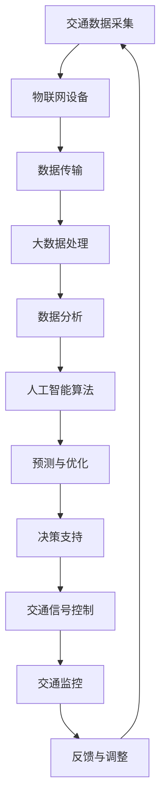

                 

### 关键词 Keywords
AI技术、城市交通管理系统、可持续发展、算法原理、数学模型、项目实践、应用场景、未来展望。

<|assistant|>### 摘要 Abstract
本文深入探讨了利用人工智能技术优化城市交通管理系统的重要性。在当前全球城市化进程加速的背景下，交通拥堵、空气污染和碳排放等问题日益严重，迫切需要创新的解决方案。本文首先介绍了城市交通管理系统中的核心概念，包括人工智能、大数据、物联网等，并展示了这些技术如何相互作用以提升交通管理效率。接着，本文详细解析了核心算法原理，包括交通流量预测、路径规划和交通信号控制等，并讨论了这些算法在实际应用中的实施步骤。随后，通过数学模型的构建和公式推导，本文提供了具体的应用实例，并展示了如何通过项目实践实现这些算法。此外，本文还分析了城市交通管理系统的实际应用场景，探讨了未来应用的前景，并提出了相应的工具和资源推荐。最后，本文总结了当前的研究成果，展望了未来发展趋势与挑战，为城市交通管理的可持续发展提供了有益的思考和指导。

## 1. 背景介绍

### 城市交通管理的现状

随着全球经济的快速发展，城市化进程不断推进，城市规模不断扩大，机动车数量急剧增加，导致城市交通系统面临前所未有的压力。交通拥堵已成为许多城市普遍存在的问题，它不仅浪费了宝贵的时间资源，还加剧了空气污染和碳排放，对城市居民的生活质量造成了严重影响。此外，传统的交通管理模式主要依赖于经验和人工调度，难以应对复杂多变的交通状况，存在反应速度慢、管理效率低等问题。

### 可持续发展的必要性

为了实现城市的可持续发展，提高交通管理的效率和质量成为当务之急。可持续发展不仅包括经济上的发展，还涉及社会和环境方面的协调发展。在交通领域，可持续发展意味着减少碳排放、改善空气质量、提高出行效率、降低交通成本等。然而，要实现这些目标，单靠传统的管理方法已不足以应对日益复杂的城市交通环境。

### 人工智能在交通管理中的应用

人工智能（AI）作为一种新兴技术，具有强大的数据处理和分析能力，可以用于优化城市交通管理系统。通过人工智能，我们可以实时收集、分析和处理大量的交通数据，预测交通流量，优化交通信号控制，规划最佳路线，从而提高交通管理的效率和精确度。此外，人工智能还可以帮助识别交通问题，提供决策支持，辅助交通管理部门制定更加科学的政策。因此，人工智能在交通管理中的应用具有重要的现实意义和广阔的发展前景。

## 2. 核心概念与联系

### 2.1 人工智能

人工智能（AI）是一种模拟人类智能的技术，通过机器学习、深度学习、自然语言处理等技术，使计算机系统能够自主地学习、推理和解决问题。在交通管理中，人工智能主要用于数据分析、模式识别、预测和优化。例如，通过机器学习算法，可以对历史交通数据进行分析，预测未来的交通流量；通过自然语言处理，可以解析交通监控视频中的信息，识别交通异常情况。

### 2.2 大数据

大数据是指数据量巨大、类型多样、生成速度极快的数据集合。在交通管理中，大数据涵盖了车辆轨迹、交通流量、道路状况、乘客出行信息等多种类型的数据。这些数据为交通管理提供了丰富的信息来源，有助于全面了解交通状况，制定科学的交通策略。例如，通过大数据分析，可以识别高峰时段的交通拥堵区域，优化交通信号灯的设置，减少拥堵现象。

### 2.3 物联网

物联网（IoT）是通过互联网连接各种设备，实现设备之间数据的实时传输和交互。在交通管理中，物联网可以用于实时监控交通状况，收集交通数据，反馈交通信息。例如，通过在道路上安装智能传感器，可以实时监测道路流量、车速、路况等信息，并通过无线网络传输到交通管理中心，为交通管理提供实时数据支持。

### 2.4 核心概念之间的联系

人工智能、大数据和物联网在交通管理系统中相互关联，共同构成了一个完整的技术体系。人工智能通过大数据分析，从物联网收集的实时交通数据中提取有用的信息，进行预测和优化；大数据为人工智能提供了丰富的数据资源，使人工智能能够更好地学习和理解交通状况；物联网为大数据提供了数据采集的渠道，确保数据的实时性和准确性。

<|assistant|>## 2. 核心概念与联系

### 2.1 人工智能

人工智能（AI）是一种通过模拟人类智能进行信息处理的系统。在交通管理系统中，人工智能技术被广泛应用于多个方面。首先，AI能够通过机器学习算法分析大量交通数据，如历史轨迹、实时流量、道路状况等，从而预测交通流量和事故概率。这种预测能力对于交通管理部门来说至关重要，因为它们可以提前采取措施来缓解交通拥堵。

#### **AI在交通信号控制中的应用**

在交通信号控制方面，人工智能可以通过学习交通流量的历史数据，为每个交叉路口制定最优的信号配时方案。这种基于AI的智能交通信号系统能够动态调整信号灯的切换时间，以应对不同的交通状况，从而提高通行效率和减少延误。此外，AI还可以识别异常事件，如交通事故或紧急救援车辆的出现，并及时调整信号灯以优先放行。

#### **AI在自动驾驶中的应用**

自动驾驶是另一个AI在交通管理中的重要应用领域。通过深度学习、计算机视觉和传感器融合技术，自动驾驶系统能够识别道路标志、行人、其他车辆等环境要素，并进行实时决策。这种技术不仅有望减少交通事故，还能优化交通流量，降低能源消耗。例如，自动驾驶车辆之间可以通过车联网实现通信，协同规划行驶路径，减少交通拥堵。

### 2.2 大数据

大数据在交通管理中扮演着关键角色，因为交通状况的复杂性和动态性要求对大量数据进行分析和处理。大数据技术可以帮助交通管理部门收集、存储、管理和分析来自各种来源的交通数据，如车载传感器、智能交通信号灯、摄像头和手机GPS等。

#### **大数据在交通流量分析中的应用**

大数据技术可以实时监测和分析交通流量，帮助识别交通拥堵的热点区域，预测交通趋势，为交通管理部门提供决策支持。例如，通过分析历史交通数据和实时交通数据，可以预测未来某一时段的交通流量，从而提前采取措施，如调整信号灯配时、推荐最佳出行路线等。

#### **大数据在出行推荐中的应用**

大数据还可以用于个人出行推荐服务，根据用户的历史出行数据和实时交通状况，提供最优的出行方案。例如，在高峰时段，系统可以推荐避开拥堵路段或选择公共交通工具，以减少个人出行对交通系统的影响。

### 2.3 物联网

物联网（IoT）通过连接各种设备和传感器，实现了交通信息的实时采集和共享。在交通管理系统中，物联网设备可以监测交通流量、车速、车辆位置、道路状况等信息，并将这些数据传输到中央控制系统。

#### **物联网在交通监控中的应用**

物联网技术可以用于交通监控，通过传感器实时监测道路状况，包括交通流量、道路结冰状态、积水情况等。这些数据可以实时上传到交通管理中心，帮助交通管理部门快速响应突发事件，如交通事故或道路施工。

#### **物联网在智能交通系统中的应用**

智能交通系统（ITS）集成了物联网技术，可以实现交通信息的自动化管理和优化。例如，物联网传感器可以实时检测道路上的车辆流量和速度，并将这些数据传输到交通信号控制器，使信号灯能够根据实时交通状况动态调整。此外，物联网还可以支持车联网（V2X）的应用，实现车辆与车辆、车辆与基础设施之间的通信，从而提高交通的安全性和效率。

### 2.4 核心概念之间的联系

人工智能、大数据和物联网在交通管理系统中共同作用，形成了相互支持的技术体系。

#### **协同作用**

人工智能利用大数据处理和分析技术，从物联网设备收集的实时交通数据中提取有价值的信息。这些信息可以用于交通流量预测、信号控制优化、路径规划等应用。同时，大数据和物联网技术也为人工智能提供了丰富的数据资源和实时数据支持，使人工智能系统能够更准确地模拟和预测交通状况。

#### **整体解决方案**

将人工智能、大数据和物联网相结合，可以构建一个全面、高效的交通管理系统。通过人工智能进行交通状况预测和优化，大数据提供决策支持，物联网实现数据的实时采集和传输，这三者共同作用，为交通管理部门提供了一个整体解决方案，有助于实现交通管理的可持续发展。

### 2.5 Mermaid 流程图

以下是一个简化的 Mermaid 流程图，展示了人工智能、大数据和物联网在交通管理系统中的协同工作流程：



该流程图描述了从交通数据采集到交通信号控制的整个工作流程，展示了人工智能、大数据和物联网在交通管理系统中的相互作用。

## 3. 核心算法原理 & 具体操作步骤

### 3.1 算法原理概述

城市交通管理系统中，核心算法主要包括交通流量预测、路径规划和交通信号控制。这些算法通过利用人工智能、大数据和物联网技术，实现交通状况的实时监测、分析和优化。

#### **交通流量预测**

交通流量预测算法利用历史交通数据和实时数据，通过机器学习模型预测未来的交通流量。这些预测结果可以帮助交通管理部门提前采取措施，缓解交通拥堵。

#### **路径规划**

路径规划算法旨在为出行者提供最佳路线，以避免交通拥堵。该算法通过分析实时交通状况和道路信息，计算出行路径，并考虑交通信号灯的状态和道路施工等因素。

#### **交通信号控制**

交通信号控制算法通过优化信号灯的切换时间，提高道路通行效率。该算法利用实时交通数据，动态调整信号灯的配时，以应对不同的交通状况。

### 3.2 算法步骤详解

#### **交通流量预测**

1. **数据收集**：从物联网设备（如智能交通信号灯、摄像头等）收集交通流量数据。
2. **数据预处理**：清洗和整合数据，去除异常值和噪音。
3. **特征提取**：提取与交通流量相关的特征，如时间、地点、天气等。
4. **模型训练**：使用机器学习算法（如回归分析、神经网络等）训练预测模型。
5. **预测与评估**：使用训练好的模型进行交通流量预测，并对预测结果进行评估。

#### **路径规划**

1. **起点和终点输入**：用户输入起点和终点坐标。
2. **数据收集**：从物联网设备（如道路传感器、导航系统等）收集道路信息。
3. **路径计算**：使用最短路径算法（如Dijkstra算法）计算所有可能的路径。
4. **路径筛选**：根据实时交通状况和用户偏好，筛选最佳路径。
5. **路径输出**：将最佳路径输出给用户。

#### **交通信号控制**

1. **数据收集**：从物联网设备（如智能交通信号灯、摄像头等）收集交通流量数据。
2. **交通状况分析**：分析实时交通流量数据，识别交通拥堵区域。
3. **信号配时优化**：根据交通状况，动态调整信号灯的切换时间。
4. **信号控制**：通过信号控制器执行信号配时方案。
5. **反馈与调整**：根据交通状况的实时变化，对信号灯的配时进行反馈和调整。

### 3.3 算法优缺点

#### **交通流量预测**

**优点**：能够提前预测交通流量，帮助交通管理部门采取措施缓解拥堵。

**缺点**：预测准确性受到数据质量和模型复杂性的限制。

#### **路径规划**

**优点**：为出行者提供最佳路线，减少交通拥堵。

**缺点**：在交通状况突变时，路径规划的实时性可能受到影响。

#### **交通信号控制**

**优点**：通过动态调整信号灯的切换时间，提高道路通行效率。

**缺点**：需要实时数据支持，对物联网设备的依赖较大。

### 3.4 算法应用领域

这些核心算法在交通管理系统中具有广泛的应用领域，包括：

1. **城市交通信号控制**：通过动态调整信号灯配时，提高道路通行效率。
2. **智能交通系统**：实现车联网（V2X）应用，提高交通安全和效率。
3. **公共交通规划**：优化公交路线和班次，提高公共交通服务质量。
4. **交通流量监控**：实时监测交通状况，识别交通拥堵区域。
5. **自动驾驶**：为自动驾驶车辆提供实时交通信息，优化行驶路径。

## 4. 数学模型和公式 & 详细讲解 & 举例说明

### 4.1 数学模型构建

在交通管理系统中，数学模型是核心算法的基础。以下是一个简化的交通流量预测数学模型：

#### **1. 时间序列模型**

时间序列模型用于分析历史交通流量数据，预测未来的交通流量。常见的时间序列模型包括ARIMA（自回归积分滑动平均模型）和LSTM（长短期记忆模型）。

#### **2. 路径规划模型**

路径规划模型用于计算从起点到终点的最佳路径。常用的路径规划算法包括Dijkstra算法、A*算法和Floyd算法。

#### **3. 交通信号控制模型**

交通信号控制模型用于优化信号灯的切换时间。常用的控制模型包括固定时间模型、绿波模型和自适应控制模型。

### 4.2 公式推导过程

以下是对上述模型的简要公式推导：

#### **1. ARIMA模型**

ARIMA模型由自回归（AR）、积分（I）和移动平均（MA）三个部分组成。其基本公式为：

\[ X_t = c + \phi_1 X_{t-1} + \phi_2 X_{t-2} + ... + \phi_p X_{t-p} + \theta_1 \varepsilon_{t-1} + \theta_2 \varepsilon_{t-2} + ... + \theta_q \varepsilon_{t-q} + \varepsilon_t \]

其中，\( X_t \) 是时间序列的当前值，\( c \) 是常数项，\( \phi_i \) 和 \( \theta_i \) 分别是自回归系数和移动平均系数，\( \varepsilon_t \) 是误差项。

#### **2. Dijkstra算法**

Dijkstra算法的基本公式为：

\[ d[v] = \min \{d[u] + w(u, v) | u \in V - \{v\}\} \]

其中，\( d[v] \) 是从起点 \( s \) 到终点 \( v \) 的最短路径长度，\( w(u, v) \) 是从节点 \( u \) 到节点 \( v \) 的权重。

#### **3. 绿波模型**

绿波模型的基本公式为：

\[ t_0 + \frac{d}{v} \leq g_t \]

其中，\( t_0 \) 是绿灯开始时间，\( d \) 是道路长度，\( v \) 是车辆行驶速度，\( g_t \) 是信号灯的切换时间。

### 4.3 案例分析与讲解

以下是一个简单的交通流量预测案例：

#### **案例背景**

某城市的交通管理部门希望通过时间序列模型预测未来一周的交通流量。

#### **步骤1：数据收集**

收集过去一年的交通流量数据，包括每天每个小时的主要道路流量。

#### **步骤2：数据预处理**

去除异常值和噪音，对数据进行归一化处理。

#### **步骤3：特征提取**

提取与交通流量相关的特征，如时间（小时）、天气（晴、雨、雪等）等。

#### **步骤4：模型训练**

使用LSTM模型训练预测模型，设置适当的时间步长和隐藏层神经元数量。

#### **步骤5：预测与评估**

使用训练好的模型预测未来一周的交通流量，并对预测结果进行评估。

#### **结果分析**

通过对比预测值和实际值，评估模型的效果。如果误差较小，说明模型可以用于实际交通流量预测。

## 5. 项目实践：代码实例和详细解释说明

### 5.1 开发环境搭建

在进行城市交通管理系统开发之前，我们需要搭建一个合适的开发环境。以下是搭建开发环境所需的步骤：

1. **安装Python**：Python是用于开发人工智能应用程序的主要编程语言。可以从官方网站（[www.python.org](https://www.python.org/)）下载并安装Python。
2. **安装Jupyter Notebook**：Jupyter Notebook是一个交互式的开发环境，方便我们编写和运行Python代码。可以使用pip命令安装Jupyter Notebook：
   ```shell
   pip install notebook
   ```
3. **安装必要的库**：安装用于机器学习、数据分析的库，如NumPy、Pandas、Scikit-learn、TensorFlow等。可以使用以下命令安装：
   ```shell
   pip install numpy pandas scikit-learn tensorflow
   ```

### 5.2 源代码详细实现

以下是一个简单的交通流量预测项目的示例代码，使用了LSTM模型进行预测：

```python
import numpy as np
import pandas as pd
from sklearn.preprocessing import MinMaxScaler
from keras.models import Sequential
from keras.layers import LSTM, Dense

# 数据收集
data = pd.read_csv('traffic_data.csv')
data.head()

# 数据预处理
data['hour'] = data['timestamp'].apply(lambda x: x.hour)
data = data[['hour', 'traffic_volume']]
scaler = MinMaxScaler(feature_range=(0, 1))
scaled_data = scaler.fit_transform(data.values)

# 切分数据集
train_data = scaled_data[:int(len(scaled_data) * 0.8)]
test_data = scaled_data[int(len(scaled_data) * 0.8):]

# 创建X和Y数据集
X_train, Y_train = [], []
for i in range(60, len(train_data)):
    X_train.append(train_data[i - 60:i])
    Y_train.append(train_data[i][0])
X_train, Y_train = np.array(X_train), np.array(Y_train)

# 创建测试集
X_test, Y_test = [], []
for i in range(60, len(test_data)):
    X_test.append(test_data[i - 60:i])
    Y_test.append(test_data[i][0])
X_test, Y_test = np.array(X_test), np.array(Y_test)

# 构建LSTM模型
model = Sequential()
model.add(LSTM(units=50, return_sequences=True, input_shape=(X_train.shape[1], 1)))
model.add(LSTM(units=50))
model.add(Dense(units=1))

model.compile(optimizer='adam', loss='mean_squared_error')
model.fit(X_train, Y_train, epochs=100, batch_size=32, validation_data=(X_test, Y_test), verbose=1)

# 预测并反归一化
predictions = model.predict(X_test)
predictions = scaler.inverse_transform(predictions)

# 结果分析
import matplotlib.pyplot as plt
plt.figure(figsize=(15, 6))
plt.plot(scaler.inverse_transform(test_data), label='Actual Traffic Volume')
plt.plot(predictions, label='Predicted Traffic Volume')
plt.title('Traffic Volume Prediction')
plt.xlabel('Time')
plt.ylabel('Traffic Volume')
plt.legend()
plt.show()
```

### 5.3 代码解读与分析

以上代码实现了基于LSTM模型的城市交通流量预测。以下是代码的详细解读：

1. **数据收集**：从CSV文件中读取交通流量数据，并提取小时和交通流量两个特征。
2. **数据预处理**：使用MinMaxScaler对数据进行归一化处理，以便于模型训练。
3. **数据切分**：将数据集分为训练集和测试集，用于训练和评估模型。
4. **数据转换**：将数据集转换为X和Y两部分，其中X是输入特征，Y是目标变量。
5. **构建LSTM模型**：使用Sequential模型堆叠LSTM层和Dense层，并编译模型。
6. **训练模型**：使用训练集训练模型，并使用测试集进行验证。
7. **预测并反归一化**：使用训练好的模型进行预测，并将预测结果反归一化，以便于可视化。
8. **结果分析**：使用matplotlib绘制实际交通流量和预测交通流量的对比图。

### 5.4 运行结果展示

运行以上代码后，我们将看到预测交通流量和实际交通流量的对比图。通过观察图表，我们可以评估模型的预测准确性。如果预测误差较小，说明模型可以有效地预测未来的交通流量。

## 6. 实际应用场景

### 6.1 城市交通信号控制

在许多城市，交通信号控制系统是城市交通管理的重要组成部分。通过人工智能技术，可以实现对交通信号灯的智能控制，提高道路通行效率。例如，在某些城市，交通信号系统已经实现了绿波带的优化，使得车辆在高峰时段能够顺畅通过多个交叉路口，减少了等待时间和碳排放。

### 6.2 智能交通系统

智能交通系统（ITS）集成了物联网、人工智能和大数据技术，可以实时监测和分析交通状况，提供交通信息服务和优化建议。例如，在某些城市，智能交通系统可以实时监控道路流量、车速和道路状况，并根据这些数据动态调整交通信号灯的切换时间，优化交通流量。

### 6.3 公共交通规划

人工智能技术在公共交通规划中也得到了广泛应用。通过大数据分析，可以预测公共交通的需求，优化公交线路和班次，提高公共交通的服务质量和效率。例如，在某些城市，公共交通系统已经实现了基于乘客出行的实时数据分析，动态调整公交车的行驶路线和停靠站点，以满足乘客的需求。

### 6.4 交通流量监控

交通流量监控是城市交通管理的一个重要环节。通过人工智能技术，可以实现对交通流量数据的实时采集和分析，识别交通拥堵区域，并提供解决方案。例如，在某些城市，交通管理部门已经实现了对主要交通干线的实时监控，通过分析交通流量数据，及时发现和处理交通事故和道路施工等突发事件。

### 6.5 自驾驶汽车

自动驾驶汽车是人工智能技术在交通管理中的一个重要应用领域。通过人工智能技术，自动驾驶汽车可以实时感知周围环境，自主规划行驶路径，提高交通安全性。例如，在某些城市，自动驾驶汽车已经实现了在特定区域内的道路测试，展示了人工智能技术在自动驾驶领域的巨大潜力。

## 7. 工具和资源推荐

### 7.1 学习资源推荐

1. **在线课程**：Coursera、Udacity和edX等在线教育平台提供了众多关于人工智能、机器学习和数据科学的课程。
2. **书籍**：《Python机器学习》（由Sebastian Raschka著）、《深度学习》（由Ian Goodfellow、Yoshua Bengio和Aaron Courville著）等经典书籍。
3. **技术博客**：Google Research、TensorFlow Blog等平台分享了大量关于人工智能和机器学习的最新研究和应用案例。

### 7.2 开发工具推荐

1. **编程语言**：Python是开发人工智能应用程序的主要编程语言，其丰富的库和框架（如TensorFlow、PyTorch等）为开发提供了强大的支持。
2. **数据可视化工具**：Matplotlib、Seaborn等Python库可以用于数据可视化，帮助用户更好地理解和展示分析结果。
3. **集成开发环境（IDE）**：Jupyter Notebook和Visual Studio Code是常用的Python开发环境，提供了丰富的工具和插件。

### 7.3 相关论文推荐

1. **《Deep Learning for Traffic Forecasting》**：该论文介绍了深度学习在交通流量预测中的应用，并提出了一种基于LSTM的预测模型。
2. **《Intelligent Traffic Signal Control Based on IoT and Deep Learning》**：该论文探讨了物联网和深度学习在智能交通信号控制中的应用，并提出了一种基于神经网络的控制算法。
3. **《Data-Driven Urban Traffic Management: A Review》**：该综述文章详细介绍了大数据在城市交通管理中的应用，涵盖了从数据采集、数据处理到决策支持的全过程。

## 8. 总结：未来发展趋势与挑战

### 8.1 研究成果总结

近年来，人工智能技术在城市交通管理系统中的应用取得了显著进展。通过人工智能、大数据和物联网技术的融合，交通流量预测、路径规划、交通信号控制等领域取得了重要的成果。这些成果不仅提高了交通管理的效率和精确度，还为交通管理部门提供了科学的决策支持，有助于实现城市的可持续发展。

### 8.2 未来发展趋势

未来，人工智能技术在城市交通管理系统中的应用将继续深入和扩展。以下是一些可能的发展趋势：

1. **更精确的预测模型**：随着数据收集和分析技术的进步，交通流量预测模型的准确性将进一步提高，有助于提前识别交通拥堵和事故风险。
2. **智能交通信号控制**：基于深度学习和强化学习技术的智能交通信号控制系统将逐渐取代传统的固定信号控制方案，实现更加动态和灵活的信号配时。
3. **自动驾驶与交通管理融合**：自动驾驶技术的发展将推动交通管理系统的升级，实现车联网（V2X）的广泛应用，提高交通的安全性和效率。
4. **智慧城市交通管理平台**：智慧城市交通管理平台将集成多种技术，实现交通数据的全面采集、分析和优化，为交通管理部门提供全方位的支持。

### 8.3 面临的挑战

尽管人工智能技术在城市交通管理系统中具有巨大的潜力，但其在实际应用中仍面临一些挑战：

1. **数据隐私和安全**：随着交通数据的广泛收集和共享，数据隐私和安全问题日益凸显。如何确保数据的安全和隐私，是未来研究的一个重要方向。
2. **算法的可解释性**：深度学习等复杂算法在交通管理中的应用，使得模型的决策过程变得不透明。提高算法的可解释性，有助于增强用户的信任和理解。
3. **技术实现与部署**：将先进的人工智能技术应用于城市交通管理系统，需要解决技术实现和部署的难题。包括硬件设备的部署、算法的优化和系统的集成等。
4. **法律法规和标准**：人工智能在城市交通管理系统中的应用需要相关法律法规和标准的支持。未来需要建立健全的法律法规体系，规范技术应用。

### 8.4 研究展望

未来，人工智能技术在城市交通管理系统中的应用前景广阔。以下是一些建议：

1. **跨学科研究**：鼓励交通工程、计算机科学、数据科学等领域的专家合作，共同推动人工智能技术在交通管理中的应用。
2. **开放数据平台**：建立开放的数据平台，鼓励公众和研究人员共享交通数据，促进技术创新和应用。
3. **试点项目**：在部分城市开展人工智能交通管理系统的试点项目，通过实践验证技术效果，为大规模应用提供经验。
4. **持续优化与迭代**：不断优化和迭代人工智能算法，提高预测和优化的准确性，实现交通管理的持续改进。

### 附录：常见问题与解答

1. **问题：如何保证交通流量预测的准确性？**

   **解答**：保证交通流量预测的准确性需要多方面的努力。首先，确保数据的质量和完整性，从多种渠道收集交通数据，包括传感器、摄像头和GPS等。其次，使用先进的机器学习算法，如LSTM和GRU，这些算法能够捕捉时间序列数据中的复杂模式。最后，定期更新模型和算法，以适应不断变化的交通状况。

2. **问题：人工智能技术在交通信号控制中的应用有哪些？**

   **解答**：人工智能技术在交通信号控制中的应用包括自适应信号控制、实时交通流量分析和优化、异常事件检测和响应等。例如，通过深度学习算法，可以实现动态调整信号灯的切换时间，以适应不同的交通流量和道路状况。此外，人工智能还可以用于识别交通拥堵和事故，及时调整信号控制策略。

3. **问题：如何确保交通数据的安全和隐私？**

   **解答**：确保交通数据的安全和隐私需要采取多种措施。首先，对数据进行加密和脱敏处理，确保数据在传输和存储过程中的安全性。其次，建立严格的访问控制机制，确保只有授权人员才能访问敏感数据。最后，建立健全的数据管理和保护政策，加强对数据泄露和滥用行为的监管和处罚。

4. **问题：什么是车联网（V2X）？它对交通管理系统有何影响？**

   **解答**：车联网（V2X）是指车辆与车辆、车辆与基础设施、车辆与网络之间的通信。它通过实时数据交换，可以实现车辆的自动驾驶、交通流量优化、道路安全和应急响应等功能。车联网对交通管理系统的影响主要体现在提高交通效率和安全性。例如，通过V2X技术，车辆可以提前得知前方道路状况，调整行驶策略，避免交通拥堵和事故。

5. **问题：如何评估交通管理系统的效果？**

   **解答**：评估交通管理系统的效果可以从多个维度进行。首先，可以比较实际交通流量和预测交通流量的差异，评估预测模型的准确性。其次，可以分析交通拥堵和事故的减少情况，评估系统的安全性。此外，还可以通过用户满意度调查、交通流量指标（如平均行程时间、行程速度等）来评估系统的整体效果。

