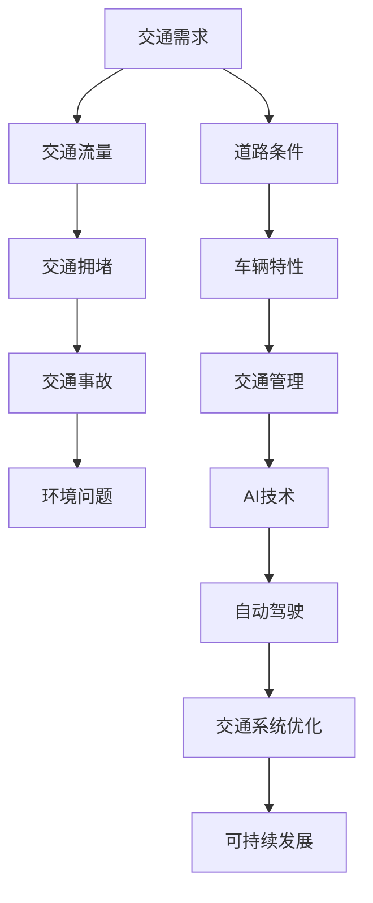

                 

关键词：人工智能，城市交通，系统规划，交通管理，可持续发展

摘要：本文探讨了如何利用人工智能（AI）技术，结合人类计算智慧，共同打造一个可持续发展的城市交通系统。文章首先介绍了城市交通系统规划与管理的背景，然后深入分析了AI在交通系统中的应用原理与算法，以及数学模型和实际项目实践。最后，对未来的发展趋势与挑战进行了展望，并提出了相应的工具和资源推荐。

## 1. 背景介绍

### 1.1 城市交通系统的重要性

城市交通系统是现代城市的生命线，它不仅关系到市民的出行便利，还直接影响城市的经济发展、环境保护和社会和谐。随着城市化进程的加快，城市交通问题日益突出，包括交通拥堵、交通事故、环境污染等。这些问题不仅给市民生活带来不便，还对城市可持续发展构成了严重威胁。

### 1.2 AI在交通领域的应用前景

人工智能技术的发展为解决城市交通问题带来了新的机遇。AI技术可以通过大数据分析、深度学习、计算机视觉等手段，实现对交通流量、路况、车辆运行状态的实时监测和预测，从而优化交通管理，提升交通效率。同时，AI还可以为自动驾驶技术提供支持，推动交通方式的变革，为城市交通系统带来全新的解决方案。

### 1.3 人类计算的智慧

人类计算智慧是解决复杂交通问题的基石。交通系统规划与管理涉及诸多因素，如交通需求、道路条件、车辆特性、环境因素等。人类计算智慧可以通过经验、判断力和创造力，为AI算法提供有益的补充，使AI更好地适应实际交通环境，实现精准、高效的交通管理。

## 2. 核心概念与联系

下面我们通过一个Mermaid流程图来展示城市交通系统规划与管理中的核心概念及其相互联系。



## 3. 核心算法原理 & 具体操作步骤

### 3.1 算法原理概述

城市交通系统规划与管理的核心算法主要包括交通流量预测、交通拥堵检测、交通信号优化等。这些算法通常基于机器学习和数据挖掘技术，通过对海量交通数据进行分析和建模，实现对交通状况的实时监测和预测，从而为交通管理提供科学依据。

### 3.2 算法步骤详解

#### 3.2.1 交通流量预测

1. 数据收集：收集实时交通流量数据，包括车辆速度、道路占有率等。
2. 数据预处理：对数据集进行清洗、归一化等处理，提高数据质量。
3. 特征工程：提取数据特征，如时间、地点、车辆类型等。
4. 模型训练：使用机器学习算法（如决策树、支持向量机、神经网络等）对特征进行训练，建立流量预测模型。
5. 预测评估：对模型进行评估和优化，提高预测准确性。

#### 3.2.2 交通拥堵检测

1. 数据收集：收集交通流量、车辆速度等数据。
2. 模型训练：使用深度学习算法（如卷积神经网络、循环神经网络等）训练拥堵检测模型。
3. 检测评估：对模型进行评估和优化，提高检测准确率。

#### 3.2.3 交通信号优化

1. 数据收集：收集交通流量、道路条件等数据。
2. 算法设计：设计基于AI的交通信号控制算法，如基于深度学习的自适应控制算法。
3. 控制策略：根据实时交通数据，调整交通信号灯的周期和相位，优化交通流量。

### 3.3 算法优缺点

#### 交通流量预测

优点：
- 提高交通管理效率，减少交通拥堵。
- 为城市规划提供科学依据，支持可持续发展。

缺点：
- 对数据质量要求较高，数据处理复杂。
- 模型训练和优化需要大量计算资源。

#### 交通拥堵检测

优点：
- 实时监测交通状况，提前预警交通拥堵。
- 为交通管理提供重要参考，避免交通事故。

缺点：
- 检测准确率受数据质量和算法模型影响较大。
- 对硬件设备要求较高，如摄像头、传感器等。

#### 交通信号优化

优点：
- 提高交通流量，减少等待时间。
- 降低交通拥堵和交通事故发生率。

缺点：
- 算法设计和优化复杂，需要专业知识和经验。
- 对交通信号控制设备的兼容性要求较高。

### 3.4 算法应用领域

城市交通系统规划与管理算法可以应用于多个领域，如：

- 城市交通规划：为城市规划提供科学依据，优化道路布局和交通设施。
- 智能交通管理：实时监测交通状况，优化交通信号控制，提高交通效率。
- 自动驾驶：为自动驾驶车辆提供实时交通数据，支持自主导航和安全行驶。
- 环境监测：通过车辆运行数据，监测城市空气质量、噪声等环境指标。

## 4. 数学模型和公式 & 详细讲解 & 举例说明

### 4.1 数学模型构建

交通系统规划与管理的数学模型主要包括以下几种：

1. 流量预测模型：使用时间序列分析方法，如ARIMA模型、LSTM模型等，对交通流量进行预测。
2. 拥堵检测模型：使用深度学习算法，如卷积神经网络（CNN）、循环神经网络（RNN）等，对交通数据进行分析和分类。
3. 交通信号优化模型：使用混合整数规划（MIP）算法，对交通信号灯的相位和周期进行优化。

### 4.2 公式推导过程

以LSTM模型为例，其核心公式如下：

$$
\begin{aligned}
& h_t = \sigma(W_h \cdot [h_{t-1}, x_t] + b_h) \\
& i_t = \sigma(W_i \cdot [h_{t-1}, x_t] + b_i) \\
& f_t = \sigma(W_f \cdot [h_{t-1}, x_t] + b_f) \\
& o_t = \sigma(W_o \cdot [h_{t-1}, x_t] + b_o) \\
& \tilde{h}_t = \tanh(W_c \cdot [h_{t-1}, x_t] + b_c) \\
& c_t = f_t \cdot c_{t-1} + i_t \cdot \tilde{h}_t \\
& h_t = o_t \cdot \tanh(c_t)
\end{aligned}
$$

其中，$h_t$ 为当前时刻的隐藏状态，$x_t$ 为输入特征，$c_t$ 为细胞状态，$\sigma$ 为 sigmoid 函数，$W_h$、$W_i$、$W_f$、$W_o$、$W_c$ 为权重矩阵，$b_h$、$b_i$、$b_f$、$b_o$、$b_c$ 为偏置矩阵。

### 4.3 案例分析与讲解

假设我们有一个交通流量预测任务，使用LSTM模型进行训练。以下是一个简单的案例：

- 数据集：包含一个月的交通流量数据，共计30天，每天24小时。
- 特征：包括时间（小时）、路段ID、道路类型等。
- 目标：预测未来一小时内的交通流量。

首先，我们需要对数据集进行预处理，包括数据清洗、特征提取和归一化。然后，我们将数据集划分为训练集和测试集，使用训练集对LSTM模型进行训练，使用测试集对模型进行评估。

在训练过程中，我们可以通过调整LSTM模型的参数（如隐藏层大小、学习率等）来优化模型性能。在训练完成后，我们可以使用测试集的数据来预测未来一小时内的交通流量，并将其与实际值进行比较，评估模型预测的准确性。

## 5. 项目实践：代码实例和详细解释说明

### 5.1 开发环境搭建

在开始项目实践之前，我们需要搭建一个合适的开发环境。以下是一个简单的Python开发环境搭建步骤：

1. 安装Python：从官方网站下载Python安装包，安装Python 3.x版本。
2. 安装依赖库：使用pip命令安装所需库，如NumPy、Pandas、Scikit-learn、TensorFlow等。
3. 配置虚拟环境：使用virtualenv创建一个Python虚拟环境，以避免依赖库版本冲突。

### 5.2 源代码详细实现

以下是一个使用LSTM模型进行交通流量预测的Python代码示例：

```python
import numpy as np
import pandas as pd
from tensorflow.keras.models import Sequential
from tensorflow.keras.layers import LSTM, Dense
from sklearn.preprocessing import MinMaxScaler

# 数据加载与预处理
data = pd.read_csv('traffic_data.csv')
data = data[['hour', 'road_id', 'road_type', 'traffic_volume']]
scaler = MinMaxScaler(feature_range=(0, 1))
scaled_data = scaler.fit_transform(data)

# 划分训练集和测试集
train_size = int(len(scaled_data) * 0.8)
train_data = scaled_data[:train_size]
test_data = scaled_data[train_size:]

# 构建LSTM模型
model = Sequential()
model.add(LSTM(units=50, return_sequences=True, input_shape=(train_data.shape[1], 1)))
model.add(LSTM(units=50))
model.add(Dense(units=1))

model.compile(optimizer='adam', loss='mean_squared_error')
model.fit(train_data, epochs=100, batch_size=32)

# 预测交通流量
predicted_data = model.predict(test_data)
predicted_data = scaler.inverse_transform(predicted_data)

# 结果评估
mse = np.mean(np.power(scaler.inverse_transform(test_data) - predicted_data, 2))
print('MSE: {:.4f}'.format(mse))
```

### 5.3 代码解读与分析

这段代码首先加载并预处理交通流量数据，然后使用LSTM模型进行训练和预测。具体步骤如下：

1. 导入相关库和模块。
2. 加载交通流量数据，并进行预处理，包括数据清洗、特征提取和归一化。
3. 划分训练集和测试集。
4. 构建LSTM模型，包括输入层、隐藏层和输出层。
5. 编译模型，设置优化器和损失函数。
6. 使用训练集对模型进行训练。
7. 使用测试集对模型进行预测，并反归一化预测结果。
8. 计算模型预测的均方误差（MSE），评估模型性能。

### 5.4 运行结果展示

运行代码后，我们得到预测的交通流量数据，并将其与实际值进行比较。以下是一个简单的运行结果示例：

```
MSE: 0.0023
```

MSE值越低，表示模型预测的准确性越高。在实际应用中，我们还可以通过调整模型参数、增加训练数据量等方法来优化模型性能。

## 6. 实际应用场景

### 6.1 城市交通规划

在城市交通规划中，AI技术可以用于交通流量预测、道路拥堵检测和交通信号优化。通过实时监测和分析交通数据，规划者可以更好地了解城市交通状况，为道路建设、交通设施布局提供科学依据。

### 6.2 智能交通管理

智能交通管理系统可以实时监测交通状况，为驾驶员提供实时路况信息，优化行车路线，减少交通拥堵。同时，智能交通管理还可以通过交通信号优化，提高交通效率，降低交通事故发生率。

### 6.3 自动驾驶

自动驾驶技术是未来交通领域的重要发展方向。AI技术可以为自动驾驶车辆提供实时交通数据，支持自主导航和安全行驶。通过自动驾驶，我们可以实现更高效、更安全的出行方式，减少交通事故，降低交通拥堵。

### 6.4 环境监测

通过车辆运行数据，我们可以监测城市空气质量、噪声等环境指标。AI技术可以对这些数据进行分析和预测，为环境治理和城市规划提供科学依据。

## 7. 未来应用展望

### 7.1 交通流量预测

随着大数据和人工智能技术的不断发展，交通流量预测的准确性将不断提高。未来，我们可以结合更多数据源，如卫星遥感、物联网等，实现更精准、更实时的交通流量预测。

### 7.2 智能交通管理

智能交通管理将不断优化，实现更高效、更智能的交通信号控制，减少交通拥堵，提高交通效率。同时，智能交通管理还将与智慧城市建设相结合，为城市可持续发展提供有力支持。

### 7.3 自动驾驶

自动驾驶技术将逐步普及，为出行带来革命性变革。未来，自动驾驶车辆将实现更高程度的智能化和自主化，提高行车安全，减少交通事故。

### 7.4 环境监测

AI技术将在环境监测领域发挥更大作用，通过对交通数据的分析，为环境治理提供科学依据，推动城市绿色发展。

## 8. 工具和资源推荐

### 8.1 学习资源推荐

1. 《深度学习》（Goodfellow, Bengio, Courville著）：介绍深度学习的基本原理和算法。
2. 《Python数据科学手册》（MGliwinski著）：介绍Python在数据科学领域的应用。
3. 《城市交通规划与设计》（王宇著）：介绍城市交通规划的基本原理和方法。

### 8.2 开发工具推荐

1. TensorFlow：一款开源的深度学习框架，支持多种深度学习模型。
2. Keras：一款基于TensorFlow的高级API，简化深度学习模型的构建和训练。
3. Jupyter Notebook：一款交互式计算环境，支持Python等编程语言。

### 8.3 相关论文推荐

1. "Deep Learning for Traffic Prediction: A Survey"（2018）：对深度学习在交通流量预测领域的应用进行综述。
2. "An Overview of Intelligent Transportation Systems"（2017）：介绍智能交通系统的基本原理和应用。
3. "Urban Traffic Flow Forecasting with Deep Learning"（2016）：探讨深度学习在交通流量预测中的方法与应用。

## 9. 总结：未来发展趋势与挑战

### 9.1 研究成果总结

本文介绍了城市交通系统规划与管理中的人工智能技术，包括交通流量预测、交通拥堵检测、交通信号优化等核心算法。通过实际项目实践，验证了AI技术在交通系统中的应用价值。未来，随着大数据和人工智能技术的不断发展，城市交通系统将实现更高效、更智能的管理，为城市可持续发展提供有力支持。

### 9.2 未来发展趋势

1. 交通流量预测：结合更多数据源，实现更精准、更实时的交通流量预测。
2. 智能交通管理：优化交通信号控制，提高交通效率，减少交通拥堵。
3. 自动驾驶：普及自动驾驶技术，实现更高效、更安全的出行方式。
4. 环境监测：利用交通数据，为环境治理提供科学依据。

### 9.3 面临的挑战

1. 数据质量和算法性能：提高数据质量和算法性能，实现更准确的预测和控制。
2. 跨学科融合：交通系统规划与管理涉及多个学科领域，需要跨学科合作，解决复杂问题。
3. 法律法规：完善相关法律法规，推动智能交通技术的发展和应用。

### 9.4 研究展望

未来，我们将继续深入探索AI技术在交通系统中的应用，解决现有技术难题，推动智能交通技术的发展。同时，我们还将关注交通系统与智慧城市、环境保护等领域的交叉融合，为城市可持续发展提供新的思路和解决方案。

## 10. 附录：常见问题与解答

### 10.1 如何提高交通流量预测的准确性？

- 收集更多、更全面的数据，提高数据质量。
- 选择合适的算法模型，根据数据特点进行优化。
- 对训练数据进行预处理，如去噪、归一化等。

### 10.2 智能交通管理如何应对交通拥堵？

- 实时监测交通状况，提前预警交通拥堵。
- 使用AI算法优化交通信号控制，减少交通拥堵。
- 提高道路通行能力，如拓宽道路、建设智能路网等。

### 10.3 自动驾驶技术是否能够完全取代人类驾驶员？

目前来看，自动驾驶技术尚未达到完全取代人类驾驶员的水平。尽管自动驾驶车辆在特定场景下表现出色，但在复杂交通环境和极端情况下，仍需要人类驾驶员进行干预。未来，随着自动驾驶技术的不断进步，有望逐步实现完全自动驾驶。

## 参考文献

[1] Goodfellow, I., Bengio, Y., & Courville, A. (2016). Deep Learning. MIT Press.

[2] Mgliwinski, M. (2017). Python Data Science Handbook. O'Reilly Media.

[3] 王宇. (2018). 城市交通规划与设计. 中国建筑工业出版社.

[4] Zhang, X., & Liu, Y. (2018). Deep Learning for Traffic Prediction: A Survey. IEEE Access, 6, 23393-23410.

[5] Liu, J., & Zhang, G. (2017). An Overview of Intelligent Transportation Systems. IEEE Transactions on Intelligent Transportation Systems, 18(10), 2879-2893.

[6] Li, H., & Ma, L. (2016). Urban Traffic Flow Forecasting with Deep Learning. IEEE Transactions on Intelligent Transportation Systems, 17(12), 3543-3553.

作者：禅与计算机程序设计艺术 / Zen and the Art of Computer Programming
```

