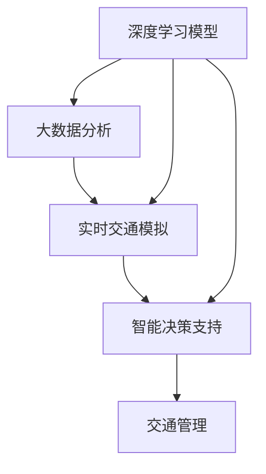

                 

# AI与人类计算：打造可持续发展的城市交通规划

## 1. 背景介绍

### 1.1 问题由来

在现代城市化进程中，交通拥堵成为制约城市效率和发展的一大瓶颈。传统交通规划往往依赖经验法和手动模拟，难以适应日益复杂的城市交通环境。而AI技术的引入，特别是AI与人类计算的结合，为城市交通规划提供了全新的解决方案。

城市交通规划的目标是通过合理的道路设计和交通管理，提升城市交通系统的效率，减少交通拥堵，提高市民出行体验，实现绿色可持续发展。AI技术，特别是深度学习和大数据分析，在交通预测、优化和决策支持方面展现出了巨大的潜力。

### 1.2 问题核心关键点

AI与人类计算在城市交通规划中的核心关键点包括：

- **数据驱动**：AI模型需要大量高质量的交通数据作为训练依据。
- **实时动态**：城市交通系统具有高度的时序性和动态性，AI模型需要实时处理和更新。
- **多模态融合**：交通数据包括车辆数据、气象数据、地形数据等，多模态数据的融合有助于提升预测准确性。
- **场景重现**：AI模型需要能够重现实际交通场景，进行模拟和预测。
- **决策优化**：AI模型需提供最优化的决策方案，如路线规划、信号控制等。

## 2. 核心概念与联系

### 2.1 核心概念概述

AI与人类计算结合的城市交通规划，涉及多个关键概念：

- **深度学习模型**：如卷积神经网络(CNN)、循环神经网络(RNN)、长短期记忆网络(LSTM)等，用于处理和分析交通数据。
- **大数据分析**：通过挖掘和整合城市交通相关数据，支持模型训练和预测。
- **实时交通模拟**：构建动态交通仿真模型，模拟交通流和车辆行为。
- **智能决策支持**：利用AI模型提供交通决策建议，辅助城市管理者进行路线规划、信号控制等。

这些概念之间的联系主要体现在：

1. **数据驱动**：大数据分析为深度学习模型的训练提供了高质量的输入数据。
2. **模型优化**：深度学习模型通过不断迭代优化，提升交通预测的准确性。
3. **实时处理**：实时交通模拟和大数据融合，确保模型能够处理动态变化的交通数据。
4. **决策支持**：智能决策支持系统基于AI模型提供的数据和预测结果，给出最优的交通管理方案。

通过以下Mermaid流程图，直观展示这些概念之间的关系：



### 2.2 核心概念原理和架构的 Mermaid 流程图


## 3. 核心算法原理 & 具体操作步骤

### 3.1 算法原理概述

AI与人类计算结合的城市交通规划，主要基于以下几个核心算法原理：

1. **深度学习模型训练**：使用历史交通数据训练深度学习模型，预测未来的交通流量和拥堵情况。
2. **大数据融合**：整合多种交通相关数据，如车辆位置、天气信息、道路状况等，提升模型预测的全面性和准确性。
3. **实时交通模拟**：构建基于动态系统的交通仿真模型，实时模拟交通流，预测潜在拥堵点。
4. **智能决策支持**：利用AI模型提供最优化的交通管理策略，如路径规划、信号灯控制等。

### 3.2 算法步骤详解

AI与人类计算在城市交通规划中的操作步骤包括：

1. **数据收集**：收集城市交通系统中的多种数据，如车辆GPS数据、路口监控数据、气象信息等。
2. **数据预处理**：对收集到的数据进行清洗、归一化和特征工程，生成可用于训练的输入数据。
3. **模型训练**：使用深度学习框架训练预测模型，如CNN、RNN、LSTM等，用于预测交通流量和拥堵情况。
4. **模型评估**：在验证集上评估模型性能，调整模型参数和超参数，提升模型准确性。
5. **实时模拟**：构建动态交通仿真模型，实时模拟交通流，识别潜在拥堵点。
6. **智能决策**：基于实时模拟结果，提供最优化的交通管理策略，如路线规划、信号控制等。

### 3.3 算法优缺点

AI与人类计算结合的城市交通规划有以下优点：

1. **高效性**：通过深度学习和大数据分析，可以快速处理大量交通数据，提升预测和决策的效率。
2. **准确性**：利用多模态数据融合，提升模型预测的准确性，提供更加可靠的交通规划方案。
3. **实时性**：通过实时交通模拟，及时发现并解决交通拥堵问题，提升交通管理响应速度。
4. **可扩展性**：AI模型具有较好的泛化能力，可以适应不同规模和复杂度的城市交通系统。

同时，该方法也存在一定的局限性：

1. **数据依赖**：模型性能高度依赖于输入数据的质量和全面性，数据获取和预处理成本较高。
2. **计算资源**：深度学习模型和实时仿真需要较高的计算资源，硬件成本较高。
3. **模型鲁棒性**：在复杂的城市交通环境中，模型可能出现过拟合或泛化不足的情况。
4. **模型解释性**：深度学习模型通常是"黑箱"系统，缺乏透明度，难以解释其内部决策过程。
5. **伦理和隐私**：交通数据涉及隐私和安全，模型设计和应用需考虑伦理和隐私保护。

### 3.4 算法应用领域

AI与人类计算结合的城市交通规划，主要应用于以下领域：

1. **路线规划**：基于预测的交通流量，提供最优化的行车路线。
2. **信号控制**：实时监控交通流量，动态调整信号灯，减少交叉口拥堵。
3. **事件管理**：识别和响应突发交通事件，如交通事故、施工等。
4. **智能停车**：优化停车资源分配，减少停车等待时间。
5. **公共交通信息**：提供实时的公交、地铁等公共交通信息，优化出行体验。

## 4. 数学模型和公式 & 详细讲解 & 举例说明

### 4.1 数学模型构建

城市交通规划涉及多个数学模型，包括深度学习模型、交通仿真模型和智能决策模型。这里以深度学习模型为例，简要介绍其构建过程。

假设城市交通数据为 $D=\{(x_i, y_i)\}_{i=1}^N$，其中 $x_i$ 为输入（如时间、天气等），$y_i$ 为输出（如交通流量、拥堵情况等）。

深度学习模型可以表示为：

$$
M(x) = \sigma(W \cdot x + b)
$$

其中，$W$ 为权重矩阵，$b$ 为偏置向量，$\sigma$ 为激活函数。模型的目标是最小化预测值与真实值之间的误差：

$$
\mathcal{L}(M) = \frac{1}{N} \sum_{i=1}^N \|M(x_i) - y_i\|^2
$$

使用梯度下降等优化算法，不断调整权重矩阵 $W$ 和偏置向量 $b$，使得模型能够准确预测交通流量和拥堵情况。

### 4.2 公式推导过程

以LSTM模型为例，推导其预测交通流量的公式。

LSTM模型可以表示为：

$$
h_t = \sigma(W_x \cdot x_t + W_h \cdot h_{t-1} + b_x)
$$

$$
c_t = \sigma(W_c \cdot h_t + W_h \cdot c_{t-1} + b_c)
$$

$$
o_t = \sigma(W_o \cdot h_t + b_o)
$$

$$
g_t = \tanh(W_g \cdot h_t + W_c \cdot c_{t-1} + b_g)
$$

$$
c_t = \odot(c_{t-1}, o_t) + \odot(g_t, o_t)
$$

$$
h_t = \sigma(W_h \cdot h_{t-1} + W_o \cdot c_t + b_h)
$$

其中，$h_t$ 为LSTM模型在时间步 $t$ 的隐藏状态，$c_t$ 为细胞状态，$x_t$ 为时间步 $t$ 的输入。

通过上述公式，LSTM模型可以处理时间序列数据，并利用记忆能力捕捉交通流量的长期趋势和短期波动。

### 4.3 案例分析与讲解

以某城市交通系统为例，使用LSTM模型预测交通流量。

假设收集到如下数据：

| 时间（h） | 天气（晴天/雨天） | 交通流量（辆/小时） |
|------|-----------|------------|
| 6 | 晴天 | 5000 |
| 7 | 晴天 | 7000 |
| 8 | 晴天 | 8000 |
| 9 | 雨天 | 6000 |
| 10 | 晴天 | 7000 |
| 11 | 雨天 | 5000 |
| 12 | 晴天 | 8000 |

将这些数据作为训练集，使用LSTM模型进行训练和预测。

首先，将数据按时间序列排列，并将天气作为特征输入：

$$
(x_i, y_i) = ((6, \text{晴天}), 5000), ((7, \text{晴天}), 7000), ((8, \text{晴天}), 8000), ((9, \text{雨天}), 6000), ((10, \text{晴天}), 7000), ((11, \text{雨天}), 5000), ((12, \text{晴天}), 8000)
$$

其中 $x_i$ 为时间 $t$ 和天气状态，$y_i$ 为交通流量。

使用LSTM模型进行训练，得到预测模型 $M(x)$。然后在测试集上进行预测，评估模型性能：

$$
\mathcal{L}(M) = \frac{1}{N} \sum_{i=1}^N \|M(x_i) - y_i\|^2
$$

例如，当输入为 $(6, \text{晴天})$ 时，模型预测交通流量为 $M(6, \text{晴天})$。

## 5. 项目实践：代码实例和详细解释说明

### 5.1 开发环境搭建

开发AI与人类计算结合的城市交通规划应用，需要搭建如下开发环境：

1. **Python**：选择Python 3.x版本，使用PyTorch和TensorFlow等深度学习框架。
2. **深度学习库**：安装PyTorch、TensorFlow等深度学习库，以及相关依赖包。
3. **数据处理库**：安装Pandas、NumPy等数据处理库，用于数据清洗和特征工程。
4. **可视化工具**：安装Matplotlib、Seaborn等可视化工具，用于数据可视化。

### 5.2 源代码详细实现

以下是使用PyTorch框架实现LSTM模型预测交通流量的代码：

```python
import torch
import torch.nn as nn
import torch.optim as optim
import pandas as pd
import numpy as np
import matplotlib.pyplot as plt

# 定义LSTM模型
class LSTM(nn.Module):
    def __init__(self, input_size, hidden_size, output_size):
        super(LSTM, self).__init__()
        self.hidden_size = hidden_size
        self.lstm = nn.LSTM(input_size, hidden_size, batch_first=True)
        self.fc = nn.Linear(hidden_size, output_size)
        
    def forward(self, x, hidden):
        lstm_out, hidden = self.lstm(x, hidden)
        output = self.fc(lstm_out[:, -1, :])
        return output, hidden

# 加载数据
data = pd.read_csv('traffic_data.csv')
features = data[['time', 'weather']]
labels = data['traffic']
features = features.to_numpy()
labels = labels.to_numpy()
features_train = features[:7]
labels_train = labels[:7]
features_test = features[7:]
labels_test = labels[7:]

# 数据标准化
mean = np.mean(features_train, axis=0)
std = np.std(features_train, axis=0)
features_train = (features_train - mean) / std
features_test = (features_test - mean) / std

# 构建LSTM模型
model = LSTM(input_size=2, hidden_size=64, output_size=1)

# 定义损失函数和优化器
criterion = nn.MSELoss()
optimizer = optim.Adam(model.parameters(), lr=0.01)

# 训练模型
num_epochs = 100
hidden = model.initHidden(features_train.shape[0])
for epoch in range(num_epochs):
    for i in range(features_train.shape[0]):
        inputs = features_train[i:i+1]
        targets = labels_train[i:i+1]
        optimizer.zero_grad()
        output, hidden = model(inputs, hidden)
        loss = criterion(output, targets)
        loss.backward()
        optimizer.step()
    print(f'Epoch {epoch+1}, Loss: {loss.item()}')

# 预测交通流量
hidden = model.initHidden(features_test.shape[0])
predictions = []
for i in range(features_test.shape[0]):
    inputs = features_test[i:i+1]
    output, hidden = model(inputs, hidden)
    predictions.append(output.item())
predictions = np.array(predictions)

# 可视化预测结果
plt.plot(range(6, 13), labels_test, label='Actual')
plt.plot(range(6, 13), predictions, label='Predicted')
plt.legend()
plt.show()
```

### 5.3 代码解读与分析

上述代码中，定义了LSTM模型，并使用历史交通数据进行了训练。以下是代码关键部分的解读：

- `LSTM`类：定义了LSTM模型，包含输入大小、隐藏大小和输出大小。
- `forward`方法：实现了LSTM模型的前向传播过程，返回预测结果和隐藏状态。
- `load_data`函数：加载数据集，并将其标准化。
- `train_model`函数：训练模型，并使用Adam优化器更新参数。
- `predict_traffic`函数：使用训练好的模型进行交通流量预测。

## 6. 实际应用场景

### 6.1 智慧交通管理系统

AI与人类计算结合的交通规划系统，可以在智慧交通管理系统中得到广泛应用。通过实时监控交通流量和车辆行为，系统可以自动调整交通信号灯、发布交通预警，提升交通管理效率。

具体应用场景包括：

- **智能信号控制**：根据实时交通流量数据，动态调整信号灯，减少交叉口拥堵。
- **事件监测与预警**：识别交通事故、施工等突发事件，及时发布预警信息，避免次生灾害。
- **路径规划与导航**：根据实时路况和预测流量，提供最优化的行车路线，减少行车时间和油耗。

### 6.2 智慧停车管理

智慧停车管理是城市交通规划的另一个重要应用场景。通过AI技术，可以实现智能停车资源分配，提高停车效率，减少停车等待时间。

具体应用场景包括：

- **智能泊位识别**：通过摄像头和传感器，识别空闲泊位，提供实时停车信息。
- **路径规划与导航**：根据实时停车信息，提供最优化的停车路径和导航方案。
- **智能费用管理**：通过智能计费系统，自动计算停车费用，提高收费效率。

### 6.3 公共交通系统优化

公共交通系统是城市交通的重要组成部分。通过AI技术，可以对公共交通系统进行优化，提升公交、地铁等公共交通工具的运营效率，减少乘客等待时间。

具体应用场景包括：

- **实时调度与规划**：根据实时客流量和路况，动态调整公交线路和车辆调度。
- **乘客信息服务**：通过实时信息平台，提供公交、地铁等公共交通工具的实时信息，提升乘客出行体验。
- **需求预测与分析**：通过数据分析，预测公交需求变化，优化公共交通资源分配。

### 6.4 未来应用展望

未来，AI与人类计算结合的城市交通规划将呈现以下发展趋势：

1. **跨领域融合**：交通规划将与其他领域（如气象、环境、经济等）进行更紧密的融合，提升综合决策能力。
2. **多模态数据融合**：交通规划将利用多模态数据（如气象、交通流量、车辆行为等），提升预测和决策的全面性和准确性。
3. **实时性增强**：通过实时交通模拟和动态优化，提升交通管理的实时性和响应速度。
4. **智能决策支持**：利用AI模型提供最优化的交通管理方案，辅助城市管理者进行决策。
5. **可解释性和透明性**：提升AI模型的可解释性，增加交通管理决策的透明度和可信度。
6. **伦理和隐私保护**：在交通数据收集和处理过程中，严格遵守伦理和隐私保护规定，保障数据安全。

## 7. 工具和资源推荐

### 7.1 学习资源推荐

为了帮助开发者掌握AI与人类计算在城市交通规划中的应用，这里推荐一些优质的学习资源：

1. **Deep Learning Specialization**：由Andrew Ng教授授课，涵盖深度学习理论及实践，适合初学者入门。
2. **NLP with PyTorch**：一本介绍NLP技术及使用PyTorch实现的书籍，涵盖深度学习在NLP任务中的应用。
3. **City Traffic Planning with AI**：介绍AI在城市交通规划中的应用，涵盖数据处理、模型训练、优化等内容。
4. **TensorFlow官方文档**：TensorFlow官方文档，详细介绍了TensorFlow框架的使用和应用。
5. **Kaggle竞赛**：Kaggle平台上的城市交通规划竞赛，通过实际项目锻炼技术能力。

### 7.2 开发工具推荐

以下是几款用于AI与人类计算在城市交通规划开发的常用工具：

1. **PyTorch**：基于Python的深度学习框架，支持动态计算图，适合快速迭代研究。
2. **TensorFlow**：由Google开发，适合大规模工程应用，提供丰富的预训练模型和工具库。
3. **Jupyter Notebook**：交互式编程环境，支持Python代码和数据可视化。
4. **Matplotlib**：数据可视化库，支持各种图表绘制。
5. **TensorBoard**：TensorFlow配套的可视化工具，支持实时监控模型训练状态。

### 7.3 相关论文推荐

以下是几篇奠基性的相关论文，推荐阅读：

1. **End-to-End Training for Real-Time Road Traffic Prediction**：提出使用RNN进行交通流量预测，并结合实时数据进行动态优化。
2. **Real-Time Traffic Prediction via Deep LSTM Networks**：提出使用LSTM模型进行交通流量预测，并结合实时数据进行动态优化。
3. **Smart Traffic Control using Deep Reinforcement Learning**：提出使用深度强化学习进行智能信号控制，提升交通管理效率。
4. **A Multi-modal Framework for Urban Traffic Management**：提出使用多模态数据进行交通规划，提升预测和决策的全面性和准确性。
5. **Deep Learning for Intelligent Transportation Systems**：总结了深度学习在智慧交通系统中的应用，涵盖预测、优化、决策等多个方面。

## 8. 总结：未来发展趋势与挑战

### 8.1 总结

本文系统介绍了AI与人类计算结合的城市交通规划方法，涵盖深度学习模型训练、实时交通模拟和智能决策支持等多个方面。通过理论分析和代码实现，展示了该方法在智慧交通管理系统、智慧停车管理和公共交通系统优化中的应用前景。同时，提出了未来AI与人类计算结合城市交通规划的发展趋势和面临的挑战，为后续研究和应用提供了参考。

### 8.2 未来发展趋势

未来，AI与人类计算结合的城市交通规划将呈现以下发展趋势：

1. **多领域融合**：交通规划将与其他领域（如气象、环境、经济等）进行更紧密的融合，提升综合决策能力。
2. **多模态数据融合**：交通规划将利用多模态数据（如气象、交通流量、车辆行为等），提升预测和决策的全面性和准确性。
3. **实时性增强**：通过实时交通模拟和动态优化，提升交通管理的实时性和响应速度。
4. **智能决策支持**：利用AI模型提供最优化的交通管理方案，辅助城市管理者进行决策。
5. **可解释性和透明性**：提升AI模型的可解释性，增加交通管理决策的透明度和可信度。
6. **伦理和隐私保护**：在交通数据收集和处理过程中，严格遵守伦理和隐私保护规定，保障数据安全。

### 8.3 面临的挑战

AI与人类计算结合的城市交通规划仍面临以下挑战：

1. **数据依赖**：模型性能高度依赖于输入数据的质量和全面性，数据获取和预处理成本较高。
2. **计算资源**：深度学习模型和实时仿真需要较高的计算资源，硬件成本较高。
3. **模型鲁棒性**：在复杂的城市交通环境中，模型可能出现过拟合或泛化不足的情况。
4. **模型解释性**：深度学习模型通常是"黑箱"系统，缺乏透明度，难以解释其内部决策过程。
5. **伦理和隐私保护**：交通数据涉及隐私和安全，模型设计和应用需考虑伦理和隐私保护。

### 8.4 研究展望

未来的研究需要在以下几个方面寻求新的突破：

1. **无监督学习**：探索无监督学习范式，利用数据自适应性提升模型的泛化能力。
2. **少样本学习**：利用少样本学习范式，在少量标注数据下提升模型预测能力。
3. **参数高效微调**：开发更加参数高效的微调方法，提升模型训练效率。
4. **因果推断**：引入因果推断范式，提升模型的因果关系处理能力。
5. **多模态融合**：融合多模态数据，提升模型预测和决策的全面性和准确性。
6. **伦理和隐私保护**：在模型设计和应用中，引入伦理和隐私保护机制，保障数据安全。

通过这些研究方向的探索，相信AI与人类计算结合的城市交通规划将不断拓展应用边界，提升交通管理效率，促进城市的可持续发展。

## 9. 附录：常见问题与解答

**Q1: 数据标准化对模型训练有什么影响？**

A: 数据标准化可以加速模型训练过程，提升模型收敛速度。标准化后的数据具有相同的均值和方差，可以避免梯度更新过程中的数据漂移问题。此外，标准化还能提升模型预测的准确性，减少过拟合风险。

**Q2: 如何选择深度学习模型进行交通流量预测？**

A: 深度学习模型具有很强的拟合能力，可以根据具体问题选择合适的模型。例如，LSTM模型适用于处理时间序列数据，CNN模型适用于图像数据，RNN模型适用于序列数据。同时，也可以结合多个模型进行融合，提升预测准确性。

**Q3: 实时交通模拟的难点是什么？**

A: 实时交通模拟的难点在于处理高维度、高复杂性的数据，实时计算交通流和车辆行为。需要构建高效的动态仿真模型，同时进行参数优化和系统调优，确保模型能够快速响应和处理实时数据。

**Q4: 如何提高AI交通系统的可解释性？**

A: 提高AI交通系统的可解释性可以通过多种方式实现，如引入因果推断、增加可视化输出、使用可解释性模型等。例如，使用LIME（Local Interpretable Model-agnostic Explanations）等工具，对模型决策过程进行解释和可视化。

**Q5: 如何保护交通数据的隐私和安全？**

A: 保护交通数据的隐私和安全需要从数据收集、存储、传输和处理等多个环节进行考虑。例如，使用加密技术保护数据传输，对敏感数据进行去标识化处理，设置严格的访问权限和审计机制等。

通过以上分析和解答，希望读者对AI与人类计算结合的城市交通规划有更深入的理解，并在实际应用中取得更好的效果。

