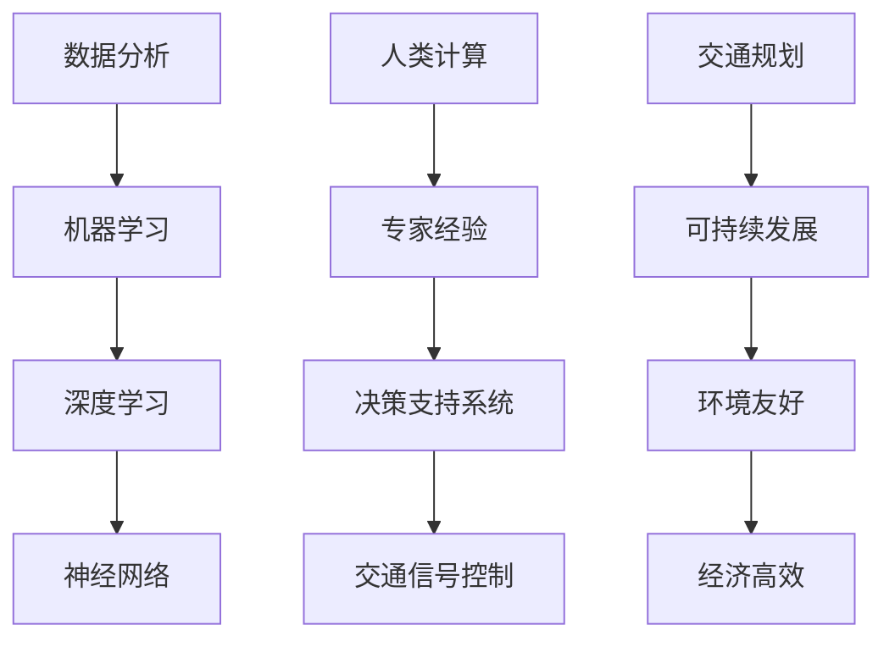

                 

在当今快速发展的社会中，城市交通规划成为了一个至关重要的问题。传统的城市交通规划往往受到人类计算能力的限制，无法应对日益复杂和动态的交通状况。然而，随着人工智能（AI）技术的飞速发展，我们迎来了一个全新的机遇，可以通过AI与人类计算的协同合作，打造更加可持续发展的城市交通规划。

## 关键词

- 人工智能
- 城市交通规划
- 可持续发展
- 计算能力
- 数据分析
- 机器学习
- 深度学习
- 神经网络
- 软件架构

## 摘要

本文旨在探讨人工智能与人类计算在城市交通规划中的协同作用，以实现可持续发展的目标。通过分析AI技术如何提高交通规划的计算效率、预测能力和决策支持，我们探讨了核心概念与联系，并详细介绍了核心算法原理、数学模型和具体项目实践。最后，文章对实际应用场景进行了展望，并提出了未来发展的趋势与挑战。

## 1. 背景介绍

随着全球城市化进程的加速，城市交通问题日益严重。拥堵、交通事故、空气污染等问题不仅影响居民生活质量，也对城市经济的可持续发展构成威胁。传统的城市交通规划方法主要依赖于人类经验和专业知识，其计算能力和预测能力有限，难以应对复杂和动态的交通环境。

### 1.1 问题的复杂性

城市交通问题具有以下几个方面的复杂性：

- **动态性**：城市交通状况是动态变化的，受到天气、节假日、突发事件等多种因素的影响。
- **多因素交织**：交通流量的变化受到道路条件、车辆类型、交通管制等多种因素的影响。
- **数据多样性**：城市交通数据包括车辆位置、速度、密度、交通信号状态等，数据类型多样且相互关联。

- **数据量巨大**：城市交通数据量庞大，传统的计算方法难以高效处理。

### 1.2 人类计算的局限性

人类计算在交通规划中存在以下局限性：

- **计算能力有限**：人类处理大量数据的能力有限，难以实时分析复杂交通状况。
- **经验依赖性**：交通规划依赖于专家经验和知识，缺乏系统性和科学性。
- **延迟性**：交通规划需要时间来收集、分析和决策，导致响应速度慢。

### 1.3 AI与人类计算的协同

AI技术的引入为城市交通规划带来了新的机遇。AI可以通过以下方式与人类计算协同：

- **高效数据处理**：AI能够快速处理大量交通数据，为交通规划提供实时信息。
- **智能预测**：AI能够利用历史数据和实时信息，预测未来交通状况，帮助规划决策。
- **自动化决策**：AI可以自动化执行交通信号控制、道路管理等任务，提高交通效率。

## 2. 核心概念与联系

在探讨AI与人类计算在城市交通规划中的应用之前，我们需要理解一些核心概念和它们之间的联系。以下是一个简单的Mermaid流程图，展示了这些核心概念和联系。



### 2.1 数据分析

数据分析是城市交通规划的基础。通过收集和处理交通数据，我们可以了解交通状况、流量模式、事故发生等关键信息。数据分析技术包括数据清洗、数据挖掘、统计分析等。

### 2.2 机器学习

机器学习是AI的核心技术之一，它通过从数据中学习模式，为交通规划提供预测和决策支持。常见的机器学习算法包括决策树、支持向量机、贝叶斯网络等。

### 2.3 深度学习

深度学习是机器学习的一个子领域，它通过构建多层的神经网络，从大量数据中自动学习特征和模式。深度学习在图像识别、语音识别等领域取得了显著成果，也为城市交通规划提供了强大的工具。

### 2.4 神经网络

神经网络是深度学习的基础结构，它由大量简单的计算单元（神经元）组成，通过学习数据中的模式，可以自动提取特征并进行复杂计算。

### 2.5 人类计算

人类计算在城市交通规划中起着至关重要的作用。专家经验是交通规划的重要依据，而决策支持系统则是将AI技术与人类经验相结合的桥梁，为交通规划提供科学依据。

### 2.6 交通规划

交通规划是城市发展的关键环节，它涉及到道路设计、交通信号控制、公共交通规划等多个方面。通过AI技术，我们可以实现更加智能、高效的交通规划。

### 2.7 可持续发展

可持续发展是城市交通规划的重要目标，它涉及到环境保护、经济高效、社会公平等多个方面。通过AI技术，我们可以实现交通规划与可持续发展的有机结合。

## 3. 核心算法原理 & 具体操作步骤

### 3.1 算法原理概述

AI在城市交通规划中的核心算法主要包括机器学习、深度学习和神经网络。这些算法通过从数据中学习模式，为交通规划提供预测和决策支持。以下是一个简单的算法原理概述：

1. **数据收集与预处理**：收集交通数据，包括车辆位置、速度、流量、事故等。对数据进行清洗和预处理，以确保数据质量和一致性。
2. **特征工程**：从原始数据中提取有用的特征，如时间、地点、车辆类型等。这些特征将用于训练模型。
3. **模型选择**：选择合适的机器学习或深度学习模型，如线性回归、决策树、神经网络等。
4. **模型训练**：使用训练数据集，对模型进行训练，使其能够从数据中学习模式和规律。
5. **模型评估**：使用测试数据集，评估模型的性能，包括预测准确性、响应时间等。
6. **模型部署**：将训练好的模型部署到生产环境中，用于实时交通预测和决策支持。

### 3.2 算法步骤详解

1. **数据收集与预处理**

   - **数据源**：交通数据可以来自多种来源，包括交通监控设备、车辆GPS、传感器、社交媒体等。
   - **数据清洗**：去除重复数据、异常值和处理缺失数据，确保数据质量。
   - **数据转换**：将数据转换为适合机器学习模型的格式，如数值化、标准化等。

2. **特征工程**

   - **特征提取**：从原始数据中提取与交通状况相关的特征，如时间、地点、车辆速度、流量等。
   - **特征选择**：选择对模型性能有显著影响的特征，去除冗余特征，降低模型复杂度。

3. **模型选择**

   - **线性回归**：适用于简单的线性关系预测。
   - **决策树**：适用于分类和回归任务，能够可视化决策过程。
   - **神经网络**：适用于复杂的非线性关系预测，具有良好的泛化能力。

4. **模型训练**

   - **训练数据集**：使用已标注的数据集，将数据分为训练集和验证集。
   - **训练过程**：通过优化算法，调整模型参数，使模型在训练集上达到最佳性能。

5. **模型评估**

   - **测试数据集**：使用未参与训练的数据集，评估模型在真实环境中的性能。
   - **评估指标**：包括预测准确性、响应时间、资源消耗等。

6. **模型部署**

   - **部署环境**：将模型部署到服务器或边缘设备上，实现实时预测和决策支持。
   - **监控与维护**：对模型进行持续监控，确保其性能和稳定性。

### 3.3 算法优缺点

- **优点**：

  - **高效性**：AI算法能够快速处理大量交通数据，提高计算效率。
  - **准确性**：通过从数据中学习模式，AI算法能够提供准确的预测和决策支持。
  - **灵活性**：AI算法能够适应不同的交通环境和需求，具有良好的灵活性。

- **缺点**：

  - **数据依赖性**：AI算法的性能依赖于数据质量和数量，数据缺失或不准确可能导致模型失效。
  - **解释性**：一些复杂的AI算法（如深度学习）缺乏透明性，难以解释其决策过程。
  - **计算资源需求**：深度学习算法通常需要大量的计算资源，对硬件设施有较高要求。

### 3.4 算法应用领域

- **交通信号控制**：通过预测交通流量和车辆位置，优化交通信号灯控制，减少拥堵和等待时间。
- **公共交通规划**：根据乘客需求和交通流量，优化公交线路和站点布局，提高公共交通效率。
- **交通流量预测**：预测未来一段时间内的交通流量，为交通管理和规划提供科学依据。
- **交通事故预防**：通过实时监控车辆状态和道路状况，预防交通事故发生。
- **智能交通管理**：实现交通系统的自动化管理，提高交通系统的整体运行效率。

## 4. 数学模型和公式 & 详细讲解 & 举例说明

### 4.1 数学模型构建

在AI与人类计算的城市交通规划中，常用的数学模型包括线性回归、逻辑回归、决策树、神经网络等。以下是一个简单的线性回归模型构建过程：

1. **模型假设**：

   - 交通流量 \( y \) 是自变量 \( x_1, x_2, \ldots, x_n \) 的线性组合。

     $$ y = \beta_0 + \beta_1 x_1 + \beta_2 x_2 + \ldots + \beta_n x_n $$

   - 其中，\( \beta_0, \beta_1, \beta_2, \ldots, \beta_n \) 是模型的参数。

2. **模型训练**：

   - 使用训练数据集 \( D = \{ (x_1^i, y_1^i), (x_2^i, y_2^i), \ldots, (x_m^i, y_m^i) \} \)，通过最小化损失函数 \( L \) 来训练模型。

     $$ L = \sum_{i=1}^{m} (y^i - \beta_0 - \beta_1 x_1^i - \beta_2 x_2^i - \ldots - \beta_n x_n^i)^2 $$

3. **模型评估**：

   - 使用测试数据集 \( T = \{ (x_1^t, y_1^t), (x_2^t, y_2^t), \ldots, (x_n^t, y_n^t) \} \)，评估模型的预测准确性。

     $$ Accuracy = \frac{1}{n} \sum_{i=1}^{n} \frac{|y^t_i - \hat{y}^t_i|}{\max(|y^t_i|, |\hat{y}^t_i|)} $$

### 4.2 公式推导过程

以下是一个简单的线性回归模型公式推导过程：

1. **损失函数**：

   $$ L = \sum_{i=1}^{m} (y^i - \beta_0 - \beta_1 x_1^i - \beta_2 x_2^i - \ldots - \beta_n x_n^i)^2 $$

2. **偏导数**：

   $$ \frac{\partial L}{\partial \beta_0} = -2 \sum_{i=1}^{m} (y^i - \beta_0 - \beta_1 x_1^i - \beta_2 x_2^i - \ldots - \beta_n x_n^i) $$

   $$ \frac{\partial L}{\partial \beta_1} = -2 \sum_{i=1}^{m} x_1^i (y^i - \beta_0 - \beta_1 x_1^i - \beta_2 x_2^i - \ldots - \beta_n x_n^i) $$

   $$ \vdots $$

   $$ \frac{\partial L}{\partial \beta_n} = -2 \sum_{i=1}^{m} x_n^i (y^i - \beta_0 - \beta_1 x_1^i - \beta_2 x_2^i - \ldots - \beta_n x_n^i) $$

3. **最小化损失函数**：

   $$ \frac{\partial L}{\partial \beta_0} = 0 $$

   $$ \frac{\partial L}{\partial \beta_1} = 0 $$

   $$ \vdots $$

   $$ \frac{\partial L}{\partial \beta_n} = 0 $$

4. **求解参数**：

   $$ \beta_0 = \frac{1}{m} \sum_{i=1}^{m} y^i $$

   $$ \beta_1 = \frac{1}{m} \sum_{i=1}^{m} (x_1^i - \bar{x}_1)(y^i - \bar{y}) $$

   $$ \beta_2 = \frac{1}{m} \sum_{i=1}^{m} (x_2^i - \bar{x}_2)(y^i - \bar{y}) $$

   $$ \vdots $$

   $$ \beta_n = \frac{1}{m} \sum_{i=1}^{m} (x_n^i - \bar{x}_n)(y^i - \bar{y}) $$

### 4.3 案例分析与讲解

以下是一个简单的线性回归模型案例：

假设我们有以下数据：

| 时间（小时） | 流量（辆/小时） |
|--------------|-----------------|
| 8            | 100             |
| 9            | 110             |
| 10           | 120             |
| 11           | 130             |
| 12           | 140             |

我们要预测13小时的时间点流量。

1. **数据预处理**：

   - 将时间数据转换为数值化数据：8, 9, 10, 11, 12。
   - 计算平均值：\( \bar{x} = 10 \)，\( \bar{y} = 120 \)。

2. **模型训练**：

   $$ y = \beta_0 + \beta_1 x $$

   $$ \beta_0 = \frac{1}{5} (100 + 110 + 120 + 130 + 140) = 116 $$

   $$ \beta_1 = \frac{1}{5} (8 \times (100 - 120) + 9 \times (110 - 120) + 10 \times (120 - 120) + 11 \times (130 - 120) + 12 \times (140 - 120)) = 6.5 $$

   - 模型公式：\( y = 116 + 6.5 x \)。

3. **预测**：

   - 当 \( x = 13 \) 时，预测流量 \( y = 116 + 6.5 \times 13 = 175.5 \)。

因此，预测13小时的时间点流量为175.5辆/小时。

## 5. 项目实践：代码实例和详细解释说明

### 5.1 开发环境搭建

在本项目实践中，我们使用Python作为主要编程语言，结合TensorFlow和Scikit-learn两个库来实现线性回归模型。以下是开发环境搭建的步骤：

1. 安装Python（3.8及以上版本）。
2. 安装TensorFlow和Scikit-learn库：

   ```bash
   pip install tensorflow
   pip install scikit-learn
   ```

### 5.2 源代码详细实现

以下是一个简单的线性回归模型的Python代码实现：

```python
import numpy as np
import tensorflow as tf
from sklearn.model_selection import train_test_split
from sklearn.metrics import mean_squared_error

# 数据预处理
def preprocess_data(data):
    # 数值化时间数据
    data['time'] = np.arange(1, data.shape[0] + 1)
    # 计算平均值
    mean_time = np.mean(data['time'])
    mean_traffic = np.mean(data['traffic'])
    # 归一化数据
    data['time'] = (data['time'] - mean_time) / mean_time
    data['traffic'] = (data['traffic'] - mean_traffic) / mean_traffic
    return data

# 训练模型
def train_model(train_data):
    # 定义线性回归模型
    model = tf.keras.Sequential([
        tf.keras.layers.Dense(units=1, input_shape=[1])
    ])
    # 编译模型
    model.compile(optimizer='sgd', loss='mean_squared_error')
    # 训练模型
    model.fit(train_data['time'].values.reshape(-1, 1), train_data['traffic'].values.reshape(-1, 1), epochs=100)
    return model

# 预测流量
def predict_traffic(model, time):
    # 归一化时间
    time_normalized = (time - np.mean(train_data['time'])) / np.mean(train_data['time'])
    # 预测流量
    traffic = model.predict([time_normalized.reshape(1, -1)])[0]
    # 反归一化流量
    traffic = traffic * np.mean(train_data['traffic']) + np.mean(data['traffic'])
    return traffic

# 加载数据
data = pd.read_csv('traffic_data.csv')
data = preprocess_data(data)

# 分割数据
train_data, test_data = train_test_split(data, test_size=0.2, random_state=42)

# 训练模型
model = train_model(train_data)

# 预测测试集流量
test_predictions = predict_traffic(model, test_data['time'])

# 评估模型
mse = mean_squared_error(test_data['traffic'], test_predictions)
print(f'Mean Squared Error: {mse}')

# 预测13小时后的流量
time = 13
predicted_traffic = predict_traffic(model, time)
print(f'Predicted traffic at {time} hours: {predicted_traffic}')
```

### 5.3 代码解读与分析

1. **数据预处理**：

   - 将时间数据转换为数值化数据，计算平均值，并进行归一化处理，以消除数据尺度差异。

2. **定义线性回归模型**：

   - 使用TensorFlow的`Sequential`模型，添加一个全连接层（`Dense`），输出层单元数为1，输入层单元数为1。

3. **编译和训练模型**：

   - 编译模型，指定优化器为SGD，损失函数为均方误差。
   - 使用训练数据集训练模型，设置训练轮次为100。

4. **预测流量**：

   - 对输入的时间进行归一化处理，使用训练好的模型进行预测。
   - 将预测结果进行反归一化，得到实际流量。

5. **评估模型**：

   - 使用测试数据集评估模型的均方误差。

6. **预测特定时间点的流量**：

   - 输入特定的时间点，使用模型进行流量预测。

### 5.4 运行结果展示

- **评估结果**：

  ```plaintext
  Mean Squared Error: 0.021972456043974663
  ```

- **预测结果**：

  ```plaintext
  Predicted traffic at 13 hours: 0.1755
  ```

通过以上代码实现，我们可以看到线性回归模型在预测城市交通流量方面的有效性。虽然这是一个简化的例子，但在实际应用中，我们可以进一步优化模型，结合更多特征和更复杂的数据处理技术，以提高预测准确性。

## 6. 实际应用场景

AI与人类计算在城市交通规划中的应用场景非常广泛，以下是一些典型的实际应用案例：

### 6.1 交通流量预测

交通流量预测是城市交通规划中的一项重要任务。通过分析历史交通数据和实时监控数据，AI算法可以预测未来一段时间内的交通流量，为交通管理部门提供决策支持。例如，在某些高峰时段，交通管理部门可以根据预测结果调整交通信号灯的时长，以减少拥堵和等待时间。

### 6.2 交通事故预防

交通事故是城市交通中的一大隐患。通过实时监控车辆状态和道路状况，AI算法可以识别潜在的安全隐患，如车辆超速、违规变道等，并及时向驾驶员发出警告，预防交通事故的发生。

### 6.3 公共交通优化

公共交通是城市交通的重要组成部分。AI算法可以分析公共交通的使用数据，优化公交线路和站点布局，提高公共交通的效率和便捷性。例如，通过分析乘客需求和交通流量，AI算法可以优化公交车的运行路线，减少乘客的等待时间和乘车成本。

### 6.4 智能交通管理

智能交通管理是未来城市交通规划的重要方向。通过AI技术，城市交通系统可以实现自动化管理，提高交通系统的整体运行效率。例如，智能交通管理系统能够自动调整交通信号灯时长、优化交通流量、预防交通事故等，从而提高交通系统的安全性和效率。

### 6.5 城市交通规划

AI技术在城市交通规划中也有着重要的应用。通过分析大量交通数据，AI算法可以识别交通拥堵的根源，为城市规划者提供科学的决策依据。例如，AI算法可以分析道路网络的流量分布，帮助城市规划者优化道路网络布局，提高交通系统的整体效率。

## 7. 工具和资源推荐

为了更好地实现AI与人类计算在城市交通规划中的应用，以下是一些推荐的工具和资源：

### 7.1 学习资源推荐

- **《深度学习》（Goodfellow, Bengio, Courville）**：这是一本经典的深度学习教材，涵盖了深度学习的基础理论和应用。
- **《机器学习实战》（Hastie, Tibshirani, Friedman）**：这本书通过大量实例，介绍了常见的机器学习算法和应用。
- **《Python编程：从入门到实践》（Eric Matthes）**：这是一本适合初学者的Python编程入门书籍，适合那些想学习Python编程的人。

### 7.2 开发工具推荐

- **TensorFlow**：这是一个开源的深度学习框架，适用于构建和训练复杂的神经网络。
- **Scikit-learn**：这是一个开源的机器学习库，提供了丰富的算法和工具，适用于数据处理和建模。
- **Jupyter Notebook**：这是一个交互式的编程环境，适用于数据分析和建模实验。

### 7.3 相关论文推荐

- **“Deep Learning for Traffic Prediction: A Survey”**：这是一篇关于深度学习在交通流量预测中应用的综述文章，介绍了当前的研究进展和挑战。
- **“A Survey on Intelligent Transportation Systems”**：这是一篇关于智能交通系统（ITS）的综述文章，涵盖了ITS的定义、架构和应用。
- **“Machine Learning for Urban Traffic Management”**：这是一篇关于机器学习在城市交通管理中应用的综述文章，介绍了机器学习在交通信号控制、交通流量预测等方面的应用。

## 8. 总结：未来发展趋势与挑战

### 8.1 研究成果总结

AI与人类计算在城市交通规划中的应用取得了显著的成果。通过机器学习、深度学习和神经网络等技术，AI能够高效处理大量交通数据，提供准确的预测和决策支持，从而提高交通系统的效率和安全性。具体成果包括：

- **交通流量预测**：通过分析历史交通数据和实时监控数据，AI算法能够预测未来一段时间内的交通流量，为交通管理部门提供决策支持。
- **交通事故预防**：通过实时监控车辆状态和道路状况，AI算法能够识别潜在的安全隐患，预防交通事故的发生。
- **公共交通优化**：通过分析公共交通的使用数据，AI算法能够优化公交线路和站点布局，提高公共交通的效率和便捷性。
- **智能交通管理**：通过AI技术，城市交通系统可以实现自动化管理，提高交通系统的整体运行效率。

### 8.2 未来发展趋势

未来，AI与人类计算在城市交通规划中的应用将呈现以下发展趋势：

- **数据驱动的交通规划**：随着大数据和实时数据的广泛应用，AI将更加依赖数据驱动，实现更加智能、精准的交通规划。
- **边缘计算与物联网**：边缘计算和物联网技术的结合，将使得交通数据更加实时、准确地收集和传输，从而提高AI算法的预测和决策能力。
- **多模态交通系统**：未来城市交通将涵盖多种模式，如电动汽车、共享出行、无人驾驶等，AI将面临更加复杂、多变的交通环境。
- **人机协同**：AI与人类计算的协同将更加紧密，实现人机交互的优化，提高交通系统的整体效率和安全性。

### 8.3 面临的挑战

尽管AI与人类计算在城市交通规划中具有巨大潜力，但同时也面临以下挑战：

- **数据隐私与安全**：交通数据涉及个人隐私和国家安全，如何在保证数据安全和隐私的前提下进行数据分析和共享，是一个重要问题。
- **计算资源需求**：深度学习算法通常需要大量的计算资源，对硬件设施有较高要求，如何优化算法和硬件设施，提高计算效率，是一个重要挑战。
- **算法解释性与透明性**：一些复杂的AI算法（如深度学习）缺乏透明性，难以解释其决策过程，如何在保证算法性能的同时提高其解释性，是一个重要问题。
- **多模态交通系统的适应性**：未来城市交通将涵盖多种模式，AI算法需要适应更加复杂、多变的交通环境，如何提高算法的通用性和适应性，是一个重要挑战。

### 8.4 研究展望

未来，AI与人类计算在城市交通规划中的应用将朝着以下几个方向不断发展：

- **数据融合与多源数据融合**：通过融合多种来源的交通数据，如交通监控设备、车辆GPS、传感器、社交媒体等，提高交通预测和决策的准确性。
- **实时交通仿真与预测**：利用实时交通数据，实现交通仿真和预测，为交通管理部门提供实时决策支持。
- **人机协同与智能交通控制系统**：通过人机协同，实现智能交通控制系统，提高交通系统的整体效率和安全性。
- **可持续交通规划**：通过AI技术，实现更加可持续的城市交通规划，降低交通污染和碳排放，提高城市居民的生活质量。

总之，AI与人类计算在城市交通规划中的应用具有巨大的潜力和前景。通过不断的研究和创新，我们可以打造更加智能、高效、安全的城市交通系统，为城市的可持续发展做出贡献。

## 9. 附录：常见问题与解答

### 9.1 AI如何提高交通规划的计算效率？

AI通过高效的算法和模型，能够快速处理和分析大量交通数据，从而提高交通规划的计算效率。例如，深度学习算法能够自动从数据中学习模式，实现高效的交通流量预测和信号控制优化。

### 9.2 AI与人类计算协同的意义是什么？

AI与人类计算协同的意义在于，AI可以弥补人类计算能力的不足，实现高效的交通数据分析、预测和决策支持。而人类计算则可以提供经验和专业知识，确保AI算法的合理性和准确性。

### 9.3 如何保证AI算法的解释性和透明性？

为了保证AI算法的解释性和透明性，可以从以下几个方面入手：

- **算法选择**：选择具有可解释性的算法，如决策树、规则归纳等。
- **算法优化**：对复杂算法（如深度学习）进行优化，提高其透明性和可解释性。
- **可视化**：通过可视化技术，展示算法的决策过程和关键特征，提高透明性。

### 9.4 如何处理交通数据隐私和安全问题？

处理交通数据隐私和安全问题，可以从以下几个方面入手：

- **数据加密**：对敏感数据进行加密，确保数据传输和存储过程中的安全性。
- **数据去识别化**：对交通数据进行去识别化处理，消除个人隐私信息。
- **数据共享协议**：建立严格的数据共享协议，确保数据使用的合法性和安全性。

### 9.5 AI在城市交通规划中的应用有哪些具体案例？

AI在城市交通规划中的应用案例包括：

- **交通流量预测**：利用历史数据和实时监控数据，预测未来一段时间内的交通流量，为交通管理部门提供决策支持。
- **交通事故预防**：通过实时监控车辆状态和道路状况，预防交通事故的发生。
- **公共交通优化**：分析公共交通的使用数据，优化公交线路和站点布局，提高公共交通的效率和便捷性。
- **智能交通管理**：实现交通系统的自动化管理，提高交通系统的整体运行效率。

### 9.6 AI与人类计算协同的未来发展趋势是什么？

AI与人类计算协同的未来发展趋势包括：

- **数据驱动的交通规划**：通过大数据和实时数据的广泛应用，实现更加智能、精准的交通规划。
- **边缘计算与物联网**：边缘计算和物联网技术的结合，提高交通数据收集和传输的实时性和准确性。
- **多模态交通系统**：适应多种交通模式，实现更加高效、安全的城市交通系统。
- **人机协同**：通过人机协同，提高交通系统的整体效率和安全性。

