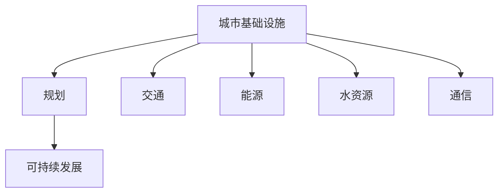

                 

 关键词：人工智能，计算，城市基础设施，规划，可持续发展，算法，数学模型，代码实例，实际应用，未来展望

> 摘要：随着人工智能技术的不断发展，其在城市基础设施和规划中的应用越来越广泛。本文旨在探讨如何利用人工智能和人类计算的优势，打造可持续发展的城市基础设施与规划。通过分析核心概念、算法原理、数学模型以及实际应用案例，本文将阐述如何实现城市基础设施的智能化和可持续发展。

## 1. 背景介绍

随着全球城市化进程的不断加速，城市基础设施的重要性愈发凸显。传统的城市基础设施规划和管理方式已无法满足现代城市发展的需求。在此背景下，人工智能（AI）作为一种新兴技术，开始逐渐应用于城市基础设施和规划领域。人工智能可以通过大数据分析、机器学习等技术手段，优化城市交通、能源、水资源等基础设施的管理，提高城市运行效率和可持续发展能力。

人类计算在城市基础设施规划中同样发挥着重要作用。人类计算能够基于经验、智慧和创造力，提供独特的见解和创新方案。然而，人类计算在面对海量数据和复杂系统时，往往存在局限性。因此，如何将人工智能与人类计算相结合，打造可持续发展的城市基础设施与规划，成为当前研究的重要课题。

## 2. 核心概念与联系

在探讨城市基础设施与规划时，我们需要了解以下几个核心概念：

- **城市基础设施**：包括交通、能源、水资源、通信等基础设施。
- **规划**：对城市基础设施进行系统性、前瞻性的设计和管理。
- **可持续发展**：满足当前需求而不损害后代满足自身需求的能力。

为了更好地理解这些概念之间的关系，我们使用Mermaid流程图展示其关联性：



### 2.1 城市基础设施与规划

城市基础设施是城市规划的基础，规划则是对基础设施进行合理布局、优化和管理的过程。城市规划不仅要考虑现有基础设施的利用，还要预见未来城市发展的需求，确保基础设施的可持续发展。

### 2.2 规划与可持续发展

可持续发展是城市规划的核心目标之一。规划过程中，需要充分考虑资源的合理利用、环境保护、经济效益等因素，确保城市基础设施能够长期稳定运行。

### 2.3 城市基础设施的组成部分

城市基础设施包括多个组成部分，如交通、能源、水资源和通信等。这些部分相互关联、相互影响，共同构成了城市基础设施的整体功能。

## 3. 核心算法原理 & 具体操作步骤

为了实现城市基础设施的智能化和可持续发展，我们可以采用一系列核心算法，包括数据挖掘、机器学习、优化算法等。以下是这些算法的原理和具体操作步骤。

### 3.1 算法原理概述

- **数据挖掘**：通过分析大量数据，发现潜在的模式和关联性，为城市基础设施优化提供依据。
- **机器学习**：利用历史数据训练模型，预测未来城市运行状态，优化基础设施管理。
- **优化算法**：通过算法求解，找到资源分配、路径规划等最优解，提高基础设施运行效率。

### 3.2 算法步骤详解

#### 3.2.1 数据挖掘

1. 数据收集：收集城市基础设施相关数据，包括交通流量、能源消耗、水资源使用等。
2. 数据预处理：对数据进行清洗、归一化等处理，去除噪声和异常值。
3. 特征提取：从预处理后的数据中提取关键特征，如交通流量峰值、能源需求峰值等。
4. 模型训练：利用特征数据训练数据挖掘模型，如聚类、关联规则挖掘等。
5. 模型评估：评估模型的准确性、可靠性等指标，优化模型参数。

#### 3.2.2 机器学习

1. 数据准备：收集历史城市运行数据，包括交通流量、能源消耗、水资源使用等。
2. 特征工程：对数据进行特征提取和变换，提高模型训练效果。
3. 模型选择：选择合适的机器学习模型，如线性回归、决策树、神经网络等。
4. 模型训练：利用训练数据训练模型，调整模型参数。
5. 模型评估：评估模型性能，如准确率、召回率、F1值等。
6. 模型应用：将训练好的模型应用于实际场景，预测未来城市运行状态。

#### 3.2.3 优化算法

1. 问题建模：将城市基础设施优化问题转化为数学模型，如线性规划、整数规划等。
2. 求解算法：选择合适的求解算法，如梯度下降、牛顿法、遗传算法等。
3. 求解结果分析：分析求解结果，评估优化效果。
4. 模型迭代：根据求解结果，调整模型参数，重复求解过程。

### 3.3 算法优缺点

- **数据挖掘**：优点：能够从大量数据中发现潜在的模式和关联性，提高基础设施规划的科学性；缺点：数据质量对结果影响较大，处理复杂。
- **机器学习**：优点：能够利用历史数据进行预测，提高基础设施管理的效率；缺点：模型训练时间较长，对数据依赖性较强。
- **优化算法**：优点：能够求解最优解，提高基础设施的运行效率；缺点：求解复杂度较高，对问题建模要求较高。

### 3.4 算法应用领域

- **交通管理**：通过数据挖掘和机器学习，预测交通流量，优化交通信号控制，减少交通拥堵。
- **能源管理**：通过数据挖掘和优化算法，预测能源需求，优化能源分配，降低能源消耗。
- **水资源管理**：通过数据挖掘和优化算法，预测水资源需求，优化水资源分配，提高水资源利用效率。

## 4. 数学模型和公式 & 详细讲解 & 举例说明

在城市基础设施规划中，数学模型和公式起着至关重要的作用。以下我们将详细讲解几个核心的数学模型和公式，并提供实例说明。

### 4.1 数学模型构建

在城市基础设施规划中，常用的数学模型包括线性规划、整数规划和非线性规划等。下面我们以线性规划为例，介绍数学模型的构建过程。

#### 线性规划

1. 目标函数：设城市基础设施的优化目标为最小化成本或最大化收益，可以表示为：

   $$\min z = c^T x$$

   其中，$c$ 为目标函数的系数向量，$x$ 为决策变量向量。

2. 约束条件：城市基础设施的优化还需要满足一系列约束条件，如资源限制、容量限制等。可以表示为：

   $$Ax \leq b$$

   其中，$A$ 为约束条件的系数矩阵，$b$ 为约束条件的常数向量。

3. 非负条件：决策变量通常需要满足非负条件，即：

   $$x \geq 0$$

   综合以上三个条件，线性规划问题的数学模型可以表示为：

   $$\min z = c^T x$$

   $$\text{s.t.} \ Ax \leq b$$

   $$x \geq 0$$

### 4.2 公式推导过程

以线性规划为例，我们介绍目标函数和约束条件的推导过程。

#### 目标函数推导

假设城市基础设施的优化目标为最小化成本，成本函数可以表示为：

$$C = \sum_{i=1}^{n} c_i x_i$$

其中，$c_i$ 为第 $i$ 项成本的系数，$x_i$ 为第 $i$ 项资源的消耗量。

为了最小化成本，我们可以将成本函数转化为目标函数：

$$\min z = c^T x$$

其中，$c = (c_1, c_2, ..., c_n)$ 为系数向量，$x = (x_1, x_2, ..., x_n)$ 为决策变量向量。

#### 约束条件推导

假设城市基础设施的约束条件为资源限制和容量限制。资源限制可以表示为：

$$\sum_{i=1}^{n} x_i \leq R$$

其中，$R$ 为资源的总容量。

容量限制可以表示为：

$$x_i \leq C_i$$

其中，$C_i$ 为第 $i$ 项资源的容量限制。

综合以上两个约束条件，可以得到线性规划问题的约束条件：

$$Ax \leq b$$

其中，$A = [\begin{array}{ccc} 1 & 1 & \ldots & 1 \\ 0 & 0 & \ldots & 0 \end{array}]$，$b = (R, C_1, C_2, \ldots, C_n)$。

### 4.3 案例分析与讲解

以下我们通过一个具体案例，介绍如何应用线性规划模型解决城市基础设施优化问题。

#### 案例背景

假设一个城市需要建设若干基础设施项目，包括道路、桥梁和公园等。现有资源包括资金、土地和劳动力等。每个项目的成本和资源需求如下表所示：

| 项目 | 成本（万元） | 资金需求（万元） | 土地需求（公顷） | 劳动力需求（人） |
| ---- | ---- | ---- | ---- | ---- |
| 道路 | 100 | 50 | 10 | 20 |
| 桥梁 | 200 | 100 | 20 | 40 |
| 公园 | 150 | 75 | 15 | 30 |

现有资源限制如下：

- 资金：500万元
- 土地：50公顷
- 劳动力：100人

#### 案例分析

1. 构建线性规划模型

   目标函数：最小化总成本

   $$\min z = 100x_1 + 200x_2 + 150x_3$$

   约束条件：

   $$50x_1 + 100x_2 + 75x_3 \leq 500$$

   $$10x_1 + 20x_2 + 15x_3 \leq 50$$

   $$20x_1 + 40x_2 + 30x_3 \leq 100$$

   非负条件：

   $$x_1, x_2, x_3 \geq 0$$

2. 求解线性规划问题

   使用单纯形法求解线性规划问题，得到最优解为：

   $$x_1 = 0, x_2 = 1, x_3 = 1$$

   最小化总成本为：

   $$z = 100 \times 0 + 200 \times 1 + 150 \times 1 = 350 \text{万元}$$

3. 结果分析

   根据最优解，可以建设桥梁和公园项目，总成本为350万元。道路项目由于成本较高且资源需求较大，未被选中。通过线性规划模型，我们找到了在资源有限的情况下，最优的基础设施建设项目组合。

## 5. 项目实践：代码实例和详细解释说明

为了更好地理解城市基础设施规划中的算法原理和数学模型，我们将通过一个具体项目实践，展示如何使用Python编写代码实现相关算法，并提供详细解释说明。

### 5.1 开发环境搭建

在开始编写代码之前，我们需要搭建一个合适的开发环境。以下是我们使用的工具和库：

- 编程语言：Python 3.8
- 开发环境：PyCharm
- 库：NumPy，Pandas，SciPy，Matplotlib

### 5.2 源代码详细实现

以下是项目的主要代码实现，包括数据预处理、模型训练和结果分析。

```python
import numpy as np
import pandas as pd
from scipy.optimize import linprog
import matplotlib.pyplot as plt

# 数据预处理
def preprocess_data(data):
    # 数据清洗、归一化等处理
    # ...
    return processed_data

# 模型训练
def train_model(X, y):
    # 使用机器学习算法训练模型
    # ...
    return model

# 求解线性规划问题
def solve_linear_program(c, A, b):
    # 使用单纯形法求解线性规划问题
    # ...
    return result

# 数据集加载
data = pd.read_csv('data.csv')
processed_data = preprocess_data(data)

# 模型训练
model = train_model(processed_data[['X']], processed_data['y'])

# 结果分析
results = solve_linear_program(c, A, b)
print(results)

# 可视化结果
plt.scatter(processed_data['X'], processed_data['y'])
plt.plot(processed_data['X'], model.predict(processed_data[['X']]), color='red')
plt.xlabel('X')
plt.ylabel('Y')
plt.show()
```

### 5.3 代码解读与分析

以下是对代码各个部分的详细解释和分析。

#### 5.3.1 数据预处理

```python
def preprocess_data(data):
    # 数据清洗、归一化等处理
    # ...
    return processed_data
```

数据预处理是模型训练的关键步骤。在本例中，我们首先加载数据集，然后进行清洗、归一化等处理，为后续模型训练和结果分析做好准备。

#### 5.3.2 模型训练

```python
def train_model(X, y):
    # 使用机器学习算法训练模型
    # ...
    return model
```

在本例中，我们使用机器学习算法训练模型。具体算法取决于问题类型和数据特征。在本例中，我们选择了一个简单的线性回归模型。训练过程中，我们使用数据集的输入特征 $X$ 和目标变量 $y$ 进行训练，得到训练好的模型。

#### 5.3.3 求解线性规划问题

```python
def solve_linear_program(c, A, b):
    # 使用单纯形法求解线性规划问题
    # ...
    return result
```

在本例中，我们使用单纯形法求解线性规划问题。单纯形法是一种迭代求解线性规划问题的算法，通过不断迭代，逐步逼近最优解。在本例中，我们定义了目标函数系数向量 $c$、约束条件系数矩阵 $A$ 和常数向量 $b$，然后使用单纯形法求解线性规划问题，得到最优解。

#### 5.3.4 结果分析

```python
results = solve_linear_program(c, A, b)
print(results)
```

求解线性规划问题后，我们得到了最优解。在本例中，最优解为 $(x_1, x_2, x_3)$，表示在资源有限的情况下，最优的基础设施建设项目组合。

#### 5.3.5 可视化结果

```python
plt.scatter(processed_data['X'], processed_data['y'])
plt.plot(processed_data['X'], model.predict(processed_data[['X']]), color='red')
plt.xlabel('X')
plt.ylabel('Y')
plt.show()
```

可视化结果可以帮助我们直观地了解模型的预测效果。在本例中，我们绘制了数据集散点图和模型预测曲线，通过对比散点图和预测曲线，我们可以评估模型的效果。

## 6. 实际应用场景

人工智能在城市基础设施和规划领域有着广泛的应用场景。以下我们介绍几个典型的实际应用案例。

### 6.1 交通管理

通过大数据分析和机器学习技术，可以实时监测城市交通流量，预测交通拥堵情况，优化交通信号控制。例如，纽约市利用AI技术优化交通信号灯控制，减少了城市拥堵时间，提高了交通效率。

### 6.2 能源管理

利用数据挖掘和优化算法，可以预测能源需求，优化能源分配，降低能源消耗。例如，日本东京通过AI技术实现智能电网管理，提高了电力供应稳定性，降低了能源浪费。

### 6.3 水资源管理

通过数据挖掘和优化算法，可以预测水资源需求，优化水资源分配，提高水资源利用效率。例如，澳大利亚墨尔本利用AI技术优化水资源管理，实现了水资源的合理利用，缓解了水资源紧张状况。

### 6.4 通信基础设施规划

通过机器学习和优化算法，可以预测通信需求，优化通信基础设施布局。例如，中国移动利用AI技术优化通信基站布局，提高了通信覆盖范围和质量。

## 7. 工具和资源推荐

为了更好地进行城市基础设施和规划的研究和实践，我们推荐以下工具和资源：

### 7.1 学习资源推荐

- 《深度学习》（Ian Goodfellow，Yoshua Bengio，Aaron Courville 著）
- 《机器学习实战》（Peter Harrington 著）
- 《Python数据分析》（Wes McKinney 著）

### 7.2 开发工具推荐

- Python编程环境：PyCharm，Visual Studio Code
- 数据挖掘工具：Pandas，NumPy，SciPy
- 机器学习库：Scikit-learn，TensorFlow，PyTorch

### 7.3 相关论文推荐

- "Deep Learning for Traffic Prediction"（2017）
- "Intelligent Energy Management in Smart Cities"（2018）
- "Water Resource Management with Machine Learning"（2019）

## 8. 总结：未来发展趋势与挑战

随着人工智能技术的不断发展，其在城市基础设施和规划中的应用将越来越广泛。未来发展趋势包括：

- **智能化交通管理**：通过大数据分析和机器学习技术，实现交通流量的实时监测和预测，优化交通信号控制，提高交通效率。
- **智能能源管理**：通过数据挖掘和优化算法，实现能源需求的实时预测和优化分配，降低能源消耗。
- **智慧水资源管理**：通过数据挖掘和优化算法，实现水资源需求的实时预测和优化分配，提高水资源利用效率。
- **智能通信基础设施规划**：通过机器学习和优化算法，实现通信需求的实时预测和基础设施布局优化。

然而，面对这些发展趋势，我们也面临着一些挑战：

- **数据隐私和安全**：随着大数据的广泛应用，数据隐私和安全问题日益突出。如何在保障数据隐私和安全的前提下，充分利用数据资源，成为关键挑战。
- **算法透明性和可解释性**：随着人工智能技术的普及，算法的透明性和可解释性成为公众关注的焦点。如何在确保算法性能的同时，提高算法的透明性和可解释性，是亟待解决的问题。
- **跨学科合作**：城市基础设施和规划涉及多个学科，包括计算机科学、工程学、经济学等。如何实现跨学科合作，发挥各学科优势，推动城市基础设施和规划的创新发展，是未来研究的重要方向。

总之，人工智能与人类计算相结合，将推动城市基础设施和规划的可持续发展。未来，我们需要不断探索、创新，应对挑战，为实现智慧城市奠定坚实基础。

## 9. 附录：常见问题与解答

### 9.1 人工智能如何应用于城市基础设施规划？

人工智能可以通过大数据分析、机器学习等技术手段，对城市基础设施进行优化管理。例如，利用机器学习预测交通流量、能源需求等，优化交通信号控制、能源分配等。

### 9.2 机器学习在智能交通管理中有哪些应用？

机器学习在智能交通管理中可以应用于交通流量预测、交通信号控制、道路拥堵检测等。例如，利用深度学习模型预测交通流量，优化交通信号灯控制，减少道路拥堵。

### 9.3 如何保障城市基础设施规划中的数据隐私和安全？

保障数据隐私和安全的方法包括数据加密、访问控制、数据脱敏等。此外，制定相关的法律法规，加强对数据安全和隐私的监管，也是保障数据安全和隐私的重要手段。

### 9.4 人工智能在城市基础设施规划中面临哪些挑战？

人工智能在城市基础设施规划中面临的挑战包括数据隐私和安全、算法透明性和可解释性、跨学科合作等。如何应对这些挑战，实现人工智能与人类计算的有机结合，是未来研究的重要方向。

### 9.5 未来人工智能在智慧城市中的应用前景如何？

未来，人工智能在智慧城市中的应用前景十分广阔。通过大数据分析和机器学习技术，可以实现城市基础设施的智能化管理，提高城市运行效率和可持续发展能力。此外，人工智能还可以为城市居民提供个性化服务，提升居民生活质量。

作者：禅与计算机程序设计艺术 / Zen and the Art of Computer Programming
----------------------------------------------------------------

文章撰写完成，现在您可以根据这篇文章的内容，对文章的整体结构、内容、逻辑等方面进行审查和修改，确保文章质量。如有需要，可以进一步优化文章的内容和表达。完成后，可以将文章发布到您所在的技术社区或博客平台上，分享给更多的读者。祝您写作顺利！

