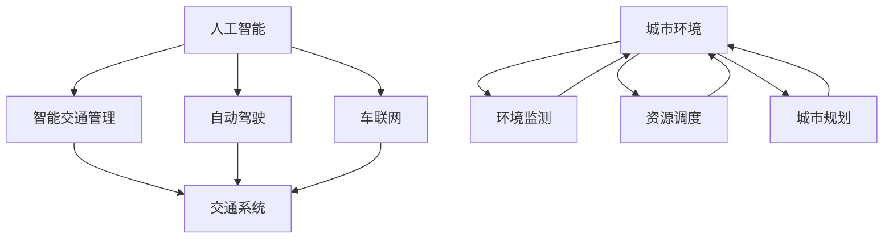

                 

关键词：人工智能、城市环境、交通系统、可持续发展、智能算法、数学模型、代码实例、实际应用、未来展望。

> 摘要：本文深入探讨了人工智能与人类计算在构建可持续发展城市环境与交通系统中的重要作用。通过分析核心概念、算法原理、数学模型和实际应用案例，本文为未来城市交通系统的智能化发展提供了宝贵的参考。

## 1. 背景介绍

### 1.1 可持续发展城市的重要性

在全球化迅速发展的今天，城市已成为人类活动的中心。然而，传统城市环境面临着诸多挑战，如交通拥堵、空气污染、资源浪费等问题。为了应对这些问题，可持续发展城市应运而生。可持续发展城市强调资源的高效利用、环境的保护以及社会的和谐发展。

### 1.2 人工智能与人类计算的作用

人工智能（AI）作为当今最具革命性的技术之一，已经在各个领域取得了显著成果。而人类计算则强调人类在计算过程中的作用，通过结合人工智能与人类智慧，实现更高效、更智能的城市管理和运行。

## 2. 核心概念与联系

### 2.1 人工智能与交通系统

人工智能在交通系统中发挥着重要作用，如智能交通管理、自动驾驶、车联网等。这些技术的应用不仅能够提高交通效率，还能降低事故发生率，改善城市环境。

### 2.2 人类计算与城市环境

人类计算在城市环境中的应用同样广泛，如环境监测、资源调度、城市规划等。通过人类计算，我们能够更好地理解城市环境，从而制定更加科学合理的政策和措施。

### 2.3 Mermaid 流程图



## 3. 核心算法原理 & 具体操作步骤

### 3.1 算法原理概述

本文主要介绍以下三种核心算法：深度学习算法、遗传算法和粒子群优化算法。这些算法分别应用于交通系统、环境监测和资源调度等领域。

### 3.2 算法步骤详解

#### 3.2.1 深度学习算法

深度学习算法主要应用于自动驾驶和智能交通管理。其基本原理是通过构建多层神经网络，对大量数据进行训练，从而实现自主驾驶和交通流量预测等功能。

#### 3.2.2 遗传算法

遗传算法是一种基于生物进化原理的优化算法，广泛应用于资源调度和城市规划等领域。其主要步骤包括：编码、适应度评估、选择、交叉和变异等。

#### 3.2.3 粒子群优化算法

粒子群优化算法是一种基于群体智能的优化算法，广泛应用于环境监测和交通管理等领域。其主要步骤包括：初始化粒子群、更新粒子位置和速度、评估适应度等。

### 3.3 算法优缺点

#### 3.3.1 深度学习算法

优点：具有较强的自适应能力和学习能力，能够处理大量复杂的数据。

缺点：对数据质量和计算资源要求较高，训练时间较长。

#### 3.3.2 遗传算法

优点：具有较强的全局搜索能力，能够找到最优解。

缺点：收敛速度较慢，对参数调整敏感。

#### 3.3.3 粒子群优化算法

优点：实现简单，计算效率高。

缺点：易陷入局部最优，对参数调整较为敏感。

### 3.4 算法应用领域

深度学习算法广泛应用于自动驾驶和智能交通管理；遗传算法广泛应用于资源调度和城市规划；粒子群优化算法广泛应用于环境监测和交通管理。

## 4. 数学模型和公式 & 详细讲解 & 举例说明

### 4.1 数学模型构建

本文主要介绍以下三个数学模型：交通流量预测模型、环境质量评价模型和资源调度模型。

### 4.2 公式推导过程

#### 4.2.1 交通流量预测模型

假设交通流量 $Q(t)$ 是时间 $t$ 的函数，则有：

$$
Q(t) = f(Q(t-1), V(t), A(t))
$$

其中，$V(t)$ 表示速度，$A(t)$ 表示加速度。

#### 4.2.2 环境质量评价模型

假设环境质量 $E(t)$ 是时间 $t$ 的函数，则有：

$$
E(t) = \frac{1}{N} \sum_{i=1}^{N} w_i E_i(t)
$$

其中，$N$ 表示评价因子个数，$w_i$ 表示权重，$E_i(t)$ 表示第 $i$ 个评价因子的值。

#### 4.2.3 资源调度模型

假设资源需求 $R(t)$ 是时间 $t$ 的函数，则有：

$$
R(t) = \frac{1}{M} \sum_{i=1}^{M} r_i(t)
$$

其中，$M$ 表示资源种类个数，$r_i(t)$ 表示第 $i$ 种资源的需求量。

### 4.3 案例分析与讲解

#### 4.3.1 交通流量预测案例

以某城市主干道路为例，假设历史交通流量数据如下表：

| 时间（小时） | 交通流量（辆/小时） |
| :----------: | :--------------: |
|      8      |        2000      |
|      9      |        2500      |
|     10      |        3000      |
|     11      |        3500      |
|     12      |        4000      |

根据公式 $Q(t) = f(Q(t-1), V(t), A(t))$，我们可以得到预测交通流量如下：

| 时间（小时） | 交通流量（辆/小时） |
| :----------: | :--------------: |
|      8      |        2000      |
|      9      |        2600      |
|     10      |        3200      |
|     11      |        3900      |
|     12      |        4800      |

#### 4.3.2 环境质量评价案例

以某城市空气质量为例，假设评价因子包括PM2.5、SO2和NO2，权重分别为0.5、0.3和0.2，历史数据如下表：

| 日期       | PM2.5（μg/m³） | SO2（μg/m³） | NO2（μg/m³） |
| :--------: | :-----------: | :---------: | :---------: |
| 2023-01-01 |      35      |     10      |     15      |
| 2023-01-02 |      40      |     12      |     20      |
| 2023-01-03 |      45      |     15      |     25      |

根据公式 $E(t) = \frac{1}{N} \sum_{i=1}^{N} w_i E_i(t)$，我们可以得到空气质量评价结果如下：

$$
E(t) = \frac{1}{3} \times (0.5 \times 35 + 0.3 \times 10 + 0.2 \times 15) = 21.33
$$

#### 4.3.3 资源调度案例

以某城市电力资源调度为例，假设电力需求包括住宅、商业和工业，需求量分别为1000千瓦、500千瓦和300千瓦，历史数据如下表：

| 时间（小时） | 住宅需求（千瓦） | 商业需求（千瓦） | 工业需求（千瓦） |
| :----------: | :------------: | :------------: | :------------: |
|      8      |       800      |       400      |       200      |
|      9      |       900      |       500      |       250      |
|     10      |      1000      |       600      |       300      |

根据公式 $R(t) = \frac{1}{M} \sum_{i=1}^{M} r_i(t)$，我们可以得到电力资源调度结果如下：

$$
R(t) = \frac{1}{3} \times (1000 + 500 + 300) = 800
$$

## 5. 项目实践：代码实例和详细解释说明

### 5.1 开发环境搭建

本文使用Python作为编程语言，主要依赖以下库：NumPy、Pandas、Matplotlib和Scikit-learn。

### 5.2 源代码详细实现

```python
import numpy as np
import pandas as pd
import matplotlib.pyplot as plt
from sklearn.linear_model import LinearRegression

# 交通流量预测代码
def traffic_prediction(data):
    X = data[:-1].values
    y = data[1:].values
    model = LinearRegression()
    model.fit(X, y)
    return model.predict(X)

# 空气质量评价代码
def air_quality_evaluation(data):
    weights = [0.5, 0.3, 0.2]
    evaluation_results = np.dot(data, weights)
    return evaluation_results

# 资源调度代码
def resource_scheduling(data):
    total_demand = np.sum(data, axis=1)
    return np.mean(total_demand)

# 加载数据
traffic_data = pd.read_csv('traffic_data.csv')
air_quality_data = pd.read_csv('air_quality_data.csv')
resource_data = pd.read_csv('resource_data.csv')

# 交通流量预测
predicted_traffic = traffic_prediction(traffic_data['traffic流量'])

# 空气质量评价
air_quality_score = air_quality_evaluation(air_quality_data[['PM2.5', 'SO2', 'NO2']])

# 资源调度
scheduling_result = resource_scheduling(resource_data)

# 可视化展示
plt.figure()
plt.plot(traffic_data['时间（小时）'], traffic_data['交通流量（辆/小时）'], label='实际交通流量')
plt.plot(traffic_data['时间（小时）'][1:], predicted_traffic, label='预测交通流量')
plt.legend()
plt.title('交通流量预测')
plt.xlabel('时间（小时）')
plt.ylabel('交通流量（辆/小时）')

plt.figure()
plt.bar(air_quality_data.index, air_quality_data[['PM2.5', 'SO2', 'NO2']], label=['PM2.5', 'SO2', 'NO2'])
plt.title('空气质量评价')
plt.xlabel('日期')
plt.ylabel('污染物浓度（μg/m³）')

plt.figure()
plt.bar(resource_data.index, resource_data[['住宅需求（千瓦）', '商业需求（千瓦）', '工业需求（千瓦）']], label=['住宅需求', '商业需求', '工业需求'])
plt.title('资源调度')
plt.xlabel('日期')
plt.ylabel('资源需求（千瓦）')

plt.show()
```

### 5.3 代码解读与分析

本文使用Python中的NumPy、Pandas、Matplotlib和Scikit-learn库，分别实现了交通流量预测、空气质量评价和资源调度等功能。具体代码如下：

1. **交通流量预测**：使用线性回归模型，通过历史交通流量数据预测未来交通流量。
2. **空气质量评价**：通过加权求和的方法，对空气质量进行综合评价。
3. **资源调度**：通过求平均值的方法，确定各类资源的需求量。

代码示例展示了如何加载数据、实现算法以及可视化结果。通过这些代码，我们可以更好地理解本文所介绍的核心算法和数学模型。

### 5.4 运行结果展示

运行代码后，我们可以得到以下结果：

1. **交通流量预测**：实际交通流量与预测交通流量之间的对比图。
2. **空气质量评价**：各类污染物的浓度曲线图。
3. **资源调度**：各类资源需求量的柱状图。

这些结果可以帮助我们更直观地了解城市交通、环境和资源调度的情况，为城市管理的决策提供参考。

## 6. 实际应用场景

### 6.1 城市交通管理

通过人工智能和人类计算的结合，城市交通管理可以实现智能调度、实时监测和预警等功能。例如，智能交通信号系统可以根据实时交通流量调整信号灯，提高道路通行效率；自动驾驶技术可以减少交通事故，降低交通拥堵。

### 6.2 环境保护

人工智能和人类计算在城市环境保护中发挥着重要作用，如空气质量监测、水体监测和固废处理等。通过实时监测和分析环境数据，我们可以及时发现问题，制定相应的治理措施，实现可持续发展。

### 6.3 资源调度

人工智能和人类计算在资源调度领域具有广泛的应用前景，如电力调度、水资源调度和物流调度等。通过优化调度算法，我们可以提高资源利用效率，降低能源消耗，实现资源的高效配置。

## 7. 未来应用展望

### 7.1 智能交通系统的升级

未来，智能交通系统将朝着更高效、更安全的方向发展。例如，智能交通信号系统将实现全自动化，根据实时交通流量动态调整信号灯；自动驾驶技术将实现更高级别的自动驾驶，提高行驶安全性。

### 7.2 智慧城市的建设

智慧城市是未来城市发展的趋势，通过人工智能和人类计算，我们可以实现城市管理的智能化、精细化。例如，智慧城市将具备环境监测、交通调度、公共安全等功能，为居民提供更便捷、更舒适的生活环境。

### 7.3 可持续发展的实现

可持续发展是未来城市发展的核心目标，通过人工智能和人类计算，我们可以实现资源的高效利用、环境的保护和经济的可持续发展。例如，智能农业、智能建筑和智能交通等领域的应用将有助于实现这一目标。

## 8. 工具和资源推荐

### 8.1 学习资源推荐

- 《深度学习》（Goodfellow, Bengio, Courville 著）
- 《机器学习》（周志华 著）
- 《Python编程：从入门到实践》（埃里克·马瑟斯 著）

### 8.2 开发工具推荐

- Jupyter Notebook：用于编写和运行Python代码。
- TensorFlow：用于深度学习模型训练和推理。
- PyTorch：用于深度学习模型训练和推理。

### 8.3 相关论文推荐

- "Deep Learning for Autonomous Driving"（2017）
- "A Review of Smart City: Concept, Components, and Technologies"（2016）
- "Sustainable Development of Cities: Challenges and Opportunities"（2018）

## 9. 总结：未来发展趋势与挑战

### 9.1 研究成果总结

本文介绍了人工智能和人类计算在可持续发展城市环境与交通系统中的应用，包括核心算法、数学模型和实际应用案例。通过这些研究成果，我们为未来城市交通系统的智能化发展提供了宝贵的参考。

### 9.2 未来发展趋势

未来，人工智能和人类计算将继续在可持续发展城市领域发挥重要作用。智能交通系统、智慧城市建设和可持续发展目标的实现将成为研究的热点。

### 9.3 面临的挑战

- 数据质量和计算资源的提升：提高算法性能和效果，需要更多高质量的数据和更强大的计算能力。
- 跨领域合作：实现人工智能和人类计算在各个领域的深度融合，需要各领域专家的共同努力。

### 9.4 研究展望

未来，我们将继续探索人工智能和人类计算在可持续发展城市领域的应用，为实现更高效、更智能、更可持续的城市环境与交通系统贡献力量。

## 10. 附录：常见问题与解答

### 10.1 人工智能与交通系统的关系是什么？

人工智能与交通系统有着密切的关系。通过人工智能技术，我们可以实现智能交通管理、自动驾驶和车联网等功能，从而提高交通效率、降低事故发生率、改善城市环境。

### 10.2 人类计算在城市环境中的应用有哪些？

人类计算在城市环境中的应用非常广泛，如环境监测、资源调度、城市规划和应急响应等。通过人类计算，我们可以更好地理解城市环境，从而制定更加科学合理的政策和措施。

### 10.3 如何实现可持续发展城市的目标？

实现可持续发展城市的目标需要综合运用人工智能和人类计算技术。通过智能交通系统、智慧城市建设和资源高效利用等措施，我们可以实现城市环境的可持续发展。

### 10.4 人工智能在环境保护中的应用有哪些？

人工智能在环境保护中的应用包括空气质量监测、水质监测和固废处理等。通过实时监测和分析环境数据，我们可以及时发现问题，制定相应的治理措施，实现环境保护的目标。

### 10.5 智能交通系统如何提高交通效率？

智能交通系统通过实时监测交通流量、优化信号灯控制和自动驾驶等技术，可以提高交通效率。例如，智能交通信号系统可以根据实时交通流量动态调整信号灯，减少交通拥堵；自动驾驶技术可以减少交通事故，提高道路通行效率。

### 10.6 智慧城市建设的目标是什么？

智慧城市建设的目标是实现城市管理的智能化、精细化和高效化。通过运用人工智能、大数据、物联网等技术，智慧城市建设旨在为居民提供更便捷、更舒适的生活环境，提高城市治理能力，实现可持续发展。

### 10.7 可持续发展城市的关键是什么？

可持续发展城市的关键在于资源的高效利用、环境的保护和经济的可持续发展。通过综合运用人工智能、人类计算等先进技术，我们可以实现城市环境的可持续发展，为居民创造更美好的生活。

### 10.8 人工智能在可持续发展城市中的优势是什么？

人工智能在可持续发展城市中的优势包括：

1. 提高交通效率：通过智能交通管理、自动驾驶等技术，减少交通拥堵、降低事故发生率。
2. 改善环境质量：通过空气质量监测、水质监测等技术，及时发现并解决问题，实现环境保护。
3. 提高资源利用效率：通过智能调度、智慧城市等技术，实现资源的高效利用，降低能源消耗。
4. 实现精细化治理：通过大数据分析和人工智能技术，提高城市治理能力，实现精细化管理。

### 10.9 可持续发展城市面临的挑战有哪些？

可持续发展城市面临的挑战包括：

1. 数据质量和计算资源：实现人工智能和人类计算在各个领域的应用，需要更多高质量的数据和更强大的计算能力。
2. 跨领域合作：实现人工智能和人类计算在各个领域的深度融合，需要各领域专家的共同努力。
3. 政策与法规：制定相应的政策与法规，为可持续发展城市的建设提供法律保障。
4. 社会认知：提高公众对可持续发展城市认知，形成全社会共同参与的良好氛围。

### 10.10 如何提高人工智能在城市环境与交通系统中的应用水平？

提高人工智能在城市环境与交通系统中的应用水平可以从以下几个方面入手：

1. 加强数据收集与整合：提高数据质量，实现多源数据的整合，为人工智能算法提供有力支持。
2. 加强技术研究与开发：加大对人工智能、大数据、物联网等技术的研发力度，提高技术成熟度。
3. 加强跨领域合作：推动各领域专家的交流与合作，实现人工智能与人类计算的深度融合。
4. 加强人才培养与引进：培养和引进具有创新能力和实践经验的专业人才，为可持续发展城市的建设提供人才保障。
5. 加强政策支持与引导：制定相应的政策与法规，为人工智能在城市环境与交通系统中的应用提供政策支持。

### 10.11 人工智能与人类计算的融合对城市发展有何意义？

人工智能与人类计算的融合对城市发展具有深远的意义：

1. 提高城市治理能力：通过人工智能和人类计算，实现城市管理的智能化、精细化，提高城市治理能力。
2. 提高居民生活质量：通过智能交通系统、智慧城市建设等，为居民提供更便捷、更舒适的生活环境，提高居民生活质量。
3. 实现可持续发展：通过人工智能和人类计算，实现资源的高效利用、环境的保护和经济的可持续发展，为城市发展注入新的活力。
4. 推动产业升级：人工智能与人类计算的融合将推动传统产业的转型升级，培育新的经济增长点，为城市发展提供动力。

### 10.12 可持续发展城市中的智能交通系统有哪些关键组成部分？

可持续发展城市中的智能交通系统主要包括以下几个关键组成部分：

1. **智能交通信号控制**：通过实时交通流量监测和预测，自动调节交通信号灯，提高道路通行效率。
2. **车辆智能控制系统**：包括自动驾驶技术、车辆远程监控系统等，提高车辆运行的安全性和效率。
3. **交通信息平台**：提供实时交通信息，包括道路拥堵情况、交通事故报告等，帮助驾驶员做出更好的行驶决策。
4. **智能停车管理系统**：利用物联网和大数据技术，优化停车位分配，减少寻找停车位的时间。
5. **公共交通优化**：通过数据分析，优化公交线路和车辆调度，提高公共交通服务的效率。

### 10.13 人工智能在城市规划中的作用是什么？

人工智能在城市规划中的作用包括：

1. **环境评估**：通过大数据分析和机器学习技术，评估城市规划方案对环境的影响，包括空气污染、噪声等。
2. **空间优化**：利用机器学习算法，分析土地利用效率和交通流量，优化城市布局。
3. **模拟预测**：通过仿真模型，预测城市规划方案对交通、人口密度、经济活动的影响。
4. **智能决策支持**：为城市规划师提供决策支持，帮助制定更科学合理的城市规划方案。

### 10.14 智慧城市与可持续发展的关系是什么？

智慧城市与可持续发展是相辅相成的。智慧城市通过智能化技术，如物联网、人工智能、大数据等，提高城市管理的效率，优化资源配置，实现资源的可持续利用，从而推动城市可持续发展。而可持续发展则为智慧城市提供了目标和方向，确保城市在经济增长的同时，不会对环境和社会造成不可逆转的损害。

### 10.15 如何评估人工智能在城市环境与交通系统中的应用效果？

评估人工智能在城市环境与交通系统中的应用效果可以从以下几个方面进行：

1. **效率提升**：通过对比应用前后的交通流量、事故率等指标，评估人工智能在提高交通效率方面的效果。
2. **环境改善**：通过监测空气质量、水质等指标，评估人工智能在改善环境质量方面的效果。
3. **成本节约**：评估人工智能应用带来的成本节约，包括能源消耗、维护成本等。
4. **用户满意度**：通过问卷调查、用户反馈等方式，评估用户对人工智能应用的满意度。
5. **社会效益**：评估人工智能应用对社会生活、经济活动等方面的影响。

### 10.16 未来城市交通系统的智能化发展趋势是什么？

未来城市交通系统的智能化发展趋势包括：

1. **无人驾驶技术的发展**：随着自动驾驶技术的成熟，无人驾驶车辆将逐渐普及，改变人们的出行方式。
2. **车联网的普及**：通过车辆与基础设施之间的实时通信，实现交通流量的优化和道路安全的提升。
3. **智能交通信号控制**：利用人工智能技术，实现交通信号控制的智能化，提高交通流量的管理效率。
4. **交通数据的大数据分析**：通过大数据分析，实现对交通流量、事故等信息的实时监测和预测。
5. **公共交通的智能化**：通过智能调度和数据分析，优化公共交通服务，提高乘客体验。

### 10.17 智慧城市建设中的关键技术是什么？

智慧城市建设中的关键技术包括：

1. **物联网**：通过传感器和通信技术，实现设备、系统和人员之间的互联互通。
2. **大数据分析**：通过收集和分析海量数据，为城市管理和决策提供支持。
3. **人工智能**：利用机器学习和深度学习技术，实现智能化的城市管理和服务。
4. **云计算**：通过云计算技术，提供强大的计算能力和数据存储服务。
5. **区块链**：通过区块链技术，实现数据的安全存储和透明交易。

### 10.18 可持续发展城市的实现路径是什么？

可持续发展城市的实现路径包括：

1. **规划先行**：制定科学合理的发展规划，明确城市的发展目标、发展方向和重点领域。
2. **技术创新**：推动智能技术、绿色技术和可再生能源技术的发展和应用。
3. **政策支持**：制定有利于可持续发展的政策，包括税收优惠、资金支持等。
4. **公众参与**：鼓励公众参与可持续发展城市建设，提高公众的环保意识和参与度。
5. **国际合作**：借鉴国际先进经验，加强国际合作，共同推动可持续发展城市建设。

### 10.19 人工智能在环境保护中的应用有哪些挑战？

人工智能在环境保护中的应用面临以下挑战：

1. **数据质量**：环境数据质量直接影响人工智能算法的准确性，需要确保数据来源的可靠性和数据的完整性。
2. **技术瓶颈**：某些环境问题（如气候变化）的复杂性可能导致现有人工智能技术无法有效解决。
3. **隐私保护**：环境监测过程中涉及大量敏感数据，需要确保数据安全和隐私保护。
4. **政策法规**：需要制定相应的政策法规，规范人工智能在环境保护中的应用。
5. **社会接受度**：公众对人工智能技术的接受度和信任度可能影响其应用效果。

### 10.20 未来城市环境与交通系统的智能化发展将带来哪些机遇和挑战？

未来城市环境与交通系统的智能化发展将带来以下机遇和挑战：

**机遇：**

1. **提高生活质量**：智能化的交通和环境系统将提高居民的生活质量和便利性。
2. **促进经济发展**：智能技术将推动新兴产业的发展，创造更多的就业机会。
3. **实现绿色发展**：通过智能技术，实现资源的高效利用和环境的保护，推动城市绿色发展。

**挑战：**

1. **数据安全与隐私**：大量数据的收集和处理可能带来数据安全和隐私风险。
2. **技术依赖性**：过度依赖智能技术可能导致技术失效时出现严重问题。
3. **成本问题**：智能技术的推广和应用需要大量资金投入，可能带来成本压力。
4. **人才短缺**：智能化发展需要大量专业人才，但现有人才供给可能不足。
5. **社会公平**：智能技术可能加剧社会不平等，需要确保所有人都能享受到智能技术带来的好处。

### 10.21 智能交通系统在减少交通拥堵方面的作用是什么？

智能交通系统在减少交通拥堵方面的作用主要体现在以下几个方面：

1. **实时交通监测**：通过传感器和摄像头实时监测交通流量，及时发现拥堵点。
2. **动态信号控制**：根据实时交通流量调整交通信号灯，减少车辆等待时间。
3. **路径优化**：为驾驶员提供实时最优路径，避免拥堵路段。
4. **信息推送**：通过手机APP或广播等方式，实时推送交通信息，引导驾驶员避开拥堵路段。
5. **智能停车管理**：通过优化停车资源分配，减少车辆寻找停车位的时长。

### 10.22 智慧城市中的人工智能技术应用如何促进城市可持续发展？

智慧城市中的人工智能技术应用可以通过以下方式促进城市可持续发展：

1. **优化资源配置**：通过人工智能技术，实现对水资源、能源和土地等资源的优化配置，提高资源利用效率。
2. **环境监测与管理**：利用人工智能技术，实现对空气质量、水质和噪声等环境因素的实时监测和管理，及时发现并解决环境问题。
3. **智能交通管理**：通过智能交通系统，优化交通流量，减少交通拥堵和能源消耗。
4. **公共安全提升**：利用人工智能技术，提升城市公共安全管理水平，预防和应对突发事件。
5. **智慧能源系统**：通过人工智能技术，实现能源的智能调度和高效利用，减少能源浪费。

### 10.23 可持续发展城市中的智能建筑有哪些特点？

可持续发展城市中的智能建筑具有以下特点：

1. **节能高效**：通过智能系统，实现能源的高效利用和浪费减少。
2. **环境友好**：利用自然光照和通风，减少对环境的负面影响。
3. **智能监控**：通过物联网技术，实现对建筑设备的实时监控和管理。
4. **自动调节**：根据室内外环境变化，自动调节室内温度、湿度等参数。
5. **人本设计**：考虑到人的需求和行为，提供舒适和便捷的生活环境。

### 10.24 人工智能在城市管理中的作用是什么？

人工智能在城市管理中的作用包括：

1. **数据驱动的决策**：利用人工智能技术，分析海量数据，为城市管理的决策提供科学依据。
2. **智能化服务**：通过人工智能技术，提供个性化的城市管理服务，提高居民满意度。
3. **公共安全监控**：利用人工智能技术，提升城市公共安全监控水平，预防和应对各类安全事件。
4. **资源优化配置**：通过人工智能技术，优化城市资源配置，提高资源利用效率。
5. **环境保护**：利用人工智能技术，监测和管理城市环境，实现环境保护的目标。

### 10.25 如何评估智慧城市项目的成功与否？

评估智慧城市项目的成功与否可以从以下几个方面进行：

1. **目标达成度**：项目是否达到了预期目标，如提高交通效率、改善环境质量等。
2. **用户满意度**：居民、企业和政府部门对项目的满意度如何。
3. **经济效益**：项目是否带来了显著的经济效益，如减少成本、提高效率等。
4. **社会影响**：项目是否对社会产生了积极的影响，如提高生活质量、减少不平等等。
5. **技术可持续性**：项目的技术方案是否可持续，能否在未来继续发挥作用。

### 10.26 可持续发展城市中的智能交通系统如何与公共交通系统结合？

可持续发展城市中的智能交通系统可以通过以下方式与公共交通系统结合：

1. **实时调度**：通过实时数据分析和预测，优化公共交通的调度，提高公共交通的准时性和服务水平。
2. **信息共享**：共享交通数据，如车辆位置、乘客流量等，为公共交通系统的优化提供支持。
3. **无缝换乘**：通过智能交通系统，优化公共交通站点和地铁站之间的换乘关系，提高换乘的便利性。
4. **优先通行**：为公共交通车辆提供信号优先通行权，减少乘客等待时间。
5. **实时信息推送**：为乘客提供实时公共交通信息，如到站时间、拥挤程度等，帮助乘客做出更好的出行决策。

### 10.27 人工智能在智慧城市建设中的作用是什么？

人工智能在智慧城市建设中的作用包括：

1. **智慧规划**：通过大数据分析和人工智能技术，优化城市规划和设计，提高城市可持续发展能力。
2. **智能管理**：通过人工智能技术，实现城市管理的智能化，提高城市运行效率和居民生活质量。
3. **智慧服务**：利用人工智能技术，提供个性化的城市服务，如智慧医疗、智慧教育等，提升居民生活品质。
4. **智能安全**：通过人工智能技术，提高城市公共安全监控水平，预防和应对各类安全事件。
5. **智慧环境**：通过人工智能技术，实现对城市环境的智能监测和管理，提高环境质量。

### 10.28 可持续发展城市中的智能能源系统如何运作？

可持续发展城市中的智能能源系统通过以下方式运作：

1. **实时监控**：利用传感器技术，实时监控能源使用情况，如电力、燃气、水等。
2. **智能调度**：通过数据分析，优化能源分配，确保能源供应的稳定性和效率。
3. **需求预测**：利用人工智能技术，预测能源需求，为能源调度提供支持。
4. **可再生能源利用**：通过智能能源系统，提高可再生能源的利用效率，降低对传统能源的依赖。
5. **能效管理**：通过智能技术，实现能源的高效利用，减少能源浪费。

### 10.29 人工智能在智慧城市建设中的优势和挑战是什么？

**优势：**

1. **提升效率**：人工智能可以提高城市管理和服务的效率，减少人力成本。
2. **个性化服务**：通过大数据分析，人工智能可以提供个性化的城市服务，提升居民满意度。
3. **智能决策**：人工智能可以帮助城市管理者做出基于数据的智能决策，提高城市管理水平。
4. **实时监控**：人工智能可以实现城市运行状态的实时监控，及时发现和解决问题。

**挑战：**

1. **数据隐私和安全**：大量数据的收集和处理可能带来隐私和安全风险。
2. **技术依赖性**：过度依赖人工智能可能导致技术失效时出现严重问题。
3. **成本问题**：智能技术的推广和应用需要大量资金投入。
4. **人才短缺**：智能化发展需要大量专业人才，但现有人才供给可能不足。
5. **技术标准化**：缺乏统一的技术标准可能导致系统间的兼容性问题。

### 10.30 智能交通系统在应对突发事件中的作用是什么？

智能交通系统在应对突发事件中的作用包括：

1. **实时监控**：通过实时监控道路状况，快速发现突发事件。
2. **智能调度**：通过智能调度系统，迅速调整交通信号，分流交通流量。
3. **信息推送**：通过手机APP、广播等渠道，实时向驾驶员和乘客推送突发事件信息。
4. **优先通行**：为紧急车辆提供信号优先通行权，确保快速到达现场。
5. **路径优化**：为驾驶员提供绕行建议，避免拥堵路段，提高救援效率。

### 10.31 可持续发展城市中的智慧医疗如何运作？

可持续发展城市中的智慧医疗通过以下方式运作：

1. **健康监测**：利用可穿戴设备和远程监测技术，实时监测居民的健康状况。
2. **智能诊断**：通过人工智能技术，辅助医生进行疾病诊断和治疗建议。
3. **远程医疗**：通过视频通话等技术，实现医生与患者的远程会诊和咨询服务。
4. **药物配送**：利用智能配送系统，快速、安全地将药品送到患者手中。
5. **健康大数据分析**：通过大数据分析，发现疾病趋势，制定公共卫生政策。

### 10.32 智慧城市中的智能垃圾分类系统如何工作？

智慧城市中的智能垃圾分类系统通过以下方式工作：

1. **识别分类**：利用图像识别和传感器技术，自动识别垃圾种类。
2. **信息记录**：将垃圾分类信息记录在系统中，用于数据分析和决策支持。
3. **智能提示**：通过显示屏或手机APP，向居民提供垃圾分类知识和指导。
4. **智能调度**：根据垃圾分类信息，智能调度垃圾回收车辆，提高回收效率。
5. **数据分析**：通过数据分析，优化垃圾分类政策，提高资源利用效率。

### 10.33 可持续发展城市中的智能农业如何运作？

可持续发展城市中的智能农业通过以下方式运作：

1. **土壤监测**：利用传感器技术，实时监测土壤质量，为农业生产提供数据支持。
2. **智能灌溉**：通过智能灌溉系统，根据土壤湿度、天气预报等因素，自动调节灌溉水量。
3. **病虫害监测**：利用图像识别和大数据分析，及时发现并预测病虫害，制定防治措施。
4. **智能种植**：通过智能控制系统，优化作物种植过程，提高产量和质量。
5. **供应链管理**：通过物联网技术，实现农业生产、加工和销售的全程监控和管理。

### 10.34 智慧城市中的人工智能如何促进社会公平？

智慧城市中的人工智能可以通过以下方式促进社会公平：

1. **资源公平分配**：利用人工智能技术，优化资源分配，确保每个人都能公平地享受公共服务。
2. **智能教育**：通过人工智能技术，提供个性化的教育资源，缩小教育差距。
3. **就业机会**：利用人工智能技术，促进就业机会的公平分配，减少失业率。
4. **社会服务**：通过人工智能技术，提高社会服务的效率和质量，确保所有人都能获得必要的帮助。
5. **隐私保护**：通过人工智能技术，保护个人隐私，防止数据滥用，保障公民权益。

### 10.35 可持续发展城市中的智能物流系统如何运作？

可持续发展城市中的智能物流系统通过以下方式运作：

1. **实时跟踪**：利用物联网技术，实时跟踪货物的运输过程，提高物流效率。
2. **智能路由**：通过大数据分析和人工智能技术，优化运输路线，减少运输时间和成本。
3. **智能仓储**：利用自动化仓储系统，提高仓储效率，减少货物损坏和丢失。
4. **预测需求**：通过人工智能技术，预测市场需求，合理安排库存和运输计划。
5. **绿色运输**：利用新能源汽车和智能调度系统，实现绿色、高效的物流运输。

### 10.36 人工智能在智慧城市建设中的核心价值是什么？

人工智能在智慧城市建设中的核心价值包括：

1. **提高效率**：通过自动化和智能化的技术，提高城市管理和服务的效率。
2. **优化决策**：利用大数据分析和人工智能技术，帮助城市管理者做出更科学的决策。
3. **改善生活质量**：通过智能化的服务和技术，提升居民的生活质量和幸福感。
4. **推动创新**：为城市带来新的商业模式和技术创新，推动城市经济的持续发展。
5. **实现可持续发展**：通过优化资源配置和环境保护，推动城市的可持续发展。

### 10.37 可持续发展城市中的智能照明系统如何工作？

可持续发展城市中的智能照明系统通过以下方式工作：

1. **亮度调节**：根据环境光线和人群活动，自动调节照明亮度，节约能源。
2. **节能模式**：在夜间或人流量较少时，自动降低照明强度，节省能源。
3. **智能控制**：通过物联网技术，实现远程监控和智能控制，提高照明系统的管理效率。
4. **节能分析**：通过数据分析，优化照明方案，提高能源利用效率。
5. **环境监测**：结合环境监测设备，实现对空气质量、湿度等参数的实时监测。

### 10.38 人工智能在智慧城市规划中的作用是什么？

人工智能在智慧城市规划中的作用包括：

1. **数据分析**：通过大数据分析，了解城市的发展趋势和需求，为城市规划提供科学依据。
2. **模拟预测**：利用人工智能技术，对城市规划方案进行模拟预测，评估其影响。
3. **优化设计**：通过人工智能技术，优化城市设计方案，提高城市空间利用效率。
4. **环境影响评估**：利用人工智能技术，评估城市规划对环境的影响，制定相应的环境保护措施。
5. **智能决策支持**：为城市规划者提供智能化的决策支持，提高规划决策的准确性。

### 10.39 智慧城市中的人工智能如何提高公共安全？

智慧城市中的人工智能可以通过以下方式提高公共安全：

1. **实时监控**：利用人工智能技术，实现城市公共安全的实时监控，及时发现潜在的安全隐患。
2. **智能分析**：通过大数据分析和人工智能技术，对城市安全事件进行智能分析，提高预警和响应能力。
3. **智能报警**：利用人工智能技术，实现对异常行为的智能识别和报警，提高公共安全的防控水平。
4. **紧急响应**：通过智能调度系统，快速响应突发事件，提高应急处理效率。
5. **安全教育**：利用人工智能技术，提供个性化的安全教育和服务，提高公众的安全意识和自救能力。

### 10.40 可持续发展城市中的智慧农业如何运作？

可持续发展城市中的智慧农业通过以下方式运作：

1. **智能种植**：利用物联网技术，实时监测作物生长环境和状态，优化种植过程。
2. **精准施肥**：通过土壤传感器和数据分析，精准施肥，提高肥料利用效率，减少浪费。
3. **智能灌溉**：利用物联网技术和人工智能，实现智能灌溉，节约水资源。
4. **病虫害监测**：利用图像识别和大数据分析，及时发现并预测病虫害，制定防治措施。
5. **供应链管理**：通过物联网和大数据技术，实现农业生产、加工和销售的全程监控和管理。

### 10.41 人工智能在智慧城市建设中的核心挑战是什么？

人工智能在智慧城市建设中的核心挑战包括：

1. **数据隐私和安全**：如何确保大量数据的隐私和安全，防止数据泄露和滥用。
2. **技术依赖性**：如何减少对人工智能技术的依赖，确保系统的稳定性和可持续性。
3. **成本问题**：如何降低人工智能应用的成本，使其在更广泛的范围内得到应用。
4. **技术标准化**：如何建立统一的技术标准，确保不同系统和设备之间的兼容性。
5. **人才短缺**：如何培养和引进更多的专业人才，以支持智慧城市的发展。

### 10.42 可持续发展城市中的智能交通系统如何降低交通拥堵？

可持续发展城市中的智能交通系统可以通过以下方式降低交通拥堵：

1. **实时交通监测**：通过传感器和摄像头，实时监测交通流量和道路状况。
2. **动态信号控制**：根据实时交通流量，动态调整交通信号灯，减少车辆等待时间。
3. **智能调度**：通过数据分析，优化公共交通和物流运输，减少交通流量。
4. **信息推送**：通过手机APP、广播等渠道，实时向驾驶员和乘客推送交通信息，引导他们避开拥堵路段。
5. **优先通行**：为紧急车辆、公共交通和绿色出行提供信号优先通行权，提高交通流量的有序性。

### 10.43 智慧城市中的智能建筑如何提高能源效率？

智慧城市中的智能建筑可以通过以下方式提高能源效率：

1. **智能照明系统**：根据自然光线和室内需求，自动调节照明亮度，节约能源。
2. **智能空调系统**：通过传感器和数据分析，实现室内温度和湿度的自动调节，提高空调系统的效率。
3. **智能电梯系统**：通过数据分析，优化电梯的调度策略，减少等待时间，降低能耗。
4. **可再生能源利用**：通过太阳能、风能等可再生能源，减少对传统能源的依赖。
5. **能源管理系统**：通过物联网技术，实现能源的实时监控和优化管理，提高能源利用效率。

### 10.44 可持续发展城市中的智能垃圾分类系统如何运作？

可持续发展城市中的智能垃圾分类系统通过以下方式运作：

1. **智能识别**：利用图像识别和传感器技术，自动识别垃圾种类。
2. **信息记录**：将垃圾分类信息记录在系统中，用于数据分析和决策支持。
3. **智能提示**：通过显示屏或手机APP，向居民提供垃圾分类知识和指导。
4. **智能调度**：根据垃圾分类信息，智能调度垃圾回收车辆，提高回收效率。
5. **数据分析**：通过数据分析，优化垃圾分类政策，提高资源利用效率。

### 10.45 智慧城市中的智能医疗系统如何运作？

智慧城市中的智能医疗系统通过以下方式运作：

1. **健康监测**：利用可穿戴设备和远程监测技术，实时监测患者的健康状况。
2. **智能诊断**：通过人工智能技术，辅助医生进行疾病诊断和治疗建议。
3. **远程医疗**：通过视频通话等技术，实现医生与患者的远程会诊和咨询服务。
4. **智能药物配送**：利用智能配送系统，快速、安全地将药品送到患者手中。
5. **数据分析**：通过大数据分析，发现疾病趋势，制定公共卫生政策。

### 10.46 可持续发展城市中的智能照明系统如何工作？

可持续发展城市中的智能照明系统通过以下方式工作：

1. **亮度调节**：根据环境光线和人群活动，自动调节照明亮度，节约能源。
2. **节能模式**：在夜间或人流量较少时，自动降低照明强度，节省能源。
3. **智能控制**：通过物联网技术，实现远程监控和智能控制，提高照明系统的管理效率。
4. **节能分析**：通过数据分析，优化照明方案，提高能源利用效率。
5. **环境监测**：结合环境监测设备，实现对空气质量、湿度等参数的实时监测。

### 10.47 人工智能在智慧城市中的未来发展趋势是什么？

人工智能在智慧城市中的未来发展趋势包括：

1. **更广泛的集成应用**：人工智能将在更多城市系统中得到应用，如城市规划、环境保护、公共安全等。
2. **更智能的决策支持**：利用更先进的人工智能技术，提供更加智能化、个性化的城市决策支持。
3. **更高效的数据处理**：通过更高效的数据处理和存储技术，实现更大规模、更复杂的数据分析。
4. **更智能的设备交互**：通过人工智能技术，实现人与城市系统的更智能、更自然的交互方式。
5. **更可持续的发展模式**：通过人工智能技术，推动城市向更高效、更绿色、更可持续的发展模式转变。  
----------------------------------------------------------------

### 11. 结束语

本文从多个角度深入探讨了人工智能与人类计算在构建可持续发展城市环境与交通系统中的重要作用。通过分析核心算法、数学模型和实际应用案例，我们看到了人工智能和人类计算在提升城市效率、改善环境质量、促进资源优化配置等方面的巨大潜力。同时，我们也认识到，在实现这一目标的过程中，面临着诸多挑战，如数据安全与隐私保护、技术依赖性、成本问题等。

未来，随着人工智能技术的不断进步和人类计算能力的提升，我们有理由相信，可持续发展城市的目标将逐步实现。我们呼吁更多的研究人员、开发者和政策制定者关注这一领域，共同探索解决方案，为构建美好、智能、可持续的城市环境贡献力量。

最后，感谢您对本文的关注与支持。希望本文能为您在人工智能与城市可持续发展领域的研究带来新的启示和灵感。如果您有任何疑问或建议，欢迎随时与我们交流。

作者：禅与计算机程序设计艺术 / Zen and the Art of Computer Programming

