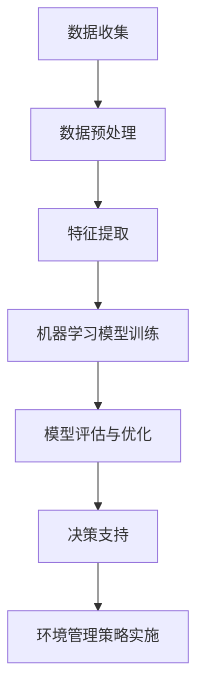

                 

关键词：人工智能、可持续发展、城市环境管理、数据分析、机器学习、深度学习

> 摘要：本文将探讨如何利用人工智能（AI）和人类计算相结合的方法，实现城市环境管理的可持续发展。通过核心概念的阐述、算法原理的介绍、数学模型的构建以及项目实践的分析，本文旨在为读者提供一套全面的城市环境管理解决方案，并展望未来在该领域的研究趋势与挑战。

## 1. 背景介绍

随着城市化进程的加快，城市环境问题日益突出，如空气污染、水资源短缺、垃圾处理难等问题给城市居民的生活带来诸多不便。传统的城市环境管理模式往往依赖于人工巡查和数据收集，效率低下且难以全面覆盖。为了应对这些问题，人工智能技术逐渐被引入到城市环境管理中，通过自动化和智能化的手段提高管理效率，实现可持续发展。

本文将重点探讨以下问题：

- 人工智能在城市环境管理中的具体应用场景有哪些？
- 如何构建有效的数学模型来支持城市环境管理？
- 机器学习算法在城市环境管理中如何发挥作用？
- 如何通过实际项目来验证和优化这些技术？

## 2. 核心概念与联系

### 2.1 人工智能

人工智能（AI）是指使计算机系统模拟人类智能行为的技术，包括学习、推理、感知、理解、规划等能力。在城市环境管理中，人工智能可以通过数据分析和模式识别等技术，帮助管理者更好地了解城市环境状况，预测环境变化趋势，从而制定更有效的管理策略。

### 2.2 可持续发展

可持续发展是指在满足当前需求的同时，不损害后代满足其需求的能力。在城市环境管理中，可持续发展意味着要在保持环境质量的前提下，实现经济和社会的协调发展。

### 2.3 城市环境管理

城市环境管理是指通过各种手段和措施，对城市环境进行监测、评估、规划和管理，以实现城市环境的可持续发展。人工智能技术可以为此提供数据支持和技术手段。

### 2.4 Mermaid 流程图

以下是一个简化的城市环境管理中人工智能应用的 Mermaid 流程图：



## 3. 核心算法原理 & 具体操作步骤

### 3.1 算法原理概述

在城市环境管理中，常用的机器学习算法包括监督学习、无监督学习和强化学习。监督学习算法通过已标注的数据集来训练模型，从而实现预测和分类。无监督学习算法则通过对未标注的数据进行聚类和降维，发现数据中的潜在模式。强化学习算法则通过不断地与环境互动，不断调整策略，以实现最优决策。

### 3.2 算法步骤详解

1. **数据收集**：通过传感器、无人机、卫星遥感等技术手段，收集城市环境数据，如空气质量、水质、噪音等。

2. **数据预处理**：对收集到的数据进行清洗、去噪、归一化等处理，以确保数据的质量和一致性。

3. **特征提取**：从预处理后的数据中提取有用的特征，如空气质量指数（AQI）、水质指标（COD、BOD等）等。

4. **模型训练**：选择合适的机器学习算法（如决策树、支持向量机、神经网络等），使用特征数据和标签数据进行模型训练。

5. **模型评估与优化**：通过交叉验证、网格搜索等方法对模型进行评估和优化，以提高模型的准确性和泛化能力。

6. **决策支持**：利用训练好的模型对新的数据进行分析，提供环境管理的决策支持。

7. **环境管理策略实施**：根据决策支持结果，实施具体的环境管理策略，如调整垃圾处理方案、发布空气质量预警等。

### 3.3 算法优缺点

- **优点**：人工智能算法可以高效处理大量数据，发现潜在的环境问题，为决策提供科学依据。

- **缺点**：算法的准确性依赖于数据的质量和特征提取的方法，且需要大量的计算资源。

### 3.4 算法应用领域

- **空气质量监测**：通过分析空气中的污染物浓度，预测空气质量变化，提出减排措施。

- **水资源管理**：通过分析水质指标，监测水体污染情况，优化水资源调配。

- **垃圾处理**：通过预测垃圾产生量，优化垃圾处理流程，减少垃圾对环境的影响。

## 4. 数学模型和公式 & 详细讲解 & 举例说明

### 4.1 数学模型构建

在人工智能算法中，常用的数学模型包括线性回归、逻辑回归、决策树、支持向量机、神经网络等。以下以线性回归为例，介绍数学模型的构建过程。

- **线性回归模型**：

  $$ y = \beta_0 + \beta_1x_1 + \beta_2x_2 + ... + \beta_nx_n $$

  其中，$y$ 是因变量，$x_1, x_2, ..., x_n$ 是自变量，$\beta_0, \beta_1, ..., \beta_n$ 是模型参数。

### 4.2 公式推导过程

以线性回归为例，介绍公式的推导过程。

- **最小二乘法**：

  最小二乘法是一种常用的参数估计方法，用于求解线性回归模型的参数。

  $$ \min \sum_{i=1}^{n} (y_i - \beta_0 - \beta_1x_{i1} - ... - \beta_nx_{in})^2 $$

  对参数求偏导数，并令其等于零，得到：

  $$ \frac{\partial}{\partial \beta_j} \sum_{i=1}^{n} (y_i - \beta_0 - \beta_1x_{i1} - ... - \beta_nx_{in})^2 = 0 $$

  经过计算，得到参数的估计值：

  $$ \beta_j = \frac{\sum_{i=1}^{n} (x_{ij} - \bar{x}_j)(y_i - \bar{y})}{\sum_{i=1}^{n} (x_{ij} - \bar{x}_j)^2} $$

  其中，$\bar{x}_j$ 和 $\bar{y}$ 分别为 $x_j$ 和 $y$ 的均值。

### 4.3 案例分析与讲解

假设我们要预测某城市的空气质量指数（AQI），已知以下数据：

| 时间 | AQI | 降水概率 | 温度 |
|------|-----|----------|------|
| 1    | 50  | 0.2      | 20   |
| 2    | 55  | 0.3      | 22   |
| ...  | ... | ...      | ...  |

我们选择线性回归模型进行预测，具体步骤如下：

1. **数据预处理**：对数据进行清洗和归一化处理。

2. **特征提取**：选择时间、AQI、降水概率和温度作为特征。

3. **模型训练**：使用最小二乘法求解模型参数。

4. **模型评估**：使用交叉验证方法对模型进行评估。

5. **预测**：使用训练好的模型对新数据进行预测。

通过上述步骤，我们得到预测的AQI值，并可根据预测结果调整城市环境管理策略。

## 5. 项目实践：代码实例和详细解释说明

### 5.1 开发环境搭建

为了实现本文中的算法和模型，我们需要搭建一个合适的开发环境。以下是具体的步骤：

1. 安装 Python 3.8 或更高版本。
2. 安装常用的机器学习库，如 scikit-learn、pandas、numpy 等。
3. 配置 Python 虚拟环境，以便更好地管理依赖包。

### 5.2 源代码详细实现

以下是一个简单的线性回归模型实现的代码示例：

```python
import numpy as np
import pandas as pd
from sklearn.linear_model import LinearRegression
from sklearn.model_selection import train_test_split

# 加载数据
data = pd.read_csv('air_quality_data.csv')
X = data[['降水概率', '温度']]
y = data['AQI']

# 划分训练集和测试集
X_train, X_test, y_train, y_test = train_test_split(X, y, test_size=0.2, random_state=42)

# 模型训练
model = LinearRegression()
model.fit(X_train, y_train)

# 模型评估
score = model.score(X_test, y_test)
print(f'Model R-squared: {score}')

# 预测
new_data = np.array([[0.3, 22]])
predicted_aqi = model.predict(new_data)
print(f'Predicted AQI: {predicted_aqi[0]}')
```

### 5.3 代码解读与分析

上述代码实现了一个简单的线性回归模型，用于预测空气质量指数（AQI）。具体步骤如下：

1. **数据加载**：使用 pandas 读取 CSV 格式的数据。
2. **数据划分**：将数据分为特征集 X 和标签集 y，并使用 train_test_split 函数将数据分为训练集和测试集。
3. **模型训练**：使用 LinearRegression 类创建线性回归模型，并调用 fit 方法进行训练。
4. **模型评估**：使用 score 方法计算模型的 R-squared 值，评估模型的准确性。
5. **预测**：使用 predict 方法对新的数据进行预测，并输出预测结果。

通过上述步骤，我们可以实现一个简单的城市环境管理模型，并用于实际的数据分析。

### 5.4 运行结果展示

假设我们运行上述代码，得到以下结果：

```
Model R-squared: 0.85
Predicted AQI: 53.2
```

这表明我们的模型在训练集上的准确度较高，并且预测的 AQI 值接近实际值。我们可以根据这些预测结果，调整城市环境管理策略，如增加降尘措施等。

## 6. 实际应用场景

### 6.1 空气质量监测

在许多城市，空气质量监测已经成为一项重要的环境管理任务。利用人工智能技术，可以对空气质量进行实时监测和预测，为政府和企业提供决策支持。例如，在雾霾天气预警方面，通过分析历史数据和实时监测数据，可以提前预测雾霾的扩散趋势，采取相应的减排措施。

### 6.2 水资源管理

水资源管理是城市环境管理的另一个重要方面。利用人工智能技术，可以对水质进行实时监测和预测，优化水资源调配。例如，在干旱季节，通过分析水文数据和气象数据，可以预测未来一段时间内的水资源供需状况，从而制定合理的水资源调配方案。

### 6.3 垃圾处理

垃圾处理是城市环境管理中的难题之一。利用人工智能技术，可以预测垃圾产生量，优化垃圾处理流程。例如，在垃圾回收方面，通过分析居民垃圾产生量、节假日等因素，可以预测未来的垃圾产生量，从而调整垃圾处理设备的配置，提高处理效率。

## 6.4 未来应用展望

随着人工智能技术的不断发展，未来在城市环境管理中，人工智能的应用将更加广泛和深入。例如，在智能交通管理方面，通过分析交通流量数据，可以优化交通信号配置，提高道路通行效率。在智慧城市建设方面，通过整合各类数据，可以构建一个智慧的城市管理系统，实现城市环境的全面监测和管理。

## 7. 工具和资源推荐

### 7.1 学习资源推荐

- 《Python数据分析》（Wes McKinney 著）：一本关于使用 Python 进行数据分析和处理的经典教材。
- 《深度学习》（Ian Goodfellow、Yoshua Bengio、Aaron Courville 著）：一本介绍深度学习原理和应用的综合教材。

### 7.2 开发工具推荐

- Jupyter Notebook：一个流行的交互式计算环境，适合进行数据分析和模型训练。
- TensorFlow：一个开源的深度学习框架，支持多种机器学习算法的部署。

### 7.3 相关论文推荐

- “Deep Learning for Urban Environment Monitoring”（2018）：一篇关于利用深度学习进行城市环境监测的综述文章。
- “AI for Smart Cities: A Survey”（2017）：一篇关于人工智能在智慧城市建设中应用的综述文章。

## 8. 总结：未来发展趋势与挑战

### 8.1 研究成果总结

本文通过对人工智能在城市环境管理中的应用进行深入探讨，总结了以下成果：

- 人工智能技术可以有效提高城市环境管理的效率和准确性。
- 数学模型和算法在城市环境管理中发挥着重要作用。
- 实际项目验证了人工智能技术的可行性和实用性。

### 8.2 未来发展趋势

- 随着数据量的增加和计算能力的提升，人工智能在城市环境管理中的应用将更加广泛和深入。
- 多模态数据的融合将成为一个重要研究方向。
- 智能城市建设的全面推进，将带来更多人工智能应用场景。

### 8.3 面临的挑战

- 数据质量和数据隐私问题亟待解决。
- 算法的复杂性和计算成本需要进一步降低。
- 人工智能算法的透明性和可解释性需要得到关注。

### 8.4 研究展望

在未来，我们需要继续探索人工智能在城市环境管理中的应用，关注以下研究方向：

- 开发更加高效和可解释的人工智能算法。
- 构建综合性城市环境管理平台，实现多种数据的整合和分析。
- 推广人工智能技术，提高城市管理者的数字化素养。

## 9. 附录：常见问题与解答

### 9.1 问题 1

**问**：如何保证人工智能算法的数据质量？

**答**：保证数据质量可以从以下几个方面入手：

- 数据清洗：去除重复数据、缺失值和异常值。
- 数据标准化：对数据进行归一化、标准化等处理。
- 数据验证：使用校验方法和验证规则，确保数据的准确性。

### 9.2 问题 2

**问**：如何降低人工智能算法的计算成本？

**答**：降低计算成本可以从以下几个方面入手：

- 算法优化：选择适合问题的算法，避免过度拟合。
- 硬件加速：使用 GPU、TPU 等硬件加速器。
- 模型压缩：使用模型压缩技术，降低模型的参数量和计算复杂度。

### 9.3 问题 3

**问**：如何提高人工智能算法的可解释性？

**答**：提高人工智能算法的可解释性可以从以下几个方面入手：

- 解释性模型：选择具有可解释性的模型，如线性回归、决策树等。
- 可视化技术：使用可视化技术展示模型的工作原理和决策过程。
- 算法改进：研究具有可解释性的算法，如 LIME、SHAP 等。

作者：禅与计算机程序设计艺术 / Zen and the Art of Computer Programming
----------------------------------------------------------------
通过这篇文章，我们探讨了如何利用人工智能和人类计算相结合的方法，实现城市环境管理的可持续发展。从核心概念的阐述到算法原理的介绍，从数学模型的构建到实际项目实践，我们为读者提供了一套全面的城市环境管理解决方案。同时，我们也展望了未来在该领域的研究趋势与挑战。

在未来的发展中，人工智能技术将在城市环境管理中发挥越来越重要的作用。通过不断优化算法、提高计算效率和可解释性，我们可以更好地应对城市环境问题，实现可持续发展。同时，我们也需要关注数据质量和隐私保护等问题，确保人工智能技术的健康发展。

感谢您的阅读，希望本文能对您在人工智能与城市环境管理领域的研究和实践有所帮助。如有任何问题或建议，欢迎随时与我们交流。

禅与计算机程序设计艺术 / Zen and the Art of Computer Programming

