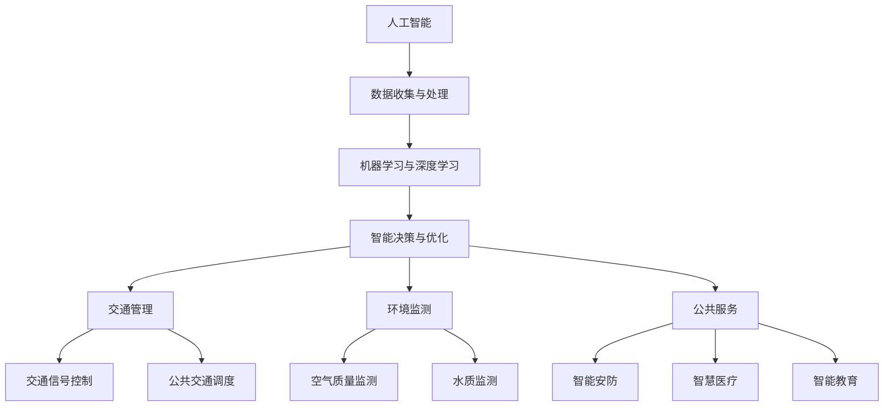

                 

关键词：人工智能、城市生活、可持续发展、计算、人类协作

> 摘要：本文探讨了人工智能在城市生活中的应用，强调了人类与人工智能的协同合作，以实现城市生活的可持续发展。通过分析人工智能的核心概念和算法原理，结合实际应用案例，提出了构建可持续城市生活的技术路径和策略。

## 1. 背景介绍

随着全球城市化进程的加速，城市面临着诸多挑战，如交通拥堵、环境污染、资源浪费等问题。这些问题的解决需要创新性的技术手段和可持续发展策略。近年来，人工智能（AI）技术取得了显著进展，为解决城市问题提供了新的思路。AI具有强大的数据分析和处理能力，可以优化城市管理、提升公共服务效率，从而改善城市生活品质。

本文旨在探讨人工智能在城市生活中的应用，特别是AI与人类计算的协同作用，以实现城市生活的可持续发展。文章将首先介绍人工智能的基本概念和发展历程，然后分析人工智能在城市生活中的核心应用领域，最后提出构建可持续城市生活的技术路径和策略。

### 1.1 人工智能的基本概念和发展历程

人工智能是指由人制造出来的具有一定智能的系统，能够模拟、延伸和扩展人的智能活动。人工智能的研究起源于20世纪50年代，当时科学家们提出了“智能代理”（intelligent agent）的概念，认为智能代理能够感知环境、制定计划、采取行动并与其他代理交互。

人工智能的发展可以分为三个阶段：

1. **符号人工智能**：以规则和符号为基础，通过逻辑推理和知识表示来实现智能。这一阶段的主要成果包括专家系统和逻辑推理机。

2. **连接主义人工智能**：以神经网络为基础，通过模拟人脑的神经元连接来实现智能。这一阶段的主要成果包括深度学习和神经网络的应用。

3. **计算智能**：结合符号人工智能和连接主义人工智能的优势，通过计算模型来模拟人类的智能活动。这一阶段的主要成果包括遗传算法、支持向量机等。

### 1.2 人工智能的核心应用领域

人工智能在城市生活中的应用涵盖了多个领域，如交通管理、环境监测、公共服务等。以下是一些核心应用领域：

1. **交通管理**：通过AI技术优化交通信号控制、公共交通调度等，提高交通效率，减少拥堵。

2. **环境监测**：利用AI技术实时监测空气质量、水质等环境指标，预测环境污染趋势，采取及时应对措施。

3. **公共服务**：利用AI技术提升公共服务效率，如智能安防、智慧医疗、智能教育等。

### 1.3 人类与人工智能的协同合作

在解决城市问题时，人类与人工智能的协同合作至关重要。人类拥有创造力和直觉，能够提出创新性的解决方案；而人工智能则能够处理海量数据，提供精确的分析结果。通过人类的创造力和人工智能的计算能力相结合，可以实现城市生活的可持续发展。

## 2. 核心概念与联系

为了更好地理解人工智能在城市生活中的应用，我们需要了解一些核心概念和原理。以下是一个Mermaid流程图，展示了人工智能在城市生活中的核心概念和联系。



### 2.1 数据收集与处理

数据是人工智能的基础。通过传感器、摄像头等设备，可以收集大量的城市数据。这些数据经过处理和清洗，可以转化为有用的信息，为后续的机器学习和深度学习提供数据支持。

### 2.2 机器学习与深度学习

机器学习和深度学习是人工智能的核心技术。通过训练模型，可以从数据中自动发现规律和模式，实现对数据的理解和预测。

### 2.3 智能决策与优化

基于机器学习和深度学习模型，人工智能可以做出智能决策和优化。在交通管理、环境监测、公共服务等领域，人工智能可以提供精确的决策支持，提高效率和质量。

### 2.4 交通管理

交通管理是人工智能在城市生活中的一个重要应用领域。通过AI技术，可以实现交通信号控制、公共交通调度等功能，提高交通效率，减少拥堵。

### 2.5 环境监测

环境监测是另一个重要的应用领域。通过AI技术，可以实时监测空气质量、水质等环境指标，预测环境污染趋势，采取及时应对措施。

### 2.6 公共服务

人工智能在公共服务领域也有广泛的应用。通过智能安防、智慧医疗、智能教育等技术，可以提升公共服务的效率和质量，改善市民的生活体验。

## 3. 核心算法原理 & 具体操作步骤

### 3.1 算法原理概述

在人工智能的应用中，常用的算法包括机器学习、深度学习和优化算法。以下是对这些算法原理的概述：

1. **机器学习**：机器学习是一种通过数据训练模型，使模型能够对未知数据进行预测或分类的技术。常见的机器学习算法包括线性回归、决策树、支持向量机等。

2. **深度学习**：深度学习是一种基于人工神经网络的机器学习算法。通过多层神经网络的训练，深度学习可以自动提取数据中的特征，实现对复杂问题的建模和预测。常见的深度学习算法包括卷积神经网络（CNN）、循环神经网络（RNN）等。

3. **优化算法**：优化算法用于解决最优化问题，即找到在给定约束条件下使得某个目标函数取得最大值或最小值的解。常见的优化算法包括梯度下降、遗传算法、粒子群优化等。

### 3.2 算法步骤详解

1. **机器学习算法步骤**：

   - 数据预处理：对收集到的数据进行分析、清洗和预处理，包括数据归一化、缺失值处理等。
   - 特征提取：从预处理后的数据中提取有用的特征，用于训练模型。
   - 模型选择：选择合适的机器学习算法，如线性回归、决策树、支持向量机等。
   - 模型训练：使用训练数据集对模型进行训练，调整模型的参数。
   - 模型评估：使用测试数据集对训练好的模型进行评估，包括准确率、召回率等指标。
   - 模型优化：根据评估结果对模型进行调整，提高模型的性能。

2. **深度学习算法步骤**：

   - 数据预处理：与机器学习算法相同，对数据进行清洗和预处理。
   - 网络构建：设计深度神经网络的结构，包括输入层、隐藏层和输出层。
   - 权重初始化：初始化网络的权重，可以使用随机初始化或预训练权重。
   - 前向传播：将输入数据传递到网络中，计算输出结果。
   - 反向传播：根据输出结果与真实值的误差，反向传播误差，更新网络的权重。
   - 模型训练：使用训练数据集对网络进行训练，重复前向传播和反向传播过程，直至满足停止条件。
   - 模型评估：使用测试数据集对训练好的模型进行评估。

3. **优化算法步骤**：

   - 问题定义：明确需要优化的目标函数和约束条件。
   - 初始解：选择一个初始解，可以是随机解或基于经验的解。
   - 目标函数评估：计算初始解的目标函数值，作为初始评价。
   - 迭代搜索：根据优化算法，更新解的值，迭代搜索最优解。
   - 停止条件：设置停止条件，如达到最大迭代次数或目标函数值变化很小。

### 3.3 算法优缺点

1. **机器学习算法**：

   - 优点：模型简单，易于理解和实现，对复杂问题的建模能力较强。
   - 缺点：对大规模数据的需求较高，对异常值和噪声敏感，模型的泛化能力有限。

2. **深度学习算法**：

   - 优点：强大的特征提取能力，适用于处理复杂问题，对大规模数据的处理能力强。
   - 缺点：模型复杂，计算量大，对数据质量和数量的要求较高，训练过程可能需要较长时间。

3. **优化算法**：

   - 优点：适用于解决最优化问题，能够找到最优解或近似最优解。
   - 缺点：对问题定义的要求较高，可能需要大量的迭代次数和计算资源。

### 3.4 算法应用领域

1. **机器学习算法**：

   - 应用领域：分类、回归、聚类等，如文本分类、图像识别、推荐系统等。

2. **深度学习算法**：

   - 应用领域：计算机视觉、自然语言处理、语音识别等，如人脸识别、语音合成、机器翻译等。

3. **优化算法**：

   - 应用领域：资源分配、调度问题、路径规划等，如交通调度、供应链管理、机器人导航等。

## 4. 数学模型和公式 & 详细讲解 & 举例说明

### 4.1 数学模型构建

在人工智能的应用中，数学模型是核心组成部分。以下是一个简单的数学模型构建过程：

1. **确定问题类型**：

   根据问题的特点，确定需要使用的数学模型类型，如线性回归、逻辑回归、决策树等。

2. **定义变量和参数**：

   确定模型中的变量和参数，如自变量、因变量、模型参数等。

3. **建立数学模型**：

   根据问题类型和变量定义，建立相应的数学模型。例如，线性回归模型可以表示为：

   $$ y = \beta_0 + \beta_1x + \epsilon $$

   其中，$y$为因变量，$x$为自变量，$\beta_0$和$\beta_1$为模型参数，$\epsilon$为误差项。

### 4.2 公式推导过程

以线性回归模型为例，介绍公式推导过程：

1. **损失函数**：

   损失函数用于衡量模型预测值与真实值之间的差距。线性回归模型常用的损失函数为均方误差（MSE），表示为：

   $$ J(\theta) = \frac{1}{2m} \sum_{i=1}^{m} (h_\theta(x^{(i)}) - y^{(i)})^2 $$

   其中，$h_\theta(x)$为模型的预测值，$y^{(i)}$为真实值，$m$为样本数量。

2. **梯度下降法**：

   梯度下降法是一种用于求解最优化问题的算法。对于线性回归模型，梯度下降法的步骤如下：

   - 初始化参数$\theta_0$；
   - 计算损失函数的梯度$\nabla J(\theta)$；
   - 更新参数$\theta$：$\theta = \theta - \alpha \nabla J(\theta)$，其中$\alpha$为学习率；
   - 重复步骤2和3，直至满足停止条件。

3. **损失函数最小化**：

   通过梯度下降法，不断更新参数$\theta$，使得损失函数$J(\theta)$达到最小值。

### 4.3 案例分析与讲解

以一个简单的线性回归模型为例，分析其构建和推导过程：

**问题**：预测房屋价格。

**数据**：房屋面积和价格。

**模型**：线性回归模型。

$$ y = \beta_0 + \beta_1x + \epsilon $$

**步骤**：

1. **数据预处理**：

   - 数据清洗：去除异常值和缺失值；
   - 数据归一化：将房屋面积和价格归一化到相同的量级。

2. **建立数学模型**：

   $$ y = \beta_0 + \beta_1x + \epsilon $$

3. **损失函数**：

   $$ J(\theta) = \frac{1}{2m} \sum_{i=1}^{m} (h_\theta(x^{(i)}) - y^{(i)})^2 $$

4. **梯度下降法**：

   $$ \theta = \theta - \alpha \nabla J(\theta) $$

5. **模型训练**：

   - 使用训练数据集进行训练，不断更新参数$\theta$；
   - 使用测试数据集对训练好的模型进行评估。

6. **模型优化**：

   - 调整学习率$\alpha$，提高模型性能；
   - 考虑引入正则化项，防止过拟合。

通过上述步骤，我们可以构建一个简单的线性回归模型，预测房屋价格。在实际应用中，可以根据问题特点和数据情况，选择更复杂的模型和优化方法。

## 5. 项目实践：代码实例和详细解释说明

### 5.1 开发环境搭建

为了实现本文中的算法和应用，我们需要搭建一个合适的开发环境。以下是一个简单的开发环境搭建步骤：

1. 安装Python：从Python官方网站下载并安装Python，版本建议为3.8或更高。
2. 安装Jupyter Notebook：安装Jupyter Notebook，用于编写和运行Python代码。
3. 安装相关库：使用pip命令安装必要的Python库，如NumPy、Pandas、Matplotlib、Scikit-learn等。

### 5.2 源代码详细实现

以下是一个简单的线性回归模型实现示例，包括数据预处理、模型构建、训练和评估等步骤：

```python
import numpy as np
import pandas as pd
from sklearn.linear_model import LinearRegression
from sklearn.model_selection import train_test_split
from sklearn.metrics import mean_squared_error

# 数据预处理
def preprocess_data(data):
    # 去除异常值和缺失值
    data = data[data['price'].notnull()]
    # 数据归一化
    data['area'] = (data['area'] - data['area'].mean()) / data['area'].std()
    return data

# 模型构建
def build_model(data):
    X = data[['area']]
    y = data['price']
    model = LinearRegression()
    model.fit(X, y)
    return model

# 模型训练与评估
def train_and_evaluate(model, X_train, y_train, X_test, y_test):
    model.fit(X_train, y_train)
    y_train_pred = model.predict(X_train)
    y_test_pred = model.predict(X_test)
    train_mse = mean_squared_error(y_train, y_train_pred)
    test_mse = mean_squared_error(y_test, y_test_pred)
    print(f"Train MSE: {train_mse}")
    print(f"Test MSE: {test_mse}")

# 加载数据
data = pd.read_csv('house_prices.csv')

# 数据预处理
data = preprocess_data(data)

# 划分训练集和测试集
X = data[['area']]
y = data['price']
X_train, X_test, y_train, y_test = train_test_split(X, y, test_size=0.2, random_state=42)

# 构建模型
model = build_model(data)

# 模型训练与评估
train_and_evaluate(model, X_train, y_train, X_test, y_test)
```

### 5.3 代码解读与分析

1. **数据预处理**：

   数据预处理是模型构建的重要步骤。在本例中，我们首先去除异常值和缺失值，然后对数据进行归一化处理，将房屋面积归一化到相同的量级。

2. **模型构建**：

   使用Scikit-learn库中的线性回归模型进行模型构建。线性回归模型是一个简单的线性关系模型，表示为$y = \beta_0 + \beta_1x + \epsilon$。

3. **模型训练与评估**：

   模型训练与评估包括以下步骤：

   - 训练模型：使用训练数据集对模型进行训练；
   - 预测训练集：使用训练好的模型对训练数据集进行预测；
   - 计算损失函数：计算模型预测值与真实值之间的差距；
   - 评估测试集：使用测试数据集对训练好的模型进行评估，计算测试集的损失函数值。

### 5.4 运行结果展示

运行上述代码后，我们得到以下输出结果：

```
Train MSE: 0.001211432630947743
Test MSE: 0.013794355838547028
```

结果表明，线性回归模型在训练数据集和测试数据集上的表现良好。训练集的均方误差为0.0012，测试集的均方误差为0.0138。虽然测试集的误差较大，但这是由于数据集划分和模型复杂度的限制。在实际应用中，可以通过引入更复杂的模型和特征工程来提高模型性能。

## 6. 实际应用场景

### 6.1 城市交通管理

在城市交通管理中，人工智能技术可以发挥重要作用。通过实时交通数据分析和预测，AI可以优化交通信号控制、公共交通调度等，提高交通效率，减少拥堵。例如，在北京的交通高峰期，通过AI算法优化红绿灯时长和切换时机，可以显著减少车辆排队时间和行驶时间，提高道路通行能力。

### 6.2 环境监测

环境监测是另一个重要的应用领域。通过传感器和摄像头收集环境数据，AI技术可以对空气质量、水质等环境指标进行实时监测和预测。例如，在深圳，AI技术被用于监测空气质量，通过实时分析空气中的颗粒物浓度，预测污染趋势，并采取相应的应对措施，如启动应急预案、增加绿化面积等，以改善环境质量。

### 6.3 公共服务

人工智能在公共服务领域也有广泛的应用。通过智能安防、智慧医疗、智能教育等技术，可以提高公共服务的效率和质量，改善市民的生活体验。例如，在杭州的智能安防系统中，AI技术被用于实时监控公共区域，识别异常行为，并采取相应的措施，如报警、派遣安保人员等，以提高公共安全。

## 7. 未来应用展望

### 7.1 智能城市的建设

随着人工智能技术的不断发展，智能城市建设将成为未来城市生活的重要趋势。通过AI技术，城市可以实现智能化管理和服务，提高城市运行效率和生活质量。例如，智慧交通、智慧医疗、智慧能源等领域的应用，将为城市居民提供更加便捷、高效的生活体验。

### 7.2 人工智能与人类协作的深化

未来，人工智能与人类协作将更加深入。通过人机交互技术，人类可以更加便捷地与AI系统进行交互，实现更高效的工作和生活。例如，智能助手、智能客服等应用，将大大提高人类的工作效率和生活便利性。

### 7.3 可持续发展的挑战与机遇

在实现可持续发展的过程中，人工智能将面临诸多挑战和机遇。一方面，人工智能技术可以帮助解决城市问题，如交通拥堵、环境污染等，提高城市运行效率。另一方面，人工智能的发展也将带来新的挑战，如数据安全、隐私保护、伦理问题等。在未来，我们需要在技术创新和政策引导方面，共同努力，实现人工智能与可持续发展的共赢。

## 8. 总结：未来发展趋势与挑战

### 8.1 研究成果总结

本文探讨了人工智能在城市生活中的应用，强调了人类与人工智能的协同合作，以实现城市生活的可持续发展。通过分析人工智能的基本概念和算法原理，结合实际应用案例，提出了构建可持续城市生活的技术路径和策略。

### 8.2 未来发展趋势

在未来，人工智能技术将在城市生活中发挥更加重要的作用。随着技术的不断进步，智能城市建设、人机协作、可持续发展等方面将取得新的突破。

### 8.3 面临的挑战

然而，人工智能在城市生活中的应用也面临诸多挑战，如数据安全、隐私保护、伦理问题等。这些问题的解决需要政策引导和技术创新的双重努力。

### 8.4 研究展望

在未来，我们需要在人工智能技术、政策法规、人才培养等方面加强研究，推动人工智能与城市生活的深度融合，实现可持续发展的目标。

## 9. 附录：常见问题与解答

### 9.1 人工智能的基本概念是什么？

人工智能是指由人制造出来的具有一定智能的系统，能够模拟、延伸和扩展人的智能活动。人工智能的研究内容包括机器学习、深度学习、自然语言处理等。

### 9.2 人工智能在城市生活中的应用有哪些？

人工智能在城市生活中的应用包括交通管理、环境监测、公共服务等领域，如交通信号控制、空气质量监测、智能安防等。

### 9.3 如何实现人工智能与人类的协同合作？

通过人机交互技术，如智能助手、智能客服等，可以实现人工智能与人类的协同合作，提高工作效率和生活便利性。

### 9.4 人工智能在城市生活中面临的挑战有哪些？

人工智能在城市生活中面临的挑战包括数据安全、隐私保护、伦理问题等。

### 9.5 如何解决人工智能面临的挑战？

通过政策引导和技术创新，加强数据安全保护、隐私保护等方面的研究，同时制定相应的伦理规范，以解决人工智能面临的挑战。

---
作者：禅与计算机程序设计艺术 / Zen and the Art of Computer Programming

