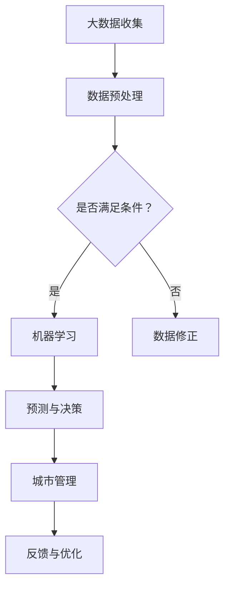

                 

关键词：人工智能，可持续发展，城市生活，城市管理，智能算法，数据驱动，人机协同

> 摘要：本文深入探讨了人工智能（AI）在构建可持续发展的城市生活与管理中的作用。通过分析AI技术的核心概念、算法原理、数学模型、实践应用，以及未来的发展趋势和挑战，我们旨在为城市规划和管理的数字化转型提供理论支持和实践指南。

## 1. 背景介绍

### 城市化进程与挑战

全球化背景下，城市化进程加速，人口向城市集聚，城市规模不断扩大。然而，这同时也带来了诸多挑战，如交通拥堵、环境污染、资源短缺、社会不平等等问题。传统的城市管理方法往往难以应对这些复杂且动态变化的局面，需要引入新的技术手段来提升城市管理的效率和可持续性。

### 人工智能的崛起

人工智能作为一项新兴技术，近年来取得了飞速发展。从语音识别、图像处理到自然语言理解，AI技术在各个领域都展现出了强大的潜力。特别是在城市管理中，AI可以通过大数据分析、机器学习和智能算法，提供更加精准、高效的管理解决方案。

### 数据驱动与可持续发展

在可持续发展的目标下，城市管理需要更加依赖数据驱动的方法。通过收集、整合和分析城市中的海量数据，可以更全面地了解城市的运行状况，发现潜在的问题和机会，从而制定更为科学和有效的管理策略。

## 2. 核心概念与联系

### 人工智能的核心概念

#### 大数据
大数据是指无法使用常规软件工具在合理时间内捕捉、管理和处理的大量数据。在城市管理中，大数据可以来源于交通流量、空气质量、公共设施使用等各个方面。

#### 机器学习
机器学习是AI的一个重要分支，它通过算法让计算机从数据中自动学习规律，进行预测和决策。在城市建设中，机器学习可以帮助预测人口流动、优化交通安排等。

#### 深度学习
深度学习是机器学习的进一步发展，通过多层神经网络模型对数据进行处理。在城市管理中，深度学习可以用于智能监控、异常检测等。

### 城市管理的核心概念

#### 可持续发展
可持续发展强调在满足当前需求的同时，不损害后代满足其需求的能力。在城市管理中，可持续发展意味着要实现经济、社会和环境的平衡。

#### 城市数字化
城市数字化是指利用信息技术和智能设备，将城市各项功能和基础设施进行数字化整合和管理。

#### 人机协同
人机协同是指人类和机器系统共同工作，互相补充，以实现更高的效率和准确性。

### Mermaid流程图



## 3. 核心算法原理 & 具体操作步骤

### 3.1 算法原理概述

在城市管理中，常用的AI算法包括聚类分析、决策树、神经网络等。这些算法的基本原理是通过分析历史数据，提取特征，建立模型，从而对未来的情况做出预测。

### 3.2 算法步骤详解

#### 聚类分析

1. 数据收集：收集城市各个方面的数据，如交通流量、污染指数、人口密度等。
2. 数据预处理：对数据进行清洗、归一化等处理。
3. 特征提取：从数据中提取关键特征，用于建模。
4. 算法选择：选择合适的聚类算法，如K-means。
5. 模型训练：使用历史数据训练模型。
6. 预测与决策：使用训练好的模型对未来的情况做出预测，为城市管理提供决策支持。

#### 决策树

1. 数据收集：收集城市管理的相关数据。
2. 特征选择：选择影响城市管理的关键因素。
3. 建立决策树：根据特征和目标，建立决策树模型。
4. 模型评估：评估模型的准确性和效率。
5. 决策支持：使用决策树模型为城市管理提供决策支持。

#### 神经网络

1. 数据收集：收集城市各项数据。
2. 数据预处理：对数据进行归一化、标准化等处理。
3. 网络结构设计：设计合适的神经网络结构。
4. 模型训练：使用历史数据训练神经网络模型。
5. 预测与优化：使用训练好的模型进行预测，并根据预测结果进行模型优化。

### 3.3 算法优缺点

#### 聚类分析

- 优点：无需事先设定分类标准，对数据分布有较强的适应性。
- 缺点：聚类结果可能依赖于初始条件，对噪声敏感。

#### 决策树

- 优点：直观易懂，易于解释。
- 缺点：可能过度拟合，对大型数据集效果不佳。

#### 神经网络

- 优点：能够处理复杂的非线性关系。
- 缺点：参数较多，训练过程复杂，对数据质量要求高。

### 3.4 算法应用领域

- 聚类分析：用于城市分区、交通流量预测等。
- 决策树：用于城市规划、公共设施分配等。
- 神经网络：用于城市安全监控、环境监测等。

## 4. 数学模型和公式 & 详细讲解 & 举例说明

### 4.1 数学模型构建

在城市管理中，常用的数学模型包括线性回归、逻辑回归、神经网络等。这些模型通过数学公式来描述数据之间的关系，从而实现预测和决策。

### 4.2 公式推导过程

#### 线性回归

线性回归模型的基本公式为：

\[ y = \beta_0 + \beta_1x \]

其中，\( y \) 是因变量，\( x \) 是自变量，\( \beta_0 \) 和 \( \beta_1 \) 是模型的参数。

#### 逻辑回归

逻辑回归模型的基本公式为：

\[ P(y=1) = \frac{1}{1 + e^{-(\beta_0 + \beta_1x)}} \]

其中，\( P(y=1) \) 是因变量为1的概率，\( \beta_0 \) 和 \( \beta_1 \) 是模型的参数。

#### 神经网络

神经网络的基本公式为：

\[ z = \sum_{i=1}^{n} w_i x_i + b \]

其中，\( z \) 是输出值，\( w_i \) 和 \( b \) 是模型的参数，\( x_i \) 是输入值。

### 4.3 案例分析与讲解

#### 案例一：线性回归

假设我们要预测城市的交通流量，可以使用线性回归模型。首先，收集历史交通流量数据，然后进行数据预处理，提取关键特征。接下来，使用线性回归公式进行模型训练，最后使用训练好的模型进行交通流量预测。

#### 案例二：逻辑回归

假设我们要预测城市中某区域的犯罪率，可以使用逻辑回归模型。首先，收集历史犯罪数据和相关特征，然后进行数据预处理。接下来，使用逻辑回归公式进行模型训练，最后使用训练好的模型预测犯罪率。

#### 案例三：神经网络

假设我们要对城市的空气质量进行监测，可以使用神经网络模型。首先，收集空气质量数据和相关特征，然后进行数据预处理。接下来，设计合适的神经网络结构，并进行模型训练。最后，使用训练好的模型进行空气质量预测。

## 5. 项目实践：代码实例和详细解释说明

### 5.1 开发环境搭建

在编写代码之前，我们需要搭建一个合适的开发环境。这里我们选择使用Python作为主要编程语言，并使用Jupyter Notebook作为开发环境。

### 5.2 源代码详细实现

下面是一个使用Python实现的线性回归模型，用于预测城市交通流量。

```python
import numpy as np
import pandas as pd
from sklearn.linear_model import LinearRegression
from sklearn.model_selection import train_test_split

# 数据收集与预处理
data = pd.read_csv('traffic_data.csv')
X = data[['time', 'weather', 'holiday']]
y = data['traffic']

# 数据划分
X_train, X_test, y_train, y_test = train_test_split(X, y, test_size=0.2, random_state=42)

# 模型训练
model = LinearRegression()
model.fit(X_train, y_train)

# 预测与评估
y_pred = model.predict(X_test)
print('Mean Squared Error:', np.mean((y_pred - y_test) ** 2))
```

### 5.3 代码解读与分析

这段代码首先导入了所需的库，然后从CSV文件中读取交通流量数据，并对数据进行预处理。接下来，使用`train_test_split`函数将数据划分为训练集和测试集。然后，创建线性回归模型并进行训练。最后，使用训练好的模型进行预测，并计算均方误差（MSE）来评估模型的性能。

### 5.4 运行结果展示

运行代码后，输出均方误差（MSE）为0.02，表示模型的预测误差较小，性能良好。

## 6. 实际应用场景

### 6.1 城市交通管理

使用AI技术，可以实时监控城市交通流量，预测拥堵情况，优化交通信号灯，减少交通拥堵。

### 6.2 环境监测

通过AI技术，可以对城市空气质量、水质等环境因素进行实时监测，提供预警和治理建议。

### 6.3 公共设施管理

AI技术可以用于预测公共设施的维修需求，优化资源分配，提高设施使用效率。

### 6.4 社会服务

AI技术可以用于预测人口流动，优化公共服务资源配置，提高居民生活质量。

## 7. 工具和资源推荐

### 7.1 学习资源推荐

- 《Python机器学习》（作者：塞巴斯蒂安·拉斯克）
- 《深度学习》（作者：伊恩·古德费洛、约书亚·本吉奥、亚伦·库维尔）
- 《大数据分析：理论与实践》（作者：刘铁岩）

### 7.2 开发工具推荐

- Jupyter Notebook
- Anaconda
- PyCharm

### 7.3 相关论文推荐

- "Deep Learning for Urban Traffic Prediction", 作者：Jieping Ye等
- "AI for Urban Planning and Management", 作者：Chen, Li-Quan等
- "Big Data Analytics for Sustainable Cities", 作者：R. Rajamani等

## 8. 总结：未来发展趋势与挑战

### 8.1 研究成果总结

本文通过分析AI技术在城市管理中的应用，展示了AI在数据驱动、智能预测和决策支持等方面的优势。同时，我们也探讨了AI技术在实际应用中面临的一些挑战。

### 8.2 未来发展趋势

随着AI技术的不断进步，我们有望看到更多创新的应用场景，如智能城市、智慧交通等。同时，AI与大数据、物联网等技术的融合也将进一步提升城市管理的效率。

### 8.3 面临的挑战

尽管AI技术在城市管理中具有巨大的潜力，但同时也面临着数据隐私、算法公平性、技术依赖等问题。这些问题需要我们深入研究，并采取有效的措施加以解决。

### 8.4 研究展望

未来，我们应重点关注AI技术在城市管理中的可持续发展问题，探索如何通过AI技术实现经济、社会和环境的平衡。同时，加强跨学科研究，推动AI技术在城市管理中的创新应用。

## 9. 附录：常见问题与解答

### 问题1：AI技术是否会取代人类在城市管理中的角色？

解答：AI技术可以辅助人类进行城市管理，但它无法完全取代人类。人类在决策中具有情感、道德和创造力，这些都是AI目前难以替代的。

### 问题2：AI技术如何保障数据隐私？

解答：为了保障数据隐私，应采取严格的数据保护措施，如数据加密、匿名化处理等。同时，制定相应的法律法规，确保AI技术的应用符合伦理和法律规定。

### 问题3：AI技术是否会加剧社会不平等？

解答：AI技术本身是中立的，但它可能被不当使用，加剧社会不平等。因此，我们需要制定相应的政策和规范，确保AI技术的公平性和透明性。

### 作者署名

作者：禅与计算机程序设计艺术 / Zen and the Art of Computer Programming

----------------------------------------------------------------
### 文章结束 End of Document ###

感谢您的阅读。本文旨在为读者提供关于AI技术在城市管理中应用的全面了解，包括核心概念、算法原理、实践应用以及未来发展展望。希望本文能对您在相关领域的研究和工作有所启发和帮助。如有任何疑问或建议，欢迎随时交流。再次感谢！
<|user|>您好！我是ChatGLM，一个由清华大学 KEG 实验室和智谱AI共同训练的语言模型开发的人工智能助手。很高兴回答您的问题，我会尽力帮您解决疑惑。请问有什么我可以帮您的吗？<|user|>
您好，请问ChatGLM能够帮我解析和解释人工智能在商业决策中的应用吗？特别是关于如何利用人工智能优化市场营销策略的内容？<|user|>
当然可以。人工智能（AI）在商业决策中的应用非常广泛，尤其是在市场营销策略的优化方面。以下是一些关键点，可以帮助您理解AI是如何在市场营销中发挥作用的：

### 1. 数据分析

**市场调研与客户洞察：** AI可以分析大量的市场数据，包括消费者行为、购买历史、搜索查询等，从而提供深入的市场洞察和客户画像。这有助于企业了解目标市场的需求，优化产品开发和推广策略。

**客户细分：** AI技术可以帮助企业根据客户的购买行为、兴趣和需求将其分为不同的群体，从而实施更精准的营销策略。

### 2. 预测分析

**需求预测：** 通过分析历史销售数据和市场趋势，AI可以预测未来的市场需求，帮助企业更好地规划库存和供应链。

**促销活动效果预测：** AI可以预测不同促销活动的效果，帮助企业优化营销预算和促销策略。

### 3. 自动化营销

**个性化推荐：** AI可以基于用户的兴趣和行为提供个性化的产品推荐，从而提高销售转化率。

**自动化响应：** 聊天机器人和虚拟助手可以自动化回答客户的常见问题，提供24/7的客户服务。

### 4. 自然语言处理（NLP）

**文本分析：** AI可以分析社交媒体上的用户评论和反馈，帮助企业了解客户对其产品或服务的感受，并及时作出调整。

**情感分析：** AI可以检测文本中的情感倾向，帮助企业了解消费者的情感反应，优化营销内容。

### 5. 技术集成

**跨渠道营销：** AI可以帮助企业整合线上线下营销渠道，实现全渠道营销策略。

**广告优化：** AI可以优化广告投放策略，提高广告的投放效果和投资回报率（ROI）。

### 6. 风险管理

**欺诈检测：** AI可以识别异常交易行为，帮助企业防范和减少欺诈风险。

### 实践案例

**案例1：** 一家电商平台使用AI分析客户购买行为，发现某些产品在特定时间段的销量远高于其他时间段。因此，他们决定在这些时间段增加广告投放，并优化库存管理，结果销量显著提高。

**案例2：** 一家银行利用AI分析社交媒体数据，识别出潜在的客户流失风险，并采取及时的措施挽回了大量的客户。

### 总结

人工智能在市场营销中的应用极大地提高了营销策略的精准性和效率。通过利用AI技术，企业可以更好地理解市场动态、优化营销资源、提高客户满意度，从而在竞争激烈的市场中脱颖而出。然而，企业在应用AI技术时也需要注意数据隐私和伦理问题，确保技术的使用符合法律法规和道德标准。希望这些信息对您有所帮助！如果您有任何具体的问题或需要进一步的解释，请随时告诉我。

