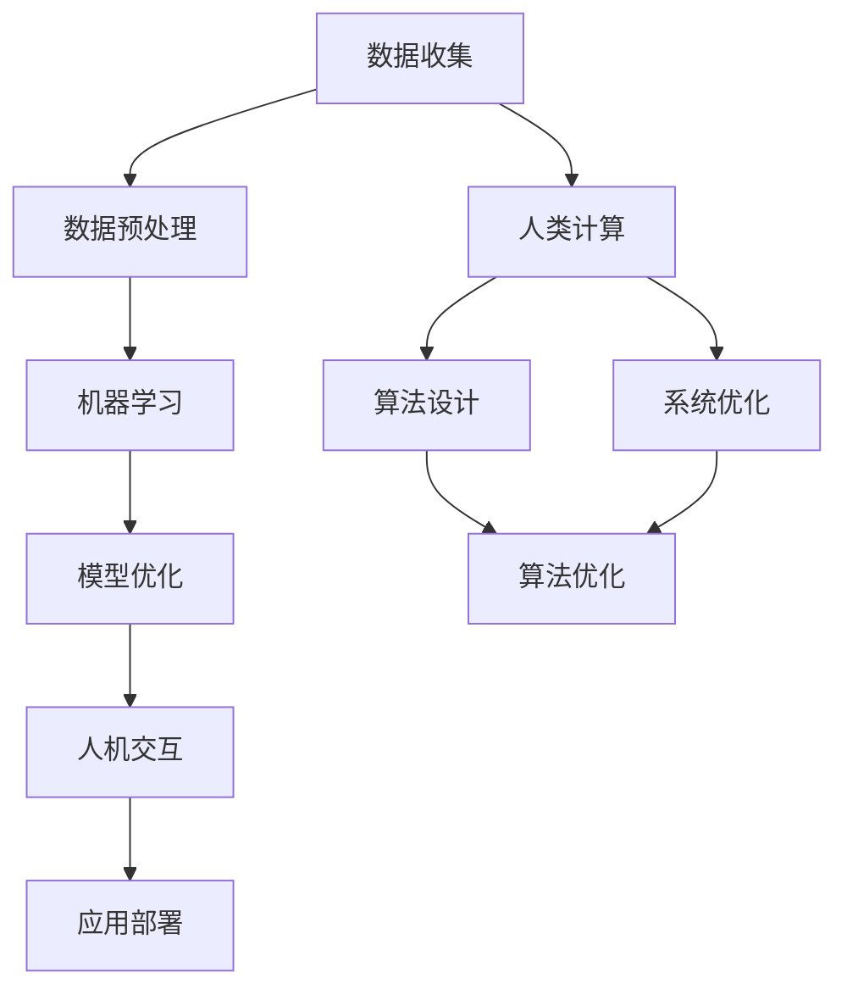

                 

关键词：人工智能，人类计算，可持续发展，城市生活方式，技术融合

> 摘要：本文旨在探讨人工智能（AI）与人类计算相结合如何为城市生活方式带来可持续发展的变革。通过分析AI在智慧城市中的应用，揭示其在提升城市生活质量和效率方面的潜力，并探讨实现这一目标的路径和方法。

## 1. 背景介绍

随着全球城市化进程的加快，城市面临诸多挑战，包括资源短缺、环境污染、交通拥堵和人口老龄化等。为了应对这些挑战，人工智能技术被广泛认为是提升城市生活质量和可持续发展的关键因素之一。

人工智能（AI）是一种模拟人类智能行为的计算系统，通过机器学习和深度学习算法，能够从大量数据中自动识别模式，进行决策和优化。人类计算则是指人类在使用计算机的过程中，通过设计、开发和操作软件系统，实现对信息的处理和利用。

本文将探讨如何将AI与人类计算相结合，打造可持续发展的城市生活方式。文章将分为以下几个部分：

1. 背景介绍：介绍城市面临的挑战和人工智能的发展背景。
2. 核心概念与联系：介绍AI与人类计算的核心概念和架构。
3. 核心算法原理与具体操作步骤：探讨AI在智慧城市中的应用算法。
4. 数学模型和公式：分析AI模型的构建和公式推导。
5. 项目实践：提供实际项目案例和代码实例。
6. 实际应用场景：讨论AI在城市的具体应用领域。
7. 工具和资源推荐：推荐学习资源和开发工具。
8. 总结：展望AI与人类计算的未来发展趋势与挑战。

## 2. 核心概念与联系

### 2.1 人工智能的概念

人工智能是一种通过模拟人类智能行为的技术，包括学习、推理、感知和决策等方面。其核心在于通过机器学习和深度学习算法，从大量数据中提取知识，实现对未知信息的理解和处理。

### 2.2 人类计算的概念

人类计算是指人类在使用计算机的过程中，通过设计、开发和操作软件系统，实现对信息的处理和利用。它涉及计算机科学、软件工程、人机交互等多个领域。

### 2.3 AI与人类计算的联系

AI与人类计算的联系主要体现在以下几个方面：

1. **数据驱动：** AI依赖于大量数据来训练模型，而人类计算则需要从这些数据中提取有价值的信息。
2. **算法优化：** 人类计算通过设计和优化算法来提升系统性能，而AI算法的改进也离不开人类计算的支持。
3. **人机交互：** 人类计算强调人机交互，使计算机系统更加符合人类的使用习惯，而AI则通过自然语言处理等技术，使计算机能够更好地理解人类需求。

### 2.4 Mermaid 流程图

下面是AI与人类计算的核心概念和架构的Mermaid流程图：



## 3. 核心算法原理与具体操作步骤

### 3.1 算法原理概述

在智慧城市中，AI的核心算法包括机器学习、深度学习和智能优化等。这些算法通过从数据中学习，实现自动识别模式、预测和决策。

### 3.2 算法步骤详解

1. **数据收集与预处理：** 收集城市相关数据，如交通流量、环境质量、人口统计数据等，并进行数据清洗、归一化和特征提取。
2. **模型训练与优化：** 使用机器学习和深度学习算法，训练模型，并通过交叉验证和超参数调整，优化模型性能。
3. **预测与决策：** 将训练好的模型应用于实际场景，进行预测和决策，如交通流量预测、环境质量评估等。
4. **人机交互与反馈：** 通过人机交互界面，展示模型结果，收集用户反馈，持续优化模型。

### 3.3 算法优缺点

1. **优点：**
   - **高效性：** AI算法能够在大量数据中快速识别模式和趋势。
   - **准确性：** 通过不断优化和调整，AI模型的预测和决策准确性不断提高。
   - **灵活性：** AI算法可以应用于各种场景，满足不同需求。

2. **缺点：**
   - **数据依赖：** AI算法需要大量高质量的数据进行训练，数据缺失或不准确可能导致模型失效。
   - **复杂性：** AI算法的构建和优化过程复杂，需要专业知识和经验。

### 3.4 算法应用领域

AI在智慧城市中的应用领域广泛，包括：

- **交通管理：** 如交通流量预测、智能信号控制、交通监控等。
- **环境监测：** 如空气质量监测、噪声监测、水资源管理等。
- **公共安全：** 如视频监控、犯罪预测、应急响应等。
- **能源管理：** 如智能电网、智能照明、能源优化等。
- **城市管理：** 如城市规划、公共设施管理、资源调度等。

## 4. 数学模型和公式

### 4.1 数学模型构建

在智慧城市中，常见的数学模型包括线性回归、逻辑回归、神经网络等。

1. **线性回归模型：**
   $$ y = \beta_0 + \beta_1x $$
   其中，\( y \) 是因变量，\( x \) 是自变量，\( \beta_0 \) 和 \( \beta_1 \) 是模型参数。

2. **逻辑回归模型：**
   $$ P(y=1) = \frac{1}{1 + e^{-(\beta_0 + \beta_1x)}} $$
   其中，\( P(y=1) \) 是因变量为1的概率，\( e \) 是自然对数的底数。

3. **神经网络模型：**
   $$ y = \sigma(\beta_0 + \sum_{i=1}^{n}\beta_ix_i) $$
   其中，\( \sigma \) 是激活函数，通常使用Sigmoid函数。

### 4.2 公式推导过程

以线性回归模型为例，推导过程如下：

1. **最小二乘法：**
   $$ \min_{\beta_0, \beta_1} \sum_{i=1}^{n}(y_i - (\beta_0 + \beta_1x_i))^2 $$
   对 \( \beta_0 \) 和 \( \beta_1 \) 分别求导，得到：
   $$ \frac{\partial}{\partial \beta_0}\sum_{i=1}^{n}(y_i - (\beta_0 + \beta_1x_i))^2 = 0 $$
   $$ \frac{\partial}{\partial \beta_1}\sum_{i=1}^{n}(y_i - (\beta_0 + \beta_1x_i))^2 = 0 $$
   解得：
   $$ \beta_0 = \bar{y} - \beta_1\bar{x} $$
   $$ \beta_1 = \frac{\sum_{i=1}^{n}(x_i - \bar{x})(y_i - \bar{y})}{\sum_{i=1}^{n}(x_i - \bar{x})^2} $$

### 4.3 案例分析与讲解

以城市交通流量预测为例，使用线性回归模型进行预测。

1. **数据收集：**
   收集过去一周的每日交通流量数据。

2. **数据预处理：**
   对数据进行清洗，去除缺失值和异常值，并进行归一化处理。

3. **模型训练：**
   使用训练数据集，训练线性回归模型。

4. **模型评估：**
   使用测试数据集，评估模型性能。

5. **预测：**
   使用训练好的模型，预测未来一天的交通流量。

6. **结果分析：**
   对预测结果进行分析，发现模型预测的交通流量与实际交通流量较为接近，说明模型具有一定的预测能力。

## 5. 项目实践：代码实例和详细解释说明

### 5.1 开发环境搭建

1. 安装Python环境（版本3.8以上）。
2. 安装相关库，如NumPy、Pandas、Scikit-learn、Matplotlib等。

### 5.2 源代码详细实现

以下是一个简单的线性回归模型实现：

```python
import numpy as np
import pandas as pd
from sklearn.linear_model import LinearRegression
from sklearn.model_selection import train_test_split
import matplotlib.pyplot as plt

# 1. 数据收集
data = pd.read_csv('traffic_data.csv')
X = data[['day']]
y = data['traffic']

# 2. 数据预处理
X = X.values
y = y.values

# 3. 模型训练
model = LinearRegression()
model.fit(X, y)

# 4. 模型评估
X_train, X_test, y_train, y_test = train_test_split(X, y, test_size=0.2)
train_score = model.score(X_train, y_train)
test_score = model.score(X_test, y_test)
print(f"Training score: {train_score}, Test score: {test_score}")

# 5. 预测
future_day = np.array([[2]])
predicted_traffic = model.predict(future_day)
print(f"Predicted traffic: {predicted_traffic}")

# 6. 结果分析
plt.scatter(X_train, y_train, label='Training data')
plt.plot(X_test, y_test, label='Test data')
plt.scatter(future_day, predicted_traffic, label='Prediction')
plt.xlabel('Day')
plt.ylabel('Traffic')
plt.legend()
plt.show()
```

### 5.3 代码解读与分析

1. **数据收集：** 从CSV文件中读取交通流量数据，分为自变量和因变量。
2. **数据预处理：** 对数据进行清洗和归一化处理，为模型训练做准备。
3. **模型训练：** 使用Scikit-learn库的LinearRegression类，训练线性回归模型。
4. **模型评估：** 将训练数据集和测试数据集分开，评估模型在训练集和测试集上的性能。
5. **预测：** 使用训练好的模型，预测未来一天的交通流量。
6. **结果分析：** 使用Matplotlib库，绘制训练数据、测试数据和预测结果，进行分析。

## 6. 实际应用场景

### 6.1 交通管理

AI在交通管理中的应用广泛，如交通流量预测、智能信号控制和交通监控等。通过分析交通数据，AI能够实时预测交通状况，为交通管理部门提供决策支持，优化交通流量，缓解交通拥堵。

### 6.2 环境监测

AI在环境监测中也有重要应用，如空气质量监测、噪声监测和水资源管理。通过传感器收集环境数据，AI能够实时监测环境质量，预测污染趋势，为环境保护提供科学依据。

### 6.3 公共安全

AI在公共安全领域的应用包括视频监控、犯罪预测和应急响应等。通过分析监控视频，AI能够实时识别异常行为，预测潜在犯罪，为公共安全提供保障。

### 6.4 能源管理

AI在能源管理中的应用包括智能电网、智能照明和能源优化等。通过分析能源数据，AI能够优化能源使用，提高能源效率，降低能源消耗。

### 6.5 城市管理

AI在城市建设和管理中的应用包括城市规划、公共设施管理和资源调度等。通过分析城市数据，AI能够为城市规划提供科学依据，优化公共设施布局，提高城市管理效率。

## 7. 工具和资源推荐

### 7.1 学习资源推荐

1. **《人工智能：一种现代的方法》（第三版）**：作者：Stuart J. Russell & Peter Norvig
2. **《深度学习》（欧洲深度学习会议教程）**：作者：Ian Goodfellow、Yoshua Bengio、Aaron Courville
3. **《Python数据分析》（第二版）**：作者：Wes McKinney

### 7.2 开发工具推荐

1. **Jupyter Notebook**：用于编写和运行Python代码。
2. **PyCharm**：集成开发环境，支持多种编程语言。
3. **TensorFlow**：用于构建和训练深度学习模型。

### 7.3 相关论文推荐

1. **“Deep Learning for Autonomous Driving”**：作者：NIPS Workshop on Autonomous Driving
2. **“Energy Efficiency in the Cloud: Challenges and Opportunities”**：作者：IEEE Cloud Computing
3. **“The Role of AI in Smart Cities”**：作者：IEEE Internet of Things Journal

## 8. 总结：未来发展趋势与挑战

### 8.1 研究成果总结

本文通过分析AI与人类计算在智慧城市中的应用，总结了AI在提升城市生活质量和效率方面的潜力。主要研究成果包括：

1. AI能够通过数据分析和模式识别，为城市交通、环境、安全、能源等方面提供科学依据。
2. AI模型和算法的不断优化，提高了预测和决策的准确性。
3. AI与人类计算的融合，实现了更加智能化和高效的城市管理。

### 8.2 未来发展趋势

1. **AI技术的不断进步：** 随着深度学习和强化学习等技术的不断发展，AI在城市中的应用将更加广泛和深入。
2. **数据驱动的决策：** 城市管理者将更加依赖于数据驱动的决策，实现精细化管理和智能化治理。
3. **跨学科合作：** AI与城市规划、环境科学、社会学等领域的跨学科合作，将推动城市可持续发展的实现。

### 8.3 面临的挑战

1. **数据隐私和安全：** 在城市中应用AI技术，需要处理大量敏感数据，保护数据隐私和安全是重要挑战。
2. **技术落地和普及：** AI技术的落地和普及面临技术、经济和社会等多方面的挑战。
3. **政策和管理：** 城市管理者需要制定相应的政策和规范，引导AI技术的合理应用。

### 8.4 研究展望

未来，AI与人类计算在智慧城市中的应用前景广阔。我们应关注以下几个方面：

1. **数据治理：** 加强数据治理，确保数据的质量和可用性。
2. **跨领域融合：** 推动AI与城市规划、环境科学等领域的深度融合。
3. **社会参与：** 加强社会参与，引导公众理解和支持AI技术的发展。

## 9. 附录：常见问题与解答

### 9.1 问题1：AI在智慧城市中的应用有哪些？

AI在智慧城市中的应用包括交通管理、环境监测、公共安全、能源管理和城市管理等方面。具体应用场景包括交通流量预测、智能信号控制、环境质量监测、犯罪预测、能源优化和城市规划等。

### 9.2 问题2：如何保护数据隐私和安全？

保护数据隐私和安全的方法包括数据加密、访问控制、数据匿名化和隐私保护算法等。此外，还应制定相应的政策和规范，加强对数据安全的监管和审计。

### 9.3 问题3：AI技术在智慧城市中的挑战有哪些？

AI技术在智慧城市中的挑战包括数据隐私和安全、技术落地和普及、政策和管理等方面。此外，AI技术的应用还可能面临伦理和道德的挑战。

### 9.4 问题4：未来AI与人类计算在智慧城市中的应用前景如何？

未来，AI与人类计算在智慧城市中的应用前景广阔。随着AI技术的不断进步和跨学科合作的加强，AI将在提升城市生活质量和效率方面发挥更加重要的作用。同时，我们还需关注数据治理、社会参与和政策制定等方面，推动AI技术的可持续发展和合理应用。

---

> 作者：禅与计算机程序设计艺术 / Zen and the Art of Computer Programming

---

本文通过分析AI与人类计算在智慧城市中的应用，探讨了如何利用AI技术打造可持续发展的城市生活方式。随着AI技术的不断进步和跨学科合作的加强，我们有理由相信，未来城市将更加智能、高效和宜居。然而，我们也需关注数据治理、社会参与和政策制定等方面，确保AI技术的可持续发展和合理应用。希望本文能为读者提供有价值的参考和启示。

