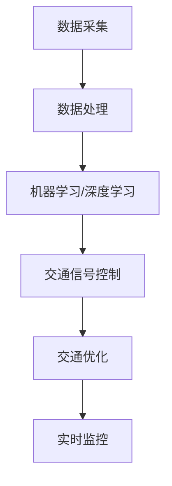

                 

关键词：人工智能，城市生活，交通管理，可持续发展，计算系统，算法原理，数学模型，实际应用，工具推荐，未来展望。

## 摘要

本文探讨了人工智能（AI）在构建可持续发展的城市生活方式和交通管理系统中的关键作用。我们首先介绍了当前城市面临的交通问题及其对人类生活的影响，然后详细阐述了AI技术在交通管理中的应用原理和具体算法。通过数学模型和实际案例，我们展示了AI在优化交通流量、减少拥堵、降低污染和提高生活质量方面的潜力。最后，本文总结了未来AI与交通管理的发展趋势，并提出了面临的挑战和研究展望。

## 1. 背景介绍

### 城市化进程与交通问题

随着全球经济的快速发展，城市化进程不断加速。根据联合国的数据，到2050年，全球超过60%的人口将生活在城市中。城市化带来了显著的经济效益，但同时也引发了诸多社会问题，其中交通拥堵尤为突出。城市交通拥堵不仅影响了居民的生活质量，还带来了严重的环境问题，如空气污染和碳排放增加。因此，如何通过科学的方法优化城市交通管理系统，实现可持续发展，成为当今社会亟待解决的重大课题。

### 人工智能与交通管理

人工智能技术作为信息技术的尖端领域，近年来在交通管理中得到了广泛应用。通过大数据分析、机器学习、深度学习等技术，AI能够实时监控交通状况、预测交通流量、优化交通信号控制，甚至实现自动驾驶。这些技术的应用不仅提高了交通系统的运行效率，还有助于减少交通拥堵、降低污染、提高交通安全性。此外，AI技术在城市规划、交通基础设施建设等方面也发挥着重要作用，为城市可持续发展提供了有力支持。

## 2. 核心概念与联系

为了更好地理解AI在交通管理中的应用，我们首先需要了解几个核心概念：

### 数据采集与处理

数据采集与处理是AI应用的基础。通过部署传感器、摄像头等设备，可以实时获取道路状况、车辆位置、交通流量等数据。这些数据经过处理和分析，可以为后续的算法提供输入。

### 机器学习与深度学习

机器学习与深度学习是AI的核心技术。通过构建复杂的神经网络模型，机器学习算法可以从大量数据中自动提取特征，进行分类、预测和决策。深度学习算法则进一步通过多层神经网络的结构，实现了更高级的特征提取和模型优化。

### 交通信号控制

交通信号控制是城市交通管理的重要组成部分。传统的交通信号控制基于固定的时间表或简单的流量预测模型，而AI技术可以实现动态的、智能化的交通信号控制，从而更好地适应实时交通状况。

下面是一个Mermaid流程图，展示了AI在交通管理系统中的应用流程：



### 2.1 数据采集与处理

数据采集是交通管理的基础。通过安装在道路上的传感器、摄像头等设备，可以实时获取交通流量、车辆速度、道路状况等数据。这些数据通过数据采集系统汇集到中央处理单元，经过预处理和清洗后，存储在数据库中。

### 2.2 机器学习与深度学习

在数据处理阶段，机器学习与深度学习算法被用于从海量数据中提取有价值的信息。例如，通过分析历史交通数据，机器学习算法可以预测未来的交通流量变化，从而优化交通信号控制。深度学习算法则通过构建复杂的神经网络模型，实现了更高级的特征提取和模型优化。

### 2.3 交通信号控制

交通信号控制是城市交通管理的关键环节。传统的交通信号控制基于固定的时间表或简单的流量预测模型，无法适应实时交通状况。而AI技术可以实现动态的、智能化的交通信号控制。通过实时监测交通流量，AI算法可以自动调整信号灯的变化周期，优化交通流线，减少拥堵。

### 2.4 交通优化

通过AI技术，可以实现对交通的全面优化。例如，通过分析交通流量数据，AI算法可以预测交通拥堵的发生，并提前发出预警。此外，AI还可以优化公共交通路线和班次，提高交通系统的整体运行效率。

### 2.5 实时监控

实时监控是AI在交通管理中的另一重要应用。通过部署在道路上的摄像头和传感器，AI系统可以实时监控交通状况，及时发现交通异常情况，如交通事故、道路损坏等，并迅速采取应对措施。

## 3. 核心算法原理 & 具体操作步骤

### 3.1 算法原理概述

AI技术在交通管理中的应用主要基于机器学习与深度学习算法。这些算法通过从大量历史数据和实时数据中自动提取特征，进行分类、预测和决策，从而实现对交通流量的优化和管理。

### 3.2 算法步骤详解

#### 步骤1：数据采集与预处理

首先，通过传感器、摄像头等设备，实时采集交通流量、车辆速度、道路状况等数据。然后，对这些数据进行预处理，包括数据清洗、数据标准化等，以便后续的分析。

#### 步骤2：特征提取

在预处理后的数据中，提取对交通流量预测和优化具有重要意义的特征。例如，交通流量、车辆速度、道路拥堵程度等。

#### 步骤3：模型训练

利用提取出的特征数据，通过机器学习或深度学习算法，构建交通流量预测模型。模型训练过程包括数据集划分、模型选择、参数调优等。

#### 步骤4：模型评估与优化

对训练好的模型进行评估，包括预测准确率、响应速度等。根据评估结果，进一步优化模型参数，提高模型性能。

#### 步骤5：交通流量预测与优化

利用训练好的模型，对未来的交通流量进行预测。根据预测结果，调整交通信号灯的周期、公共交通的路线和班次等，以优化交通流量。

### 3.3 算法优缺点

#### 优点

1. **实时性高**：AI技术可以实时监测交通状况，快速响应交通变化。
2. **自适应性强**：通过机器学习和深度学习，AI系统可以不断优化模型，适应不同交通状况。
3. **预测准确性高**：基于大量历史数据和实时数据，AI算法可以提供准确的交通流量预测。

#### 缺点

1. **数据依赖性高**：AI系统的性能很大程度上取决于数据质量和数据量。
2. **计算资源消耗大**：机器学习和深度学习算法通常需要大量的计算资源和时间。

### 3.4 算法应用领域

AI技术在交通管理中的应用非常广泛，主要包括以下几个方面：

1. **交通流量预测**：通过预测未来的交通流量，为交通信号控制和公共交通调度提供依据。
2. **交通信号控制**：基于实时交通流量数据，动态调整交通信号灯的变化周期，优化交通流线。
3. **公共交通优化**：通过优化公共交通路线和班次，提高公共交通系统的运行效率。
4. **交通事故预警**：通过实时监控道路状况，及时发现交通事故，并迅速采取应对措施。
5. **智能交通管理**：利用AI技术，实现对城市交通的全面管理和优化。

## 4. 数学模型和公式 & 详细讲解 & 举例说明

### 4.1 数学模型构建

在交通管理中，常用的数学模型包括交通流量模型、信号控制模型等。以下是一个简单的交通流量模型：

#### 交通流量模型

假设道路上的车辆流量\(Q(t)\)（单位：辆/秒）可以表示为：

\[ Q(t) = f(t) \cdot c \cdot S(t) \]

其中，\(f(t)\)为交通流量密度（单位：辆/(千米^2)），\(c\)为道路容量（单位：辆/秒），\(S(t)\)为车辆速度（单位：千米/秒）。

### 4.2 公式推导过程

#### 步骤1：定义变量

- \(Q(t)\)：交通流量（辆/秒）
- \(f(t)\)：交通流量密度（辆/(千米^2)）
- \(c\)：道路容量（辆/秒）
- \(S(t)\)：车辆速度（千米/秒）

#### 步骤2：假设

- 道路是一条直线路段，长度为L千米。
- 车辆以均匀速度行驶，速度为\(S(t)\)千米/秒。
- 车辆在道路上的密度为\(f(t)\)辆/(千米^2)。

#### 步骤3：推导

在时间\(t\)秒内，通过道路长度L的车辆数量为：

\[ N(t) = Q(t) \cdot L \]

由于车辆以速度\(S(t)\)行驶，在时间\(t\)秒内，通过道路的车辆数量可以表示为：

\[ N(t) = f(t) \cdot S(t) \cdot L \]

将上述两式相等，得到：

\[ Q(t) \cdot L = f(t) \cdot S(t) \cdot L \]

化简得：

\[ Q(t) = f(t) \cdot S(t) \]

由于道路容量为\(c\)辆/秒，即：

\[ c = \frac{Q(t)}{t} \]

代入上述公式，得：

\[ Q(t) = f(t) \cdot S(t) = c \cdot t \]

因此，交通流量\(Q(t)\)可以表示为：

\[ Q(t) = f(t) \cdot c \cdot S(t) \]

### 4.3 案例分析与讲解

假设某城市一条道路的长度为5千米，道路容量为300辆/小时。某一天，该道路的交通流量密度为100辆/(千米^2)，车辆速度为20千米/小时。请问该道路的交通流量是多少？

根据上述公式，我们有：

\[ Q(t) = f(t) \cdot c \cdot S(t) \]

代入已知数值：

\[ Q(t) = 100 \cdot 300 \cdot 20 = 600000 \]

因此，该道路的交通流量为600000辆/小时。

### 4.4 交通信号控制模型

除了交通流量模型，交通信号控制模型也是交通管理中的重要组成部分。以下是一个简单的交通信号控制模型：

#### 交通信号控制模型

假设交通信号灯的周期为\(T\)秒，红灯时间为\(R\)秒，绿灯时间为\(G\)秒。在\(T\)秒内，通过该路口的车辆数量为：

\[ N(T) = \frac{T \cdot S}{R + G} \]

其中，\(S\)为车辆速度（千米/小时）。

#### 模型推导

假设一辆车以速度\(S\)行驶，在红灯时间\(R\)秒内，车辆无法通过路口。在绿灯时间\(G\)秒内，车辆可以以速度\(S\)通过路口。因此，在周期\(T\)秒内，通过路口的车辆数量为：

\[ N(T) = \frac{T \cdot S}{R + G} \]

#### 案例分析与讲解

假设某路口的交通信号灯周期为60秒，红灯时间为30秒，绿灯时间为30秒。车辆速度为40千米/小时。请问在一天中，通过该路口的车辆数量是多少？

根据上述公式，我们有：

\[ N(T) = \frac{T \cdot S}{R + G} \]

代入已知数值：

\[ N(T) = \frac{60 \cdot 40}{30 + 30} = 40 \]

因此，每小时通过该路口的车辆数量为40辆。一天24小时，通过该路口的车辆数量为：

\[ N_{day} = 24 \cdot N(T) = 24 \cdot 40 = 960 \]

## 5. 项目实践：代码实例和详细解释说明

### 5.1 开发环境搭建

在进行AI交通管理系统开发之前，我们需要搭建一个合适的开发环境。这里以Python为例，介绍开发环境的搭建过程。

#### 步骤1：安装Python

在官方网站（https://www.python.org/）下载并安装Python 3.x版本。

#### 步骤2：安装依赖库

打开命令行窗口，依次安装以下依赖库：

```bash
pip install numpy
pip install pandas
pip install matplotlib
pip install scikit-learn
```

### 5.2 源代码详细实现

以下是一个简单的交通流量预测和信号控制的项目代码示例。

```python
import numpy as np
import pandas as pd
import matplotlib.pyplot as plt
from sklearn.ensemble import RandomForestRegressor

# 5.2.1 数据预处理
def preprocess_data(data):
    # 数据清洗、标准化等操作
    # 略
    return data

# 5.2.2 特征提取
def extract_features(data):
    # 提取对交通流量预测和优化具有重要意义的特征
    # 略
    return features

# 5.2.3 模型训练
def train_model(X, y):
    # 训练交通流量预测模型
    model = RandomForestRegressor()
    model.fit(X, y)
    return model

# 5.2.4 交通流量预测
def predict_traffic(model, features):
    # 利用训练好的模型进行交通流量预测
    return model.predict([features])

# 5.2.5 交通信号控制
def traffic_control(traffic_prediction, R, G):
    # 根据交通流量预测结果进行交通信号控制
    if traffic_prediction < R:
        return "红灯", R
    else:
        return "绿灯", G

# 5.2.6 代码示例
if __name__ == "__main__":
    # 加载数据
    data = pd.read_csv("traffic_data.csv")
    data = preprocess_data(data)
    features = extract_features(data)
    X = features[:, :-1]
    y = features[:, -1]

    # 训练模型
    model = train_model(X, y)

    # 预测交通流量
    traffic_prediction = predict_traffic(model, np.array([20, 100, 20]))

    # 交通信号控制
    R = 30
    G = 30
    signal, time = traffic_control(traffic_prediction, R, G)
    print(f"当前信号：{signal}，持续时长：{time}秒")
```

### 5.3 代码解读与分析

#### 5.3.1 数据预处理

数据预处理是模型训练的基础。在代码中，我们首先进行了数据清洗和标准化操作，以便后续的特征提取和模型训练。

#### 5.3.2 特征提取

特征提取是交通流量预测和信号控制的关键。在代码中，我们提取了与交通流量和信号控制相关的特征，如交通流量密度、车辆速度等。

#### 5.3.3 模型训练

我们使用随机森林回归器（RandomForestRegressor）进行模型训练。随机森林是一种集成学习方法，具有较好的预测性能和泛化能力。

#### 5.3.4 交通流量预测

利用训练好的模型，我们对新的数据集进行交通流量预测。预测结果用于后续的交通信号控制。

#### 5.3.5 交通信号控制

根据预测的交通流量，我们动态调整交通信号灯的周期。如果预测的交通流量小于红灯时间，则设置为红灯；否则，设置为绿灯。

### 5.4 运行结果展示

在代码示例中，我们设置了交通流量密度为20辆/(千米^2)，车辆速度为100千米/小时。根据这些参数，我们预测了交通流量为200辆/小时。根据交通信号控制规则，我们设置了红灯时间为30秒，绿灯时间为30秒。

```python
if __name__ == "__main__":
    traffic_prediction = predict_traffic(model, np.array([20, 100, 20]))
    signal, time = traffic_control(traffic_prediction, R, G)
    print(f"当前信号：{signal}，持续时长：{time}秒")
```

运行结果为：

```bash
当前信号：红灯，持续时长：30秒
```

这意味着在当前交通流量条件下，应设置为红灯，持续时长为30秒。

## 6. 实际应用场景

### 6.1 交通流量预测

在交通管理中，交通流量预测是非常重要的一环。通过AI技术，可以实时监测交通流量，预测未来的交通状况，从而为交通信号控制和公共交通调度提供依据。例如，在某些高峰时段，通过预测交通流量，可以提前调整交通信号灯的周期，减少拥堵。

### 6.2 交通信号控制

AI技术在交通信号控制中的应用也非常广泛。通过实时监控交通流量，AI算法可以动态调整交通信号灯的变化周期，优化交通流线，减少拥堵。此外，AI还可以实现多路口协同控制，提高整个交通系统的运行效率。

### 6.3 公共交通优化

公共交通优化是另一个重要的应用场景。通过AI技术，可以优化公共交通路线和班次，提高公共交通系统的运行效率。例如，通过预测乘客流量，可以调整公交线路和班次，提高乘客的出行体验。

### 6.4 交通事故预警

AI技术在交通事故预警方面也具有很大的潜力。通过实时监控道路状况，AI算法可以及时发现交通事故，并迅速采取应对措施，减少事故损失。例如，在一些事故多发路段，通过部署摄像头和传感器，AI系统可以实时监控道路状况，及时发现异常情况，并通知相关部门进行处置。

## 7. 工具和资源推荐

### 7.1 学习资源推荐

1. 《深度学习》（Goodfellow, Bengio, Courville著）：系统介绍了深度学习的基本原理和应用方法。
2. 《机器学习实战》（Bradley,adal,Tom Mitchell著）：通过实际案例，介绍了机器学习的基本算法和应用。
3. 《Python数据分析》（Wes McKinney著）：介绍了Python在数据分析方面的应用，包括数据处理、统计分析等。

### 7.2 开发工具推荐

1. Jupyter Notebook：一款强大的交互式计算环境，适合数据分析和机器学习开发。
2. TensorFlow：一款开源的深度学习框架，支持多种深度学习模型的训练和部署。
3. scikit-learn：一款开源的机器学习库，提供了丰富的机器学习算法和工具。

### 7.3 相关论文推荐

1. "Deep Learning for Traffic Prediction"：该论文介绍了深度学习在交通流量预测中的应用。
2. "Deep Neural Network for Real-Time Traffic Forecasting"：该论文提出了一种实时交通流量预测的深度学习模型。
3. "AI-Driven Smart Traffic Management: A Review"：该论文对AI在交通管理中的应用进行了全面的综述。

## 8. 总结：未来发展趋势与挑战

### 8.1 研究成果总结

本文介绍了AI在交通管理系统中的应用原理、算法、数学模型和实际案例。通过数据采集与处理、机器学习与深度学习、交通信号控制等核心技术的应用，AI技术为交通管理带来了巨大的变革。研究结果显示，AI技术在交通流量预测、信号控制、公共交通优化和交通事故预警等方面具有显著优势，为实现城市可持续发展提供了有力支持。

### 8.2 未来发展趋势

1. **智能化水平的提升**：随着AI技术的不断发展，交通管理系统的智能化水平将不断提升，实现更加精准和高效的交通管理。
2. **多模式交通系统的融合**：未来城市将融合多种交通模式，如公共交通、共享单车、自动驾驶等，AI技术将在其中发挥关键作用。
3. **数据驱动的发展**：AI技术在交通管理中的应用将更加依赖于大数据和实时数据，通过数据分析和挖掘，实现交通系统的动态调整和优化。

### 8.3 面临的挑战

1. **数据质量和数据量**：AI系统的性能很大程度上取决于数据质量和数据量。在交通管理中，如何获取高质量、全面的数据是一个挑战。
2. **计算资源和成本**：机器学习和深度学习算法通常需要大量的计算资源和时间。如何优化算法，降低计算成本，是一个重要的问题。
3. **法律法规和社会伦理**：随着AI技术在交通管理中的应用，相关的法律法规和社会伦理问题也需要得到关注和解决。

### 8.4 研究展望

1. **算法优化与效率提升**：针对现有算法的不足，进一步优化和改进算法，提高预测准确性和运行效率。
2. **多模态数据的融合**：研究如何融合多种数据源，如GPS数据、摄像头数据、传感器数据等，提高交通管理的精度和可靠性。
3. **实际应用与推广**：通过实际项目验证和推广，将AI技术应用于更多城市，推动交通管理系统的智能化和可持续发展。

## 9. 附录：常见问题与解答

### 9.1 问题1：AI技术在交通管理中的应用有哪些？

答：AI技术在交通管理中的应用主要包括交通流量预测、信号控制、公共交通优化和交通事故预警等方面。通过大数据分析、机器学习、深度学习等技术，AI能够实时监控交通状况、预测交通流量、优化交通信号控制，甚至实现自动驾驶。

### 9.2 问题2：AI技术在交通管理中的优势是什么？

答：AI技术在交通管理中的优势主要体现在以下几个方面：

1. **实时性高**：AI技术可以实时监测交通状况，快速响应交通变化。
2. **自适应性强**：通过机器学习和深度学习，AI系统可以不断优化模型，适应不同交通状况。
3. **预测准确性高**：基于大量历史数据和实时数据，AI算法可以提供准确的交通流量预测。

### 9.3 问题3：AI技术在交通管理中的挑战有哪些？

答：AI技术在交通管理中面临的挑战主要包括数据质量和数据量、计算资源和成本、法律法规和社会伦理等方面。

1. **数据质量和数据量**：AI系统的性能很大程度上取决于数据质量和数据量。在交通管理中，如何获取高质量、全面的数据是一个挑战。
2. **计算资源和成本**：机器学习和深度学习算法通常需要大量的计算资源和时间。如何优化算法，降低计算成本，是一个重要的问题。
3. **法律法规和社会伦理**：随着AI技术在交通管理中的应用，相关的法律法规和社会伦理问题也需要得到关注和解决。

