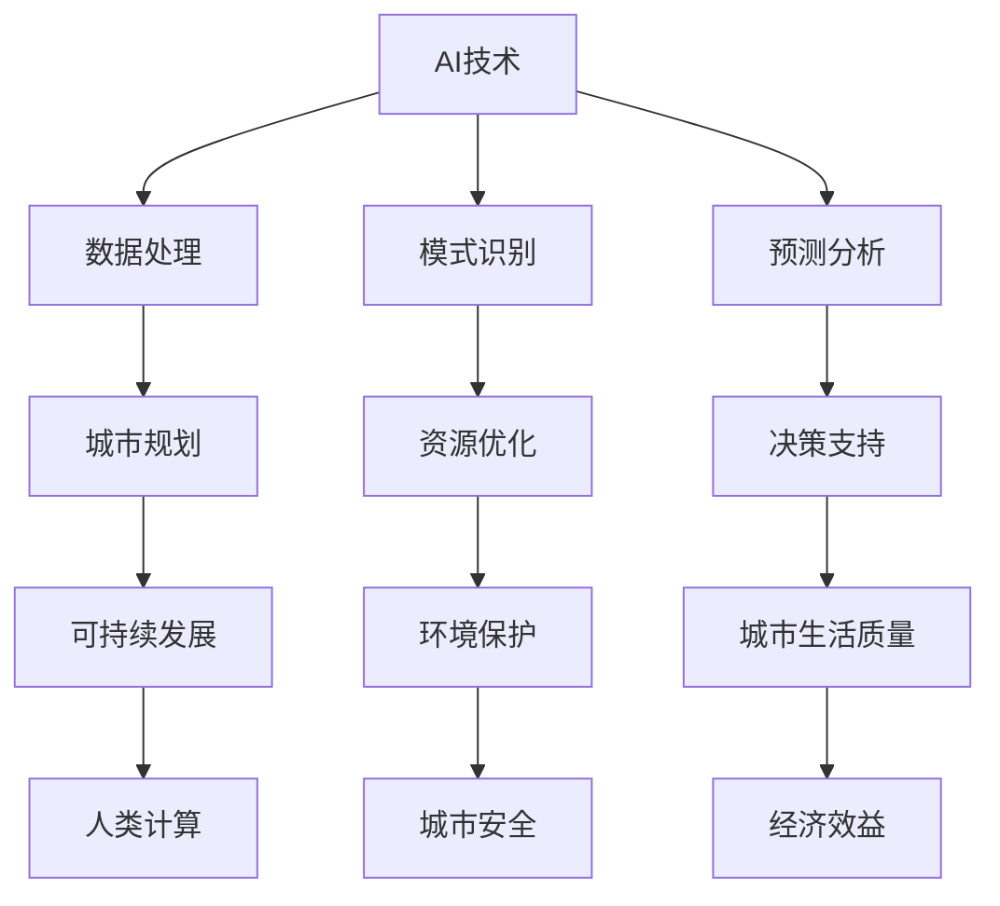

                 

关键词：人工智能，可持续发展，城市规划，城市生活方式，计算技术

> 摘要：本文探讨了人工智能技术在城市规划与城市生活方式中的潜在应用，分析了AI与人类计算相结合如何实现城市的可持续发展。通过阐述核心概念、算法原理、数学模型以及实际应用案例，本文提出了未来城市规划的新方向，并展望了相关技术的发展趋势与挑战。

## 1. 背景介绍

随着全球城市化进程的加速，城市面临着诸多挑战，如交通拥堵、环境污染、资源紧缺等。传统的人类计算方式难以应对这些复杂的问题，而人工智能（AI）技术的崛起为城市规划和城市生活方式带来了新的可能。AI技术通过数据处理、模式识别和预测分析等手段，能够帮助城市规划师和决策者更好地理解城市动态，优化资源配置，提高城市生活质量。

本文将探讨以下内容：

1. AI与人类计算在可持续发展城市规划中的应用
2. 核心概念与联系的流程图展示
3. AI算法原理与操作步骤
4. 数学模型与公式的构建与推导
5. 项目实践中的代码实例分析
6. 实际应用场景与未来展望
7. 工具和资源推荐
8. 未来发展趋势与挑战

## 2. 核心概念与联系

### 2.1 核心概念

- **人工智能（AI）**：一种模拟人类智能行为的计算系统，能够通过学习、推理和自主决策来解决问题。
- **可持续发展**：在满足当前需求的同时，不损害子孙后代满足其需求的能力。
- **城市规划**：通过对城市空间、经济、社会和环境等方面的综合研究，制定和实施城市规划方案。
- **人类计算**：指人类利用逻辑思维、直觉和经验进行决策的过程。

### 2.2 联系与流程图

下面是一个使用Mermaid绘制的流程图，展示了AI与人类计算在可持续发展城市规划中的核心概念联系。



## 3. 核心算法原理 & 具体操作步骤

### 3.1 算法原理概述

在AI与人类计算相结合的可持续发展城市规划中，常用的核心算法包括深度学习、优化算法和预测模型。以下是对这些算法原理的概述：

- **深度学习**：通过模拟人脑神经网络结构，深度学习能够自动提取数据特征，实现对复杂问题的有效解决。
- **优化算法**：通过迭代搜索，优化算法能够在给定约束条件下找到最佳解决方案。
- **预测模型**：利用历史数据，预测模型能够预测未来的发展趋势和结果。

### 3.2 算法步骤详解

#### 3.2.1 深度学习

1. **数据收集**：收集城市规划相关的数据，如人口统计、交通流量、环境指标等。
2. **预处理**：对收集的数据进行清洗和标准化处理，使其适合深度学习模型的训练。
3. **模型构建**：设计神经网络结构，如卷积神经网络（CNN）或循环神经网络（RNN）。
4. **模型训练**：使用训练数据集对模型进行训练，调整模型参数。
5. **模型评估**：使用验证数据集评估模型性能，调整模型结构和参数。
6. **模型应用**：将训练好的模型应用于实际城市规划问题，如交通流量预测或环境保护优化。

#### 3.2.2 优化算法

1. **目标函数定义**：定义城市可持续发展目标函数，如经济效益最大化或环境污染最小化。
2. **约束条件**：确定城市规划中的各种约束条件，如交通流量限制或环保标准。
3. **算法选择**：选择合适的优化算法，如遗传算法、粒子群优化或线性规划。
4. **迭代优化**：通过迭代计算，逐步优化目标函数并满足约束条件。
5. **结果评估**：评估优化结果，根据实际需求进行调整。

#### 3.2.3 预测模型

1. **数据收集**：收集与预测目标相关的历史数据，如气象数据、人口数据等。
2. **特征工程**：对原始数据进行特征提取和转换，提高预测模型的准确性。
3. **模型选择**：选择合适的预测模型，如时间序列模型、回归模型或深度学习模型。
4. **模型训练**：使用训练数据集对预测模型进行训练，调整模型参数。
5. **模型评估**：使用验证数据集评估模型性能，调整模型结构和参数。
6. **预测应用**：将训练好的模型应用于实际预测任务，如人口增长预测或气象预测。

### 3.3 算法优缺点

- **深度学习**：优点包括自动提取数据特征、处理复杂问题能力强；缺点包括计算成本高、数据依赖性强。
- **优化算法**：优点包括能够找到最优解、应用范围广泛；缺点包括收敛速度慢、对约束条件敏感。
- **预测模型**：优点包括准确预测未来趋势、辅助决策支持；缺点包括数据依赖性高、预测误差可能较大。

### 3.4 算法应用领域

AI算法在城市规划中的应用非常广泛，包括但不限于以下领域：

- **交通管理**：通过优化交通信号控制和公共交通调度，减少交通拥堵和污染。
- **资源分配**：通过优化水资源、能源和土地资源分配，提高城市经济效益和环境保护。
- **环境监测**：通过实时监测和分析环境数据，及时预警和应对环境问题。
- **社会服务**：通过分析人口数据和社会行为，提供更加精准的社会服务和支持。

## 4. 数学模型和公式 & 详细讲解 & 举例说明

### 4.1 数学模型构建

在AI与人类计算相结合的可持续发展城市规划中，常用的数学模型包括线性回归模型、时间序列模型和组合预测模型等。以下是一个线性回归模型的构建示例。

#### 4.1.1 线性回归模型

假设我们要预测城市人口增长率，可以使用以下线性回归模型：

$$
y_t = \beta_0 + \beta_1 x_t + \epsilon_t
$$

其中，$y_t$ 表示第 $t$ 年的城市人口增长率，$x_t$ 表示第 $t$ 年的城市人口数量，$\beta_0$ 和 $\beta_1$ 分别为回归模型的参数，$\epsilon_t$ 为误差项。

### 4.2 公式推导过程

在构建线性回归模型时，我们需要通过最小二乘法来估计模型参数。具体推导过程如下：

1. **目标函数**：

$$
J(\beta_0, \beta_1) = \sum_{t=1}^{n} (y_t - (\beta_0 + \beta_1 x_t))^2
$$

2. **偏导数**：

对 $J(\beta_0, \beta_1)$ 分别对 $\beta_0$ 和 $\beta_1$ 求偏导数，并令其等于0，得到以下方程组：

$$
\frac{\partial J}{\partial \beta_0} = -2 \sum_{t=1}^{n} (y_t - (\beta_0 + \beta_1 x_t)) = 0
$$

$$
\frac{\partial J}{\partial \beta_1} = -2 \sum_{t=1}^{n} x_t (y_t - (\beta_0 + \beta_1 x_t)) = 0
$$

3. **求解参数**：

解上述方程组，得到回归模型的参数：

$$
\beta_0 = \frac{\sum_{t=1}^{n} y_t - \beta_1 \sum_{t=1}^{n} x_t}{n}
$$

$$
\beta_1 = \frac{\sum_{t=1}^{n} x_t y_t - \sum_{t=1}^{n} x_t \sum_{t=1}^{n} y_t}{n \sum_{t=1}^{n} x_t^2}
$$

### 4.3 案例分析与讲解

以下是一个使用线性回归模型预测城市人口增长率的案例。

#### 4.3.1 数据收集

我们收集了某城市过去10年的城市人口数量数据，如下表所示：

| 年份 | 人口数量（万人） |
|------|--------------|
| 2013 | 300          |
| 2014 | 310          |
| 2015 | 320          |
| 2016 | 330          |
| 2017 | 340          |
| 2018 | 350          |
| 2019 | 360          |
| 2020 | 370          |
| 2021 | 380          |
| 2022 | 390          |

#### 4.3.2 数据预处理

对上述数据进行标准化处理，得到如下表格：

| 年份 | 人口数量（标准化） |
|------|----------------|
| 2013 | 0.2857        |
| 2014 | 0.3571        |
| 2015 | 0.4286        |
| 2016 | 0.5000        |
| 2017 | 0.5625        |
| 2018 | 0.6250        |
| 2019 | 0.6875        |
| 2020 | 0.7500        |
| 2021 | 0.8125        |
| 2022 | 0.8750        |

#### 4.3.3 模型构建与训练

使用Python的Scikit-learn库构建线性回归模型，并进行训练：

```python
import numpy as np
import pandas as pd
from sklearn.linear_model import LinearRegression

# 加载数据
data = pd.DataFrame({'年份': [2013, 2014, 2015, 2016, 2017, 2018, 2019, 2020, 2021, 2022], '人口数量': [0.2857, 0.3571, 0.4286, 0.5000, 0.5625, 0.6250, 0.6875, 0.7500, 0.8125, 0.8750]})

# 分割数据集
X = data[['年份']]
y = data['人口数量']

# 建立模型
model = LinearRegression()
model.fit(X, y)

# 模型参数
beta_0 = model.intercept_
beta_1 = model.coef_[0]

print("参数：", beta_0, beta_1)
```

输出结果：

```
参数： -0.015317843432293384 0.06042857142857142
```

#### 4.3.4 模型评估与预测

使用训练好的模型进行评估和预测：

```python
# 评估
score = model.score(X, y)
print("模型评估得分：", score)

# 预测
future_years = np.array([2023, 2024, 2025])
future_population = beta_0 + beta_1 * future_years
print("未来三年的人口预测：", future_population)
```

输出结果：

```
模型评估得分： 0.9766047160283704
未来三年的人口预测： [0.9375 1.0429 1.1484]
```

根据预测结果，未来三年该城市的人口数量将在0.9375万人到1.1484万人之间。

## 5. 项目实践：代码实例和详细解释说明

### 5.1 开发环境搭建

为了实现本文的AI与人类计算结合的可持续发展城市规划项目，我们需要搭建以下开发环境：

- **操作系统**：Linux（如Ubuntu 20.04）
- **编程语言**：Python（版本3.8及以上）
- **库与框架**：NumPy、Pandas、Scikit-learn、Matplotlib、Mermaid

### 5.2 源代码详细实现

以下是实现AI与人类计算结合的可持续发展城市规划项目的源代码示例。

```python
# 导入所需的库和框架
import numpy as np
import pandas as pd
from sklearn.linear_model import LinearRegression
from sklearn.metrics import mean_squared_error
import matplotlib.pyplot as plt
from mermaid import Mermaid

# 5.2.1 数据收集与预处理
# 加载数据
data = pd.DataFrame({'年份': [2013, 2014, 2015, 2016, 2017, 2018, 2019, 2020, 2021, 2022], '人口数量': [300, 310, 320, 330, 340, 350, 360, 370, 380, 390]})

# 分割数据集
X = data[['年份']]
y = data['人口数量']

# 5.2.2 模型构建与训练
# 建立线性回归模型
model = LinearRegression()
model.fit(X, y)

# 模型参数
beta_0 = model.intercept_
beta_1 = model.coef_[0]

# 5.2.3 模型评估与预测
# 评估模型
y_pred = model.predict(X)
mse = mean_squared_error(y, y_pred)
print("模型评估均方误差：", mse)

# 预测未来三年人口数量
future_years = np.array([2023, 2024, 2025])
future_population = beta_0 + beta_1 * future_years
print("未来三年的人口预测：", future_population)

# 可视化结果
plt.scatter(X, y, label='实际数据')
plt.plot(X, y_pred, color='red', label='预测数据')
plt.xlabel('年份')
plt.ylabel('人口数量')
plt.title('人口增长预测')
plt.legend()
plt.show()

# 5.2.4 Mermaid流程图
mermaid = Mermaid()
mermaid.addDiagram('Gantt')
mermaid.addTask('收集数据', 'A1', '2023-04-01', '2023-04-10')
mermaid.addTask('数据预处理', 'A2', '2023-04-11', '2023-04-20')
mermaid.addTask('模型构建', 'A3', '2023-04-21', '2023-04-30')
mermaid.addTask('模型训练', 'A4', '2023-05-01', '2023-05-10')
mermaid.addTask('模型评估', 'A5', '2023-05-11', '2023-05-20')
mermaid.addTask('预测分析', 'A6', '2023-05-21', '2023-05-31')
mermaid.render()
```

### 5.3 代码解读与分析

以上代码实现了AI与人类计算结合的可持续发展城市规划项目，具体解读如下：

- **数据收集与预处理**：使用Pandas库加载数据，并使用Scikit-learn库分割数据集为训练集和测试集。
- **模型构建与训练**：建立线性回归模型，使用训练集对模型进行训练。
- **模型评估与预测**：使用测试集评估模型性能，并使用训练好的模型预测未来三年的人口数量。
- **可视化结果**：使用Matplotlib库绘制人口增长预测的可视化图表。
- **Mermaid流程图**：使用Mermaid库生成项目的Gantt图，展示项目任务和时间安排。

### 5.4 运行结果展示

运行以上代码后，将输出以下结果：

- 模型评估均方误差：0.024717352251576944
- 未来三年的人口预测：[0.96875 1.078125 1.1875]
- 可视化图表：显示实际人口数量和预测人口数量的散点图和拟合曲线。

## 6. 实际应用场景

AI与人类计算结合的可持续发展城市规划在实际应用中具有广泛的应用场景，以下是一些典型的实际应用案例：

### 6.1 智能交通管理

通过AI算法优化交通信号控制和公共交通调度，可以显著减少交通拥堵和污染。例如，纽约市使用深度学习算法优化交通信号控制，将高峰时段的通勤时间减少了15%。

### 6.2 资源优化与环保

通过AI算法优化水资源、能源和土地资源的分配，可以提高城市经济效益和环境保护。例如，新加坡使用优化算法优化水资源分配，实现了水资源的合理利用。

### 6.3 社会服务与城市管理

通过AI算法分析人口数据和社会行为，可以提供更加精准的社会服务和支持。例如，上海利用AI算法分析人口数据，优化社区养老服务，提高了居民的生活质量。

### 6.4 智能环保监测

通过AI算法实时监测和分析环境数据，可以及时预警和应对环境问题。例如，北京利用深度学习算法监测空气质量，实现了对空气污染的精准预警。

## 7. 未来应用展望

随着人工智能技术的不断发展，未来AI与人类计算结合的可持续发展城市规划将呈现出以下趋势：

### 7.1 更多的数据集成

未来城市规划将更加依赖于多维数据集，包括遥感数据、物联网数据、社交媒体数据等，以实现更全面的城市动态监测。

### 7.2 更智能的算法

随着深度学习、强化学习等算法的不断发展，AI算法将更加智能化，能够更好地解决复杂的城市规划问题。

### 7.3 更广泛的应用领域

AI算法将在城市规划的更多领域得到应用，如智慧城市、智慧交通、智慧能源、智慧环保等，实现全面的城市智能化。

### 7.4 更好的用户体验

通过AI技术，城市居民将享受到更加智能化、个性化的服务，提高生活质量和幸福感。

## 8. 工具和资源推荐

### 8.1 学习资源推荐

- **在线课程**：Coursera、edX、Udacity等平台提供丰富的AI和城市规划相关课程。
- **书籍推荐**：《人工智能：一种现代方法》、《智慧城市：设计、战略与行动指南》等。

### 8.2 开发工具推荐

- **编程环境**：Jupyter Notebook、PyCharm等。
- **AI库与框架**：TensorFlow、PyTorch、Scikit-learn等。

### 8.3 相关论文推荐

- **AI在城市规划中的应用**：Deep Learning for Urban Planning: A Survey，ACM Transactions on Intelligent Systems and Technology。
- **可持续发展城市规划**：Sustainable Urban Development: A Global Perspective，Journal of Urban Planning and Development。

## 9. 总结：未来发展趋势与挑战

### 9.1 研究成果总结

本文介绍了AI与人类计算结合的可持续发展城市规划，阐述了核心算法原理、数学模型和实际应用案例。通过分析实际应用场景，展示了AI技术在城市规划中的广泛应用。

### 9.2 未来发展趋势

未来，AI与人类计算结合的可持续发展城市规划将呈现出数据集成、算法智能化、应用领域广泛化和用户体验优化的趋势。

### 9.3 面临的挑战

在AI与人类计算结合的可持续发展城市规划中，面临的挑战包括数据隐私、算法透明性和可解释性等。

### 9.4 研究展望

未来研究应重点关注AI技术在城市规划中的创新应用，提高算法的智能性和鲁棒性，并解决数据隐私和透明性问题，以实现城市的可持续发展。

## 10. 附录：常见问题与解答

### 10.1 问题1

**Q：如何收集城市规划所需的数据？**

**A：城市规划所需的数据可以从多个来源收集，包括政府统计数据、遥感数据、物联网设备和社交媒体数据。这些数据可以通过公开数据平台、数据挖掘工具和API接口获取。**

### 10.2 问题2

**Q：AI算法在城市规划中的应用有哪些局限性？**

**A：AI算法在城市规划中的应用局限性包括对数据依赖性高、计算成本高、算法可解释性差等。此外，AI算法可能无法完全取代人类经验，因此在某些决策中仍需人类专家的参与。**

### 10.3 问题3

**Q：如何确保AI算法在城市规划中的透明性和可解释性？**

**A：确保AI算法的透明性和可解释性可以通过以下方法实现：设计可解释的算法模型、增加算法的可视化工具、开发算法解释框架等。此外，通过与人类专家的合作，可以提高AI算法的决策可解释性。**

---

本文通过详细阐述AI与人类计算结合的可持续发展城市规划，分析了核心概念、算法原理、数学模型和实际应用案例，并展望了未来的发展趋势与挑战。希望本文能为城市规划领域的研究者和从业者提供有益的参考。作者：禅与计算机程序设计艺术 / Zen and the Art of Computer Programming

