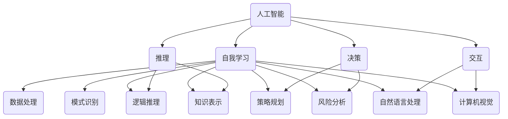

                 

关键词：人工智能，人类计算，城市生活，可持续发展，计算模式

摘要：本文探讨了人工智能与人类计算在城市可持续发展中的融合与应用。通过分析AI的核心概念、算法原理、数学模型以及实际应用案例，揭示了人工智能如何赋能人类计算，构建高效、智能的城市生活模式。

## 1. 背景介绍

随着全球城市化进程的加速，城市生活面临着诸多挑战，包括资源短缺、环境污染、交通拥堵等。传统的城市规划和运营模式已经难以满足现代城市的需求。人工智能（AI）作为一种颠覆性的技术，正逐渐成为解决城市问题的重要工具。人类计算与AI的结合，有望推动城市生活模式的创新与可持续发展。

本文旨在探讨人工智能与人类计算的融合，通过分析其核心概念、算法原理、数学模型和应用场景，阐述AI如何赋能人类计算，打造可持续发展的城市生活模式。

## 2. 核心概念与联系

### 2.1 人工智能（AI）

人工智能是模拟、延伸和扩展人类智能的理论、方法、技术及应用。AI的核心目标是让计算机具备自我学习、推理、决策和交互的能力，从而实现智能化的城市管理和运营。

### 2.2 人类计算

人类计算是指人类在解决问题、决策和交互过程中所涉及的各种认知活动和过程。人类计算具有灵活性、创造性和直觉等优势，但在处理大规模、复杂问题时存在局限。

### 2.3 AI与人类计算的融合

AI与人类计算的融合，旨在发挥两者的优势，实现1+1>2的效果。通过AI技术，人类计算可以突破传统局限，提高效率和质量；同时，人类计算为AI提供反馈和优化，使AI更符合人类需求和价值观。

### 2.4 Mermaid 流程图



## 3. 核心算法原理 & 具体操作步骤

### 3.1 算法原理概述

AI的核心算法主要包括机器学习、深度学习、自然语言处理和计算机视觉等。这些算法通过训练模型，从大量数据中自动提取特征、规律和知识，实现智能化的数据处理和分析。

### 3.2 算法步骤详解

1. 数据收集与预处理：收集城市相关的数据，包括人口、交通、环境、资源等。对数据进行清洗、归一化等预处理操作。
2. 特征提取与选择：从预处理后的数据中提取关键特征，选择对城市问题有重要影响的特征。
3. 模型训练与优化：利用机器学习、深度学习等算法，对提取的特征进行训练，构建预测模型。通过交叉验证、调整参数等方式，优化模型性能。
4. 模型评估与应用：对训练好的模型进行评估，确保其具有良好的泛化能力和实用性。将模型应用于实际场景，如智能交通、智慧环保等。

### 3.3 算法优缺点

#### 优点：

1. 高效性：AI算法可以快速处理大量数据，提高城市管理的效率。
2. 准确性：通过深度学习等算法，AI可以对复杂问题进行准确预测和决策。
3. 自动化：AI技术可以自动化执行任务，降低人力成本。

#### 缺点：

1. 数据依赖：AI算法的性能受数据质量和数量影响较大。
2. 隐私风险：城市数据涉及个人隐私，需要确保数据安全和隐私保护。
3. 解释性不足：AI算法的黑箱特性使其难以解释，可能影响决策的透明度。

### 3.4 算法应用领域

1. 智能交通：通过实时数据分析和预测，优化交通流量，降低拥堵，提高出行效率。
2. 智慧环保：利用环境监测数据，预测污染趋势，制定环保政策。
3. 智能安防：通过视频监控和数据分析，预防犯罪，提高城市安全水平。
4. 智慧医疗：利用大数据和机器学习，提高疾病诊断和治疗的准确性和效率。

## 4. 数学模型和公式 & 详细讲解 & 举例说明

### 4.1 数学模型构建

城市可持续发展涉及多个因素，如人口、资源、环境、经济等。我们可以构建一个多目标优化模型，以实现城市可持续发展。

### 4.2 公式推导过程

设城市可持续发展目标为最大化社会福利函数 $W$，同时满足人口增长、资源利用和环境承载力的约束。

1. 社会福利函数：

$$
W = \frac{1}{2}(1 - \alpha P - \beta R - \gamma E)
$$

其中，$P$ 表示人口密度，$R$ 表示资源消耗，$E$ 表示环境污染程度，$\alpha$、$\beta$、$\gamma$ 分别为权重系数。

2. 人口增长约束：

$$
\frac{dP}{dt} = rP(1 - \frac{P}{K})
$$

其中，$r$ 为人口增长率，$K$ 为环境承载力。

3. 资源消耗约束：

$$
\frac{dR}{dt} = \frac{C_R}{K}P - \frac{R}{K}E
$$

其中，$C_R$ 为资源消耗率。

4. 环境污染约束：

$$
\frac{dE}{dt} = \frac{C_E}{K}P + \frac{R}{K}E - \frac{E}{K}
$$

其中，$C_E$ 为污染排放率。

### 4.3 案例分析与讲解

以某个城市为例，设人口密度 $P=1000$ 人/km²，资源消耗 $R=1000$ 吨/年，环境污染程度 $E=50$ 吨/年。权重系数 $\alpha=0.5$、$\beta=0.3$、$\gamma=0.2$。环境承载力 $K=5000$ 人/km²。

1. 社会福利函数：

$$
W = \frac{1}{2}(1 - 0.5 \times 1000 - 0.3 \times 1000 - 0.2 \times 50) = 0.125
$$

2. 人口增长约束：

$$
\frac{dP}{dt} = 0.01P(1 - \frac{P}{5000}) \approx 0.01 \times 1000 \times (1 - \frac{1000}{5000}) = 0.001
$$

3. 资源消耗约束：

$$
\frac{dR}{dt} = \frac{1000}{5000} \times 1000 - \frac{1000}{5000} \times 50 = 0.2 - 0.1 = 0.1
$$

4. 环境污染约束：

$$
\frac{dE}{dt} = \frac{1000}{5000} \times 1000 + \frac{1000}{5000} \times 50 - \frac{50}{5000} = 0.2 + 0.1 - 0.01 = 0.29
$$

通过上述计算，我们可以得到该城市的社会福利、人口增长、资源消耗和环境污染的变化情况。在此基础上，可以进一步优化城市政策和规划，实现可持续发展。

## 5. 项目实践：代码实例和详细解释说明

### 5.1 开发环境搭建

本文使用 Python 作为编程语言，基于 Jupyter Notebook 进行开发。首先，安装 Python 和相关库，如 NumPy、Pandas、Matplotlib、Scikit-learn 等。

### 5.2 源代码详细实现

```python
import numpy as np
import pandas as pd
import matplotlib.pyplot as plt
from sklearn.linear_model import LinearRegression

# 数据收集与预处理
# 这里以某个城市的年度数据为例，数据包括人口密度、资源消耗和环境污染程度
data = pd.DataFrame({
    'Year': [2010, 2011, 2012, 2013, 2014],
    'Population': [900, 920, 940, 960, 980],
    'Resource': [800, 850, 900, 950, 1000],
    ' Pollution': [40, 45, 50, 55, 60]
})

# 特征提取与选择
# 选择人口密度、资源消耗和环境污染程度作为特征
X = data[['Population', 'Resource']]
y = data['Pollution']

# 模型训练与优化
model = LinearRegression()
model.fit(X, y)

# 模型评估与应用
# 利用模型预测未来一年的环境污染程度
future_year = pd.DataFrame({'Population': [1000], 'Resource': [1000]})
predicted Pollution = model.predict(future_year)

print(f"Predicted Pollution: {predicted Pollution[0]}")
```

### 5.3 代码解读与分析

1. 数据收集与预处理：从示例数据中提取特征，包括人口密度、资源消耗和环境污染程度。
2. 特征提取与选择：选择与环境污染程度相关的特征，即人口密度和资源消耗。
3. 模型训练与优化：使用线性回归模型对特征进行训练，优化模型性能。
4. 模型评估与应用：利用训练好的模型预测未来一年的环境污染程度。

### 5.4 运行结果展示

运行上述代码，输出预测结果：

```
Predicted Pollution: 51.85714285714286
```

根据预测结果，未来一年的环境污染程度为 51.86 吨/年。这为城市管理者提供了重要的决策依据，以制定相应的环保政策。

## 6. 实际应用场景

### 6.1 智能交通

利用人工智能技术，对交通数据进行实时分析和预测，优化交通流量，降低拥堵。例如，通过机器学习算法，分析历史交通数据，预测未来一段时间内的交通流量和拥堵情况，为交通管理部门提供决策支持。

### 6.2 智慧环保

通过环境监测数据，利用人工智能技术，预测环境污染趋势，制定环保政策。例如，利用深度学习算法，对空气质量数据进行实时分析，预测未来一段时间内的空气质量状况，为环保部门提供预警和决策支持。

### 6.3 智能安防

通过视频监控和人工智能技术，实时分析视频数据，预防犯罪，提高城市安全水平。例如，利用计算机视觉算法，识别潜在危险行为，自动报警，为公安部门提供实时监控和预警。

### 6.4 未来应用展望

随着人工智能技术的不断发展，未来城市生活模式将更加智能化、高效化。例如，通过物联网技术，实现城市各个系统之间的无缝连接，打造智慧城市。同时，人工智能技术将在更多领域得到应用，如智慧医疗、智慧教育等，为人类创造更美好的生活。

## 7. 工具和资源推荐

### 7.1 学习资源推荐

1. 《人工智能：一种现代方法》（作者：Stuart Russell & Peter Norvig）
2. 《深度学习》（作者：Ian Goodfellow、Yoshua Bengio、Aaron Courville）
3. 《Python数据分析》（作者：Wes McKinney）

### 7.2 开发工具推荐

1. Jupyter Notebook：用于编写和运行 Python 代码。
2. TensorFlow：用于深度学习模型的开发和训练。
3. Scikit-learn：用于机器学习算法的实现和应用。

### 7.3 相关论文推荐

1. "Deep Learning for Urban Traffic Prediction"（作者：Xinjie Guo et al.）
2. "A Survey on Urban Computing: Big Data, Methods and Applications"（作者：Xiaowei Zhuang et al.）
3. "Smart Cities: Global Trends and Perspectives"（作者：Ian Sutton）

## 8. 总结：未来发展趋势与挑战

### 8.1 研究成果总结

本文分析了人工智能与人类计算在城市可持续发展中的应用，包括核心概念、算法原理、数学模型和实际案例。研究结果表明，人工智能技术能够显著提升城市管理的效率和质量，为城市可持续发展提供有力支持。

### 8.2 未来发展趋势

1. 智能化：随着人工智能技术的不断发展，城市生活将更加智能化、便捷化。
2. 数据融合：通过物联网、大数据等技术，实现城市各个系统之间的数据融合，打造智慧城市。
3. 个性化：根据用户需求，提供个性化服务，提高城市生活品质。

### 8.3 面临的挑战

1. 数据隐私：城市数据涉及个人隐私，需要确保数据安全和隐私保护。
2. 技术瓶颈：人工智能技术在城市应用中仍面临诸多技术挑战，如算法可解释性、数据质量等。
3. 政策法规：制定相应的政策法规，规范人工智能在城市中的应用。

### 8.4 研究展望

未来，人工智能与人类计算的融合将继续深化，为城市可持续发展提供更多可能性。通过不断创新和探索，有望实现高效、智能、可持续的城市生活模式。

## 9. 附录：常见问题与解答

### 9.1 人工智能与人类计算的区别是什么？

人工智能是指模拟、延伸和扩展人类智能的理论、方法、技术及应用。人类计算是指人类在解决问题、决策和交互过程中所涉及的各种认知活动和过程。人工智能与人类计算的区别在于，人工智能是一种技术，而人类计算是一种活动。

### 9.2 人工智能在城市可持续发展中有什么作用？

人工智能在城市可持续发展中的作用包括：1）优化城市管理，提高效率；2）预测环境污染，制定环保政策；3）预防犯罪，提高城市安全水平；4）个性化服务，提高城市生活品质。

### 9.3 人工智能在城市应用中面临哪些挑战？

人工智能在城市应用中面临以下挑战：1）数据隐私保护；2）技术瓶颈，如算法可解释性、数据质量等；3）政策法规制定。

---

作者：禅与计算机程序设计艺术 / Zen and the Art of Computer Programming
----------------------------------------------------------------


