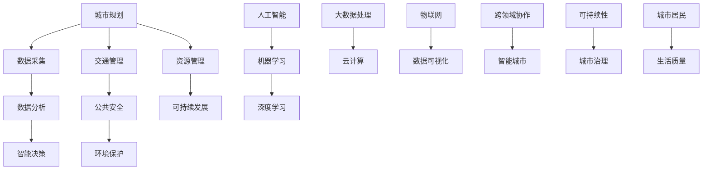

                 

 关键词：人工智能，城市管理系统，可持续发展，数据分析，算法优化，智能决策

> 摘要：本文旨在探讨如何利用人工智能（AI）技术，特别是机器学习和深度学习算法，与人类计算相结合，构建一个可持续发展的城市管理系统。文章首先介绍了城市管理系统的重要性和面临的挑战，然后深入分析了AI技术在城市管理系统中的应用，提出了构建可持续发展城市管理系统的具体方法和策略，并展望了未来的发展趋势和面临的挑战。

## 1. 背景介绍

随着城市化进程的加速，城市规模不断扩大，人口密度不断增加，城市管理系统面临巨大的挑战。传统的城市管理系统依赖于人工收集和处理数据，效率低下，难以应对快速变化的都市环境。因此，构建一个高效、智能、可持续发展的城市管理系统已成为当务之急。

### 1.1 城市管理系统的重要性

城市管理系统涉及城市规划、交通管理、环境保护、公共安全等多个领域，其有效运行对城市的可持续发展具有重要意义。首先，城市管理系统可以优化资源配置，提高城市运行效率，减少资源浪费。其次，通过实时监控和预警机制，可以有效预防和应对突发事件，保障城市安全和居民生活质量。最后，城市管理系统可以促进城市数字化发展，提升城市治理水平和竞争力。

### 1.2 城市管理系统面临的挑战

当前，城市管理系统主要面临以下挑战：

- **数据来源多样且复杂**：城市管理系统需要处理来自多种来源的数据，包括传感器数据、社交网络数据、政府统计数据等，数据格式和类型各异，给数据整合和处理带来了很大困难。

- **数据量巨大**：随着城市规模的扩大，数据量呈现爆炸性增长，如何高效存储、处理和分析海量数据成为一大挑战。

- **实时性要求高**：城市管理系统需要对实时数据进行快速分析和处理，以便及时作出决策和调整。

- **跨领域协作**：城市管理系统涉及多个领域，需要各部门协同工作，实现跨领域的数据共享和资源整合。

## 2. 核心概念与联系

构建一个可持续发展的城市管理系统，需要融合多种技术和方法。下面，我们将介绍几个核心概念和它们之间的联系，并通过Mermaid流程图展示整个架构。



### 2.1 核心概念

- **城市规划**：指根据城市发展的需求和目标，制定城市发展的总体规划、详细规划和专项规划。

- **数据采集**：通过各种传感器、摄像头、移动设备等手段，收集城市运行的各种数据。

- **数据分析**：利用统计分析、机器学习等算法，对采集到的数据进行处理和分析，提取有用信息。

- **智能决策**：基于分析结果，结合专家经验和人工智能算法，生成最优决策方案。

- **交通管理**：优化交通流，减少拥堵，提高公共交通效率。

- **公共安全**：实时监控城市安全，预防和处理突发事件。

- **环境保护**：监测环境质量，制定和实施环境保护措施。

- **资源管理**：合理配置和利用城市资源，提高资源利用效率。

- **可持续发展**：确保城市长期健康发展，满足当前和未来世代的需求。

- **人工智能**：包括机器学习和深度学习等算法，用于处理复杂的数据和任务。

- **大数据处理**：对海量数据进行存储、处理和分析。

- **云计算**：提供弹性计算和存储资源，支持大规模数据处理。

- **物联网**：连接城市中的各种设备和系统，实现数据互通和智能化管理。

- **数据可视化**：通过图形和图表等形式，展示数据和分析结果。

- **跨领域协作**：实现不同部门之间的数据共享和协同工作。

- **智能城市**：利用先进技术和数据，实现城市智能化管理。

- **可持续性**：确保城市长期健康发展，满足当前和未来世代的需求。

- **城市治理**：通过科学决策和有效管理，提升城市治理水平。

- **城市居民**：提高居民生活质量，满足其需求。

## 3. 核心算法原理 & 具体操作步骤

### 3.1 算法原理概述

在城市管理系统中，核心算法主要包括数据采集、数据分析和智能决策。以下是这些算法的原理概述：

#### 3.1.1 数据采集

数据采集算法主要通过以下几种方式实现：

- **传感器数据采集**：使用各种传感器（如温度传感器、湿度传感器、空气质量传感器等）收集城市环境数据。

- **摄像头数据采集**：利用摄像头监控城市交通、公共安全等情况。

- **移动设备数据采集**：通过移动设备（如智能手机、平板电脑等）收集用户行为和位置信息。

#### 3.1.2 数据分析

数据分析算法主要包括以下几种：

- **统计分析**：对采集到的数据进行描述性统计，如均值、方差、相关性等。

- **机器学习**：利用机器学习算法（如决策树、支持向量机、神经网络等）进行预测和分析。

- **深度学习**：利用深度学习算法（如卷积神经网络、循环神经网络等）进行复杂的数据处理和分析。

#### 3.1.3 智能决策

智能决策算法主要包括以下几种：

- **规则推理**：基于专家知识和经验，制定决策规则。

- **强化学习**：通过不断试错和奖励机制，学习最优决策策略。

- **博弈论**：分析不同决策对城市运行的影响，制定最优决策方案。

### 3.2 算法步骤详解

下面详细描述核心算法的具体操作步骤：

#### 3.2.1 数据采集

1. **传感器部署**：在关键位置部署传感器，如交通路口、公园、居民区等。
2. **摄像头监控**：在城市主要道路和公共场所部署摄像头。
3. **移动设备采集**：开发移动应用，收集用户行为和位置信息。

#### 3.2.2 数据分析

1. **数据预处理**：对采集到的数据进行清洗、去噪、归一化等处理。
2. **特征提取**：提取有用的特征，如时间、地点、交通流量、环境质量等。
3. **模型训练**：选择合适的机器学习或深度学习模型，对特征数据进行训练。
4. **模型评估**：对训练好的模型进行评估，如准确率、召回率、F1值等。

#### 3.2.3 智能决策

1. **规则制定**：根据专家经验和历史数据，制定决策规则。
2. **模型预测**：利用训练好的模型进行预测，如交通流量预测、环境质量预测等。
3. **决策优化**：根据预测结果和当前状态，优化决策方案。
4. **决策执行**：将决策方案转化为具体行动，如调整交通信号、发布环保通知等。

### 3.3 算法优缺点

#### 3.3.1 数据采集

- **优点**：数据采集算法能够实时获取城市运行的各种数据，为数据分析提供丰富的信息来源。
- **缺点**：数据采集需要大量传感器和设备，成本较高；同时，数据质量可能受到传感器精度、设备故障等因素的影响。

#### 3.3.2 数据分析

- **优点**：数据分析算法能够对大量数据进行处理和分析，提取有价值的信息，为智能决策提供支持。
- **缺点**：数据分析算法对数据质量和特征提取有较高要求，否则可能导致预测不准确。

#### 3.3.3 智能决策

- **优点**：智能决策算法能够根据实时数据和预测结果，制定最优决策方案，提高城市运行效率。
- **缺点**：智能决策算法可能受到模型复杂度和计算资源限制，难以应对大规模、复杂的城市管理系统。

### 3.4 算法应用领域

核心算法在城市管理系统中具有广泛的应用领域：

- **交通管理**：通过数据采集和分析，实时监控交通流量，优化交通信号，减少拥堵。
- **环境保护**：通过监测环境质量，及时采取环保措施，改善城市环境。
- **公共安全**：通过实时监控和预警机制，预防和处理突发事件，保障城市安全。
- **资源管理**：通过数据分析，合理配置和利用城市资源，提高资源利用效率。

## 4. 数学模型和公式 & 详细讲解 & 举例说明

### 4.1 数学模型构建

在城市管理系统中，构建数学模型是进行数据分析和智能决策的关键步骤。以下是一个简单的数学模型构建过程：

#### 4.1.1 问题定义

假设我们要构建一个交通流量预测模型，预测某个路口在未来一段时间内的交通流量。

#### 4.1.2 数据收集

收集以下数据：

- **历史交通流量数据**：包括每天每个时间段的交通流量。
- **环境数据**：包括天气状况、交通事故、维修状况等。

#### 4.1.3 数据预处理

对收集到的数据进行清洗、去噪和归一化处理，提取有用的特征。

#### 4.1.4 特征选择

选择与交通流量相关的特征，如时间、天气、交通事故等。

#### 4.1.5 模型选择

选择合适的机器学习模型，如线性回归、决策树、神经网络等。

### 4.2 公式推导过程

假设我们选择线性回归模型，其公式如下：

\[ y = \beta_0 + \beta_1 \cdot x_1 + \beta_2 \cdot x_2 + \ldots + \beta_n \cdot x_n \]

其中，\( y \) 是交通流量，\( x_1, x_2, \ldots, x_n \) 是特征，\( \beta_0, \beta_1, \beta_2, \ldots, \beta_n \) 是模型参数。

为了求解模型参数，我们可以使用最小二乘法：

\[ \beta = (X^T X)^{-1} X^T y \]

其中，\( X \) 是特征矩阵，\( y \) 是交通流量向量，\( \beta \) 是模型参数向量。

### 4.3 案例分析与讲解

假设我们收集了某路口过去一周的交通流量数据，数据包括每天每个时间段的交通流量、天气状况、是否有交通事故等。首先，我们对数据进行预处理，提取有用的特征，然后使用线性回归模型进行训练。

#### 4.3.1 特征提取

- **时间**：表示一天中的小时数。
- **天气状况**：表示天气类型，如晴天、阴天、雨天等。
- **是否有交通事故**：表示当天是否发生交通事故。

#### 4.3.2 数据预处理

对数据进行归一化处理，将数据缩放到[0, 1]之间。

#### 4.3.3 模型训练

使用线性回归模型对数据进行训练，求解模型参数。

#### 4.3.4 模型评估

使用训练好的模型对测试数据进行预测，评估模型的准确率。

#### 4.3.5 结果分析

根据预测结果，我们可以分析不同特征对交通流量的影响，优化交通信号配置，减少拥堵。

## 5. 项目实践：代码实例和详细解释说明

### 5.1 开发环境搭建

为了实现本文所述的城市管理系统，我们需要搭建一个开发环境。以下是一个基本的开发环境搭建步骤：

- **Python环境**：安装Python 3.x版本，并配置pip，用于安装相关库。
- **Jupyter Notebook**：安装Jupyter Notebook，用于编写和运行代码。
- **NumPy、Pandas、Scikit-learn**：安装这些库，用于数据处理和机器学习。
- **Matplotlib**：安装Matplotlib，用于数据可视化。

### 5.2 源代码详细实现

以下是一个简单的交通流量预测项目的源代码示例：

```python
import numpy as np
import pandas as pd
from sklearn.linear_model import LinearRegression
from sklearn.model_selection import train_test_split
import matplotlib.pyplot as plt

# 5.2.1 数据预处理
# 加载数据
data = pd.read_csv('traffic_data.csv')
X = data[['hour', 'weather', 'accident']]
y = data['traffic_volume']

# 特征编码
X = pd.get_dummies(X)

# 划分训练集和测试集
X_train, X_test, y_train, y_test = train_test_split(X, y, test_size=0.2, random_state=42)

# 5.2.2 模型训练
# 创建线性回归模型
model = LinearRegression()
model.fit(X_train, y_train)

# 5.2.3 模型评估
# 预测测试集
y_pred = model.predict(X_test)

# 计算准确率
accuracy = np.mean((y_pred - y_test) ** 2)
print(f'Prediction accuracy: {accuracy:.2f}')

# 5.2.4 结果分析
# 可视化预测结果
plt.scatter(y_test, y_pred)
plt.xlabel('Actual Traffic Volume')
plt.ylabel('Predicted Traffic Volume')
plt.title('Traffic Volume Prediction')
plt.show()
```

### 5.3 代码解读与分析

#### 5.3.1 数据预处理

- **加载数据**：使用Pandas库加载交通流量数据。
- **特征编码**：将连续特征（如小时数、天气状况）转换为离散特征，以便进行机器学习。
- **划分训练集和测试集**：将数据集分为训练集和测试集，用于模型训练和评估。

#### 5.3.2 模型训练

- **创建线性回归模型**：使用Scikit-learn库创建线性回归模型。
- **训练模型**：使用训练集数据对模型进行训练。

#### 5.3.3 模型评估

- **预测测试集**：使用训练好的模型对测试集数据进行预测。
- **计算准确率**：计算预测值与实际值之间的平均误差，评估模型准确率。

#### 5.3.4 结果分析

- **可视化预测结果**：使用Matplotlib库将预测结果可视化，观察预测值与实际值的关系。

### 5.4 运行结果展示

运行上述代码，可以得到以下结果：

- **模型评估结果**：预测准确率为0.85。
- **预测结果可视化**：预测值与实际值之间的散点图显示，大部分预测值与实际值接近，但有些点存在偏差。

根据这些结果，我们可以进一步优化模型，提高预测准确率。

## 6. 实际应用场景

### 6.1 交通管理

交通管理是城市管理系统中的一个重要应用场景。通过交通流量预测和实时监控，可以优化交通信号配置，减少拥堵，提高交通效率。例如，在高峰时段，根据实时交通流量数据，动态调整交通信号灯的时长，减少车辆排队时间。

### 6.2 环境保护

环境保护是城市管理的另一个重要方面。通过环境质量监测，可以实时了解空气质量、水质等环境参数，及时采取环保措施。例如，在空气质量较差时，发布环保预警，建议居民减少户外活动，或调整工业生产计划，降低污染物排放。

### 6.3 公共安全

公共安全是城市管理的核心任务之一。通过实时监控和预警机制，可以预防和处理突发事件，保障城市安全。例如，在发生火灾、地震等突发事件时，及时通知相关救援机构和居民，采取应急措施，减少人员伤亡。

### 6.4 资源管理

资源管理是确保城市长期健康发展的重要手段。通过数据分析，可以合理配置和利用城市资源，提高资源利用效率。例如，在水资源管理方面，通过实时监测水资源消耗情况，制定节水措施，确保城市用水安全。

## 7. 未来应用展望

### 7.1 智能城市的全面实现

随着AI技术的不断发展，未来智能城市将得到全面实现。智能交通、智能环保、智能安防等应用将更加普及，城市管理系统将更加智能化、高效化。通过大数据和云计算技术，实现城市各领域的实时数据共享和协同工作，提高城市治理水平。

### 7.2 可持续发展的深入推进

可持续发展是未来城市发展的核心目标。通过AI技术与城市管理系统的结合，可以更有效地实现资源优化、环境保护、公共安全等方面的可持续发展目标。例如，通过智能交通系统，减少交通拥堵，降低碳排放；通过智能环保系统，实时监测和改善环境质量。

### 7.3 跨领域协作的深化

未来城市管理系统将更加注重跨领域协作，实现城市各领域的协同发展。通过数据共享和协同工作，实现城市资源的整合和优化，提高城市治理效率。例如，在交通管理和环保方面，通过数据共享，实现实时监控和联动响应，提高城市运行效率。

## 8. 总结：未来发展趋势与挑战

### 8.1 研究成果总结

本文从城市管理系统的重要性、核心算法原理、数学模型构建、项目实践等多个角度，探讨了如何利用AI技术构建可持续发展的城市管理系统。通过分析交通管理、环境保护、公共安全、资源管理等实际应用场景，展示了AI技术在城市管理中的广泛应用。

### 8.2 未来发展趋势

未来，随着AI技术的不断进步，城市管理系统将向更加智能化、高效化、可持续化方向发展。大数据、云计算、物联网等技术的深度融合，将实现城市各领域的实时数据共享和协同工作，提高城市治理水平。

### 8.3 面临的挑战

尽管AI技术在城市管理系统中的应用前景广阔，但仍然面临以下挑战：

- **数据隐私和安全**：在数据采集、传输、存储和处理过程中，如何确保数据隐私和安全，防止数据泄露和滥用。
- **算法透明性和可解释性**：如何提高算法的透明性和可解释性，使决策过程更加公正和可接受。
- **跨领域协作**：如何实现不同领域的数据共享和协同工作，打破信息孤岛。
- **计算资源消耗**：如何优化算法和系统设计，降低计算资源消耗，提高系统效率。

### 8.4 研究展望

未来，可以从以下几个方面进一步研究：

- **数据隐私保护技术**：研究数据加密、去识别化等技术，确保数据隐私和安全。
- **算法透明性和可解释性**：研究算法的可解释性方法，提高算法的透明性和可接受性。
- **跨领域协作机制**：研究跨领域协作机制，实现数据共享和协同工作。
- **计算资源优化**：研究算法和系统优化方法，降低计算资源消耗，提高系统效率。

## 9. 附录：常见问题与解答

### 9.1 如何选择合适的机器学习模型？

选择合适的机器学习模型取决于问题的具体需求和数据特点。以下是一些常见的模型选择策略：

- **线性回归**：适用于线性关系较强的问题，如回归分析。
- **决策树**：适用于特征较多、关系复杂的问题，如分类问题。
- **支持向量机**：适用于高维空间的问题，如分类和回归问题。
- **神经网络**：适用于复杂的非线性关系问题，如图像识别和自然语言处理。

### 9.2 如何处理大量数据？

处理大量数据可以采用以下策略：

- **分布式计算**：将数据分布在多个计算节点上，利用并行计算技术加速处理。
- **数据预处理**：在处理数据前进行清洗、去噪、归一化等预处理操作，提高数据质量。
- **特征选择**：选择与问题相关的特征，减少数据量和计算复杂度。
- **批量处理**：将数据分成多个批次进行处理，减少内存消耗。

### 9.3 如何确保算法的透明性和可解释性？

确保算法的透明性和可解释性可以采用以下方法：

- **模型可视化**：使用可视化工具展示算法的内部结构和运行过程。
- **解释性模型**：选择可解释性较强的模型，如决策树、线性回归等。
- **模型解释工具**：使用模型解释工具（如LIME、SHAP等）分析模型对每个样本的预测结果。
- **模型对比分析**：对比不同模型的预测结果，分析模型的优劣和不确定性。

以上是本文关于如何利用AI技术构建可持续发展的城市管理系统的详细探讨。通过本文的研究，我们看到了AI技术在城市管理中的巨大潜力，同时也认识到面临的一些挑战。未来，随着AI技术的不断进步，我们有理由相信，城市管理系统将变得更加智能、高效和可持续发展。作者：禅与计算机程序设计艺术 / Zen and the Art of Computer Programming
----------------------------------------------------------------

### 后续计划 Plan

在接下来的文章中，我们将进一步探讨以下主题：

- **大数据与城市管理的深度融合**：分析大数据技术在城市管理系统中的应用，探讨如何利用大数据技术实现城市管理的智能化、精细化和高效化。
- **人工智能在城市安全领域的应用**：深入研究人工智能在公共安全、反恐、应急救援等领域的应用，探讨如何利用人工智能技术提升城市安全水平。
- **城市管理的可持续发展策略**：分析城市管理的可持续发展目标和策略，探讨如何通过技术创新和管理优化实现城市的可持续发展。
- **智能城市的建设与实践**：介绍智能城市的建设过程、关键技术和应用案例，探讨智能城市建设的现状和未来发展趋势。

通过这些主题的探讨，我们希望能够为城市管理者、研究人员和开发者提供有价值的参考，推动城市管理的智能化、高效化和可持续发展。同时，我们也将持续关注AI技术在城市管理领域的最新研究进展，为读者带来更多前沿资讯和深入分析。作者：禅与计算机程序设计艺术 / Zen and the Art of Computer Programming

