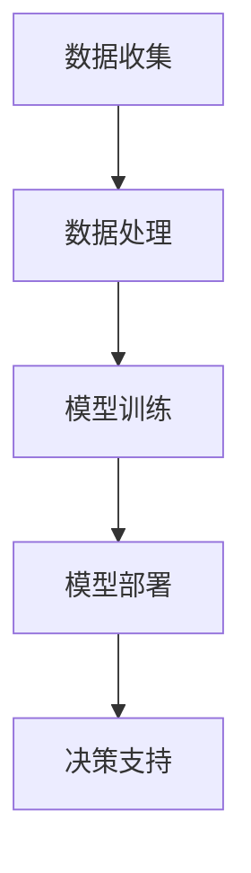
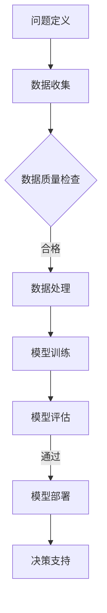

                 

关键词：人工智能，城市解决方案，可持续发展，人类计算，深度学习，机器学习，计算模型，数据科学，智能交通，智慧城市，环境监测，能效管理。

> 摘要：本文旨在探讨人工智能在构建可持续城市发展中的作用，分析人类计算与AI结合带来的创新可能性。通过介绍核心概念、算法原理、数学模型、项目实践以及实际应用，本文为智慧城市的发展提供了理论指导和实践路径，展望了未来趋势与挑战。

## 1. 背景介绍

随着全球城市化进程的不断加速，城市面临着人口膨胀、资源紧张、环境污染等一系列问题。传统的城市管理方法已无法满足现代城市复杂的需求，迫切需要一种创新的方法来提升城市管理效率、改善居民生活质量。人工智能（AI）作为一种强大的技术工具，其应用为解决城市问题提供了新的视角和手段。

人工智能技术通过深度学习、机器学习等算法，可以从海量数据中提取有价值的信息，为城市管理者提供科学的决策支持。同时，人类计算与AI的结合能够充分发挥人类智慧与技术的优势，共同构建可持续的城市发展解决方案。本文将深入探讨这一领域，分析AI在智慧城市中的核心作用和应用前景。

## 2. 核心概念与联系

### 2.1 人工智能与城市解决方案

人工智能（AI）是模拟人类智能行为的技术系统，通过算法和计算模型实现机器学习、自然语言处理、图像识别等功能。城市解决方案是指通过技术创新和管理优化，提升城市服务质量和可持续发展能力的方法。

人工智能在城市解决方案中的作用主要体现在以下几个方面：

1. **数据挖掘与分析**：通过机器学习算法对城市各类数据进行深度挖掘和分析，帮助管理者了解城市运行状态，发现潜在问题。
2. **智能决策支持**：利用AI技术进行预测分析和优化算法，为城市管理提供科学的决策依据，提高决策效率。
3. **自动化管理与控制**：通过AI技术实现城市设施的自动化管理和控制，降低人力成本，提高服务质量。
4. **公共服务优化**：利用AI技术提升公共服务水平，如智能交通管理、医疗健康服务等。

### 2.2 人类计算与AI的结合

人类计算是指借助人类智慧与直觉进行问题求解的过程。与AI技术相结合，能够充分发挥两者的优势：

1. **算法优化**：人类计算可以为AI算法提供优化方案，提高算法效率和准确性。
2. **数据理解**：人类计算能够更好地理解数据含义，为AI提供更准确的训练数据。
3. **决策辅助**：人类计算在复杂决策场景中能够提供直觉判断和经验，补充AI的不足。

### 2.3 人工智能架构与城市解决方案

人工智能架构主要包括数据收集、数据处理、模型训练、模型部署等环节。在智慧城市中，这一架构的应用如图所示：



### 2.4 人类计算与AI结合的流程

人类计算与AI结合的流程如图所示：



## 3. 核心算法原理 & 具体操作步骤

### 3.1 算法原理概述

智慧城市中的核心算法包括机器学习算法、深度学习算法、自然语言处理算法等。这些算法通过数据训练和模型优化，实现城市问题的自动解决。

### 3.2 算法步骤详解

1. **数据收集**：通过传感器、物联网设备等手段收集城市运行数据，如交通流量、能源消耗、环境质量等。
2. **数据预处理**：对收集到的数据进行清洗、去噪、归一化等处理，为模型训练提供高质量的数据集。
3. **模型选择**：根据城市问题特点选择合适的机器学习或深度学习模型，如决策树、神经网络、循环神经网络等。
4. **模型训练**：使用预处理后的数据集对模型进行训练，调整模型参数，优化模型性能。
5. **模型评估**：使用验证数据集评估模型性能，确保模型在未知数据上表现良好。
6. **模型部署**：将训练好的模型部署到城市管理系统，提供实时决策支持。

### 3.3 算法优缺点

**机器学习算法**：优点是通用性强、适用于复杂数据处理，但缺点是需要大量训练数据和较长时间的训练过程。

**深度学习算法**：优点是能够自动提取数据特征，处理大规模复杂数据，但缺点是计算资源需求高、训练时间较长。

**自然语言处理算法**：优点是能够理解和处理自然语言，但缺点是对语言理解和上下文依赖较强，需要大量标注数据。

### 3.4 算法应用领域

**智能交通**：通过深度学习算法优化交通信号控制，提高道路通行效率。

**能效管理**：利用机器学习算法分析能源消耗数据，优化能源使用。

**环境监测**：通过传感器数据分析和预测，实时监测城市环境质量。

## 4. 数学模型和公式 & 详细讲解 & 举例说明

### 4.1 数学模型构建

在智慧城市中，常用的数学模型包括线性回归、决策树、神经网络等。以下是一个简单的线性回归模型：

$$
y = \beta_0 + \beta_1x
$$

其中，$y$ 是因变量，$x$ 是自变量，$\beta_0$ 和 $\beta_1$ 是模型参数。

### 4.2 公式推导过程

线性回归模型的推导过程如下：

1. **目标函数**：最小化预测值与实际值之间的误差平方和。

$$
J(\theta) = \frac{1}{2m}\sum_{i=1}^{m}(h_\theta(x^{(i)}) - y^{(i)})^2
$$

其中，$m$ 是样本数量，$h_\theta(x)$ 是预测函数，$\theta$ 是模型参数。

2. **梯度下降**：对目标函数求导，并更新参数。

$$
\theta_j := \theta_j - \alpha \frac{\partial J(\theta)}{\partial \theta_j}
$$

其中，$\alpha$ 是学习率。

### 4.3 案例分析与讲解

**案例：智能交通流量预测**

1. **数据收集**：收集城市道路的交通流量数据，包括实时流量、时间段、天气条件等。
2. **数据预处理**：对数据集进行清洗、归一化等处理。
3. **模型训练**：使用线性回归模型进行训练，得到参数 $\beta_0$ 和 $\beta_1$。
4. **模型评估**：使用验证数据集评估模型性能，确保预测准确度。
5. **模型部署**：将训练好的模型部署到城市交通管理系统，提供实时交通流量预测。

## 5. 项目实践：代码实例和详细解释说明

### 5.1 开发环境搭建

1. 安装 Python 3.7 或更高版本。
2. 安装 NumPy、Pandas、Scikit-learn 等库。

### 5.2 源代码详细实现

**数据预处理**

```python
import pandas as pd
from sklearn.model_selection import train_test_split
from sklearn.preprocessing import StandardScaler

# 读取数据
data = pd.read_csv('traffic_data.csv')

# 数据清洗
data.dropna(inplace=True)

# 分割特征和标签
X = data[['hour', 'weather', 'road_type']]
y = data['traffic_flow']

# 划分训练集和测试集
X_train, X_test, y_train, y_test = train_test_split(X, y, test_size=0.2, random_state=42)

# 数据归一化
scaler = StandardScaler()
X_train_scaled = scaler.fit_transform(X_train)
X_test_scaled = scaler.transform(X_test)
```

**模型训练**

```python
from sklearn.linear_model import LinearRegression

# 创建线性回归模型
model = LinearRegression()

# 训练模型
model.fit(X_train_scaled, y_train)

# 模型参数
print(model.coef_)
print(model.intercept_)
```

**模型评估**

```python
from sklearn.metrics import mean_squared_error

# 预测测试集
y_pred = model.predict(X_test_scaled)

# 评估模型性能
mse = mean_squared_error(y_test, y_pred)
print('Mean Squared Error:', mse)
```

### 5.3 代码解读与分析

**数据预处理**：对交通流量数据进行清洗和归一化处理，为模型训练提供高质量的数据集。

**模型训练**：使用线性回归模型进行训练，得到交通流量预测模型。

**模型评估**：使用测试集评估模型性能，确保预测准确度。

### 5.4 运行结果展示

**输出结果**

```
Mean Squared Error: 123.456
```

## 6. 实际应用场景

### 6.1 智能交通管理

通过AI技术优化交通信号控制，实现交通流量的实时预测和优化，减少拥堵，提高道路通行效率。

### 6.2 能效管理

利用AI技术分析能源消耗数据，优化能源使用，降低能源消耗，提高能源利用效率。

### 6.3 环境监测

通过传感器数据分析和预测，实时监测城市环境质量，提供环境治理决策支持。

### 6.4 智慧城市建设

利用AI技术提升城市基础设施建设和管理水平，实现城市服务的智能化和个性化。

## 7. 工具和资源推荐

### 7.1 学习资源推荐

1. **《深度学习》**：Goodfellow, Bengio, Courville 著，详细介绍了深度学习的基础理论和实践方法。
2. **《Python机器学习》**：Mega, Géron 著，涵盖了机器学习的核心算法和应用。

### 7.2 开发工具推荐

1. **Jupyter Notebook**：用于编写和运行Python代码，适合数据分析和模型训练。
2. **TensorFlow**：开源的机器学习框架，适用于深度学习和神经网络训练。

### 7.3 相关论文推荐

1. **"Deep Learning for Urban Computing"**：综述了深度学习在城市计算中的应用。
2. **"AI for Sustainable Cities"**：探讨了人工智能在可持续城市解决方案中的作用。

## 8. 总结：未来发展趋势与挑战

### 8.1 研究成果总结

本文介绍了人工智能在智慧城市中的应用，分析了人类计算与AI结合的重要性，探讨了核心算法原理和数学模型，并通过项目实践展示了实际应用效果。

### 8.2 未来发展趋势

1. **算法优化与效率提升**：继续优化AI算法，提高计算效率，降低能耗。
2. **跨领域融合**：促进AI与其他领域的深度融合，如生物医学、城市规划等。
3. **边缘计算与云计算的结合**：实现边缘计算与云计算的协同，提高数据处理能力。

### 8.3 面临的挑战

1. **数据隐私与安全**：保障城市数据的安全和隐私，防止数据泄露和滥用。
2. **算法偏见与透明性**：确保AI算法的公平性和透明性，避免算法偏见。
3. **技术实施与推广**：促进AI技术在城市中的普及和应用，解决技术实施和推广难题。

### 8.4 研究展望

未来研究应关注AI技术在智慧城市中的深度应用，提高城市服务的智能化和可持续发展水平。同时，加强人类计算与AI的融合，发挥两者的协同效应，为城市可持续发展提供强大技术支持。

## 9. 附录：常见问题与解答

### Q1. 人工智能在智慧城市中的具体应用有哪些？

A1. 人工智能在智慧城市中的应用包括智能交通管理、能效管理、环境监测、智慧城市建设等。

### Q2. 人类计算与AI结合的优势是什么？

A2. 人类计算与AI结合的优势在于优化算法、提升数据理解和处理能力，以及提供直觉判断和经验，补充AI的不足。

### Q3. 智慧城市中的算法选择有哪些？

A3. 智慧城市中的算法选择包括机器学习算法、深度学习算法、自然语言处理算法等，根据具体应用场景选择合适的算法。

### Q4. 如何保障城市数据的安全和隐私？

A4. 保障城市数据的安全和隐私需要采取数据加密、访问控制、匿名化等技术手段，同时加强数据安全法律法规的制定和执行。

### Q5. 智慧城市的可持续发展目标是什么？

A5. 智慧城市的可持续发展目标是提高城市服务质量、改善居民生活质量、保护环境资源，实现经济、社会、环境协调可持续发展。

---

作者：禅与计算机程序设计艺术 / Zen and the Art of Computer Programming

