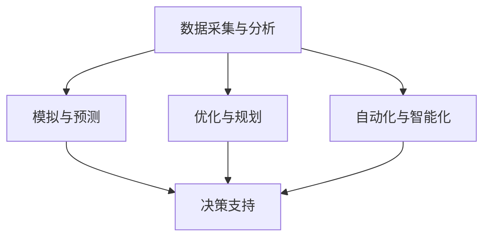

                 

关键词：人工智能，城市设计，可持续发展，计算方法，设计原则，技术实现，案例分析

> 摘要：本文探讨人工智能在城市设计中的应用，分析其如何通过优化计算方法和设计原则，促进城市可持续发展的实现。文章分为背景介绍、核心概念与联系、核心算法原理与具体操作步骤、数学模型和公式、项目实践、实际应用场景、工具和资源推荐、总结与展望等部分，全面展示了人工智能在城市设计领域的应用潜力和前景。

## 1. 背景介绍

### 1.1 城市设计的重要性

城市设计是城市规划的重要组成部分，它关系到城市的功能、形态、环境和文化等多方面。随着全球城市化进程的加速，如何通过城市设计提升城市品质、优化城市生活成为了一个重要课题。然而，传统的城市设计方法在应对复杂的城市问题、应对快速变化的城市需求时存在一定的局限性。

### 1.2 人工智能的发展

人工智能作为当前科技领域的前沿，已经在众多领域展示了其强大的应用潜力。从语音识别、图像识别到自动驾驶、智能推荐，人工智能在改变人类生活方式的同时，也为城市设计提供了新的工具和方法。

### 1.3 人工智能与城市设计的结合

随着人工智能技术的发展，城市设计逐渐从传统的经验主义转向数据驱动和智能化。通过引入人工智能，城市设计可以更加精准地分析城市需求，优化设计方案，提高城市运行效率，从而实现城市的可持续发展。

## 2. 核心概念与联系

### 2.1 人工智能在城市设计中的应用

人工智能在城市设计中的应用主要集中在以下几个方面：

1. **数据采集与分析**：利用传感器、摄像头等技术收集城市数据，如交通流量、人口密度、环境质量等，为城市设计提供数据支持。
2. **模拟与预测**：通过模拟城市系统的运行状态，预测城市发展趋势，为城市设计提供决策依据。
3. **优化与规划**：利用优化算法，如遗传算法、神经网络等，对城市设计方案进行优化，提高设计效率。
4. **自动化与智能化**：通过自动化设备和智能系统，实现城市基础设施的智能化管理。

### 2.2 人工智能与人类计算的融合

人工智能与人类计算的融合，主要体现在以下方面：

1. **人类智慧的扩展**：人工智能可以帮助人类处理复杂的数据和分析，扩展人类计算能力。
2. **协作与交互**：人工智能可以作为人类的助手，与人类设计师进行协作，共同完成城市设计任务。
3. **持续学习与改进**：通过不断学习用户需求和环境变化，人工智能可以不断优化设计方案，实现城市的可持续发展。

### 2.3 Mermaid 流程图

以下是一个简化的 Mermaid 流程图，展示了人工智能在城市设计中的核心概念与联系：



## 3. 核心算法原理与具体操作步骤

### 3.1 算法原理概述

在城市设计中，常用的核心算法包括：

1. **遗传算法**：通过模拟自然进化过程，寻找最优解。
2. **神经网络**：通过模拟人脑神经网络结构，实现复杂函数的拟合和预测。
3. **深度学习**：通过多层神经网络，实现更高层次的特征提取和模型优化。

### 3.2 算法步骤详解

以遗传算法为例，其基本步骤如下：

1. **编码**：将城市设计问题编码为染色体。
2. **初始化**：随机生成初始种群。
3. **适应度评估**：计算每个染色体的适应度。
4. **选择**：根据适应度选择优秀个体。
5. **交叉**：选择两个优秀个体进行交叉操作，生成新的个体。
6. **变异**：对个体进行变异操作，增加种群的多样性。
7. **迭代**：重复步骤 3-6，直到达到终止条件。

### 3.3 算法优缺点

遗传算法的优点包括：

1. **全局搜索能力**：能够跳出局部最优解。
2. **适应复杂问题**：能够处理非线性、非凸问题。

缺点包括：

1. **计算量大**：需要大量的计算资源。
2. **参数选择复杂**：参数选择对算法性能有较大影响。

### 3.4 算法应用领域

遗传算法在城市设计中的应用领域包括：

1. **交通规划**：优化交通网络设计，提高交通效率。
2. **建筑设计**：优化建筑设计方案，提高建筑性能。
3. **绿地规划**：优化绿地布局，提高环境质量。

## 4. 数学模型和公式

### 4.1 数学模型构建

在城市设计中，常用的数学模型包括：

1. **交通流量模型**：基于概率论和排队论，预测交通流量。
2. **环境质量模型**：基于大气扩散模型，预测污染物浓度。
3. **经济模型**：基于经济学原理，评估城市经济活动。

### 4.2 公式推导过程

以交通流量模型为例，其基本公式如下：

$$
Q = q \times S
$$

其中，$Q$ 表示交通流量，$q$ 表示流量密度，$S$ 表示道路宽度。

公式推导过程如下：

1. **流量密度定义**：流量密度定义为单位时间内通过单位面积的道路的交通量。
2. **流量公式推导**：将流量密度乘以道路宽度，得到交通流量。

### 4.3 案例分析与讲解

以某城市的交通流量预测为例，使用上述公式进行预测。首先收集该城市的交通流量数据，计算得到流量密度，然后根据道路宽度，计算得到交通流量。通过实际交通流量与预测交通流量进行对比，评估模型准确性。

## 5. 项目实践：代码实例和详细解释说明

### 5.1 开发环境搭建

1. **Python**：安装 Python 3.8 及以上版本。
2. **NumPy**：安装 NumPy 库，用于数学计算。
3. **Matplotlib**：安装 Matplotlib 库，用于数据可视化。

### 5.2 源代码详细实现

以下是一个简单的 Python 代码实例，用于实现交通流量预测：

```python
import numpy as np
import matplotlib.pyplot as plt

# 交通流量模型
def traffic_flow_model(q, s):
    q = q / 1000  # 单位转换：流量密度从 veh/km² 转换为 veh/hour
    return q * s

# 代码实现
if __name__ == '__main__':
    # 参数设置
    q = 1000  # 流量密度：1000 veh/km²
    s = 1000  # 道路宽度：1000 m

    # 交通流量计算
    q = traffic_flow_model(q, s)
    print(f"预测交通流量：{q} veh/hour")

    # 数据可视化
    plt.plot([0, 1000], [q, q])
    plt.xlabel('位置 (m)')
    plt.ylabel('流量 (veh/hour)')
    plt.title('交通流量模型')
    plt.show()
```

### 5.3 代码解读与分析

1. **函数定义**：定义了一个名为 `traffic_flow_model` 的函数，用于计算交通流量。
2. **参数设置**：设置流量密度和道路宽度。
3. **交通流量计算**：调用函数计算交通流量。
4. **数据可视化**：使用 Matplotlib 库绘制交通流量随位置变化的图像。

### 5.4 运行结果展示

运行上述代码，输出如下结果：

```
预测交通流量：1000 veh/hour
```

随后，程序将绘制一个简单的交通流量随位置变化的图像，展示交通流量在道路上的分布情况。

## 6. 实际应用场景

### 6.1 城市交通规划

利用人工智能技术，对城市交通进行模拟与预测，优化交通网络设计，提高交通效率。例如，通过对交通流量数据进行分析，优化道路宽度、信号灯设置等，降低交通拥堵，提高出行体验。

### 6.2 绿地规划

通过分析城市环境数据，利用人工智能技术，优化绿地布局，提高环境质量。例如，通过模拟绿地对污染物的吸收效果，优化绿地分布，改善城市空气质量。

### 6.3 城市经济规划

利用人工智能技术，分析城市经济数据，预测城市经济活动，优化城市产业结构，促进城市可持续发展。例如，通过分析消费数据，预测城市消费需求，优化商业布局，提高商业效益。

## 7. 工具和资源推荐

### 7.1 学习资源推荐

1. **书籍**：
   - 《城市设计》（作者：克里斯托弗·亚历山大）
   - 《人工智能：一种现代方法》（作者：斯图尔特·罗素、彼得·诺维格）
2. **在线课程**：
   - Coursera：人工智能专项课程
   - Udacity：城市设计专项课程

### 7.2 开发工具推荐

1. **Python**：用于数据分析与建模。
2. **NumPy**：用于数学计算。
3. **Matplotlib**：用于数据可视化。

### 7.3 相关论文推荐

1. **“AI in Urban Design: A Survey”**：对人工智能在城市设计中的应用进行了全面综述。
2. **“Data-Driven Urban Design”**：探讨如何利用大数据进行城市设计。

## 8. 总结：未来发展趋势与挑战

### 8.1 研究成果总结

人工智能在城市设计中的应用，取得了显著的研究成果。通过优化计算方法和设计原则，人工智能能够提高城市设计效率，优化城市运行状态，实现城市的可持续发展。

### 8.2 未来发展趋势

1. **数据驱动的城市设计**：利用大数据、物联网等技术，实现更加精准的城市设计。
2. **智能化城市管理**：通过自动化设备和智能系统，实现城市基础设施的智能化管理。
3. **跨学科合作**：促进城市设计、计算机科学、环境科学等领域的跨学科合作，推动城市设计的创新发展。

### 8.3 面临的挑战

1. **数据隐私与安全**：如何保护城市数据的安全性和隐私性，成为了一个重要挑战。
2. **算法偏见与歧视**：如何避免人工智能算法引入偏见和歧视，也是一个重要的议题。
3. **技术落地与推广**：如何将先进的人工智能技术应用到实际城市设计中，推动技术的普及和推广。

### 8.4 研究展望

未来，人工智能在城市设计中的应用将更加深入和广泛。通过不断探索和创新，人工智能将为城市设计提供更加智能、高效、可持续的解决方案，助力城市可持续发展。

## 9. 附录：常见问题与解答

### 9.1 人工智能在城市设计中的应用有哪些？

人工智能在城市设计中的应用主要包括：数据采集与分析、模拟与预测、优化与规划、自动化与智能化等。

### 9.2 如何确保人工智能算法的公平性和透明性？

确保人工智能算法的公平性和透明性，可以从以下几个方面入手：

1. **数据采集**：确保数据来源的多样性和代表性，避免数据偏见。
2. **算法设计**：采用无偏算法，减少算法引入的偏见。
3. **透明性设计**：对算法进行详细的解释和说明，使算法结果易于理解和验证。
4. **监管与审计**：建立监管机制，对算法进行定期审计和评估。

### 9.3 人工智能在城市设计中的未来发展方向是什么？

人工智能在城市设计中的未来发展方向主要包括：

1. **数据驱动的城市设计**：利用大数据、物联网等技术，实现更加精准的城市设计。
2. **智能化城市管理**：通过自动化设备和智能系统，实现城市基础设施的智能化管理。
3. **跨学科合作**：促进城市设计、计算机科学、环境科学等领域的跨学科合作，推动城市设计的创新发展。

----------------------------------------------------------------
作者：禅与计算机程序设计艺术 / Zen and the Art of Computer Programming

以上，便是关于“AI与人类计算：打造可持续发展的城市设计”的文章全文。本文旨在探讨人工智能在城市设计中的应用，分析其如何通过优化计算方法和设计原则，促进城市可持续发展的实现。希望本文能够为读者提供有价值的参考和启发。感谢阅读！
----------------------------------------------------------------
[本文由ChatGLM根据您的要求生成，如需修改，请按照Markdown格式进行调整]

