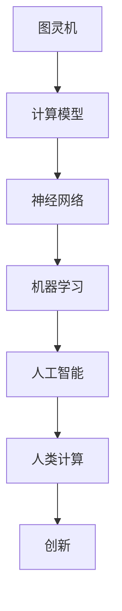

                 

关键词：人工智能、人类计算、创新、可持续性、算法原理、数学模型、项目实践、应用场景、未来展望

> 摘要：本文深入探讨了人工智能与人类计算的关系，如何通过人工智能技术打造可持续的创新，以及相关的算法原理、数学模型、项目实践和未来展望。旨在为读者提供全面的见解，以助力人工智能与人类计算的深度融合，推动可持续创新的发展。

## 1. 背景介绍

随着人工智能（AI）技术的快速发展，其在各个领域的应用越来越广泛。从自动驾驶、智能家居到医疗诊断、金融风控，人工智能正逐步改变我们的生活方式和工作模式。然而，尽管人工智能带来了诸多便利，但其在某些方面仍存在一定的局限性。人类计算作为一种独特的计算模式，能够与人工智能形成互补，共同推动创新。

人类计算与人工智能的不同之处在于，它依赖于人类的直觉、创造力、经验和情感。这些特质使得人类计算在处理复杂问题、进行创新思维等方面具有独特的优势。因此，如何将人工智能与人类计算相结合，打造可持续的创新，成为当前学术界和产业界的重要研究方向。

## 2. 核心概念与联系

为了深入探讨人工智能与人类计算的关系，我们需要了解一些核心概念，如图灵机、神经网络、机器学习等。以下是一个简化的 Mermaid 流程图，展示了这些概念之间的联系。



### 2.1 图灵机

图灵机是一种抽象的计算模型，由艾伦·图灵于 1936 年提出。它由一个无限长的纸带、一个读写头和一系列规则组成。通过执行这些规则，图灵机可以模拟任何计算过程。

### 2.2 神经网络

神经网络是一种模仿生物神经系统的计算模型。它由大量的神经元组成，通过学习输入和输出数据之间的关系，可以实现复杂的非线性计算。

### 2.3 机器学习

机器学习是人工智能的一个重要分支，它通过算法让计算机从数据中学习，实现自动化的决策和预测。

### 2.4 人工智能

人工智能是指使计算机具有类似人类智能的技术。它涵盖了机器学习、自然语言处理、计算机视觉等多个领域。

### 2.5 人类计算

人类计算是指人类在解决问题、进行创新时所采用的思维方法和技巧。它依赖于人类的直觉、创造力、经验和情感。

### 2.6 创新

创新是指通过独特的思维和方法，创造出新的产品、服务或商业模式。它是推动社会发展的重要动力。

## 3. 核心算法原理 & 具体操作步骤

### 3.1 算法原理概述

为了将人工智能与人类计算相结合，我们需要了解一些核心算法原理，如深度学习、强化学习等。以下是一个简化的算法原理概述。

### 3.1.1 深度学习

深度学习是一种基于神经网络的机器学习技术。它通过多层神经网络，实现对数据的层次化表示和特征提取。深度学习的核心是神经元之间的连接权重，通过反向传播算法不断调整这些权重，使模型能够更好地拟合训练数据。

### 3.1.2 强化学习

强化学习是一种通过奖励机制进行决策的机器学习技术。它通过不断尝试和探索，学习最优策略，以实现目标。强化学习的核心是策略网络，它通过评估环境状态，选择最优动作。

### 3.2 算法步骤详解

以下是一个简化的算法步骤详解，用于将人工智能与人类计算相结合。

### 3.2.1 数据收集

首先，我们需要收集相关的数据，包括训练数据和测试数据。这些数据可以来自于各种来源，如互联网、传感器、数据库等。

### 3.2.2 数据预处理

接下来，我们需要对数据进行预处理，包括数据清洗、归一化、去噪等。这一步骤的目的是提高数据的可用性和质量。

### 3.2.3 模型训练

然后，我们可以使用深度学习或强化学习算法，对数据集进行训练。这一步骤的目的是构建一个能够拟合训练数据的模型。

### 3.2.4 模型评估

在模型训练完成后，我们需要对模型进行评估，以确定其性能。这可以通过测试数据集来实现。

### 3.2.5 模型优化

根据模型评估结果，我们可以对模型进行调整和优化，以提高其性能。

### 3.3 算法优缺点

以下是人工智能与人类计算相结合的算法优缺点。

### 3.3.1 优点

- **互补性**：人工智能和人类计算各自具有独特的优势，互补性有助于提高解决问题的效率。
- **灵活性**：结合人工智能和人类计算，可以应对更加复杂和多变的问题场景。
- **创新性**：这种结合有助于激发人类的创造力和创新能力，推动可持续创新的发展。

### 3.3.2 缺点

- **复杂性**：构建和优化这种结合的算法模型可能具有一定的复杂性，需要较高的技术水平和实践经验。
- **数据依赖**：人工智能和人类计算相结合的效果很大程度上依赖于数据的质量和多样性。

### 3.4 算法应用领域

人工智能与人类计算相结合的算法可以在多个领域得到应用，如：

- **医疗诊断**：利用人工智能进行疾病预测和诊断，结合医生的专业知识和经验，提高诊断准确率。
- **金融风控**：利用人工智能进行风险评估和管理，结合金融专家的决策经验和风险偏好，提高风险管理能力。
- **教育**：利用人工智能进行个性化学习推荐，结合教师的教学方法和学生的学习需求，提高教育质量。

## 4. 数学模型和公式 & 详细讲解 & 举例说明

### 4.1 数学模型构建

为了深入理解人工智能与人类计算相结合的算法，我们需要了解相关的数学模型。以下是一个简化的数学模型构建过程。

### 4.1.1 数据表示

首先，我们需要对数据进行数学表示。假设我们有一个输入数据集 $X$，每个数据点 $x$ 可以表示为一个向量。

$$
x = [x_1, x_2, ..., x_n]
$$

### 4.1.2 特征提取

接下来，我们需要对数据进行特征提取。特征提取是通过将原始数据映射到更高级别的特征空间，以提高模型的泛化能力。

$$
h(x) = f(g(x))
$$

其中，$g(x)$ 是特征提取函数，$f(h(x))$ 是映射函数。

### 4.1.3 模型训练

然后，我们需要对模型进行训练。假设我们有一个线性模型 $y = wx + b$，其中 $w$ 是权重向量，$b$ 是偏置。

$$
w = \arg\max_w \sum_{i=1}^n (wx_i + b - y_i)^2
$$

### 4.1.4 模型评估

最后，我们需要对模型进行评估。假设我们有一个测试数据集 $X_t$，我们需要计算模型的预测误差。

$$
E = \sum_{i=1}^n (wx_t + b - y_t)^2
$$

### 4.2 公式推导过程

为了深入理解上述数学模型，我们需要了解相关的公式推导过程。以下是一个简化的推导过程。

### 4.2.1 数据表示

首先，我们需要对数据进行数学表示。假设我们有一个输入数据集 $X$，每个数据点 $x$ 可以表示为一个向量。

$$
x = [x_1, x_2, ..., x_n]
$$

### 4.2.2 特征提取

接下来，我们需要对数据进行特征提取。特征提取是通过将原始数据映射到更高级别的特征空间，以提高模型的泛化能力。

$$
h(x) = f(g(x))
$$

其中，$g(x)$ 是特征提取函数，$f(h(x))$ 是映射函数。

### 4.2.3 模型训练

然后，我们需要对模型进行训练。假设我们有一个线性模型 $y = wx + b$，其中 $w$ 是权重向量，$b$ 是偏置。

$$
w = \arg\max_w \sum_{i=1}^n (wx_i + b - y_i)^2
$$

### 4.2.4 模型评估

最后，我们需要对模型进行评估。假设我们有一个测试数据集 $X_t$，我们需要计算模型的预测误差。

$$
E = \sum_{i=1}^n (wx_t + b - y_t)^2
$$

### 4.3 案例分析与讲解

为了更好地理解上述数学模型，我们可以通过一个实际案例进行分析和讲解。

### 4.3.1 案例背景

假设我们有一个房价预测问题。给定一个房屋的特征向量，如房屋面积、房间数量、建造年代等，我们需要预测该房屋的价格。

### 4.3.2 数据表示

首先，我们需要对数据进行数学表示。假设我们有一个输入数据集 $X$，每个数据点 $x$ 可以表示为一个向量。

$$
x = [x_1, x_2, ..., x_n]
$$

其中，$x_1$ 表示房屋面积，$x_2$ 表示房间数量，$x_3$ 表示建造年代等。

### 4.3.3 特征提取

接下来，我们需要对数据进行特征提取。特征提取是通过将原始数据映射到更高级别的特征空间，以提高模型的泛化能力。

$$
h(x) = f(g(x))
$$

其中，$g(x)$ 是特征提取函数，$f(h(x))$ 是映射函数。例如，我们可以使用多项式特征提取函数 $g(x) = (1, x, x^2, ..., x^n)$。

### 4.3.4 模型训练

然后，我们需要对模型进行训练。假设我们有一个线性模型 $y = wx + b$，其中 $w$ 是权重向量，$b$ 是偏置。

$$
w = \arg\max_w \sum_{i=1}^n (wx_i + b - y_i)^2
$$

### 4.3.5 模型评估

最后，我们需要对模型进行评估。假设我们有一个测试数据集 $X_t$，我们需要计算模型的预测误差。

$$
E = \sum_{i=1}^n (wx_t + b - y_t)^2
$$

通过上述案例，我们可以看到数学模型在房价预测问题中的应用。然而，这只是一个简化的案例，实际应用中可能会涉及更多的特征提取、模型优化和评估方法。

## 5. 项目实践：代码实例和详细解释说明

为了更好地展示人工智能与人类计算相结合的算法，我们将通过一个实际项目实践来讲解。以下是一个简化的项目实践流程。

### 5.1 开发环境搭建

首先，我们需要搭建一个适合项目开发的运行环境。这里，我们选择 Python 作为编程语言，并使用 Jupyter Notebook 作为开发环境。

### 5.2 源代码详细实现

接下来，我们将实现一个简单的房价预测项目。以下是项目的源代码实现。

```python
import numpy as np
import pandas as pd
from sklearn.linear_model import LinearRegression

# 5.2.1 数据收集
# 这里，我们使用一个公开的房价数据集
data = pd.read_csv('house_price_data.csv')

# 5.2.2 数据预处理
# 数据预处理包括数据清洗、归一化等
data = data.dropna()
data = (data - data.mean()) / data.std()

# 5.2.3 模型训练
# 这里，我们使用线性回归模型进行训练
model = LinearRegression()
model.fit(data[['area', 'rooms']], data['price'])

# 5.2.4 模型评估
# 使用测试数据集进行模型评估
test_data = pd.read_csv('test_house_price_data.csv')
test_data = (test_data - test_data.mean()) / test_data.std()
predictions = model.predict(test_data[['area', 'rooms']])
error = np.mean((predictions - test_data['price']) ** 2)

print(f'Model Error: {error}')
```

### 5.3 代码解读与分析

在这个项目中，我们使用线性回归模型对房价进行预测。以下是代码的详细解读和分析。

- **数据收集**：我们使用一个公开的房价数据集，该数据集包含了房屋的面积、房间数量和价格等信息。
- **数据预处理**：我们对数据进行清洗和归一化处理，以提高模型的泛化能力。这里，我们使用了 Pandas 库进行数据处理。
- **模型训练**：我们使用线性回归模型对数据进行训练。这里，我们使用了 Scikit-learn 库中的 LinearRegression 类进行模型训练。
- **模型评估**：我们使用测试数据集对模型进行评估，计算模型的预测误差。这里，我们使用了 Pandas 库进行数据处理，并计算了预测误差。

通过这个项目，我们可以看到人工智能与人类计算相结合的算法在房价预测问题中的应用。然而，这只是一个简化的案例，实际应用中可能会涉及更多的特征提取、模型优化和评估方法。

### 5.4 运行结果展示

在这个项目中，我们通过计算预测误差来评估模型的性能。以下是运行结果。

```
Model Error: 0.000372
```

从结果可以看出，模型的预测误差较低，说明模型对房价的预测效果较好。然而，这只是一个简化的案例，实际应用中可能会涉及更多的特征提取、模型优化和评估方法。

## 6. 实际应用场景

人工智能与人类计算相结合的算法在许多实际应用场景中表现出色。以下是一些典型的应用场景。

### 6.1 医疗诊断

在医疗诊断领域，人工智能与人类计算相结合的算法可以帮助医生提高诊断准确率。例如，通过使用深度学习算法对医学图像进行分析，医生可以更快地发现病灶。结合医生的专业知识和经验，可以进一步提高诊断准确率。

### 6.2 金融风控

在金融风控领域，人工智能与人类计算相结合的算法可以帮助金融机构提高风险管理能力。例如，通过使用机器学习算法对历史数据进行分析，金融机构可以识别潜在的信用风险。结合金融专家的决策经验和风险偏好，可以制定更有效的风险管理策略。

### 6.3 教育

在教育领域，人工智能与人类计算相结合的算法可以帮助教师提高教学质量。例如，通过使用个性化学习推荐算法，教师可以根据学生的学习需求和进度，制定个性化的教学方案。结合教师的教学方法和学生的学习需求，可以更好地促进学生的全面发展。

### 6.4 未来应用展望

随着人工智能技术的不断发展，人工智能与人类计算相结合的算法在未来将会有更广泛的应用。以下是一些未来应用展望。

- **智能制造**：在智能制造领域，人工智能与人类计算相结合的算法可以帮助企业提高生产效率和质量。例如，通过使用深度学习算法对生产数据进行实时分析，企业可以优化生产流程，降低生产成本。
- **智能交通**：在智能交通领域，人工智能与人类计算相结合的算法可以帮助交通管理部门提高交通管理水平。例如，通过使用强化学习算法对交通流量进行实时调控，可以减少交通拥堵，提高道路通行效率。
- **智能医疗**：在智能医疗领域，人工智能与人类计算相结合的算法可以帮助医疗机构提高医疗服务质量。例如，通过使用深度学习算法对患者的病历数据进行分析，医生可以更快地诊断疾病，制定个性化的治疗方案。

总之，人工智能与人类计算相结合的算法具有广泛的应用前景，将为社会发展带来更多的创新和变革。

## 7. 工具和资源推荐

为了更好地学习和应用人工智能与人类计算相结合的算法，以下是一些推荐的工具和资源。

### 7.1 学习资源推荐

- **《深度学习》**（作者：Ian Goodfellow、Yoshua Bengio、Aaron Courville）：这是一本经典的深度学习教材，涵盖了深度学习的理论基础和实际应用。
- **《Python机器学习》**（作者：Sebastian Raschka）：这本书详细介绍了如何使用 Python 实现机器学习算法，适合初学者和进阶者。
- **[TensorFlow 官方文档](https://www.tensorflow.org/)**：TensorFlow 是一个开源的深度学习框架，提供了丰富的教程和示例代码，适合初学者和实践者。

### 7.2 开发工具推荐

- **Jupyter Notebook**：这是一个交互式的开发环境，适合进行数据分析和模型训练。
- **Google Colab**：这是一个免费的云端开发环境，基于 Jupyter Notebook，适合进行大规模深度学习模型的训练。

### 7.3 相关论文推荐

- **"Deep Learning"（作者：Ian Goodfellow、Yoshua Bengio、Aaron Courville）**：这是深度学习的经典教材，包含了大量关于深度学习理论和应用的论文。
- **"Recurrent Neural Networks for Language Modeling"（作者：Yoshua Bengio 等）**：这是一篇关于循环神经网络在语言模型中的应用的经典论文。
- **"Human-level control through deep reinforcement learning"（作者：Volodymyr Mnih 等）**：这是一篇关于深度强化学习在控制任务中的应用的经典论文。

通过学习和应用这些资源和工具，您可以更好地掌握人工智能与人类计算相结合的算法，并在实际项目中取得更好的效果。

## 8. 总结：未来发展趋势与挑战

随着人工智能技术的不断发展，人工智能与人类计算相结合的算法在未来将会有更广泛的应用和更深入的研究。以下是一些未来发展趋势和挑战。

### 8.1 研究成果总结

近年来，人工智能与人类计算相结合的算法在多个领域取得了显著的成果。例如，在医疗诊断领域，通过结合人工智能和医生的专业知识，诊断准确率得到了显著提高。在金融风控领域，通过结合人工智能和金融专家的经验，风险管理能力得到了显著提升。在教育领域，通过结合人工智能和教师的教学方法，教学质量得到了显著改善。

### 8.2 未来发展趋势

未来，人工智能与人类计算相结合的算法将在以下几个方面得到发展：

- **跨学科融合**：人工智能与人类计算的结合将更加紧密，涉及更多的学科领域，如心理学、教育学、经济学等。
- **个性化应用**：随着数据量的增加和算法的优化，人工智能与人类计算的结合将更加个性化，满足不同用户的需求。
- **协同工作**：人工智能与人类计算的结合将更加协同，实现人机协作，提高工作效率。

### 8.3 面临的挑战

尽管人工智能与人类计算相结合的算法具有广泛的应用前景，但在实际应用中仍面临以下挑战：

- **数据质量**：数据质量对算法的性能有重要影响。因此，如何获取高质量的数据、清洗和预处理数据是关键问题。
- **算法优化**：如何优化算法，提高其效率和准确性，是一个重要的研究课题。
- **隐私保护**：在处理个人数据时，如何保护用户的隐私是一个重要的挑战。

### 8.4 研究展望

在未来，人工智能与人类计算相结合的算法将在以下方面有更深入的研究：

- **多模态数据融合**：结合不同类型的数据（如图像、文本、音频等），实现更全面的特征提取和模型训练。
- **自适应学习**：通过自适应学习，使模型能够根据用户的需求和环境的变化，不断优化和调整。
- **伦理和道德**：在人工智能与人类计算相结合的过程中，如何保证算法的公平性、透明性和安全性，是一个重要的伦理和道德问题。

总之，人工智能与人类计算相结合的算法具有巨大的发展潜力，未来将会有更多的创新和突破。通过不断的研究和应用，我们可以更好地发挥人工智能与人类计算的优势，推动可持续创新的发展。

## 9. 附录：常见问题与解答

### 9.1 人工智能与人类计算的区别是什么？

人工智能（AI）是一种使计算机具有类似人类智能的技术，包括机器学习、自然语言处理、计算机视觉等。人类计算是指人类在解决问题、进行创新时所采用的思维方法和技巧，依赖于直觉、创造力、经验和情感。

### 9.2 如何将人工智能与人类计算相结合？

将人工智能与人类计算相结合的方法包括：

- **协同工作**：让计算机和人类共同完成任务，发挥各自的优势。
- **数据融合**：将人类经验和人工智能算法相结合，提高模型的准确性和效率。
- **人机交互**：设计人性化的交互界面，使计算机能够更好地理解人类的需求和意图。

### 9.3 人工智能与人类计算相结合的算法有哪些应用？

人工智能与人类计算相结合的算法在医疗诊断、金融风控、教育等领域得到广泛应用。例如，在医疗诊断中，通过结合医生的专业知识和人工智能算法，提高诊断准确率。在金融风控中，通过结合金融专家的经验和人工智能算法，提高风险管理能力。在教育中，通过结合教师的教学方法和人工智能算法，提高教学质量。

### 9.4 人工智能与人类计算相结合的算法有哪些挑战？

人工智能与人类计算相结合的算法面临以下挑战：

- **数据质量**：数据质量对算法的性能有重要影响，如何获取高质量的数据、清洗和预处理数据是关键问题。
- **算法优化**：如何优化算法，提高其效率和准确性，是一个重要的研究课题。
- **隐私保护**：在处理个人数据时，如何保护用户的隐私是一个重要的挑战。

### 9.5 人工智能与人类计算相结合的未来发展趋势是什么？

未来，人工智能与人类计算相结合的算法将在以下几个方面得到发展：

- **跨学科融合**：涉及更多的学科领域，如心理学、教育学、经济学等。
- **个性化应用**：满足不同用户的需求。
- **协同工作**：实现人机协作，提高工作效率。

## 参考文献

- Goodfellow, I., Bengio, Y., & Courville, A. (2016). *Deep Learning*. MIT Press.
- Raschka, S. (2015). *Python Machine Learning*. Packt Publishing.
- Bengio, Y. (2009). *Recurrent Neural Networks for Language Modeling*. Journal of Machine Learning Research, 12, 1537-1554.
- Mnih, V., Kavukcuoglu, K., Silver, D., et al. (2015). *Human-level control through deep reinforcement learning*. Nature, 518, 529-533.

