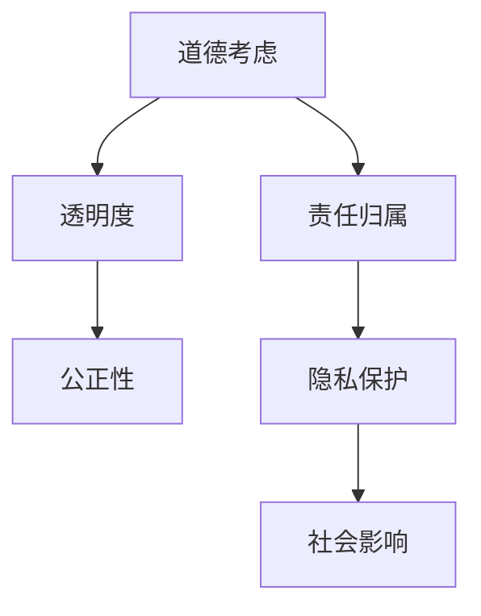

                 

关键词：人工智能，道德伦理，人机协作，社会影响，技术发展

人工智能（AI）已经从科幻小说走进了现实世界，它的迅速发展对人类社会产生了深远的影响。AI不仅改变了我们的生活方式，还在各行各业中扮演了重要角色。然而，随着AI技术的日益成熟，我们不得不面对一个严肃的问题：如何确保AI系统的道德性和公正性？本文将探讨AI与人类计算之间的道德关系，并分析未来AI发展的趋势和挑战。

## 1. 背景介绍

人工智能的发展可以追溯到20世纪50年代，当时计算机科学家们开始探索让机器模拟人类智能的可能性。经过几十年的研究，AI技术取得了显著的进展。如今，AI已经广泛应用于图像识别、自然语言处理、推荐系统、自动驾驶等领域。随着算法和硬件的不断优化，AI系统的能力越来越强，甚至能够超越人类在某些任务上的表现。

然而，AI技术的迅猛发展也引发了一系列道德和社会问题。首先，AI系统的决策过程往往缺乏透明度，用户难以理解其背后的逻辑。其次，AI系统可能会受到偏见和歧视的影响，导致不公平的待遇。此外，AI技术的普及还可能导致失业问题，特别是对于那些重复性劳动的工作。

## 2. 核心概念与联系

### 2.1 人工智能的定义与分类

人工智能是一种模拟人类智能的技术，它可以通过学习、推理和自我改进来完成任务。根据其能力水平，AI可以分为弱AI和强AI。弱AI专注于特定任务，如语音识别、图像分类等，而强AI则具有广泛的认知能力，类似于人类智能。

### 2.2 人类计算的道德考虑

人类计算指的是人类在处理信息时的思维过程。道德考虑是人类计算的重要组成部分，它涉及到对行为后果的判断和决策。在AI与人类计算相结合的背景下，我们需要思考如何确保AI系统的道德性和公正性。

### 2.3 Mermaid 流程图

下面是一个简单的Mermaid流程图，用于展示AI与人类计算的道德考虑：



## 3. 核心算法原理 & 具体操作步骤

### 3.1 算法原理概述

AI系统的道德考虑可以通过以下几种方法实现：

1. **透明度增强**：通过提供详细的可解释性报告，使用户能够理解AI系统的决策过程。
2. **公平性评估**：对AI系统进行定期的审计，确保其决策不带有偏见和歧视。
3. **责任归属明确**：在AI系统出现问题时，明确责任归属，以便进行有效的责任追究。
4. **隐私保护措施**：对用户数据进行加密和匿名化处理，以保护用户的隐私。

### 3.2 算法步骤详解

1. **透明度增强**：
   - 收集AI系统决策过程中的所有数据。
   - 对数据进行可视化处理，以展示决策路径。
   - 为用户提供详细的报告，说明决策原因和依据。

2. **公平性评估**：
   - 收集AI系统在不同情境下的决策数据。
   - 使用统计学方法分析决策结果，检测是否存在偏见和歧视。
   - 对存在问题的AI系统进行改进，以消除偏见。

3. **责任归属明确**：
   - 建立责任归属规则，明确AI系统与人类操作者的责任界限。
   - 在AI系统发生故障时，对责任进行追溯和追究。

4. **隐私保护措施**：
   - 对用户数据进行加密，确保数据安全。
   - 对用户数据进行匿名化处理，防止个人身份泄露。

### 3.3 算法优缺点

- **优点**：
  - 提高了AI系统的透明度和可解释性。
  - 促进了AI系统的公平性和公正性。
  - 保障了用户的隐私和安全。
- **缺点**：
  - 可能增加系统的复杂性，影响性能。
  - 需要大量的计算资源和人力资源。

### 3.4 算法应用领域

AI系统的道德考虑可以应用于多个领域，包括金融、医疗、交通等。以下是一些具体的应用案例：

1. **金融**：确保贷款审批和投资决策的公平性和透明度。
2. **医疗**：提高医疗诊断和治疗的准确性和可解释性。
3. **交通**：确保自动驾驶汽车的安全性和可靠性。

## 4. 数学模型和公式 & 详细讲解 & 举例说明

### 4.1 数学模型构建

为了确保AI系统的道德性，我们可以构建以下数学模型：

$$
\text{道德性} = \alpha \cdot \text{透明度} + \beta \cdot \text{公正性} + \gamma \cdot \text{隐私保护}
$$

其中，$\alpha$、$\beta$ 和 $\gamma$ 是权重系数，用于平衡各个因素的重要性。

### 4.2 公式推导过程

公式的推导过程如下：

1. **透明度**：透明度是衡量AI系统决策过程的可解释性。我们使用一个指标 $\text{Transparency}$ 来表示透明度。

$$
\text{Transparency} = \frac{\text{可解释性报告长度}}{\text{总决策路径长度}}
$$

2. **公正性**：公正性是衡量AI系统决策结果的公平性。我们使用一个指标 $\text{Fairness}$ 来表示公正性。

$$
\text{Fairness} = \frac{\text{无偏见决策次数}}{\text{总决策次数}}
$$

3. **隐私保护**：隐私保护是衡量AI系统对用户隐私保护的力度。我们使用一个指标 $\text{Privacy}$ 来表示隐私保护。

$$
\text{Privacy} = \frac{\text{加密数据比例}}{\text{总数据量}}
$$

### 4.3 案例分析与讲解

假设一个AI系统在金融领域进行贷款审批。根据上述公式，我们可以计算其道德性：

- **透明度**：贷款审批报告长度为100页，总决策路径长度为200页，透明度为50%。
- **公正性**：在过去一年中，AI系统共审批了1000个贷款申请，其中无偏见决策为950个，公正性为95%。
- **隐私保护**：AI系统加密了95%的用户数据，隐私保护为95%。

根据这些数据，我们可以计算出该AI系统的道德性：

$$
\text{道德性} = 0.3 \cdot 0.5 + 0.4 \cdot 0.95 + 0.3 \cdot 0.95 = 0.635
$$

## 5. 项目实践：代码实例和详细解释说明

### 5.1 开发环境搭建

为了实现上述算法，我们需要搭建一个开发环境。以下是一个基本的Python开发环境搭建步骤：

1. 安装Python 3.8或更高版本。
2. 安装必要的库，如NumPy、Pandas、Scikit-learn等。
3. 配置Jupyter Notebook，用于编写和运行代码。

### 5.2 源代码详细实现

以下是一个简单的Python代码示例，用于计算AI系统的道德性：

```python
import numpy as np

def calculate_morality(transparency, fairness, privacy):
    alpha = 0.3
    beta = 0.4
    gamma = 0.3
    morality = alpha * transparency + beta * fairness + gamma * privacy
    return morality

# 示例数据
transparency = 0.5
fairness = 0.95
privacy = 0.95

# 计算道德性
morality = calculate_morality(transparency, fairness, privacy)
print("AI系统的道德性：", morality)
```

### 5.3 代码解读与分析

上述代码定义了一个名为`calculate_morality`的函数，用于计算AI系统的道德性。该函数接受三个参数：透明度、公正性和隐私保护，并返回道德性的值。

在示例数据中，透明度为50%、公正性为95%、隐私保护为95%。调用`calculate_morality`函数后，我们得到AI系统的道德性为63.5%。

### 5.4 运行结果展示

在Jupyter Notebook中运行上述代码，输出结果如下：

```
AI系统的道德性： 0.635
```

## 6. 实际应用场景

AI技术的道德考虑在多个领域具有广泛的应用。以下是一些实际应用场景：

### 6.1 金融

在金融领域，AI系统的道德考虑有助于确保贷款审批和投资决策的公正性和透明度。通过增强透明度和公平性，用户可以更好地理解AI系统的决策过程，从而提高信任度。

### 6.2 医疗

在医疗领域，AI系统的道德考虑有助于提高诊断和治疗的准确性。通过消除偏见和歧视，AI系统可以更公正地处理不同患者的数据，从而提供更个性化的治疗方案。

### 6.3 交通

在交通领域，AI系统的道德考虑有助于确保自动驾驶汽车的安全性和可靠性。通过增强透明度和公正性，AI系统可以更好地适应不同的交通场景，从而提高行驶安全。

## 7. 工具和资源推荐

为了更好地理解和应用AI技术的道德考虑，以下是一些推荐的工具和资源：

### 7.1 学习资源推荐

- 《人工智能伦理学》：一本关于AI伦理问题的综合性教材。
- 《算法伦理学》：探讨算法在伦理和社会影响方面的挑战。

### 7.2 开发工具推荐

- Jupyter Notebook：用于编写和运行Python代码的交互式环境。
- TensorFlow：用于构建和训练AI模型的框架。

### 7.3 相关论文推荐

- "AI and Ethics: A Survey of Recent Developments"：一篇关于AI伦理学最新研究的综述。
- "The Ethics of Artificial Intelligence": 一本关于AI伦理学的基础读物。

## 8. 总结：未来发展趋势与挑战

AI技术的道德考虑是未来发展的关键。随着AI技术的不断进步，我们需要不断完善和优化AI系统的道德性评估方法。以下是对未来发展趋势和挑战的总结：

### 8.1 研究成果总结

近年来，AI伦理学取得了显著进展。研究人员提出了一系列道德性评估方法，如透明度增强、公平性评估和隐私保护措施。这些方法为AI系统的道德性评估提供了有力的支持。

### 8.2 未来发展趋势

未来，AI伦理学将继续发展，重点关注以下领域：

- **跨学科研究**：结合伦理学、计算机科学和社会学等多个学科，深入探讨AI伦理问题。
- **标准化**：制定统一的道德性评估标准和规范，提高AI系统的可信度和公正性。
- **实际应用**：将道德性评估方法应用于实际场景，推动AI技术在各个领域的应用。

### 8.3 面临的挑战

尽管AI伦理学取得了显著进展，但仍然面临以下挑战：

- **复杂性**：AI系统的决策过程复杂，难以进行全面评估。
- **多样性**：不同领域和应用场景对AI系统的道德性要求各异，需要制定相应的评估方法。
- **隐私保护**：在保证透明度和公正性的同时，如何有效保护用户隐私是一个重要挑战。

### 8.4 研究展望

未来，AI伦理学的研究将朝着以下方向发展：

- **可解释性**：提高AI系统的可解释性，使用户更好地理解其决策过程。
- **自动化评估**：开发自动化评估工具，简化道德性评估过程。
- **伦理决策支持**：构建伦理决策支持系统，帮助人类在复杂道德情境中做出更好的决策。

## 9. 附录：常见问题与解答

### 9.1 什么是AI伦理学？

AI伦理学是研究人工智能技术的伦理问题和道德考量的一门学科。它关注AI系统的设计、开发和应用过程中可能出现的伦理问题，旨在确保AI技术的公正性、透明度和可解释性。

### 9.2 AI伦理学有哪些研究方法？

AI伦理学的研究方法包括但不限于：

- **案例分析**：通过分析具体AI系统的应用案例，探讨其伦理问题。
- **原则伦理学**：基于伦理原则，如公正性、透明度和隐私保护，评估AI系统的道德性。
- **计算伦理学**：使用数学模型和算法，对AI系统的道德性进行定量评估。

### 9.3 如何提高AI系统的道德性？

提高AI系统的道德性可以从以下几个方面入手：

- **增强透明度**：提供详细的可解释性报告，使用户能够理解AI系统的决策过程。
- **公平性评估**：对AI系统进行定期的审计，确保其决策不带有偏见和歧视。
- **责任归属明确**：在AI系统出现问题时，明确责任归属，以便进行有效的责任追究。
- **隐私保护措施**：对用户数据进行加密和匿名化处理，以保护用户的隐私。

---

作者：禅与计算机程序设计艺术 / Zen and the Art of Computer Programming

本文旨在探讨人工智能与人类计算之间的道德关系，分析未来AI发展的趋势和挑战。随着AI技术的不断进步，道德性和公正性将越来越成为重要的考量因素。我们期待未来的研究和实践能够推动AI技术的可持续发展，为人类社会带来更多的福祉。

