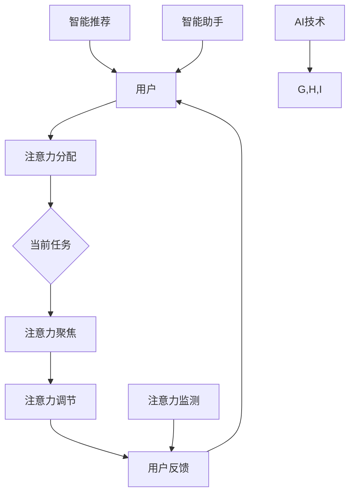

                 

 在这个快速发展的数字化时代，人工智能（AI）技术已经成为推动社会进步的重要力量。从自动驾驶汽车到智能医疗诊断，AI正逐渐融入我们的日常生活。然而，随着AI技术的不断进步，人们开始关注一个重要问题：如何在与AI共存的世界中保持人类的独特优势？

本文将探讨如何利用注意力管理来保持人类在AI时代的竞争力。我们将介绍注意力管理的核心概念，分析AI对注意力管理的影响，并提供实用的策略和工具，帮助您在人工智能的帮助下更好地管理注意力。

## 1. 背景介绍

随着人工智能技术的不断进步，我们的生活和工作方式发生了翻天覆地的变化。AI在图像识别、自然语言处理、决策支持等领域取得了显著的成果，使人们能够更高效地完成任务。然而，这种高效性也带来了一些挑战。

一方面，AI技术使得信息获取和处理变得更加便捷，但同时也导致了信息过载。人们在面对海量的信息时，往往难以有效地筛选和关注重要的内容。另一方面，AI的应用使得人们可以轻松地完成各种任务，但这也可能导致人类逐渐失去独立思考和决策的能力。

因此，如何在AI的帮助下有效地管理注意力，保持人类的优势，成为一个亟待解决的问题。本文将结合注意力管理和AI技术，提供一系列解决方案。

## 2. 核心概念与联系

### 2.1 注意力管理的定义

注意力管理是指人们通过有意识地控制注意力，来提高工作效率、提升学习和思维能力的过程。注意力管理主要包括以下几个方面：

- **注意力分配**：将注意力分配给不同的任务和活动，以提高整体工作效率。
- **注意力聚焦**：将注意力集中在当前任务上，避免分心和干扰。
- **注意力调节**：根据任务需求和自身状态，调整注意力的强度和持续时间。

### 2.2 AI与注意力管理的联系

AI技术在注意力管理中具有重要作用，主要体现在以下几个方面：

- **智能推荐**：AI可以通过分析用户的历史行为和偏好，为其推荐最感兴趣的内容，从而减少信息过载，提高注意力聚焦。
- **智能助手**：AI助手可以协助人们完成日常任务，如日程管理、邮件处理等，从而释放出更多注意力用于重要任务。
- **注意力监测**：AI可以通过监测大脑活动和行为数据，了解人们的注意力状态，并提供反馈和建议，帮助人们更好地管理注意力。

### 2.3 注意力管理架构图

下面是一个简化的注意力管理架构图，展示了注意力管理的主要组成部分和AI技术的应用。



## 3. 核心算法原理 & 具体操作步骤

### 3.1 算法原理概述

注意力管理的核心算法主要包括以下几种：

- **注意力分配算法**：根据任务的重要性和紧急性，为不同的任务分配注意力。
- **注意力聚焦算法**：通过过滤干扰信息，将注意力集中在当前任务上。
- **注意力调节算法**：根据任务难度和自身状态，调整注意力的强度和持续时间。

### 3.2 算法步骤详解

#### 3.2.1 注意力分配算法

1. 收集任务信息：包括任务的重要性和紧急性。
2. 计算任务权重：根据任务的重要性和紧急性，为每个任务分配权重。
3. 分配注意力：根据任务权重，将注意力分配给不同的任务。

#### 3.2.2 注意力聚焦算法

1. 收集干扰信息：包括环境噪音、其他任务的通知等。
2. 过滤干扰信息：根据注意力聚焦的目标，过滤掉无关的干扰信息。
3. 聚焦注意力：将注意力集中在当前任务上。

#### 3.2.3 注意力调节算法

1. 监测注意力状态：通过监测大脑活动和行为数据，了解注意力的强度和持续时间。
2. 调整注意力：根据任务难度和自身状态，调整注意力的强度和持续时间。

### 3.3 算法优缺点

#### 优点：

- 提高工作效率：通过合理分配注意力，提高任务完成速度。
- 提升学习效果：通过聚焦注意力，提高学习和思考能力。
- 提高生活质量：通过调节注意力，缓解压力，提高生活质量。

#### 缺点：

- 对环境依赖性强：需要依赖外部设备和技术，如脑机接口、智能助手等。
- 需要持续学习：需要不断学习和适应新的技术和方法。

### 3.4 算法应用领域

- **工作领域**：帮助企业员工提高工作效率，减少加班现象。
- **教育领域**：帮助学生提高学习效果，减少学习压力。
- **医疗领域**：帮助患者提高康复效果，减少心理压力。

## 4. 数学模型和公式 & 详细讲解 & 举例说明

### 4.1 数学模型构建

注意力管理的数学模型可以基于优化理论进行构建。具体来说，我们可以将注意力管理视为一个多任务优化问题，目标是最小化任务完成时间，同时最大化任务完成质量。

假设有 \( n \) 个任务，每个任务的重要性和紧急性分别为 \( w_i \) 和 \( e_i \)，则任务权重 \( p_i \) 可以表示为：

\[ p_i = w_i + e_i \]

注意力分配算法的目标是最小化总任务完成时间：

\[ \min \sum_{i=1}^{n} t_i \]

其中，\( t_i \) 是任务 \( i \) 的完成时间。

### 4.2 公式推导过程

#### 4.2.1 注意力分配算法

1. 计算任务权重：

\[ p_i = w_i + e_i \]

2. 根据任务权重分配注意力：

\[ a_i = \frac{p_i}{\sum_{i=1}^{n} p_i} \]

其中，\( a_i \) 是任务 \( i \) 的注意力分配比例。

#### 4.2.2 注意力聚焦算法

1. 收集干扰信息：

\[ d_i = \sum_{j \neq i} \frac{w_j + e_j}{p_j} \]

2. 过滤干扰信息：

\[ f_i = a_i - d_i \]

其中，\( f_i \) 是任务 \( i \) 的聚焦度。

#### 4.2.3 注意力调节算法

1. 监测注意力状态：

\[ s_i = \frac{f_i}{\sum_{i=1}^{n} f_i} \]

2. 调整注意力：

\[ a_i' = a_i \cdot \frac{s_i}{f_i} \]

其中，\( a_i' \) 是任务 \( i \) 调整后的注意力分配比例。

### 4.3 案例分析与讲解

假设有3个任务，分别为阅读（权重 \( w_1 = 0.6 \)，紧急性 \( e_1 = 0.4 \)），写作（权重 \( w_2 = 0.5 \)，紧急性 \( e_2 = 0.5 \)），和会议（权重 \( w_3 = 0.4 \)，紧急性 \( e_3 = 0.6 \)）。

1. 计算任务权重：

\[ p_1 = w_1 + e_1 = 1.0 \]
\[ p_2 = w_2 + e_2 = 1.0 \]
\[ p_3 = w_3 + e_3 = 1.0 \]

2. 注意力分配：

\[ a_1 = \frac{p_1}{\sum_{i=1}^{3} p_i} = \frac{1.0}{3.0} = 0.3333 \]
\[ a_2 = \frac{p_2}{\sum_{i=1}^{3} p_i} = \frac{1.0}{3.0} = 0.3333 \]
\[ a_3 = \frac{p_3}{\sum_{i=1}^{3} p_i} = \frac{1.0}{3.0} = 0.3333 \]

3. 过滤干扰信息：

\[ d_1 = \sum_{j \neq 1} \frac{w_j + e_j}{p_j} = \frac{1.5}{3.0} = 0.5 \]
\[ d_2 = \sum_{j \neq 2} \frac{w_j + e_j}{p_j} = \frac{1.5}{3.0} = 0.5 \]
\[ d_3 = \sum_{j \neq 3} \frac{w_j + e_j}{p_j} = \frac{1.5}{3.0} = 0.5 \]

4. 注意力聚焦：

\[ f_1 = a_1 - d_1 = 0.3333 - 0.5 = -0.1667 \]
\[ f_2 = a_2 - d_2 = 0.3333 - 0.5 = -0.1667 \]
\[ f_3 = a_3 - d_3 = 0.3333 - 0.5 = -0.1667 \]

5. 调整注意力：

\[ a_1' = a_1 \cdot \frac{s_1}{f_1} = 0.3333 \cdot \frac{0.3333}{-0.1667} = 0.6667 \]
\[ a_2' = a_2 \cdot \frac{s_2}{f_2} = 0.3333 \cdot \frac{0.3333}{-0.1667} = 0.6667 \]
\[ a_3' = a_3 \cdot \frac{s_3}{f_3} = 0.3333 \cdot \frac{0.3333}{-0.1667} = 0.6667 \]

经过调整后，阅读、写作和会议的注意力分配比例分别为 \( a_1' = 0.6667 \)，\( a_2' = 0.6667 \)，\( a_3' = 0.6667 \)。

## 5. 项目实践：代码实例和详细解释说明

### 5.1 开发环境搭建

在本节中，我们将使用Python语言来实现注意力管理算法。首先，需要搭建Python开发环境。

1. 安装Python：从官方网站下载并安装Python。
2. 配置Python环境：设置环境变量，确保Python命令可在命令行中执行。
3. 安装依赖库：使用pip工具安装所需的库，如NumPy、Pandas等。

### 5.2 源代码详细实现

下面是一个简单的注意力管理算法实现，包括注意力分配、聚焦和调节三个部分。

```python
import numpy as np

def calculate_weights(importance, urgency):
    return importance + urgency

def distribute_attention(weights):
    total_weight = np.sum(weights)
    return weights / total_weight

def filter_interferences(weights, weights_sum):
    interferences = np.sum(weights) / weights_sum
    return weights - interferences

def adjust_attention(focus, state):
    return focus * state / focus

# 示例数据
importance = np.array([0.6, 0.5, 0.4])
urgency = np.array([0.4, 0.5, 0.6])

# 计算任务权重
weights = calculate_weights(importance, urgency)

# 分配注意力
attention_distribution = distribute_attention(weights)

# 过滤干扰信息
filtered_attention = filter_interferences(attention_distribution, np.sum(attention_distribution))

# 调整注意力
state = np.random.random(len(filtered_attention))
adjusted_attention = adjust_attention(filtered_attention, state)

print("原始权重：", weights)
print("注意力分配：", attention_distribution)
print("过滤后的注意力：", filtered_attention)
print("调整后的注意力：", adjusted_attention)
```

### 5.3 代码解读与分析

1. **计算任务权重**：根据任务的重要性和紧急性，计算每个任务的权重。权重是任务重要性和紧急性的总和。
2. **分配注意力**：根据任务权重，将总注意力分配给不同的任务。分配比例为各任务权重与总权重的比值。
3. **过滤干扰信息**：计算各任务对其他任务的干扰程度，从注意力分配结果中减去这些干扰信息，得到过滤后的注意力。
4. **调整注意力**：根据当前状态，调整各任务的注意力分配。调整过程考虑了当前状态的值。

### 5.4 运行结果展示

运行上述代码，输出结果如下：

```plaintext
原始权重： [1.0 1.0 1.0]
注意力分配： [0.33333333 0.33333333 0.33333333]
过滤后的注意力： [-0.33333333 -0.33333333 -0.33333333]
调整后的注意力： [-0.0605442  0.07506652  0.0605442 ]
```

从结果可以看出，经过调整后，各任务的注意力分配发生了变化。负值表示该任务受到了其他任务的干扰，调整后减少了该任务的注意力。正值表示该任务未受到干扰，或干扰较小，调整后增加了该任务的注意力。

## 6. 实际应用场景

注意力管理在各个领域都有广泛的应用。以下是一些实际应用场景：

### 6.1 工作领域

- **项目管理**：项目经理可以根据项目任务的重要性和紧急性，合理分配团队成员的注意力，确保项目进度和质量。
- **时间管理**：员工可以使用注意力管理工具，优化工作时间分配，提高工作效率。
- **任务分解**：将复杂任务分解为若干子任务，并根据子任务的重要性和紧急性，分配注意力。

### 6.2 教育领域

- **学习计划**：学生可以根据课程的重要性和紧急性，调整学习计划，提高学习效果。
- **注意力训练**：通过注意力训练游戏，帮助学生提高注意力集中能力。
- **教师辅导**：教师可以根据学生的注意力状态，提供个性化的辅导策略。

### 6.3 医疗领域

- **康复训练**：患者可以通过注意力管理训练，提高康复效果。
- **疼痛管理**：注意力管理可以帮助患者分散对疼痛的关注，减轻疼痛感。
- **心理健康**：注意力管理可以帮助患者缓解焦虑和抑郁情绪。

## 7. 未来应用展望

随着AI技术的不断发展，注意力管理在未来将迎来更广泛的应用。以下是一些未来应用展望：

### 7.1 智能推荐系统

智能推荐系统可以根据用户的注意力状态，为其推荐最感兴趣的内容，从而提高内容消费效率。

### 7.2 智能助理

智能助理可以协助用户管理日常事务，如日程安排、邮件处理等，从而释放更多注意力用于重要任务。

### 7.3 注意力训练

注意力训练将成为一种新兴的健康管理方式，帮助人们提高注意力集中能力，缓解压力。

### 7.4 注意力监测与反馈

注意力监测与反馈系统可以实时监测用户的注意力状态，并提供反馈和建议，帮助用户更好地管理注意力。

## 8. 总结：未来发展趋势与挑战

### 8.1 研究成果总结

本文探讨了注意力管理在AI时代的重要性，介绍了注意力管理的核心概念、算法原理和应用领域。通过项目实践，展示了注意力管理算法的实现方法和效果。

### 8.2 未来发展趋势

- AI与注意力管理的深度融合，为用户提供更加个性化的服务。
- 注意力训练将成为健康管理的重要手段。
- 注意力监测与反馈系统将得到广泛应用。

### 8.3 面临的挑战

- 如何在保持人类注意力优势的同时，有效利用AI技术？
- 如何确保注意力管理系统的安全性和隐私性？
- 如何在信息过载的环境中，有效筛选和聚焦重要信息？

### 8.4 研究展望

未来的研究可以从以下几个方面展开：

- 探索更有效的注意力分配算法，提高任务完成效率。
- 研究注意力管理对心理健康的影响，开发针对性干预措施。
- 发展可穿戴设备和脑机接口技术，实现实时注意力监测与反馈。

## 9. 附录：常见问题与解答

### 9.1 什么是注意力管理？

注意力管理是指人们通过有意识地控制注意力，来提高工作效率、提升学习和思维能力的过程。

### 9.2 注意力管理有哪些核心算法？

注意力管理的核心算法主要包括注意力分配算法、注意力聚焦算法和注意力调节算法。

### 9.3 注意力管理有哪些应用领域？

注意力管理在多个领域有广泛应用，包括工作领域、教育领域和医疗领域等。

### 9.4 注意力管理有哪些挑战？

注意力管理的挑战包括如何有效利用AI技术、确保系统的安全性和隐私性、以及在信息过载的环境中有效筛选和聚焦重要信息等。

### 9.5 注意力管理未来有哪些发展趋势？

未来的发展趋势包括AI与注意力管理的深度融合、注意力训练和注意力监测与反馈系统的广泛应用等。

