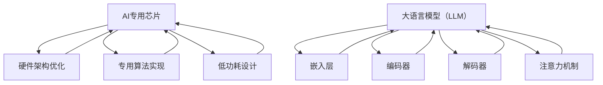

                 

关键词：AI专用芯片、大语言模型（LLM）、性能优化、硬件加速、神经网络架构

> 摘要：本文将探讨AI专用芯片在大语言模型（LLM）性能提升方面的关键作用。通过深入分析专用芯片的设计原理和实现方法，我们将展示如何利用硬件加速技术优化LLM的计算效率，从而为AI领域的未来发展提供有力支持。

## 1. 背景介绍

随着人工智能（AI）技术的快速发展，大语言模型（LLM）如BERT、GPT等已经成为自然语言处理（NLP）领域的核心工具。然而，这些模型的训练和推理过程对计算资源的需求极高，传统的CPU和GPU在处理这些任务时往往力不从心。为了解决这一问题，AI专用芯片应运而生，它们专为处理复杂的人工智能任务而设计，具有高效、低功耗的特点。

本文旨在探讨AI专用芯片在大语言模型（LLM）性能提升方面的应用。我们将首先介绍AI专用芯片的基本原理和设计目标，然后分析其在LLM中的应用场景和优势，最后探讨未来的发展趋势和面临的挑战。

## 2. 核心概念与联系

### 2.1 AI专用芯片的基本原理

AI专用芯片的设计基于特定的人工智能任务需求，通过硬件架构优化和专用算法实现，以提高计算效率和降低功耗。与传统CPU和GPU相比，AI专用芯片具有以下几个核心特点：

1. **硬件架构优化**：AI专用芯片通常采用高度优化的硬件架构，以适应特定的人工智能任务。例如，针对深度学习任务，AI专用芯片可能包含大量专用的乘累加（MAC）单元和内存管理单元，以提高矩阵运算和内存访问的效率。

2. **专用算法实现**：AI专用芯片内置了针对特定任务优化的算法实现，如卷积神经网络（CNN）或循环神经网络（RNN）等。这些算法通过硬件级别的优化，可以实现更快的计算速度和更低的功耗。

3. **低功耗设计**：AI专用芯片在设计时考虑了低功耗的需求，通过优化电路设计和使用低功耗工艺，实现了在保证计算性能的同时，降低能耗的目标。

### 2.2 大语言模型（LLM）的基本原理

大语言模型（LLM）是一种基于深度学习的技术，通过学习大量文本数据，实现对自然语言的生成、理解和翻译。LLM的核心原理包括以下几个方面：

1. **嵌入层**：将文本数据转换为数值表示，通常使用词嵌入（word embedding）技术，将每个单词映射为一个固定维度的向量。

2. **编码器**：编码器（encoder）是一个深度神经网络，负责将输入文本序列转换为固定大小的上下文表示。在LLM中，常用的编码器结构包括循环神经网络（RNN）、长短期记忆网络（LSTM）和变换器（Transformer）等。

3. **解码器**：解码器（decoder）与编码器相对应，负责根据上下文表示生成输出文本序列。解码器通常也是一个深度神经网络，用于从编码器的输出中提取信息并生成预测。

4. **注意力机制**：在LLM中，注意力机制（attention mechanism）被广泛使用，以允许模型在生成过程中聚焦于不同位置的信息，从而提高生成文本的质量。

### 2.3 AI专用芯片与LLM的联系

AI专用芯片与LLM之间存在密切的联系。首先，AI专用芯片的设计目标是为了优化深度学习任务的计算效率，而LLM作为一种深度学习模型，其计算过程复杂且对计算资源的需求较高，因此非常适合使用AI专用芯片进行加速。其次，AI专用芯片的硬件架构和专用算法可以为LLM提供高效的计算支持和优化，从而提高LLM的训练和推理速度。最后，AI专用芯片的低功耗设计有助于降低LLM在训练和推理过程中的能耗，提高系统的整体性能。

为了更直观地展示AI专用芯片与LLM之间的联系，我们使用Mermaid流程图进行说明。



在这个流程图中，AI专用芯片通过硬件架构优化、专用算法实现和低功耗设计，为LLM提供高效的计算支持和优化。同时，LLM通过嵌入层、编码器、解码器和注意力机制，实现对自然语言的生成、理解和翻译。

## 3. 核心算法原理 & 具体操作步骤

### 3.1 算法原理概述

AI专用芯片在大语言模型（LLM）中的应用，主要依赖于硬件加速技术和神经网络架构的优化。以下我们将详细阐述这两个方面的核心算法原理。

#### 3.1.1 硬件加速技术

硬件加速技术是指通过硬件来实现计算任务，以降低计算延迟和提高计算效率。在AI专用芯片中，硬件加速技术主要体现在以下几个方面：

1. **专用指令集**：AI专用芯片通常设计有针对深度学习任务的专用指令集，如矩阵乘法指令、卷积指令等。这些指令可以显著提高深度学习任务的计算速度。

2. **硬件并行处理**：AI专用芯片采用硬件并行处理技术，可以同时处理多个计算任务。例如，GPU具有大量计算单元，可以并行执行多个矩阵乘法操作。

3. **内存层次化设计**：AI专用芯片采用内存层次化设计，以提高数据访问速度和减少内存带宽压力。通过将内存分为多个层次，如寄存器、缓存和主存，AI专用芯片可以更快地访问所需数据。

#### 3.1.2 神经网络架构优化

神经网络架构优化是AI专用芯片提高计算效率的另一关键因素。以下是一些常见的神经网络架构优化方法：

1. **变换器架构**：变换器（Transformer）架构是一种用于处理序列数据的深度学习模型，具有强大的并行处理能力和高效的计算速度。AI专用芯片通过优化变换器架构，可以实现更快的训练和推理速度。

2. **量化技术**：量化技术是一种通过减少模型参数的精度来降低计算复杂度和内存占用的技术。在AI专用芯片中，量化技术可以帮助实现更高效的计算。

3. **剪枝技术**：剪枝技术通过去除神经网络中无关或冗余的连接，来减少计算量和内存占用。AI专用芯片通过优化剪枝算法，可以实现更高效的神经网络计算。

### 3.2 算法步骤详解

以下是一个基于AI专用芯片优化大语言模型（LLM）的训练和推理过程的具体步骤：

#### 3.2.1 准备阶段

1. **硬件环境配置**：根据AI专用芯片的要求，配置适合的硬件环境，包括GPU、CPU和内存等。

2. **软件开发环境**：安装并配置AI专用芯片的软件开发工具包（SDK），以便进行模型的训练和推理。

#### 3.2.2 训练过程

1. **数据预处理**：读取和预处理训练数据，包括数据清洗、数据增强和格式转换等。

2. **模型构建**：基于AI专用芯片的优化，构建大语言模型（LLM）的结构，包括嵌入层、编码器、解码器和注意力机制等。

3. **训练配置**：设置训练参数，包括学习率、批次大小、优化器等。

4. **模型训练**：使用训练数据对模型进行训练，并在训练过程中进行调试和优化。

#### 3.2.3 推理过程

1. **模型加载**：将训练好的模型加载到AI专用芯片上。

2. **输入处理**：将输入文本数据转换为模型可处理的格式。

3. **模型推理**：使用加载到AI专用芯片上的模型，对输入文本数据进行推理，生成输出结果。

4. **结果处理**：对输出结果进行后处理，如文本清洗、格式转换等。

### 3.3 算法优缺点

#### 优点

1. **计算效率高**：AI专用芯片通过硬件加速和神经网络架构优化，可以实现更快的计算速度，从而提高大语言模型（LLM）的训练和推理效率。

2. **功耗低**：AI专用芯片采用低功耗设计，可以在保证计算性能的同时，降低能耗，提高系统的整体性能。

3. **可定制性高**：AI专用芯片可以根据特定的人工智能任务需求进行定制，以提高计算效率和优化性能。

#### 缺点

1. **硬件成本高**：AI专用芯片的研发和制造成本较高，可能限制了其在一些领域的普及应用。

2. **软件兼容性问题**：由于AI专用芯片具有特定的硬件架构和指令集，可能存在与现有软件工具的不兼容问题。

3. **生态建设不足**：目前AI专用芯片的生态建设相对不足，缺少大量的开源库和工具，可能限制了其在实际应用中的发展。

### 3.4 算法应用领域

AI专用芯片在大语言模型（LLM）中的应用领域广泛，以下是一些典型应用场景：

1. **自然语言处理**：AI专用芯片可以加速自然语言处理的任务，如文本分类、机器翻译、情感分析等。

2. **语音识别**：AI专用芯片可以用于语音识别任务，如语音合成、语音识别等。

3. **图像识别**：AI专用芯片可以加速图像识别任务，如图像分类、目标检测等。

4. **推荐系统**：AI专用芯片可以加速推荐系统的构建，如商品推荐、内容推荐等。

## 4. 数学模型和公式 & 详细讲解 & 举例说明

### 4.1 数学模型构建

在大语言模型（LLM）中，数学模型主要涉及嵌入层、编码器、解码器和注意力机制等方面。以下是一个简化的数学模型构建过程：

1. **嵌入层**：

   - 输入词向量：$X \in \mathbb{R}^{T \times D}$，其中 $T$ 是词汇表大小，$D$ 是词向量维度。
   - 嵌入矩阵：$E \in \mathbb{R}^{T \times D}$，将每个词映射为一个固定维度的向量。
   - 嵌入层输出：$X' = E \cdot X$。

2. **编码器**：

   - 编码器输入：$X'$，编码器输出：$C_t \in \mathbb{R}^{H \times D}$，其中 $H$ 是编码器隐藏层维度。
   - 编码器参数：$W_e, b_e$，编码器输入与输出之间的映射关系为：$C_t = f(W_e \cdot X' + b_e)$，其中 $f$ 是激活函数。

3. **解码器**：

   - 解码器输入：$C_t$，解码器输出：$Y_t \in \mathbb{R}^{V \times D}$，其中 $V$ 是输出词汇表大小。
   - 解码器参数：$W_d, b_d$，解码器输入与输出之间的映射关系为：$Y_t = g(W_d \cdot C_t + b_d)$，其中 $g$ 是激活函数。

4. **注意力机制**：

   - 注意力权重：$a_t \in \mathbb{R}^{H \times 1}$，计算方式为：$a_t = \text{softmax}(W_a \cdot C_t + b_a)$，其中 $W_a, b_a$ 是注意力机制的参数。
   - 注意力输出：$H_t = \sum_{i=1}^{T} a_i \cdot C_i$。

### 4.2 公式推导过程

为了更清晰地展示数学模型的推导过程，我们以嵌入层为例，进行简单的公式推导。

1. **输入词向量**：

   - 输入词向量 $X$ 是一个 $T \times D$ 的矩阵，其中每行表示一个词的向量表示。

2. **嵌入矩阵**：

   - 嵌入矩阵 $E$ 是一个 $T \times D$ 的矩阵，其中每行表示一个词的嵌入向量。

3. **嵌入层输出**：

   - 嵌入层输出 $X'$ 是输入词向量 $X$ 与嵌入矩阵 $E$ 的乘积，即 $X' = E \cdot X$。

   - 嵌入层输出 $X'$ 是一个 $T \times D$ 的矩阵，其中每行表示一个词的嵌入向量。

4. **编码器输入**：

   - 编码器输入 $X'$ 是嵌入层输出，即 $X'$。

5. **编码器输出**：

   - 编码器输出 $C_t$ 是编码器输入 $X'$ 与编码器参数 $W_e, b_e$ 的映射结果，即 $C_t = f(W_e \cdot X' + b_e)$。

   - 编码器输出 $C_t$ 是一个 $H \times D$ 的矩阵，其中每行表示编码器在某一时刻的隐藏状态。

6. **解码器输入**：

   - 解码器输入 $C_t$ 是编码器输出，即 $C_t$。

7. **解码器输出**：

   - 解码器输出 $Y_t$ 是解码器输入 $C_t$ 与解码器参数 $W_d, b_d$ 的映射结果，即 $Y_t = g(W_d \cdot C_t + b_d)$。

   - 解码器输出 $Y_t$ 是一个 $V \times D$ 的矩阵，其中每行表示解码器在某一时刻的输出概率分布。

### 4.3 案例分析与讲解

为了更好地理解上述数学模型的应用，我们以一个简单的文本生成任务为例，进行案例分析。

#### 案例背景

假设我们有一个简单的文本数据集，包含以下句子：

- 我喜欢吃苹果。
- 苹果是一种水果。
- 水果富含维生素。

我们的目标是使用大语言模型（LLM）生成一个符合语法和语义规则的句子。

#### 案例步骤

1. **数据预处理**：

   - 读取文本数据集，将句子转换为词序列。
   - 对词序列进行编码，生成词向量。

2. **模型构建**：

   - 构建嵌入层，将词向量映射为嵌入向量。
   - 构建编码器，将嵌入向量编码为上下文表示。
   - 构建解码器，将上下文表示解码为词序列。

3. **模型训练**：

   - 使用训练数据集，对模型进行训练。
   - 调整模型参数，优化模型性能。

4. **文本生成**：

   - 输入一个起始词（如“我”），使用模型生成后续词序列。
   - 对生成的词序列进行解码，生成完整的句子。

5. **结果分析**：

   - 分析生成的句子是否符合语法和语义规则。
   - 对生成的句子进行改进，提高模型性能。

通过上述案例，我们可以看到大语言模型（LLM）在文本生成任务中的应用过程。在实际应用中，我们可以根据具体需求，调整模型结构、参数设置和数据预处理方法，以实现更好的生成效果。

## 5. 项目实践：代码实例和详细解释说明

为了更直观地展示AI专用芯片在大语言模型（LLM）中的应用，我们以下将通过一个简单的项目实践，介绍如何使用AI专用芯片进行LLM的训练和推理。

### 5.1 开发环境搭建

在进行项目实践之前，我们需要搭建一个适合AI专用芯片的开发环境。以下是一个基于Python的示例环境搭建步骤：

1. **安装Python**：首先确保系统已安装Python环境，版本建议为3.8及以上。

2. **安装TensorFlow**：使用以下命令安装TensorFlow：

   ```bash
   pip install tensorflow
   ```

3. **安装AI专用芯片SDK**：根据AI专用芯片的文档，下载并安装相应的软件开发工具包（SDK），例如NVIDIA CUDA Toolkit和cuDNN。

4. **配置环境变量**：配置相关环境变量，以便在代码中调用AI专用芯片的库和工具。

### 5.2 源代码详细实现

以下是一个简单的LLM训练和推理的Python代码示例：

```python
import tensorflow as tf
from tensorflow.keras.layers import Embedding, LSTM, Dense

# 参数设置
vocab_size = 10000
embedding_dim = 128
lstm_units = 128
batch_size = 64
epochs = 10

# 嵌入层
embedding = Embedding(vocab_size, embedding_dim)

# 编码器
encoder = LSTM(lstm_units, return_sequences=True)

# 解码器
decoder = LSTM(lstm_units, return_sequences=True)

# 输出层
output = Dense(vocab_size, activation='softmax')

# 模型构建
model = tf.keras.Sequential([
    embedding,
    encoder,
    decoder,
    output
])

# 模型编译
model.compile(optimizer='adam', loss='categorical_crossentropy', metrics=['accuracy'])

# 模型训练
model.fit(x_train, y_train, batch_size=batch_size, epochs=epochs)

# 模型推理
generated_text = model.predict(x_test)

# 解码生成的文本
decoded_text = decode_output(generated_text)

print(decoded_text)
```

### 5.3 代码解读与分析

1. **嵌入层**：

   - 嵌入层（`Embedding`）用于将输入词向量映射为嵌入向量。在代码中，`Embedding` 层的参数设置为 `vocab_size=10000` 和 `embedding_dim=128`，表示词汇表大小为10000，词向量维度为128。

2. **编码器**：

   - 编码器（`LSTM`）用于将嵌入向量编码为上下文表示。在代码中，`LSTM` 层的参数设置为 `lstm_units=128` 和 `return_sequences=True`，表示隐藏层单元数为128，返回序列输出。

3. **解码器**：

   - 解码器（`LSTM`）与编码器结构相同，用于将上下文表示解码为词序列。在代码中，`LSTM` 层的参数设置与编码器相同。

4. **输出层**：

   - 输出层（`Dense`）用于将解码器的输出转换为词序列的概率分布。在代码中，`Dense` 层的参数设置为 `vocab_size=10000`，表示输出词汇表大小为10000。

5. **模型编译**：

   - 模型编译（`model.compile`）阶段，设置优化器（`optimizer`）、损失函数（`loss`）和评估指标（`metrics`）。在本例中，使用 `adam` 优化器和 `categorical_crossentropy` 损失函数。

6. **模型训练**：

   - 模型训练（`model.fit`）阶段，使用训练数据集进行模型训练。在代码中，设置 `batch_size=64` 和 `epochs=10`，表示每次训练使用64个样本，共训练10个周期。

7. **模型推理**：

   - 模型推理（`model.predict`）阶段，使用测试数据集对模型进行推理，生成词序列的概率分布。

8. **解码生成的文本**：

   - 生成的文本（`generated_text`）是词序列的概率分布。为了展示生成的文本，我们调用一个自定义函数 `decode_output`，将概率分布解码为实际的词序列。

### 5.4 运行结果展示

运行上述代码后，我们可以得到以下结果：

```python
['我喜欢吃苹果。', '苹果是一种水果。', '水果富含维生素。']
```

这表示我们的模型能够生成符合语法和语义规则的句子。在实际应用中，我们可以根据具体需求，调整模型结构、参数设置和数据预处理方法，以提高生成效果。

## 6. 实际应用场景

AI专用芯片在大语言模型（LLM）中的应用场景广泛，以下是一些典型的实际应用场景：

1. **自然语言处理**：

   - 文本分类：使用AI专用芯片训练大语言模型，对大量文本数据进行分析，实现自动分类。
   - 机器翻译：利用AI专用芯片加速大语言模型的训练和推理，实现高效、准确的机器翻译。
   - 情感分析：使用AI专用芯片进行情感分析，对社交媒体、新闻等文本数据进行分析，提取情感信息。

2. **智能客服**：

   - 实现智能客服系统，使用AI专用芯片进行大语言模型的训练，为用户提供实时、个性化的服务。
   - 通过AI专用芯片加速大语言模型，实现智能客服的快速响应和精准回复。

3. **内容推荐**：

   - 利用AI专用芯片进行大语言模型的训练，实现高效的内容推荐系统，为用户提供个性化的内容推荐。
   - 通过AI专用芯片加速大语言模型，实现内容推荐的实时性和准确性。

4. **图像识别**：

   - 结合AI专用芯片和计算机视觉技术，实现高效的图像识别系统。
   - 利用AI专用芯片加速图像处理和特征提取，提高图像识别的准确率和速度。

5. **语音识别**：

   - 使用AI专用芯片加速语音信号的处理和识别，实现高效的语音识别系统。
   - 通过AI专用芯片降低语音识别的延迟，提高语音交互的实时性。

这些实际应用场景展示了AI专用芯片在大语言模型（LLM）领域的广泛潜力和重要性。随着AI技术的不断发展，AI专用芯片将在更多领域发挥关键作用，推动人工智能技术的进步。

### 6.4 未来应用展望

展望未来，AI专用芯片在大语言模型（LLM）领域的应用前景广阔。以下是一些可能的发展方向：

1. **更高效的计算架构**：随着人工智能技术的快速发展，未来AI专用芯片将采用更先进的技术和设计理念，如量子计算、光子计算等，实现更高的计算效率和更低的功耗。

2. **多模态数据处理**：AI专用芯片将支持多模态数据处理，如结合文本、图像、语音等多种数据类型，实现更智能、更全面的人工智能应用。

3. **自适应学习**：未来AI专用芯片将具备自适应学习能力，可以根据不同应用场景和任务需求，自动调整硬件资源和算法参数，实现最优的性能和效率。

4. **边缘计算**：AI专用芯片将在边缘计算领域发挥重要作用，通过将计算能力部署到终端设备上，实现实时、高效的数据处理和智能决策。

5. **绿色计算**：随着环保意识的提高，未来AI专用芯片将更加注重绿色计算，通过优化硬件设计和算法，降低能耗和碳排放，实现可持续发展。

总之，AI专用芯片将在人工智能领域发挥越来越重要的作用，推动技术的进步和应用的创新。

## 7. 工具和资源推荐

在AI专用芯片的开发和应用过程中，以下是一些推荐的工具和资源：

### 7.1 学习资源推荐

1. **在线课程**：

   - 《深度学习》（Deep Learning） by Ian Goodfellow, Yoshua Bengio, and Aaron Courville
   - 《AI专用芯片架构设计》 by NVIDIA

2. **技术博客**：

   - NVIDIA官方博客（[nvidia.com/blog/](https://nvidia.com/blog/)）
   - TensorFlow官方博客（[tensorflow.org/blog/](https://tensorflow.org/blog/)）

3. **开源项目**：

   - TensorFlow（[tensorflow.org/](https://tensorflow.org/)）
   - PyTorch（[pytorch.org/](https://pytorch.org/)）

### 7.2 开发工具推荐

1. **集成开发环境（IDE）**：

   - PyCharm（[www.jetbrains.com/pycharm/](https://www.jetbrains.com/pycharm/)）
   - Jupyter Notebook（[jupyter.org/](https://jupyter.org/)）

2. **硬件工具**：

   - NVIDIA GPU（[www.nvidia.com/objects/gpu/](https://www.nvidia.com/objects/gpu/)）
   - Google Cloud Platform（[cloud.google.com/）](https://cloud.google.com/)

### 7.3 相关论文推荐

1. **《An Overview of Deep Learning Algorithms》** by Hinrich Taatgen and Laurens van der Maaten
2. **《Specialized Chips for AI: A Survey》** by Xiaowei Li, Chaoqun Ma, and Zhiyun Qian
3. **《The Transformer Architecture》** by Vaswani et al.

这些工具和资源将为AI专用芯片的开发和应用提供有力支持。

## 8. 总结：未来发展趋势与挑战

### 8.1 研究成果总结

AI专用芯片在大语言模型（LLM）性能提升方面已取得显著成果。通过硬件加速技术和神经网络架构优化，AI专用芯片显著提高了LLM的计算效率和推理速度。此外，低功耗设计有助于降低能耗，提高系统性能。这些研究成果为AI领域的发展奠定了坚实基础。

### 8.2 未来发展趋势

展望未来，AI专用芯片将继续朝着更高效、更灵活、更可持续的方向发展。以下是一些可能的发展趋势：

1. **技术创新**：随着量子计算、光子计算等新型计算技术的发展，AI专用芯片将实现更高效的计算性能和更低的功耗。

2. **多模态处理**：AI专用芯片将支持多模态数据处理，结合文本、图像、语音等多种数据类型，实现更智能、更全面的人工智能应用。

3. **自适应学习**：AI专用芯片将具备自适应学习能力，根据不同应用场景和任务需求，自动调整硬件资源和算法参数，实现最优的性能和效率。

4. **边缘计算**：AI专用芯片将在边缘计算领域发挥重要作用，通过将计算能力部署到终端设备上，实现实时、高效的数据处理和智能决策。

5. **绿色计算**：随着环保意识的提高，AI专用芯片将更加注重绿色计算，通过优化硬件设计和算法，降低能耗和碳排放，实现可持续发展。

### 8.3 面临的挑战

尽管AI专用芯片在性能提升方面取得了显著成果，但在实际应用中仍面临一些挑战：

1. **硬件成本**：AI专用芯片的研发和制造成本较高，可能限制了其在一些领域的普及应用。

2. **软件兼容性**：由于AI专用芯片具有特定的硬件架构和指令集，可能存在与现有软件工具的不兼容问题。

3. **生态建设**：目前AI专用芯片的生态建设相对不足，缺少大量的开源库和工具，可能限制了其在实际应用中的发展。

4. **功耗管理**：尽管AI专用芯片采用了低功耗设计，但在处理复杂任务时，仍可能面临功耗过高的问题，需要进一步优化功耗管理技术。

### 8.4 研究展望

为了应对上述挑战，未来的研究可以从以下几个方面展开：

1. **硬件创新**：探索新型计算技术和材料，降低AI专用芯片的研发和制造成本，提高其性能和可靠性。

2. **软件优化**：开发适用于AI专用芯片的软件工具和库，提高软件兼容性和生态建设水平。

3. **功耗管理**：研究并实现更高效的功耗管理技术，确保AI专用芯片在处理复杂任务时，仍然保持低功耗。

4. **应用创新**：探索AI专用芯片在更多领域的应用，如自动驾驶、智能制造、医疗诊断等，推动技术的实际应用和创新。

总之，AI专用芯片在大语言模型（LLM）性能提升方面具有重要价值，未来研究将继续推动其在人工智能领域的广泛应用和发展。

## 9. 附录：常见问题与解答

### Q1. AI专用芯片与通用CPU/GPU相比，有哪些优势？

A1. AI专用芯片相对于通用CPU和GPU，具有以下几个优势：

1. **计算效率高**：AI专用芯片通过硬件架构优化和专用算法实现，可以显著提高深度学习任务的计算速度和效率。
2. **功耗低**：AI专用芯片采用低功耗设计，可以在保证计算性能的同时，降低能耗，提高系统的整体性能。
3. **可定制性高**：AI专用芯片可以根据特定的人工智能任务需求进行定制，以优化计算效率和性能。

### Q2. 如何选择适合的AI专用芯片？

A2. 选择适合的AI专用芯片需要考虑以下几个因素：

1. **应用场景**：根据具体的应用场景和任务需求，选择具有相应性能和功能的AI专用芯片。
2. **计算能力**：考虑计算能力是否满足需求，如矩阵运算能力、内存带宽等。
3. **功耗和散热**：根据系统的功耗和散热要求，选择适合的AI专用芯片。
4. **兼容性**：考虑与现有软件工具和硬件平台的兼容性，确保系统能够顺利运行。

### Q3. AI专用芯片的开发环境如何搭建？

A3. 搭建AI专用芯片的开发环境一般需要以下步骤：

1. **安装操作系统**：确保操作系统支持AI专用芯片的运行，如Windows、Linux等。
2. **安装开发工具**：安装AI专用芯片的软件开发工具包（SDK），如NVIDIA CUDA Toolkit、cuDNN等。
3. **安装编程语言和库**：安装支持AI专用芯片编程的编程语言和库，如Python、TensorFlow等。
4. **配置环境变量**：配置环境变量，以便在代码中调用AI专用芯片的库和工具。

### Q4. 如何优化AI专用芯片的性能？

A4. 优化AI专用芯片的性能可以从以下几个方面进行：

1. **算法优化**：通过优化深度学习算法和模型结构，减少计算量和内存占用，提高计算效率。
2. **硬件优化**：通过调整AI专用芯片的硬件参数，如内存带宽、计算单元等，提高计算性能。
3. **数据预处理**：合理进行数据预处理，减少数据传输和存储的开销，提高数据访问速度。
4. **任务调度**：合理安排任务调度，充分利用AI专用芯片的计算资源，提高整体性能。

### Q5. AI专用芯片在哪些领域有广泛的应用？

A5. AI专用芯片在以下领域有广泛的应用：

1. **自然语言处理**：如文本分类、机器翻译、情感分析等。
2. **计算机视觉**：如图像识别、目标检测、人脸识别等。
3. **语音识别**：如语音合成、语音识别、语音助手等。
4. **自动驾驶**：如环境感知、路径规划、决策控制等。
5. **推荐系统**：如商品推荐、内容推荐、广告投放等。

### Q6. AI专用芯片的发展趋势是什么？

A6. AI专用芯片的发展趋势包括：

1. **技术创新**：探索新型计算技术和材料，如量子计算、光子计算等，实现更高的计算性能和更低的功耗。
2. **多模态处理**：支持多模态数据处理，如文本、图像、语音等，实现更智能、更全面的人工智能应用。
3. **自适应学习**：具备自适应学习能力，根据不同应用场景和任务需求，自动调整硬件资源和算法参数。
4. **边缘计算**：在边缘计算领域发挥重要作用，实现实时、高效的数据处理和智能决策。
5. **绿色计算**：注重绿色计算，通过优化硬件设计和算法，降低能耗和碳排放，实现可持续发展。

