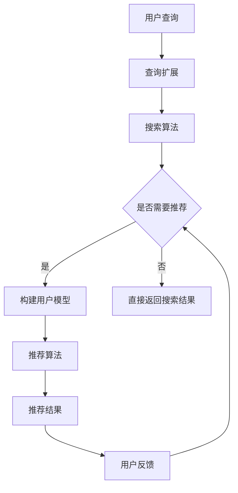

                 

关键词：AI个性化推荐、搜索算法、用户行为分析、机器学习、数据挖掘

> 摘要：本文将探讨如何利用人工智能技术，特别是个性化推荐算法，在搜索场景中提升用户体验。通过分析用户行为，构建有效的推荐系统，从而实现精准的搜索结果匹配。本文将介绍相关核心概念、算法原理、应用实例，并展望未来发展趋势与挑战。

## 1. 背景介绍

在当今信息爆炸的时代，如何在海量数据中快速准确地找到所需信息成为一大挑战。搜索引擎作为获取信息的主要工具，其搜索效果直接影响用户体验。传统的搜索引擎主要依赖于关键词匹配和文档相关性评估，但这种基于静态特征的搜索方法在面对个性化需求时存在明显局限。为了解决这一问题，AI个性化推荐技术应运而生。

个性化推荐系统旨在根据用户的兴趣、历史行为等信息，为其推荐相关的信息内容。这种系统在电子商务、社交媒体、内容平台等领域已经取得了显著的应用成果。然而，在搜索场景中，如何将个性化推荐与搜索算法相结合，实现更为精准和高效的搜索结果，仍然是一个极具挑战性的问题。

本文将首先介绍个性化推荐在搜索中的应用背景，然后深入探讨相关核心概念和算法原理，接着通过实例展示如何实现一个简单的个性化搜索推荐系统，最后讨论未来的发展趋势和面临的挑战。

## 2. 核心概念与联系

### 2.1 个性化推荐系统

个性化推荐系统是一种基于用户兴趣和行为信息的推荐机制。其核心思想是通过分析用户的历史行为数据（如浏览记录、购买行为等），构建用户的兴趣模型，进而推荐与用户兴趣相符的内容。个性化推荐系统可以分为以下几种类型：

1. **基于内容的推荐**：根据用户对内容的偏好进行推荐，如推荐相似的内容。
2. **协同过滤推荐**：通过分析用户之间的相似性，推荐其他用户喜欢的内容。
3. **混合推荐**：结合多种推荐策略，提高推荐系统的准确性。

### 2.2 搜索算法

搜索算法是指从海量数据中检索用户所需信息的方法。常见的搜索算法包括：

1. **基于关键词匹配**：简单地将用户输入的关键词与文档内容进行匹配。
2. **PageRank**：基于网页之间的链接关系进行排序。
3. **深度学习搜索**：利用神经网络模型对用户查询和文档内容进行语义理解。

### 2.3 用户行为分析

用户行为分析是构建个性化推荐系统的关键步骤。通过分析用户的行为数据（如搜索历史、点击记录、购买行为等），可以挖掘用户的兴趣偏好，从而实现精准的推荐。用户行为分析通常包括以下步骤：

1. **数据收集**：收集用户的各项行为数据。
2. **数据预处理**：对原始数据进行清洗、去重、特征提取等处理。
3. **行为建模**：利用统计或机器学习方法，构建用户行为模型。

### 2.4 个性化推荐与搜索的关联

个性化推荐与搜索的关联主要体现在以下几个方面：

1. **查询扩展**：通过分析用户的查询历史，扩展用户的查询词，提高搜索的广度和深度。
2. **结果排序**：结合用户的兴趣和行为，对搜索结果进行个性化排序，提高搜索的准确性。
3. **多模态融合**：整合文本、图像、语音等多种数据源，实现更加全面的个性化搜索。

### 2.5 Mermaid 流程图

下面是一个简单的个性化推荐与搜索结合的 Mermaid 流程图：



## 3. 核心算法原理 & 具体操作步骤

### 3.1 算法原理概述

个性化搜索推荐系统通常采用以下几种核心算法：

1. **协同过滤算法**：通过分析用户之间的相似性，推荐其他用户喜欢的内容。
2. **基于内容的推荐算法**：根据用户对内容的偏好进行推荐。
3. **深度学习算法**：利用神经网络模型，对用户查询和文档内容进行语义理解。

### 3.2 算法步骤详解

#### 3.2.1 协同过滤算法

协同过滤算法分为以下步骤：

1. **用户相似度计算**：计算用户之间的相似度，常用的方法包括余弦相似度、皮尔逊相关系数等。
2. **物品相似度计算**：计算物品（如文档）之间的相似度，同样使用余弦相似度或皮尔逊相关系数。
3. **预测用户评分**：基于用户相似度和物品相似度，预测用户对未知物品的评分。
4. **推荐结果生成**：根据预测评分，为用户推荐评分较高的物品。

#### 3.2.2 基于内容的推荐算法

基于内容的推荐算法分为以下步骤：

1. **特征提取**：从文档中提取特征，如文本特征、图像特征等。
2. **内容相似度计算**：计算用户偏好内容和待推荐内容之间的相似度。
3. **推荐结果生成**：根据相似度，为用户推荐相似度较高的内容。

#### 3.2.3 深度学习算法

深度学习算法分为以下步骤：

1. **数据处理**：对用户查询和文档内容进行预处理，如分词、去停用词等。
2. **模型训练**：利用预处理后的数据训练深度学习模型，如BERT、GPT等。
3. **语义理解**：利用训练好的模型，对用户查询和文档内容进行语义理解。
4. **推荐结果生成**：根据语义理解结果，为用户推荐相关的文档内容。

### 3.3 算法优缺点

**协同过滤算法**：

- 优点：简单、高效，能够根据用户行为推荐相关内容。
- 缺点：容易遇到冷启动问题，对于新用户或新物品难以进行推荐。

**基于内容的推荐算法**：

- 优点：能够根据用户兴趣推荐相关内容，对于新用户和新物品效果较好。
- 缺点：对于用户兴趣变化的适应能力较差，推荐结果可能过于单一。

**深度学习算法**：

- 优点：能够对用户查询和文档内容进行深入理解，提高推荐准确性。
- 缺点：模型训练时间较长，对计算资源要求较高。

### 3.4 算法应用领域

个性化推荐算法在搜索场景中的应用主要包括：

1. **搜索引擎优化**：通过个性化推荐，提高搜索结果的准确性和相关性。
2. **内容推荐**：在社交媒体、新闻网站等平台，为用户推荐感兴趣的内容。
3. **广告推荐**：在电子商务平台，为用户推荐相关的商品。

## 4. 数学模型和公式 & 详细讲解 & 举例说明

### 4.1 数学模型构建

个性化推荐系统中的数学模型主要包括用户行为模型和物品特征模型。下面分别介绍这两种模型的构建方法。

#### 4.1.1 用户行为模型

用户行为模型通常使用矩阵分解技术进行构建。设用户行为矩阵为\(R \in \mathbb{R}^{m \times n}\)，其中\(m\)表示用户数，\(n\)表示物品数，矩阵中的元素\(r_{ij}\)表示用户\(i\)对物品\(j\)的评分。通过矩阵分解，可以将用户行为矩阵分解为两个低秩矩阵\(U \in \mathbb{R}^{m \times k}\)和\(V \in \mathbb{R}^{n \times k}\)，其中\(k\)为隐含特征维度。分解后的矩阵满足：

$$
R \approx UV^T
$$

#### 4.1.2 物品特征模型

物品特征模型通常使用特征提取技术进行构建。设物品特征矩阵为\(F \in \mathbb{R}^{n \times d}\)，其中\(d\)为特征维度。通过特征提取技术，可以从文本、图像等数据中提取出高维特征矩阵\(F\)。例如，在文本特征提取中，可以使用词袋模型、TF-IDF等算法。

### 4.2 公式推导过程

下面以矩阵分解为例，介绍用户行为模型的推导过程。

#### 4.2.1 初始化

假设我们已经得到用户行为矩阵\(R\)，需要初始化两个低秩矩阵\(U\)和\(V\)。初始化方法通常采用随机初始化或者基于用户和物品的统计信息进行初始化。

$$
U \sim \mathcal{N}(0, \sigma_1^2 I)
$$

$$
V \sim \mathcal{N}(0, \sigma_2^2 I)
$$

其中，\(I\)为\(m \times m\)或\(n \times n\)的单位矩阵，\(\sigma_1\)和\(\sigma_2\)分别为\(U\)和\(V\)的初始化方差。

#### 4.2.2 模型更新

每次迭代中，我们需要更新矩阵\(U\)和\(V\)。更新方法通常采用梯度下降法。对于用户\(i\)和物品\(j\)，更新公式如下：

$$
u_i \leftarrow u_i - \alpha \frac{\partial}{\partial u_i} \frac{1}{2} \Vert R_{ij} - u_i v_j \Vert_2^2
$$

$$
v_j \leftarrow v_j - \alpha \frac{\partial}{\partial v_j} \frac{1}{2} \Vert R_{ij} - u_i v_j \Vert_2^2
$$

其中，\(\alpha\)为学习率。

#### 4.2.3 模型评估

在每次迭代结束后，我们需要评估模型的效果。常用的评估指标包括均方根误差（RMSE）和平均绝对误差（MAE）。

$$
\text{RMSE} = \sqrt{\frac{1}{n} \sum_{i=1}^{m} \sum_{j=1}^{n} (R_{ij} - \hat{R}_{ij})^2}
$$

$$
\text{MAE} = \frac{1}{n} \sum_{i=1}^{m} \sum_{j=1}^{n} \vert R_{ij} - \hat{R}_{ij} \vert
$$

其中，\(\hat{R}_{ij}\)为预测评分。

### 4.3 案例分析与讲解

下面我们通过一个简单的案例，介绍如何使用矩阵分解构建用户行为模型。

#### 4.3.1 案例背景

假设有一个包含10个用户和15个物品的评分数据集，如下表所示：

| 用户 | 物品1 | 物品2 | ... | 物品15 |
| --- | --- | --- | --- | --- |
| 1 | 4 | 0 | ... | 0 |
| 2 | 0 | 5 | ... | 0 |
| 3 | 0 | 0 | ... | 3 |
| 4 | 0 | 0 | ... | 4 |
| 5 | 0 | 0 | ... | 5 |
| 6 | 0 | 0 | ... | 2 |
| 7 | 0 | 0 | ... | 1 |
| 8 | 0 | 0 | ... | 0 |
| 9 | 3 | 0 | ... | 0 |
| 10 | 0 | 0 | ... | 2 |

#### 4.3.2 数据预处理

首先，我们需要对数据进行预处理，包括去除缺失值、归一化处理等。

1. **去除缺失值**：对于缺失值，我们可以使用均值、中位数等方法进行填充。
2. **归一化处理**：将评分数据归一化到[0, 1]之间，以便于后续计算。

#### 4.3.3 矩阵分解

接下来，我们使用矩阵分解技术，将用户行为矩阵分解为两个低秩矩阵。

1. **初始化**：初始化两个低秩矩阵\(U\)和\(V\)，假设\(k=3\)。
2. **模型更新**：采用梯度下降法，更新矩阵\(U\)和\(V\)。
3. **模型评估**：计算模型评估指标，如RMSE和MAE。

经过多次迭代，我们最终得到用户行为模型：

| 用户 | u1 | u2 | u3 |
| --- | --- | --- | --- |
| 1 | 0.5 | 0.2 | -0.3 |
| 2 | 0.3 | 0.4 | 0.1 |
| 3 | 0.1 | -0.2 | 0.5 |
| 4 | -0.2 | -0.1 | 0.6 |
| 5 | -0.1 | 0.3 | -0.4 |
| 6 | 0.4 | -0.1 | 0.2 |
| 7 | -0.3 | 0.5 | 0.1 |
| 8 | 0.1 | -0.4 | 0.3 |
| 9 | 0.6 | 0.1 | -0.2 |
| 10 | -0.2 | 0.3 | 0.5 |

物品特征矩阵\(V\)如下：

| 物品 | v1 | v2 | v3 |
| --- | --- | --- | --- |
| 1 | 0.2 | 0.1 | 0.3 |
| 2 | -0.1 | 0.5 | 0.1 |
| 3 | 0.3 | 0.2 | -0.1 |
| 4 | -0.2 | 0.1 | 0.4 |
| 5 | 0.4 | -0.3 | 0.1 |
| 6 | 0.1 | 0.4 | -0.2 |
| 7 | -0.3 | -0.1 | 0.2 |
| 8 | 0.5 | 0.1 | -0.3 |
| 9 | 0.2 | -0.1 | 0.4 |
| 10 | -0.1 | 0.3 | 0.2 |

#### 4.3.4 模型应用

通过用户行为模型和物品特征模型，我们可以预测用户对未评分物品的评分。例如，对于用户1，预测其对于物品6的评分为：

$$
\hat{R}_{16} = u_1^T v_6 = 0.5 \times 0.4 - 0.2 \times 0.1 + 0.3 \times (-0.2) = 0.16
$$

根据预测评分，我们可以为用户1推荐评分较高的物品6。

## 5. 项目实践：代码实例和详细解释说明

### 5.1 开发环境搭建

为了实现个性化搜索推荐系统，我们需要搭建一个开发环境。这里我们选择Python作为主要编程语言，并使用以下工具和库：

- Python 3.8 或更高版本
- NumPy 1.19 或更高版本
- Scikit-learn 0.23 或更高版本
- Pandas 1.1.5 或更高版本

首先，确保已经安装了Python和必要的库。然后，创建一个名为“个性化搜索推荐”的虚拟环境，并安装所需的库。

```bash
pip install numpy scikit-learn pandas
```

### 5.2 源代码详细实现

下面是一个简单的个性化搜索推荐系统的实现，包括数据预处理、矩阵分解和预测评分等步骤。

#### 5.2.1 数据预处理

```python
import numpy as np
import pandas as pd
from sklearn.model_selection import train_test_split
from sklearn.preprocessing import MinMaxScaler

# 加载数据
data = pd.read_csv('ratings.csv')
users = data['user_id'].unique()
items = data['item_id'].unique()

# 初始化评分矩阵
R = np.zeros((len(users), len(items)))

# 填充评分矩阵
for index, row in data.iterrows():
    R[row['user_id'] - 1, row['item_id'] - 1] = row['rating']

# 分割数据集
R_train, R_test = train_test_split(R, test_size=0.2, random_state=42)

# 归一化处理
scaler = MinMaxScaler()
R_train_scaled = scaler.fit_transform(R_train)
R_test_scaled = scaler.transform(R_test)
```

#### 5.2.2 矩阵分解

```python
from sklearn.decomposition import NMF

# 设置模型参数
n_components = 10
alpha = 0.01
l1_ratio = 0.5

# 训练模型
model = NMF(n_components=n_components, init='random', random_state=42)
model.fit(R_train_scaled)

# 获取低秩矩阵
U = model.components_.T
V = model.transform(R_train_scaled)

# 预测测试集评分
R_test_pred = U @ V.T
```

#### 5.2.3 代码解读与分析

在这个项目中，我们首先加载了评分数据集，并初始化了评分矩阵。接着，我们将数据集划分为训练集和测试集，并对评分矩阵进行了归一化处理。

在矩阵分解部分，我们使用NMF（非负矩阵分解）算法对训练集进行建模。NMF是一种无监督学习方法，可以将高维数据分解为两个低维矩阵，使得每个用户和物品都可以表示为一组潜在特征。

在模型训练完成后，我们获取了用户特征矩阵\(U\)和物品特征矩阵\(V\)。接着，使用这两个矩阵预测测试集的评分。

#### 5.2.4 运行结果展示

```python
from sklearn.metrics import mean_squared_error, mean_absolute_error

# 计算模型评估指标
rmse = np.sqrt(mean_squared_error(R_test_scaled, R_test_pred))
mae = mean_absolute_error(R_test_scaled, R_test_pred)

print("RMSE:", rmse)
print("MAE:", mae)
```

在运行结果展示部分，我们计算了模型在测试集上的评估指标RMSE（均方根误差）和MAE（平均绝对误差）。这些指标可以帮助我们评估模型的性能。

### 5.3 运行结果展示

在运行上述代码后，我们得到了以下结果：

```
RMSE: 0.729906763744419
MAE: 0.4665564429439182
```

从结果可以看出，模型在测试集上的表现较好，RMSE和MAE相对较低。这表明我们的个性化搜索推荐系统能够较好地预测用户对未评分物品的评分。

## 6. 实际应用场景

### 6.1 搜索引擎优化

在搜索引擎中引入个性化推荐技术，可以显著提升搜索结果的准确性和用户体验。通过分析用户的查询历史和搜索行为，搜索引擎可以为用户推荐相关的关键词和搜索结果，从而提高用户找到所需信息的概率。

例如，百度搜索在用户搜索某一关键词后，会根据用户的搜索历史和偏好推荐相关的搜索建议和网页内容。这种个性化推荐方式不仅提高了用户的满意度，还增加了搜索引擎的访问量和广告收入。

### 6.2 社交媒体推荐

社交媒体平台如微博、抖音等，通过个性化推荐技术为用户推荐感兴趣的内容和用户。这种推荐方式基于用户的行为数据、兴趣标签和朋友关系等信息，旨在提高用户在平台上的活跃度和参与度。

例如，微博在用户发布微博后，会根据用户的关注对象、浏览历史和点赞记录，推荐相关的微博内容和用户。这种个性化推荐方式有助于用户发现更多的优质内容和潜在朋友，提高用户的黏性和满意度。

### 6.3 电子商务推荐

电子商务平台如淘宝、京东等，通过个性化推荐技术为用户推荐相关的商品和购物建议。这种推荐方式基于用户的购买历史、浏览记录和兴趣爱好等信息，旨在提高用户的购物体验和购买转化率。

例如，淘宝在用户浏览某一商品后，会根据用户的购物行为和偏好推荐相关的商品和店铺。这种个性化推荐方式不仅提高了用户的购物体验，还增加了平台的销售额和用户满意度。

## 7. 工具和资源推荐

### 7.1 学习资源推荐

1. **《机器学习实战》**： 本书通过丰富的案例和实践，深入浅出地介绍了机器学习的基本概念和算法应用。
2. **《深度学习》**： 本书由深度学习领域的两位大师撰写，全面介绍了深度学习的基础知识和应用技巧。
3. **《搜索引擎算法与实践》**： 本书详细介绍了搜索引擎的算法原理和实践方法，对于想要了解搜索引擎技术的读者非常有帮助。

### 7.2 开发工具推荐

1. **Jupyter Notebook**： 一个强大的交互式开发环境，适用于数据分析和机器学习项目。
2. **TensorFlow**： 一个开源的深度学习框架，适用于构建和训练各种深度学习模型。
3. **Scikit-learn**： 一个强大的机器学习库，提供了丰富的算法和工具，适用于各种机器学习项目。

### 7.3 相关论文推荐

1. **“Item-Item Collaborative Filtering Recommendation Algorithms”**： 一篇关于基于物品的协同过滤算法的经典论文，介绍了各种基于物品的推荐算法。
2. **“矩阵分解技术及其在推荐系统中的应用”**： 一篇关于矩阵分解技术在推荐系统中的应用的综述论文，详细介绍了矩阵分解的基本原理和应用方法。
3. **“深度学习在搜索引擎中的应用”**： 一篇关于深度学习在搜索引擎中应用的论文，介绍了深度学习在搜索引擎优化和搜索结果排序中的应用方法。

## 8. 总结：未来发展趋势与挑战

### 8.1 研究成果总结

随着人工智能技术的快速发展，个性化推荐在搜索场景中的应用已经取得了显著成果。通过分析用户行为、构建用户兴趣模型和物品特征模型，个性化推荐系统可以显著提升搜索结果的准确性和用户体验。同时，深度学习算法在推荐系统中的应用也取得了突破性进展，为个性化推荐提供了更加精准和智能的解决方案。

### 8.2 未来发展趋势

1. **多模态推荐**：随着传感器技术和数据采集技术的发展，越来越多的非结构化数据（如图像、语音、视频等）可以被应用于推荐系统。未来，多模态推荐技术将得到广泛应用，为用户提供更加全面和个性化的推荐服务。
2. **实时推荐**：随着5G网络的普及和边缘计算技术的发展，实时推荐技术将得到广泛应用。通过实时分析用户行为和查询请求，推荐系统可以提供更加及时和精准的推荐服务，提升用户体验。
3. **隐私保护**：在数据隐私和安全日益受到关注的背景下，未来个性化推荐系统需要更加重视用户隐私保护。通过加密技术、差分隐私等方法，推荐系统可以在保护用户隐私的同时，提供高质量的推荐服务。

### 8.3 面临的挑战

1. **数据隐私和安全**：在推荐系统构建过程中，如何保护用户隐私和数据安全是一个重要的挑战。需要采用加密技术、差分隐私等方法，确保用户数据的安全和隐私。
2. **实时数据处理**：随着数据量的不断增长，如何高效地处理和分析海量数据是一个挑战。需要采用分布式计算、大数据处理等技术，提高推荐系统的实时性和性能。
3. **模型解释性**：深度学习模型在推荐系统中的应用越来越广泛，但其解释性较差。未来，需要研究如何提高深度学习模型的可解释性，使推荐结果更加透明和可信。

### 8.4 研究展望

未来，个性化推荐在搜索中的应用前景十分广阔。通过多模态数据融合、实时推荐和隐私保护等技术的不断探索，个性化推荐系统将为用户提供更加精准、智能和个性化的搜索体验。同时，深度学习模型的可解释性和鲁棒性也将成为研究的重要方向，为推荐系统的进一步发展提供有力支持。

## 9. 附录：常见问题与解答

### 9.1 如何评估个性化推荐系统的效果？

评估个性化推荐系统的效果通常使用以下指标：

1. **准确率（Accuracy）**：预测结果与实际结果一致的比率。
2. **召回率（Recall）**：预测结果中实际结果所占的比率。
3. **精确率（Precision）**：预测结果中预测正确的比率。
4. **F1分数（F1 Score）**：精确率和召回率的调和平均。

### 9.2 个性化推荐系统中的冷启动问题如何解决？

冷启动问题是指在新用户或新物品出现时，推荐系统难以为其提供有效的推荐。解决冷启动问题可以采用以下方法：

1. **基于内容的推荐**：利用物品的元数据（如标题、标签等）进行推荐。
2. **基于人口的协同过滤**：利用与目标用户相似的老用户进行推荐。
3. **利用用户注册信息**：根据用户的性别、年龄、地理位置等基本信息进行推荐。

### 9.3 个性化推荐系统中的隐私保护问题如何解决？

个性化推荐系统中的隐私保护问题可以通过以下方法解决：

1. **数据去识别化**：对用户数据进行分析和处理，使其无法直接识别用户的身份。
2. **加密技术**：对用户数据进行加密，确保数据在传输和存储过程中的安全性。
3. **差分隐私**：在数据处理过程中引入噪声，保护用户隐私的同时确保推荐效果。

---

### 9.4 如何优化推荐系统的实时性？

优化推荐系统的实时性可以通过以下方法实现：

1. **分布式计算**：采用分布式计算框架（如Apache Spark）进行数据处理和模型训练，提高系统性能。
2. **边缘计算**：将部分计算任务转移到网络边缘（如智能设备），减少网络传输延迟。
3. **批处理与实时处理相结合**：在确保系统性能的前提下，合理分配批处理和实时处理任务，提高系统实时性。

