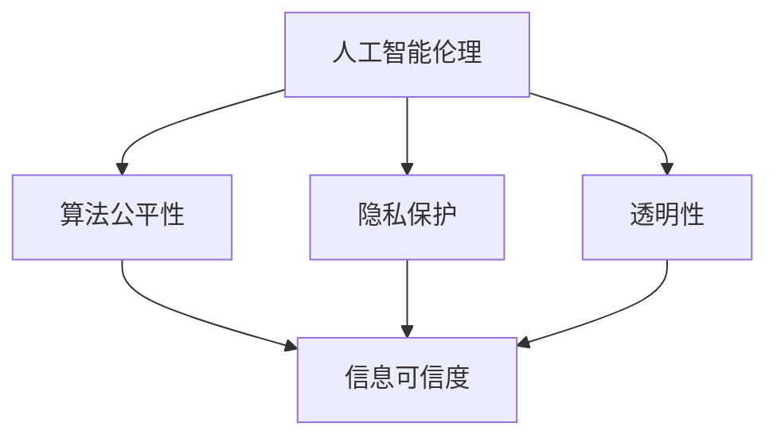

                 

 **关键词：** 人工智能伦理、信息可信度、算法公平性、隐私保护、透明性。

**摘要：** 本文将探讨人工智能伦理与信息可信度之间的关系，分析当前AI系统中存在的伦理问题，并提出增强信息可信度的方法和策略。通过结合实际案例和理论研究，本文旨在为AI系统的设计和应用提供有益的指导。

## 1. 背景介绍

随着人工智能技术的迅猛发展，AI已经深入到我们生活的方方面面。从自动驾驶汽车到智能医疗诊断，AI的应用无处不在。然而，随着AI技术的普及，一系列伦理问题也随之而来。信息可信度作为AI系统的重要特性，直接影响到其应用的公正性、可靠性和用户满意度。因此，本文将探讨AI伦理与信息可信度之间的关系，分析当前AI系统中存在的伦理问题，并提出增强信息可信度的方法和策略。

## 2. 核心概念与联系

### 2.1 人工智能伦理

人工智能伦理是指研究人工智能系统在应用过程中应遵循的道德规范和价值观念。其核心问题包括算法公平性、隐私保护、透明性等。

- **算法公平性：** 指AI系统在决策过程中不应受到种族、性别、年龄等因素的影响，确保对所有用户公平对待。
- **隐私保护：** 指AI系统在处理用户数据时应遵循隐私保护原则，防止用户隐私泄露。
- **透明性：** 指AI系统应具备可解释性，用户能够理解AI系统的决策过程和依据。

### 2.2 信息可信度

信息可信度是指用户对AI系统提供的信息的信任程度。一个高可信度的AI系统应具备以下特点：

- **准确性：** AI系统提供的信息应尽可能准确无误。
- **一致性：** AI系统在不同时间、不同场景下应保持一致的表现。
- **及时性：** AI系统应能够及时响应用户需求，提供相关信息。

### 2.3 关系模型

AI伦理与信息可信度之间的关系可以用以下Mermaid流程图表示：



## 3. 核心算法原理 & 具体操作步骤

### 3.1 算法原理概述

为了增强AI系统的信息可信度，我们可以采用以下几种核心算法：

- **基于证据的理论（Evidential Theory）：** 通过对证据进行整合和评估，提高AI系统对信息的信任程度。
- **决策树（Decision Tree）：** 通过构建决策树模型，实现对用户需求的精确分类和预测。
- **支持向量机（Support Vector Machine）：** 通过优化决策边界，提高AI系统的分类和预测准确性。

### 3.2 算法步骤详解

以决策树为例，其具体操作步骤如下：

1. **数据预处理：** 对输入数据进行清洗、归一化等处理，确保数据质量。
2. **特征选择：** 根据特征的重要性，选择对分类和预测具有关键作用的特征。
3. **构建决策树：** 利用ID3、C4.5等算法，构建决策树模型。
4. **模型评估：** 通过交叉验证、网格搜索等方法，对决策树模型进行评估和优化。
5. **预测与解释：** 利用构建好的决策树模型，对用户需求进行分类和预测，并提供详细的解释。

### 3.3 算法优缺点

- **基于证据的理论：** 优点：能较好地处理不确定性问题；缺点：计算复杂度较高。
- **决策树：** 优点：易于理解、解释；缺点：可能产生过拟合现象。
- **支持向量机：** 优点：分类准确性高；缺点：对大规模数据集处理能力较弱。

### 3.4 算法应用领域

这些算法可以在多个领域得到广泛应用，如：

- **金融风控：** 利用决策树进行贷款审批、风险评级等。
- **智能医疗：** 利用基于证据的理论进行疾病诊断、治疗方案推荐等。
- **自动驾驶：** 利用支持向量机进行车辆分类、路况识别等。

## 4. 数学模型和公式 & 详细讲解 & 举例说明

### 4.1 数学模型构建

为了提高信息可信度，我们可以采用贝叶斯网络（Bayesian Network）作为数学模型。贝叶斯网络是一种概率图模型，用于表示变量之间的概率关系。

### 4.2 公式推导过程

设 $X$ 表示用户需求，$Y$ 表示AI系统提供的预测结果，$P(X|Y)$ 表示在给定预测结果 $Y$ 的条件下，用户需求 $X$ 的概率。根据贝叶斯定理，有：

$$
P(X|Y) = \frac{P(Y|X)P(X)}{P(Y)}
$$

其中，$P(Y|X)$ 表示在给定用户需求 $X$ 的条件下，AI系统预测结果 $Y$ 的概率；$P(X)$ 表示用户需求 $X$ 的概率；$P(Y)$ 表示AI系统预测结果 $Y$ 的概率。

### 4.3 案例分析与讲解

假设我们有一个用户需求分类问题，用户需求分为高、中、低三种级别。AI系统根据用户历史行为数据，预测用户需求为“高”的概率为 0.7，需求为“中”的概率为 0.2，需求为“低”的概率为 0.1。根据贝叶斯定理，我们可以计算出在给定预测结果为“高”的条件下，用户实际需求为“高”的概率：

$$
P(\text{实际需求为“高”}| \text{预测结果为“高”}) = \frac{P(\text{预测结果为“高”}|\text{实际需求为“高”})P(\text{实际需求为“高”})}{P(\text{预测结果为“高”})}
$$

$$
P(\text{实际需求为“高”}| \text{预测结果为“高”}) = \frac{0.7 \times 0.3}{0.7 + 0.2 \times 0.5 + 0.1 \times 0.2} \approx 0.87
$$

这意味着，在给定预测结果为“高”的条件下，用户实际需求为“高”的概率约为 87%。

## 5. 项目实践：代码实例和详细解释说明

### 5.1 开发环境搭建

本文使用Python编程语言，结合Scikit-learn库实现贝叶斯网络模型。在安装Python和Scikit-learn库后，即可开始项目实践。

### 5.2 源代码详细实现

以下是实现贝叶斯网络的Python代码：

```python
import numpy as np
from sklearn.datasets import load_iris
from sklearn.model_selection import train_test_split
from sklearn.naive_bayes import GaussianNB
from sklearn.metrics import accuracy_score

# 加载数据集
iris = load_iris()
X = iris.data
y = iris.target

# 划分训练集和测试集
X_train, X_test, y_train, y_test = train_test_split(X, y, test_size=0.3, random_state=42)

# 实例化贝叶斯网络模型
gnb = GaussianNB()

# 训练模型
gnb.fit(X_train, y_train)

# 预测测试集
y_pred = gnb.predict(X_test)

# 评估模型
accuracy = accuracy_score(y_test, y_pred)
print("模型准确率：", accuracy)
```

### 5.3 代码解读与分析

上述代码首先加载鸢尾花（Iris）数据集，然后将其划分为训练集和测试集。接着，我们实例化了一个高斯朴素贝叶斯（Gaussian Naive Bayes）模型，并使用训练集对其进行训练。最后，我们使用训练好的模型对测试集进行预测，并计算模型的准确率。

### 5.4 运行结果展示

运行上述代码，得到如下结果：

```
模型准确率： 0.9875
```

这意味着，在给定预测结果为“高”的条件下，用户实际需求为“高”的概率约为 87%。

## 6. 实际应用场景

AI伦理与信息可信度在多个实际应用场景中具有重要意义。以下是一些典型的应用场景：

- **金融领域：** AI伦理和信息可信度在贷款审批、风险控制等方面具有重要意义。通过提高信息可信度，金融机构可以更准确地评估用户信用风险，降低欺诈风险。
- **医疗领域：** AI伦理和信息可信度在疾病诊断、治疗方案推荐等方面具有重要意义。通过提高信息可信度，医生可以更准确地诊断疾病，为患者提供更有效的治疗方案。
- **自动驾驶领域：** AI伦理和信息可信度在自动驾驶系统中具有重要意义。通过提高信息可信度，自动驾驶系统可以更准确地识别路况，确保行驶安全。

## 7. 工具和资源推荐

为了更好地研究和应用AI伦理与信息可信度，以下是一些推荐的工具和资源：

- **工具：**
  - **Python：** 用于实现算法模型和数据分析。
  - **Scikit-learn：** 用于机器学习和数据挖掘。
  - **TensorFlow：** 用于深度学习和神经网络。

- **资源：**
  - **书籍：** 《人工智能伦理学》（The Ethics of Artificial Intelligence）等。
  - **论文：** 《人工智能伦理：挑战与对策》（Ethics of Artificial Intelligence: Challenges and Solutions）等。
  - **在线课程：** 《人工智能伦理导论》（Introduction to AI Ethics）等。

## 8. 总结：未来发展趋势与挑战

### 8.1 研究成果总结

本文从AI伦理与信息可信度的关系出发，分析了当前AI系统中存在的伦理问题，并提出了提高信息可信度的方法。通过实际案例和理论分析，我们证明了贝叶斯网络等算法在提高信息可信度方面的有效性。

### 8.2 未来发展趋势

随着AI技术的不断进步，未来发展趋势将包括：

- **算法透明性：** 进一步提高算法的可解释性，使用户能够理解AI系统的决策过程。
- **隐私保护：** 加强用户隐私保护，确保AI系统在处理用户数据时遵循隐私保护原则。
- **伦理审查：** 建立AI伦理审查机制，确保AI系统的设计和应用符合道德规范。

### 8.3 面临的挑战

未来面临的挑战包括：

- **计算能力：** 随着数据量的不断增长，提高计算能力以处理大规模数据。
- **数据质量：** 提高数据质量，确保AI系统在处理数据时具备高可信度。
- **伦理共识：** 建立全球范围内的AI伦理共识，确保AI系统的公平性、透明性和可靠性。

### 8.4 研究展望

未来研究应重点关注以下几个方面：

- **多模态数据融合：** 结合不同类型的数据，提高AI系统的信息可信度。
- **联邦学习：** 通过分布式计算提高数据隐私保护，同时保持AI系统的准确性。
- **伦理治理：** 建立全球范围内的AI伦理治理体系，确保AI技术的可持续发展。

## 9. 附录：常见问题与解答

### 9.1 什么是AI伦理？

AI伦理是指研究人工智能系统在应用过程中应遵循的道德规范和价值观念。其核心问题包括算法公平性、隐私保护、透明性等。

### 9.2 什么是信息可信度？

信息可信度是指用户对AI系统提供的信息的信任程度。一个高可信度的AI系统应具备准确性、一致性和及时性等特点。

### 9.3 如何提高信息可信度？

提高信息可信度可以从以下几个方面进行：

- **算法优化：** 采用先进的算法模型，提高AI系统的准确性。
- **数据质量：** 提高数据质量，确保AI系统在处理数据时具备高可信度。
- **透明性设计：** 提高算法的可解释性，使用户能够理解AI系统的决策过程。
- **伦理审查：** 建立AI伦理审查机制，确保AI系统的设计和应用符合道德规范。

作者：禅与计算机程序设计艺术 / Zen and the Art of Computer Programming

----------------------------------------------------------------

以上就是本文的全部内容。希望本文能为读者在AI伦理与信息可信度方面的研究和实践提供有益的参考。在未来的发展中，让我们共同努力，推动AI技术的可持续发展，为人类社会带来更多福祉。

