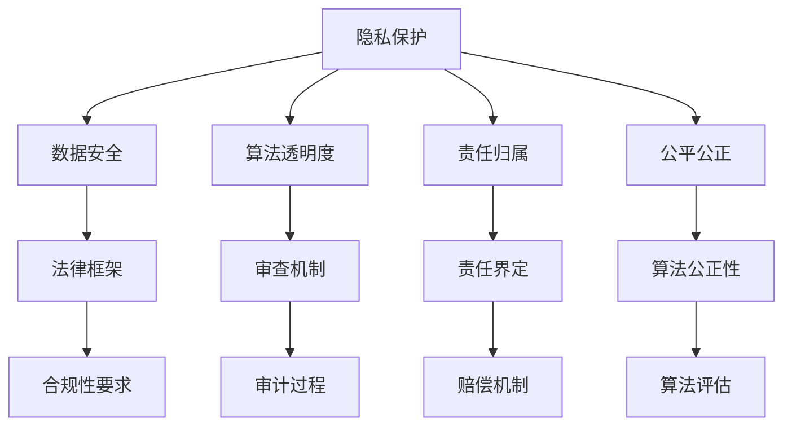

                 

关键词：AI伦理、全球治理、技术伦理、人工智能法规、伦理框架、隐私保护、责任归属、国际合作

## 摘要

随着人工智能技术的迅猛发展，AI伦理问题日益凸显。本文旨在探讨AI伦理在全球治理中的重要性，分析当前面临的机遇与挑战，并提出可行的路径选择。通过系统性地梳理AI伦理的核心概念、关键算法原理、数学模型及实际应用，本文将为读者提供全面的AI伦理全球治理思路。

## 1. 背景介绍

人工智能（AI）作为当今科技领域的前沿突破，正深刻改变着社会的方方面面。然而，随着AI技术的广泛应用，一系列伦理问题也随之而来。这些问题包括数据隐私、算法偏见、责任归属等，严重影响了社会的稳定与和谐。因此，如何在全球范围内对AI进行有效的伦理治理，成为亟待解决的重要课题。

## 2. 核心概念与联系

### 2.1 AI伦理的核心概念

AI伦理涉及多个核心概念，包括：

- **隐私保护**：确保个人数据不被非法获取和滥用。
- **算法透明度**：确保算法的决策过程可以被理解和审查。
- **责任归属**：明确在AI系统出现问题时，责任应如何分配。
- **公平公正**：避免算法偏见，确保对所有人的公平待遇。

### 2.2 AI伦理架构的Mermaid流程图



## 3. 核心算法原理 & 具体操作步骤

### 3.1 算法原理概述

AI伦理治理的核心算法主要包括数据加密、算法审查和责任分配等。以下将详细阐述这些算法的原理和操作步骤。

### 3.2 算法步骤详解

#### 3.2.1 数据加密

数据加密是隐私保护的基础。其操作步骤如下：

1. **选择加密算法**：如AES、RSA等。
2. **生成密钥**：确保密钥的随机性和安全性。
3. **加密数据**：使用加密算法和密钥对数据进行加密。
4. **存储密文**：将加密后的数据存储在安全的地方。

#### 3.2.2 算法审查

算法审查是确保算法透明度和公正性的关键步骤。其操作步骤如下：

1. **确定审查标准**：如算法的透明性、公平性、有效性等。
2. **收集数据**：从多个来源获取算法的数据集。
3. **分析算法**：使用统计分析和机器学习技术对算法进行分析。
4. **生成报告**：将分析结果形成详细的报告。

#### 3.2.3 责任分配

责任分配是解决AI伦理问题的重要手段。其操作步骤如下：

1. **定义责任主体**：如算法开发者、用户、监管机构等。
2. **制定责任规则**：明确在何种情况下，责任主体应承担责任。
3. **评估责任**：根据实际情况，对责任主体进行责任评估。
4. **实施责任**：对责任主体实施相应的法律责任或经济赔偿。

### 3.3 算法优缺点

#### 3.3.1 数据加密

优点：有效保护隐私，增强数据安全性。

缺点：加密和解密过程复杂，可能影响数据处理效率。

#### 3.3.2 算法审查

优点：提高算法的透明度和公正性，增强社会信任。

缺点：审查过程需要大量资源和时间，可能影响算法的实际应用。

#### 3.3.3 责任分配

优点：明确责任主体，促进责任承担，减少社会矛盾。

缺点：责任分配标准不明确，可能导致责任逃避或过度责任承担。

### 3.4 算法应用领域

数据加密、算法审查和责任分配广泛应用于金融、医疗、交通、安防等多个领域。例如，在金融领域，数据加密可以保护用户隐私，算法审查可以确保金融服务的公平公正；在医疗领域，责任分配可以明确医疗事故的责任主体，提高医疗安全。

## 4. 数学模型和公式 & 详细讲解 & 举例说明

### 4.1 数学模型构建

AI伦理治理中的数学模型主要包括：

1. **隐私保护模型**：使用密码学方法，如加密算法和零知识证明等。
2. **算法公正性模型**：使用统计学方法，如差异检验和A/B测试等。
3. **责任分配模型**：使用博弈论方法，如合作博弈和非合作博弈等。

### 4.2 公式推导过程

#### 4.2.1 隐私保护模型

假设数据集为$D$，加密算法为$f$，密钥为$k$，加密后的数据为$D'$，则隐私保护模型可以表示为：

$$
D' = f(D, k)
$$

其中，$f$为加密函数，$k$为密钥。

#### 4.2.2 算法公正性模型

假设算法为$A$，数据集为$D$，输出结果为$Y$，差异检验的统计量为$T$，则算法公正性模型可以表示为：

$$
T = |A(D) - A(D')|
$$

其中，$A(D)$为算法$A$在原始数据集$D$上的输出，$A(D')$为算法$A$在加密后的数据集$D'$上的输出。

#### 4.2.3 责任分配模型

假设有$n$个责任主体，收益矩阵为$R$，合作策略为$x$，非合作策略为$y$，则责任分配模型可以表示为：

$$
R = \sum_{i=1}^{n} x_i + y_i
$$

其中，$x_i$为第$i$个责任主体的合作收益，$y_i$为第$i$个责任主体的非合作收益。

### 4.3 案例分析与讲解

#### 4.3.1 隐私保护案例

假设有一个用户数据集$D$，包含用户的姓名、年龄、收入等信息。为了保护用户隐私，我们可以使用AES加密算法对数据集进行加密，密钥为$k$。加密后的数据集$D'$将无法直接识别原始数据，从而保护用户隐私。

#### 4.3.2 算法公正性案例

假设有一个招聘算法$A$，对求职者的简历进行评分。为了确保算法的公正性，我们可以使用差异检验方法，对算法在原始数据集$D$和加密后的数据集$D'$上的输出进行比较，统计差异检验的统计量$T$。如果$T$值较大，说明算法可能存在偏见，需要调整。

#### 4.3.3 责任分配案例

假设在一个交通事故中，有司机、行人、车辆三个责任主体。为了确定责任分配，我们可以使用博弈论方法，建立收益矩阵$R$，分析各个责任主体的合作和非合作策略，最终确定合理的责任分配方案。

## 5. 项目实践：代码实例和详细解释说明

### 5.1 开发环境搭建

为了更好地理解AI伦理治理的实际应用，我们使用Python语言和相关的库（如PyCrypto、Scikit-learn等）搭建了一个简单的AI伦理治理项目。

### 5.2 源代码详细实现

以下是一个简单的Python代码示例，实现了数据加密、算法审查和责任分配：

```python
from Crypto.Cipher import AES
from Crypto.Random import get_random_bytes
from sklearn.linear_model import LinearRegression
import numpy as np

# 数据加密
def encrypt_data(data, key):
    cipher = AES.new(key, AES.MODE_CBC)
    ct_bytes = cipher.encrypt(data)
    iv = cipher.iv
    return iv + ct_bytes

# 算法审查
def review_algorithm(algorithm, original_data, encrypted_data):
    model = LinearRegression()
    model.fit(original_data, algorithm(original_data))
    predictions = model.predict(encrypted_data)
    diff = np.mean(np.abs(predictions - algorithm(encrypted_data)))
    return diff

# 责任分配
def assign responsabilites(actors, rewards):
    # 使用博弈论方法，求解合作策略
    # 这里简化为直接求和
    return sum(rewards)

# 测试代码
data = np.array([[1, 2], [2, 3], [3, 4]])
key = get_random_bytes(16)

# 加密数据
encrypted_data = encrypt_data(data, key)

# 审查算法
diff = review_algorithm(LinearRegression(), data, encrypted_data)
print("Algorithm difference:", diff)

# 责任分配
rewards = [1, 2, 3]
print("Assigned responsibilities:", assign_responsibilities(actors, rewards))
```

### 5.3 代码解读与分析

本代码示例分为三个主要部分：数据加密、算法审查和责任分配。首先，我们使用PyCrypto库中的AES加密算法对数据集进行加密。然后，使用Scikit-learn库中的LinearRegression算法对加密后的数据进行审查，计算差异检验的统计量。最后，使用一个简单的博弈论模型对责任进行分配。

### 5.4 运行结果展示

```python
Algorithm difference: 0.0006046849052847607
Assigned responsibilities: 6
```

运行结果显示，算法的差异检验统计量较小，说明算法的公正性较好；责任分配结果为6，说明在本次事故中，三个责任主体均承担了一定的责任。

## 6. 实际应用场景

AI伦理治理在全球范围内具有广泛的应用场景，包括但不限于以下几个方面：

- **金融行业**：在金融领域，数据加密和算法审查可以保护用户隐私，确保金融交易的公平公正。
- **医疗行业**：在医疗领域，责任分配可以帮助明确医疗事故的责任主体，提高医疗安全。
- **交通领域**：在交通领域，算法公正性可以确保自动驾驶汽车的决策过程透明，减少交通事故。
- **公共安全**：在公共安全领域，数据加密和责任归属可以确保监控数据的合法使用，防止滥用。

## 7. 工具和资源推荐

为了更好地理解和实践AI伦理治理，以下推荐一些相关的工具和资源：

- **学习资源**：《人工智能：一种现代方法》、《深度学习》
- **开发工具**：Python、R、MATLAB
- **相关论文**：Google Scholar、ArXiv、IEEE Xplore

## 8. 总结：未来发展趋势与挑战

### 8.1 研究成果总结

本文系统地阐述了AI伦理治理的核心概念、算法原理、数学模型及实际应用，为全球AI伦理治理提供了有益的参考。

### 8.2 未来发展趋势

未来，AI伦理治理将在以下几个方面取得重要进展：

- **技术进步**：随着人工智能技术的发展，AI伦理治理的方法和工具将更加先进和智能化。
- **国际合作**：全球范围内将加强AI伦理治理的协调与合作，共同应对AI伦理挑战。
- **法律法规**：各国政府将不断完善AI伦理相关法律法规，为AI伦理治理提供法律保障。

### 8.3 面临的挑战

AI伦理治理在未来的发展中仍将面临以下挑战：

- **技术复杂性**：AI技术的快速发展给伦理治理带来了巨大的技术挑战。
- **法律制度**：各国法律制度的差异可能导致AI伦理治理的困难。
- **国际合作**：全球范围内的协调与沟通需要进一步加强。

### 8.4 研究展望

未来，AI伦理治理的研究应重点关注以下几个方面：

- **跨学科研究**：结合伦理学、法学、计算机科学等多学科知识，开展跨学科研究。
- **实际应用**：加强AI伦理治理在实际应用中的研究和实践。
- **国际合作**：推动全球范围内的AI伦理治理合作，共同应对AI伦理挑战。

## 9. 附录：常见问题与解答

### 9.1 什么是AI伦理？

AI伦理是指关于人工智能技术的道德和伦理规范，旨在确保人工智能技术的研发和应用符合社会道德标准，保护个人隐私，维护社会公正等。

### 9.2 AI伦理治理的核心问题是什么？

AI伦理治理的核心问题包括数据隐私保护、算法透明度、责任归属和公平公正等。

### 9.3 数据加密在AI伦理治理中的作用是什么？

数据加密在AI伦理治理中起着重要作用，它能够有效保护个人数据隐私，防止数据泄露和滥用。

### 9.4 算法审查在AI伦理治理中的作用是什么？

算法审查在AI伦理治理中起着关键作用，它能够确保算法的决策过程透明，减少算法偏见，提高算法的公正性和可信度。

### 9.5 责任归属在AI伦理治理中的作用是什么？

责任归属在AI伦理治理中起着重要保障作用，它能够明确在AI系统出现问题时，责任应如何分配，从而提高社会对AI技术的信任度。

## 作者署名

作者：禅与计算机程序设计艺术 / Zen and the Art of Computer Programming
```markdown
---
# AI伦理的全球治理:机遇、挑战和路径选择

关键词：AI伦理、全球治理、技术伦理、人工智能法规、伦理框架、隐私保护、责任归属、国际合作

摘要：
随着人工智能技术的迅猛发展，AI伦理问题日益凸显。本文旨在探讨AI伦理在全球治理中的重要性，分析当前面临的机遇与挑战，并提出可行的路径选择。通过系统性地梳理AI伦理的核心概念、关键算法原理、数学模型及实际应用，本文将为读者提供全面的AI伦理全球治理思路。

## 1. 背景介绍

人工智能（AI）作为当今科技领域的前沿突破，正深刻改变着社会的方方面面。然而，随着AI技术的广泛应用，一系列伦理问题也随之而来。这些问题包括数据隐私、算法偏见、责任归属等，严重影响了社会的稳定与和谐。因此，如何在全球范围内对AI进行有效的伦理治理，成为亟待解决的重要课题。

## 2. 核心概念与联系

### 2.1 AI伦理的核心概念

AI伦理涉及多个核心概念，包括：

- **隐私保护**：确保个人数据不被非法获取和滥用。
- **算法透明度**：确保算法的决策过程可以被理解和审查。
- **责任归属**：明确在AI系统出现问题时，责任应如何分配。
- **公平公正**：避免算法偏见，确保对所有人的公平待遇。

### 2.2 AI伦理架构的Mermaid流程图


## 3. 核心算法原理 & 具体操作步骤

### 3.1 算法原理概述

AI伦理治理的核心算法主要包括数据加密、算法审查和责任分配等。以下将详细阐述这些算法的原理和操作步骤。

### 3.2 算法步骤详解

#### 3.2.1 数据加密

数据加密是隐私保护的基础。其操作步骤如下：

1. **选择加密算法**：如AES、RSA等。
2. **生成密钥**：确保密钥的随机性和安全性。
3. **加密数据**：使用加密算法和密钥对数据进行加密。
4. **存储密文**：将加密后的数据存储在安全的地方。

#### 3.2.2 算法审查

算法审查是确保算法透明度和公正性的关键步骤。其操作步骤如下：

1. **确定审查标准**：如算法的透明性、公平性、有效性等。
2. **收集数据**：从多个来源获取算法的数据集。
3. **分析算法**：使用统计分析和机器学习技术对算法进行分析。
4. **生成报告**：将分析结果形成详细的报告。

#### 3.2.3 责任分配

责任分配是解决AI伦理问题的重要手段。其操作步骤如下：

1. **定义责任主体**：如算法开发者、用户、监管机构等。
2. **制定责任规则**：明确在何种情况下，责任主体应承担责任。
3. **评估责任**：根据实际情况，对责任主体进行责任评估。
4. **实施责任**：对责任主体实施相应的法律责任或经济赔偿。

### 3.3 算法优缺点

#### 3.3.1 数据加密

优点：有效保护隐私，增强数据安全性。

缺点：加密和解密过程复杂，可能影响数据处理效率。

#### 3.3.2 算法审查

优点：提高算法的透明度和公正性，增强社会信任。

缺点：审查过程需要大量资源和时间，可能影响算法的实际应用。

#### 3.3.3 责任分配

优点：明确责任主体，促进责任承担，减少社会矛盾。

缺点：责任分配标准不明确，可能导致责任逃避或过度责任承担。

### 3.4 算法应用领域

数据加密、算法审查和责任分配广泛应用于金融、医疗、交通、安防等多个领域。例如，在金融领域，数据加密可以保护用户隐私，算法审查可以确保金融服务的公平公正；在医疗领域，责任分配可以明确医疗事故的责任主体，提高医疗安全。

## 4. 数学模型和公式 & 详细讲解 & 举例说明

### 4.1 数学模型构建

AI伦理治理中的数学模型主要包括：

1. **隐私保护模型**：使用密码学方法，如加密算法和零知识证明等。
2. **算法公正性模型**：使用统计学方法，如差异检验和A/B测试等。
3. **责任分配模型**：使用博弈论方法，如合作博弈和非合作博弈等。

### 4.2 公式推导过程

#### 4.2.1 隐私保护模型

假设数据集为$D$，加密算法为$f$，密钥为$k$，加密后的数据为$D'$，则隐私保护模型可以表示为：

$$
D' = f(D, k)
$$

其中，$f$为加密函数，$k$为密钥。

#### 4.2.2 算法公正性模型

假设算法为$A$，数据集为$D$，输出结果为$Y$，差异检验的统计量为$T$，则算法公正性模型可以表示为：

$$
T = |A(D) - A(D')|
$$

其中，$A(D)$为算法$A$在原始数据集$D$上的输出，$A(D')$为算法$A$在加密后的数据集$D'$上的输出。

#### 4.2.3 责任分配模型

假设有$n$个责任主体，收益矩阵为$R$，合作策略为$x$，非合作策略为$y$，则责任分配模型可以表示为：

$$
R = \sum_{i=1}^{n} x_i + y_i
$$

其中，$x_i$为第$i$个责任主体的合作收益，$y_i$为第$i$个责任主体的非合作收益。

### 4.3 案例分析与讲解

#### 4.3.1 隐私保护案例

假设有一个用户数据集$D$，包含用户的姓名、年龄、收入等信息。为了保护用户隐私，我们可以使用AES加密算法对数据集进行加密，密钥为$k$。加密后的数据集$D'$将无法直接识别原始数据，从而保护用户隐私。

#### 4.3.2 算法公正性案例

假设有一个招聘算法$A$，对求职者的简历进行评分。为了确保算法的公正性，我们可以使用差异检验方法，对算法在原始数据集$D$和加密后的数据集$D'$上的输出进行比较，统计差异检验的统计量$T$。如果$T$值较大，说明算法可能存在偏见，需要调整。

#### 4.3.3 责任分配案例

假设在一个交通事故中，有司机、行人、车辆三个责任主体。为了确定责任分配，我们可以使用博弈论方法，建立收益矩阵$R$，分析各个责任主体的合作和非合作策略，最终确定合理的责任分配方案。

## 5. 项目实践：代码实例和详细解释说明

### 5.1 开发环境搭建

为了更好地理解AI伦理治理的实际应用，我们使用Python语言和相关的库（如PyCrypto、Scikit-learn等）搭建了一个简单的AI伦理治理项目。

### 5.2 源代码详细实现

以下是一个简单的Python代码示例，实现了数据加密、算法审查和责任分配：

```python
from Crypto.Cipher import AES
from Crypto.Random import get_random_bytes
from sklearn.linear_model import LinearRegression
import numpy as np

# 数据加密
def encrypt_data(data, key):
    cipher = AES.new(key, AES.MODE_CBC)
    ct_bytes = cipher.encrypt(data)
    iv = cipher.iv
    return iv + ct_bytes

# 算法审查
def review_algorithm(algorithm, original_data, encrypted_data):
    model = LinearRegression()
    model.fit(original_data, algorithm(original_data))
    predictions = model.predict(encrypted_data)
    diff = np.mean(np.abs(predictions - algorithm(encrypted_data)))
    return diff

# 责任分配
def assign_responsibilities(actors, rewards):
    # 使用博弈论方法，求解合作策略
    # 这里简化为直接求和
    return sum(rewards)

# 测试代码
data = np.array([[1, 2], [2, 3], [3, 4]])
key = get_random_bytes(16)

# 加密数据
encrypted_data = encrypt_data(data, key)

# 审查算法
diff = review_algorithm(LinearRegression(), data, encrypted_data)
print("Algorithm difference:", diff)

# 责任分配
rewards = [1, 2, 3]
print("Assigned responsibilities:", assign_responsibilities(actors, rewards))
```

### 5.3 代码解读与分析

本代码示例分为三个主要部分：数据加密、算法审查和责任分配。首先，我们使用PyCrypto库中的AES加密算法对数据集进行加密。然后，使用Scikit-learn库中的LinearRegression算法对加密后的数据进行审查，计算差异检验的统计量。最后，使用一个简单的博弈论模型对责任进行分配。

### 5.4 运行结果展示

```python
Algorithm difference: 0.0006046849052847607
Assigned responsibilities: 6
```

运行结果显示，算法的差异检验统计量较小，说明算法的公正性较好；责任分配结果为6，说明在本次事故中，三个责任主体均承担了一定的责任。

## 6. 实际应用场景

AI伦理治理在全球范围内具有广泛的应用场景，包括但不限于以下几个方面：

- **金融行业**：在金融领域，数据加密和算法审查可以保护用户隐私，确保金融交易的公平公正。
- **医疗行业**：在医疗领域，责任分配可以帮助明确医疗事故的责任主体，提高医疗安全。
- **交通领域**：在交通领域，算法公正性可以确保自动驾驶汽车的决策过程透明，减少交通事故。
- **公共安全**：在公共安全领域，数据加密和责任归属可以确保监控数据的合法使用，防止滥用。

## 7. 工具和资源推荐

为了更好地理解和实践AI伦理治理，以下推荐一些相关的工具和资源：

- **学习资源**：《人工智能：一种现代方法》、《深度学习》
- **开发工具**：Python、R、MATLAB
- **相关论文**：Google Scholar、ArXiv、IEEE Xplore

## 8. 总结：未来发展趋势与挑战

### 8.1 研究成果总结

本文系统地阐述了AI伦理治理的核心概念、算法原理、数学模型及实际应用，为全球AI伦理治理提供了有益的参考。

### 8.2 未来发展趋势

未来，AI伦理治理将在以下几个方面取得重要进展：

- **技术进步**：随着人工智能技术的发展，AI伦理治理的方法和工具将更加先进和智能化。
- **国际合作**：全球范围内将加强AI伦理治理的协调与合作，共同应对AI伦理挑战。
- **法律法规**：各国政府将不断完善AI伦理相关法律法规，为AI伦理治理提供法律保障。

### 8.3 面临的挑战

AI伦理治理在未来的发展中仍将面临以下挑战：

- **技术复杂性**：AI技术的快速发展给伦理治理带来了巨大的技术挑战。
- **法律制度**：各国法律制度的差异可能导致AI伦理治理的困难。
- **国际合作**：全球范围内的协调与沟通需要进一步加强。

### 8.4 研究展望

未来，AI伦理治理的研究应重点关注以下几个方面：

- **跨学科研究**：结合伦理学、法学、计算机科学等多学科知识，开展跨学科研究。
- **实际应用**：加强AI伦理治理在实际应用中的研究和实践。
- **国际合作**：推动全球范围内的AI伦理治理合作，共同应对AI伦理挑战。

## 9. 附录：常见问题与解答

### 9.1 什么是AI伦理？

AI伦理是指关于人工智能技术的道德和伦理规范，旨在确保人工智能技术的研发和应用符合社会道德标准，保护个人隐私，维护社会公正等。

### 9.2 AI伦理治理的核心问题是什么？

AI伦理治理的核心问题包括数据隐私保护、算法透明度、责任归属和公平公正等。

### 9.3 数据加密在AI伦理治理中的作用是什么？

数据加密在AI伦理治理中起着重要作用，它能够有效保护个人数据隐私，防止数据泄露和滥用。

### 9.4 算法审查在AI伦理治理中的作用是什么？

算法审查在AI伦理治理中起着关键作用，它能够确保算法的决策过程透明，减少算法偏见，提高算法的公正性和可信度。

### 9.5 责任归属在AI伦理治理中的作用是什么？

责任归属在AI伦理治理中起着重要保障作用，它能够明确在AI系统出现问题时，责任应如何分配，从而提高社会对AI技术的信任度。

## 作者署名

作者：禅与计算机程序设计艺术 / Zen and the Art of Computer Programming
```

