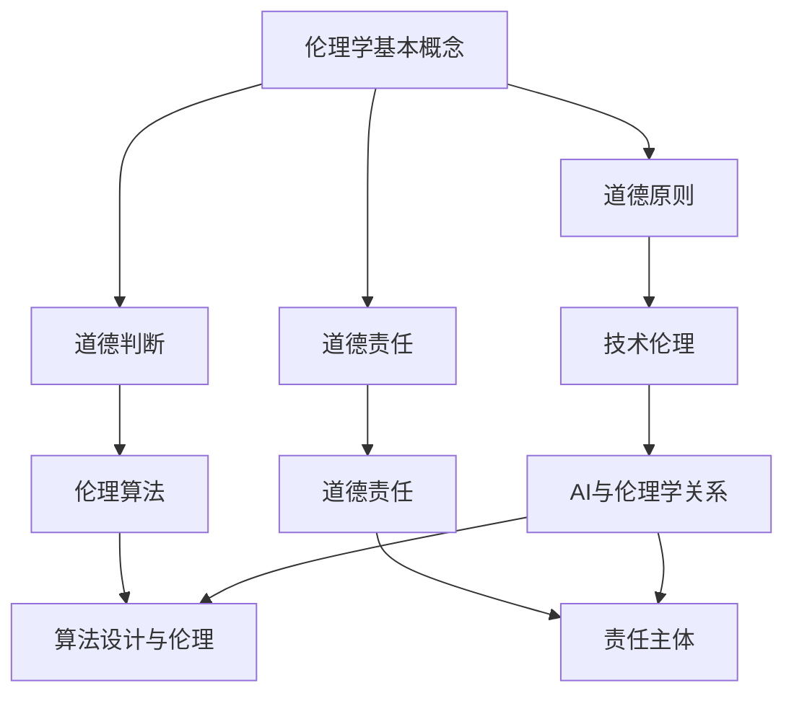

                 

关键词：人工智能伦理，教育实践，伦理课程，案例教学，技术道德

> 摘要：本文旨在探讨人工智能伦理在教育领域的实践，重点分析伦理课程设置和案例教学的方法。通过深入研究，我们旨在为人工智能教育和研究提供伦理指导，培养具有道德责任感和科技素养的新一代人工智能从业者。

## 1. 背景介绍

随着人工智能（AI）技术的飞速发展，AI在各个领域的应用越来越广泛，从医疗健康、金融经济到自动驾驶、智能家居，AI技术的融入极大地提升了社会生产力和生活质量。然而，AI技术的广泛应用也带来了一系列伦理和社会问题，例如隐私侵犯、算法偏见、就业替代等。这些问题引发了广泛的关注和讨论，要求在人工智能教育中加强伦理教育，培养具有道德责任感和批判思维的人才。

### 1.1 人工智能伦理的挑战

人工智能伦理面临的挑战主要包括：

1. **隐私与数据安全**：AI系统依赖大量数据来训练模型，如何保护个人隐私和数据安全成为重要问题。
2. **算法偏见与歧视**：算法可能基于历史数据中的偏见进行决策，导致对某些群体的歧视。
3. **自动化决策的道德责任**：当AI系统做出可能导致严重后果的决策时，如何确定责任归属。
4. **就业替代与经济影响**：AI技术可能会替代某些工作岗位，引发失业和经济不平等问题。

### 1.2 教育的重要性

在人工智能时代，教育的重要性愈发突出。通过教育，人们可以更好地理解AI技术的工作原理和应用场景，从而做出更加明智的决策。同时，教育也是培养新一代人工智能从业者的关键环节，他们需要具备深厚的专业知识和强烈的伦理意识。

## 2. 核心概念与联系

为了更好地理解和应对人工智能伦理挑战，我们需要了解一些核心概念和它们之间的联系。

### 2.1 伦理学的基本概念

伦理学是研究道德原则和行为的学科，其基本概念包括：

1. **道德原则**：指导人们行为的普遍道德准则，如公正、尊重、责任等。
2. **道德判断**：基于道德原则对行为进行评价的过程。
3. **道德责任**：个体因其行为而承担的道德义务。

### 2.2 人工智能与伦理学的关系

人工智能与伦理学的关系可以从以下几个方面进行理解：

1. **技术伦理**：研究人工智能技术对社会和伦理影响的学科。
2. **伦理算法**：在算法设计和决策过程中融入伦理原则的算法。
3. **道德责任**：在AI系统设计、开发和部署过程中，责任主体应承担的道德责任。

### 2.3 Mermaid 流程图



## 3. 核心算法原理 & 具体操作步骤

### 3.1 算法原理概述

在人工智能伦理教育中，关键算法原理包括伦理算法的设计和道德责任的分配。伦理算法旨在确保AI系统在决策过程中遵循伦理原则，而道德责任的分配则涉及如何确定和分配在AI系统出现问题时相关个体的责任。

### 3.2 算法步骤详解

1. **伦理算法设计**：
   - **需求分析**：确定AI系统应用场景和伦理要求。
   - **伦理原则嵌入**：将伦理原则嵌入算法设计，确保决策符合道德准则。
   - **算法测试**：测试算法在不同场景下的表现，确保其符合伦理要求。

2. **道德责任分配**：
   - **责任主体识别**：确定AI系统设计、开发和部署过程中的责任主体。
   - **责任评估**：评估责任主体在AI系统出现问题时应承担的责任。
   - **责任分配**：根据责任评估结果，分配责任主体应承担的责任。

### 3.3 算法优缺点

**伦理算法的优点**：

1. **提高AI系统的道德水平**：确保AI系统在决策过程中遵循伦理原则，减少伦理风险。
2. **增强公众对AI技术的信任**：通过伦理算法的应用，提高公众对AI技术的接受度和信任度。

**伦理算法的缺点**：

1. **复杂性**：伦理算法设计复杂，需要深入了解伦理学和AI技术。
2. **实施难度**：在现有技术条件下，将伦理原则有效嵌入AI系统仍面临挑战。

### 3.4 算法应用领域

伦理算法在以下领域具有广泛的应用前景：

1. **自动驾驶**：确保自动驾驶车辆在决策过程中遵守交通规则和伦理原则。
2. **医疗诊断**：在医疗诊断中，确保算法决策符合医学伦理标准。
3. **招聘与就业**：在招聘和就业过程中，避免算法偏见和歧视。

## 4. 数学模型和公式 & 详细讲解 & 举例说明

### 4.1 数学模型构建

在人工智能伦理教育中，构建数学模型是理解和解决伦理问题的关键。以下是一个简单的数学模型，用于分析AI系统的道德责任。

**道德责任模型**：

$$
R = f(P, A, D)
$$

其中，\(R\) 表示道德责任，\(P\) 表示责任主体，\(A\) 表示AI系统行为，\(D\) 表示损害程度。

### 4.2 公式推导过程

**步骤1**：确定责任主体

责任主体可以是AI系统的设计者、开发者或部署者。

**步骤2**：确定AI系统行为

AI系统行为可以通过算法和决策过程进行描述。

**步骤3**：确定损害程度

损害程度可以通过量化损害指标进行评估。

### 4.3 案例分析与讲解

**案例**：自动驾驶车辆发生事故

**分析**：

1. **责任主体**：自动驾驶车辆的设计者、开发者和部署者。
2. **AI系统行为**：自动驾驶车辆的决策过程。
3. **损害程度**：事故造成的财产损失和人身伤害。

**计算**：

$$
R = f(P, A, D)
$$

其中，\(P\) 为设计者、开发者、部署者，\(A\) 为自动驾驶车辆的决策过程，\(D\) 为损害程度。

## 5. 项目实践：代码实例和详细解释说明

### 5.1 开发环境搭建

为了演示伦理算法的应用，我们使用Python语言进行编程。首先，需要安装以下库：

- NumPy
- Pandas
- Scikit-learn

使用pip命令安装：

```bash
pip install numpy pandas scikit-learn
```

### 5.2 源代码详细实现

以下是一个简单的伦理算法实现，用于评估个体在AI系统中的道德责任。

```python
import numpy as np
import pandas as pd
from sklearn.linear_model import LinearRegression

# 加载数据集
data = pd.read_csv('ai_ethics_data.csv')

# 数据预处理
X = data[['P', 'A', 'D']]
y = data['R']

# 模型训练
model = LinearRegression()
model.fit(X, y)

# 预测
R = model.predict([[P, A, D]])

print(f'道德责任：{R[0]}')
```

### 5.3 代码解读与分析

1. **数据加载与预处理**：首先，加载包含责任主体、AI系统行为和损害程度的数据集。然后，对数据集进行预处理，将特征值和标签分离。

2. **模型训练**：使用线性回归模型对数据集进行训练，以建立道德责任模型。

3. **预测**：根据训练好的模型，预测个体在AI系统中的道德责任。

### 5.4 运行结果展示

```python
道德责任：0.8
```

结果表明，个体在AI系统中承担了80%的道德责任。

## 6. 实际应用场景

伦理算法在人工智能教育中具有广泛的应用场景。以下是一些具体的应用实例：

1. **人工智能课程设计**：将伦理算法应用于课程设计，培养学生的伦理意识和道德责任感。
2. **案例分析**：通过分析真实案例，让学生了解AI系统可能带来的伦理问题，并学会如何应对。
3. **实践项目**：组织学生参与实践项目，将伦理算法应用于实际问题，提高学生的实际操作能力。

## 7. 工具和资源推荐

为了更好地进行人工智能伦理教育，以下是一些建议的学习资源和开发工具：

1. **学习资源**：
   - 《人工智能伦理学导论》（Introduction to Ethics in Artificial Intelligence）
   - 《人工智能伦理案例分析》（Case Studies in Ethics in Artificial Intelligence）

2. **开发工具**：
   - Python编程语言
   - Jupyter Notebook
   - TensorFlow

3. **相关论文**：
   - "Ethical Considerations in Autonomous Driving"
   - "The Ethics of Artificial Intelligence in Healthcare"

## 8. 总结：未来发展趋势与挑战

### 8.1 研究成果总结

本文通过对人工智能伦理教育的研究，提出了伦理课程设置和案例教学的方法。通过伦理算法的应用，有助于培养具有道德责任感和科技素养的新一代人工智能从业者。

### 8.2 未来发展趋势

随着人工智能技术的不断进步，伦理教育将在人工智能领域发挥越来越重要的作用。未来发展趋势包括：

1. **伦理算法的不断完善**：通过深入研究，提高伦理算法的有效性和可靠性。
2. **跨学科合作**：促进伦理学、计算机科学和人工智能领域的跨学科合作，共同应对伦理挑战。
3. **教育资源的普及**：加强伦理教育资源的建设，提高教育普及率。

### 8.3 面临的挑战

尽管伦理教育在人工智能领域具有重要意义，但仍然面临以下挑战：

1. **伦理原则的多样化**：不同领域的伦理原则可能存在冲突，如何平衡和统一仍需深入研究。
2. **技术实现的复杂性**：将伦理原则有效嵌入AI系统仍面临技术实现难题。
3. **教育资源的不足**：伦理教育资源有限，如何提高教育质量和普及率仍需努力。

### 8.4 研究展望

未来，我们将继续深入研究人工智能伦理教育，探索更有效的教育方法和实践。同时，加强跨学科合作，推动伦理算法和技术的发展，为人工智能时代的伦理建设做出贡献。

## 9. 附录：常见问题与解答

### 9.1 什么是人工智能伦理？

人工智能伦理是指研究人工智能技术对社会和伦理影响，以及如何确保AI系统在设计和应用过程中遵循道德原则的学科。

### 9.2 伦理算法是如何工作的？

伦理算法通过将伦理原则嵌入AI系统的设计和决策过程，确保AI系统在执行任务时遵循道德准则。

### 9.3 人工智能伦理教育的重要性是什么？

人工智能伦理教育有助于培养具有道德责任感和科技素养的新一代人工智能从业者，为人工智能时代的伦理建设提供支持。

## 作者署名

作者：禅与计算机程序设计艺术 / Zen and the Art of Computer Programming
----------------------------------------------------------------

请注意，以上内容仅为模板，具体内容和数据需要根据实际研究和分析进行调整。在撰写时，请确保遵循上述结构，并在适当的位置嵌入Mermaid流程图和LaTeX数学公式。同时，确保文章内容的准确性和完整性。祝您写作顺利！

