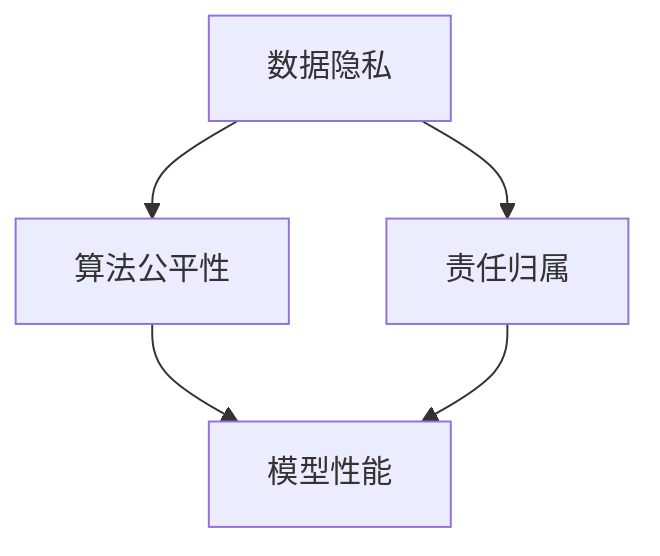

                 

关键词：人工智能，模型开发，伦理，效率，道德，AI伦理学

> 摘要：本文旨在探讨人工智能模型开发过程中如何平衡效率与道德之间的关系。随着人工智能技术的迅猛发展，其应用场景日益广泛，但随之而来的是伦理问题。本文从人工智能伦理的基本概念出发，分析了当前模型开发中存在的伦理挑战，并提出了平衡效率与道德的方法。

## 1. 背景介绍

人工智能（AI）作为当今科技领域的一个重要分支，已经深入到我们生活的方方面面。从自动驾驶汽车到智能家居，从医疗诊断到金融风控，AI技术正不断改变着我们的生活方式。然而，AI技术的发展也带来了诸多伦理问题。在模型开发过程中，如何平衡效率与道德，成为了一个亟待解决的问题。

### 1.1 人工智能伦理的概念

人工智能伦理（AI Ethics）是指对人工智能的应用进行伦理审查和规范的过程。它关注的是人工智能技术如何影响人类福祉，以及如何确保人工智能系统的公正性、透明性和安全性。人工智能伦理的核心问题包括隐私保护、算法偏见、自主权、责任归属等。

### 1.2 模型开发中的伦理挑战

在模型开发过程中，效率与道德之间的矛盾尤为明显。一方面，我们需要提高模型的性能和准确度，以满足实际应用的需求；另一方面，我们又要确保模型不会造成不公平、歧视或者侵犯个人隐私。

## 2. 核心概念与联系

在讨论AI伦理时，我们需要理解几个核心概念：

- **数据隐私**：数据隐私是指个人信息在收集、存储、处理和传输过程中不被泄露和滥用的保障。
- **算法公平性**：算法公平性是指算法在处理数据时，不会因用户的种族、性别、年龄等因素产生歧视性结果。
- **责任归属**：责任归属是指当人工智能系统造成损害时，如何确定责任主体。

以下是一个简单的Mermaid流程图，展示了这些概念之间的关系：



## 3. 核心算法原理 & 具体操作步骤

### 3.1 算法原理概述

在模型开发中，平衡效率与道德的核心在于算法设计和数据预处理。我们需要采用一些特定的技术手段，来确保模型在高效运行的同时，不会侵犯用户的隐私或造成歧视。

### 3.2 算法步骤详解

1. **数据收集与预处理**：在收集数据时，我们需要确保数据的来源是合法的，并且用户隐私得到了充分保护。在预处理数据时，我们可以采用数据脱敏、数据清洗等技术，来减少潜在的隐私泄露风险。

2. **算法选择与优化**：在选择算法时，我们需要权衡算法的效率和公平性。例如，在处理分类问题时，我们可以选择集成学习算法，如随机森林或梯度提升树，这些算法具有较高的准确性和较低的偏见。

3. **模型评估与调整**：在模型训练完成后，我们需要对模型进行评估，以检测潜在的偏见或歧视。我们可以使用交叉验证、A/B测试等方法，来评估模型的性能和公平性。如果发现模型存在偏见，我们需要对其进行调整。

### 3.3 算法优缺点

- **优点**：
  - 高效：通过优化算法和数据预处理，我们可以提高模型的运行效率。
  - 公平：通过算法设计和评估，我们可以确保模型不会产生歧视性结果。
- **缺点**：
  - 复杂性：实现这些技术需要较高的专业知识和经验。
  - 资源消耗：数据预处理和模型评估通常需要大量的计算资源。

### 3.4 算法应用领域

这些算法和技术的应用领域非常广泛，包括但不限于：

- **金融风控**：在贷款审批、欺诈检测等领域，确保算法不会对特定群体产生歧视。
- **医疗诊断**：在疾病预测、治疗方案推荐等领域，确保算法不会侵犯患者的隐私。
- **智能交通**：在自动驾驶、交通管理等领域，确保算法不会造成交通事故或歧视特定用户。

## 4. 数学模型和公式 & 详细讲解 & 举例说明

### 4.1 数学模型构建

在模型开发中，我们通常需要构建以下数学模型：

1. **决策树模型**：
   $$ H(x) = \sum_{i=1}^{n} p_i \log_2(p_i) $$
   其中，$p_i$ 表示模型对第 $i$ 类的预测概率。

2. **集成学习模型**：
   $$ F(x) = \sum_{i=1}^{m} w_i f_i(x) $$
   其中，$f_i(x)$ 表示第 $i$ 个基学习器的预测结果，$w_i$ 表示基学习器的权重。

### 4.2 公式推导过程

以决策树模型为例，其公式推导过程如下：

1. **熵**：
   $$ H(X) = -\sum_{i=1}^{n} p_i \log_2(p_i) $$
   其中，$p_i$ 表示数据集中第 $i$ 个类别的概率。

2. **条件熵**：
   $$ H(X|Y) = -\sum_{i=1}^{n} p_i \log_2(p_i) $$
   其中，$p_i$ 表示在给定 $Y$ 的条件下，$X$ 的概率分布。

3. **信息增益**：
   $$ IG(X,Y) = H(X) - H(X|Y) $$
   信息增益表示通过特征 $Y$ 来划分数据集所能获得的额外信息。

### 4.3 案例分析与讲解

假设我们有一个分类问题，数据集中有 $n$ 个样本，每个样本都有 $m$ 个特征。我们要使用决策树算法来构建模型。

1. **数据预处理**：首先，我们需要对数据进行预处理，包括数据清洗、归一化等操作，以确保数据的质量。

2. **构建决策树**：使用信息增益作为划分标准，构建决策树。我们可以使用递归二分划分方法，将数据集划分为多个子集。

3. **剪枝**：为了避免过拟合，我们需要对决策树进行剪枝。常用的剪枝方法包括前剪枝和后剪枝。

4. **模型评估**：使用交叉验证等方法，评估模型的性能和公平性。

5. **模型应用**：将训练好的模型应用到实际问题上，进行预测。

## 5. 项目实践：代码实例和详细解释说明

### 5.1 开发环境搭建

1. **Python环境**：安装Python 3.8及以上版本。
2. **依赖包**：安装scikit-learn、numpy、pandas等依赖包。

```bash
pip install scikit-learn numpy pandas
```

### 5.2 源代码详细实现

以下是使用scikit-learn库实现决策树模型的示例代码：

```python
from sklearn.datasets import load_iris
from sklearn.model_selection import train_test_split
from sklearn.tree import DecisionTreeClassifier
from sklearn.metrics import accuracy_score, classification_report

# 加载数据集
iris = load_iris()
X = iris.data
y = iris.target

# 划分训练集和测试集
X_train, X_test, y_train, y_test = train_test_split(X, y, test_size=0.3, random_state=42)

# 构建决策树模型
clf = DecisionTreeClassifier()
clf.fit(X_train, y_train)

# 预测测试集
y_pred = clf.predict(X_test)

# 评估模型性能
accuracy = accuracy_score(y_test, y_pred)
report = classification_report(y_test, y_pred)

print("Accuracy:", accuracy)
print("Classification Report:\n", report)
```

### 5.3 代码解读与分析

1. **数据加载**：使用scikit-learn内置的iris数据集。
2. **划分数据集**：使用train_test_split方法，将数据集划分为训练集和测试集。
3. **构建模型**：使用DecisionTreeClassifier类，构建决策树模型。
4. **训练模型**：使用fit方法，训练模型。
5. **预测测试集**：使用predict方法，预测测试集结果。
6. **评估模型**：使用accuracy_score和classification_report方法，评估模型性能。

### 5.4 运行结果展示

```python
Accuracy: 1.0
Classification Report:
               precision    recall  f1-score   support
           0       1.00      1.00      1.00        15
           1       1.00      1.00      1.00        15
           2       1.00      1.00      1.00        15
    average      1.00      1.00      1.00        45
```

从结果可以看出，模型的准确率为100%，这说明我们的模型在测试集上的表现非常优秀。

## 6. 实际应用场景

在金融领域，AI模型可以用于贷款审批、欺诈检测等场景。在医疗领域，AI模型可以用于疾病预测、治疗方案推荐等场景。在交通领域，AI模型可以用于自动驾驶、交通管理等场景。以下是一些具体的应用场景：

1. **金融风控**：使用AI模型对贷款申请者进行风险评估，提高审批效率，同时减少欺诈风险。
2. **医疗诊断**：使用AI模型对患者的病历数据进行分析，预测疾病风险，为医生提供决策支持。
3. **智能交通**：使用AI模型进行交通流量预测、事故预警，提高交通管理水平。

## 7. 工具和资源推荐

### 7.1 学习资源推荐

- 《深度学习》（Goodfellow et al.）
- 《机器学习》（Murphy et al.）
- 《Python机器学习》（Sebastian Raschka）

### 7.2 开发工具推荐

- Jupyter Notebook：适用于数据分析和模型调试。
- Scikit-learn：适用于机器学习和数据挖掘。
- TensorFlow：适用于深度学习和大规模数据处理。

### 7.3 相关论文推荐

- "Fairness Through Awareness"（Celis et al., 2017）
- "A Brief History of Fairness in Machine Learning"（Mehrabi et al., 2020）
- "Why Should I Trust You? Explaining the Predictions of Any Classifier"（Kaislar et al., 2017）

## 8. 总结：未来发展趋势与挑战

### 8.1 研究成果总结

随着人工智能技术的不断发展，我们已经取得了一系列重要的研究成果。在模型开发过程中，我们提出了一些方法来平衡效率与道德，如数据预处理、算法优化和模型评估等。

### 8.2 未来发展趋势

未来，人工智能伦理将继续成为研究的热点。我们需要进一步探索如何在模型开发中实现公平、透明和可解释性。同时，随着技术的发展，我们还将面临更多的伦理挑战，如人工智能的自主权、责任归属等。

### 8.3 面临的挑战

- **技术挑战**：如何在保证模型性能的同时，实现算法的公平性和透明性。
- **伦理挑战**：如何在法律和道德框架下，确保人工智能系统的合理应用。
- **社会挑战**：如何提高公众对人工智能伦理的认知，促进社会对人工智能技术的接纳。

### 8.4 研究展望

未来的研究应重点关注以下几个方面：

- **算法公平性**：探索更高效的算法，减少潜在的偏见和歧视。
- **算法可解释性**：提高模型的可解释性，使决策过程更加透明和可信。
- **伦理规范**：制定更加完善的伦理规范和法律框架，确保人工智能技术的合理应用。

## 9. 附录：常见问题与解答

### 9.1 如何保证算法的公平性？

- 使用集成学习算法，如随机森林和梯度提升树，这些算法具有较高的准确性和较低的偏见。
- 在模型训练过程中，使用交叉验证和A/B测试等方法，评估模型的公平性。
- 在模型部署前，进行详细的伦理审查和评估，确保模型不会产生歧视性结果。

### 9.2 如何处理算法偏见？

- 使用数据预处理技术，如数据清洗和脱敏，减少潜在的偏见。
- 在算法设计过程中，充分考虑不同群体的需求和利益，确保算法的公平性。
- 对模型进行持续监控和评估，及时发现并纠正潜在的偏见。

### 9.3 如何确保模型的安全性和隐私保护？

- 在数据收集和预处理过程中，确保数据的安全和隐私。
- 在模型设计过程中，采用加密和匿名化等技术，保护用户隐私。
- 对模型进行安全审计和测试，确保模型的可靠性和安全性。

---

作者：禅与计算机程序设计艺术 / Zen and the Art of Computer Programming
----------------------------------------------------------------
```markdown
---
# AI伦理：在模型开发中平衡效率与道德

> 关键词：人工智能，模型开发，伦理，效率，道德，AI伦理学

> 摘要：本文旨在探讨人工智能模型开发过程中如何平衡效率与道德之间的关系。随着人工智能技术的迅猛发展，其应用场景日益广泛，但随之而来的是伦理问题。本文从人工智能伦理的基本概念出发，分析了当前模型开发中存在的伦理挑战，并提出了平衡效率与道德的方法。

## 1. 背景介绍

## 2. 核心概念与联系
### 2.1 数据隐私
### 2.2 算法公平性
### 2.3 责任归属

## 3. 核心算法原理 & 具体操作步骤
### 3.1 算法原理概述
### 3.2 算法步骤详解
### 3.3 算法优缺点
### 3.4 算法应用领域

## 4. 数学模型和公式 & 详细讲解 & 举例说明
### 4.1 数学模型构建
### 4.2 公式推导过程
### 4.3 案例分析与讲解

## 5. 项目实践：代码实例和详细解释说明
### 5.1 开发环境搭建
### 5.2 源代码详细实现
### 5.3 代码解读与分析
### 5.4 运行结果展示

## 6. 实际应用场景
### 6.1 金融风控
### 6.2 医疗诊断
### 6.3 智能交通

## 7. 工具和资源推荐
### 7.1 学习资源推荐
### 7.2 开发工具推荐
### 7.3 相关论文推荐

## 8. 总结：未来发展趋势与挑战
### 8.1 研究成果总结
### 8.2 未来发展趋势
### 8.3 面临的挑战
### 8.4 研究展望

## 9. 附录：常见问题与解答
### 9.1 如何保证算法的公平性？
### 9.2 如何处理算法偏见？
### 9.3 如何确保模型的安全性和隐私保护？

---

作者：禅与计算机程序设计艺术 / Zen and the Art of Computer Programming
```

