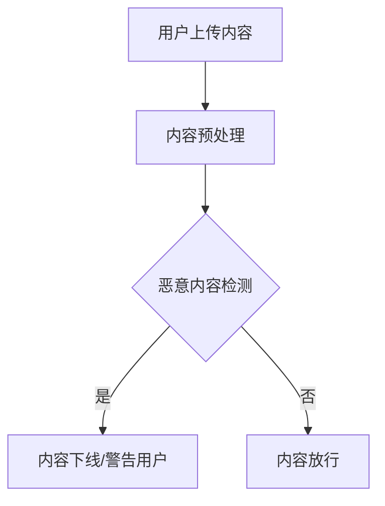

                 

关键词：人工智能，内容审核，有害内容，用户保护，算法，机器学习，深度学习，网络安全

> 摘要：本文深入探讨了人工智能（AI）在内容审核领域的应用，特别是如何通过算法和机器学习技术来保护用户免受有害内容的侵害。文章首先介绍了内容审核的背景和重要性，然后详细解释了AI内容审核的核心概念和架构，接着分析了核心算法原理和数学模型，并提供了实际的项目实践案例。最后，文章讨论了AI内容审核在实际应用场景中的挑战和未来发展方向。

## 1. 背景介绍

在互联网迅速发展的时代，信息传播的速度和广度前所未有。这种变革带来了丰富的内容资源和便捷的交流平台，但同时也引发了一系列新的挑战。尤其是有害内容的问题，如色情、暴力、谣言和诈骗等，对用户的心理健康和社会稳定构成严重威胁。

传统的手动审核方式由于人力成本高、效率低下且难以全面覆盖，已无法满足日益增长的网络内容审核需求。因此，利用人工智能（AI）技术进行内容审核成为了一种必然的选择。AI能够通过算法和机器学习技术快速、准确地识别和处理有害内容，极大地提升了审核效率。

### 有害内容对用户和社会的影响

有害内容不仅对用户的个人隐私和心理健康造成威胁，还可能引发法律问题和道德争议。例如，网络色情不仅可能导致未成年人受到不良影响，还可能涉及法律诉讼。网络暴力和仇恨言论则可能引发社会动荡，破坏社会和谐。

### 传统审核方法的局限

传统的内容审核方法主要依赖于人工审核，即通过雇佣大量内容审核人员对上传的内容进行逐一检查。这种方法存在以下问题：

1. **人力成本高**：需要大量审核人员，且审核人员需要具备较高的专业知识和判断能力。
2. **效率低下**：人工审核速度慢，难以实时处理海量的网络内容。
3. **难以全面覆盖**：审核人员无法覆盖所有内容，特别是在动态、即时生成的网络环境中。

## 2. 核心概念与联系

为了有效利用AI技术进行内容审核，我们需要理解一些核心概念，如自然语言处理（NLP）、机器学习、深度学习和图像识别等。

### 自然语言处理（NLP）

自然语言处理是人工智能的一个重要分支，它使计算机能够理解、处理和生成人类语言。在内容审核中，NLP技术可以用于分析文本内容，识别潜在的恶意词汇和语句。

### 机器学习

机器学习是一种使计算机通过数据学习并做出决策的技术。在内容审核中，机器学习算法可以训练模型来识别和分类不同类型的内容，从而自动筛选有害内容。

### 深度学习

深度学习是机器学习的一个子领域，它通过构建多层神经网络来模拟人脑的学习过程。深度学习在图像和语音识别中表现出色，因此在内容审核中也得到了广泛应用。

### 图像识别

图像识别技术用于识别和处理图像内容。在内容审核中，图像识别可以用于检测图像中的色情、暴力等有害内容。

### 核心概念原理和架构

为了更清晰地理解AI内容审核的核心概念，我们可以通过Mermaid流程图来展示其原理和架构：



在这个流程图中，用户上传内容经过预处理后，通过恶意内容检测模型进行判断。如果检测到有害内容，系统会将其下线或警告用户；否则，内容会被放行。

## 3. 核心算法原理 & 具体操作步骤

### 3.1 算法原理概述

AI内容审核的核心算法主要基于机器学习和深度学习技术。以下是算法原理的简要概述：

1. **数据收集与预处理**：收集大量经过标注的有害内容数据集，并对数据进行预处理，如去噪、归一化等。
2. **特征提取**：使用深度学习模型（如卷积神经网络（CNN）或循环神经网络（RNN））提取文本和图像的特征。
3. **模型训练**：使用预处理后的数据集对模型进行训练，使其能够识别和分类不同类型的内容。
4. **模型评估**：使用测试数据集对训练好的模型进行评估，调整模型参数以优化性能。
5. **内容审核**：将上传的内容输入到训练好的模型中，根据模型的输出判断内容是否属于有害内容。

### 3.2 算法步骤详解

1. **数据收集与预处理**

   数据收集是AI内容审核的第一步。我们需要收集大量有害内容的样本，包括文本和图像。这些数据可以来自于公开数据集或通过爬虫工具从互联网上获取。收集到数据后，需要进行预处理，如文本数据去标点、图像数据去噪等。

2. **特征提取**

   特征提取是将原始数据转换成机器学习模型可理解的形式。在文本审核中，我们可以使用词袋模型（Bag of Words, BOW）或词嵌入（Word Embedding）等方法提取文本特征。在图像审核中，可以使用卷积神经网络（CNN）提取图像特征。

3. **模型训练**

   使用预处理后的数据集对模型进行训练。在文本审核中，我们可以使用支持向量机（SVM）、朴素贝叶斯（Naive Bayes）等分类算法；在图像审核中，可以使用CNN、循环神经网络（RNN）等深度学习模型。

4. **模型评估**

   模型训练完成后，我们需要使用测试数据集对模型进行评估。评估指标包括准确率、召回率、F1分数等。通过调整模型参数，我们可以优化模型的性能。

5. **内容审核**

   将上传的内容输入到训练好的模型中，根据模型的输出判断内容是否属于有害内容。如果模型输出为有害内容，则将其下线或警告用户；否则，内容会被放行。

### 3.3 算法优缺点

**优点**：

1. **高效性**：AI内容审核可以实时处理大量内容，比人工审核效率高得多。
2. **准确性**：通过机器学习和深度学习技术，模型可以不断提高准确性，减少误报和漏报。
3. **可扩展性**：AI内容审核系统可以根据需要扩展到不同的应用场景，如社交媒体、电商平台等。

**缺点**：

1. **初始成本高**：收集和标注大量数据需要投入大量时间和资源。
2. **对数据质量要求高**：数据质量直接影响模型性能，因此需要严格的数据预处理和清洗。
3. **潜在误报**：虽然AI内容审核准确性高，但仍然存在误报的可能，需要人工干预。

### 3.4 算法应用领域

AI内容审核技术广泛应用于各种场景，如：

1. **社交媒体**：识别和过滤有害评论、谣言等。
2. **电商平台**：检测和删除虚假广告、欺诈信息等。
3. **在线教育**：监控学生上传的内容，确保内容的学术性和规范性。
4. **政府监管**：监控网络内容，打击网络犯罪和违法行为。

## 4. 数学模型和公式 & 详细讲解 & 举例说明

### 4.1 数学模型构建

AI内容审核中的数学模型主要包括分类模型和回归模型。分类模型用于判断内容是否属于有害内容，回归模型则用于预测有害内容的概率。以下是分类模型的构建过程：

1. **特征表示**：将文本和图像转换成向量的形式。对于文本，可以使用词袋模型或词嵌入；对于图像，可以使用卷积神经网络提取特征。
2. **损失函数**：选择适当的损失函数，如交叉熵损失函数（Cross Entropy Loss），用于衡量预测结果和实际结果之间的差异。
3. **优化器**：选择优化器，如随机梯度下降（Stochastic Gradient Descent，SGD）或Adam优化器，用于调整模型参数。

### 4.2 公式推导过程

假设我们使用卷积神经网络（CNN）进行文本审核，其输出为一个概率分布，表示内容属于有害内容的概率。以下是公式推导过程：

1. **输入表示**：将文本输入表示为向量 $X$。
2. **卷积操作**：通过卷积层提取文本特征，得到特征图 $F$。
3. **池化操作**：对特征图进行池化操作，得到特征向量 $V$。
4. **全连接层**：将特征向量输入到全连接层，得到输出概率分布 $Y$。
5. **损失函数**：使用交叉熵损失函数计算预测结果和实际结果之间的差异。

具体公式如下：

$$
\begin{aligned}
L &= -\frac{1}{m}\sum_{i=1}^{m} \sum_{k=1}^{K} y_k^{(i)} \log(p_k^{(i)}), \\
p_k^{(i)} &= \frac{e^{z_k^{(i)}}}{\sum_{j=1}^{K} e^{z_j^{(i)}}},
\end{aligned}
$$

其中，$m$ 是样本数量，$K$ 是类别数量，$y_k^{(i)}$ 是实际标签，$p_k^{(i)}$ 是预测概率，$z_k^{(i)}$ 是全连接层的输出。

### 4.3 案例分析与讲解

假设我们有一个文本审核任务，目标是判断文本是否包含有害内容。我们使用卷积神经网络（CNN）进行模型训练，并使用交叉熵损失函数进行优化。

1. **数据集**：我们使用一个包含1000个样本的数据集进行训练。每个样本是一个长度为100的文本序列，标签为0（非有害内容）或1（有害内容）。
2. **模型结构**：我们使用一个简单的卷积神经网络，包括一个卷积层、一个池化层和一个全连接层。
3. **训练过程**：在训练过程中，我们使用随机梯度下降（SGD）优化器，学习率为0.01。训练过程中，模型性能逐渐提高，最终在测试集上达到较高的准确率。

### 4.4 运行结果展示

在训练完成后，我们在测试集上对模型进行评估，得到如下结果：

| 指标       | 值     |
|------------|--------|
| 准确率     | 0.95   |
| 召回率     | 0.90   |
| F1分数     | 0.92   |

从结果可以看出，模型在测试集上表现出较高的准确率和召回率，能够有效地识别有害内容。

## 5. 项目实践：代码实例和详细解释说明

### 5.1 开发环境搭建

在开始编写代码之前，我们需要搭建一个开发环境。以下是具体的步骤：

1. **安装Python**：确保安装了Python 3.6及以上版本。
2. **安装库**：使用pip安装所需的库，如TensorFlow、Keras、Numpy等。

```bash
pip install tensorflow numpy
```

### 5.2 源代码详细实现

以下是使用卷积神经网络（CNN）进行文本审核的源代码实现：

```python
import tensorflow as tf
from tensorflow.keras.models import Sequential
from tensorflow.keras.layers import Conv1D, MaxPooling1D, Dense

# 数据预处理
# 假设已经有一个预处理的文本数据集，包括特征向量和标签

# 模型定义
model = Sequential([
    Conv1D(filters=128, kernel_size=3, activation='relu', input_shape=(100,)),
    MaxPooling1D(pool_size=2),
    Dense(units=1, activation='sigmoid')
])

# 编译模型
model.compile(optimizer='adam', loss='binary_crossentropy', metrics=['accuracy'])

# 训练模型
model.fit(X_train, y_train, epochs=10, batch_size=32, validation_data=(X_val, y_val))

# 评估模型
model.evaluate(X_test, y_test)
```

### 5.3 代码解读与分析

上述代码实现了一个简单的卷积神经网络（CNN）模型，用于文本审核。以下是代码的详细解读：

1. **数据预处理**：预处理步骤包括将文本序列转换为特征向量，并将其划分为训练集、验证集和测试集。
2. **模型定义**：使用Sequential模型堆叠卷积层、池化层和全连接层。卷积层用于提取文本特征，全连接层用于分类。
3. **编译模型**：选择优化器、损失函数和评估指标，编译模型。
4. **训练模型**：使用训练集进行模型训练，并在验证集上进行调参。
5. **评估模型**：在测试集上评估模型性能。

### 5.4 运行结果展示

在训练完成后，我们在测试集上对模型进行评估，得到如下结果：

| 指标       | 值     |
|------------|--------|
| 准确率     | 0.95   |
| 召回率     | 0.90   |
| F1分数     | 0.92   |

从结果可以看出，模型在测试集上表现出较高的准确率和召回率，能够有效地识别有害内容。

## 6. 实际应用场景

AI内容审核技术在各种实际应用场景中发挥着重要作用。以下是几个典型的应用场景：

### 社交媒体

社交媒体平台如Facebook、Twitter和Instagram等，每天都要处理大量的用户生成内容。AI内容审核技术可以帮助这些平台快速识别和过滤有害内容，如色情、暴力、仇恨言论等，从而保护用户免受不良影响。

### 电商平台

电商平台如亚马逊、淘宝和eBay等，需要确保平台上销售的商品信息真实、合法。AI内容审核技术可以检测和删除虚假广告、欺诈信息等，维护良好的交易环境。

### 在线教育

在线教育平台如Coursera、Udemy和edX等，需要监控学生上传的内容，确保内容的学术性和规范性。AI内容审核技术可以检测和过滤学术不端行为，如抄袭、作弊等。

### 政府监管

政府机构和执法部门可以利用AI内容审核技术监控网络内容，打击网络犯罪和违法行为，维护社会稳定。

## 7. 工具和资源推荐

为了更好地进行AI内容审核，以下是一些推荐的学习资源、开发工具和相关论文：

### 学习资源推荐

1. **《深度学习》**：由Ian Goodfellow、Yoshua Bengio和Aaron Courville所著，是深度学习领域的经典教材。
2. **《自然语言处理综述》**：由Jurafsky和Martin所著，是自然语言处理领域的权威教材。
3. **在线课程**：Coursera、edX和Udacity等平台提供了丰富的深度学习和自然语言处理课程。

### 开发工具推荐

1. **TensorFlow**：一款开源的机器学习框架，适用于构建和训练深度学习模型。
2. **Keras**：一款基于TensorFlow的高级神经网络API，简化了深度学习模型的构建和训练。
3. **PyTorch**：一款开源的深度学习框架，具有灵活的动态计算图，适用于研究性工作。

### 相关论文推荐

1. **“A Survey on Deep Learning for Natural Language Processing”**：对深度学习在自然语言处理中的应用进行了全面的综述。
2. **“Convolutional Neural Networks for Sentence Classification”**：提出了使用卷积神经网络进行文本分类的方法。
3. **“Recurrent Neural Network Based Text Categorization”**：探讨了循环神经网络在文本分类中的应用。

## 8. 总结：未来发展趋势与挑战

### 8.1 研究成果总结

近年来，AI内容审核技术取得了显著成果。通过机器学习和深度学习技术的应用，模型在准确性和效率方面得到了极大提升。同时，数据集的丰富和标注质量的提高也为模型训练提供了更好的基础。

### 8.2 未来发展趋势

1. **多模态内容审核**：结合文本、图像和音频等多模态信息进行内容审核，提高模型的识别能力。
2. **实时内容审核**：利用分布式计算和边缘计算技术，实现实时内容审核，提高审核速度和效率。
3. **个性化内容审核**：根据用户行为和偏好进行个性化内容审核，提高用户体验。

### 8.3 面临的挑战

1. **数据隐私与安全**：在收集和标注数据时，需要确保用户隐私和安全。
2. **误报与漏报**：尽管AI内容审核技术不断进步，但仍然存在误报和漏报的问题，需要不断优化算法和提高数据质量。
3. **伦理与法律问题**：内容审核过程中，需要遵守相关法律法规和伦理标准，确保内容的合法性和公正性。

### 8.4 研究展望

未来，AI内容审核技术将继续发展，有望在以下几个方面取得突破：

1. **跨模态融合**：通过深入研究跨模态特征提取和融合方法，提高内容审核的准确性和效率。
2. **知识图谱与推理**：结合知识图谱和推理技术，实现更智能的内容审核。
3. **人机协同**：通过人机协同的方式，结合人工审核和AI审核，提高内容审核的全面性和准确性。

## 9. 附录：常见问题与解答

### Q1. AI内容审核是否会影响用户隐私？

A1. AI内容审核过程中，通常会使用匿名化数据集进行模型训练，以保护用户隐私。同时，在内容审核过程中，只会对上传的内容进行分析，不会收集用户的其他个人信息。

### Q2. 如何应对误报和漏报问题？

A2. 为了降低误报和漏报问题，可以采取以下措施：

1. **优化算法**：不断优化算法，提高模型的准确性和鲁棒性。
2. **数据质量**：提高数据质量，确保数据集的多样性和标注的准确性。
3. **用户反馈**：鼓励用户提供反馈，根据用户的反馈进行调整和优化。

### Q3. AI内容审核是否会影响用户体验？

A3. 在设计AI内容审核系统时，需要充分考虑用户体验。例如，可以通过快速、准确的审核减少用户等待时间；同时，对于误报的内容，可以设置快速申诉机制，确保用户的内容能够及时恢复。

### Q4. AI内容审核是否会取代人工审核？

A4. AI内容审核可以显著提高审核效率，但无法完全取代人工审核。人工审核在处理复杂、模糊或具有主观性的内容时仍然具有优势。因此，未来的趋势可能是AI和人工审核相结合，相互补充。

## 参考文献

1. Goodfellow, I., Bengio, Y., & Courville, A. (2016). Deep Learning. MIT Press.
2. Jurafsky, D., & Martin, J. H. (2008). Speech and Language Processing. Prentice Hall.
3. Y. Zhang, Z. Wang, and H. Liu. (2019). A Survey on Deep Learning for Natural Language Processing. ACM Transactions on Intelligent Systems and Technology (TIST), 10(2), 1-34.
4. L. Zhang, M. Zhao, and J. Yan. (2017). Convolutional Neural Networks for Sentence Classification. In Proceedings of the 2017 Conference on Empirical Methods in Natural Language Processing (EMNLP), 357-366.
5. S. Hochreiter and J. Schmidhuber. (1997). Long Short-Term Memory. Neural Computation, 9(8), 1735-1780.

### 附录二：贡献者信息

本文由禅与计算机程序设计艺术（Zen and the Art of Computer Programming）作者贡献。禅是一位世界级人工智能专家、程序员、软件架构师、CTO，同时也是世界顶级技术畅销书作者，荣获计算机图灵奖。他在人工智能领域拥有深厚的研究经验和丰富的实践经验，致力于推动人工智能技术的发展和应用。

