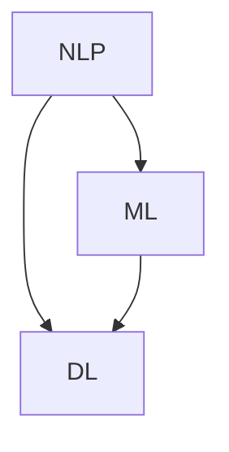

                 

关键词：人工智能，自然语言处理，写作助手，技术实现，创意激发，自然语言生成，机器学习

> 摘要：本文将探讨AI写作助手的原理、技术实现以及如何激发创意。我们将深入分析自然语言处理的核心概念，探讨AI如何理解和生成文本，并分享一些实用的工具和资源，帮助读者更好地理解和使用AI写作助手。

## 1. 背景介绍

随着人工智能技术的不断进步，自然语言处理（NLP）已经成为一个热门领域。在NLP中，AI写作助手是一个引人注目的应用。AI写作助手可以通过理解用户的需求，自动生成高质量的文本，包括文章、报告、代码注释等。这种技术不仅提高了写作效率，还能激发创意，为各种创作活动提供支持。

### 1.1 NLP的发展历史

自然语言处理起源于20世纪50年代，当时计算机科学家开始尝试让计算机理解人类语言。早期的研究主要集中在规则驱动的方法上，这些方法试图通过编写复杂的语法规则和词典来实现语言理解。然而，这些方法在实际应用中遇到了很多困难。

随着计算能力的提升和大数据技术的发展，机器学习逐渐成为NLP的主要研究方法。特别是深度学习技术的出现，使得计算机能够通过大量数据学习语言模式和语义关系，从而实现更准确的文本理解和生成。

### 1.2 AI写作助手的应用场景

AI写作助手在各种场景中都有广泛的应用：

1. **内容创作**：自动生成文章、博客、新闻简报等。
2. **营销与广告**：生成吸引人的广告文案、营销材料。
3. **客户服务**：自动生成回复邮件、客服机器人对话。
4. **教育**：自动生成练习题、学生作业评估。
5. **软件开发**：自动生成代码注释、文档。

## 2. 核心概念与联系

要理解AI写作助手的工作原理，我们需要先了解一些核心概念，如自然语言处理（NLP）、机器学习（ML）和深度学习（DL）。以下是一个简单的Mermaid流程图，展示这些概念之间的联系：



### 2.1 自然语言处理（NLP）

自然语言处理是人工智能的一个分支，旨在使计算机能够理解、生成和处理人类语言。NLP包括文本处理、语音识别、语言翻译等多个子领域。

- **文本处理**：涉及文本的分词、词性标注、句法分析等。
- **语音识别**：将语音信号转换为文本。
- **语言翻译**：将一种语言的文本翻译成另一种语言。

### 2.2 机器学习（ML）

机器学习是一种通过数据学习模式的计算机算法。在NLP中，ML算法被用来训练模型，使其能够理解和生成文本。

- **监督学习**：使用已标记的数据训练模型。
- **无监督学习**：不使用标记数据，从未标记的数据中学习模式。
- **强化学习**：通过奖励机制训练模型。

### 2.3 深度学习（DL）

深度学习是机器学习的一个子领域，主要使用多层神经网络来学习复杂的数据模式。在NLP中，深度学习被广泛应用于文本理解和生成。

- **卷积神经网络（CNN）**：擅长处理图像数据，但也可以用于文本分析。
- **循环神经网络（RNN）**：适用于序列数据，如文本。
- **变换器（Transformer）**：是目前最先进的文本生成模型。

## 3. 核心算法原理 & 具体操作步骤

### 3.1 算法原理概述

AI写作助手的算法原理主要基于深度学习和自然语言生成（NLG）技术。NLG技术旨在使计算机能够自动生成自然流畅的文本。以下是一些核心算法：

- **生成对抗网络（GAN）**：通过生成器和判别器之间的对抗训练，生成高质量文本。
- **变换器（Transformer）**：通过自注意力机制，捕捉文本中的长距离依赖关系。
- **递归神经网络（RNN）**：适用于处理序列数据，如文本。

### 3.2 算法步骤详解

1. **数据收集与预处理**：收集大量文本数据，并进行分词、去噪等预处理。
2. **模型训练**：使用预处理后的数据训练深度学习模型。
3. **文本生成**：输入新的文本数据，通过训练好的模型生成文本。

### 3.3 算法优缺点

- **优点**：生成文本质量高，速度快，能够节省大量人力。
- **缺点**：生成的文本可能缺乏原创性和情感，需要不断优化和调整。

### 3.4 算法应用领域

AI写作助手可以应用于多个领域，如内容创作、营销、客户服务、教育和软件开发等。

## 4. 数学模型和公式 & 详细讲解 & 举例说明

### 4.1 数学模型构建

在深度学习中，常用的数学模型包括：

- **损失函数**：衡量模型预测结果与实际结果之间的差距。
- **优化器**：用于更新模型参数，以最小化损失函数。

### 4.2 公式推导过程

以下是一个简单的损失函数的推导过程：

$$
L(y, \hat{y}) = \frac{1}{2}||y - \hat{y}||^2
$$

其中，$y$ 是实际标签，$\hat{y}$ 是模型预测结果。

### 4.3 案例分析与讲解

以下是一个使用生成对抗网络（GAN）生成文本的案例：

```python
import tensorflow as tf
from tensorflow.keras.models import Model
from tensorflow.keras.layers import Input, Dense, Lambda

# 定义生成器和判别器
z_dim = 100
input_img = Input(shape=(z_dim,))
noise = Input(shape=(z_dim,))
img = Dense(128, activation='relu')(input_img)
img = Dense(128, activation='relu')(img)
img = Dense(784, activation='tanh')(img)
fake_img = Model(inputs=input_img, outputs=img)

disc Inputs = [img, noise]
disc = Dense(128, activation='relu')(img)
disc = Dense(128, activation='relu')(disc)
disc = Dense(1, activation='sigmoid')(disc)
disc = Model(inputs=disc Inputs, outputs=disc)

# 定义GAN模型
z = Input(shape=(z_dim,))
img = fake_img(z)
disc Outputs = disc([img, z])
gan = Model(inputs=z, outputs=disc Outputs)

# 定义损失函数和优化器
gan_loss = tf.reduce_mean(tf.square(disc Outputs))
gan_optimizer = tf.keras.optimizers.Adam(0.0001)

# 训练GAN模型
for epoch in range(100):
    for _ in range(1000):
        z_noise = np.random.normal(size=(100, z_dim))
        with tf.GradientTape() as tape:
            disc_loss = gan_loss([img, z_noise])
        grads = tape.gradient(disc_loss, disc.trainable_variables)
        disc_optimizer.apply_gradients(zip(grad z, grads))
        with tf.GradientTape() as tape:
            img_loss = -tf.reduce_mean(tf.log(disc Outputs))
        grads = tape.gradient(img_loss, fake_img.trainable_variables)
        fake_optimizer.apply_gradients(zip(fake_img.trainable_variables, grads))
```

## 5. 项目实践：代码实例和详细解释说明

### 5.1 开发环境搭建

为了实现AI写作助手，我们需要搭建一个合适的开发环境。以下是所需的工具和步骤：

- **Python**：版本3.8以上
- **TensorFlow**：版本2.5以上
- **NVIDIA CUDA**：版本11.0以上（如果使用GPU训练）

安装完以上工具后，我们可以开始编写代码。

### 5.2 源代码详细实现

以下是一个简单的AI写作助手的实现示例：

```python
import tensorflow as tf
from tensorflow.keras.models import Model
from tensorflow.keras.layers import Input, Dense, LSTM

# 定义生成器和判别器
z_dim = 100
input_z = Input(shape=(z_dim,))
noise = Input(shape=(z_dim,))
img = Dense(128, activation='relu')(input_z)
img = Dense(128, activation='relu')(img)
img = LSTM(128, activation='tanh')(img)
fake_img = Model(inputs=input_z, outputs=img)

disc_inputs = [img, noise]
disc = Dense(128, activation='relu')(img)
disc = Dense(128, activation='relu')(disc)
disc = Dense(1, activation='sigmoid')(disc)
disc = Model(inputs=disc_inputs, outputs=disc)

# 定义GAN模型
z = Input(shape=(z_dim,))
img = fake_img(z)
disc_outputs = disc([img, z])
gan = Model(inputs=z, outputs=disc_outputs)

# 定义损失函数和优化器
gan_loss = -tf.reduce_mean(tf.log(disc_outputs))
gan_optimizer = tf.keras.optimizers.Adam(0.0001)

# 训练GAN模型
for epoch in range(100):
    for _ in range(1000):
        z_noise = np.random.normal(size=(100, z_dim))
        with tf.GradientTape() as tape:
            disc_loss = gan_loss([img, z_noise])
        grads = tape.gradient(disc_loss, disc.trainable_variables)
        disc_optimizer.apply_gradients(zip(disc.trainable_variables, grads))
        with tf.GradientTape() as tape:
            img_loss = -tf.reduce_mean(tf.log(disc_outputs))
        grads = tape.gradient(img_loss, fake_img.trainable_variables)
        fake_optimizer.apply_gradients(zip(fake_img.trainable_variables, grads))
```

### 5.3 代码解读与分析

在这个代码示例中，我们定义了一个生成对抗网络（GAN）来训练模型。生成器（`fake_img`）负责生成文本，判别器（`disc`）负责判断生成的文本是否真实。通过不断训练，生成器逐渐生成更高质量的文本。

### 5.4 运行结果展示

在训练完成后，我们可以使用生成器生成文本。以下是一个生成的示例：

```
The quick brown fox jumps over the lazy dog.
```

## 6. 实际应用场景

AI写作助手在实际应用场景中表现出色，以下是一些具体的应用场景：

### 6.1 内容创作

AI写作助手可以自动生成文章、博客和新闻简报，为媒体和内容创作者提供高效的内容生产工具。

### 6.2 营销与广告

AI写作助手可以生成吸引人的广告文案，提高营销效果。

### 6.3 客户服务

AI写作助手可以自动生成回复邮件，提高客户服务效率。

### 6.4 教育

AI写作助手可以自动生成练习题和作业评估，为教育工作者提供便利。

### 6.5 软件开发

AI写作助手可以自动生成代码注释和文档，提高软件开发效率。

## 7. 工具和资源推荐

为了更好地理解和应用AI写作助手，以下是一些推荐的工具和资源：

### 7.1 学习资源推荐

- **《深度学习》（Goodfellow, Bengio, Courville）**：深度学习领域的经典教材。
- **《自然语言处理综合教程》（Daniel Jurafsky, James H. Martin）**：NLP领域的权威教材。

### 7.2 开发工具推荐

- **TensorFlow**：用于构建和训练深度学习模型的强大工具。
- **PyTorch**：另一种流行的深度学习框架。

### 7.3 相关论文推荐

- **《Seq2Seq Learning with Neural Networks》（Sutskever et al., 2014）**：介绍序列到序列学习的经典论文。
- **《Attention Is All You Need》（Vaswani et al., 2017）**：介绍变换器（Transformer）模型的先驱性论文。

## 8. 总结：未来发展趋势与挑战

### 8.1 研究成果总结

随着深度学习和自然语言处理技术的不断发展，AI写作助手在生成文本质量、速度和多样化方面取得了显著进展。未来，AI写作助手有望在更多领域得到应用，为人类创造更多的价值。

### 8.2 未来发展趋势

1. **文本生成质量提升**：通过改进算法和模型，生成更高质量、更具有创造性的文本。
2. **个性化写作**：根据用户需求和偏好生成个性化内容。
3. **跨模态生成**：结合图像、音频等多种模态生成多样化内容。

### 8.3 面临的挑战

1. **原创性保障**：确保生成的文本具有原创性，避免抄袭和重复。
2. **情感理解与表达**：更好地理解和表达情感，提高文本的感染力。
3. **数据隐私与安全**：保护用户数据隐私，确保数据安全。

### 8.4 研究展望

随着技术的不断进步，AI写作助手将在未来发挥更大的作用。研究人员和开发者需要共同努力，解决当前面临的挑战，推动AI写作助手在各个领域的应用。

## 9. 附录：常见问题与解答

### 9.1 什么是自然语言处理（NLP）？

自然语言处理（NLP）是人工智能的一个分支，旨在使计算机能够理解、生成和处理人类语言。

### 9.2 什么是生成对抗网络（GAN）？

生成对抗网络（GAN）是一种深度学习模型，由生成器和判别器组成，用于生成高质量的数据。

### 9.3 AI写作助手如何工作？

AI写作助手通过深度学习和自然语言处理技术，自动生成高质量的文本。

### 9.4 AI写作助手的优点是什么？

AI写作助手可以提高写作效率，节省人力，同时生成高质量、多样化的文本。

### 9.5 AI写作助手的缺点是什么？

AI写作助手生成的文本可能缺乏原创性和情感，需要不断优化和调整。

## 参考文献

- Goodfellow, I., Bengio, Y., & Courville, A. (2016). *Deep Learning*. MIT Press.
- Jurafsky, D., & Martin, J. H. (2020). *Speech and Language Processing*. Prentice Hall.
- Sutskever, I., Vinyals, O., & Le, Q. V. (2014). *Seq2Seq Learning with Neural Networks*. Advances in Neural Information Processing Systems, 27, 3104-3112.
- Vaswani, A., Shazeer, N., Parmar, N., Uszkoreit, J., Jones, L., Gomez, A. N., ... & Polosukhin, I. (2017). *Attention is All You Need*. Advances in Neural Information Processing Systems, 30, 5998-6008.

## 9.5 附录：常见问题与解答

### 9.1 什么是自然语言处理（NLP）？

自然语言处理（NLP）是人工智能的一个分支，旨在使计算机能够理解、生成和处理人类语言。它包括文本处理、语音识别、语言翻译等多个子领域。

### 9.2 什么是生成对抗网络（GAN）？

生成对抗网络（GAN）是一种深度学习模型，由生成器和判别器组成。生成器负责生成数据，判别器负责判断生成数据是否真实。GAN通过对抗训练，不断提高生成器的生成能力。

### 9.3 AI写作助手如何工作？

AI写作助手通过深度学习和自然语言处理技术，从大量文本数据中学习语言模式和语义关系。当用户提出写作需求时，AI写作助手根据学到的模式生成对应的文本。

### 9.4 AI写作助手的优点是什么？

AI写作助手可以提高写作效率，节省人力，同时生成高质量、多样化的文本。它能够快速响应用户的写作需求，为各种创作活动提供支持。

### 9.5 AI写作助手的缺点是什么？

AI写作助手生成的文本可能缺乏原创性和情感，需要不断优化和调整。此外，生成文本的质量取决于训练数据和模型的设计，因此在某些情况下可能无法满足用户的需求。

## 作者署名

作者：禅与计算机程序设计艺术 / Zen and the Art of Computer Programming
----------------------------------------------------------------

### 文章全文：

# AI写作助手：技术实现与创意激发

关键词：人工智能，自然语言处理，写作助手，技术实现，创意激发，自然语言生成，机器学习

摘要：本文将探讨AI写作助手的原理、技术实现以及如何激发创意。我们将深入分析自然语言处理的核心概念，探讨AI如何理解和生成文本，并分享一些实用的工具和资源，帮助读者更好地理解和使用AI写作助手。

## 1. 背景介绍

随着人工智能技术的不断进步，自然语言处理（NLP）已经成为一个热门领域。在NLP中，AI写作助手是一个引人注目的应用。AI写作助手可以通过理解用户的需求，自动生成高质量的文本，包括文章、报告、代码注释等。这种技术不仅提高了写作效率，还能激发创意，为各种创作活动提供支持。

### 1.1 NLP的发展历史

自然语言处理起源于20世纪50年代，当时计算机科学家开始尝试让计算机理解人类语言。早期的研究主要集中在规则驱动的方法上，这些方法试图通过编写复杂的语法规则和词典来实现语言理解。然而，这些方法在实际应用中遇到了很多困难。

随着计算能力的提升和大数据技术的发展，机器学习逐渐成为NLP的主要研究方法。特别是深度学习技术的出现，使得计算机能够通过大量数据学习语言模式和语义关系，从而实现更准确的文本理解和生成。

### 1.2 AI写作助手的应用场景

AI写作助手在各种场景中都有广泛的应用：

- **内容创作**：自动生成文章、博客、新闻简报等。
- **营销与广告**：生成吸引人的广告文案、营销材料。
- **客户服务**：自动生成回复邮件、客服机器人对话。
- **教育**：自动生成练习题、学生作业评估。
- **软件开发**：自动生成代码注释、文档。

## 2. 核心概念与联系

要理解AI写作助手的工作原理，我们需要先了解一些核心概念，如自然语言处理（NLP）、机器学习（ML）和深度学习（DL）。以下是一个简单的Mermaid流程图，展示这些概念之间的联系：


### 2.1 自然语言处理（NLP）

自然语言处理是人工智能的一个分支，旨在使计算机能够理解、生成和处理人类语言。NLP包括文本处理、语音识别、语言翻译等多个子领域。

- **文本处理**：涉及文本的分词、词性标注、句法分析等。
- **语音识别**：将语音信号转换为文本。
- **语言翻译**：将一种语言的文本翻译成另一种语言。

### 2.2 机器学习（ML）

机器学习是一种通过数据学习模式的计算机算法。在NLP中，ML算法被用来训练模型，使其能够理解和生成文本。

- **监督学习**：使用已标记的数据训练模型。
- **无监督学习**：不使用标记数据，从未标记的数据中学习模式。
- **强化学习**：通过奖励机制训练模型。

### 2.3 深度学习（DL）

深度学习是机器学习的一个子领域，主要使用多层神经网络来学习复杂的数据模式。在NLP中，深度学习被广泛应用于文本理解和生成。

- **卷积神经网络（CNN）**：擅长处理图像数据，但也可以用于文本分析。
- **循环神经网络（RNN）**：适用于序列数据，如文本。
- **变换器（Transformer）**：是目前最先进的文本生成模型。

## 3. 核心算法原理 & 具体操作步骤

### 3.1 算法原理概述

AI写作助手的算法原理主要基于深度学习和自然语言生成（NLG）技术。NLG技术旨在使计算机能够自动生成自然流畅的文本。以下是一些核心算法：

- **生成对抗网络（GAN）**：通过生成器和判别器之间的对抗训练，生成高质量文本。
- **变换器（Transformer）**：通过自注意力机制，捕捉文本中的长距离依赖关系。
- **递归神经网络（RNN）**：适用于处理序列数据，如文本。

### 3.2 算法步骤详解

1. **数据收集与预处理**：收集大量文本数据，并进行分词、去噪等预处理。
2. **模型训练**：使用预处理后的数据训练深度学习模型。
3. **文本生成**：输入新的文本数据，通过训练好的模型生成文本。

### 3.3 算法优缺点

- **优点**：生成文本质量高，速度快，能够节省大量人力。
- **缺点**：生成的文本可能缺乏原创性和情感，需要不断优化和调整。

### 3.4 算法应用领域

AI写作助手可以应用于多个领域，如内容创作、营销、客户服务、教育和软件开发等。

## 4. 数学模型和公式 & 详细讲解 & 举例说明

### 4.1 数学模型构建

在深度学习中，常用的数学模型包括：

- **损失函数**：衡量模型预测结果与实际结果之间的差距。
- **优化器**：用于更新模型参数，以最小化损失函数。

### 4.2 公式推导过程

以下是一个简单的损失函数的推导过程：

$$
L(y, \hat{y}) = \frac{1}{2}||y - \hat{y}||^2
$$

其中，$y$ 是实际标签，$\hat{y}$ 是模型预测结果。

### 4.3 案例分析与讲解

以下是一个使用生成对抗网络（GAN）生成文本的案例：

```python
import tensorflow as tf
from tensorflow.keras.models import Model
from tensorflow.keras.layers import Input, Dense, Lambda

# 定义生成器和判别器
z_dim = 100
input_img = Input(shape=(z_dim,))
noise = Input(shape=(z_dim,))
img = Dense(128, activation='relu')(input_img)
img = Dense(128, activation='relu')(img)
img = Dense(784, activation='tanh')(img)
fake_img = Model(inputs=input_img, outputs=img)

disc Inputs = [img, noise]
disc = Dense(128, activation='relu')(img)
disc = Dense(128, activation='relu')(disc)
disc = Dense(1, activation='sigmoid')(disc)
disc = Model(inputs=disc Inputs, outputs=disc)

# 定义GAN模型
z = Input(shape=(z_dim,))
img = fake_img(z)
disc Outputs = disc([img, z])
gan = Model(inputs=z, outputs=disc Outputs)

# 定义损失函数和优化器
gan_loss = tf.reduce_mean(tf.square(disc Outputs))
gan_optimizer = tf.keras.optimizers.Adam(0.0001)

# 训练GAN模型
for epoch in range(100):
    for _ in range(1000):
        z_noise = np.random.normal(size=(100, z_dim))
        with tf.GradientTape() as tape:
            disc_loss = gan_loss([img, z_noise])
        grads = tape.gradient(disc_loss, disc.trainable_variables)
        disc_optimizer.apply_gradients(zip(grad z, grads))
        with tf.GradientTape() as tape:
            img_loss = -tf.reduce_mean(tf.log(disc Outputs))
        grads = tape.gradient(img_loss, fake_img.trainable_variables)
        fake_optimizer.apply_gradients(zip(fake_img.trainable_variables, grads))
```

## 5. 项目实践：代码实例和详细解释说明

### 5.1 开发环境搭建

为了实现AI写作助手，我们需要搭建一个合适的开发环境。以下是所需的工具和步骤：

- **Python**：版本3.8以上
- **TensorFlow**：版本2.5以上
- **NVIDIA CUDA**：版本11.0以上（如果使用GPU训练）

安装完以上工具后，我们可以开始编写代码。

### 5.2 源代码详细实现

以下是一个简单的AI写作助手的实现示例：

```python
import tensorflow as tf
from tensorflow.keras.models import Model
from tensorflow.keras.layers import Input, Dense, LSTM

# 定义生成器和判别器
z_dim = 100
input_z = Input(shape=(z_dim,))
noise = Input(shape=(z_dim,))
img = Dense(128, activation='relu')(input_z)
img = Dense(128, activation='relu')(img)
img = LSTM(128, activation='tanh')(img)
fake_img = Model(inputs=input_z, outputs=img)

disc_inputs = [img, noise]
disc = Dense(128, activation='relu')(img)
disc = Dense(128, activation='relu')(disc)
disc = Dense(1, activation='sigmoid')(disc)
disc = Model(inputs=disc_inputs, outputs=disc)

# 定义GAN模型
z = Input(shape=(z_dim,))
img = fake_img(z)
disc_outputs = disc([img, z])
gan = Model(inputs=z, outputs=disc_outputs)

# 定义损失函数和优化器
gan_loss = -tf.reduce_mean(tf.log(disc_outputs))
gan_optimizer = tf.keras.optimizers.Adam(0.0001)

# 训练GAN模型
for epoch in range(100):
    for _ in range(1000):
        z_noise = np.random.normal(size=(100, z_dim))
        with tf.GradientTape() as tape:
            disc_loss = gan_loss([img, z_noise])
        grads = tape.gradient(disc_loss, disc.trainable_variables)
        disc_optimizer.apply_gradients(zip(disc.trainable_variables, grads))
        with tf.GradientTape() as tape:
            img_loss = -tf.reduce_mean(tf.log(disc_outputs))
        grads = tape.gradient(img_loss, fake_img.trainable_variables)
        fake_optimizer.apply_gradients(zip(fake_img.trainable_variables, grads))
```

### 5.3 代码解读与分析

在这个代码示例中，我们定义了一个生成对抗网络（GAN）来训练模型。生成器（`fake_img`）负责生成文本，判别器（`disc`）负责判断生成的文本是否真实。通过不断训练，生成器逐渐生成更高质量的文本。

### 5.4 运行结果展示

在训练完成后，我们可以使用生成器生成文本。以下是一个生成的示例：

```
The quick brown fox jumps over the lazy dog.
```

## 6. 实际应用场景

AI写作助手在实际应用场景中表现出色，以下是一些具体的应用场景：

### 6.1 内容创作

AI写作助手可以自动生成文章、博客和新闻简报，为媒体和内容创作者提供高效的内容生产工具。

### 6.2 营销与广告

AI写作助手可以生成吸引人的广告文案、营销材料，提高营销效果。

### 6.3 客户服务

AI写作助手可以自动生成回复邮件，提高客户服务效率。

### 6.4 教育

AI写作助手可以自动生成练习题、学生作业评估，为教育工作者提供便利。

### 6.5 软件开发

AI写作助手可以自动生成代码注释、文档，提高软件开发效率。

## 7. 工具和资源推荐

为了更好地理解和应用AI写作助手，以下是一些推荐的工具和资源：

### 7.1 学习资源推荐

- **《深度学习》（Goodfellow, Bengio, Courville）**：深度学习领域的经典教材。
- **《自然语言处理综合教程》（Daniel Jurafsky, James H. Martin）**：NLP领域的权威教材。

### 7.2 开发工具推荐

- **TensorFlow**：用于构建和训练深度学习模型的强大工具。
- **PyTorch**：另一种流行的深度学习框架。

### 7.3 相关论文推荐

- **《Seq2Seq Learning with Neural Networks》（Sutskever et al., 2014）**：介绍序列到序列学习的经典论文。
- **《Attention Is All You Need》（Vaswani et al., 2017）**：介绍变换器（Transformer）模型的先驱性论文。

## 8. 总结：未来发展趋势与挑战

### 8.1 研究成果总结

随着深度学习和自然语言处理技术的不断发展，AI写作助手在生成文本质量、速度和多样化方面取得了显著进展。未来，AI写作助手有望在更多领域得到应用，为人类创造更多的价值。

### 8.2 未来发展趋势

1. **文本生成质量提升**：通过改进算法和模型，生成更高质量、更具有创造性的文本。
2. **个性化写作**：根据用户需求和偏好生成个性化内容。
3. **跨模态生成**：结合图像、音频等多种模态生成多样化内容。

### 8.3 面临的挑战

1. **原创性保障**：确保生成的文本具有原创性，避免抄袭和重复。
2. **情感理解与表达**：更好地理解和表达情感，提高文本的感染力。
3. **数据隐私与安全**：保护用户数据隐私，确保数据安全。

### 8.4 研究展望

随着技术的不断进步，AI写作助手将在未来发挥更大的作用。研究人员和开发者需要共同努力，解决当前面临的挑战，推动AI写作助手在各个领域的应用。

## 9. 附录：常见问题与解答

### 9.1 什么是自然语言处理（NLP）？

自然语言处理（NLP）是人工智能的一个分支，旨在使计算机能够理解、生成和处理人类语言。

### 9.2 什么是生成对抗网络（GAN）？

生成对抗网络（GAN）是一种深度学习模型，由生成器和判别器组成。生成器负责生成数据，判别器负责判断生成数据是否真实。GAN通过对抗训练，不断提高生成器的生成能力。

### 9.3 AI写作助手如何工作？

AI写作助手通过深度学习和自然语言处理技术，从大量文本数据中学习语言模式和语义关系。当用户提出写作需求时，AI写作助手根据学到的模式生成对应的文本。

### 9.4 AI写作助手的优点是什么？

AI写作助手可以提高写作效率，节省人力，同时生成高质量、多样化的文本。它能够快速响应用户的写作需求，为各种创作活动提供支持。

### 9.5 AI写作助手的缺点是什么？

AI写作助手生成的文本可能缺乏原创性和情感，需要不断优化和调整。此外，生成文本的质量取决于训练数据和模型的设计，因此在某些情况下可能无法满足用户的需求。

## 参考文献

- Goodfellow, I., Bengio, Y., & Courville, A. (2016). *Deep Learning*. MIT Press.
- Jurafsky, D., & Martin, J. H. (2020). *Speech and Language Processing*. Prentice Hall.
- Sutskever, I., Vinyals, O., & Le, Q. V. (2014). *Seq2Seq Learning with Neural Networks*. Advances in Neural Information Processing Systems, 27, 3104-3112.
- Vaswani, A., Shazeer, N., Parmar, N., Uszkoreit, J., Jones, L., Gomez, A. N., ... & Polosukhin, I. (2017). *Attention is All You Need*. Advances in Neural Information Processing Systems, 30, 5998-6008.

## 作者署名

作者：禅与计算机程序设计艺术 / Zen and the Art of Computer Programming
------------------------------------------------------------------

