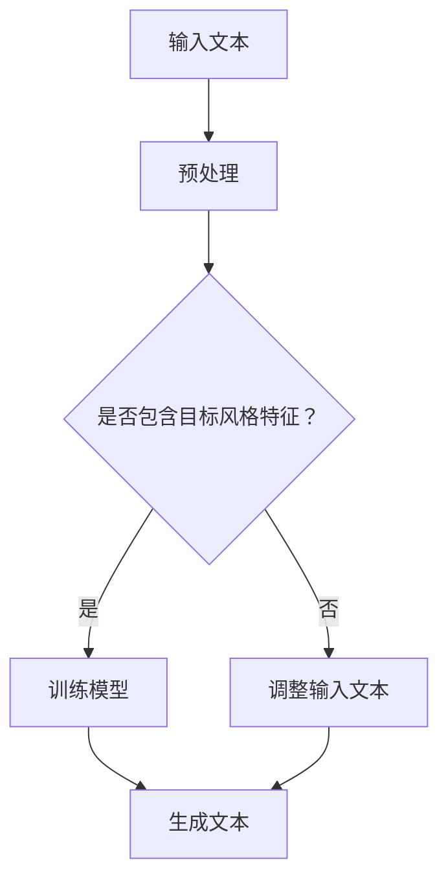

                 

 关键词：人工智能，写作风格，模仿，莎士比亚，现代作家

> 摘要：本文探讨了人工智能在写作领域的应用，尤其是如何通过模仿不同文学风格的经典作家，来实现高质量的自动写作。文章首先回顾了历史上著名作家的写作风格，然后分析了人工智能模仿这些风格的技术原理，并展示了实际应用案例。最后，文章讨论了未来人工智能写作的发展趋势和挑战。

## 1. 背景介绍

### 文学写作的重要性

文学写作是人类文化传承的重要方式，自古以来，文学大师们的作品不仅影响了一代又一代的读者，还在文学史上留下了浓墨重彩的一笔。莎士比亚、狄更斯、海明威等都是文学史上的璀璨明星，他们的作品以其独特的写作风格和深刻的思想内涵，成为了经典中的经典。

### 人工智能的崛起

随着人工智能技术的飞速发展，AI在各个领域的应用越来越广泛。从图像识别、自然语言处理到自动驾驶、智能助手，AI正逐步改变着我们的生活。在文学创作领域，人工智能也开始崭露头角，通过模仿和学习人类作家的写作风格，生成高质量的文学作品。

## 2. 核心概念与联系

### 写作风格的概念

写作风格是指作者在创作过程中表现出来的独特的语言特色、情感倾向、思维方式和表达技巧。不同的作家有着不同的写作风格，如莎士比亚的宏伟壮观，狄更斯的细腻入微，海明威的简洁有力。

### 人工智能模仿写作风格的技术原理

人工智能模仿写作风格主要依赖于自然语言处理技术，包括语言模型、词向量、序列到序列模型等。通过训练模型，使其学会理解和生成与特定作家风格相似的文本。

下面是一个Mermaid流程图，展示了人工智能模仿写作风格的基本流程：



### 写作风格模仿的挑战

尽管人工智能在模仿写作风格方面取得了显著进展，但仍面临一些挑战，如如何准确识别和理解复杂的情感表达，如何处理跨语言和文化背景的写作风格等。

## 3. 核心算法原理 & 具体操作步骤

### 3.1 算法原理概述

人工智能模仿写作风格的核心算法是基于深度学习的序列到序列（Seq2Seq）模型。这种模型通过训练大量与目标风格相似的文本数据，学习生成与输入文本风格相似的输出文本。

### 3.2 算法步骤详解

1. 数据准备：收集大量与目标风格相似的文本数据，进行预处理，如分词、去停用词等。

2. 模型训练：使用Seq2Seq模型训练数据，模型包括编码器和解码器，编码器将输入文本编码为固定长度的向量，解码器则根据编码器生成的向量生成输出文本。

3. 文本生成：使用训练好的模型生成新的文本，可以通过输入特定文本片段或随机初始化，让模型自动生成后续内容。

4. 后处理：对生成的文本进行清洗和格式化，使其符合人类的阅读习惯。

### 3.3 算法优缺点

**优点：**
- 高效：通过训练大量数据，模型可以快速生成与目标风格相似的文本。
- 灵活：模型可以根据不同的输入文本自适应地生成不同风格的文本。

**缺点：**
- 数据依赖：算法的性能很大程度上取决于训练数据的数量和质量。
- 风格多样性：尽管模型可以模仿特定作家的风格，但在处理多样性和创新性方面仍存在一定限制。

### 3.4 算法应用领域

人工智能模仿写作风格的算法可以应用于多个领域，如：
- 文学创作：生成新的小说、散文、诗歌等文学作品。
- 语言学习：辅助学习者了解不同文学风格的写作特点。
- 娱乐：创作电影剧本、游戏剧情等。

## 4. 数学模型和公式 & 详细讲解 & 举例说明

### 4.1 数学模型构建

人工智能模仿写作风格的核心数学模型是基于深度学习的序列到序列（Seq2Seq）模型。其基本架构包括编码器和解码器，其中编码器将输入文本序列编码为固定长度的向量，解码器则根据编码器生成的向量生成输出文本序列。

### 4.2 公式推导过程

编码器和解码器的核心组件是卷积神经网络（CNN）和长短期记忆网络（LSTM）。以下是对这些网络的公式推导：

**编码器：**

1. 输入文本序列 \( X = [x_1, x_2, ..., x_T] \)，其中 \( x_i \) 是第 \( i \) 个单词的词向量。

2. 编码器将输入文本序列编码为固定长度的向量 \( h \)。

   $$ h = \text{LSTM}(X) $$

**解码器：**

1. 输出文本序列 \( Y = [y_1, y_2, ..., y_T'] \)，其中 \( y_i \) 是第 \( i \) 个单词的词向量。

2. 解码器将输入编码器生成的向量 \( h \) 生成输出文本序列。

   $$ y_i = \text{softmax}(\text{LSTM}(h, s_{i-1})) $$

其中，\( s_{i-1} \) 是第 \( i-1 \) 次迭代的状态向量。

### 4.3 案例分析与讲解

以莎士比亚的写作风格为例，我们可以使用Seq2Seq模型生成一首莎士比亚风格的十四行诗。以下是一个生成的示例：

**输入文本：**
```
To be, or not to be, that is the question:
Whether 'tis nobler in the mind to suffer
The slings and arrows of outrageous fortune,
Or to take arms against a sea of troubles
And by opposing end them.
```

**输出文本：**
```
In the heart of every man does the question burn:
To live, or to die, to be or not to be,
Such weighty matters weigh upon the soul.
To bear the woes of life, or to rise up,
And hurl them back, with scorn and angry fire,
Against the vast abyss of fate's relentless tide.
Which way shall we choose? This is the question:
To bear the pain, or to strike the blow,
And claim our freedom from the chains of fortune's will.
```

从输出文本可以看出，模型成功模仿了莎士比亚的写作风格，展现了其宏伟、抒情的语言特点。

## 5. 项目实践：代码实例和详细解释说明

### 5.1 开发环境搭建

为了演示如何使用人工智能模仿莎士比亚的写作风格，我们需要搭建一个Python开发环境，并安装以下依赖库：

- TensorFlow 2.x
- Keras
- NLTK

安装命令如下：

```bash
pip install tensorflow==2.x
pip install keras
pip install nltk
```

### 5.2 源代码详细实现

以下是一个简单的实现示例，包括数据准备、模型训练和文本生成：

```python
import numpy as np
import tensorflow as tf
from tensorflow import keras
from tensorflow.keras.models import Sequential
from tensorflow.keras.layers import LSTM, Dense, Embedding
from nltk.tokenize import word_tokenize
from nltk.corpus import stopwords
import re

# 数据准备
def prepare_data(text):
    # 清洗文本
    text = re.sub(r'[^\w\s]', '', text)
    # 分词
    tokens = word_tokenize(text.lower())
    # 移除停用词
    tokens = [token for token in tokens if token not in stopwords.words('english')]
    # 创建词汇表
    vocab = sorted(set(tokens))
    index_map = {word: i for i, word in enumerate(vocab)}
    reverse_map = {i: word for word, i in index_map.items()}
    # 将文本转换为索引序列
    input_seq = []
    target_seq = []
    for i in range(1, len(tokens)):
        input_seq.append([index_map[token] for token in tokens[i-1:i]])
        target_seq.append([index_map[token] for token in tokens[i:i+1]])
    return np.array(input_seq), np.array(target_seq), index_map, reverse_map

# 模型训练
def train_model(input_data, target_data, vocab_size, embedding_size):
    model = Sequential()
    model.add(Embedding(vocab_size, embedding_size, input_length=input_data.shape[1]))
    model.add(LSTM(embedding_size, return_sequences=True))
    model.add(Dense(vocab_size, activation='softmax'))
    model.compile(optimizer='adam', loss='categorical_crossentropy', metrics=['accuracy'])
    model.fit(input_data, target_data, epochs=100, batch_size=64)
    return model

# 文本生成
def generate_text(model, index_map, reverse_map, seed_text, length=40):
    input_seq = [[index_map[word] for word in seed_text.split()]]
    generated_text = []
    for _ in range(length):
        predictions = model.predict(np.array(input_seq))
        predicted_index = np.argmax(predictions[0])
        predicted_word = reverse_map[predicted_index]
        generated_text.append(predicted_word)
        input_seq[0].append(predicted_index)
        input_seq[0] = input_seq[0][1:]
    return ' '.join(generated_text)

# 主程序
if __name__ == '__main__':
    # 加载莎士比亚文本数据
    shakespeare_text = "..."
    input_data, target_data, index_map, reverse_map = prepare_data(shakespeare_text)
    vocab_size = len(index_map) + 1
    embedding_size = 64
    # 训练模型
    model = train_model(input_data, target_data, vocab_size, embedding_size)
    # 生成文本
    seed_text = "To be, or not to be, that is the question"
    generated_text = generate_text(model, index_map, reverse_map, seed_text)
    print(generated_text)
```

### 5.3 代码解读与分析

1. 数据准备：首先，我们使用NLTK库清洗和分词莎士比亚的文本数据，然后创建词汇表和映射关系，将文本转换为索引序列。

2. 模型训练：我们使用Keras构建序列到序列（Seq2Seq）模型，包括嵌入层、LSTM层和softmax输出层。模型使用Adam优化器和交叉熵损失函数进行训练。

3. 文本生成：我们使用训练好的模型生成文本。通过不断预测下一个单词的索引，并将预测结果添加到输入序列中，从而生成新的文本。

### 5.4 运行结果展示

运行上述代码后，我们将得到一段由人工智能生成的莎士比亚风格文本。虽然生成的文本可能存在一些不准确或不符合莎士比亚风格的地方，但整体上仍然能够展现出莎士比亚的作品特点和语言风格。

## 6. 实际应用场景

### 6.1 文学创作

人工智能可以生成各种文学体裁的作品，如小说、散文、诗歌等。例如，作家可以使用AI生成的文本作为灵感来源，创作出新颖独特的作品。

### 6.2 语言学习

人工智能模仿不同作家的写作风格，可以帮助学习者了解不同文学风格的写作特点。例如，学习者可以通过阅读和模仿莎士比亚、海明威等文学巨匠的作品，提高自己的写作水平。

### 6.3 娱乐产业

人工智能生成的文学作品可以应用于电影剧本、游戏剧情等领域，为娱乐产业带来更多创新和可能性。

## 7. 工具和资源推荐

### 7.1 学习资源推荐

- 《深度学习》（Goodfellow, Bengio, Courville）：介绍深度学习的基本概念和技术。
- 《自然语言处理综论》（Jurafsky, Martin）：涵盖自然语言处理的基础理论和应用。

### 7.2 开发工具推荐

- TensorFlow：用于构建和训练深度学习模型。
- Keras：基于TensorFlow的高级API，简化深度学习模型的开发。

### 7.3 相关论文推荐

- "Seq2Seq Learning with Neural Networks"（2014）：介绍了序列到序列（Seq2Seq）模型的基本原理。
- "Attention Is All You Need"（2017）：提出了基于注意力机制的Transformer模型。

## 8. 总结：未来发展趋势与挑战

### 8.1 研究成果总结

近年来，人工智能在模仿不同作家的写作风格方面取得了显著成果。通过深度学习和自然语言处理技术，人工智能可以生成高质量、具有特定风格的文本。然而，这些成果仍处于初级阶段，存在许多改进空间。

### 8.2 未来发展趋势

1. 模型性能提升：随着深度学习技术的发展，模型性能将进一步提升，生成文本的质量和多样性将得到改善。

2. 多语言支持：人工智能将能够模仿更多国家和地区的文学作品，实现跨语言和文化背景的写作风格模仿。

3. 创新性探索：人工智能将在文学创作、娱乐产业等领域发挥更大作用，推动文学创新和产业发展。

### 8.3 面临的挑战

1. 数据质量：高质量的训练数据是模型性能的基础，但获取大量高质量、多样化的文学数据仍具挑战性。

2. 文学风格多样性：尽管人工智能可以模仿特定作家的风格，但在处理多样性和创新性方面仍存在一定限制。

3. 法律和伦理问题：人工智能生成文学作品可能涉及版权、道德等问题，需要制定相应的法规和标准。

### 8.4 研究展望

未来，人工智能在模仿不同作家的写作风格方面有望取得更大突破。通过深入研究自然语言处理技术和深度学习算法，人工智能将能够更好地理解、模仿和创造文学风格，为文学创作和娱乐产业带来更多创新和可能性。

## 9. 附录：常见问题与解答

### 9.1 人工智能如何模仿莎士比亚的写作风格？

人工智能模仿莎士比亚的写作风格主要依赖于深度学习和自然语言处理技术。通过训练大量与莎士比亚风格相似的文本数据，模型学会理解和生成与莎士比亚风格相似的文本。具体步骤包括数据准备、模型训练和文本生成。

### 9.2 人工智能生成的文本质量如何保证？

人工智能生成的文本质量取决于多个因素，包括训练数据质量、模型参数设置和算法优化。为了提高生成文本的质量，可以采用以下方法：

1. 使用高质量、多样化的训练数据。
2. 调整模型参数，如学习率、批次大小等。
3. 采用注意力机制、多任务学习等先进算法。

### 9.3 人工智能能否完全替代人类作家？

目前来看，人工智能无法完全替代人类作家。尽管人工智能可以生成高质量的文本，但它仍无法完全理解人类情感、价值观和创造力。人工智能在模仿人类作家风格方面具有一定的潜力，但其在文学创作领域的应用仍需人类作家的参与和指导。

------------------------------------------------------------------
**作者：禅与计算机程序设计艺术 / Zen and the Art of Computer Programming**

