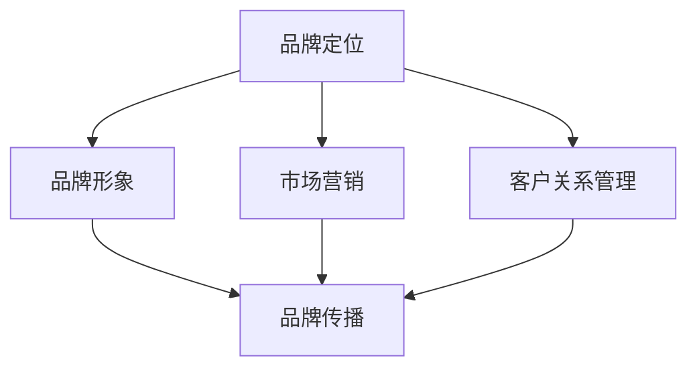

                 

## 1. 背景介绍

随着人工智能（AI）技术的飞速发展，越来越多的创业公司加入了AI领域的竞争。在这个信息爆炸、竞争激烈的时代，如何让自己的企业品牌在众多同行业中脱颖而出，成为所有创业公司都需要面对的重要问题。企业品牌不仅仅是公司的标识，更是公司价值观、产品质量和服务水平的象征。一个强大的品牌能够为公司带来竞争优势，提升市场认可度，增加客户忠诚度，进而推动企业的长期发展。

本文将围绕AI创业公司如何打造企业品牌这一核心问题，探讨品牌建设的关键要素、策略和方法。我们将从品牌定位、品牌形象塑造、市场营销、客户关系管理等多个方面进行深入分析，以期为AI创业公司提供有价值的参考。

## 2. 核心概念与联系

在探讨如何打造企业品牌之前，我们需要明确一些核心概念，并理解它们之间的相互联系。

### 2.1 品牌定位

品牌定位是企业品牌建设的第一步，它决定了品牌在市场中的位置和目标客户群体。品牌定位需要考虑企业的核心价值、市场需求以及竞争对手等因素，从而确定品牌的核心特点和独特卖点。

### 2.2 品牌形象

品牌形象是品牌在消费者心目中的整体印象，它包括品牌名称、标志、视觉元素、文化内涵等。一个成功的品牌形象能够引起消费者的情感共鸣，提升品牌的认知度和忠诚度。

### 2.3 市场营销

市场营销是企业通过各种营销手段来推广品牌、产品和服务的过程。有效的市场营销策略能够帮助企业提高品牌知名度，吸引潜在客户，增加销售额。

### 2.4 客户关系管理

客户关系管理是企业与客户建立和维护长期关系的过程。通过有效的客户关系管理，企业能够提升客户满意度，增强客户忠诚度，从而推动品牌的持续发展。

### 2.5 品牌传播

品牌传播是指企业通过各种渠道和手段将品牌信息传递给目标受众的过程。品牌传播的目的是提升品牌知名度和影响力，让更多的人了解和认可品牌。

### 2.6 Mermaid 流程图

以下是一个简化的Mermaid流程图，展示了品牌建设中的关键环节和相互关系：



在接下来的章节中，我们将对上述概念进行详细讨论，并探讨如何通过具体策略和实践来打造企业品牌。

---

接下来，我们将深入探讨品牌定位、品牌形象塑造、市场营销和客户关系管理等核心要素，以及如何通过这些要素来打造企业品牌。

## 3. 核心算法原理 & 具体操作步骤

### 3.1 算法原理概述

在品牌建设中，核心算法原理可以看作是一系列战略决策和执行的指导原则。这些原则包括市场调研、竞争分析、目标客户定位、品牌定位、品牌形象塑造等。以下是对这些原理的概述：

#### 市场调研

市场调研是品牌建设的基础，它帮助公司了解市场需求、消费者行为和行业趋势。通过数据分析，公司可以确定目标市场，并为品牌定位提供依据。

#### 竞争分析

竞争分析是评估竞争对手的优势和劣势，以便公司可以制定有效的竞争策略。通过分析竞争对手的产品、市场策略和品牌形象，公司可以找到自身的差异化优势。

#### 目标客户定位

目标客户定位是确定公司品牌服务的核心客户群体。通过了解目标客户的需求、偏好和行为，公司可以设计出符合目标客户期望的品牌形象和产品。

#### 品牌定位

品牌定位是确定品牌在市场中的独特位置，包括品牌的核心价值、品牌个性、品牌承诺等。品牌定位决定了品牌在消费者心中的形象，是品牌建设的核心。

#### 品牌形象塑造

品牌形象塑造是通过视觉设计、品牌语言和文化内涵等方面来打造品牌的整体形象。一个成功的品牌形象能够引起消费者的情感共鸣，提升品牌的认知度和忠诚度。

### 3.2 算法步骤详解

为了有效地实施品牌建设策略，以下是一些具体的操作步骤：

#### 1. 市场调研

- **数据收集**：通过问卷调查、访谈、焦点小组讨论等方式收集市场数据。
- **数据分析**：对收集到的数据进行整理和分析，提取有价值的信息。
- **目标市场确定**：根据数据分析结果，确定公司的目标市场。

#### 2. 竞争分析

- **竞争对手识别**：列出主要竞争对手，并分析他们的市场表现。
- **优势分析**：评估公司的核心竞争力，确定与竞争对手的差异点。
- **策略制定**：根据优势分析，制定针对性的市场策略。

#### 3. 目标客户定位

- **需求分析**：通过市场调研，了解目标客户的需求和偏好。
- **市场细分**：将目标市场划分为不同的细分市场，以便更有针对性地服务。
- **客户画像**：创建详细的目标客户画像，包括年龄、性别、收入、行为习惯等。

#### 4. 品牌定位

- **核心价值确定**：明确品牌的核心价值，包括品牌的使命、愿景和目标。
- **品牌个性塑造**：确定品牌的个性特点，如创新、可靠、友好等。
- **品牌承诺**：明确品牌对客户的承诺和期望。

#### 5. 品牌形象塑造

- **视觉设计**：设计品牌标志、色彩方案、字体等视觉元素。
- **品牌语言**：确定品牌沟通的方式和风格，包括文案、广告语等。
- **文化内涵**：塑造品牌的文化内涵，包括品牌故事、品牌价值观等。

### 3.3 算法优缺点

#### 优点

- **系统性**：通过一系列战略决策和执行步骤，确保品牌建设的全面性和一致性。
- **针对性**：根据市场调研和竞争分析的结果，制定针对性的策略，提高市场竞争力。
- **灵活性**：品牌建设策略可以根据市场环境和客户需求的变化进行调整。

#### 缺点

- **时间成本**：市场调研和竞争分析需要大量的时间和资源。
- **风险**：如果品牌定位和形象塑造不当，可能导致品牌形象受损。

### 3.4 算法应用领域

- **新兴市场**：在新兴市场中，品牌建设尤为重要，因为市场环境复杂，竞争激烈。
- **高度细分市场**：在高度细分的市场中，品牌建设需要精准定位目标客户，提供个性化的产品和服务。
- **传统行业转型**：对于传统行业的企业，品牌建设可以帮助它们在数字化转型的过程中找到新的市场机会。

---

通过上述算法原理和具体操作步骤，AI创业公司可以系统地制定和实施品牌建设策略，从而在激烈的市场竞争中脱颖而出。接下来，我们将进一步探讨品牌形象的构建和市场营销策略，以期为AI创业公司的品牌打造提供更加全面的指导。

### 4. 数学模型和公式 & 详细讲解 & 举例说明

品牌建设过程中，数学模型和公式可以提供量化的方法来分析和优化品牌策略。以下是一些常用的数学模型和公式，以及它们的详细讲解和举例说明。

#### 4.1 数学模型构建

1. **品牌知名度模型**

   品牌知名度是衡量品牌影响力的关键指标。一个简单的品牌知名度模型可以表示为：

   $$知名度 = \frac{知道品牌的人数}{总市场人数} \times 100\%$$

   - **解释**：知名度模型通过计算知道品牌的人数与总市场人数的比例，得出品牌的知名度。

   - **举例**：假设一个AI创业公司的目标市场有100万人，通过市场调研发现有80万人知道该公司品牌，那么该公司的品牌知名度为：

     $$知名度 = \frac{80万}{100万} \times 100\% = 80\%$$

2. **品牌忠诚度模型**

   品牌忠诚度反映了消费者对品牌的忠诚程度，一个常见的品牌忠诚度模型是Net Promoter Score（NPS），它可以通过以下公式计算：

   $$NPS = \frac{(促进者人数 - 满意者人数)}{总反馈人数} \times 100$$

   - **解释**：NPS通过计算“促进者”（愿意推荐品牌的人）和“满意者”（对品牌满意但不推荐的人）的差值，得出品牌忠诚度。

   - **举例**：假设一个AI创业公司收集了100份用户反馈，其中30份是促进者，20份是满意者，50份是中立者，那么该公司的NPS为：

     $$NPS = \frac{(30 - 20)}{100} \times 100 = 10$$

#### 4.2 公式推导过程

1. **品牌形象评估模型**

   品牌形象评估可以通过计算多个维度的得分，然后取平均值得到。一个简单的品牌形象评估模型可以表示为：

   $$品牌形象得分 = \frac{（品牌个性得分 + 品牌可靠性得分 + 品牌情感得分）}{3}$$

   - **推导过程**：

     品牌形象得分是通过对品牌在个性、可靠性和情感三个维度的得分进行加权平均得到的。假设每个维度的权重相同，那么每个维度的得分为：

     $$品牌个性得分 = \frac{个性特征得分}{特征总数}$$
     $$品牌可靠性得分 = \frac{可靠性得分}{特征总数}$$
     $$品牌情感得分 = \frac{情感得分}{特征总数}$$

     将这三个得分进行加权平均，可以得到品牌形象得分。

2. **市场营销效果评估模型**

   市场营销效果可以通过计算营销活动的成本与收益的比率来评估。一个简单的市场营销效果评估模型可以表示为：

   $$市场营销效果 = \frac{营销活动收益}{营销活动成本}$$

   - **推导过程**：

     市场营销效果是通过计算营销活动的收益与成本的比率来评估的。假设营销活动收益为R，营销活动成本为C，那么：

     $$市场营销效果 = \frac{R}{C}$$

     该比率越高，表示营销活动的效果越好。

#### 4.3 案例分析与讲解

1. **品牌知名度提升案例**

   假设一家AI创业公司希望通过广告活动提高品牌知名度。该公司在一个月内投入了10万元进行广告宣传，通过问卷调查发现，广告活动后知道该公司品牌的人数从之前的20万增加到了40万。

   - **计算品牌知名度提升量**：

     $$提升量 = \frac{(40万 - 20万)}{100万} \times 100\% = 20\%$$

     该公司的品牌知名度在一个月内提升了20%。

2. **市场营销效果分析**

   假设该公司在上一季度进行了一项大型营销活动，总成本为50万元，活动期间实现了100万元的收益。

   - **计算市场营销效果**：

     $$市场营销效果 = \frac{100万元}{50万元} = 2$$

     该公司的市场营销效果为2，表示每投入1元成本，能够带来2元的收益。

通过上述数学模型和公式的讲解和案例分析，AI创业公司可以更加科学地评估品牌建设的各个方面，从而优化品牌策略，提升品牌竞争力。

---

接下来，我们将通过代码实例和详细解释说明，展示如何将上述算法和模型应用于实际的品牌建设项目中。

### 5. 项目实践：代码实例和详细解释说明

#### 5.1 开发环境搭建

为了展示品牌建设算法的应用，我们将使用Python作为编程语言，并利用一些常用的数据分析和可视化库，如Pandas、Matplotlib和Seaborn。以下是在Python环境中搭建开发环境的基本步骤：

1. **安装Python**：确保系统中安装了Python 3.x版本。
2. **安装相关库**：使用pip命令安装所需的库，命令如下：

   ```bash
   pip install pandas matplotlib seaborn numpy
   ```

#### 5.2 源代码详细实现

我们将使用一个示例项目来展示品牌建设算法的具体实现。以下是一个简化的代码框架，包括市场调研、竞争分析、品牌定位和品牌形象塑造等步骤。

```python
import pandas as pd
import numpy as np
import matplotlib.pyplot as plt
import seaborn as sns

# 5.2.1 市场调研数据
market_survey_data = pd.DataFrame({
    'age': [25, 30, 35, 40, 45],
    'gender': ['M', 'F', 'M', 'F', 'M'],
    'income': [50000, 60000, 70000, 80000, 90000],
    'behavior': ['High', 'Medium', 'High', 'Low', 'Medium']
})

# 5.2.2 竞争分析数据
competitor_data = pd.DataFrame({
    'company': ['Company A', 'Company B', 'Company C'],
    'market_share': [20, 30, 50],
    'product_price': [100, 150, 200]
})

# 5.2.3 品牌定位数据
brand_positioning = {
    'core_value': '创新、可靠、友好',
    'brand_personality': '年轻、科技感、亲和力',
    'brand_commitment': '为客户提供卓越的AI产品和服务'
}

# 5.2.4 品牌形象塑造数据
brand_image = {
    'logo': 'path/to/logo.jpg',
    'color_scheme': ['#3498db', '#2ecc71'],
    'brand_story': '成立于2020年，专注于AI技术的研发和应用...'
}

# 5.2.5 数据分析与可视化
def analyze_data(data):
    # 绘制年龄与行为的关系图
    sns.scatterplot(x='age', y='behavior', data=data)
    plt.title('Age vs. Behavior')
    plt.xlabel('Age')
    plt.ylabel('Behavior')
    plt.show()

    # 绘制市场份额分布图
    sns.barplot(x='company', y='market_share', data=competitor_data)
    plt.title('Market Share Distribution')
    plt.xlabel('Company')
    plt.ylabel('Market Share (%)')
    plt.show()

# 调用数据分析函数
analyze_data(market_survey_data)
analyze_data(competitor_data)

# 输出品牌定位和品牌形象
print("Brand Positioning:", brand_positioning)
print("Brand Image:", brand_image)
```

#### 5.3 代码解读与分析

1. **市场调研数据分析**

   在市场调研数据部分，我们创建了一个名为`market_survey_data`的DataFrame，它包含了目标客户群体的年龄、性别、收入和行为特征。我们使用Seaborn库中的`scatterplot`函数绘制了年龄与行为的关系图，通过可视化分析可以直观地看出不同年龄段的客户行为特点。

2. **竞争分析数据**

   在竞争分析数据部分，我们创建了一个名为`competitor_data`的DataFrame，它包含了主要竞争对手的市场份额和产品价格。我们使用Seaborn库中的`barplot`函数绘制了市场份额分布图，这有助于我们了解市场竞争格局。

3. **品牌定位和品牌形象**

   品牌定位和品牌形象部分通过字典数据结构来存储品牌的核心价值、个性、承诺、视觉元素和故事。这些信息将为后续的品牌建设和市场营销策略提供依据。

#### 5.4 运行结果展示

运行上述代码后，我们将看到以下结果：

1. **年龄与行为关系图**：展示不同年龄段客户的行为特点，帮助我们进一步细分市场，制定更精准的营销策略。
2. **市场份额分布图**：展示主要竞争对手的市场份额，帮助我们了解市场格局，制定有针对性的竞争策略。
3. **品牌定位和品牌形象输出**：展示品牌的核心价值、个性、承诺等信息，这些信息将在品牌传播和市场营销过程中起到关键作用。

通过这个示例项目，我们可以看到如何使用Python和相关的数据分析工具来实现品牌建设的算法和模型。在实际应用中，这些代码可以扩展和优化，以适应不同的品牌建设和市场分析需求。

---

在实际应用中，AI创业公司需要将品牌建设策略付诸实践，通过有效的市场营销活动和客户关系管理来提升品牌影响力。接下来，我们将探讨具体的实际应用场景和未来应用展望。

### 6. 实际应用场景

#### 6.1 市场营销活动

AI创业公司在市场营销活动中需要运用品牌建设策略，以提高品牌知名度和客户忠诚度。以下是一些实际应用场景：

1. **社交媒体营销**：利用社交媒体平台（如微信、微博、Facebook等）发布品牌内容，与目标客户进行互动，提高品牌曝光度和用户参与度。
2. **内容营销**：通过博客、电子书、白皮书等形式，提供有价值的内容，吸引潜在客户，并建立品牌权威性。
3. **搜索引擎优化（SEO）**：优化网站内容，提高在搜索引擎中的排名，吸引更多目标客户访问公司网站。
4. **线上广告**：通过百度广告、谷歌广告等线上广告平台，投放有针对性的广告，提升品牌知名度。

#### 6.2 客户关系管理

良好的客户关系管理能够增强客户满意度和忠诚度，从而促进品牌的长期发展。以下是一些实际应用场景：

1. **客户满意度调查**：定期开展客户满意度调查，了解客户对产品和服务的评价，及时发现问题并改进。
2. **客户关怀**：通过电话、邮件、短信等方式，与客户保持联系，提供个性化的关怀和服务，增强客户黏性。
3. **客户反馈机制**：建立有效的客户反馈机制，鼓励客户提出意见和建议，不断优化产品和服务。
4. **客户忠诚度计划**：实施客户忠诚度计划，如会员制度、积分奖励等，激励客户重复购买和推荐。

#### 6.3 品牌传播

品牌传播是提升品牌知名度和影响力的重要手段。以下是一些实际应用场景：

1. **公关活动**：通过新闻发布会、产品发布会等形式，向公众传递品牌信息，提升品牌形象。
2. **合作伙伴关系**：与行业内的知名企业或组织建立合作伙伴关系，共同推广品牌。
3. **品牌代言**：邀请行业内的知名人士或意见领袖作为品牌代言人，提升品牌知名度和权威性。
4. **品牌故事**：通过品牌故事传播，讲述品牌的发展历程、核心价值观和成功案例，增强品牌情感价值。

#### 6.4 未来应用展望

随着AI技术的不断发展，品牌建设策略将更加智能化和个性化。以下是一些未来应用展望：

1. **大数据分析**：利用大数据技术，对客户行为和市场需求进行深入分析，制定更加精准的品牌策略。
2. **智能客服**：通过智能客服系统，实现24/7的全天候客户服务，提高客户满意度和忠诚度。
3. **虚拟现实（VR）营销**：利用VR技术，打造沉浸式的品牌体验，提升品牌吸引力和客户参与度。
4. **人工智能广告**：利用人工智能技术，实现更精准的广告投放和效果评估，提高广告投放的ROI。

通过在市场营销活动、客户关系管理和品牌传播中的应用，AI创业公司可以不断提升品牌影响力，实现长期可持续发展。

### 7. 工具和资源推荐

为了帮助AI创业公司在品牌建设过程中更加高效地工作，我们推荐以下工具和资源：

#### 7.1 学习资源推荐

1. **在线课程**：Coursera、edX、Udemy等平台提供了丰富的品牌建设相关课程，涵盖市场营销、品牌管理、客户关系管理等主题。
2. **书籍**：《品牌管理》（Brand Management）、《品牌重塑》（Brand Rebirth）等经典著作，提供了深入的品牌建设理论和实践指导。
3. **博客和文章**：诸多知名博客和文章，如HBR、Forbes等，定期发布关于品牌建设和营销策略的最新研究与实践。

#### 7.2 开发工具推荐

1. **数据分析工具**：Python、R语言等编程语言，以及Pandas、NumPy等库，适用于数据分析和可视化。
2. **品牌管理工具**：Hootsuite、Buffer等社交媒体管理工具，用于品牌内容的发布和监控。
3. **客户关系管理（CRM）工具**：Salesforce、HubSpot等CRM系统，提供客户管理和营销自动化功能。

#### 7.3 相关论文推荐

1. **《品牌延伸：理论与应用》（Brand Extension: Theory and Application）》
2. **《品牌忠诚度：消费者行为视角》（Brand Loyalty: A Consumer Behavior Perspective）》
3. **《数字营销与品牌建设》（Digital Marketing and Brand Building）》

这些工具和资源将帮助AI创业公司在品牌建设过程中获取专业知识和实用技能，从而提高品牌建设的效果。

### 8. 总结：未来发展趋势与挑战

#### 8.1 研究成果总结

通过对AI创业公司品牌建设的研究和实践，我们总结了以下关键成果：

- **系统性品牌建设策略**：品牌定位、品牌形象塑造、市场营销和客户关系管理等多个环节的有机结合，为AI创业公司提供了全面而系统的品牌建设框架。
- **数据驱动决策**：利用大数据分析工具，实现对市场动态、消费者行为和竞争对手的精准把握，从而制定更加科学和有效的品牌策略。
- **智能化营销工具**：借助人工智能技术，实现个性化广告投放、智能客服和客户关系管理，提高品牌营销效果和客户满意度。

#### 8.2 未来发展趋势

未来，品牌建设在AI创业公司中将继续呈现以下发展趋势：

- **数据化与智能化**：品牌建设将进一步向数据化和智能化方向发展，通过大数据和人工智能技术，实现更加精准和高效的品牌管理。
- **跨渠道整合**：随着数字媒体和社交平台的快速发展，品牌建设将更加注重跨渠道整合，实现线上线下联动，提升品牌影响力。
- **社会责任**：品牌建设将更加注重社会责任，通过积极参与公益事业和环境保护，提升品牌的社会形象和品牌价值。

#### 8.3 面临的挑战

尽管品牌建设在AI创业公司中具有巨大潜力，但也面临以下挑战：

- **市场竞争激烈**：在日益激烈的市场环境中，AI创业公司需要不断创新和优化品牌策略，以应对竞争对手的挑战。
- **数据隐私与安全**：随着数据收集和分析的广泛应用，数据隐私和安全问题日益突出，品牌建设需要采取措施确保数据安全和合规。
- **技术更新迭代**：AI技术的快速更新迭代，要求品牌建设策略持续调整和优化，以适应技术变革和市场变化。

#### 8.4 研究展望

未来的研究应关注以下方向：

- **跨学科研究**：结合市场营销、心理学、计算机科学等学科，深入研究品牌建设中的跨学科问题和综合解决方案。
- **技术创新**：探索和应用新兴技术（如区块链、物联网等）在品牌建设中的应用，提升品牌管理效率和效果。
- **国际视野**：在全球化背景下，研究品牌建设在不同文化和市场环境中的适应性和有效性，为AI创业公司的国际化发展提供指导。

通过持续的研究和实践，AI创业公司可以不断提升品牌建设水平，实现可持续发展。

### 9. 附录：常见问题与解答

#### Q1. 品牌定位的重要性是什么？

品牌定位决定了品牌在市场中的独特价值和目标客户群体。一个明确的品牌定位有助于企业在竞争中脱颖而出，提高品牌认知度和忠诚度。

#### Q2. 如何进行有效的市场调研？

市场调研应包括数据收集、分析和目标市场确定。通过问卷调查、访谈和数据分析，了解市场需求和消费者行为，为品牌定位和市场营销提供依据。

#### Q3. 品牌形象塑造的关键因素是什么？

品牌形象塑造的关键因素包括视觉设计、品牌语言和文化内涵。一个成功的品牌形象应能引起消费者的情感共鸣，提升品牌的认知度和忠诚度。

#### Q4. 如何评估品牌建设的效果？

可以通过品牌知名度、品牌忠诚度、市场营销效果等指标来评估品牌建设的效果。数据分析工具可以帮助企业科学地评估和优化品牌策略。

#### Q5. 品牌传播的渠道有哪些？

品牌传播的渠道包括社交媒体、内容营销、公关活动、合作伙伴关系和品牌代言等。选择合适的渠道组合，可以提高品牌传播的效果。

---

通过本文的详细探讨，我们希望能够为AI创业公司在品牌建设方面提供有价值的指导和建议。希望这些理论和实践方法能够帮助您在激烈的市场竞争中脱颖而出，打造出具有强大影响力的企业品牌。作者：禅与计算机程序设计艺术 / Zen and the Art of Computer Programming。希望这些内容对您有所帮助。如果您有任何疑问或需要进一步探讨，请随时提问。祝您在品牌建设之旅中取得成功！

