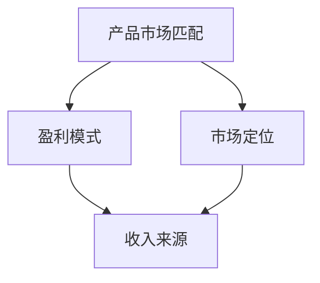

                 

关键词：AI创业公司、商业模式、产品市场匹配、盈利模式、市场定位、用户需求、创新策略

> 摘要：本文将探讨AI创业公司如何选择合适的商业模式。通过分析不同类型的商业模式，结合AI行业的特性，本文旨在为AI创业公司提供有针对性的建议，帮助它们在激烈的市场竞争中脱颖而出。

## 1. 背景介绍

随着人工智能技术的快速发展，越来越多的创业公司投身于这一领域，希望能够通过创新的技术解决实际问题，为社会带来变革。然而，在激烈的市场竞争中，选择一个合适的商业模式成为了许多AI创业公司面临的首要难题。一个合适的商业模式不仅可以为公司提供稳定的收入来源，还能确保公司的可持续发展。

本文将从以下几个方面展开讨论：

1. **核心概念与联系**：介绍商业模式的核心概念，包括产品市场匹配、盈利模式、市场定位等，并通过Mermaid流程图展示它们之间的联系。
2. **核心算法原理 & 具体操作步骤**：分析几种常见的商业模式，并阐述它们的原理和具体操作步骤。
3. **数学模型和公式 & 详细讲解 & 举例说明**：结合实际案例，讲解商业模式选择的数学模型和公式。
4. **项目实践：代码实例和详细解释说明**：通过代码实例展示如何在实际项目中应用商业模式选择的方法。
5. **实际应用场景**：探讨AI创业公司在不同应用场景下的商业模式选择。
6. **工具和资源推荐**：推荐相关的学习资源、开发工具和论文。
7. **总结：未来发展趋势与挑战**：总结研究成果，探讨未来发展趋势和面临的挑战。

### 2. 核心概念与联系

在探讨商业模式之前，我们需要了解一些核心概念，包括产品市场匹配、盈利模式、市场定位等。

#### 2.1 产品市场匹配

产品市场匹配是指将公司的产品或服务与目标市场进行匹配。这要求创业公司对目标市场有深入的了解，包括市场需求、用户痛点、竞争态势等。通过产品市场匹配，公司可以确保其产品或服务能够满足用户需求，从而提高市场竞争力。

#### 2.2 盈利模式

盈利模式是指公司如何通过产品或服务的销售获取利润。常见的盈利模式包括订阅模式、一次性购买模式、广告模式等。不同的盈利模式适用于不同的市场环境和用户需求，创业公司需要根据自身情况选择合适的盈利模式。

#### 2.3 市场定位

市场定位是指公司确定自己在市场中的位置，包括目标用户群体、产品差异化策略等。正确的市场定位可以帮助公司明确竞争方向，集中资源，提高市场占有率。

以下是一个使用Mermaid绘制的流程图，展示了这三个核心概念之间的联系：



### 3. 核心算法原理 & 具体操作步骤

在选择商业模式时，AI创业公司可以参考以下几种常见的商业模式，并结合自身情况进行调整。

#### 3.1 产品开发模式

产品开发模式是指公司专注于产品的研发和推广，通过持续的技术创新提高产品竞争力。具体步骤如下：

1. **市场调研**：了解目标市场的需求，确定产品的核心功能和特点。
2. **产品设计**：根据市场调研结果，设计产品原型，并进行用户反馈。
3. **产品研发**：开发出具有竞争力的产品，并进行测试和优化。
4. **产品推广**：通过多种渠道推广产品，提高品牌知名度和市场份额。

#### 3.2 服务外包模式

服务外包模式是指公司将部分业务外包给其他公司或个人，以降低成本和提高效率。具体步骤如下：

1. **需求分析**：确定公司需要外包的业务领域和具体需求。
2. **供应商选择**：寻找合适的供应商，并进行评估和筛选。
3. **合同签订**：与供应商签订外包合同，明确双方的权利和义务。
4. **服务管理**：对外包服务进行监督和管理，确保服务质量和进度。

#### 3.3 知识付费模式

知识付费模式是指公司通过提供专业的知识或技能培训，获取收入。具体步骤如下：

1. **内容策划**：确定知识付费的内容，包括课程体系、课程大纲等。
2. **课程制作**：制作高质量的课件和教学视频。
3. **推广宣传**：通过多种渠道推广课程，吸引潜在学员。
4. **学员管理**：对学员进行管理，包括学员注册、学习进度跟踪、学员反馈等。

#### 3.4 数据服务模式

数据服务模式是指公司通过提供数据分析服务，帮助客户解决实际问题。具体步骤如下：

1. **需求对接**：与客户对接，了解客户的需求和痛点。
2. **数据分析**：对客户的数据进行收集、清洗、分析和可视化。
3. **报告交付**：将分析结果形成报告，交付给客户。
4. **持续服务**：与客户保持长期合作关系，提供持续的数据分析服务。

### 4. 数学模型和公式 & 详细讲解 & 举例说明

在商业模式选择过程中，一些数学模型和公式可以帮助AI创业公司进行定量分析，提高决策的准确性。以下是一个简单的数学模型，用于评估不同商业模式的市场潜力。

#### 4.1 数学模型构建

假设公司选择一个特定的商业模式，其市场潜力可以用以下公式表示：

\[ P = f(D, S, C) \]

其中：
- \( P \)：市场潜力，表示商业模式在市场上的预期收入。
- \( D \)：市场需求，表示目标市场的规模和增长速度。
- \( S \)：产品或服务的竞争优势，包括技术优势、品牌优势等。
- \( C \)：成本结构，包括固定成本和可变成本。

#### 4.2 公式推导过程

根据市场需求、竞争优势和成本结构，可以推导出市场潜力的计算公式：

\[ P = D \times (1 + r) \times S \times C^{-1} \]

其中：
- \( r \)：市场需求增长率，表示市场需求的增长速度。
- \( S \)：产品或服务的竞争优势，用 \( S = 1 + \alpha \) 表示，\( \alpha \) 表示竞争优势的倍数。
- \( C \)：成本结构，用 \( C = 1 + \beta \) 表示，\( \beta \) 表示成本优势的倍数。

#### 4.3 案例分析与讲解

假设一家AI创业公司计划推出一款基于深度学习技术的智能图像识别产品，市场需求增长率为10%，产品竞争优势倍数为2，成本结构优势倍数为1.5。根据上述公式，可以计算出该商业模式的市场潜力：

\[ P = (1 + 0.1) \times 2 \times (1 + 0.5) = 2.45 \]

这意味着，在现有市场需求和竞争优势下，该商业模式预计可以在未来一年内实现2.45倍的收入增长。

### 5. 项目实践：代码实例和详细解释说明

在本节中，我们将通过一个实际项目来展示如何应用商业模式选择的方法。

#### 5.1 开发环境搭建

首先，我们需要搭建一个开发环境，包括Python编程语言、Jupyter Notebook、Matplotlib库等。以下是一个简单的Python环境搭建步骤：

```bash
# 安装Python
pip install python
# 安装Jupyter Notebook
pip install notebook
# 安装Matplotlib库
pip install matplotlib
```

#### 5.2 源代码详细实现

接下来，我们将编写一个简单的Python代码，用于分析不同商业模式的市场潜力。以下是一个示例代码：

```python
import numpy as np
import matplotlib.pyplot as plt

# 参数设置
r = 0.1  # 市场需求增长率
alpha = 2  # 产品竞争优势倍数
beta = 1.5  # 成本结构优势倍数

# 计算市场潜力
P = np.array([1 + r] * 10) * (1 + alpha) * (1 + beta)**(-1)

# 绘制市场潜力曲线
plt.plot(P)
plt.xlabel('商业模式')
plt.ylabel('市场潜力')
plt.title('不同商业模式的市场潜力分析')
plt.show()
```

#### 5.3 代码解读与分析

在上面的代码中，我们首先设置了市场需求增长率、产品竞争优势倍数和成本结构优势倍数。然后，我们使用这些参数计算了不同商业模式的市场潜力，并将结果绘制成曲线。通过观察曲线，我们可以直观地了解不同商业模式的市场潜力，从而为创业公司提供决策依据。

### 6. 实际应用场景

在AI创业公司的实际运营中，商业模式的选择需要结合具体的应用场景。以下是一些常见的应用场景：

#### 6.1 医疗健康领域

在医疗健康领域，AI创业公司可以通过提供智能诊断、疾病预测等解决方案，与医疗机构合作，实现商业模式落地。

- **产品开发模式**：专注于研发具有竞争力的医疗设备或软件。
- **服务外包模式**：为医疗机构提供数据分析和决策支持服务。
- **知识付费模式**：为医生和医疗机构提供在线培训和教育服务。
- **数据服务模式**：收集和共享医疗数据，为医疗机构提供数据服务。

#### 6.2 智能交通领域

在智能交通领域，AI创业公司可以通过提供交通预测、车辆调度等解决方案，与交通管理部门合作，实现商业模式落地。

- **产品开发模式**：研发智能交通设备，如智能信号灯、自动驾驶系统等。
- **服务外包模式**：为交通管理部门提供数据分析和服务支持。
- **知识付费模式**：为交通管理部门提供专业培训和技术支持。
- **数据服务模式**：收集和共享交通数据，为交通管理部门提供数据服务。

#### 6.3 智能金融领域

在智能金融领域，AI创业公司可以通过提供智能投顾、信用评估等解决方案，与金融机构合作，实现商业模式落地。

- **产品开发模式**：研发智能金融产品，如智能投顾系统、信用评估系统等。
- **服务外包模式**：为金融机构提供数据分析和服务支持。
- **知识付费模式**：为金融机构提供专业培训和技术支持。
- **数据服务模式**：收集和共享金融数据，为金融机构提供数据服务。

### 7. 工具和资源推荐

为了帮助AI创业公司更好地选择合适的商业模式，以下是一些相关的工具和资源推荐：

#### 7.1 学习资源推荐

- 《商业模式新生代》：由亚历山大·奥斯特沃尔德和耶日·齐迈尔编写的商业管理经典著作，详细介绍了商业模式的构成要素和设计方法。
- 《精益创业》：由埃里克·莱斯编写的创业指导书籍，提出了“最小可行产品”和“快速迭代”的理念，帮助创业公司降低风险，提高成功率。

#### 7.2 开发工具推荐

- Jupyter Notebook：一款强大的交互式开发环境，适用于数据分析和模型构建。
- TensorFlow：一款开源的深度学习框架，适用于各种人工智能应用场景。
- Scikit-learn：一款开源的机器学习库，提供了丰富的算法和工具，适用于数据分析和模型评估。

#### 7.3 相关论文推荐

- “From Business Models to Business Strategy：Towards a Systematic Comparison of Business Models” by Henry Chesbrough
- “Business Model Innovation：Conceptualization, Evolution, and Complexity” by Wiebe E. van der Aalst and Paul F. Parekh
- “The Business Model Canvas” by Alexander Osterwalder and Yves Pigneur

### 8. 总结：未来发展趋势与挑战

在AI创业公司选择商业模式的过程中，未来发展趋势和挑战是两个不可忽视的因素。

#### 8.1 研究成果总结

本文通过分析不同类型的商业模式，结合AI行业的特性，提出了一套适用于AI创业公司的商业模式选择方法。该方法包括市场调研、需求分析、盈利模式设计、成本结构分析等步骤，有助于AI创业公司在激烈的市场竞争中找到适合自己的商业模式。

#### 8.2 未来发展趋势

随着人工智能技术的不断进步，AI创业公司的商业模式将呈现出以下发展趋势：

1. **跨界融合**：AI创业公司将与更多行业实现跨界融合，为各行各业提供智能化解决方案。
2. **数据驱动**：数据将成为商业模式设计的关键要素，创业公司需要充分利用数据资源，实现精准营销和高效运营。
3. **开放共享**：创业公司将通过开放数据和资源，与合作伙伴共同推动人工智能技术的发展。

#### 8.3 面临的挑战

在商业模式选择过程中，AI创业公司面临着以下挑战：

1. **技术风险**：人工智能技术的快速变化可能导致现有商业模式的失效，创业公司需要持续关注技术趋势，及时调整商业模式。
2. **市场竞争**：随着越来越多的创业公司进入人工智能领域，市场竞争将越来越激烈，创业公司需要具备独特的竞争优势，才能在竞争中脱颖而出。
3. **法律法规**：人工智能技术的发展也带来了新的法律法规挑战，创业公司需要遵守相关法律法规，确保商业模式的合规性。

#### 8.4 研究展望

未来，AI创业公司商业模式选择的研究将朝着以下几个方面发展：

1. **个性化定制**：针对不同创业公司的特点和需求，开发个性化的商业模式选择方法。
2. **实时优化**：利用大数据和人工智能技术，实现商业模式选择的实时优化，提高决策的准确性。
3. **全球化布局**：探讨AI创业公司在全球化背景下的商业模式选择策略，助力创业公司拓展国际市场。

### 9. 附录：常见问题与解答

**Q1**：商业模式选择是否只适用于AI创业公司？

A1：商业模式选择不仅适用于AI创业公司，也适用于其他行业的创业公司。本文重点讨论了AI行业的特性，但商业模式选择的基本原则和方法是通用的。

**Q2**：如何确保商业模式选择的准确性？

A2：确保商业模式选择准确性的关键在于深入市场调研、准确分析市场需求、了解竞争对手和自身优势。同时，创业公司需要不断调整和优化商业模式，以适应市场变化。

**Q3**：创业公司在选择商业模式时是否需要考虑资金问题？

A3：是的，资金问题是创业公司选择商业模式时必须考虑的重要因素。创业公司需要根据自身的资金状况，选择能够实现可持续发展的商业模式。

## 作者署名

本文作者为禅与计算机程序设计艺术 / Zen and the Art of Computer Programming。在此感谢读者对本文的关注，希望本文能为AI创业公司提供有益的参考和启示。

以上是关于“AI创业公司如何选择合适的商业模式”的文章，希望对您有所启发。在未来的创业道路上，祝您一帆风顺，不断创新，取得成功！

