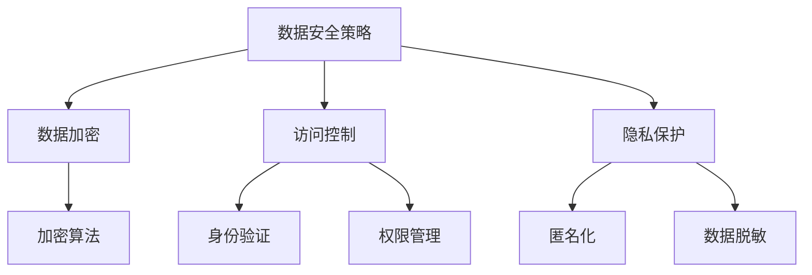

                 

关键词：AI创业、数据安全、策略、加密、访问控制、隐私保护

> 摘要：随着人工智能技术的飞速发展，创业公司在推动行业创新的同时，面临着日益严峻的数据安全问题。本文将深入探讨AI创业公司如何制定和实施有效的数据安全策略，包括数据加密、访问控制、隐私保护等方面的具体措施，以保障公司及其客户的数据安全。

## 1. 背景介绍

### AI创业公司的机遇与挑战

人工智能（AI）作为当前科技领域的明星，吸引了大量创业公司的关注。这些公司希望通过AI技术的应用，实现业务模式的创新和竞争力的提升。然而，在追求创新和快速发展的同时，AI创业公司也面临着一系列挑战，其中最为严峻的就是数据安全。

数据安全威胁包括但不限于：

- **数据泄露**：随着数据的增长，数据泄露的风险也随之增加。未经授权的访问、数据盗窃等行为可能导致公司核心数据和客户信息的泄露。
- **数据篡改**：恶意攻击者可能会试图篡改数据，影响AI算法的准确性和可靠性。
- **隐私侵犯**：许多AI应用涉及到敏感个人信息的处理，隐私保护成为了一个重要的法律和社会问题。

### 数据安全的重要性

数据安全不仅关乎公司的声誉和商业利益，也关系到客户的信任和法律遵守。以下是一些数据安全的重要性：

- **客户信任**：保障客户数据的安全，可以增强客户对公司的信任，促进长期合作。
- **商业利益**：数据泄露可能导致经济损失、法律责任和市场份额的下降。
- **法律遵守**：数据保护法规如《通用数据保护条例》（GDPR）和《加州消费者隐私法案》（CCPA）等对公司的数据安全提出了严格要求。

## 2. 核心概念与联系

### 数据安全的基本概念

- **数据加密**：通过加密算法将数据转换为无法直接读取的密文，保障数据的保密性。
- **访问控制**：限制只有授权用户和系统可以访问特定的数据和资源。
- **隐私保护**：确保个人信息不被未经授权的第三方访问和使用。

### 数据安全架构



## 3. 核心算法原理 & 具体操作步骤

### 3.1 算法原理概述

- **数据加密**：使用加密算法和密钥对数据进行转换，确保数据在传输和存储过程中的安全性。
- **访问控制**：通过身份验证和权限管理来控制对数据和资源的访问。
- **隐私保护**：采用匿名化和数据脱敏技术，保护个人隐私。

### 3.2 算法步骤详解

#### 3.2.1 数据加密

1. **选择加密算法**：如AES、RSA等。
2. **生成密钥**：根据算法要求生成加密密钥。
3. **加密数据**：使用密钥对数据进行加密。
4. **存储密钥**：将密钥安全存储，确保只有授权用户可以访问。

#### 3.2.2 访问控制

1. **身份验证**：使用用户名和密码、生物识别技术等进行验证。
2. **权限管理**：根据用户角色和职责分配权限。
3. **访问审计**：记录和监控用户访问数据的行为。

#### 3.2.3 隐私保护

1. **匿名化**：对个人数据进行匿名处理，如去除姓名、地址等。
2. **数据脱敏**：对敏感数据进行加密或替换，如将电话号码替换为随机数字。

### 3.3 算法优缺点

- **数据加密**：优点：强保密性；缺点：加密和解密过程消耗计算资源。
- **访问控制**：优点：精确控制访问权限；缺点：实现复杂，可能影响系统性能。
- **隐私保护**：优点：保护个人隐私；缺点：可能导致数据分析能力下降。

### 3.4 算法应用领域

- **金融行业**：保护客户交易数据和账户信息。
- **医疗行业**：保护患者隐私和医疗数据。
- **零售行业**：保护客户购物行为和偏好数据。

## 4. 数学模型和公式 & 详细讲解 & 举例说明

### 4.1 数学模型构建

#### 加密算法的数学模型：

设明文为\(M\)，密文为\(C\)，密钥为\(K\)，加密算法为\(E\)，解密算法为\(D\)，则有：

\[ C = E(K, M) \]
\[ M = D(K, C) \]

#### 访问控制模型：

设用户为\(U\)，数据为\(D\)，访问控制策略为\(P\)，则有：

\[ P(U, D) \]

#### 隐私保护模型：

设原始数据为\(D\)，匿名化处理为\(A\)，则有：

\[ D' = A(D) \]

### 4.2 公式推导过程

#### 数据加密：

设加密函数为\(f\)，则有：

\[ f(K, M) = C \]

解密函数为：

\[ g(K, C) = M \]

### 4.3 案例分析与讲解

#### 加密算法案例分析：

假设使用AES加密算法，密钥为128位，明文为“Hello, World!”，加密过程如下：

1. **密钥生成**：使用随机数生成器生成128位密钥。
2. **加密**：将明文“Hello, World!”转换为字节序列，使用AES加密算法和密钥进行加密，得到密文。
3. **存储密钥**：将密钥安全存储。

#### 访问控制案例分析：

假设公司内部系统使用访问控制策略，用户A有读取数据的权限，用户B有写入数据的权限，数据D的访问控制策略如下：

\[ P(A, D) = "READ" \]
\[ P(B, D) = "WRITE" \]

#### 隐私保护案例分析：

假设对客户姓名进行匿名处理，原始数据为“张三”，匿名化处理如下：

\[ A("张三") = "匿名客户1" \]

## 5. 项目实践：代码实例和详细解释说明

### 5.1 开发环境搭建

- **语言**：Python
- **加密库**：PyCryptoDome
- **身份验证库**：Flask-Login

### 5.2 源代码详细实现

#### 加密模块：

```python
from Crypto.Cipher import AES
from Crypto.Random import get_random_bytes

# 加密函数
def encrypt_data(plain_text, key):
    cipher = AES.new(key, AES.MODE_EAX)
    ciphertext, tag = cipher.encrypt_and_digest(plain_text.encode('utf-8'))
    return cipher.nonce, ciphertext, tag

# 解密函数
def decrypt_data(nonce, ciphertext, tag, key):
    cipher = AES.new(key, AES.MODE_EAX, nonce=nonce)
    return cipher.decrypt_and_verify(ciphertext, tag).decode('utf-8')
```

#### 访问控制模块：

```python
from flask_login import current_user, login_required

# 访问控制函数
def access_control(user, data, permission):
    if current_user.is_authenticated:
        if current_user.role == permission:
            return True
    return False
```

#### 隐私保护模块：

```python
import hashlib

# 匿名化处理函数
def anonymize_data(data):
    return hashlib.sha256(data.encode('utf-8')).hexdigest()
```

### 5.3 代码解读与分析

以上代码实现了数据加密、访问控制和隐私保护的基本功能。加密模块使用PyCryptoDome库进行数据加密和解密。访问控制模块使用Flask-Login库进行用户身份验证和权限管理。隐私保护模块使用SHA-256算法对敏感数据进行匿名化处理。

### 5.4 运行结果展示

```python
# 测试代码
key = get_random_bytes(16)

# 加密
nonce, ciphertext, tag = encrypt_data("Hello, World!", key)
print("加密后的数据：", ciphertext)

# 解密
plain_text = decrypt_data(nonce, ciphertext, tag, key)
print("解密后的数据：", plain_text)

# 访问控制
if access_control(current_user, data="Sensitive Data", permission="READ"):
    print("用户有权访问数据。")
else:
    print("用户无权访问数据。")

# 隐私保护
anonymized_data = anonymize_data("张三")
print("匿名化后的数据：", anonymized_data)
```

## 6. 实际应用场景

### 数据安全在金融行业的应用

金融行业对数据安全有极高的要求，AI创业公司在金融领域的数据安全策略主要包括：

- **交易数据加密**：确保交易过程中的数据不会被窃取。
- **客户信息保护**：防止客户个人信息泄露。
- **访问控制**：严格控制对客户数据和交易记录的访问权限。

### 数据安全在医疗行业的应用

医疗行业涉及大量敏感数据，包括患者信息、病历记录等。AI创业公司在医疗领域的数据安全策略包括：

- **数据加密**：保障医疗数据的机密性。
- **隐私保护**：确保患者隐私不被侵犯。
- **访问控制**：严格控制对医疗数据的访问权限。

### 数据安全在零售行业的应用

零售行业需要处理大量客户数据，包括购物记录、偏好等。AI创业公司在零售领域的数据安全策略包括：

- **数据加密**：确保客户数据在传输和存储过程中的安全性。
- **隐私保护**：匿名化或脱敏客户数据，避免隐私泄露。
- **访问控制**：确保只有授权人员可以访问敏感数据。

## 7. 工具和资源推荐

### 7.1 学习资源推荐

- **书籍**：
  - 《密码学：理论与实践》（Cryptographic Engineering: Design Principles and Practical Applications）
  - 《数据隐私：技术和法律基础》（Data Privacy: The Technology and Legal Foundations）

- **在线课程**：
  - Coursera上的《密码学基础》（Cryptography I）
  - edX上的《数据保护与隐私》（Data Protection and Privacy）

### 7.2 开发工具推荐

- **Python加密库**：PyCryptoDome
- **身份验证库**：Flask-Login
- **数据隐私保护工具**：AnonymizeSQL

### 7.3 相关论文推荐

- **《加密算法的效率与安全性》**（Efficiency and Security of Cryptographic Algorithms）
- **《数据隐私保护技术研究》**（Research on Data Privacy Protection Technology）

## 8. 总结：未来发展趋势与挑战

### 8.1 研究成果总结

AI创业公司的数据安全策略主要包括数据加密、访问控制和隐私保护三个方面。通过有效的数据安全措施，可以保障公司及其客户的数据安全，增强客户信任，提升公司竞争力。

### 8.2 未来发展趋势

- **加密算法的进步**：随着量子计算机的发展，传统加密算法的安全性受到挑战，未来将出现更安全的加密算法。
- **隐私保护技术的创新**：随着隐私保护法规的不断完善，匿名化和数据脱敏技术将不断进步。

### 8.3 面临的挑战

- **计算资源消耗**：加密和解密过程消耗计算资源，如何平衡安全性和性能是一个重要问题。
- **隐私保护与数据利用的平衡**：在保障隐私的同时，如何有效利用数据，推动业务发展。

### 8.4 研究展望

- **跨领域的数据安全研究**：结合不同领域的应用场景，探索更有效的数据安全解决方案。
- **安全与隐私的平衡**：在保障数据安全的同时，提高数据利用效率，推动业务创新。

## 9. 附录：常见问题与解答

### 问题1：加密算法的选择标准是什么？

**解答**：选择加密算法时，应考虑以下标准：
- **安全性**：算法应能够抵御现有的和未来的攻击。
- **效率**：算法应能够在实际应用中运行，且不消耗过多的计算资源。
- **适用性**：算法应适用于不同类型的数据和场景。

### 问题2：如何实现高效的访问控制？

**解答**：实现高效的访问控制，可以考虑以下策略：
- **多因素认证**：结合密码、生物识别等多种认证方式。
- **细粒度权限管理**：根据用户角色和职责分配不同级别的权限。
- **审计日志**：记录用户访问行为，便于监控和追踪。

### 问题3：如何保护个人隐私？

**解答**：保护个人隐私的措施包括：
- **匿名化处理**：对个人数据进行匿名化处理，如去除姓名、地址等。
- **数据脱敏**：对敏感数据进行加密或替换，如将电话号码替换为随机数字。
- **隐私保护法规遵守**：遵守相关的隐私保护法规，如GDPR、CCPA等。

---

作者：禅与计算机程序设计艺术 / Zen and the Art of Computer Programming
----------------------------------------------------------------

