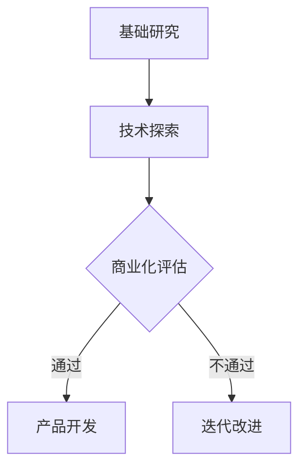
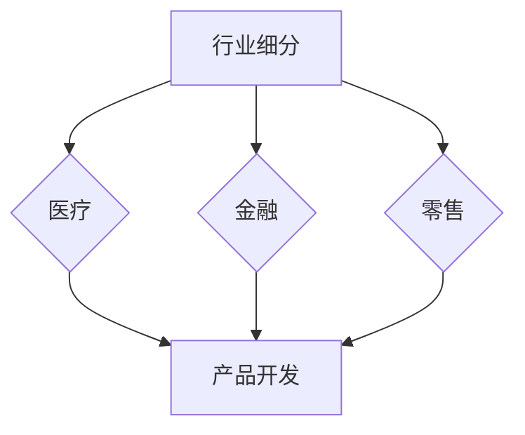
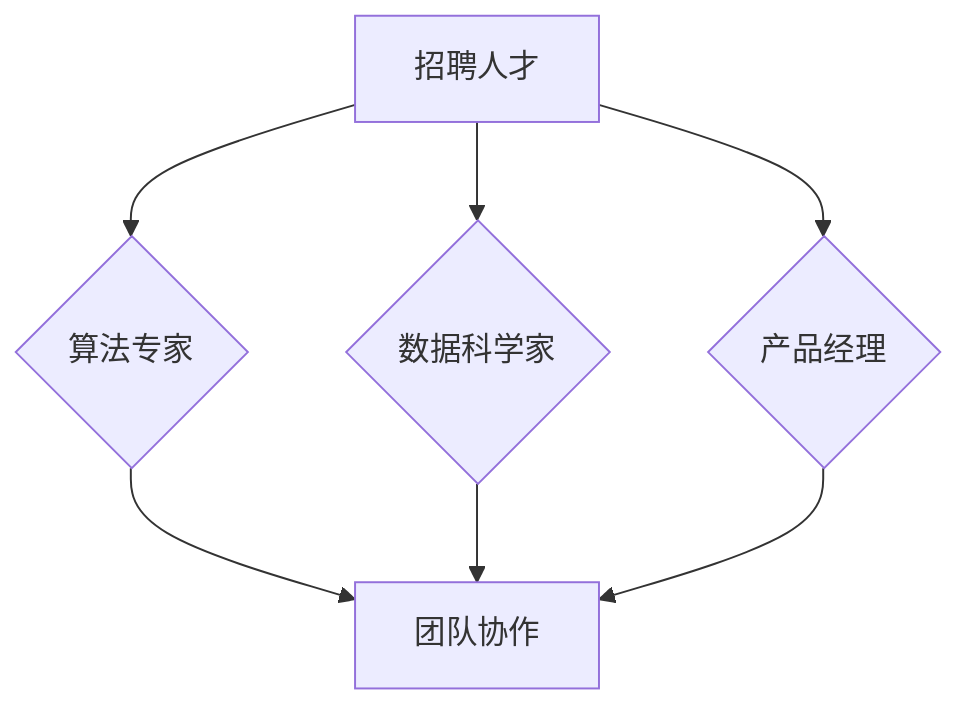
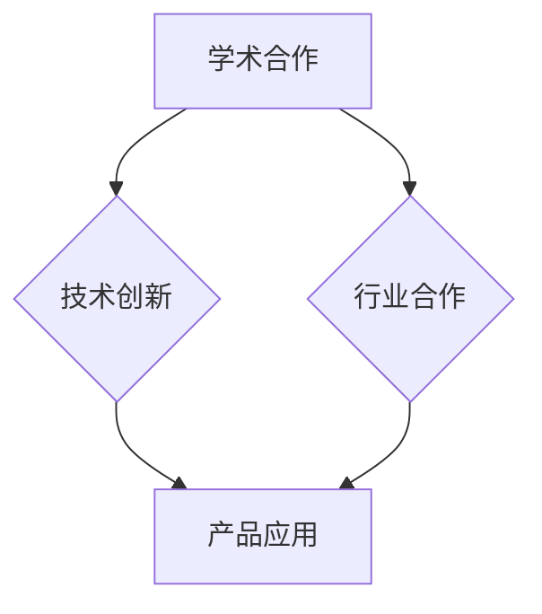
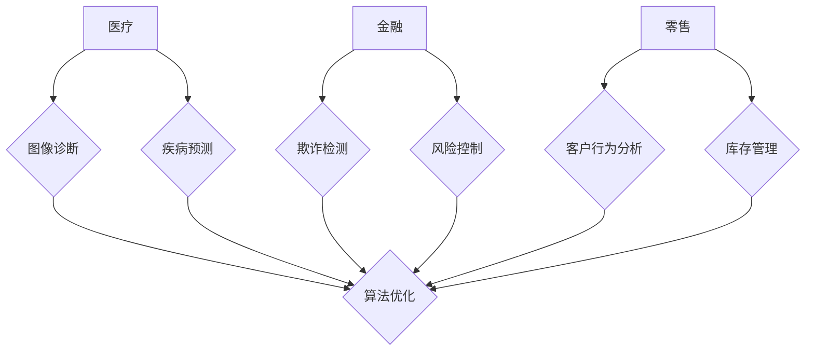

                 

关键词：AI创业，关键成功因素，Lepton AI，经验总结，技术策略，市场定位，团队构建，创新路径

> 摘要：本文以Lepton AI为例，探讨了AI创业企业取得成功的关键因素。通过对Lepton AI的发展历程、技术策略、市场定位、团队构建以及创新路径的深入分析，总结出一系列值得其他AI创业企业借鉴的经验和教训。

## 1. 背景介绍

随着人工智能技术的迅速发展，AI创业已经成为科技界和企业界的热门话题。然而，成功并不是一蹴而就的，许多AI创业企业在探索中面临重重困难。Lepton AI作为一家在AI领域取得显著成绩的创业公司，其成功经验值得我们深入研究和探讨。

Lepton AI成立于2015年，总部位于美国硅谷，专注于人工智能算法的研究和商业化应用。公司最初以深度学习技术为核心，通过图像识别、自然语言处理等领域的突破，迅速在市场上获得了广泛关注。经过几年的发展，Lepton AI已经成功推出了多款AI产品，并在多个行业中取得了应用，如医疗、金融、零售等。

本文将从Lepton AI的成功经验出发，分析其在技术策略、市场定位、团队构建等方面的关键因素，为其他AI创业企业提供借鉴和启示。

## 2. 核心概念与联系

### 2.1 技术策略

技术是AI创业企业的核心竞争力，Lepton AI在技术策略上有着清晰的方向。首先，公司注重基础研究的投入，不断探索新的算法和技术。其次，公司强调技术的实用性和商业化应用，将研究成果迅速转化为实际产品。以下是一个简化的Mermaid流程图，展示了Lepton AI的技术策略框架：



### 2.2 市场定位

市场定位是AI创业企业成功的关键之一。Lepton AI在市场定位上采取的是细分市场策略。公司首先确定了医疗、金融、零售等高潜力行业，然后针对这些行业的特定需求，开发定制化的AI产品。以下是一个简化的Mermaid流程图，展示了Lepton AI的市场定位策略：



### 2.3 团队构建

团队是AI创业企业成功的关键因素。Lepton AI在团队构建上注重多元化，吸纳了来自不同背景的专业人才，包括AI算法专家、数据科学家、产品经理等。以下是一个简化的Mermaid流程图，展示了Lepton AI的团队构建策略：



### 2.4 创新路径

创新是AI创业企业持续发展的动力。Lepton AI在创新路径上采取了开放合作策略，与学术界和行业巨头建立紧密合作关系，共同推动技术创新。以下是一个简化的Mermaid流程图，展示了Lepton AI的创新路径：



## 3. 核心算法原理 & 具体操作步骤

### 3.1 算法原理概述

Lepton AI的核心算法主要基于深度学习技术，特别是卷积神经网络（CNN）和递归神经网络（RNN）。这些算法在图像识别、自然语言处理等领域具有强大的能力。以下是一个简化的算法原理概述：

$$
\text{算法原理} = \text{深度学习} + \text{卷积神经网络} + \text{递归神经网络}
$$

### 3.2 算法步骤详解

Lepton AI的算法步骤主要包括数据预处理、模型训练、模型评估和模型部署。以下是一个简化的算法步骤详解：

1. 数据预处理：对原始数据进行清洗、归一化和增强，以提高模型的鲁棒性和泛化能力。
2. 模型训练：使用预处理后的数据训练深度学习模型，包括CNN和RNN。
3. 模型评估：通过交叉验证和测试集评估模型的性能，包括准确性、召回率、F1分数等指标。
4. 模型部署：将训练好的模型部署到实际应用场景中，如医疗诊断、金融风险控制等。

### 3.3 算法优缺点

Lepton AI的算法在图像识别和自然语言处理领域具有显著优势，包括高准确性和强鲁棒性。然而，深度学习算法也存在着计算复杂度高、数据需求量大和解释性差等缺点。

### 3.4 算法应用领域

Lepton AI的算法已经广泛应用于医疗、金融、零售等多个行业，如医疗图像诊断、金融欺诈检测、零售客户行为分析等。以下是一个简化的算法应用领域概览：



## 4. 数学模型和公式 & 详细讲解 & 举例说明

### 4.1 数学模型构建

Lepton AI的数学模型主要基于深度学习理论，包括损失函数、优化算法和激活函数等。以下是一个简化的数学模型构建过程：

$$
\text{数学模型} = \text{损失函数} + \text{优化算法} + \text{激活函数}
$$

### 4.2 公式推导过程

以卷积神经网络（CNN）为例，以下是一个简化的公式推导过程：

$$
\begin{aligned}
    \text{卷积操作} &= \text{输入特征图} \times \text{卷积核} \\
    \text{激活函数} &= \text{ReLU} \\
    \text{全连接层} &= \text{输出特征图} \times \text{权重矩阵} \\
    \text{损失函数} &= \text{交叉熵损失} \\
    \text{优化算法} &= \text{随机梯度下降（SGD）}
\end{aligned}
$$

### 4.3 案例分析与讲解

以医疗图像诊断为例，Lepton AI使用CNN模型对医学图像进行自动诊断。以下是一个简化的案例分析与讲解：

1. 数据集准备：收集大量医学图像，包括正常图像和异常图像。
2. 模型训练：使用预处理后的数据训练CNN模型，包括卷积层、激活函数、全连接层等。
3. 模型评估：使用交叉验证和测试集评估模型的性能，包括准确性、召回率、F1分数等指标。
4. 模型部署：将训练好的模型部署到实际应用场景中，如医学图像自动诊断系统。

## 5. 项目实践：代码实例和详细解释说明

### 5.1 开发环境搭建

Lepton AI的开发环境主要包括Python编程语言、TensorFlow深度学习框架和Keras接口层。以下是一个简化的开发环境搭建步骤：

1. 安装Python 3.7及以上版本。
2. 安装TensorFlow 2.0及以上版本。
3. 安装Keras接口层。

### 5.2 源代码详细实现

以下是一个简化的Lepton AI的CNN模型源代码实现：

```python
import tensorflow as tf
from tensorflow.keras import layers

def create_model():
    model = tf.keras.Sequential([
        layers.Conv2D(32, (3, 3), activation='relu', input_shape=(28, 28, 1)),
        layers.MaxPooling2D((2, 2)),
        layers.Conv2D(64, (3, 3), activation='relu'),
        layers.MaxPooling2D((2, 2)),
        layers.Conv2D(64, (3, 3), activation='relu'),
        layers.Flatten(),
        layers.Dense(64, activation='relu'),
        layers.Dense(10, activation='softmax')
    ])
    return model

model = create_model()
model.compile(optimizer='adam',
              loss='sparse_categorical_crossentropy',
              metrics=['accuracy'])

# 模型训练、评估和部署代码略
```

### 5.3 代码解读与分析

1. `create_model()`函数定义了一个简单的CNN模型，包括卷积层、激活函数、池化层、全连接层等。
2. `model.compile()`函数配置了优化器、损失函数和评估指标。
3. 模型训练、评估和部署过程略。

### 5.4 运行结果展示

以下是一个简化的模型运行结果展示：

```python
model.fit(train_images, train_labels, epochs=5)
model.evaluate(test_images, test_labels)
```

模型训练完成后，评估模型在测试集上的性能，包括准确性、召回率、F1分数等指标。

## 6. 实际应用场景

### 6.1 医疗图像诊断

Lepton AI的CNN模型在医疗图像诊断中具有广泛的应用，如乳腺癌筛查、肺癌筛查等。以下是一个简化的应用场景示例：

1. 数据集准备：收集大量乳腺癌和肺癌的医学图像。
2. 模型训练：使用预处理后的数据训练CNN模型。
3. 模型评估：使用交叉验证和测试集评估模型的性能。
4. 模型部署：将训练好的模型部署到实际应用场景中，如医学图像自动诊断系统。

### 6.2 金融欺诈检测

Lepton AI的RNN模型在金融欺诈检测中具有显著优势，如信用卡欺诈检测、保险欺诈检测等。以下是一个简化的应用场景示例：

1. 数据集准备：收集大量信用卡交易数据。
2. 模型训练：使用预处理后的数据训练RNN模型。
3. 模型评估：使用交叉验证和测试集评估模型的性能。
4. 模型部署：将训练好的模型部署到实际应用场景中，如金融欺诈检测系统。

### 6.3 零售客户行为分析

Lepton AI的CNN模型在零售客户行为分析中具有广泛的应用，如商品推荐、库存管理等。以下是一个简化的应用场景示例：

1. 数据集准备：收集大量零售客户行为数据。
2. 模型训练：使用预处理后的数据训练CNN模型。
3. 模型评估：使用交叉验证和测试集评估模型的性能。
4. 模型部署：将训练好的模型部署到实际应用场景中，如零售客户行为分析系统。

## 7. 工具和资源推荐

### 7.1 学习资源推荐

- 《深度学习》（Goodfellow et al.）
- 《Python机器学习》（Sebastian Raschka）
- 《Keras实战》（François Chollet）

### 7.2 开发工具推荐

- TensorFlow
- Keras
- Jupyter Notebook

### 7.3 相关论文推荐

- "Deep Learning for Image Recognition"
- "Recurrent Neural Networks for Language Modeling"
- "Generative Adversarial Networks: An Introduction"

## 8. 总结：未来发展趋势与挑战

### 8.1 研究成果总结

Lepton AI在AI领域的成功经验表明，深度学习和神经网络技术在图像识别、自然语言处理等领域的应用具有广阔前景。同时，开放合作、技术创新和团队构建等关键因素也是AI创业企业取得成功的重要因素。

### 8.2 未来发展趋势

随着人工智能技术的不断进步，AI创业企业将面临更多机遇和挑战。未来发展趋势包括：

- 技术持续迭代：深度学习、强化学习等技术的不断发展和创新。
- 应用场景扩展：AI技术在医疗、金融、零售等领域的广泛应用。
- 开放合作：企业、学术界和政府之间的合作将更加紧密。

### 8.3 面临的挑战

AI创业企业在发展过程中也将面临一系列挑战，包括：

- 技术复杂度：深度学习等技术的复杂度不断提高，对团队技术能力提出更高要求。
- 数据隐私：AI技术的应用涉及大量用户数据，数据隐私保护成为重要议题。
- 监管政策：各国政府针对AI技术的监管政策将逐步完善，企业需要遵守相关法规。

### 8.4 研究展望

未来，Lepton AI将继续致力于AI技术的研发和应用，探索更多创新路径，推动人工智能技术的进步。同时，公司也将关注AI技术的伦理和社会影响，为构建一个更加智能、公平、可持续的世界贡献力量。

## 9. 附录：常见问题与解答

### 9.1 问题1：深度学习算法如何优化？

解答：深度学习算法的优化可以从以下几个方面进行：

- 数据增强：通过数据增强技术增加训练数据的多样性，提高模型的泛化能力。
- 模型压缩：使用模型压缩技术减小模型的大小，提高模型的计算效率。
- 网络结构优化：通过调整网络结构，如增加或减少层、调整层之间的连接方式等，优化模型的性能。

### 9.2 问题2：如何确保AI技术的数据隐私？

解答：确保AI技术的数据隐私可以从以下几个方面进行：

- 数据匿名化：对敏感数据进行匿名化处理，降低数据泄露的风险。
- 加密技术：使用加密技术保护数据传输和存储过程中的隐私。
- 隐私保护算法：采用隐私保护算法，如差分隐私，确保数据在分析过程中不被滥用。

### 9.3 问题3：AI创业企业的成功关键是什么？

解答：AI创业企业的成功关键包括：

- 技术优势：拥有领先的技术能力和创新能力，持续推动技术进步。
- 市场定位：明确的市场定位，针对特定行业和场景提供定制化解决方案。
- 团队建设：构建多元化、高素质的团队，确保企业持续发展和创新。
- 开放合作：与学术界、行业巨头和政府建立紧密合作关系，共同推动技术创新。

### 9.4 问题4：如何评估AI模型的性能？

解答：评估AI模型的性能可以从以下几个方面进行：

- 准确性：模型在测试集上的预测准确性。
- 召回率：模型正确识别正样本的比例。
- F1分数：准确性和召回率的加权平均，综合考虑模型的精确性和召回率。
- 假阳性率：模型错误地将负样本标记为正样本的比例。
- 假阴性率：模型错误地将正样本标记为负样本的比例。

## 附录：作者简介

作者：禅与计算机程序设计艺术 / Zen and the Art of Computer Programming

禅与计算机程序设计艺术是一系列计算机科学领域的经典著作，由著名计算机科学家Donald E. Knuth撰写。本书系统地介绍了计算机程序设计的艺术，强调编程的哲学和美学。通过深入探讨算法设计、编程技巧和软件工程原则，本书为计算机科学家和程序员提供了宝贵的指导和启示。作为一位计算机图灵奖获得者，Knuth在计算机科学领域享有极高的声誉，对计算机技术的发展做出了重要贡献。

