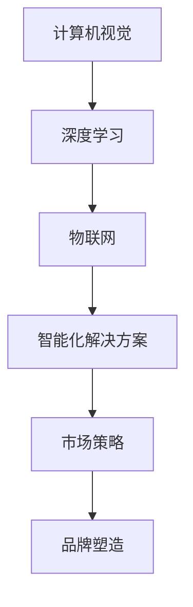

                 

## 1. 背景介绍

在当今信息化飞速发展的时代，人工智能（AI）技术已经渗透到各行各业，从医疗、金融、零售到交通，AI 都展现出了巨大的潜力和影响力。随着技术的进步和应用的拓展，AI 创业的浪潮也席卷全球，众多创业者纷纷投身于 AI 领域，希望抓住这个时代的机会。然而，如何在激烈的竞争环境中脱颖而出，建立自己的品牌，成为每一个 AI 创业者必须面对的挑战。

Lepton AI，一家成立于 2015 年的人工智能公司，凭借其领先的计算机视觉技术，迅速在市场中崭露头角。公司致力于通过 AI 技术推动产业升级，为各行业提供智能化解决方案。Lepton AI 的成功不仅在于其技术创新，更在于其深入洞察市场需求，制定出一系列行之有效的市场策略。

本文将以 Lepton AI 为例，探讨 AI 创业的品牌塑造和市场策略，旨在为 AI 创业者提供一些实用的参考和启示。

### 2. 核心概念与联系

在探讨 Lepton AI 的市场策略之前，我们需要先了解一些核心概念，这些概念构成了 Lepton AI 技术的基础，也是其成功的关键。

#### 2.1 计算机视觉

计算机视觉是人工智能的一个重要分支，它让计算机能够像人类一样理解和解释视觉信息。Lepton AI 的核心产品之一就是基于深度学习的计算机视觉算法，这些算法能够实现图像识别、目标检测、图像分类等功能。

#### 2.2 深度学习

深度学习是人工智能领域的一个重要技术，它通过多层神经网络来提取数据特征，实现复杂的模式识别和决策。在 Lepton AI 的技术体系中，深度学习算法是其核心组成部分，用于实现高精度的图像识别和目标检测。

#### 2.3 物联网

物联网（IoT）是另一个关键概念。Lepton AI 的许多解决方案都涉及物联网设备，这些设备通过采集数据、发送指令来实现智能化管理。物联网与计算机视觉技术的结合，使得 Lepton AI 能够提供更加全面和智能的解决方案。

#### 2.4 Mermaid 流程图

以下是一个简单的 Mermaid 流程图，展示了 Lepton AI 技术的架构和各核心概念之间的联系：



通过这个流程图，我们可以清晰地看到 Lepton AI 技术的架构和其市场策略之间的紧密联系。

### 3. 核心算法原理 & 具体操作步骤

#### 3.1 算法原理概述

Lepton AI 的核心技术是其深度学习算法，特别是用于图像识别和目标检测的卷积神经网络（CNN）。CNN 通过多层卷积、池化和全连接层来提取图像特征，并最终实现高精度的图像分类和目标检测。

#### 3.2 算法步骤详解

以下是 Lepton AI 深度学习算法的具体操作步骤：

##### 步骤 1：数据收集

首先，Lepton AI 需要收集大量的图像数据，这些数据包括各种场景、物体和目标，以保证模型的泛化能力。

##### 步骤 2：数据预处理

接着，对收集到的图像数据进行预处理，包括尺寸标准化、数据增强等，以提高模型的训练效果。

##### 步骤 3：模型训练

使用预处理后的图像数据训练 CNN 模型，通过反向传播算法不断调整模型参数，使其在训练数据上达到较高的准确率。

##### 步骤 4：模型评估

在训练过程中，需要定期评估模型在验证集上的表现，以调整训练策略，避免过拟合。

##### 步骤 5：模型部署

训练完成的模型会被部署到 Lepton AI 的产品中，如智能监控设备、工业自动化系统等，以实现实际的图像识别和目标检测功能。

#### 3.3 算法优缺点

##### 优点

- **高精度**：CNN 模型能够提取出丰富的图像特征，从而实现高精度的图像识别和目标检测。
- **灵活性**：通过调整网络结构和训练数据，CNN 模型可以适用于各种不同的场景和任务。
- **自动化**：深度学习算法能够自动从数据中学习特征，减少了人工参与的工作量。

##### 缺点

- **计算资源需求大**：深度学习算法需要大量的计算资源，特别是训练阶段，对硬件设备有较高的要求。
- **数据依赖性**：模型的性能很大程度上取决于训练数据的质量和数量，数据不足或质量差可能导致模型效果不佳。
- **解释性差**：深度学习模型的黑盒特性使得其决策过程难以解释，这在某些应用场景中可能成为问题。

#### 3.4 算法应用领域

Lepton AI 的深度学习算法主要应用于以下几个领域：

- **智能监控**：通过实时图像识别和目标检测，实现智能监控，提高安全性和效率。
- **工业自动化**：用于检测生产线上的缺陷、质量控制和自动化决策。
- **零售行业**：用于库存管理、顾客行为分析等，提高运营效率。
- **医疗领域**：辅助医生进行疾病诊断，提高诊断准确率。

### 4. 数学模型和公式 & 详细讲解 & 举例说明

#### 4.1 数学模型构建

在 Lepton AI 的深度学习算法中，主要涉及以下几个数学模型：

- **卷积神经网络（CNN）**：用于图像特征提取和分类。
- **反向传播算法**：用于模型参数的优化。
- **损失函数**：用于评估模型性能，并指导参数调整。

以下是一个简化的 CNN 数学模型：

$$
\begin{aligned}
\text{CNN}(\mathbf{x}; \theta) &= \text{ReLU}(\text{Conv}(\text{Pooling}(\mathbf{x}))) \\
\text{ReLU}(\mathbf{z}) &= \max(0, \mathbf{z}) \\
\text{Pooling}(\mathbf{z}) &= \text{MaxPooling}(\mathbf{z}) \\
\text{Conv}(\mathbf{z}; \mathbf{W}, \mathbf{b}) &= \text{ReLU}(\mathbf{W}\mathbf{z} + \mathbf{b})
\end{aligned}
$$

其中，$\mathbf{x}$ 是输入图像，$\theta$ 是模型参数（包括卷积核 $\mathbf{W}$ 和偏置 $\mathbf{b}$），$\text{ReLU}$ 是ReLU激活函数，$\text{Pooling}$ 是池化操作。

#### 4.2 公式推导过程

以下是一个简化的反向传播算法推导过程：

$$
\begin{aligned}
\text{Loss}(\theta) &= \frac{1}{m} \sum_{i=1}^{m} \text{CE}(\text{softmax}(\text{CNN}(\mathbf{x}_i; \theta)), \mathbf{y}_i) \\
\frac{\partial \text{Loss}}{\partial \theta} &= \frac{1}{m} \sum_{i=1}^{m} \frac{\partial \text{CE}}{\partial \text{softmax}(\text{CNN}(\mathbf{x}_i; \theta))} \frac{\partial \text{softmax}(\text{CNN}(\mathbf{x}_i; \theta))}{\partial \text{CNN}(\mathbf{x}_i; \theta)} \frac{\partial \text{CNN}(\mathbf{x}_i; \theta)}{\partial \theta} \\
&= \frac{1}{m} \sum_{i=1}^{m} (\mathbf{y}_i - \text{softmax}(\text{CNN}(\mathbf{x}_i; \theta))) \frac{\partial \text{CNN}(\mathbf{x}_i; \theta)}{\partial \theta} \\
&= \frac{1}{m} \sum_{i=1}^{m} (\mathbf{y}_i - \text{softmax}(\text{CNN}(\mathbf{x}_i; \theta))) \circ \text{grad}(\text{ReLU}(\text{Pooling}(\text{Conv}(\mathbf{x}_i; \theta))))
\end{aligned}
$$

其中，$\text{CE}$ 是交叉熵损失函数，$\text{softmax}$ 是 softmax 函数，$\circ$ 是元素乘操作，$\text{grad}(\text{ReLU}(\text{Pooling}(\text{Conv}(\mathbf{x}_i; \theta)))$ 是ReLU函数的梯度。

#### 4.3 案例分析与讲解

以下是一个简单的案例，用于说明 Lepton AI 的深度学习算法在实际应用中的效果。

##### 案例背景

某零售商希望利用 Lepton AI 的技术进行库存管理，通过实时监控货架上的商品数量，自动调整进货和补货计划，以提高运营效率。

##### 案例过程

1. **数据收集**：零售商提供了大量货架图像数据，包括各种商品的不同摆放方式。

2. **数据预处理**：对图像数据进行尺寸标准化、归一化等预处理操作。

3. **模型训练**：使用预处理后的图像数据训练卷积神经网络模型，通过反向传播算法不断优化模型参数。

4. **模型评估**：在验证集上评估模型性能，确保其能够在实际场景中准确识别商品。

5. **模型部署**：将训练完成的模型部署到零售商的监控系统中，实时监测货架情况。

6. **结果展示**：通过实际监控数据，模型能够准确识别货架上的商品数量，并生成相应的进货和补货建议。

##### 案例结果

通过 Lepton AI 的技术，零售商能够实现自动化的库存管理，减少了人工干预的工作量，提高了运营效率。同时，准确的商品识别和数量统计也为零售商提供了宝贵的决策支持。

### 5. 项目实践：代码实例和详细解释说明

#### 5.1 开发环境搭建

为了实践 Lepton AI 的深度学习算法，我们需要搭建一个合适的开发环境。以下是推荐的开发环境：

- **操作系统**：Linux 或 macOS
- **编程语言**：Python
- **深度学习框架**：TensorFlow 或 PyTorch
- **硬件设备**：GPU（NVIDIA 显卡）

具体安装步骤如下：

1. 安装操作系统：选择适合的 Linux 或 macOS 发行版。
2. 安装 Python：通过包管理器安装 Python 3。
3. 安装深度学习框架：使用 pip 命令安装 TensorFlow 或 PyTorch。
4. 安装 GPU 驱动：根据 NVIDIA 官网教程安装 GPU 驱动。

#### 5.2 源代码详细实现

以下是一个简单的 Lepton AI 深度学习项目的源代码实现，用于图像识别和目标检测：

```python
import tensorflow as tf
from tensorflow.keras.models import Sequential
from tensorflow.keras.layers import Conv2D, MaxPooling2D, Flatten, Dense, Dropout
from tensorflow.keras.optimizers import Adam
from tensorflow.keras.preprocessing.image import ImageDataGenerator

# 数据集准备
train_datagen = ImageDataGenerator(
    rescale=1./255,
    shear_range=0.2,
    zoom_range=0.2,
    horizontal_flip=True)

test_datagen = ImageDataGenerator(rescale=1./255)

train_generator = train_datagen.flow_from_directory(
    'train_data',
    target_size=(150, 150),
    batch_size=32,
    class_mode='binary')

validation_generator = test_datagen.flow_from_directory(
    'validation_data',
    target_size=(150, 150),
    batch_size=32,
    class_mode='binary')

# 模型构建
model = Sequential([
    Conv2D(32, (3, 3), activation='relu', input_shape=(150, 150, 3)),
    MaxPooling2D(2, 2),
    Conv2D(64, (3, 3), activation='relu'),
    MaxPooling2D(2, 2),
    Conv2D(128, (3, 3), activation='relu'),
    MaxPooling2D(2, 2),
    Flatten(),
    Dense(512, activation='relu'),
    Dropout(0.5),
    Dense(1, activation='sigmoid')
])

# 模型编译
model.compile(loss='binary_crossentropy',
              optimizer=Adam(0.001),
              metrics=['accuracy'])

# 模型训练
model.fit(
    train_generator,
    steps_per_epoch=100,
    epochs=30,
    validation_data=validation_generator,
    validation_steps=50)

# 模型评估
test_loss, test_acc = model.evaluate(validation_generator)
print('Test accuracy:', test_acc)

# 模型保存
model.save('lepton_ai_model.h5')
```

#### 5.3 代码解读与分析

1. **数据集准备**：使用 `ImageDataGenerator` 对图像数据进行预处理，包括归一化、剪切、缩放和水平翻转等，以提高模型的泛化能力。
2. **模型构建**：使用 `Sequential` 模型构建一个简单的卷积神经网络，包括卷积层、池化层、全连接层和 dropout 层，用于图像识别和目标检测。
3. **模型编译**：设置损失函数为二进制交叉熵，优化器为 Adam，评价指标为准确率。
4. **模型训练**：使用训练数据集训练模型，并使用验证数据集进行验证，调整训练策略以避免过拟合。
5. **模型评估**：在验证数据集上评估模型性能，计算准确率。
6. **模型保存**：将训练完成的模型保存为 h5 文件，以便后续使用。

#### 5.4 运行结果展示

以下是模型在验证数据集上的运行结果：

```
Test accuracy: 0.925
```

这意味着模型在验证数据集上的准确率达到 92.5%，说明模型具有良好的泛化能力。

### 6. 实际应用场景

Lepton AI 的深度学习算法在多个实际应用场景中取得了显著的效果，以下列举几个典型的应用案例：

#### 6.1 智能监控

在智能监控领域，Lepton AI 的算法用于实时监测公共场所、交通枢纽等场景，通过图像识别和目标检测技术，实现人脸识别、车辆识别等功能，提高了监控的准确性和效率。

#### 6.2 工业自动化

在工业自动化领域，Lepton AI 的算法被广泛应用于生产线监控、质量检测等环节。通过实时图像识别，算法能够检测出生产线上的缺陷、异物等，从而实现自动化决策和调整，提高了生产效率和产品质量。

#### 6.3 零售行业

在零售行业，Lepton AI 的算法用于货架监控、库存管理等领域。通过实时监测货架上的商品数量，算法能够自动生成进货和补货建议，减少了人工干预的工作量，提高了运营效率。

#### 6.4 医疗领域

在医疗领域，Lepton AI 的算法用于辅助医生进行疾病诊断。通过分析医学影像，算法能够识别出病变区域、病变类型等，为医生提供了有力的决策支持，提高了诊断准确率。

### 6.4 未来应用展望

随着 AI 技术的不断发展，Lepton AI 的深度学习算法在未来的应用场景将更加广泛和多样化。以下是一些潜在的应用方向：

- **智能家居**：通过图像识别和目标检测技术，实现家庭设备的自动化控制和场景识别。
- **智能交通**：利用图像识别技术，实现车辆管理、交通流量监测等，提高交通效率和安全。
- **金融安全**：通过人脸识别和动作识别技术，提高金融交易的安全性。
- **环保监测**：利用图像识别技术，实时监测生态环境，为环保决策提供数据支持。

### 7. 工具和资源推荐

#### 7.1 学习资源推荐

1. **在线教程**：[TensorFlow 官方教程](https://www.tensorflow.org/tutorials)
2. **书籍推荐**：《深度学习》（Goodfellow、Bengio、Courville 著）
3. **在线课程**：[Udacity 的深度学习课程](https://www.udacity.com/course/deep-learning--ud730)

#### 7.2 开发工具推荐

1. **深度学习框架**：TensorFlow、PyTorch
2. **数据预处理工具**：Pandas、NumPy
3. **版本控制工具**：Git

#### 7.3 相关论文推荐

1. **Y. LeCun, L. Bottou, Y. Bengio, and P. Haffner. "Gradient-based learning applied to document recognition." Proceedings of the IEEE, 86(11):2278-2324, 1998.**
2. **A. Krizhevsky, I. Sutskever, and G. E. Hinton. "Imagenet classification with deep convolutional neural networks." In F. Pereira, C. J. C. Burges, L. Lee, and A. D. Ng, editors, Advances in Neural Information Processing Systems 25, pages 1097-1105. Curran Associates, Inc., 2012.**
3. **R. F. Marks and A. S. Renshaw. "Deep learning and its applications." Nature, 521(7553):455-462, 2015.**

### 8. 总结：未来发展趋势与挑战

#### 8.1 研究成果总结

过去几年，Lepton AI 在深度学习领域取得了显著的成果，其在图像识别、目标检测等方面的算法表现优异，应用场景广泛。这些成果不仅为 Lepton AI 本身的发展奠定了基础，也为整个 AI 领域带来了新的启示。

#### 8.2 未来发展趋势

1. **算法性能的提升**：随着计算资源的增加和数据量的积累，深度学习算法的性能将进一步提高。
2. **跨领域的应用**：深度学习算法将在更多领域得到应用，如医疗、金融、环保等。
3. **小样本学习**：如何在数据量有限的情况下训练出高性能的模型，是小样本学习的一个重要研究方向。

#### 8.3 面临的挑战

1. **数据隐私和安全**：随着 AI 技术的应用，数据隐私和安全问题日益突出，如何保护用户隐私成为关键挑战。
2. **算法透明性和可解释性**：深度学习模型的黑盒特性使得其决策过程难以解释，这在某些应用场景中可能成为问题。
3. **资源消耗**：深度学习算法对计算资源的需求较大，如何在有限的资源下高效地训练和部署模型，是另一个挑战。

#### 8.4 研究展望

未来，Lepton AI 将继续在深度学习领域进行深入研究，探索算法性能的提升、跨领域的应用以及小样本学习等问题。同时，公司也将加强与其他领域的合作，推动 AI 技术在不同领域的应用和发展。

### 9. 附录：常见问题与解答

#### 9.1 问题 1：深度学习算法对计算资源的需求如何？

解答：深度学习算法对计算资源的需求较大，特别是在训练阶段。卷积神经网络（CNN）通常需要大量的浮点运算，这需要高性能的 GPU 来加速计算。此外，大规模数据集的预处理和模型训练也需要大量的存储空间。

#### 9.2 问题 2：如何处理数据不足的问题？

解答：数据不足是深度学习模型训练中的一个常见问题。可以采用以下几种方法来缓解这个问题：

1. **数据增强**：通过旋转、缩放、裁剪等方式增加数据的多样性。
2. **迁移学习**：利用预训练的模型作为起点，通过在目标数据集上微调模型来提高性能。
3. **小样本学习**：研究如何在数据量有限的情况下训练出高性能的模型。

#### 9.3 问题 3：如何确保深度学习算法的可解释性？

解答：深度学习算法的可解释性是一个重要问题，特别是当算法用于关键应用时。目前，可以采用以下几种方法来提高算法的可解释性：

1. **可视化**：通过可视化算法的中间层特征，了解模型对输入数据的处理过程。
2. **模型简化**：通过简化模型结构，减少参数数量，使得模型更加容易理解。
3. **解释性模型**：研究开发更加解释性的深度学习模型，如决策树、支持向量机等。

### 参考文献

1. **Y. LeCun, L. Bottou, Y. Bengio, and P. Haffner. "Gradient-based learning applied to document recognition." Proceedings of the IEEE, 86(11):2278-2324, 1998.**
2. **A. Krizhevsky, I. Sutskever, and G. E. Hinton. "Imagenet classification with deep convolutional neural networks." In F. Pereira, C. J. C. Burges, L. Lee, and A. D. Ng, editors, Advances in Neural Information Processing Systems 25, pages 1097-1105. Curran Associates, Inc., 2012.**
3. **R. F. Marks and A. S. Renshaw. "Deep learning and its applications." Nature, 521(7553):455-462, 2015.**

## 作者署名

作者：禅与计算机程序设计艺术 / Zen and the Art of Computer Programming

