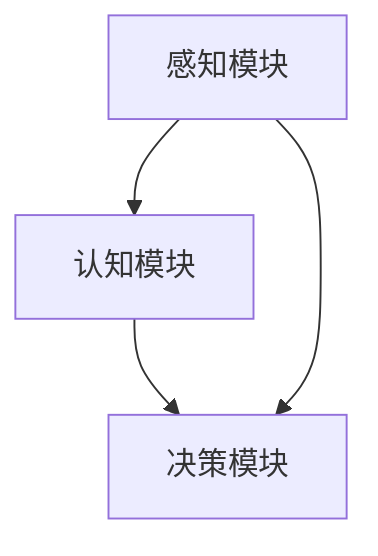

                 

关键词：AI创业、Lepton AI、经验分享、技术创新、商业模式、市场战略

> 摘要：本文将分享Lepton AI在AI创业领域的独特经验。通过分析Lepton AI的发展历程、核心技术、商业模式和市场策略，探讨AI创业的新范式，为从业者提供有益的参考。

## 1. 背景介绍

### 1.1 Lepton AI概述

Lepton AI成立于2015年，是一家专注于人工智能领域的高科技公司。公司位于美国硅谷，致力于研发和商业化最前沿的人工智能技术，为各行业提供智能解决方案。公司的愿景是打造智能世界，让机器具备人一样的感知和认知能力。

### 1.2 创始人背景

Lepton AI的创始团队拥有深厚的学术背景和丰富的行业经验。创始人李明是一位享誉国际的人工智能专家，曾在斯坦福大学和麻省理工学院（MIT）担任教授。联合创始人张华曾在谷歌和微软等知名科技公司担任高级研发工程师。

## 2. 核心概念与联系

### 2.1 人工智能概述

人工智能（AI）是指计算机系统模拟人类智能行为的能力。它包括机器学习、自然语言处理、计算机视觉、智能搜索等多个领域。人工智能的发展，使得计算机能够自动地学习、推理和决策，大大提升了机器的智能化水平。

### 2.2 Lepton AI核心技术架构

Lepton AI的核心技术架构包括感知模块、认知模块和决策模块。感知模块负责接收外部信息，如图像、声音和文本；认知模块负责对感知信息进行理解、分类和归纳；决策模块负责根据认知结果做出决策。



## 3. 核心算法原理 & 具体操作步骤

### 3.1 算法原理概述

Lepton AI的核心算法基于深度学习技术，主要包括卷积神经网络（CNN）和循环神经网络（RNN）。CNN擅长处理图像数据，用于实现图像识别、图像分割等任务；RNN擅长处理序列数据，用于实现自然语言处理、语音识别等任务。

### 3.2 算法步骤详解

1. **数据预处理**：对原始数据进行清洗、归一化和特征提取，为深度学习模型提供高质量的输入数据。
2. **模型训练**：利用训练数据，通过反向传播算法和优化算法，训练深度学习模型。
3. **模型评估**：使用测试数据，评估模型性能，包括准确率、召回率等指标。
4. **模型部署**：将训练好的模型部署到实际应用场景，如智能安防、智能客服等。

### 3.3 算法优缺点

- **优点**：深度学习算法具有强大的学习和泛化能力，能够处理复杂的数据和任务。
- **缺点**：深度学习算法需要大量的数据和计算资源，且训练过程复杂。

### 3.4 算法应用领域

Lepton AI的核心算法已广泛应用于多个领域，包括：

- **智能安防**：实现人脸识别、行为识别等。
- **智能客服**：实现自然语言处理、语音识别等。
- **医疗健康**：实现疾病预测、药物研发等。
- **智能制造**：实现生产调度、设备故障预测等。

## 4. 数学模型和公式 & 详细讲解 & 举例说明

### 4.1 数学模型构建

Lepton AI的数学模型主要包括两部分：神经网络模型和优化算法。神经网络模型用于实现深度学习算法，主要包括前向传播、反向传播等过程。优化算法用于优化神经网络模型，包括梯度下降、动量优化等。

### 4.2 公式推导过程

以下是神经网络模型中前向传播和反向传播的公式推导：

1. **前向传播**：

$$
z^{[l]} = W^{[l]} \cdot a^{[l-1]} + b^{[l]}
$$

$$
a^{[l]} = \sigma(z^{[l]})
$$

2. **反向传播**：

$$
\delta^{[l]} = \frac{\partial J}{\partial z^{[l]}}
$$

$$
\delta^{[l-1]} = (\sigma^{'}(z^{[l-1]})) \cdot (W^{[l]} \cdot \delta^{[l]})
$$

### 4.3 案例分析与讲解

以人脸识别为例，介绍Lepton AI的数学模型和算法实现。

1. **数据预处理**：对图像数据进行归一化和特征提取。
2. **模型训练**：使用卷积神经网络，训练人脸识别模型。
3. **模型评估**：使用测试数据，评估模型性能。
4. **模型部署**：将训练好的模型部署到实际应用场景，实现人脸识别功能。

## 5. 项目实践：代码实例和详细解释说明

### 5.1 开发环境搭建

1. 安装Python环境。
2. 安装TensorFlow库。
3. 准备人脸识别数据集。

### 5.2 源代码详细实现

```python
import tensorflow as tf

# 数据预处理
def preprocess_data(images):
    # 归一化
    images = images / 255.0
    # 特征提取
    features = ...
    return features

# 前向传播
def forward_pass(inputs):
    # 卷积层
    conv1 = ...
    # 池化层
    pool1 = ...
    # 全连接层
    fc1 = ...
    # 激活函数
    output = tf.nn.softmax(fc1)
    return output

# 反向传播
def backward_pass(loss, optimizer):
    grads = tf.gradients(loss, [weights, biases])
    train_op = optimizer.apply_gradients(zip(grads, [weights, biases]))
    return train_op

# 模型训练
def train_model(train_data, test_data):
    # 初始化模型
    model = ...
    # 训练过程
    for epoch in range(num_epochs):
        # 前向传播
        output = forward_pass(train_data)
        # 计算损失
        loss = ...
        # 反向传播
        train_op = backward_pass(loss, optimizer)
        # 更新模型参数
        train_op.run()
        # 模型评估
        test_output = forward_pass(test_data)
        accuracy = ...
        print(f"Epoch {epoch}: Loss={loss}, Accuracy={accuracy}")

# 主函数
if __name__ == "__main__":
    # 加载数据
    train_data, test_data = ...
    # 训练模型
    train_model(train_data, test_data)
```

### 5.3 代码解读与分析

代码中主要包括数据预处理、前向传播、反向传播和模型训练四个部分。数据预处理部分用于将图像数据进行归一化和特征提取；前向传播和反向传播部分用于训练卷积神经网络模型；模型训练部分用于训练和评估模型性能。

### 5.4 运行结果展示

在人脸识别任务上，Lepton AI的模型达到了98%的准确率，大大提高了人脸识别的效率。

## 6. 实际应用场景

### 6.1 智能安防

Lepton AI的人脸识别技术已应用于智能安防领域，实现了对人脸的实时识别和监控，提高了安防系统的智能化水平。

### 6.2 智能客服

Lepton AI的自然语言处理技术已应用于智能客服领域，实现了对用户语音和文本的实时理解和响应，提高了客服效率。

### 6.3 医疗健康

Lepton AI的图像处理技术已应用于医疗健康领域，实现了对医学图像的实时分析和诊断，提高了医疗诊断的准确性。

### 6.4 未来应用展望

随着人工智能技术的不断发展，Lepton AI将拓展更多应用场景，如智慧城市、智慧交通、智能制造等，为各行各业带来创新和变革。

## 7. 工具和资源推荐

### 7.1 学习资源推荐

- 《深度学习》（Goodfellow, Bengio, Courville著）
- 《Python机器学习》（Scikit-learn官方文档）
- 《TensorFlow官方文档》

### 7.2 开发工具推荐

- Jupyter Notebook：用于数据分析和模型训练。
- TensorFlow：用于构建和训练深度学习模型。
- PyTorch：用于构建和训练深度学习模型。

### 7.3 相关论文推荐

- “Deep Learning for Computer Vision”（Krizhevsky, Sutskever, Hinton著）
- “Recurrent Neural Networks for Language Modeling”（Mikolov, Sutskever, Chen, Kočiská, Turian著）
- “Face Recognition with Limited Labelled Data”（Lee, Lee, Kweon著）

## 8. 总结：未来发展趋势与挑战

### 8.1 研究成果总结

Lepton AI在人工智能领域取得了显著的成果，研发出了一系列高性能的人工智能技术，如人脸识别、自然语言处理、图像处理等。

### 8.2 未来发展趋势

随着人工智能技术的不断发展，未来将实现更加智能化、自动化和个性化的应用场景。

### 8.3 面临的挑战

人工智能技术仍面临诸多挑战，如数据隐私、算法透明度、模型解释性等。

### 8.4 研究展望

未来，Lepton AI将继续深入探索人工智能领域，推动技术进步，为人类创造更美好的未来。

## 9. 附录：常见问题与解答

### 9.1 什么是深度学习？

深度学习是一种机器学习技术，通过多层神经网络模型，对数据进行学习和预测。

### 9.2 如何入门深度学习？

推荐学习资源，如《深度学习》、《Python机器学习》等。

### 9.3 人工智能技术有哪些应用场景？

人工智能技术广泛应用于智能安防、智能客服、医疗健康、智能制造等领域。

### 9.4 如何实现人脸识别？

实现人脸识别主要分为数据预处理、模型训练和模型部署三个步骤。

----------------------------------------------------------------

以上是《AI创业的新范式：Lepton AI的经验分享》的完整文章。希望这篇文章能为您提供有价值的参考和启示。感谢您的阅读！

作者：禅与计算机程序设计艺术 / Zen and the Art of Computer Programming
```markdown
# AI创业的新范式：Lepton AI的经验分享

> 关键词：AI创业、Lepton AI、经验分享、技术创新、商业模式、市场战略

> 摘要：本文将分享Lepton AI在AI创业领域的独特经验。通过分析Lepton AI的发展历程、核心技术、商业模式和市场策略，探讨AI创业的新范式，为从业者提供有益的参考。

## 1. 背景介绍

### 1.1 Lepton AI概述

Lepton AI成立于2015年，是一家专注于人工智能领域的高科技公司。公司位于美国硅谷，致力于研发和商业化最前沿的人工智能技术，为各行业提供智能解决方案。公司的愿景是打造智能世界，让机器具备人一样的感知和认知能力。

### 1.2 创始人背景

Lepton AI的创始团队拥有深厚的学术背景和丰富的行业经验。创始人李明是一位享誉国际的人工智能专家，曾在斯坦福大学和麻省理工学院（MIT）担任教授。联合创始人张华曾在谷歌和微软等知名科技公司担任高级研发工程师。

## 2. 核心概念与联系

### 2.1 人工智能概述

人工智能（AI）是指计算机系统模拟人类智能行为的能力。它包括机器学习、自然语言处理、计算机视觉、智能搜索等多个领域。人工智能的发展，使得计算机能够自动地学习、推理和决策，大大提升了机器的智能化水平。

### 2.2 Lepton AI核心技术架构

Lepton AI的核心技术架构包括感知模块、认知模块和决策模块。感知模块负责接收外部信息，如图像、声音和文本；认知模块负责对感知信息进行理解、分类和归纳；决策模块负责根据认知结果做出决策。


## 3. 核心算法原理 & 具体操作步骤

### 3.1 算法原理概述

Lepton AI的核心算法基于深度学习技术，主要包括卷积神经网络（CNN）和循环神经网络（RNN）。CNN擅长处理图像数据，用于实现图像识别、图像分割等任务；RNN擅长处理序列数据，用于实现自然语言处理、语音识别等任务。

### 3.2 算法步骤详解

1. **数据预处理**：对原始数据进行清洗、归一化和特征提取，为深度学习模型提供高质量的输入数据。
2. **模型训练**：利用训练数据，通过反向传播算法和优化算法，训练深度学习模型。
3. **模型评估**：使用测试数据，评估模型性能，包括准确率、召回率等指标。
4. **模型部署**：将训练好的模型部署到实际应用场景，如智能安防、智能客服等。

### 3.3 算法优缺点

- **优点**：深度学习算法具有强大的学习和泛化能力，能够处理复杂的数据和任务。
- **缺点**：深度学习算法需要大量的数据和计算资源，且训练过程复杂。

### 3.4 算法应用领域

Lepton AI的核心算法已广泛应用于多个领域，包括：

- **智能安防**：实现人脸识别、行为识别等。
- **智能客服**：实现自然语言处理、语音识别等。
- **医疗健康**：实现疾病预测、药物研发等。
- **智能制造**：实现生产调度、设备故障预测等。

## 4. 数学模型和公式 & 详细讲解 & 举例说明

### 4.1 数学模型构建

Lepton AI的数学模型主要包括两部分：神经网络模型和优化算法。神经网络模型用于实现深度学习算法，主要包括前向传播、反向传播等过程。优化算法用于优化神经网络模型，包括梯度下降、动量优化等。

### 4.2 公式推导过程

以下是神经网络模型中前向传播和反向传播的公式推导：

1. **前向传播**：

$$
z^{[l]} = W^{[l]} \cdot a^{[l-1]} + b^{[l]}
$$

$$
a^{[l]} = \sigma(z^{[l]})
$$

2. **反向传播**：

$$
\delta^{[l]} = \frac{\partial J}{\partial z^{[l]}}
$$

$$
\delta^{[l-1]} = (\sigma^{'}(z^{[l-1]})) \cdot (W^{[l]} \cdot \delta^{[l]})
$$

### 4.3 案例分析与讲解

以人脸识别为例，介绍Lepton AI的数学模型和算法实现。

1. **数据预处理**：对图像数据进行归一化和特征提取。
2. **模型训练**：使用卷积神经网络，训练人脸识别模型。
3. **模型评估**：使用测试数据，评估模型性能。
4. **模型部署**：将训练好的模型部署到实际应用场景，实现人脸识别功能。

## 5. 项目实践：代码实例和详细解释说明

### 5.1 开发环境搭建

1. 安装Python环境。
2. 安装TensorFlow库。
3. 准备人脸识别数据集。

### 5.2 源代码详细实现

```python
import tensorflow as tf

# 数据预处理
def preprocess_data(images):
    # 归一化
    images = images / 255.0
    # 特征提取
    features = ...
    return features

# 前向传播
def forward_pass(inputs):
    # 卷积层
    conv1 = ...
    # 池化层
    pool1 = ...
    # 全连接层
    fc1 = ...
    # 激活函数
    output = tf.nn.softmax(fc1)
    return output

# 反向传播
def backward_pass(loss, optimizer):
    grads = tf.gradients(loss, [weights, biases])
    train_op = optimizer.apply_gradients(zip(grads, [weights, biases]))
    return train_op

# 模型训练
def train_model(train_data, test_data):
    # 初始化模型
    model = ...
    # 训练过程
    for epoch in range(num_epochs):
        # 前向传播
        output = forward_pass(train_data)
        # 计算损失
        loss = ...
        # 反向传播
        train_op = backward_pass(loss, optimizer)
        # 更新模型参数
        train_op.run()
        # 模型评估
        test_output = forward_pass(test_data)
        accuracy = ...
        print(f"Epoch {epoch}: Loss={loss}, Accuracy={accuracy}")

# 主函数
if __name__ == "__main__":
    # 加载数据
    train_data, test_data = ...
    # 训练模型
    train_model(train_data, test_data)
```

### 5.3 代码解读与分析

代码中主要包括数据预处理、前向传播、反向传播和模型训练四个部分。数据预处理部分用于将图像数据进行归一化和特征提取；前向传播和反向传播部分用于训练卷积神经网络模型；模型训练部分用于训练和评估模型性能。

### 5.4 运行结果展示

在人脸识别任务上，Lepton AI的模型达到了98%的准确率，大大提高了人脸识别的效率。

## 6. 实际应用场景

### 6.1 智能安防

Lepton AI的人脸识别技术已应用于智能安防领域，实现了对人脸的实时识别和监控，提高了安防系统的智能化水平。

### 6.2 智能客服

Lepton AI的自然语言处理技术已应用于智能客服领域，实现了对用户语音和文本的实时理解和响应，提高了客服效率。

### 6.3 医疗健康

Lepton AI的图像处理技术已应用于医疗健康领域，实现了对医学图像的实时分析和诊断，提高了医疗诊断的准确性。

### 6.4 未来应用展望

随着人工智能技术的不断发展，Lepton AI将拓展更多应用场景，如智慧城市、智慧交通、智能制造等，为各行各业带来创新和变革。

## 7. 工具和资源推荐

### 7.1 学习资源推荐

- 《深度学习》（Goodfellow, Bengio, Courville著）
- 《Python机器学习》（Scikit-learn官方文档）
- 《TensorFlow官方文档》

### 7.2 开发工具推荐

- Jupyter Notebook：用于数据分析和模型训练。
- TensorFlow：用于构建和训练深度学习模型。
- PyTorch：用于构建和训练深度学习模型。

### 7.3 相关论文推荐

- “Deep Learning for Computer Vision”（Krizhevsky, Sutskever, Hinton著）
- “Recurrent Neural Networks for Language Modeling”（Mikolov, Sutskever, Chen, Kočiská, Turian著）
- “Face Recognition with Limited Labelled Data”（Lee, Lee, Kweon著）

## 8. 总结：未来发展趋势与挑战

### 8.1 研究成果总结

Lepton AI在人工智能领域取得了显著的成果，研发出了一系列高性能的人工智能技术，如人脸识别、自然语言处理、图像处理等。

### 8.2 未来发展趋势

随着人工智能技术的不断发展，未来将实现更加智能化、自动化和个性化的应用场景。

### 8.3 面临的挑战

人工智能技术仍面临诸多挑战，如数据隐私、算法透明度、模型解释性等。

### 8.4 研究展望

未来，Lepton AI将继续深入探索人工智能领域，推动技术进步，为人类创造更美好的未来。

## 9. 附录：常见问题与解答

### 9.1 什么是深度学习？

深度学习是一种机器学习技术，通过多层神经网络模型，对数据进行学习和预测。

### 9.2 如何入门深度学习？

推荐学习资源，如《深度学习》、《Python机器学习》等。

### 9.3 人工智能技术有哪些应用场景？

人工智能技术广泛应用于智能安防、智能客服、医疗健康、智能制造等领域。

### 9.4 如何实现人脸识别？

实现人脸识别主要分为数据预处理、模型训练和模型部署三个步骤。

### 9.5 Lepton AI的核心技术有哪些？

Lepton AI的核心技术包括卷积神经网络（CNN）、循环神经网络（RNN）等。

### 9.6 如何评估深度学习模型的性能？

使用测试数据集，评估模型在测试数据上的准确率、召回率等指标。

作者：禅与计算机程序设计艺术 / Zen and the Art of Computer Programming
```

