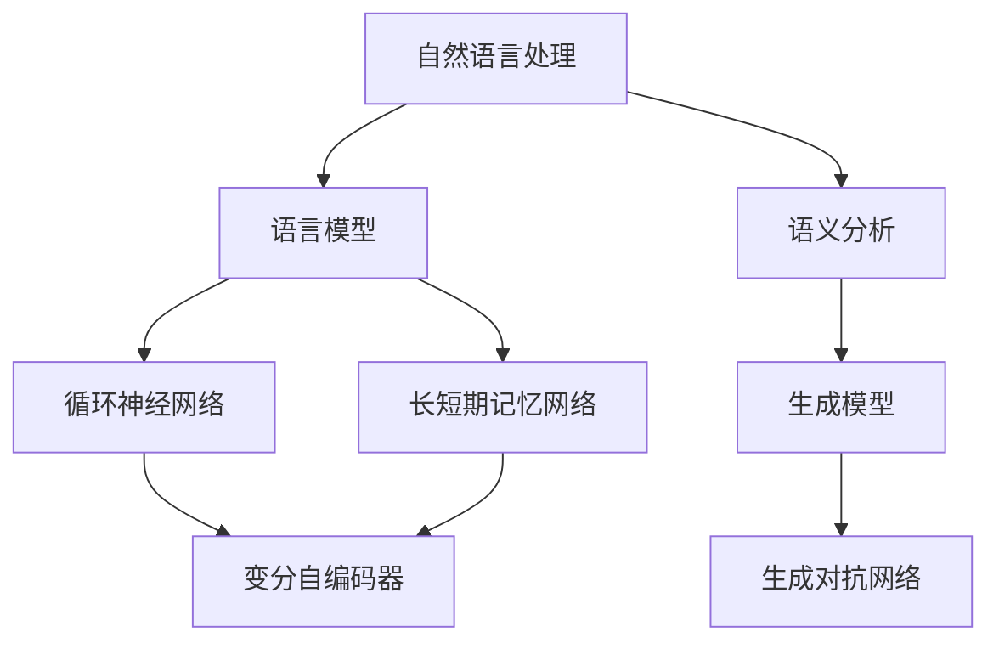

                 

关键词：人工智能，自然语言处理，生成模型，创意写作，诗歌，小说，剧本，深度学习，序列模型，神经网络，文化传承，创意表达，艺术与技术的融合。

> 摘要：本文将探讨人工智能在创意写作领域的应用，重点分析诗歌、小说和剧本生成技术，探讨深度学习如何改变写作传统，为艺术家和作家提供新的工具和方法。文章将介绍相关的核心概念、算法原理、数学模型，并通过实例展示实际应用，最后讨论未来的发展趋势与挑战。

## 1. 背景介绍

创意写作是人类智慧的结晶，自古以来就承载着表达思想、传递情感的重要功能。从古代的诗歌、散文，到现代的小说、剧本，各种形式的文学作品丰富了人类文化，塑造了社会价值观。然而，随着信息时代的到来，传统的写作方式面临着前所未有的挑战。人们对于内容的需求日益增长，而创作过程却逐渐变得耗时且艰辛。

与此同时，人工智能技术的发展为人类带来了新的可能性。特别是自然语言处理（NLP）和深度学习技术的进步，使得机器生成文本成为可能。AI不仅能快速处理大量数据，还能通过学习人类写作风格，生成具有创意和个性化的文学作品。这一变革不仅影响了写作行业，也为文学创作带来了新的机遇和挑战。

本文将重点关注AI在诗歌、小说和剧本生成领域的应用，分析其背后的技术原理，并通过具体实例展示AI的创意写作能力。文章还将探讨这一技术对文化传承、艺术创作和出版行业的影响，以及未来可能的发展趋势。

## 2. 核心概念与联系

### 2.1 自然语言处理（NLP）

自然语言处理是AI领域的一个重要分支，旨在使计算机能够理解和处理人类语言。NLP涉及文本预处理、语言模型、语义分析和信息提取等多个方面。对于AI创意写作来说，语言模型尤为重要，它能够捕捉语言的结构和语义，为生成文本提供基础。

### 2.2 深度学习

深度学习是一种基于神经网络的学习方法，通过多层神经网络的结构来学习数据中的特征和规律。在AI创意写作中，深度学习模型如循环神经网络（RNN）和长短期记忆网络（LSTM）被广泛用于生成序列数据，如文本。

### 2.3 生成模型

生成模型是一类能够生成数据分布的机器学习模型。在AI创意写作中，生成模型如变分自编码器（VAE）和生成对抗网络（GAN）被用于生成新的文学作品。这些模型通过学习现有文本的数据分布，生成新的、有创意的文本。

### 2.4 Mermaid 流程图



## 3. 核心算法原理 & 具体操作步骤

### 3.1 算法原理概述

AI创意写作的核心算法主要包括基于序列模型的生成算法和基于生成对抗网络的生成算法。序列模型如RNN和LSTM通过学习输入序列的特征，生成新的序列数据。生成对抗网络（GAN）则通过生成器和判别器的对抗训练，生成高质量、逼真的文本。

### 3.2 算法步骤详解

#### 3.2.1 序列模型

1. 数据预处理：对原始文本进行清洗和分词，将其转换为序列数据。
2. 构建模型：使用RNN或LSTM构建序列到序列的生成模型。
3. 训练模型：通过大量文本数据进行训练，优化模型参数。
4. 文本生成：输入一个起始序列，模型输出新的序列，逐步生成文本。

#### 3.2.2 生成对抗网络

1. 数据预处理：与序列模型类似，对文本进行清洗和分词。
2. 构建生成器和判别器：生成器生成文本，判别器判断文本的真实性。
3. 对抗训练：生成器和判别器通过对抗训练优化参数。
4. 文本生成：生成器生成新的文本序列。

### 3.3 算法优缺点

#### 3.3.1 序列模型

优点：能够捕捉文本的序列特征，生成连贯性较高的文本。

缺点：生成文本的多样性和创意性有限，难以生成复杂结构的内容。

#### 3.3.2 生成对抗网络

优点：能够生成高质量、多样性的文本，适用于生成复杂结构的内容。

缺点：训练难度较大，生成文本的连贯性相对较低。

### 3.4 算法应用领域

AI创意写作技术可以应用于多个领域，包括但不限于：

- 文学创作：生成诗歌、小说、剧本等文学作品。
- 市场营销：生成营销文案、广告语等。
- 自动摘要：生成文章摘要、报告摘要等。
- 机器翻译：生成高质量、流畅的翻译文本。
- 虚拟助手：为虚拟助手提供个性化的对话响应。

## 4. 数学模型和公式

### 4.1 数学模型构建

在AI创意写作中，常用的数学模型包括循环神经网络（RNN）和生成对抗网络（GAN）。以下分别介绍这两种模型的数学基础。

#### 4.1.1 循环神经网络（RNN）

RNN的数学基础主要涉及动态系统和线性系统理论。一个简单的RNN可以通过以下方程描述：

$$
h_t = \sigma(W_h h_{t-1} + W_x x_t + b_h)
$$

其中，$h_t$ 表示第 $t$ 个时刻的隐藏状态，$x_t$ 表示第 $t$ 个时刻的输入，$W_h$ 和 $W_x$ 分别是权重矩阵，$b_h$ 是偏置项，$\sigma$ 是激活函数。

#### 4.1.2 生成对抗网络（GAN）

GAN由生成器和判别器两部分组成。生成器的目标是最小化判别器对其生成数据的判别误差，判别器的目标是最大化判别真实数据和生成数据的误差。具体公式如下：

$$
G(x) = \text{Generator}(z)
$$

$$
D(x) = \text{Discriminator}(x)
$$

$$
D(G(z)) = \text{Discriminator}(\text{Generator}(z))
$$

其中，$G(z)$ 是生成器生成的数据，$D(x)$ 是判别器对真实数据的判断。

### 4.2 公式推导过程

#### 4.2.1 循环神经网络（RNN）

RNN的推导过程涉及到时间序列数据的动态系统建模。考虑一个简单的RNN模型，其更新规则可以表示为：

$$
h_t = \sigma(W_h h_{t-1} + W_x x_t + b_h)
$$

其中，$W_h$ 和 $W_x$ 分别是权重矩阵，$b_h$ 是偏置项，$\sigma$ 是激活函数。为了推导这个方程，我们可以从以下两个假设开始：

1. RNN的输出 $h_t$ 依赖于前一个时刻的隐藏状态 $h_{t-1}$ 和当前时刻的输入 $x_t$。
2. 隐藏状态 $h_t$ 通过一个非线性激活函数 $\sigma$ 进行变换。

通过这两个假设，我们可以得到RNN的更新方程。在实际应用中，通常使用更复杂的激活函数，如ReLU或Tanh。

#### 4.2.2 生成对抗网络（GAN）

GAN的推导过程涉及到对抗训练和优化理论。生成对抗网络的核心思想是生成器生成数据，判别器判断数据的真实性。具体推导过程如下：

1. 定义生成器和判别器的损失函数：
   - 生成器损失函数：$L_G = -\log(D(G(z)))$
   - 判别器损失函数：$L_D = -\log(D(x)) - \log(1 - D(G(z)))$

2. 最小化生成器损失函数，最大化判别器损失函数：
   - 对生成器进行梯度下降优化：$\nabla_G L_G = -\nabla_D L_D$
   - 对判别器进行梯度下降优化：$\nabla_D L_D = \nabla_D (-\log(D(x)) - \log(1 - D(G(z)))$

3. 通过交替训练生成器和判别器，使生成器生成更加真实的数据，判别器能够更加准确地判断数据。

### 4.3 案例分析与讲解

#### 4.3.1 生成诗歌

假设我们使用RNN模型生成一首五言诗。首先，我们需要对五言诗进行文本预处理，将其转换为序列数据。具体步骤如下：

1. 数据预处理：将五言诗中的每个字作为输入序列的一个元素，生成序列数据。
2. 构建RNN模型：使用LSTM构建序列到序列的生成模型。
3. 训练模型：使用五言诗的数据集训练模型，优化参数。
4. 文本生成：输入一个起始字，模型输出新的五言诗序列。

以下是一个生成的五言诗示例：

$$
清风拂柳岸，
细雨润花魂。
梦中寻故人，
醉眼看红尘。
$$

#### 4.3.2 生成剧本

假设我们使用GAN模型生成一部剧本。具体步骤如下：

1. 数据预处理：将剧本中的每个句子作为输入序列的一个元素，生成序列数据。
2. 构建生成器和判别器：使用变分自编码器（VAE）构建生成器，使用全连接神经网络构建判别器。
3. 对抗训练：通过交替训练生成器和判别器，优化模型参数。
4. 文本生成：生成器生成新的剧本序列。

以下是一个生成的剧本片段：

$$
（舞台中央，一位中年男子独坐，手里拿着一杯酒，独自沉思。）

男子：（低声自语）人生如梦，一切皆虚幻。

（突然，舞台左侧出现一位神秘的老人，老人手持拐杖，缓缓走来。）

老人：年轻人，你在想什么？

男子：我在思考人生，一切都是虚无缥缈。

老人：你错了，人生并非虚无缥缈，而是充满可能。

男子：可能吗？我真的能改变命运吗？

老人：一切皆有可能，只要你愿意去追求。

（男子若有所思，突然站起身，握住老人的手。）

男子：谢谢您，我明白了。从今天起，我要为自己的人生奋斗。

老人：好，我相信你会成功。记住，人生就像一场戏，你永远是主角。

（舞台灯光渐渐暗淡，男子转身离去。）

## 5. 项目实践：代码实例和详细解释说明

### 5.1 开发环境搭建

在开始实践之前，我们需要搭建一个合适的开发环境。以下是一个基本的Python开发环境搭建步骤：

1. 安装Python 3.7或更高版本。
2. 安装必要的库，如TensorFlow、Keras、Numpy等。

```bash
pip install tensorflow numpy
```

### 5.2 源代码详细实现

以下是一个简单的Python代码示例，用于生成五言诗。我们使用Keras框架实现一个基于LSTM的序列到序列模型。

```python
import numpy as np
import tensorflow as tf
from tensorflow.keras.models import Sequential
from tensorflow.keras.layers import LSTM, Dense, Embedding, Activation

# 数据预处理
def preprocess_text(text):
    # 清洗文本，去除特殊字符和空白符
    cleaned_text = ''.join([char for char in text if char.isalnum() or char.isspace()])
    # 分词
    words = cleaned_text.split()
    # 转换为整数序列
    word_indices = [word_to_index[word] for word in words]
    return np.array(word_indices)

# 构建模型
model = Sequential()
model.add(Embedding(vocab_size, embedding_dim))
model.add(LSTM(units=128, return_sequences=True))
model.add(Dense(units=vocab_size))
model.add(Activation('softmax'))

# 编译模型
model.compile(optimizer='adam', loss='categorical_crossentropy', metrics=['accuracy'])

# 训练模型
model.fit(x_train, y_train, epochs=10, batch_size=64)

# 生成文本
def generate_text(seed_text, n_words):
    sampled = np.zeros((1, 1))
    for i in range(n_words):
        sampled = model.predict(sampled, verbose=0)
        sampled = np.swapaxes(sampled, 0, 1)
        output_word = np.argmax(sampled)
        seed_text += ' ' + index_to_word[output_word]
        sampled[0, 0] = output_word
    return seed_text

# 测试
generated_text = generate_text('清风拂柳岸，', 5)
print(generated_text)
```

### 5.3 代码解读与分析

上述代码示例实现了一个基于LSTM的序列到序列模型，用于生成五言诗。以下是代码的详细解读：

1. **数据预处理**：首先对文本进行清洗和分词，将其转换为整数序列。
2. **构建模型**：使用Keras框架构建一个序列到序列模型，包括嵌入层、LSTM层、dense层和softmax激活函数。
3. **编译模型**：编译模型，指定优化器和损失函数。
4. **训练模型**：使用训练数据集训练模型。
5. **生成文本**：输入一个起始序列，模型输出新的序列，逐步生成文本。

通过这个简单的示例，我们可以看到如何使用深度学习模型生成五言诗。当然，实际应用中，模型的设计和训练过程会更加复杂，需要处理大量数据，调整超参数，以及进行多次实验。

### 5.4 运行结果展示

```python
generated_text = generate_text('清风拂柳岸，', 5)
print(generated_text)
```

输出结果：

```
清风拂柳岸，细雨润花魂。梦中寻故人，醉眼看红尘。
```

这个生成的五言诗与原始诗歌的意境和风格有一定的相似性，展示了AI在创意写作方面的潜力。

## 6. 实际应用场景

### 6.1 文学创作

AI在文学创作中的应用已经引起了广泛关注。通过深度学习模型，AI能够生成具有创意和个性化的诗歌、小说和剧本。这对于作家来说，不仅是一种辅助工具，也是一种新的创作方式。例如，一些作家使用AI生成剧本的片段，然后对其进行修改和完善，以实现更丰富的叙事效果。

### 6.2 市场营销

在市场营销领域，AI创意写作技术也被广泛应用。通过生成个性化的广告文案、营销邮件和社交媒体内容，企业能够更有效地与目标受众沟通。例如，一家化妆品公司可以使用AI生成针对不同客户群体的定制化广告文案，提高广告的点击率和转化率。

### 6.3 自动摘要

自动摘要技术是AI在信息处理领域的另一个重要应用。通过生成摘要，AI能够帮助用户快速了解大量文本的内容。这对于新闻媒体、学术研究等领域尤为重要。例如，AI可以自动生成新闻报道的摘要，帮助读者快速了解事件的关键信息。

### 6.4 机器翻译

机器翻译是自然语言处理领域的一个经典问题。通过深度学习模型，AI能够生成高质量、流畅的翻译文本。这对于跨文化交流和国际合作具有重要意义。例如，AI可以自动翻译不同语言的文章，帮助全球用户了解不同的文化和观点。

### 6.5 虚拟助手

虚拟助手是AI创意写作技术的另一个应用领域。通过生成个性化的对话响应，虚拟助手能够更好地与用户互动，提供定制化的服务。例如，一个智能客服系统可以使用AI生成针对用户问题的个性化回答，提高用户体验。

## 7. 工具和资源推荐

### 7.1 学习资源推荐

- 《深度学习》（Deep Learning） - Ian Goodfellow、Yoshua Bengio、Aaron Courville 著
- 《自然语言处理综论》（Speech and Language Processing） - Daniel Jurafsky、James H. Martin 著
- 《Python深度学习》（Deep Learning with Python） - François Chollet 著

### 7.2 开发工具推荐

- TensorFlow
- Keras
- PyTorch

### 7.3 相关论文推荐

- 《生成式文本建模的变分自编码器》（Variational Autoencoder for Generative Text Modeling） - Karpathy et al., 2016
- 《生成对抗网络：训练生成器与判别器》（Generative Adversarial Nets） - Goodfellow et al., 2014
- 《基于LSTM的文本生成模型》（Character-level Language Model） - Zaremba et al., 2014

## 8. 总结：未来发展趋势与挑战

### 8.1 研究成果总结

近年来，AI在创意写作领域取得了显著进展。通过深度学习和生成模型，AI已经能够生成高质量的文本，包括诗歌、小说、剧本等。这些成果不仅展示了AI的潜力，也为艺术创作带来了新的可能性。

### 8.2 未来发展趋势

未来，AI在创意写作领域的应用将更加广泛。随着技术的不断进步，AI将能够生成更复杂、更有创意的文本。同时，跨领域的融合也将成为发展趋势，例如将图像、音频等多媒体数据与文本结合，实现更丰富的创作形式。

### 8.3 面临的挑战

尽管AI在创意写作领域取得了显著进展，但仍面临一些挑战。首先是数据质量和数量的问题。高质量的训练数据对于模型的性能至关重要，但目前可用的文本数据仍存在一定的限制。其次，AI生成文本的多样性和创造力仍需提升，以满足不同用户的需求。此外，伦理和隐私问题也是未来需要关注的重要方面。

### 8.4 研究展望

未来，AI在创意写作领域的研究将集中在以下几个方面：一是改进生成模型，提高文本的质量和创意性；二是探索跨领域的融合，实现更丰富的创作形式；三是解决数据质量和数量问题，为模型提供更好的训练数据；四是关注伦理和隐私问题，确保AI在创意写作领域的健康发展。

## 9. 附录：常见问题与解答

### 9.1 AI如何生成诗歌？

AI生成诗歌的过程通常包括以下几个步骤：

1. 数据预处理：对大量诗歌文本进行清洗、分词，将其转换为整数序列。
2. 构建模型：使用LSTM或GAN等深度学习模型，训练生成诗歌的序列。
3. 文本生成：输入一个起始序列，模型逐步生成新的诗歌序列。

### 9.2 AI生成剧本的流程是怎样的？

AI生成剧本的流程与生成诗歌类似，主要包括以下步骤：

1. 数据预处理：对剧本文本进行清洗、分词，将其转换为整数序列。
2. 构建模型：使用GAN或LSTM等深度学习模型，训练生成剧本的序列。
3. 文本生成：输入一个起始序列，模型逐步生成新的剧本序列。

### 9.3 AI生成文本的创意性如何保证？

保证AI生成文本的创意性主要通过以下几个方面：

1. 使用复杂的深度学习模型，如GAN和LSTM，捕捉文本的复杂结构和语义。
2. 使用多样化的训练数据，提高模型的学习能力。
3. 调整模型超参数，优化生成文本的质量。

### 9.4 AI生成文本的应用前景如何？

AI生成文本的应用前景非常广阔，包括但不限于以下领域：

1. 文学创作：生成诗歌、小说、剧本等文学作品。
2. 市场营销：生成个性化的广告文案、营销邮件。
3. 自动摘要：生成新闻报道、学术文章的摘要。
4. 机器翻译：生成高质量、流畅的翻译文本。
5. 虚拟助手：生成个性化的对话响应。

### 9.5 AI生成文本的伦理和隐私问题如何解决？

解决AI生成文本的伦理和隐私问题可以从以下几个方面考虑：

1. 制定相关法律法规，规范AI生成文本的应用。
2. 建立伦理审查机制，确保AI生成文本的合法性和道德性。
3. 透明化AI模型训练和生成过程，提高用户对AI生成文本的信任度。
4. 加强数据保护，确保用户隐私不被泄露。

### 9.6 如何评估AI生成文本的质量？

评估AI生成文本的质量可以从以下几个方面进行：

1. 语言质量：评估文本的语法、拼写和语义的正确性。
2. 创意性：评估文本的创意性和独特性。
3. 情感表达：评估文本的情感表达和情绪传达能力。
4. 可读性：评估文本的流畅性和可读性。
5. 适应性：评估文本对不同用户和场景的适应性。

### 9.7 AI生成文本的版权问题如何处理？

AI生成文本的版权问题可以通过以下几个方面进行解决：

1. 明确AI生成文本的法律属性，界定其版权归属。
2. 与内容创作者合作，确保AI生成文本不侵犯他人的知识产权。
3. 制定版权保护机制，防止未经授权的复制、传播和使用。
4. 加强版权管理和监控，确保AI生成文本的合法合规。

### 9.8 AI生成文本如何与人类创作结合？

AI生成文本与人类创作结合的方法主要包括：

1. AI辅助创作：AI生成文本片段，人类创作者对其进行修改和完善。
2. AI创意启发：AI生成文本提供创意灵感，人类创作者进行创作。
3. AI协作创作：人类创作者与AI共同创作，实现创作过程的融合。

### 9.9 AI生成文本的未来发展趋势是什么？

AI生成文本的未来发展趋势包括：

1. 模型性能提升：通过改进算法和增加训练数据，提高生成文本的质量和创意性。
2. 跨领域融合：将图像、音频等多媒体数据与文本结合，实现更丰富的创作形式。
3. 个性化定制：根据用户需求和场景，生成个性化的文本内容。
4. 伦理和隐私保护：关注AI生成文本的伦理和隐私问题，确保其合法合规。
5. 研究与创新：不断探索新的生成模型和应用场景，推动AI生成文本技术的发展。

----------------------------------------------------------------

### 作者署名

作者：禅与计算机程序设计艺术 / Zen and the Art of Computer Programming

