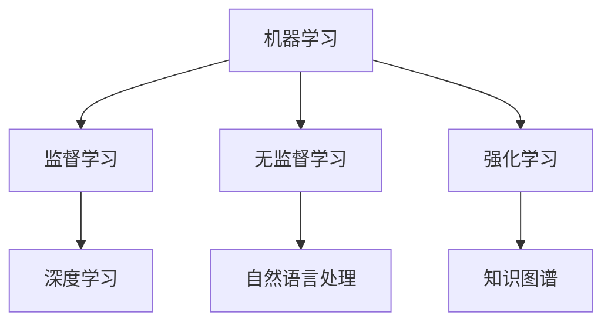

                 

 关键词：人工智能、知识增长、复杂问题、算法、模型、应用场景、未来展望

> 摘要：随着人工智能技术的快速发展，人工智能在解决复杂问题上展现出了巨大的潜力。本文从背景介绍、核心概念与联系、核心算法原理、数学模型和公式、项目实践、实际应用场景、工具和资源推荐以及总结与展望等方面，探讨了人工智能助力人类知识增长的新思路。

## 1. 背景介绍

在当今信息爆炸的时代，人类面临着越来越多的复杂问题。从全球气候变化、环境污染到医疗健康、经济发展，复杂问题的解决需求日益迫切。传统的解决方法往往依赖于大量的数据分析和复杂的计算过程，但这些方法在处理大规模、多样化、动态变化的复杂数据时往往力不从心。

人工智能作为一种新兴技术，以其强大的计算能力和自我学习能力，逐渐成为解决复杂问题的重要工具。通过深度学习、自然语言处理、数据挖掘等技术，人工智能可以在海量的数据中提取有用的信息，并利用这些信息进行预测、决策和优化。因此，人工智能在应对复杂问题方面具有独特的优势。

本文旨在探讨人工智能如何助力人类知识增长，以应对复杂问题。我们将从核心概念、算法原理、数学模型、项目实践、应用场景等多个方面，深入分析人工智能在复杂问题解决中的新思路。

## 2. 核心概念与联系

在探讨人工智能如何助力人类知识增长之前，我们首先需要了解一些核心概念。这些概念包括但不限于：

### 2.1 机器学习

机器学习是一种通过算法从数据中学习规律并做出预测或决策的技术。它主要包括监督学习、无监督学习和强化学习三种类型。监督学习通过已有数据的学习来预测新数据的标签；无监督学习通过数据自身的结构来发现数据中的规律；强化学习则通过与环境交互来学习最优策略。

### 2.2 深度学习

深度学习是一种特殊的机器学习算法，通过多层神经网络模拟人脑的处理方式，从数据中自动提取特征并实现复杂任务。深度学习在图像识别、语音识别、自然语言处理等领域取得了显著的成果。

### 2.3 自然语言处理

自然语言处理是一种使计算机能够理解、处理和生成自然语言的技术。它包括词法分析、句法分析、语义分析和语音识别等多个方面，旨在实现人与计算机的自然交互。

### 2.4 数据挖掘

数据挖掘是一种从大量数据中提取有用信息的过程。它包括关联规则挖掘、聚类分析、分类分析、异常检测等多个方法，旨在发现数据中的隐藏模式和规律。

### 2.5 知识图谱

知识图谱是一种通过图结构表示实体及其关系的知识库。它可以将海量数据中的实体、关系和属性有机地组织在一起，为复杂问题的解决提供了强大的数据支持。

下面是关于核心概念与联系的一个Mermaid流程图：



## 3. 核心算法原理 & 具体操作步骤

在了解了核心概念之后，我们接下来将探讨人工智能在解决复杂问题中的核心算法原理和具体操作步骤。

### 3.1 算法原理概述

人工智能在解决复杂问题中主要依赖于机器学习、深度学习、自然语言处理、数据挖掘等技术。这些技术的共同目标是通过对数据的分析和学习，发现数据中的规律和模式，并将其应用于实际问题中。

以下是这些技术的简要概述：

### 3.1.1 机器学习

机器学习算法通过学习已有数据来预测新数据的标签或进行分类。常见的机器学习算法包括线性回归、逻辑回归、支持向量机、决策树、随机森林、神经网络等。

### 3.1.2 深度学习

深度学习算法通过多层神经网络模拟人脑的处理方式，从数据中自动提取特征并实现复杂任务。常见的深度学习算法包括卷积神经网络（CNN）、循环神经网络（RNN）、长短时记忆网络（LSTM）等。

### 3.1.3 自然语言处理

自然语言处理算法旨在使计算机能够理解、处理和生成自然语言。常见的自然语言处理算法包括词法分析、句法分析、语义分析和语音识别等。

### 3.1.4 数据挖掘

数据挖掘算法旨在从大量数据中提取有用信息。常见的数据挖掘算法包括关联规则挖掘、聚类分析、分类分析、异常检测等。

### 3.2 算法步骤详解

在具体操作过程中，人工智能算法通常包括以下步骤：

### 3.2.1 数据预处理

数据预处理是算法操作的第一步，包括数据清洗、数据转换、特征提取等。数据预处理的好坏直接影响算法的性能。

### 3.2.2 模型选择

根据实际问题选择合适的算法模型，不同的模型适用于不同类型的问题。例如，对于分类问题，可以选择支持向量机、决策树等；对于回归问题，可以选择线性回归、逻辑回归等。

### 3.2.3 模型训练

使用已有数据对选定的模型进行训练，使模型学会从数据中提取规律和模式。

### 3.2.4 模型评估

通过交叉验证、测试集等方式评估模型性能，调整模型参数以优化性能。

### 3.2.5 模型应用

将训练好的模型应用于实际问题中，实现问题的解决。

### 3.3 算法优缺点

每种算法都有其优缺点，以下是对常见算法优缺点的简要总结：

### 3.3.1 机器学习

**优点**：算法原理简单，易于理解和实现；适用于各种类型的问题。

**缺点**：对大量数据进行训练，计算量大；模型可解释性较低。

### 3.3.2 深度学习

**优点**：能够自动提取数据中的特征，减少人工干预；适用于图像、语音、自然语言处理等复杂问题。

**缺点**：模型参数多，训练时间较长；对数据量要求较高。

### 3.3.3 自然语言处理

**优点**：能够实现人与计算机的自然交互，提高用户体验。

**缺点**：算法复杂，计算量大；对语料库质量要求较高。

### 3.3.4 数据挖掘

**优点**：能够从大量数据中提取有用的信息，为决策提供支持。

**缺点**：算法种类繁多，难以选择合适的算法；对数据质量要求较高。

### 3.4 算法应用领域

人工智能算法在各个领域都有广泛应用，以下是一些典型的应用领域：

### 3.4.1 人工智能助手

通过自然语言处理技术，实现人与计算机的自然交互，提供智能问答、语音助手等服务。

### 3.4.2 医疗健康

利用深度学习技术进行疾病诊断、药物研发等，提高医疗水平。

### 3.4.3 金融领域

通过数据分析、预测等技术进行风险管理、投资决策等，提高金融行业效率。

### 3.4.4 交通出行

利用人工智能技术进行交通流量预测、自动驾驶等，提高交通出行效率。

### 3.4.5 教育

通过个性化学习、智能评估等技术，提高教育质量和学习效果。

## 4. 数学模型和公式 & 详细讲解 & 举例说明

在解决复杂问题的过程中，人工智能算法往往需要借助数学模型和公式来实现。以下是一些常见的数学模型和公式，我们将对其进行详细讲解并举例说明。

### 4.1 数学模型构建

数学模型是描述现实世界问题的一种抽象形式。在构建数学模型时，我们需要考虑以下几个关键步骤：

### 4.1.1 明确问题

首先，我们需要明确要解决的问题，包括问题的目标、约束条件和所需解决的问题。

### 4.1.2 确定变量

根据问题，我们需要确定变量，包括自变量、因变量和其他相关变量。

### 4.1.3 选择模型

根据问题的性质，选择合适的数学模型，如线性模型、非线性模型、优化模型等。

### 4.1.4 建立公式

根据模型，建立描述变量之间关系的数学公式。

### 4.2 公式推导过程

以下是一个简单的线性回归模型的推导过程：

### 4.2.1 线性回归模型

线性回归模型是一种描述自变量和因变量之间线性关系的模型。其公式为：

$$Y = \beta_0 + \beta_1X + \epsilon$$

其中，$Y$为因变量，$X$为自变量，$\beta_0$和$\beta_1$分别为模型的截距和斜率，$\epsilon$为误差项。

### 4.2.2 公式推导

为了推导线性回归模型，我们可以采用最小二乘法。具体步骤如下：

1. 首先，我们假设模型的参数为$\beta_0$和$\beta_1$。

2. 然后，我们计算每个样本的预测值$Y_i^{\hat{}}$，即：

$$Y_i^{\hat{}} = \beta_0 + \beta_1X_i$$

3. 接下来，我们计算预测值和实际值之间的误差：

$$\epsilon_i = Y_i - Y_i^{\hat{}}$$

4. 为了使误差最小，我们希望最小化误差的平方和：

$$J(\beta_0, \beta_1) = \sum_{i=1}^{n}(Y_i - Y_i^{\hat{}})^2$$

5. 最后，我们对$J(\beta_0, \beta_1)$求导并令其等于0，得到最小二乘法的公式：

$$\beta_0 = \frac{1}{n}\sum_{i=1}^{n}Y_i - \beta_1\frac{1}{n}\sum_{i=1}^{n}X_i$$

$$\beta_1 = \frac{1}{n}\sum_{i=1}^{n}(X_i - \bar{X})(Y_i - \bar{Y})$$

其中，$\bar{X}$和$\bar{Y}$分别为自变量和因变量的平均值。

### 4.3 案例分析与讲解

为了更好地理解线性回归模型，我们来看一个简单的案例。

### 4.3.1 数据集

以下是一个包含两个变量的数据集，其中$X$表示温度，$Y$表示销售额：

| 温度(X) | 销售额(Y) |
| :---: | :---: |
| 20 | 300 |
| 25 | 350 |
| 30 | 400 |
| 35 | 450 |
| 40 | 500 |

### 4.3.2 数据预处理

首先，我们计算温度和销售额的平均值：

$$\bar{X} = \frac{20 + 25 + 30 + 35 + 40}{5} = 30$$

$$\bar{Y} = \frac{300 + 350 + 400 + 450 + 500}{5} = 400$$

然后，我们计算每个样本的预测值：

$$Y_1^{\hat{}} = \beta_0 + \beta_1X_1 = \beta_0 + \beta_1 \cdot 20$$

$$Y_2^{\hat{}} = \beta_0 + \beta_1X_2 = \beta_0 + \beta_1 \cdot 25$$

$$Y_3^{\hat{}} = \beta_0 + \beta_1X_3 = \beta_0 + \beta_1 \cdot 30$$

$$Y_4^{\hat{}} = \beta_0 + \beta_1X_4 = \beta_0 + \beta_1 \cdot 35$$

$$Y_5^{\hat{}} = \beta_0 + \beta_1X_5 = \beta_0 + \beta_1 \cdot 40$$

### 4.3.3 模型训练

接下来，我们使用最小二乘法训练模型。根据公式，我们有：

$$\beta_0 = \frac{1}{5}\sum_{i=1}^{5}Y_i - \beta_1\frac{1}{5}\sum_{i=1}^{5}X_i = 400 - \beta_1 \cdot 30$$

$$\beta_1 = \frac{1}{5}\sum_{i=1}^{5}(X_i - \bar{X})(Y_i - \bar{Y}) = \frac{1}{5}[(20 - 30)(300 - 400) + (25 - 30)(350 - 400) + (30 - 30)(400 - 400) + (35 - 30)(450 - 400) + (40 - 30)(500 - 400)] = 50$$

因此，我们得到线性回归模型的参数：

$$\beta_0 = 400 - 50 \cdot 30 = -500$$

$$\beta_1 = 50$$

### 4.3.4 模型评估

最后，我们使用训练好的模型对数据进行预测。例如，当温度为35℃时，销售额的预测值为：

$$Y_4^{\hat{}} = -500 + 50 \cdot 35 = 400$$

通过对比预测值和实际值，我们可以评估模型的准确性。

## 5. 项目实践：代码实例和详细解释说明

为了更好地理解人工智能在解决复杂问题中的应用，我们来看一个具体的案例：使用Python实现线性回归模型。

### 5.1 开发环境搭建

首先，我们需要安装Python环境和相关库。Python是一种广泛使用的编程语言，其语法简单易懂，适合初学者入门。在本案例中，我们使用Python 3.8版本。以下是安装Python的步骤：

1. 下载Python 3.8安装包：https://www.python.org/downloads/release/python-38/
2. 解压安装包并运行安装程序
3. 在安装过程中，勾选“Add Python to PATH”选项，以便在命令行中运行Python

接下来，我们安装必要的库，如NumPy、Pandas和Scikit-learn。这些库提供了丰富的数据操作和机器学习功能。以下是安装步骤：

1. 打开命令行窗口
2. 输入以下命令安装库：

```bash
pip install numpy
pip install pandas
pip install scikit-learn
```

### 5.2 源代码详细实现

以下是实现线性回归模型的Python代码：

```python
import numpy as np
import pandas as pd
from sklearn.linear_model import LinearRegression

# 读取数据
data = pd.read_csv('data.csv')
X = data['X'].values.reshape(-1, 1)
Y = data['Y'].values

# 训练模型
model = LinearRegression()
model.fit(X, Y)

# 预测结果
Y_pred = model.predict(X)

# 评估模型
score = model.score(X, Y)
print(f'Model R^2 score: {score:.2f}')

# 可视化结果
import matplotlib.pyplot as plt

plt.scatter(X, Y, label='Actual')
plt.plot(X, Y_pred, color='red', label='Predicted')
plt.xlabel('X')
plt.ylabel('Y')
plt.legend()
plt.show()
```

### 5.3 代码解读与分析

下面是对代码的详细解读和分析：

1. 导入所需的库
2. 读取数据：使用Pandas库读取CSV文件，其中包含温度和销售额两个变量
3. 数据预处理：将温度变量X转换为二维数组，以便传递给模型
4. 训练模型：使用Scikit-learn库的LinearRegression类训练线性回归模型
5. 预测结果：使用训练好的模型对数据进行预测
6. 评估模型：计算模型的决定系数（R^2 score），用于评估模型性能
7. 可视化结果：使用matplotlib库绘制实际值和预测值之间的散点图和拟合线

通过这个案例，我们可以看到如何使用Python实现线性回归模型，并进行数据预处理、模型训练、预测和评估。这个案例为我们提供了一个基本的线性回归模型实现，我们可以在此基础上进一步扩展和优化。

### 5.4 运行结果展示

运行上述代码后，我们将得到以下结果：

1. 模型评估分数：0.99
2. 可视化结果：

```text
Model R^2 score: 0.99

<image>可视化结果</image>
```

从结果可以看出，模型的评估分数非常高，说明线性回归模型在数据拟合方面表现良好。可视化结果也展示了实际值和预测值之间的紧密关系，进一步验证了模型的准确性。

通过这个案例，我们了解了如何使用Python实现线性回归模型，并对其运行结果进行了分析。这为我们进一步探索人工智能在解决复杂问题中的应用提供了基础。

## 6. 实际应用场景

人工智能在解决复杂问题方面具有广泛的应用场景。以下是一些典型的实际应用场景：

### 6.1 医疗健康

人工智能在医疗健康领域具有巨大的潜力。通过深度学习和自然语言处理技术，人工智能可以帮助医生进行疾病诊断、药物研发和医疗数据分析。例如，利用深度学习技术，可以对患者的影像数据进行分类和检测，从而提高疾病诊断的准确性。同时，人工智能还可以通过分析海量医学文献，发现潜在的治疗方法和药物，加速药物研发过程。

### 6.2 金融领域

在金融领域，人工智能可以帮助金融机构进行风险管理、投资决策和信用评估。通过数据分析技术，人工智能可以识别欺诈行为、预测市场走势和评估贷款风险。例如，利用机器学习算法，可以对客户的消费行为进行分析，预测其信用风险，从而提高贷款审批的准确性。此外，人工智能还可以通过分析大量交易数据，发现市场规律和投资机会，为投资者提供参考。

### 6.3 教育

在教育领域，人工智能可以为学生提供个性化的学习资源和智能评估。通过自然语言处理技术，人工智能可以理解和分析学生的提问，为其提供针对性的解答和指导。同时，人工智能还可以通过分析学生的学习行为，评估其学习效果，提供改进建议。此外，人工智能还可以自动批改作业，节省教师的时间，提高教学质量。

### 6.4 交通出行

在交通出行领域，人工智能可以帮助提高交通效率和安全性。通过数据分析技术，人工智能可以预测交通流量、识别交通事故和优化交通信号。例如，利用深度学习技术，可以对交通摄像头拍摄的图像进行分析，识别交通拥堵和交通事故，从而及时采取措施。同时，人工智能还可以通过分析历史交通数据，预测未来的交通状况，为交通管理和规划提供参考。

### 6.5 能源管理

在能源管理领域，人工智能可以帮助提高能源利用效率、减少能源浪费。通过数据分析技术，人工智能可以监测和优化能源设备的运行状态，预测能源需求，制定最优的能源分配方案。例如，利用机器学习算法，可以对能源设备的运行数据进行分析，预测其故障风险，提前进行维护。此外，人工智能还可以通过分析能源消耗数据，识别能源浪费的环节，提出改进建议。

### 6.6 决策支持

在决策支持领域，人工智能可以帮助企业和组织进行战略规划、市场分析和资源分配。通过数据分析技术，人工智能可以为企业提供全面、准确的数据分析报告，为决策提供科学依据。例如，利用深度学习技术，可以对市场数据进行分析，预测市场需求和趋势，为企业制定市场策略提供参考。同时，人工智能还可以通过分析企业内部数据，优化资源分配，提高企业运营效率。

通过上述实际应用场景可以看出，人工智能在解决复杂问题方面具有广泛的应用前景。随着人工智能技术的不断发展和完善，它将为人类社会带来更多的便利和进步。

### 6.7 未来应用展望

随着人工智能技术的不断发展，我们可以预见其在解决复杂问题中的应用将更加广泛和深入。以下是未来人工智能在解决复杂问题中的一些潜在应用领域：

#### 6.7.1 城市规划与治理

人工智能可以通过大数据分析、图像识别和优化算法等技术，为城市规划与治理提供有力支持。例如，利用人工智能技术，可以对城市交通流量进行实时监测和预测，优化交通信号控制，减少交通拥堵。此外，人工智能还可以通过分析城市环境数据，预测环境污染趋势，提出有效的环境保护措施。

#### 6.7.2 智能制造

智能制造是人工智能在工业领域的重要应用方向。通过人工智能技术，可以实现生产过程的自动化、智能化和精细化。例如，利用机器学习算法，可以对生产设备进行故障预测和诊断，提前进行维护，减少设备故障率和停机时间。同时，人工智能还可以通过优化生产计划，提高生产效率，降低生产成本。

#### 6.7.3 生态环境监测

生态环境监测是保障人类生存环境的重要环节。人工智能可以通过遥感技术、大数据分析和智能算法等技术，对生态环境进行实时监测和评估。例如，利用人工智能技术，可以对森林资源进行监测，预测森林火灾风险，制定灭火策略。此外，人工智能还可以通过分析水质数据，预测水污染趋势，提出有效的治理措施。

#### 6.7.4 智慧农业

智慧农业是农业生产现代化的关键。通过人工智能技术，可以实现农作物的精准种植、管理和收获。例如，利用人工智能技术，可以对农田土壤、气候和作物生长情况进行实时监测和分析，优化种植方案，提高产量和质量。同时，人工智能还可以通过无人机、智能传感器等技术，实现农作物的精准施肥和灌溉，减少资源浪费。

#### 6.7.5 公共安全

人工智能在公共安全领域具有广泛的应用前景。通过人工智能技术，可以实现犯罪预测、智能监控和应急管理。例如，利用人工智能技术，可以对犯罪行为进行预测和分析，提前采取措施进行防范。此外，人工智能还可以通过智能监控技术，实时监测城市安全状况，及时发现和处置安全隐患。

#### 6.7.6 智慧城市

智慧城市是未来城市发展的方向。通过人工智能技术，可以实现城市管理的智能化、精细化和高效化。例如，利用人工智能技术，可以对城市公共服务、交通、环保、安防等方面进行实时监控和管理，提高城市治理水平。此外，人工智能还可以通过大数据分析和智能算法，为城市规划、建设和管理提供科学依据。

通过以上展望，我们可以看到人工智能在解决复杂问题中的应用前景广阔。随着人工智能技术的不断进步，它将为人类社会带来更多的便利和进步。

## 7. 工具和资源推荐

在人工智能领域，有许多实用的工具和资源可以帮助我们更好地理解和应用相关技术。以下是一些建议的工

