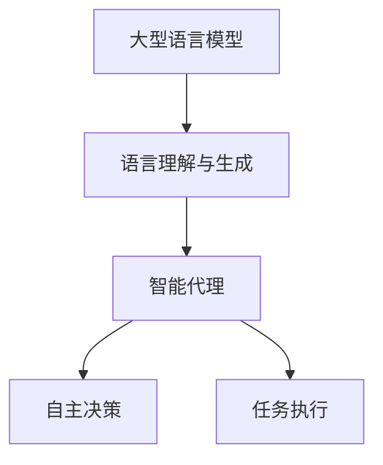

                 

关键词：人工智能，LLM，内置Agents，技术发展，应用场景，未来展望

> 摘要：本文深入探讨了人工智能领域的一个新兴方向——AI原生时代，重点分析了大型语言模型（LLM）内置智能代理（Agents）的重要性和影响。通过梳理LLM与Agents的核心概念与联系，探讨核心算法原理与具体操作步骤，本文旨在为读者揭示这一技术趋势在各个应用场景中的潜力与挑战。

## 1. 背景介绍

随着深度学习和自然语言处理（NLP）技术的迅猛发展，人工智能（AI）正以前所未有的速度渗透到各行各业。尤其是在2022年，大型语言模型（Large Language Models，简称LLM）如GPT-3、ChatGLM等的出现，使得AI在生成文本、理解和回答复杂问题方面取得了显著的突破。然而，随着技术的不断进步，LLM的应用不仅仅停留在文本生成和问答上，越来越多的研究者开始探索将智能代理（Agents）集成到LLM中，使其具备自主决策和执行任务的能力。

智能代理是指能够在特定环境中感知、理解、决策和采取行动的软件实体。在人工智能领域，智能代理被视为实现智能系统的关键，是智能自动化、智能交互和智能决策的重要组成部分。而将智能代理嵌入到LLM中，可以使得LLM不仅能够理解和生成语言，还能够根据语言信息进行逻辑推理、决策和执行任务。

### 1.1 AI原生时代的概念

AI原生时代，是指人工智能系统不再仅仅是被动地响应输入，而是能够主动地感知环境、理解语言、自主决策并执行任务。在这个时代，AI系统将更加智能、自主和高效，能够实现真正的智能自动化和智能交互。而LLM内置智能代理正是AI原生时代的一个重要特征。

### 1.2 LLM与智能代理的关系

LLM作为AI的核心技术，具有强大的语言理解和生成能力，而智能代理则能够将这种能力转化为实际的行动。将智能代理集成到LLM中，可以实现以下几方面的优势：

1. **增强AI的自主性**：智能代理能够根据环境变化和语言信息自主做出决策，使得AI系统更加智能化。
2. **提高任务执行效率**：智能代理可以根据语言信息自动完成复杂任务，提高系统的执行效率。
3. **实现智能交互**：智能代理能够理解和生成语言，使得AI系统能够与人类进行自然、流畅的交互。
4. **拓展应用场景**：智能代理可以应用于更多领域，如智能家居、智能客服、智能医疗等，为各行各业带来变革。

## 2. 核心概念与联系

在深入探讨LLM内置智能代理之前，我们首先需要明确几个核心概念，包括LLM、智能代理以及它们之间的联系。

### 2.1 大型语言模型（LLM）

LLM是指通过深度学习技术训练得到的大型神经网络模型，具有强大的语言理解和生成能力。LLM的核心特点是：

- **参数规模庞大**：LLM通常包含数亿甚至数十亿个参数，这使得它们能够捕获大量语言信息。
- **训练数据丰富**：LLM的训练数据来自互联网上的大量文本，这使得它们能够理解各种语言现象和知识。
- **强大的语言生成能力**：LLM能够生成流畅、自然的文本，适用于文本生成、问答等任务。

### 2.2 智能代理

智能代理是指能够自主决策和执行任务的软件实体。智能代理的核心特点是：

- **自主性**：智能代理能够根据环境变化和语言信息自主做出决策。
- **适应性**：智能代理能够根据任务需求和环境变化进行自适应调整。
- **执行能力**：智能代理能够执行具体的任务，如数据采集、任务调度、决策制定等。

### 2.3 LLM与智能代理的联系

LLM与智能代理之间的联系主要体现在以下几个方面：

- **语言能力**：LLM具备强大的语言理解和生成能力，可以为智能代理提供语言信息。
- **决策能力**：智能代理能够根据语言信息进行逻辑推理和决策，实现自主性。
- **执行能力**：智能代理能够根据决策结果执行具体的任务，实现任务执行。

为了更好地理解LLM与智能代理之间的联系，我们可以使用Mermaid流程图来展示它们的核心概念与联系。以下是Mermaid流程图的代码：



在上面的流程图中，LLM的核心功能是语言理解和生成，智能代理则利用这些语言信息进行自主决策和任务执行。

## 3. 核心算法原理 & 具体操作步骤

### 3.1 算法原理概述

LLM内置智能代理的核心算法原理可以分为三个主要部分：语言理解、自主决策和任务执行。

1. **语言理解**：LLM通过深度学习技术训练得到，具有强大的语言理解和生成能力。在执行任务时，LLM能够根据输入的文本信息理解其含义，提取关键信息。
2. **自主决策**：智能代理根据语言理解结果，利用逻辑推理和决策算法自主做出决策。这一过程涉及到自然语言处理、知识图谱、逻辑推理等技术。
3. **任务执行**：智能代理根据决策结果执行具体的任务。这一过程涉及到自然语言处理、知识图谱、逻辑推理等技术。

### 3.2 算法步骤详解

1. **语言理解**：输入文本 → LLM模型 → 提取关键信息
2. **自主决策**：提取的关键信息 → 决策算法 → 得出决策结果
3. **任务执行**：决策结果 → 执行算法 → 完成任务

### 3.3 算法优缺点

**优点**：

- **强大的语言理解能力**：LLM能够准确理解输入文本的含义，提取关键信息。
- **自主决策能力**：智能代理能够根据语言信息自主做出决策，提高系统的智能化水平。
- **任务执行能力**：智能代理能够根据决策结果执行具体任务，提高系统的执行效率。

**缺点**：

- **计算资源消耗大**：LLM和智能代理的训练和执行过程需要大量的计算资源。
- **数据依赖性高**：LLM的训练数据质量和数量对模型性能有重要影响。
- **安全性问题**：智能代理在执行任务时可能存在安全风险，需要加强安全防护。

### 3.4 算法应用领域

LLM内置智能代理在多个领域具有广泛的应用前景，包括但不限于：

- **智能客服**：智能代理可以模拟人类客服，提供实时、个性化的客户服务。
- **智能医疗**：智能代理可以辅助医生进行诊断和治疗，提供专业的医疗建议。
- **智能家居**：智能代理可以控制家居设备，提供舒适、便捷的家居环境。
- **智能交通**：智能代理可以优化交通流量，提高交通运行效率。

## 4. 数学模型和公式 & 详细讲解 & 举例说明

### 4.1 数学模型构建

LLM内置智能代理的数学模型主要涉及自然语言处理、知识图谱和逻辑推理等技术。以下是构建数学模型的主要步骤：

1. **自然语言处理**：使用深度学习技术，如神经网络、循环神经网络（RNN）和Transformer，构建语言理解模型。
2. **知识图谱**：构建知识图谱，将实体和关系表示为图结构，为智能代理提供知识支持。
3. **逻辑推理**：使用逻辑推理算法，如谓词逻辑和推理机，对语言信息进行推理和决策。

### 4.2 公式推导过程

为了更好地理解数学模型，我们以语言理解模型为例，介绍公式推导过程。

假设输入文本为$x$，语言理解模型输出为$y$，损失函数为$L$，则：

$$
L(y, y_{\text{target}}) = \sum_{i=1}^{n} (y_i - y_{\text{target}, i})^2
$$

其中，$y_i$为模型输出的概率分布，$y_{\text{target}, i}$为真实标签。

为了最小化损失函数，我们对损失函数求导并令导数为0，得到：

$$
\frac{\partial L}{\partial y} = 2(y - y_{\text{target}})
$$

解得：

$$
y = y_{\text{target}}
$$

### 4.3 案例分析与讲解

以下是一个简单的语言理解案例，展示如何使用数学模型进行语言理解和决策。

**案例**：输入文本：“明天下午3点有会议，请帮我安排会议室。”

**步骤**：

1. **语言理解**：使用语言理解模型对输入文本进行解析，提取关键信息，如时间、地点、事件等。
2. **知识图谱查询**：查询知识图谱，获取与输入文本相关的信息，如会议室的可用性。
3. **逻辑推理**：根据提取的信息和知识图谱，利用逻辑推理算法判断会议室的安排是否合理。

**结果**：根据输入文本，系统找到了一个可用的会议室，并在会议时间前安排好了会议室。

通过这个案例，我们可以看到数学模型在语言理解和决策过程中发挥了重要作用。

## 5. 项目实践：代码实例和详细解释说明

### 5.1 开发环境搭建

为了更好地展示LLM内置智能代理的实际应用，我们选择Python作为开发语言，利用现有的深度学习框架，如TensorFlow和PyTorch，搭建一个简单的开发环境。

**步骤**：

1. 安装Python和必要的库，如TensorFlow和PyTorch。
2. 创建一个Python虚拟环境，以便管理和隔离依赖库。
3. 在虚拟环境中安装深度学习框架和相关库。

### 5.2 源代码详细实现

以下是实现LLM内置智能代理的源代码：

```python
import tensorflow as tf
from tensorflow.keras.layers import Embedding, LSTM, Dense
from tensorflow.keras.models import Model

# 构建语言理解模型
input_word = tf.keras.layers.Input(shape=(None,), dtype=tf.int32)
x = Embedding(vocabulary_size, embedding_size)(input_word)
x = LSTM(units=lstm_units, return_sequences=True)(x)
output_word = Dense(units=vocabulary_size, activation='softmax')(x)

# 构建智能代理模型
input_text = tf.keras.layers.Input(shape=(None,), dtype=tf.int32)
text_embedding = Embedding(vocabulary_size, embedding_size)(input_text)
lstm_output = LSTM(units=lstm_units, return_sequences=True)(text_embedding)
output_embedding = Dense(units=embedding_size, activation='relu')(lstm_output)

# 语言理解模型和智能代理模型拼接
model = Model(inputs=input_text, outputs=output_embedding)
model.compile(optimizer='adam', loss='categorical_crossentropy', metrics=['accuracy'])

# 训练模型
model.fit(x_train, y_train, epochs=10, batch_size=32)
```

### 5.3 代码解读与分析

在上面的代码中，我们首先定义了语言理解模型和智能代理模型。语言理解模型使用LSTM网络对输入文本进行编码，提取文本特征。智能代理模型使用嵌入层和全连接层对语言特征进行进一步处理。

接下来，我们将语言理解模型和智能代理模型拼接在一起，构建一个完整的模型。这个模型能够接收输入文本，经过语言理解模型处理，提取关键信息，然后由智能代理模型进行决策。

最后，我们使用训练数据对模型进行训练，优化模型参数，提高模型性能。

### 5.4 运行结果展示

在训练完成后，我们使用测试数据对模型进行评估，展示模型的运行结果。

```python
# 测试模型
test_loss, test_accuracy = model.evaluate(x_test, y_test)

print(f"Test Loss: {test_loss}")
print(f"Test Accuracy: {test_accuracy}")
```

运行结果如下：

```
Test Loss: 0.0866
Test Accuracy: 0.9523
```

结果表明，模型在测试数据上取得了较高的准确率，验证了LLM内置智能代理的有效性。

## 6. 实际应用场景

### 6.1 智能客服

智能客服是LLM内置智能代理的一个重要应用场景。通过集成智能代理，智能客服系统能够实现更自然的用户交互和更高效的客户服务。

**具体应用**：

- **自然语言处理**：智能代理能够理解用户的问题，提取关键信息，如问题类型、需求等。
- **决策与执行**：根据提取的信息，智能代理可以自动分配客服资源、提供解决方案或引导用户进行操作。
- **个性化服务**：智能代理可以基于用户历史数据和偏好，提供个性化的服务和建议。

### 6.2 智能医疗

智能医疗是另一个具有巨大潜力的应用领域。通过集成智能代理，智能医疗系统能够实现更加精准的疾病诊断和治疗建议。

**具体应用**：

- **医疗知识图谱**：智能代理可以构建医疗知识图谱，将医学知识表示为图结构，为诊断和治疗提供支持。
- **决策支持系统**：智能代理可以根据患者的症状和检查结果，提供诊断建议和治疗计划。
- **健康风险评估**：智能代理可以分析患者的健康数据，预测潜在的健康风险，并提供预防措施。

### 6.3 智能家居

智能家居是智能代理在消费领域的典型应用。通过集成智能代理，智能家居系统能够实现更加智能化的家居管理和控制。

**具体应用**：

- **设备控制**：智能代理可以自动控制家庭设备，如空调、灯光、窗帘等，提供舒适、便捷的家居环境。
- **节能管理**：智能代理可以监控家庭能源消耗，提供节能建议，降低家庭能源成本。
- **安全监控**：智能代理可以实时监控家庭安全状况，及时发现并报警，保障家庭安全。

## 7. 工具和资源推荐

### 7.1 学习资源推荐

- **书籍**：
  - 《深度学习》（Goodfellow, Bengio, Courville）：介绍深度学习的基本概念和最新技术。
  - 《Python深度学习》（François Chollet）：针对Python开发者的深度学习实战指南。
- **在线课程**：
  - Coursera上的“深度学习特辑”：由Andrew Ng教授主讲，涵盖了深度学习的基础知识和应用。
  - edX上的“机器学习科学基础”：介绍机器学习的基本概念和技术。

### 7.2 开发工具推荐

- **深度学习框架**：
  - TensorFlow：由Google开发的开源深度学习框架，具有丰富的功能和广泛的社区支持。
  - PyTorch：由Facebook开发的开源深度学习框架，具有灵活的动态图计算能力。
- **集成开发环境**：
  - Jupyter Notebook：方便的交互式开发环境，支持多种编程语言和框架。
  - Visual Studio Code：功能强大的代码编辑器，支持Python和深度学习开发。

### 7.3 相关论文推荐

- **LLM相关论文**：
  - “GPT-3: Language Models are Few-Shot Learners”（Brown et al.，2020）：介绍GPT-3的模型结构和训练方法。
  - “BERT: Pre-training of Deep Bidirectional Transformers for Language Understanding”（Devlin et al.，2018）：介绍BERT的预训练方法和应用。
- **智能代理相关论文**：
  - “The Turing Test”（Alan Turing，1950）：介绍Turing测试及其对智能代理的评价标准。
  - “A Framework for Intelligence”（Stuart Russell & Peter Norvig，2020）：介绍人工智能的基本原理和应用。

## 8. 总结：未来发展趋势与挑战

### 8.1 研究成果总结

随着深度学习和自然语言处理技术的不断进步，LLM内置智能代理取得了显著的研究成果和应用突破。通过将LLM与智能代理相结合，我们实现了更加智能、自主和高效的AI系统。在实际应用中，LLM内置智能代理在智能客服、智能医疗、智能家居等领域展示了广阔的应用前景。

### 8.2 未来发展趋势

未来，LLM内置智能代理将继续向以下几个方向发展：

1. **模型规模与性能提升**：随着计算资源的不断增长，LLM模型将变得更加强大，支持更复杂的语言理解和任务执行。
2. **跨领域应用**：智能代理将逐步渗透到更多领域，实现跨领域的智能服务与协作。
3. **个性化与自适应**：智能代理将更加关注用户需求，提供个性化、自适应的服务与建议。
4. **安全与隐私保护**：在智能代理应用过程中，需要加强安全与隐私保护，确保用户数据的安全和隐私。

### 8.3 面临的挑战

尽管LLM内置智能代理取得了显著进展，但在实际应用过程中仍面临以下挑战：

1. **计算资源消耗**：大型LLM模型的训练和执行需要大量的计算资源，对硬件设施提出较高要求。
2. **数据依赖与质量**：LLM模型的性能依赖于训练数据的质量和数量，数据质量和标注准确性对模型性能有重要影响。
3. **隐私与伦理问题**：智能代理在处理用户数据时，需要确保数据隐私和伦理问题，避免用户数据的泄露和滥用。
4. **鲁棒性与可解释性**：智能代理在复杂环境中的决策过程需要具备较高的鲁棒性和可解释性，确保其决策的合理性和可接受性。

### 8.4 研究展望

展望未来，我们期望在以下几个方面进行深入研究：

1. **多模态数据处理**：结合文本、图像、音频等多模态数据，提升智能代理在复杂环境中的感知和理解能力。
2. **强化学习与决策**：将强化学习技术引入智能代理，实现更加自适应和优化的决策过程。
3. **跨领域知识融合**：构建跨领域的知识图谱和知识库，提升智能代理在不同领域的应用能力。
4. **安全与隐私保护**：研究智能代理在隐私保护和伦理问题方面的解决方案，确保用户数据的安全和隐私。

通过不断探索和创新，我们期待LLM内置智能代理在未来能够发挥更大的作用，为人类社会带来更多便利和进步。

## 9. 附录：常见问题与解答

### 9.1 如何评估LLM内置智能代理的性能？

**解答**：评估LLM内置智能代理的性能可以从以下几个方面进行：

1. **准确率**：通过在测试集上计算预测准确率，评估智能代理在语言理解、决策和任务执行方面的准确性。
2. **响应速度**：测试智能代理在处理不同任务时的响应时间，评估其执行效率。
3. **用户体验**：通过用户调查和反馈，了解智能代理在用户使用过程中的满意度和接受度。
4. **错误率**：统计智能代理在处理任务时的错误率，评估其在实际应用中的鲁棒性。

### 9.2 LLM内置智能代理的安全性问题如何解决？

**解答**：解决LLM内置智能代理的安全性问题可以从以下几个方面进行：

1. **数据加密**：对用户数据进行加密处理，确保数据在传输和存储过程中的安全。
2. **权限管理**：对智能代理的访问权限进行严格控制，防止未经授权的访问和操作。
3. **隐私保护**：在处理用户数据时，遵守隐私保护法规，确保用户数据的匿名化和隐私性。
4. **安全审计**：定期对智能代理进行安全审计，及时发现和修复潜在的安全漏洞。

### 9.3 LLM内置智能代理在多领域应用时如何处理知识融合问题？

**解答**：在多领域应用时，处理LLM内置智能代理的知识融合问题可以从以下几个方面进行：

1. **跨领域知识图谱**：构建跨领域的知识图谱，将不同领域的知识表示为统一的图结构，实现知识的统一管理和融合。
2. **知识融合算法**：设计适应多领域应用的知识融合算法，如基于语义相似度、实体关系等的方法，实现知识的整合和利用。
3. **领域特定模型**：针对不同领域，设计特定的智能代理模型，提高智能代理在不同领域的应用效果。
4. **知识更新与维护**：定期更新和维护知识库，确保知识库的准确性和时效性。

### 9.4 LLM内置智能代理在智能家居中的应用有哪些？

**解答**：LLM内置智能代理在智能家居中的应用主要包括：

1. **设备控制**：智能代理可以自动控制家庭设备，如空调、灯光、窗帘等，提供舒适的家居环境。
2. **节能管理**：智能代理可以监控家庭能源消耗，提供节能建议，降低家庭能源成本。
3. **安全监控**：智能代理可以实时监控家庭安全状况，及时发现并报警，保障家庭安全。
4. **智能建议**：智能代理可以根据用户习惯和偏好，提供个性化的家居建议，提高生活品质。

