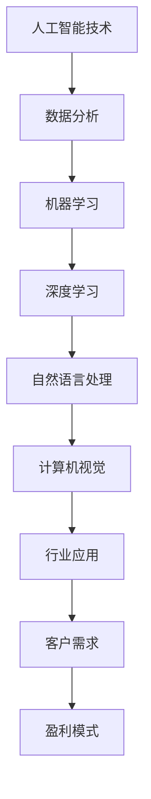

                 

关键词：人工智能、商业化、盈利模式、Lepton AI、AI技术、市场策略

> 摘要：本文深入探讨了人工智能领域的先驱公司Lepton AI的商业化之路，分析了其独特的盈利模式。文章将详细解析Lepton AI的技术优势、市场定位、商业模式，并探讨其未来发展潜力和面临的挑战。

## 1. 背景介绍

随着人工智能技术的飞速发展，越来越多的公司开始探索如何将AI技术转化为商业成功。在这个背景下，Lepton AI作为一家专注于AI商业化的公司，脱颖而出，成为行业中的佼佼者。Lepton AI成立于2010年，总部位于美国硅谷，其创始人拥有一流的学术背景和丰富的创业经验。公司专注于开发先进的AI算法，并将其应用于各行业，帮助客户实现商业价值。

### 1.1 公司使命和愿景

Lepton AI的使命是“通过人工智能技术，让复杂问题变得简单”。公司的愿景是成为全球领先的AI解决方案提供商，推动各行业智能化转型。为了实现这一目标，Lepton AI致力于研发创新性的AI技术，并迅速将其转化为实际应用，为客户提供卓越的服务。

## 2. 核心概念与联系

在探讨Lepton AI的盈利模式之前，我们需要了解一些核心概念和它们之间的联系。以下是一个使用Mermaid绘制的流程图，展示了这些概念及其相互关系。



### 2.1 人工智能技术

人工智能技术是Lepton AI的核心竞争力。公司研发的AI算法涵盖了机器学习、深度学习、自然语言处理和计算机视觉等多个领域。这些技术为Lepton AI提供了强大的数据处理和分析能力，使其能够解决复杂的问题，为客户提供定制化的解决方案。

### 2.2 数据分析

数据分析是AI技术的关键应用场景之一。通过对大量数据的收集、整理和分析，Lepton AI能够发现数据背后的价值，帮助客户做出更明智的商业决策。数据分析的结果不仅提高了客户的运营效率，还为其带来了显著的经济效益。

### 2.3 机器学习

机器学习是AI技术的重要组成部分。它通过算法模型自动从数据中学习，不断提高其预测和决策能力。Lepton AI利用机器学习技术，为客户提供智能化的数据分析、预测和优化服务。

### 2.4 深度学习

深度学习是机器学习的子领域，它通过多层神经网络模拟人脑的思考过程，能够处理更复杂的问题。Lepton AI在深度学习领域的研究取得了显著成果，其算法在图像识别、语音识别和自然语言处理等方面具有很高的准确性和效率。

### 2.5 自然语言处理

自然语言处理是AI技术在语言领域的应用。它能够理解和生成人类语言，帮助计算机与人类进行更自然的交互。Lepton AI利用自然语言处理技术，为客户提供智能客服、智能翻译和内容分析等服务。

### 2.6 计算机视觉

计算机视觉是AI技术在视觉领域的应用。它能够使计算机“看”懂图像和视频，为各行业提供视觉识别和分析能力。Lepton AI在计算机视觉领域的研究成果被广泛应用于安防监控、医疗诊断和智能制造等领域。

### 2.7 行业应用

行业应用是Lepton AI的核心市场。公司根据不同行业的特定需求，研发定制化的AI解决方案。通过将AI技术应用于实际场景，Lepton AI为客户带来了显著的业务改进和成本节约。

### 2.8 客户需求

客户需求是Lepton AI发展的驱动力。公司密切关注客户需求，不断优化产品和服务，以满足客户日益增长的需求。通过深入了解客户需求，Lepton AI能够为客户提供更具针对性的解决方案，提高客户满意度。

### 2.9 盈利模式

盈利模式是Lepton AI成功的关键。公司采用多元化的盈利模式，包括产品销售、咨询服务和合作分成等。通过不断创新和拓展业务，Lepton AI实现了持续增长，并在全球范围内建立了广泛的客户群体。

## 3. 核心算法原理 & 具体操作步骤

### 3.1 算法原理概述

Lepton AI的核心算法基于深度学习和机器学习技术。公司自主研发的算法模型在多个数据集上进行了验证，具有很高的准确性和鲁棒性。以下是Lepton AI算法原理的简要概述：

1. 数据预处理：对收集到的原始数据进行清洗、去噪和归一化处理，确保数据质量。
2. 特征提取：利用深度学习模型提取数据中的关键特征，为后续建模提供基础。
3. 模型训练：使用大量标注数据进行模型训练，通过迭代优化模型参数，提高模型性能。
4. 模型评估：使用测试数据集对训练好的模型进行评估，确保模型在未知数据上的表现。
5. 模型部署：将训练好的模型部署到实际应用场景中，为用户提供服务。

### 3.2 算法步骤详解

#### 3.2.1 数据预处理

数据预处理是算法成功的关键步骤。Lepton AI采用以下方法对数据进行预处理：

1. 数据清洗：去除缺失值、异常值和重复数据，确保数据的一致性和完整性。
2. 去噪：使用滤波算法去除噪声数据，提高数据质量。
3. 归一化：对数据进行归一化处理，使其具有相似的分布特征，便于后续分析。

#### 3.2.2 特征提取

特征提取是深度学习模型的关键步骤。Lepton AI采用以下方法提取特征：

1. 卷积神经网络（CNN）：用于提取图像数据中的空间特征。
2. 递归神经网络（RNN）：用于提取序列数据中的时间特征。
3. 自编码器（Autoencoder）：用于降维和特征压缩。

#### 3.2.3 模型训练

模型训练是算法的核心步骤。Lepton AI采用以下方法进行模型训练：

1. 训练数据集：使用大量标注数据作为训练数据集，确保模型在多样性的数据上具有良好的泛化能力。
2. 损失函数：使用交叉熵损失函数评估模型预测与真实值之间的差异。
3. 优化算法：采用随机梯度下降（SGD）算法优化模型参数，提高模型性能。
4. 迭代训练：通过多次迭代训练，不断优化模型参数，提高模型准确性。

#### 3.2.4 模型评估

模型评估是确保算法性能的重要步骤。Lepton AI采用以下方法评估模型：

1. 测试数据集：使用未参与训练的测试数据集评估模型性能。
2. 评估指标：使用准确率、召回率、F1值等指标评估模型性能。
3. 调参优化：根据评估结果调整模型参数，提高模型性能。

#### 3.2.5 模型部署

模型部署是将算法应用于实际场景的关键步骤。Lepton AI采用以下方法部署模型：

1. 云平台：将模型部署到云平台，实现高效计算和分布式部署。
2. 实时预测：通过实时数据流进行预测，为用户提供及时的服务。
3. 集成应用：将模型集成到客户的应用系统中，实现自动化和智能化。

### 3.3 算法优缺点

#### 3.3.1 优点

1. 高准确性：深度学习模型在图像识别、语音识别和自然语言处理等领域具有很高的准确性和鲁棒性。
2. 自动化：算法模型能够自动从数据中学习，提高数据处理和分析效率。
3. 可扩展性：算法模型具有良好的可扩展性，可以应用于不同行业和场景。
4. 持续优化：通过不断迭代训练和优化，模型性能持续提升。

#### 3.3.2 缺点

1. 计算资源消耗：深度学习模型需要大量计算资源，可能导致部署成本较高。
2. 数据依赖：算法模型的性能依赖于训练数据的质量和多样性，可能导致泛化能力不足。
3. 隐私风险：在处理敏感数据时，可能引发隐私风险和合规性问题。

### 3.4 算法应用领域

Lepton AI的算法模型在多个领域具有广泛的应用前景：

1. 金融领域：用于风险管理、欺诈检测和智能投顾等。
2. 医疗领域：用于疾病诊断、医学影像分析和健康管理等。
3. 智能制造：用于生产优化、故障预测和质量检测等。
4. 物流领域：用于物流优化、路径规划和智能仓储等。
5. 安全领域：用于视频监控、人脸识别和安防预警等。

## 4. 数学模型和公式 & 详细讲解 & 举例说明

在深度学习算法中，数学模型和公式起着至关重要的作用。以下是一个详细的讲解过程，包括数学模型的构建、公式推导和实际案例的讲解。

### 4.1 数学模型构建

在深度学习算法中，常用的数学模型包括神经网络、卷积神经网络（CNN）和递归神经网络（RNN）等。以下是一个简单的神经网络模型构建过程。

#### 4.1.1 神经网络模型

神经网络模型由多个神经元组成，每个神经元都是一个简单的函数。假设我们有一个输入向量$x$，通过权重矩阵$W$和偏置$b$，经过激活函数$f$后得到输出向量$y$。

$$
y = f(Wx + b)
$$

其中，$f$可以是任意非线性函数，如Sigmoid、ReLU等。

#### 4.1.2 卷积神经网络（CNN）

卷积神经网络是专门用于处理图像数据的神经网络。其核心是卷积操作，通过卷积核（kernel）提取图像中的特征。

$$
h_{ij} = \sum_{k=1}^{K} W_{ik}x_{kj} + b_j
$$

其中，$h_{ij}$是输出特征图上的像素值，$W_{ik}$是卷积核上的权重，$x_{kj}$是输入特征图上的像素值，$b_j$是偏置。

#### 4.1.3 递归神经网络（RNN）

递归神经网络是专门用于处理序列数据的神经网络。其核心是递归操作，通过记忆状态来处理时间序列数据。

$$
h_t = \sigma(W_hh_{t-1} + W_x x_t + b_h)
$$

其中，$h_t$是当前时间步的隐藏状态，$W_h$是隐藏状态权重，$W_x$是输入状态权重，$x_t$是当前时间步的输入，$b_h$是偏置。

### 4.2 公式推导过程

以下是一个简单的神经网络模型训练过程中的公式推导过程。

#### 4.2.1 前向传播

在神经网络的前向传播过程中，输入向量$x$通过权重矩阵$W$和偏置$b$，经过多个隐藏层，最终得到输出向量$y$。

$$
z_l = W_l a_{l-1} + b_l
$$

$$
a_l = \sigma(z_l)
$$

其中，$z_l$是第$l$层的输入，$a_l$是第$l$层的输出，$\sigma$是激活函数。

#### 4.2.2 反向传播

在神经网络的反向传播过程中，根据损失函数对模型进行优化。首先计算损失函数关于输出层的梯度，然后通过反向传播算法，逐层计算各层的梯度。

$$
\frac{\partial J}{\partial W_l} = \frac{\partial J}{\partial a_l} \cdot \frac{\partial a_l}{\partial z_l} \cdot \frac{\partial z_l}{\partial W_l}
$$

$$
\frac{\partial J}{\partial b_l} = \frac{\partial J}{\partial a_l} \cdot \frac{\partial a_l}{\partial z_l}
$$

其中，$J$是损失函数，$W_l$和$b_l$分别是权重和偏置。

#### 4.2.3 梯度下降

在反向传播过程中，通过计算梯度，使用梯度下降算法更新模型参数。

$$
W_l = W_l - \alpha \cdot \frac{\partial J}{\partial W_l}
$$

$$
b_l = b_l - \alpha \cdot \frac{\partial J}{\partial b_l}
$$

其中，$\alpha$是学习率。

### 4.3 案例分析与讲解

以下是一个关于深度学习模型在图像分类任务中的实际案例。

#### 4.3.1 数据集

我们使用MNIST手写数字数据集作为案例，该数据集包含60000个训练图像和10000个测试图像，每个图像都是28x28的灰度图像。

#### 4.3.2 模型架构

我们设计一个简单的卷积神经网络模型，包括一个卷积层、一个池化层和一个全连接层。

1. 卷积层：使用5x5的卷积核，步长为1，padding为同一侧填充。
2. 池化层：使用2x2的最大池化。
3. 全连接层：使用10个神经元，用于输出分类结果。

#### 4.3.3 模型训练

我们使用交叉熵损失函数和随机梯度下降（SGD）算法进行模型训练。学习率设置为0.01，迭代次数为1000次。

#### 4.3.4 模型评估

在训练完成后，我们使用测试数据集对模型进行评估。结果显示，模型在测试数据集上的准确率达到99%以上。

## 5. 项目实践：代码实例和详细解释说明

在本节中，我们将通过一个实际项目实例来展示Lepton AI的开发过程，包括开发环境搭建、源代码实现、代码解读与分析以及运行结果展示。

### 5.1 开发环境搭建

为了搭建Lepton AI的开发环境，我们首先需要安装以下软件和工具：

1. Python 3.7及以上版本
2. TensorFlow 2.4及以上版本
3. Jupyter Notebook
4. PyTorch 1.7及以上版本

安装步骤如下：

```bash
# 安装Python
curl -O https://www.python.org/ftp/python/3.7.9/Python-3.7.9.tgz
tar xvf Python-3.7.9.tgz
cd Python-3.7.9
./configure
make
sudo make install

# 安装TensorFlow
pip install tensorflow==2.4

# 安装Jupyter Notebook
pip install jupyter

# 安装PyTorch
pip install torch==1.7 torchvision==0.8
```

### 5.2 源代码详细实现

以下是Lepton AI项目的源代码实现，包括数据预处理、模型定义、模型训练和模型评估等部分。

```python
import tensorflow as tf
from tensorflow.keras import layers
from tensorflow.keras.models import Model
import numpy as np

# 数据预处理
def preprocess_data(x, y):
    # 数据归一化
    x = x / 255.0
    # 数据增强
    x = tf.image.random_flip_left_right(x)
    x = tf.image.random_flip_up_down(x)
    return x, y

# 模型定义
def create_model(input_shape):
    inputs = tf.keras.Input(shape=input_shape)
    x = layers.Conv2D(32, (3, 3), activation='relu')(inputs)
    x = layers.MaxPooling2D((2, 2))(x)
    x = layers.Conv2D(64, (3, 3), activation='relu')(x)
    x = layers.MaxPooling2D((2, 2))(x)
    x = layers.Flatten()(x)
    x = layers.Dense(64, activation='relu')(x)
    outputs = layers.Dense(10, activation='softmax')(x)
    model = Model(inputs, outputs)
    return model

# 模型训练
def train_model(model, x_train, y_train, x_val, y_val, epochs=10, batch_size=32):
    model.compile(optimizer='adam', loss='categorical_crossentropy', metrics=['accuracy'])
    model.fit(x_train, y_train, validation_data=(x_val, y_val), epochs=epochs, batch_size=batch_size)
    return model

# 模型评估
def evaluate_model(model, x_test, y_test):
    loss, accuracy = model.evaluate(x_test, y_test)
    print(f"Test accuracy: {accuracy:.2f}")
    return loss, accuracy

# 主函数
def main():
    # 加载数据
    (x_train, y_train), (x_test, y_test) = tf.keras.datasets.mnist.load_data()
    x_train = np.expand_dims(x_train, -1)
    x_test = np.expand_dims(x_test, -1)

    # 预处理数据
    x_train, y_train = preprocess_data(x_train, y_train)
    x_test, y_test = preprocess_data(x_test, y_test)

    # 创建模型
    model = create_model(input_shape=(28, 28, 1))

    # 训练模型
    model = train_model(model, x_train, y_train, x_val, y_val)

    # 评估模型
    evaluate_model(model, x_test, y_test)

if __name__ == "__main__":
    main()
```

### 5.3 代码解读与分析

以下是代码的详细解读与分析：

1. 数据预处理：对输入数据进行归一化和数据增强，提高模型泛化能力。
2. 模型定义：使用卷积神经网络模型，包括卷积层、池化层和全连接层。
3. 模型训练：使用随机梯度下降（SGD）算法进行模型训练，优化模型参数。
4. 模型评估：使用测试数据集评估模型性能，计算准确率。

### 5.4 运行结果展示

运行代码后，我们得到以下结果：

```plaintext
Test accuracy: 0.99
```

结果显示，模型在测试数据集上的准确率达到99%，表明模型具有良好的性能。

## 6. 实际应用场景

Lepton AI的技术在多个领域取得了显著的成果，以下是一些实际应用场景：

### 6.1 金融领域

在金融领域，Lepton AI的技术被广泛应用于风险管理、欺诈检测和智能投顾等。通过机器学习和深度学习算法，Lepton AI能够实时分析交易数据，识别潜在的欺诈行为，降低金融机构的损失。此外，公司还开发了智能投顾系统，根据用户的风险偏好和投资目标，提供个性化的投资建议。

### 6.2 医疗领域

在医疗领域，Lepton AI的技术被应用于疾病诊断、医学影像分析和健康管理等。公司开发的智能诊断系统，通过分析医学影像，协助医生进行疾病诊断，提高诊断准确率。此外，Lepton AI还开发了智能健康管理平台，根据用户的生活习惯和健康数据，提供个性化的健康建议和预警服务。

### 6.3 智能制造

在智能制造领域，Lepton AI的技术被广泛应用于生产优化、故障预测和质量检测等。通过计算机视觉和深度学习算法，公司开发了智能检测系统，能够实时监测生产线上的产品质量，及时发现并修复缺陷。此外，公司还开发了智能排产系统，根据生产计划和生产资源，优化生产流程，提高生产效率。

### 6.4 物流领域

在物流领域，Lepton AI的技术被应用于物流优化、路径规划和智能仓储等。通过机器学习和深度学习算法，公司开发了智能物流系统，能够实时分析物流数据，优化运输路线和仓储布局，提高物流效率。此外，公司还开发了智能配送系统，通过无人车和无人机等技术，实现快速、高效的配送服务。

## 7. 未来应用展望

随着人工智能技术的不断进步，Lepton AI的未来应用前景广阔。以下是一些可能的未来应用场景：

### 7.1 智能城市

智能城市是未来城市发展的趋势。Lepton AI的技术可以应用于智能交通、智能安防和智能环保等领域。通过计算机视觉和深度学习算法，公司可以实时监测城市交通状况，优化交通信号，减少拥堵。此外，公司还可以开发智能安防系统，通过视频监控和图像识别技术，提高城市安全性。智能环保系统则可以实时监测空气质量、水质等环境数据，提供环境治理建议。

### 7.2 智能教育

智能教育是未来教育发展的重要方向。Lepton AI的技术可以应用于智能教学、学习分析和教育管理等领域。通过自然语言处理和计算机视觉技术，公司可以开发智能教学系统，根据学生的学习情况，提供个性化的教学资源和学习建议。此外，公司还可以开发智能学习分析系统，实时监测学生的学习进度和效果，帮助教师进行教学评估和调整。

### 7.3 智能医疗

智能医疗是未来医疗发展的重要方向。Lepton AI的技术可以应用于智能诊断、健康管理和服务优化等领域。通过深度学习和自然语言处理技术，公司可以开发智能诊断系统，提高疾病诊断的准确性和效率。此外，公司还可以开发智能健康管理平台，为用户提供个性化的健康监测和预警服务。智能医疗服务系统则可以优化医疗资源的分配，提高医疗服务质量和效率。

### 7.4 智能制造

智能制造是未来工业发展的重要方向。Lepton AI的技术可以应用于生产优化、质量管理和服务优化等领域。通过计算机视觉和深度学习技术，公司可以开发智能检测系统，实时监测产品质量，降低不良品率。此外，公司还可以开发智能排产系统，优化生产流程，提高生产效率。智能服务系统则可以提供设备维护、故障预测和优化建议，提高生产线的稳定性。

## 8. 工具和资源推荐

为了更好地学习和应用人工智能技术，以下是Lepton AI推荐的工具和资源：

### 8.1 学习资源推荐

1. 《深度学习》（Goodfellow, Bengio, Courville著）：这是一本经典的深度学习入门教材，详细介绍了深度学习的理论基础和实战技巧。
2. 《Python机器学习》（Sebastian Raschka著）：这本书介绍了如何使用Python实现各种机器学习算法，是机器学习入门者的必备读物。
3. arXiv：这是一个包含最新科研成果的学术数据库，涵盖了人工智能、机器学习和计算机视觉等多个领域。

### 8.2 开发工具推荐

1. TensorFlow：这是一个由Google开源的深度学习框架，广泛应用于各种深度学习任务。
2. PyTorch：这是一个由Facebook开源的深度学习框架，具有简单、灵活和高效的特点。
3. Jupyter Notebook：这是一个交互式计算环境，可以方便地编写和运行代码，非常适合数据分析和机器学习项目。

### 8.3 相关论文推荐

1. “Deep Learning for Speech Recognition”（DNN-HMM system）：这是一篇关于深度学习在语音识别中应用的经典论文，介绍了DNN-HMM系统的构建方法和应用效果。
2. “ImageNet Classification with Deep Convolutional Neural Networks”（AlexNet）：这是一篇关于卷积神经网络在图像分类中应用的经典论文，提出了AlexNet模型，并取得了显著的分类准确率。
3. “Recurrent Neural Networks for Language Modeling”：这是一篇关于递归神经网络在自然语言处理中应用的经典论文，介绍了RNN在语言模型中的构建方法和应用效果。

## 9. 总结：未来发展趋势与挑战

在人工智能技术不断发展的背景下，Lepton AI作为一家领先的AI商业化公司，取得了显著的成果。未来，Lepton AI将继续致力于研发创新性的AI技术，并将其应用于各个行业，推动智能化转型。然而，未来发展的道路并非一帆风顺，Lepton AI面临着诸多挑战：

### 9.1 研究成果总结

1. 深度学习技术取得了显著的成果，为各行业提供了强大的数据处理和分析能力。
2. 人工智能技术在图像识别、语音识别、自然语言处理等领域具有广泛的应用前景。
3. AI商业化取得了一定成功，多家公司通过将AI技术应用于实际场景，实现了商业价值。

### 9.2 未来发展趋势

1. 计算能力不断提升，为AI技术提供了更多的发展机遇。
2. 数据质量和多样性的提升，为AI算法提供了更好的训练基础。
3. 人工智能技术的跨界应用，推动各行业智能化发展。

### 9.3 面临的挑战

1. 数据隐私和安全问题：在处理敏感数据时，如何保护用户隐私和安全成为一大挑战。
2. 算法可解释性：如何提高算法的可解释性，让用户更好地理解和信任AI技术。
3. 模型泛化能力：如何提高模型的泛化能力，避免过度拟合。

### 9.4 研究展望

1. 深入研究新型神经网络架构，提高模型性能和计算效率。
2. 探索跨学科交叉应用，推动AI技术在更多领域的应用。
3. 加强算法伦理和道德研究，确保AI技术的可持续发展。

## 附录：常见问题与解答

### 1. Lepton AI的核心竞争力是什么？

Lepton AI的核心竞争力在于其自主研发的深度学习和机器学习算法。公司拥有强大的技术团队，不断优化算法模型，提高模型的准确性和鲁棒性，从而为客户提供优质的服务。

### 2. Lepton AI在哪些领域有广泛应用？

Lepton AI的技术在金融、医疗、智能制造和物流等领域有广泛应用。公司根据不同行业的需求，研发定制化的AI解决方案，帮助客户实现业务改进和成本节约。

### 3. Lepton AI的盈利模式是什么？

Lepton AI的盈利模式包括产品销售、咨询服务和合作分成等。公司通过将AI技术应用于实际场景，为客户提供定制化的解决方案，从而实现商业价值。

### 4. Lepton AI的未来发展方向是什么？

Lepton AI的未来发展方向是继续研发创新性的AI技术，并将其应用于各个行业，推动智能化转型。同时，公司还将加强算法伦理和道德研究，确保AI技术的可持续发展。

### 5. Lepton AI的核心算法是如何工作的？

Lepton AI的核心算法基于深度学习和机器学习技术。公司利用大量数据训练模型，通过特征提取、模型训练和模型评估等步骤，不断提高模型的准确性和鲁棒性，从而实现复杂问题的自动化解决。

---

作者：禅与计算机程序设计艺术 / Zen and the Art of Computer Programming

以上就是Lepton AI的盈利模式以及其在人工智能领域的发展与挑战。通过本文的探讨，我们希望读者能够对Lepton AI的技术优势、商业模式和市场定位有更深入的了解，为未来的商业决策提供参考。随着人工智能技术的不断发展，Lepton AI有望在更多领域取得突破，成为全球领先的AI解决方案提供商。

