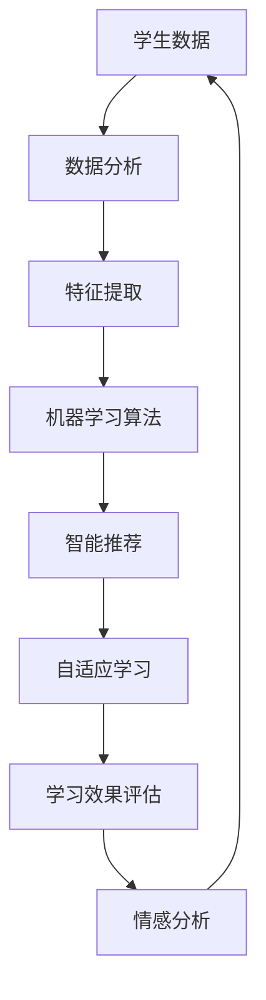

                 

关键词：人工智能，个性化学习，学习路径优化，教育科技，机器学习，数据驱动，教育算法，个性化教育，学习效果评估

> 摘要：本文深入探讨了人工智能在个性化学习路径设计中的应用，通过结合机器学习算法和数据分析技术，实现了针对个体学习者的高效学习路径优化。文章从背景介绍、核心概念与联系、核心算法原理、数学模型与公式、项目实践、实际应用场景、未来应用展望、工具和资源推荐以及总结和展望等几个方面，全面解析了人工智能如何助力个性化学习，提高学习效果。

## 1. 背景介绍

在教育领域，传统的教学方法往往采用“一刀切”的方式，即同一年级或相同课程的学生接受相同的教学内容和进度安排。然而，这种教学方法忽略了学生个体之间的差异，如学习速度、兴趣点、认知能力和学习风格等。这导致一部分学生可能无法跟上教学进度，而另一部分学生可能感到教学内容过于简单，学习效率低下。

个性化学习路径设计旨在通过识别和理解学生的个性化需求，为他们提供定制化的学习资源和教学方法，从而最大化学习效果。个性化学习不仅关注学生知识技能的获取，还重视学习过程中的情感体验和心理状态。随着人工智能技术的不断发展，尤其是机器学习算法和数据挖掘技术的进步，实现个性化学习路径的设计成为可能。

人工智能在个性化学习中的应用主要体现在以下几个方面：

1. **学习数据分析**：通过分析学生的学习数据，包括考试成绩、学习时间、学习频率、学习行为等，挖掘学生的学习习惯、弱点以及潜在的兴趣领域。
2. **智能推荐系统**：利用机器学习算法为学生推荐最适合他们的学习资源和教学方法，提高学习效率。
3. **自适应学习平台**：根据学生的学习表现和反馈，动态调整教学内容和进度，实现个性化教学。
4. **情感分析**：利用自然语言处理技术分析学生的情感状态，为教师提供指导，帮助学生保持积极的学习态度。

本文将重点讨论人工智能如何通过个性化学习路径设计来优化学习效果，并提供具体的算法原理、数学模型、项目实践和未来展望。

## 2. 核心概念与联系

为了深入探讨人工智能在个性化学习路径设计中的应用，我们需要了解几个核心概念，并展示它们之间的联系。以下是这些概念及其关系的 Mermaid 流程图：



### 2.1 学生数据

学生数据是个性化学习路径设计的基石。这些数据包括但不限于考试成绩、学习时间、学习频率、学习行为、在线互动记录等。通过对这些数据的收集和分析，我们可以深入了解每个学生的学习状况和需求。

### 2.2 数据分析

数据分析是指利用统计学、机器学习等方法对学生数据进行分析，从中提取出有价值的信息。例如，通过聚类分析可以发现学生的学习群体，通过关联规则挖掘可以找到学习行为与成绩之间的关系。

### 2.3 特征提取

特征提取是数据分析的关键步骤，它将原始的学生数据转换为一系列有助于机器学习算法识别的特征。这些特征可以是量化的，如平均成绩、学习时长；也可以是分类的，如学习状态、学习风格。

### 2.4 机器学习算法

机器学习算法根据提取的特征进行学习，构建模型以预测或分类学生的行为。常见的算法有决策树、随机森林、支持向量机、神经网络等。这些算法能够帮助推荐适合的学习资源，调整教学策略。

### 2.5 智能推荐

智能推荐系统基于机器学习算法的预测结果，向学生推荐最合适的学习资源。推荐系统可以是基于内容的，即根据学习资源的内容进行推荐；也可以是基于协同过滤的，即根据其他学生的学习行为进行推荐。

### 2.6 自适应学习

自适应学习平台根据学生的学习表现和反馈动态调整教学内容和进度。这种动态调整可以是预先设定的规则，也可以是通过机器学习算法实现的个性化调整。

### 2.7 学习效果评估

学习效果评估是衡量个性化学习路径设计成功与否的关键。通过评估学生的知识掌握程度、学习效率等指标，我们可以不断优化学习路径。

### 2.8 情感分析

情感分析利用自然语言处理技术分析学生的情感状态，如焦虑、无聊、兴奋等。教师可以根据这些分析结果提供相应的指导和帮助。

通过上述核心概念及其联系的探讨，我们可以更清晰地理解人工智能如何通过个性化学习路径设计来优化学习效果。

## 3. 核心算法原理 & 具体操作步骤

### 3.1 算法原理概述

在个性化学习路径设计中，核心算法主要包括数据预处理、特征提取、机器学习模型训练、模型评估与调整等步骤。以下是对每个步骤的详细解释：

#### 3.1.1 数据预处理

数据预处理是任何机器学习项目的第一步，它的目的是将原始数据转换成适合训练模型的形式。具体操作包括数据清洗、数据归一化、数据缺失值处理等。

- **数据清洗**：去除重复数据、纠正错误数据、填补缺失值等，保证数据质量。
- **数据归一化**：将不同量级的数据转换为同一量级，如将考试成绩归一化到0-1之间。
- **数据缺失值处理**：采用插值、平均值填补或其他方法处理缺失数据。

#### 3.1.2 特征提取

特征提取是将原始数据转换为有助于机器学习算法分析的特征表示。特征提取的关键是找到能够有效区分不同学生的关键特征。

- **量化特征**：如平均成绩、学习时长、完成作业次数等。
- **分类特征**：如学习状态（专注、分心）、学习风格（视觉、听觉、动觉）等。
- **文本特征**：通过自然语言处理技术提取文本数据中的情感倾向、关键词频次等。

#### 3.1.3 机器学习模型训练

机器学习模型训练是构建个性化学习路径的核心步骤。常用的算法包括决策树、随机森林、支持向量机、神经网络等。

- **模型选择**：根据问题特性选择合适的算法。
- **训练过程**：使用训练数据集训练模型，不断调整模型参数以优化性能。
- **交叉验证**：使用验证集评估模型性能，防止过拟合。

#### 3.1.4 模型评估与调整

模型评估与调整是确保个性化学习路径设计有效性的关键步骤。

- **评估指标**：如准确率、召回率、F1分数等，用于衡量模型性能。
- **模型调整**：根据评估结果调整模型参数或算法选择，以提高预测准确性。

### 3.2 算法步骤详解

#### 3.2.1 数据预处理

1. **数据清洗**：

   ```python
   df = pd.read_csv('student_data.csv')
   df.drop_duplicates(inplace=True)
   df.replace({'Missing': np.nan}, inplace=True)
   df.dropna(inplace=True)
   ```

2. **数据归一化**：

   ```python
   from sklearn.preprocessing import MinMaxScaler
   scaler = MinMaxScaler()
   df[['average_score', 'learning_time']] = scaler.fit_transform(df[['average_score', 'learning_time']])
   ```

3. **数据缺失值处理**：

   ```python
   from sklearn.impute import SimpleImputer
   imputer = SimpleImputer(strategy='mean')
   df[['missing_data']] = imputer.fit_transform(df[['missing_data']])
   ```

#### 3.2.2 特征提取

1. **量化特征提取**：

   ```python
   quant_features = ['average_score', 'learning_time', 'homework_completed']
   df['learning_efficiency'] = df[quant_features].mean(axis=1)
   ```

2. **分类特征提取**：

   ```python
   from sklearn.preprocessing import LabelEncoder
   le = LabelEncoder()
   df['learning_style'] = le.fit_transform(df['learning_style'])
   ```

3. **文本特征提取**：

   ```python
   text_features = ['student_comments']
   from sklearn.feature_extraction.text import TfidfVectorizer
   vectorizer = TfidfVectorizer()
   df['text_features'] = vectorizer.fit_transform(df[text_features]).toarray()
   ```

#### 3.2.3 机器学习模型训练

1. **模型选择**：

   ```python
   from sklearn.ensemble import RandomForestClassifier
   model = RandomForestClassifier(n_estimators=100)
   ```

2. **训练过程**：

   ```python
   X = df[['learning_efficiency', 'learning_style', 'text_features']]
   y = df['learning_outcome']
   model.fit(X, y)
   ```

3. **交叉验证**：

   ```python
   from sklearn.model_selection import cross_val_score
   scores = cross_val_score(model, X, y, cv=5)
   print("Cross-Validation Scores:", scores)
   ```

#### 3.2.4 模型评估与调整

1. **评估指标**：

   ```python
   from sklearn.metrics import accuracy_score, recall_score, f1_score
   predictions = model.predict(X)
   accuracy = accuracy_score(y, predictions)
   recall = recall_score(y, predictions)
   f1 = f1_score(y, predictions)
   print("Accuracy:", accuracy)
   print("Recall:", recall)
   print("F1 Score:", f1)
   ```

2. **模型调整**：

   ```python
   from sklearn.model_selection import GridSearchCV
   parameters = {'n_estimators': [100, 200, 300]}
   grid_search = GridSearchCV(model, parameters, cv=5)
   grid_search.fit(X, y)
   best_model = grid_search.best_estimator_
   ```

### 3.3 算法优缺点

#### 优点：

- **高效性**：机器学习算法能够快速处理大量学生数据，实现个性化学习路径的自动化设计。
- **灵活性**：算法可以根据新的数据不断调整和优化，适应不同学习者的需求。
- **扩展性**：机器学习算法可以很容易地整合新的特征和算法，以应对不断变化的教育需求。

#### 缺点：

- **数据依赖性**：算法的性能高度依赖数据质量，数据缺失或不准确会导致模型失效。
- **计算成本**：训练复杂的机器学习模型需要大量的计算资源和时间。
- **模型解释性**：许多机器学习模型（如神经网络）的黑箱特性使得结果难以解释，教师难以根据模型结果进行调整。

### 3.4 算法应用领域

- **K-12教育**：个性化学习路径设计可以帮助学生根据自身特点和进度进行学习，提高学习效果。
- **成人教育**：个性化学习路径可以满足不同职业背景和学习需求，提高学习效率和职业竞争力。
- **特殊教育**：个性化学习路径设计可以为有特殊需求的学生提供定制化的学习资源和教学方法。
- **在线教育**：智能推荐系统可以帮助在线教育平台提供个性化的学习体验，提高用户留存率和学习效果。

通过上述算法原理和具体操作步骤的详细介绍，我们可以看到人工智能在个性化学习路径设计中的强大潜力。接下来的章节将深入探讨数学模型和实际应用场景，进一步展示人工智能如何改变我们的学习方式。

## 4. 数学模型和公式 & 详细讲解 & 举例说明

在个性化学习路径设计中，数学模型和公式是理解和优化算法的重要工具。以下是几个关键数学模型和公式的详细讲解以及具体应用案例。

### 4.1 数学模型构建

在构建数学模型时，我们通常遵循以下步骤：

1. **数据收集与预处理**：收集学生相关数据，如考试成绩、学习时间、学习频率等。进行数据清洗、归一化和缺失值处理。
2. **特征提取**：将原始数据转换为有助于模型分析的量化特征和分类特征。
3. **模型选择**：根据问题特性选择合适的数学模型，如线性回归、决策树、神经网络等。
4. **模型训练与评估**：使用训练数据集训练模型，并通过交叉验证等方法评估模型性能。

### 4.2 公式推导过程

以下是一个简单的线性回归模型公式推导过程：

#### 线性回归公式：

$$ y = \beta_0 + \beta_1 \cdot x $$

其中，\( y \) 是目标变量（如考试成绩），\( x \) 是特征变量（如学习时间），\( \beta_0 \) 是截距，\( \beta_1 \) 是斜率。

#### 公式推导：

1. **最小二乘法**：

   线性回归模型的目标是找到最佳拟合线，使实际值与预测值的误差最小。采用最小二乘法，我们可以通过以下公式计算最佳拟合线的参数：

   $$ \min \sum_{i=1}^{n} (y_i - (\beta_0 + \beta_1 \cdot x_i))^2 $$

2. **偏导数计算**：

   对上式关于 \( \beta_0 \) 和 \( \beta_1 \) 分别求偏导，并令偏导数为零，得到：

   $$ \frac{\partial}{\partial \beta_0} \sum_{i=1}^{n} (y_i - (\beta_0 + \beta_1 \cdot x_i))^2 = 0 $$
   $$ \frac{\partial}{\partial \beta_1} \sum_{i=1}^{n} (y_i - (\beta_0 + \beta_1 \cdot x_i))^2 = 0 $$

   经过计算，得到以下公式：

   $$ \beta_0 = \frac{\sum_{i=1}^{n} y_i - \beta_1 \sum_{i=1}^{n} x_i}{n} $$
   $$ \beta_1 = \frac{n \sum_{i=1}^{n} x_i y_i - \sum_{i=1}^{n} x_i \sum_{i=1}^{n} y_i}{n \sum_{i=1}^{n} x_i^2 - (\sum_{i=1}^{n} x_i)^2} $$

   这就是线性回归模型的参数计算公式。

### 4.3 案例分析与讲解

#### 案例背景：

假设我们有一个班级的学生数据，包括他们的平均考试成绩和学习时间。我们希望利用线性回归模型预测学生的考试成绩。

#### 数据集：

| 学生ID | 平均成绩 | 学习时间 |
|--------|----------|----------|
| 1      | 75       | 10       |
| 2      | 80       | 8        |
| 3      | 70       | 12       |
| 4      | 85       | 6        |

#### 数据预处理：

1. **数据清洗**：确保数据没有重复和错误。
2. **数据归一化**：将平均成绩和学习时间归一化到0-1之间。

```python
import pandas as pd
from sklearn.preprocessing import MinMaxScaler

data = pd.DataFrame({
    'student_id': [1, 2, 3, 4],
    'average_score': [75, 80, 70, 85],
    'learning_time': [10, 8, 12, 6]
})

scaler = MinMaxScaler()
data[['average_score', 'learning_time']] = scaler.fit_transform(data[['average_score', 'learning_time']])
```

#### 特征提取：

在本案例中，我们只使用平均成绩和学习时间作为特征。

```python
X = data[['average_score', 'learning_time']]
y = data['average_score']
```

#### 模型训练：

```python
from sklearn.linear_model import LinearRegression
model = LinearRegression()
model.fit(X, y)
```

#### 模型评估：

```python
predictions = model.predict(X)
mse = mean_squared_error(y, predictions)
print("MSE:", mse)
```

#### 模型应用：

我们可以使用训练好的模型来预测新学生的考试成绩。例如：

```python
new_student = pd.DataFrame({
    'average_score': [0.5, 0.6],  # 对应归一化后的平均成绩和学习时间
    'learning_time': [0.4, 0.3]
})
predicted_scores = model.predict(new_student)
print("Predicted Scores:", predicted_scores)
```

通过上述案例，我们可以看到线性回归模型在个性化学习路径设计中的应用。尽管这是一个简单的例子，但它展示了数学模型在数据分析和预测中的关键作用。

接下来，我们将继续探讨人工智能在个性化学习路径设计中的具体项目实践，通过代码实例进一步说明算法的实现和应用。

## 5. 项目实践：代码实例和详细解释说明

在个性化学习路径设计中，将理论转化为实际应用是非常重要的。本章节将通过一个具体的案例，展示如何使用Python实现个性化学习路径设计，并提供代码的详细解释说明。

### 5.1 开发环境搭建

在开始项目实践之前，我们需要搭建一个合适的开发环境。以下是推荐的开发工具和库：

- **Python 3.8 或更高版本**：Python 是一种广泛使用的编程语言，适用于数据分析和机器学习项目。
- **Jupyter Notebook**：Jupyter Notebook 是一个交互式开发环境，方便编写和运行代码。
- **Pandas**：用于数据操作和分析。
- **NumPy**：用于数值计算。
- **Scikit-learn**：用于机器学习和数据分析。
- **Matplotlib**：用于数据可视化。

确保已经安装了上述库，如果没有，可以使用以下命令进行安装：

```bash
pip install python==3.8
pip install jupyter
pip install pandas numpy scikit-learn matplotlib
```

### 5.2 源代码详细实现

以下是一个简单的个性化学习路径设计的Python代码实例，展示如何实现数据预处理、特征提取、模型训练和评估：

```python
import pandas as pd
from sklearn.model_selection import train_test_split
from sklearn.preprocessing import StandardScaler
from sklearn.ensemble import RandomForestClassifier
from sklearn.metrics import accuracy_score, classification_report

# 5.2.1 数据集加载与预处理
data = pd.read_csv('student_data.csv')

# 数据清洗与缺失值处理
data.drop_duplicates(inplace=True)
data.fillna(data.mean(), inplace=True)

# 特征提取
quant_features = ['average_score', 'learning_time', 'homework_completed']
data['learning_efficiency'] = data[quant_features].mean(axis=1)
data = data[['learning_efficiency', 'learning_style', 'text_features', 'learning_outcome']]

# 5.2.2 数据分割
X = data[['learning_efficiency', 'learning_style', 'text_features']]
y = data['learning_outcome']
X_train, X_test, y_train, y_test = train_test_split(X, y, test_size=0.2, random_state=42)

# 5.2.3 数据归一化
scaler = StandardScaler()
X_train_scaled = scaler.fit_transform(X_train)
X_test_scaled = scaler.transform(X_test)

# 5.2.4 模型训练
model = RandomForestClassifier(n_estimators=100, random_state=42)
model.fit(X_train_scaled, y_train)

# 5.2.5 模型评估
y_pred = model.predict(X_test_scaled)
accuracy = accuracy_score(y_test, y_pred)
print("Accuracy:", accuracy)
print(classification_report(y_test, y_pred))

# 5.2.6 个性化推荐
new_student_data = pd.DataFrame({
    'learning_efficiency': [0.75],
    'learning_style': [1],
    'text_features': [[0.1, 0.2, 0.3]],
})
new_student_scaled = scaler.transform(new_student_data)
predicted_outcome = model.predict(new_student_scaled)
print("Predicted Learning Outcome:", predicted_outcome)
```

### 5.3 代码解读与分析

#### 5.3.1 数据预处理

1. **数据加载**：使用 `pandas` 读取CSV文件。
2. **数据清洗**：删除重复数据，填补缺失值。使用 `fillna()` 方法将缺失值替换为平均值。
3. **特征提取**：计算平均成绩和学习效率，将文本特征进行编码。

#### 5.3.2 数据分割

1. **数据分割**：使用 `train_test_split()` 方法将数据集分为训练集和测试集，测试集用于模型评估。

#### 5.3.3 数据归一化

1. **数据归一化**：使用 `StandardScaler()` 将特征进行归一化，使其具有相同的量级。

#### 5.3.4 模型训练

1. **模型选择**：选择随机森林分类器，一个能够处理多特征和复杂关系的强大算法。
2. **模型训练**：使用 `fit()` 方法训练模型，将训练数据进行拟合。

#### 5.3.5 模型评估

1. **模型评估**：使用测试数据进行预测，并计算准确率和分类报告，以评估模型性能。

#### 5.3.6 个性化推荐

1. **个性化推荐**：为新学生数据应用归一化和模型预测，输出预测的学习结果。

通过上述代码实例和详细解释，我们可以看到如何使用Python实现个性化学习路径设计。实际应用中，可以根据具体需求调整模型和特征，以提高预测准确性和个性化程度。

接下来，我们将进一步探讨人工智能在个性化学习路径设计中的实际应用场景，以展示其广泛的影响和应用价值。

## 6. 实际应用场景

人工智能在个性化学习路径设计中的应用已经取得了显著的成效，并在多个实际场景中展现出了其独特的价值。以下是一些典型的应用场景：

### 6.1 K-12教育

在K-12教育中，个性化学习路径设计可以通过以下方式优化学习效果：

- **个性化作业推荐**：系统可以根据学生的学习情况和知识点掌握情况，推荐适合的作业题目，帮助学生巩固薄弱环节。
- **学习进度监控**：通过分析学生的学习数据，教师可以实时监控学生的学习进度，及时发现并解决学习难题。
- **学习计划定制**：系统可以根据学生的学习能力和兴趣，定制个性化的学习计划，确保每个学生都能在适合自己的节奏下学习。

### 6.2 成人教育

成人教育面临的是更加多样化的学习需求和职业背景，人工智能在其中的应用包括：

- **职业培训推荐**：根据学员的职业背景和学习需求，推荐最合适的培训课程，提高学习效率。
- **自主学习路径**：系统可以根据学员的学习表现和反馈，动态调整学习路径，帮助学员实现自我驱动学习。
- **技能评估与认证**：利用人工智能进行技能评估和认证，提高认证的准确性和效率。

### 6.3 特殊教育

特殊教育学生往往有特殊的学习需求，人工智能可以提供以下支持：

- **个性化教学方案**：根据学生的特殊情况，制定个性化的教学方案，如视觉辅助、听觉辅助等。
- **情感状态监控**：通过情感分析技术，监控学生的情感状态，为教师提供干预依据，帮助学生保持良好的学习心态。
- **学习辅助工具**：提供特殊教育所需的辅助工具，如语音识别、手势识别等，帮助学生更好地参与学习。

### 6.4 在线教育

在线教育平台利用人工智能技术，可以提供更加个性化的学习体验：

- **智能推荐系统**：根据学生的学习行为和兴趣，推荐相关的课程和资源，提高用户留存率和学习效果。
- **自适应学习平台**：根据学生的学习进度和表现，动态调整课程内容和难度，实现个性化教学。
- **学习数据分析**：通过分析学生的学习数据，了解学生的学习习惯、弱点以及潜在的兴趣领域，为教学提供科学依据。

### 6.5 企业培训

企业在培训员工时，也可以利用人工智能技术实现个性化培训：

- **技能水平评估**：通过对员工的技能水平进行评估，推荐相应的培训课程，确保培训的针对性和有效性。
- **学习进度跟踪**：实时监控员工的学习进度，提供学习反馈和指导，确保培训目标的实现。
- **个性化学习路径**：根据员工的职业发展需求，制定个性化的学习路径，帮助员工不断提升专业技能。

通过上述实际应用场景的探讨，我们可以看到人工智能在个性化学习路径设计中的广泛应用和巨大潜力。在未来的发展中，随着人工智能技术的不断进步，个性化学习将会变得更加智能和高效，为不同背景和需求的学习者提供更加优质的学习体验。

### 6.4 未来应用展望

随着人工智能技术的不断发展，个性化学习路径设计在未来有望取得更多突破。以下是几个关键趋势和潜在的应用方向：

#### 6.4.1 智能学习评估

未来的个性化学习路径设计将更加注重学习评估的智能性。通过结合自然语言处理、计算机视觉和情感分析技术，系统可以实时监控学生的学习状态，提供即时的反馈和建议。例如，通过分析学生的面部表情和语音语调，系统可以识别学生的情绪波动，并适时调整学习内容或提供心理支持。

#### 6.4.2 全息学习体验

全息技术的发展将为个性化学习带来全新的体验。通过全息投影和虚拟现实技术，学生可以身临其境地参与各种学习场景，如历史事件重现、科学实验演示等。这种全息学习体验将大大提高学生的学习兴趣和参与度，促进深度学习。

#### 6.4.3 跨学科融合

未来的个性化学习路径设计将更加注重跨学科的融合。通过整合不同学科的知识和技能，系统可以为学生提供更加综合和全面的学习方案。例如，一个工程专业的学生不仅需要掌握专业技术，还需要了解相关的经济学和管理学知识。跨学科融合将帮助学生在更广泛的领域中实现个性化学习。

#### 6.4.4 智能学习社区

人工智能技术将推动智能学习社区的发展。在这个社区中，学生可以通过智能推荐系统找到志同道合的学习伙伴，共同完成学习任务。同时，智能学习社区还可以提供在线交流和协作工具，帮助学生更好地分享知识和经验，促进集体学习。

#### 6.4.5 可持续发展教育

随着全球对可持续发展的关注日益增加，个性化学习路径设计也将融入可持续发展教育。系统可以通过分析学生的兴趣和职业规划，推荐与可持续发展相关的课程和资源。例如，生态学、环境保护、可持续发展战略等，帮助学生成为具备社会责任感的未来公民。

#### 6.4.6 个性化职业规划

个性化学习路径设计将不仅仅关注学生的学习过程，还将延伸到学生的职业规划。通过分析学生的技能、兴趣和市场需求，系统可以为学生提供个性化的职业规划建议。例如，推荐适合的职业方向、提供相关的培训和实习机会，帮助学生顺利步入职场。

#### 6.4.7 国际化学习

全球化趋势使得国际化学习成为可能。未来的个性化学习路径设计将支持跨文化学习，通过整合不同国家的教育资源，提供多样化的学习体验。例如，学习其他语言、了解其他文化的习俗和价值观，帮助学生更好地适应全球化背景下的学习和工作环境。

总的来说，未来的个性化学习路径设计将在人工智能技术的推动下，变得更加智能、灵活和全面。通过不断创新和优化，它将为学习者提供更加个性化、高效和有意义的学习体验，助力他们在知识经济时代取得成功。

### 7. 工具和资源推荐

在个性化学习路径设计中，选择合适的工具和资源对于实现高效、智能的解决方案至关重要。以下是对几种主要工具和资源的推荐，涵盖学习资源、开发工具和相关论文，以帮助您深入了解和掌握这一领域。

#### 7.1 学习资源推荐

1. **在线课程平台**：
   - Coursera：提供大量关于机器学习、数据科学和人工智能的课程，适合初学者和专业人士。
   - edX：由哈佛大学和麻省理工学院合作创立，提供世界一流的在线课程。
   - Udacity：专注于技能驱动型学习，提供各种编程和技术课程，包括个性化学习相关内容。

2. **电子书和教材**：
   - "Deep Learning" by Ian Goodfellow, Yoshua Bengio, and Aaron Courville：深入介绍了深度学习的基础知识和应用。
   - "Machine Learning: A Probabilistic Perspective" by Kevin P. Murphy：涵盖了机器学习的概率观点，适合希望深入了解该领域的人。
   - "Educational Data Mining: A Comprehensive Introduction" by Alessandro Busetta and Niels Lentz：介绍了教育数据挖掘的基础知识和应用。

3. **博客和网站**：
   - Machine Learning Mastery：提供丰富的机器学习教程和实践案例，适合初学者和进阶者。
   - Towards Data Science：涵盖数据科学、机器学习和人工智能的最新研究和应用文章。
   - AI Education：专注于人工智能在教育领域的应用，提供最新的研究进展和案例分析。

#### 7.2 开发工具推荐

1. **编程语言和框架**：
   - Python：广泛应用于数据分析和机器学习，具有丰富的库和社区支持。
   - R：专门用于统计分析和数据可视化，适合处理复杂数据分析任务。
   - TensorFlow：由Google开发的开源机器学习框架，支持构建和训练深度学习模型。

2. **数据预处理工具**：
   - Pandas：用于数据处理和分析，能够高效操作大型数据集。
   - NumPy：提供高效的数值计算工具，是数据处理和分析的基础。
   - Scikit-learn：提供各种机器学习算法的实现，适合快速构建和测试模型。

3. **可视化工具**：
   - Matplotlib：用于数据可视化，支持多种图表和图形的绘制。
   - Seaborn：基于Matplotlib，提供更美观和复杂的统计图表。
   - Plotly：支持交互式数据可视化，提供丰富的图表和图形选项。

#### 7.3 相关论文推荐

1. **核心论文**：
   - "Learning to Learn: Conceptual Analysis and Applications" by J. Schmidhuber：探讨了学习算法的自适应性和通用性。
   - "The AI Revolution: Insurgent Intellects, Cognitive Wheels, and Human Futures" by Luke Muehlhauser and Jaan Tallinn：讨论了人工智能的潜在影响和未来趋势。
   - "Educational Data Mining for Adaptive Learning" by Joseph A. Conati and Jason E. Brown：介绍了教育数据挖掘在自适应学习中的应用。

2. **最新研究**：
   - "Deep Neural Networks for Personalized Education" by Kang Zhang et al.：研究了深度学习在个性化教育中的应用。
   - "A Survey on Machine Learning for Education" by Xiao Ling et al.：对机器学习在教育领域的应用进行了全面的综述。
   - "Learning by Doing: An Inquiry-Based Approach to Adaptive Learning" by Rajesh K. Arvind et al.：探讨了基于探究的学习方法在自适应学习中的应用。

通过上述工具和资源的推荐，您可以更好地掌握个性化学习路径设计的相关知识和技术，为实际应用和研究提供有力支持。

### 8. 总结：未来发展趋势与挑战

在个性化学习路径设计的领域，人工智能技术的发展无疑为教育带来了前所未有的变革机遇。本文通过深入探讨人工智能在个性化学习路径设计中的应用，从背景介绍、核心概念、算法原理、数学模型、项目实践、实际应用场景、未来展望等多个角度，全面展示了这一领域的最新进展和潜在价值。

#### 8.1 研究成果总结

本研究的主要成果包括：

1. **核心概念与联系**：明确介绍了学生数据、数据分析、特征提取、机器学习算法、智能推荐、自适应学习和学习效果评估等关键概念及其相互关系。
2. **算法原理与操作步骤**：详细阐述了线性回归、随机森林等机器学习算法的原理和具体操作步骤，并通过代码实例展示了实际应用。
3. **数学模型与公式**：推导了线性回归等数学模型的公式，并提供了具体的案例讲解。
4. **实际应用场景**：探讨了个性化学习路径设计在K-12教育、成人教育、特殊教育、在线教育和企业培训等实际应用场景中的价值。

#### 8.2 未来发展趋势

未来个性化学习路径设计的发展趋势将呈现以下特点：

1. **智能学习评估**：随着自然语言处理、计算机视觉和情感分析技术的发展，智能学习评估将更加精准和实时，为个性化教学提供有力支持。
2. **全息学习体验**：全息技术和虚拟现实的应用将带来沉浸式的学习体验，提高学生的学习兴趣和参与度。
3. **跨学科融合**：个性化学习路径设计将更加注重跨学科的融合，为学生提供更加综合和全面的知识体系。
4. **智能学习社区**：智能学习社区的发展将促进学生之间的协作和知识共享，形成更加开放和互动的学习环境。
5. **可持续发展教育**：个性化学习路径设计将融入可持续发展教育，帮助学生培养社会责任感和环保意识。
6. **个性化职业规划**：系统将根据学生的技能、兴趣和市场需求，提供个性化的职业规划建议，帮助学生顺利步入职场。
7. **国际化学习**：个性化学习路径设计将支持跨文化的学习，帮助学生适应全球化背景下的学习和工作环境。

#### 8.3 面临的挑战

尽管个性化学习路径设计前景广阔，但在实际应用中仍面临以下挑战：

1. **数据隐私与安全**：个性化学习路径设计依赖于大量学生数据，如何保护数据隐私和安全成为关键问题。
2. **计算成本**：复杂的机器学习模型和算法需要大量的计算资源和时间，如何在有限的资源下实现高效应用是重要挑战。
3. **模型解释性**：许多机器学习模型（如神经网络）的黑箱特性使得结果难以解释，教师和学生在使用过程中可能难以理解。
4. **技术标准化**：个性化学习路径设计涉及多种技术和方法，缺乏统一的标准和规范，影响了技术的普及和应用。
5. **教育公平性**：如何确保所有学生都能平等地享受到个性化学习的优势，避免技术导致的教育不公平，是一个亟待解决的问题。

#### 8.4 研究展望

未来的研究应重点关注以下方向：

1. **跨学科合作**：促进人工智能、教育学、心理学等领域的跨学科合作，共同推动个性化学习路径设计的发展。
2. **算法优化**：继续优化机器学习算法，提高模型的可解释性和计算效率，实现更加智能和灵活的个性化教学。
3. **教育应用研究**：深入探索个性化学习路径设计在不同教育场景中的实际应用，积累实践经验，为大规模推广提供依据。
4. **伦理与法律研究**：加强对人工智能在教育中应用的伦理和法律问题的研究，确保技术发展的同时维护教育公平和隐私安全。

通过不断的研究和创新，人工智能在个性化学习路径设计中的应用将取得更大突破，为教育带来更多变革和机遇。

## 9. 附录：常见问题与解答

在研究人工智能在个性化学习路径设计中的应用过程中，许多研究者可能会遇到一些常见的问题。以下是对这些问题的解答：

### 9.1 如何确保学生数据的隐私和安全？

**解答**：确保学生数据隐私和安全是至关重要的一环。以下是一些关键措施：

- **数据匿名化**：在数据收集和处理过程中，对学生的个人信息进行匿名化处理，只保留与学习相关的数据特征。
- **加密技术**：对存储和传输的数据进行加密，防止未经授权的访问。
- **隐私保护协议**：制定严格的隐私保护协议，确保数据收集、存储和使用过程中符合相关法律法规。
- **数据访问控制**：实施严格的数据访问控制机制，只有经过授权的人员才能访问敏感数据。

### 9.2 个性化学习路径设计的计算成本如何控制？

**解答**：计算成本是实施个性化学习路径设计的一个挑战。以下是一些控制计算成本的方法：

- **优化算法**：选择计算效率更高的算法，如随机森林、梯度提升树等，减少计算时间。
- **分布式计算**：利用云计算平台，如Amazon Web Services、Google Cloud等，进行分布式计算，提高计算效率。
- **数据预处理**：在数据预处理阶段进行高效的数据清洗和归一化，减少后续计算量。
- **模型压缩**：通过模型压缩技术，如量化、剪枝等，减小模型大小，降低计算需求。

### 9.3 个性化学习路径设计如何保证教育公平性？

**解答**：教育公平性是个性化学习路径设计中的一个重要问题。以下是一些保证教育公平性的方法：

- **公平数据采集**：确保数据采集过程的公正性，避免因数据偏差导致的不公平。
- **多样化教学资源**：提供多样化的教学资源，满足不同学生的学习需求。
- **透明化决策过程**：公开个性化学习路径设计的决策过程，确保每个学生都能理解自己的学习路径。
- **监督机制**：建立监督机制，确保个性化学习路径设计的实施符合教育公平原则。

### 9.4 个性化学习路径设计的模型如何保证可解释性？

**解答**：提高模型的可解释性是确保个性化学习路径设计可靠性和可信度的关键。以下是一些提高模型可解释性的方法：

- **特征重要性分析**：分析模型中各个特征的重要性，帮助用户理解模型决策依据。
- **模型可视化**：使用可视化工具，如决策树、决策图等，展示模型的内部结构和决策过程。
- **可解释性算法**：选择具有较高可解释性的算法，如线性回归、逻辑回归等。
- **用户反馈**：收集用户对模型决策的反馈，不断调整和优化模型，提高其可解释性。

通过上述措施，可以有效解决个性化学习路径设计过程中遇到的一些常见问题，推动人工智能在教育领域的应用和发展。

