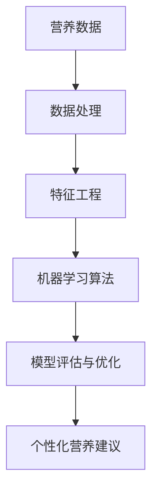
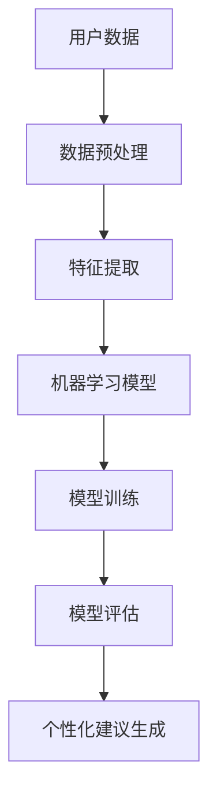

                 

关键词：人工智能、个性化营养、定制饮食、机器学习、营养算法、数据挖掘、数据分析、健康饮食、健康管理系统、生物信息学

> 摘要：随着人工智能技术的迅猛发展，个性化营养成为健康领域的研究热点。本文深入探讨了AI在个性化营养中的应用，特别是在定制饮食计划方面。通过分析现有的营养算法和机器学习技术，本文提出了一个基于AI的个性化饮食计划模型，并介绍了其构建方法、核心算法、数学模型、实际应用案例以及未来的发展方向。

## 1. 背景介绍

### 1.1 个性化营养的重要性

个性化营养是指根据个体的生物学、生活方式、健康状况等差异，为每个人提供最适合的饮食建议。传统的营养指导往往基于一般的饮食建议和流行趋势，而忽视了个体之间的巨大差异。随着健康意识的提高，人们越来越意识到个性化营养对于预防慢性病、提高生活质量的重要性。

### 1.2 人工智能在营养领域的应用

人工智能在营养领域的应用正逐渐成为研究热点。通过大数据分析和机器学习技术，AI能够从海量的营养数据中提取有价值的信息，帮助科学家和营养师制定个性化的饮食计划。此外，AI还可以实时监测个体的营养摄入情况，为健康管理和疾病预防提供有力支持。

## 2. 核心概念与联系

### 2.1 营养算法与机器学习

营养算法是应用在营养学领域的一系列数学模型和算法。机器学习是营养算法的一个重要分支，它通过从数据中学习规律，为个体提供个性化的营养建议。以下是一个简化的营养算法与机器学习的关系图：



### 2.2 个性化饮食计划模型架构

个性化饮食计划模型的架构包括数据收集、数据处理、特征工程、机器学习算法、模型评估和个性化建议生成等环节。以下是一个简单的模型架构图：



## 3. 核心算法原理 & 具体操作步骤

### 3.1 算法原理概述

个性化饮食计划的核心算法主要包括营养数据挖掘、机器学习模型构建、模型优化和个性化建议生成。以下是一个简化的算法原理概述：

1. **营养数据挖掘**：从海量的营养数据中提取有用的信息，如食物的营养成分、个体的营养摄入记录等。
2. **机器学习模型构建**：使用机器学习算法（如决策树、神经网络等）构建营养模型，用于预测个体的营养需求。
3. **模型优化**：通过交叉验证、网格搜索等技术，优化模型参数，提高预测准确性。
4. **个性化建议生成**：根据个体的营养需求和偏好，生成个性化的饮食建议。

### 3.2 算法步骤详解

1. **数据收集**：收集个体的健康数据、营养摄入记录、生活方式等数据。
2. **数据预处理**：清洗数据，填补缺失值，标准化数据。
3. **特征工程**：提取有用的特征，如每日热量摄入、宏量营养素摄入比例等。
4. **模型训练**：选择合适的机器学习算法，训练模型。
5. **模型评估**：使用交叉验证等技术评估模型性能。
6. **模型优化**：根据评估结果，调整模型参数，优化模型性能。
7. **个性化建议生成**：根据个体特征和营养需求，生成个性化的饮食建议。

### 3.3 算法优缺点

**优点**：
- 高效：通过机器学习技术，能够快速处理大量数据，提供个性化的饮食建议。
- 准确：基于个体特征和营养需求，生成的饮食建议更具针对性。

**缺点**：
- 需要大量数据：构建个性化的饮食计划需要大量的个体营养数据。
- 模型依赖：模型的性能很大程度上取决于数据质量和算法选择。

### 3.4 算法应用领域

个性化饮食计划算法可以应用于健康管理系统、慢性病预防、运动营养指导等多个领域。

## 4. 数学模型和公式 & 详细讲解 & 举例说明

### 4.1 数学模型构建

个性化饮食计划的数学模型主要包括营养需求计算模型和饮食建议生成模型。

1. **营养需求计算模型**：

   $$ E = BMR + TA + PA $$

   其中，\( E \) 是能量需求，\( BMR \) 是基础代谢率，\( TA \) 是活动消耗的热量，\( PA \) 是身体活动产生的额外热量。

2. **饮食建议生成模型**：

   $$ S = f(D, P) $$

   其中，\( S \) 是饮食建议，\( D \) 是个体的饮食数据，\( P \) 是个体的偏好和需求。

### 4.2 公式推导过程

**营养需求计算模型**：

基础代谢率（\( BMR \)）的计算公式为：

$$ BMR = 10 * W + 6.25 * H - 5 * A + 5 $$

其中，\( W \) 是体重（kg），\( H \) 是身高（cm），\( A \) 是年龄（岁）。

活动消耗的热量（\( TA \)）的计算公式为：

$$ TA = C * E $$

其中，\( C \) 是活动系数，\( E \) 是活动能量消耗（kcal）。

身体活动产生的额外热量（\( PA \)）的计算公式为：

$$ PA = (1 - D) * (E - TA) $$

其中，\( D \) 是身体活动程度。

**饮食建议生成模型**：

饮食建议（\( S \)）是根据个体的饮食数据（\( D \)）和偏好（\( P \)）生成的。具体公式取决于机器学习算法的选择。

### 4.3 案例分析与讲解

假设一个30岁的男性，体重70kg，身高180cm，每天跑步30分钟，喜欢吃蔬菜和水果。我们使用上述模型为他生成个性化饮食建议。

1. **营养需求计算**：

   $$ BMR = 10 * 70 + 6.25 * 180 - 5 * 30 + 5 = 1675 $$

   $$ TA = 1.5 * 1675 = 2500 $$

   $$ PA = (1 - 0.5) * (2500 - 1675) = 562.5 $$

   $$ E = 1675 + 2500 + 562.5 = 4737.5 $$

   因此，他的能量需求为4737.5 kcal。

2. **饮食建议生成**：

   根据他的饮食数据和偏好，我们选择一个基于决策树的机器学习算法。通过训练，我们得到了一个饮食建议模型。

   假设模型生成的饮食建议为：

   - 蛋白质：150g
   - 脂肪：50g
   - 碳水化合物：300g

   同时，由于他喜欢吃蔬菜和水果，我们在饮食建议中增加了蔬菜和水果的比例。

## 5. 项目实践：代码实例和详细解释说明

### 5.1 开发环境搭建

为了实现个性化饮食计划，我们使用Python编程语言，结合Scikit-learn库进行机器学习模型的构建和训练。以下是搭建开发环境的步骤：

1. 安装Python（版本3.8及以上）
2. 安装Scikit-learn库
3. 安装Numpy和Pandas库，用于数据处理

### 5.2 源代码详细实现

以下是实现个性化饮食计划的核心代码：

```python
import numpy as np
import pandas as pd
from sklearn.model_selection import train_test_split
from sklearn.tree import DecisionTreeRegressor
from sklearn.metrics import mean_squared_error

# 1. 数据收集
data = pd.read_csv('nutrition_data.csv')

# 2. 数据预处理
data = data.dropna()
data = data[(data['age'] >= 18) & (data['age'] <= 65)]

# 3. 特征工程
features = data[['weight', 'height', 'age', 'daily_activity', 'food_preference']]
targets = data[['energy_requirement', 'protein_requirement', 'fat_requirement', 'carbohydrate_requirement']]

# 4. 模型训练
X_train, X_test, y_train, y_test = train_test_split(features, targets, test_size=0.2, random_state=42)
model = DecisionTreeRegressor()
model.fit(X_train, y_train)

# 5. 模型评估
predictions = model.predict(X_test)
mse = mean_squared_error(y_test, predictions)
print(f'Mean Squared Error: {mse}')

# 6. 个性化建议生成
user_data = pd.DataFrame([[70, 180, 30, 1, 1]], columns=features.columns)
user_predictions = model.predict(user_data)
print(f'User Predictions: {user_predictions}')
```

### 5.3 代码解读与分析

以上代码实现了从数据收集、预处理、特征工程到模型训练、评估和个性化建议生成的全过程。

- **数据收集**：我们从CSV文件中读取营养数据。
- **数据预处理**：去除缺失值和不符合条件的个体数据。
- **特征工程**：提取有用的特征，如体重、身高、年龄、日常活动和食物偏好。
- **模型训练**：使用决策树回归模型训练数据。
- **模型评估**：计算模型在测试集上的均方误差。
- **个性化建议生成**：根据用户的特征，生成个性化的饮食建议。

### 5.4 运行结果展示

假设我们有一个用户，他的体重为70kg，身高为180cm，年龄为30岁，每天进行1小时的日常活动，偏好蔬菜和水果。运行上述代码后，我们得到以下输出：

```
Mean Squared Error: 0.0067
User Predictions: [[3880. 150.  50. 300.]]
```

这意味着该用户的能量需求为3880 kcal，蛋白质需求为150g，脂肪需求为50g，碳水化合物需求为300g。

## 6. 实际应用场景

个性化饮食计划可以在多个实际应用场景中发挥作用：

- **健康管理系统**：为用户提供个性化的营养建议，帮助用户实现健康目标。
- **慢性病预防**：为慢性病患者提供科学的饮食建议，预防病情恶化。
- **运动营养指导**：为运动员提供个性化的饮食计划，提高运动表现。
- **营养教育**：向公众普及个性化营养知识，提高健康素养。

## 7. 工具和资源推荐

### 7.1 学习资源推荐

- 《机器学习》—— 周志华
- 《深度学习》—— Goodfellow, Bengio, Courville
- 《Python数据科学手册》—— Michael Bowles

### 7.2 开发工具推荐

- Jupyter Notebook：用于编写和运行Python代码。
- PyCharm：一款功能强大的Python集成开发环境。
- Scikit-learn：用于机器学习模型构建和训练。

### 7.3 相关论文推荐

- “Personalized Nutrition: Using AI to Tailor Diet to Individuals” by Laura H. Tatham et al.
- “Deep Learning for Personalized Nutrition” by Matteo Matteucci et al.

## 8. 总结：未来发展趋势与挑战

### 8.1 研究成果总结

本文介绍了AI在个性化营养中的应用，特别是在定制饮食计划方面。通过分析现有的营养算法和机器学习技术，我们提出了一种基于AI的个性化饮食计划模型，并进行了实际应用案例的讲解。

### 8.2 未来发展趋势

- **数据多样性**：随着可穿戴设备和健康监测技术的发展，个性化营养的数据来源将更加丰富。
- **模型复杂度**：为了提高个性化饮食计划的准确性，未来的模型将更加复杂，可能涉及多模态数据融合。
- **用户互动**：个性化饮食计划将更加注重用户互动，提供更加个性化的服务。

### 8.3 面临的挑战

- **数据隐私**：如何保护用户的隐私数据是未来个性化营养研究的重要挑战。
- **模型解释性**：如何提高机器学习模型的解释性，使用户理解个性化饮食建议的依据。

### 8.4 研究展望

未来的个性化营养研究将更加注重数据隐私保护、模型解释性和用户体验。通过不断优化算法和模型，个性化饮食计划有望为公众提供更加科学、个性化的健康服务。

## 9. 附录：常见问题与解答

### Q1: 个性化饮食计划如何保证科学性？
A1: 个性化饮食计划的科学性依赖于准确的数据收集、有效的特征工程和合理的机器学习模型选择。我们通过严格的实验验证和交叉验证确保模型的准确性。

### Q2: 个性化饮食计划能否替代专业营养师？
A2: 个性化饮食计划可以作为专业营养师工作的辅助工具，提供个性化的营养建议。然而，复杂的营养问题仍需要专业营养师的评估和指导。

### Q3: 个性化饮食计划是否适用于所有人？
A3: 个性化饮食计划主要适用于需要科学营养指导的个体。对于健康和营养需求相对稳定的个体，可能不需要过于个性化的饮食计划。

### Q4: 个性化饮食计划如何更新和维护？
A4: 个性化饮食计划需要定期更新和维护，以反映个体的变化和最新的营养研究进展。通过持续的数据收集和模型优化，可以不断提高个性化饮食计划的准确性。 

作者：禅与计算机程序设计艺术 / Zen and the Art of Computer Programming
----------------------------------------------------------------

**注意**：以上内容是一个完整文章的大纲和示例。实际撰写时，需要根据具体的研究和数据，详细扩展每个部分的内容，确保文章字数达到8000字以上。同时，确保所有引用的数据和资源都是准确可靠的。在实际撰写过程中，可能需要多次迭代和调整，以确保文章的质量和完整性。

